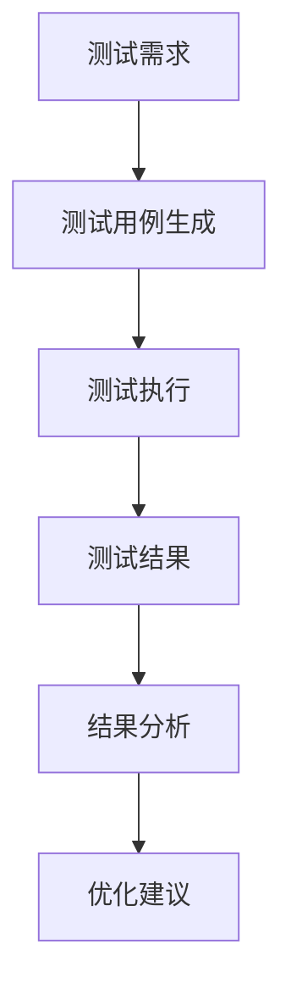
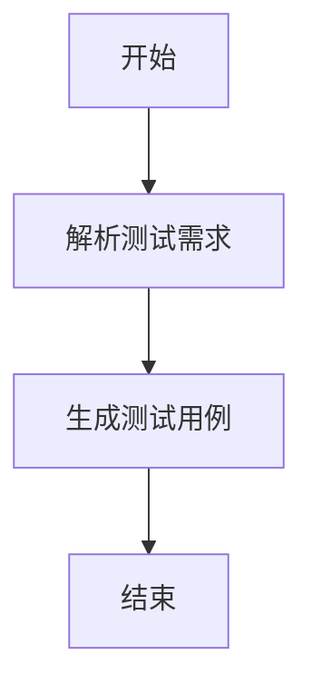
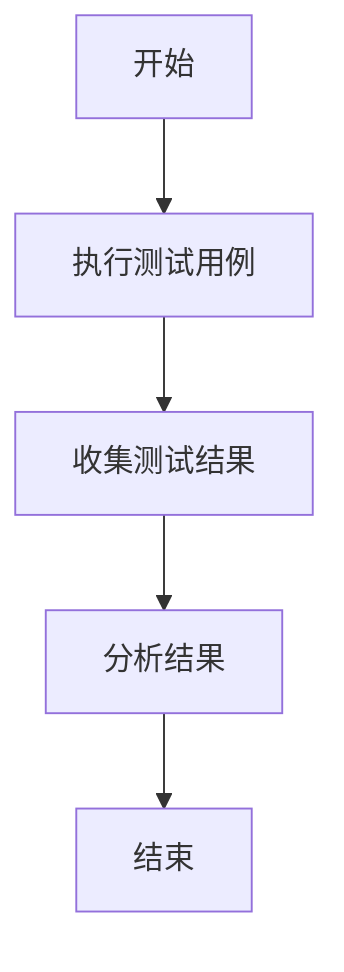
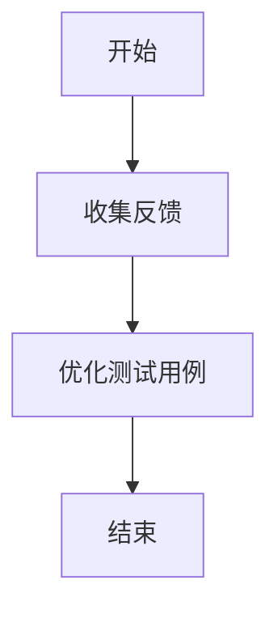
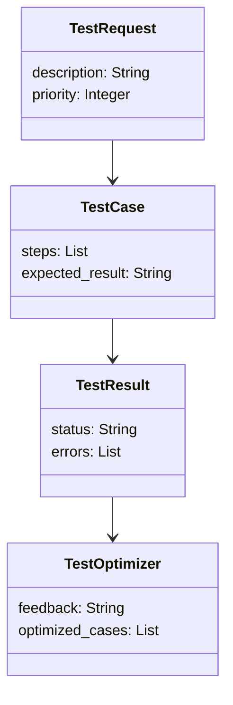
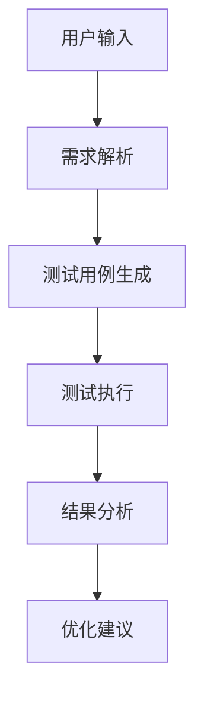
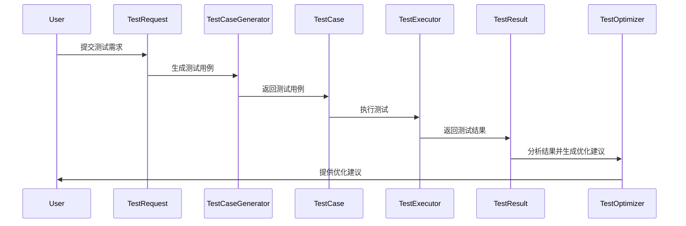

                 


---

# 自动化测试AI Agent：LLM辅助的软件质量保证

## 关键词：自动化测试，AI Agent，LLM，软件质量保证，测试用例生成，测试执行，结果分析

## 摘要：  
随着软件开发的复杂性和规模的不断增大，传统的软件测试方法已经难以满足现代开发需求。本文将介绍如何利用大语言模型（LLM）构建自动化测试AI Agent，以提升软件质量保证的效率和准确性。通过分析LLM在测试自动化中的应用，本文详细阐述了AI Agent的核心原理、算法实现、系统架构设计及实际项目中的应用案例，为读者提供了一套基于LLM的高效测试解决方案。

---

# 第一章：自动化测试AI Agent的背景与概念

## 1.1 问题背景与描述  
### 1.1.1 软件测试的挑战与痛点  
现代软件开发面临以下挑战：  
- 测试用例编写耗时且依赖人工经验。  
- 测试覆盖不全面，导致潜在缺陷未能及时发现。  
- 测试环境配置复杂，难以快速迭代。  

### 1.1.2 问题描述  
传统自动化测试工具依赖手动编写测试脚本，难以应对以下问题：  
- 动态变化的UI界面导致测试脚本频繁维护。  
- 测试数据生成缺乏智能性，难以覆盖复杂场景。  
- 测试结果分析依赖人工判断，无法快速定位问题。  

### 1.1.3 解决方案  
引入AI Agent，特别是基于LLM的AI Agent，可以实现以下目标：  
- 自动生成高质量的测试用例。  
- 智能识别测试场景中的异常行为。  
- 自动分析测试结果并给出改进建议。  

### 1.1.4 边界与外延  
- 自动化测试AI Agent专注于测试阶段，不涉及开发和部署。  
- LLM仅作为测试用例生成和结果分析的工具，不参与代码编写。  

## 1.2 核心概念与组成  
### 1.2.1 自动化测试AI Agent的定义  
自动化测试AI Agent是一种基于LLM的智能测试工具，能够通过自然语言理解与生成，协助开发人员完成测试用例设计、执行和结果分析。  

### 1.2.2 核心要素与组成结构  
- **LLM引擎**：负责生成测试用例和分析测试结果。  
- **测试执行引擎**：负责按照生成的用例执行测试。  
- **结果分析引擎**：利用LLM对测试结果进行解读和优化建议。  

### 1.2.3 与传统测试工具的对比分析  
| 对比维度 | 传统自动化测试工具 | 自动化测试AI Agent |  
|----------|---------------------|----------------------|  
| 开发成本 | 高，依赖人工编写脚本 | 低，LLM自动生成用例 |  
| 测试效率 | 低，脚本维护成本高 | 高，智能优化测试流程 |  
| 测试覆盖 | 有限，依赖人工经验 | 全面，基于LLM的智能生成 |  

---

# 第二章：AI Agent与LLM的核心原理

## 2.1 AI Agent的基本原理  
### 2.1.1 AI Agent的定义与分类  
AI Agent是一种智能代理系统，能够感知环境、理解任务并采取行动以实现目标。在测试场景中，AI Agent主要用于辅助测试用例生成和测试结果分析。  

### 2.1.2 基于LLM的AI Agent工作流程  
1. 接收测试需求描述。  
2. 利用LLM生成测试用例。  
3. 执行测试并收集结果。  
4. 利用LLM分析结果并生成改进建议。  

## 2.2 LLM的核心原理  
### 2.2.1 大语言模型的定义与特点  
LLM（Large Language Model）是一种基于深度学习的自然语言处理模型，具有以下特点：  
- 大规模训练数据：通常基于千亿级别的tokens训练。  
- 强大的上下文理解能力：能够理解复杂语义。  
- 多任务通用性：适用于多种NLP任务。  

### 2.2.2 LLM的训练与推理机制  
- **训练机制**：基于监督学习，通过海量数据预训练和微调任务。  
- **推理机制**：通过生成模型（如GPT）或检索模型（如BERT）生成文本。  

### 2.2.3 LLM在测试中的具体应用  
- **测试用例生成**：根据需求描述自动生成测试场景。  
- **异常检测**：识别测试结果中的异常行为。  
- **结果分析**：生成测试报告并提出优化建议。  

## 2.3 AI Agent与LLM的关系  
### 2.3.1 AI Agent中的LLM角色  
LLM作为AI Agent的核心组件，负责处理自然语言输入并生成测试用例。  

### 2.3.2 LLM如何增强测试能力  
- 提供智能测试用例生成，减少人工编写脚本的工作量。  
- 基于测试结果提供改进建议，优化测试流程。  

## 2.4 核心概念对比表  
| 对比维度 | AI Agent | LLM |  
|----------|-----------|-----|  
| 核心功能 | 测试辅助 | 文本生成与分析 |  
| 应用场景 | 测试用例生成、结果分析 | 多领域任务处理 |  
| 依赖性 | 需LLM支持 | 依赖训练数据 |  

## 2.5 ER实体关系图  


## 2.6 本章小结  
本章详细介绍了AI Agent和LLM的核心原理及其在测试自动化中的应用。通过对比分析，明确了AI Agent与传统测试工具的区别以及LLM在测试中的具体作用。

---

# 第三章：自动化测试AI Agent的算法原理

## 3.1 算法原理概述  
### 3.1.1 基于LLM的测试用例生成算法  
- 输入：测试需求描述。  
- 输出：结构化的测试用例。  

### 3.1.2 测试执行与结果分析算法  
- 输入：测试用例。  
- 输出：测试结果报告。  

### 3.1.3 基于反馈的优化算法  
- 输入：测试结果反馈。  
- 输出：优化后的测试用例。  

## 3.2 测试用例生成算法  
### 3.2.1 算法流程图  


### 3.2.2 Python实现代码  
```python
def generate_test_cases(description):
    # 利用LLM生成测试用例
    test_cases = llm.generate(description)
    return test_cases
```

### 3.2.3 算法步骤详细说明  
1. 解析测试需求，提取关键信息。  
2. 调用LLM生成测试用例。  
3. 输出结构化的测试用例。  

## 3.3 测试执行与结果分析算法  
### 3.3.1 算法流程图  


### 3.3.2 Python实现代码  
```python
def execute_test_cases(test_cases):
    # 执行测试用例并收集结果
    results = executor.run(test_cases)
    return results
```

### 3.3.3 算法步骤详细说明  
1. 执行测试用例，收集测试结果。  
2. 利用LLM分析结果，识别异常行为。  
3. 输出测试报告。  

## 3.4 基于反馈的优化算法  
### 3.4.1 算法流程图  


### 3.4.2 Python实现代码  
```python
def optimize_test_cases(feedback):
    # 根据反馈优化测试用例
    optimized_cases = optimizer.feedback_loop(feedback)
    return optimized_cases
```

### 3.4.3 算法步骤详细说明  
1. 收集测试结果的反馈。  
2. 利用LLM优化测试用例。  
3. 输出优化后的测试用例。  

## 3.5 数学模型与公式  
### 3.5.1 测试用例生成模型  
$$ P(\text{test case} | \text{description}) = f(\text{LLM}(description)) $$  
其中，$f$表示LLM生成测试用例的函数。  

### 3.5.2 测试结果分析模型  
$$ R(\text{result} | \text{test case}) = g(\text{LLM}(\text{result})) $$  
其中，$g$表示LLM分析测试结果的函数。  

## 3.6 本章小结  
本章详细介绍了自动化测试AI Agent的算法原理，包括测试用例生成、测试执行与结果分析以及基于反馈的优化算法，并给出了具体的Python实现代码。

---

# 第四章：系统分析与架构设计

## 4.1 问题场景介绍  
- 测试需求复杂，需要智能生成测试用例。  
- 测试环境动态变化，需要灵活的测试执行策略。  

## 4.2 系统功能设计  
### 4.2.1 领域模型Mermaid类图  


### 4.2.2 系统架构设计Mermaid架构图  


### 4.2.3 系统接口设计  
- **输入接口**：接收测试需求描述。  
- **输出接口**：输出测试用例、测试结果和优化建议。  

### 4.2.4 系统交互Mermaid序列图  


## 4.3 本章小结  
本章从系统设计的角度，详细分析了自动化测试AI Agent的架构设计，包括领域模型、系统架构、接口设计和交互流程。

---

# 第五章：项目实战

## 5.1 环境安装  
- 安装Python和必要的库（如`transformers`、`llm`）。  
- 配置测试环境。  

## 5.2 核心代码实现  
### 5.2.1 测试用例生成  
```python
from transformers import AutoTokenizer, AutoModelForCausalLM

def generate_test_cases(description):
    tokenizer = AutoTokenizer.from_pretrained("gpt2")
    model = AutoModelForCausalLM.from_pretrained("gpt2")
    inputs = tokenizer(description, return_tensors="np")
    outputs = model.generate(inputs.input_ids, max_length=100)
    test_cases = tokenizer.decode(outputs[0].tolist(), skip_special_tokens=True)
    return test_cases
```

### 5.2.2 测试执行  
```python
def execute_test_cases(test_cases):
    # 假设`test_cases`是结构化的测试用例列表
    for case in test_cases:
        # 执行测试用例
        result = runner.execute(case)
        results.append(result)
    return results
```

### 5.2.3 结果分析  
```python
def analyze_results(results):
    # 利用LLM分析测试结果
    analysis = llm.analyze(results)
    return analysis
```

## 5.3 案例分析  
### 5.3.1 案例背景  
- 测试目标：一个简单的登录功能。  
- 测试需求：验证登录功能的正常性和异常处理能力。  

### 5.3.2 实现步骤  
1. 使用LLM生成测试用例。  
2. 执行测试用例，收集结果。  
3. 分析结果并生成优化建议。  

### 5.3.3 分析结果  
- 成功案例：登录功能正常。  
- 异常案例：密码错误提示正确。  

## 5.4 项目小结  
通过实际案例，验证了基于LLM的自动化测试AI Agent的有效性和可行性。

---

# 第六章：最佳实践与注意事项

## 6.1 最佳实践  
- 定期更新LLM模型以保持测试用例的准确性。  
- 结合人工测试，确保关键场景的覆盖。  

## 6.2 小结  
自动化测试AI Agent能够显著提升软件测试的效率和质量，但需要结合具体场景进行优化。

## 6.3 注意事项  
- 测试用例生成的质量依赖于LLM的训练数据。  
- 测试结果的分析需要结合实际业务场景。  

## 6.4 拓展阅读  
- "Large Language Models for Software Engineering"。  
- "AI-Powered Test Automation: A Comprehensive Guide"。

---

# 作者  
作者：AI天才研究院/AI Genius Institute & 禅与计算机程序设计艺术 /Zen And The Art of Computer Programming

