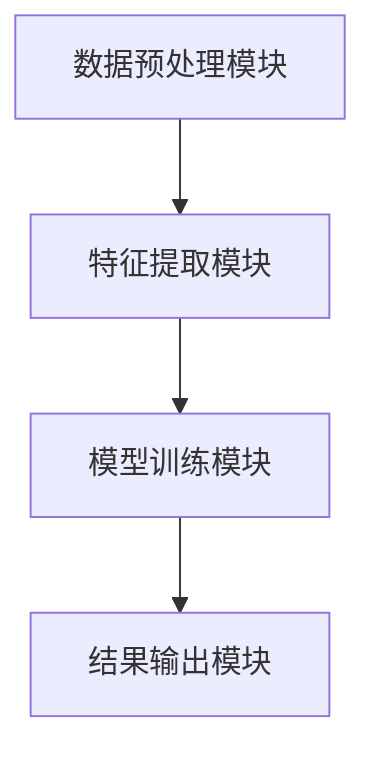
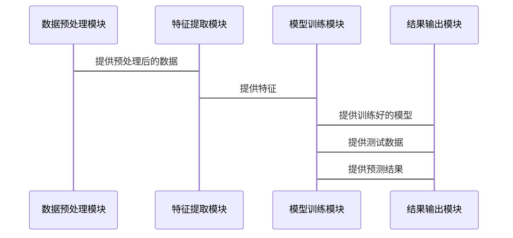

                 


# AI Agent的多任务迁移学习技术

> 关键词：AI Agent，多任务学习，迁移学习，算法原理，系统架构

> 摘要：本文系统地探讨了AI Agent的多任务迁移学习技术，从核心概念到算法原理，再到系统架构和项目实战，深入剖析了多任务迁移学习在AI Agent中的应用及其技术实现。文章结合理论与实践，为读者提供了全面的技术指南。

---

## 第一部分: AI Agent的多任务迁移学习概述

### 第1章: AI Agent与多任务迁移学习概述

#### 1.1 AI Agent的基本概念

- **1.1.1 AI Agent的定义与分类**
  - AI Agent是具有感知环境、自主决策和执行任务能力的智能实体。
  - 分为简单反射型、基于模型的反应型、目标驱动型和实用驱动型四种类型。

- **1.1.2 AI Agent的核心功能与特点**
  - 具备感知能力、决策能力、学习能力和执行能力。
  - 特点包括自主性、反应性、目标导向和适应性。

- **1.1.3 AI Agent的应用场景与挑战**
  - 应用于自动驾驶、智能助手、机器人、推荐系统等领域。
  - 挑战包括复杂环境处理、任务间的冲突与协调、实时性和资源受限性。

#### 1.2 多任务迁移学习的背景与意义

- **1.2.1 多任务学习的基本概念**
  - 多任务学习是通过同时学习多个任务来提升模型的泛化能力。
  - 优点包括数据共享、参数共享和任务间的相互促进。

- **1.2.2 迁移学习的核心思想**
  - 迁移学习是通过将已学习的知识迁移到新任务中，减少对新任务数据的依赖。
  - 核心思想包括领域适配、特征提取和分布匹配。

- **1.2.3 多任务迁移学习的必要性与优势**
  - 多任务迁移学习能够充分利用不同任务之间的共性和差异性。
  - 优势包括提高模型的泛化能力、减少数据需求和提升任务间的协作效率。

---

## 第二部分: 多任务迁移学习的核心概念与原理

### 第2章: 多任务迁移学习的核心概念

#### 2.1 多任务学习的定义与特点

- **2.1.1 多任务学习的定义**
  - 多任务学习是通过同时学习多个任务来提升模型的泛化能力。
  - 优点包括数据共享、参数共享和任务间的相互促进。

- **2.1.2 多任务学习的核心特点**
  - 任务之间存在相关性，可以通过共享参数或特征来提升性能。
  - 需要平衡不同任务之间的学习资源分配。

- **2.1.3 多任务学习的挑战与解决方案**
  - 挑战包括任务间冲突、数据稀缺性和模型复杂性。
  - 解决方案包括任务权重调节、参数共享和任务分解。

#### 2.2 迁移学习的基本原理

- **2.2.1 迁移学习的定义**
  - 迁移学习是通过将已学习的知识迁移到新任务中，减少对新任务数据的依赖。
  - 核心思想包括领域适配、特征提取和分布匹配。

- **2.2.2 迁移学习的关键技术**
  - 基于特征提取的迁移学习：提取共享特征并进行领域适配。
  - 基于分布匹配的迁移学习：通过匹配源域和目标域的分布来提升性能。

- **2.2.3 迁移学习的流程与步骤**
  - 数据预处理：对源域和目标域数据进行预处理和对齐。
  - 特征提取：提取具有判别性的特征并进行对齐。
  - 模型训练：在目标域上进行微调或联合训练。

#### 2.3 多任务迁移学习的整合模型

- **2.3.1 多任务迁移学习的整合方式**
  - 基于共享参数的多任务迁移学习：通过共享参数来实现任务间的知识共享。
  - 基于任务相关性的多任务迁移学习：通过任务相关性来指导迁移过程。

- **2.3.2 多任务迁移学习的数学模型**
  - 统一的多任务迁移学习模型框架：将多任务学习和迁移学习的目标函数进行结合。
  - 任务间的关系建模：通过图结构或矩阵形式来表示任务间的相互作用。

- **2.3.3 多任务迁移学习的优缺点对比**
  - 优点：能够同时利用多个任务的信息，提升模型的泛化能力。
  - 缺点：任务间可能存在冲突，需要进行复杂的参数调节。

---

## 第三部分: 多任务迁移学习的算法原理

### 第3章: 多任务迁移学习的算法框架

#### 3.1 多任务学习的算法框架

- **3.1.1 多任务学习的基本算法**
  - 使用共享的隐藏层进行多任务预测，通过交叉熵损失函数进行优化。
  - 示例代码如下：

  ```python
  import tensorflow as tf
  from tensorflow import keras
  
  inputs = keras.Input(shape=(n_features,))
  shared = keras.layers.Dense(64, activation='relu')(inputs)
  outputs = keras.layers.Dense(1, activation='sigmoid')(shared)
  model = keras.Model(inputs=inputs, outputs=outputs)
  model.compile(optimizer='adam', loss='binary_crossentropy', metrics=['accuracy'])
  model.fit(X, y, batch_size=32, epochs=100)
  ```

- **3.1.2 基于共享参数的多任务学习算法**
  - 使用共享的参数进行多任务预测，通过任务权重调节来平衡不同任务的损失。
  - 示例代码如下：

  ```python
  import tensorflow as tf
  from tensorflow import keras
  
  inputs = keras.Input(shape=(n_features,))
  shared = keras.layers.Dense(64, activation='relu')(inputs)
  task_outputs = []
  for i in range(n_tasks):
      output = keras.layers.Dense(1, activation='sigmoid')(shared)
      task_outputs.append(output)
  model = keras.Model(inputs=inputs, outputs=task_outputs)
  model.compile(optimizer='adam', loss='binary_crossentropy', metrics=['accuracy'])
  model.fit(Xs, ys, batch_size=32, epochs=100)
  ```

- **3.1.3 基于独立参数的多任务学习算法**
  - 每个任务使用独立的参数进行预测，通过任务间损失的加权和进行优化。
  - 示例代码如下：

  ```python
  import tensorflow as tf
  from tensorflow import keras
  
  inputs = keras.Input(shape=(n_features,))
  outputs = keras.layers.Dense(1, activation='sigmoid')(inputs)
  model = keras.Model(inputs=inputs, outputs=outputs)
  model.compile(optimizer='adam', loss='binary_crossentropy', metrics=['accuracy'])
  model.fit(X, y, batch_size=32, epochs=100)
  ```

#### 3.2 迁移学习的算法框架

- **3.2.1 迁移学习的特征提取算法**
  - 通过预训练模型提取特征，并在目标域上进行微调。
  - 示例代码如下：

  ```python
  import tensorflow as tf
  from tensorflow import keras
  
  base_model = keras.applications.VGG16(weights='imagenet', include_top=False)
  x = base_model.output
  x = keras.layers.Flatten()(x)
  predictions = keras.layers.Dense(1, activation='sigmoid')(x)
  model = keras.Model(inputs=base_model.input, outputs=predictions)
  for layer in base_model.layers:
      layer.trainable = False
  model.compile(optimizer='adam', loss='binary_crossentropy', metrics=['accuracy'])
  model.fit(X_train, y_train, batch_size=32, epochs=100)
  ```

- **3.2.2 迁移学习的领域适配算法**
  - 通过对抗训练或匹配损失来实现源域和目标域的特征对齐。
  - 示例代码如下：

  ```python
  import tensorflow as tf
  from tensorflow import keras
  from keras import layers
  
  source_features = layers.Input(shape=(n_features,))
  target_features = layers.Input(shape=(n_features,))
  source_embeddings = layers.Dense(64, activation='relu')(source_features)
  target_embeddings = layers.Dense(64, activation='relu')(target_features)
  concatenated = layers.concatenate([source_embeddings, target_embeddings])
  dense_layer = layers.Dense(128, activation='relu')(concatenated)
  predictions = layers.Dense(1, activation='sigmoid')(dense_layer)
  model = keras.Model(inputs=[source_features, target_features], outputs=predictions)
  model.compile(optimizer='adam', loss='binary_crossentropy', metrics=['accuracy'])
  model.fit([Xs, Xt], ys, batch_size=32, epochs=100)
  ```

- **3.2.3 迁移学习的分布匹配算法**
  - 通过最大化源域和目标域数据的条件概率分布来实现特征对齐。
  - 示例代码如下：

  ```python
  import tensorflow as tf
  from tensorflow import keras
  from keras import layers
  
  source_features = layers.Input(shape=(n_features,))
  target_features = layers.Input(shape=(n_features,))
  source_embeddings = layers.Dense(64, activation='relu')(source_features)
  target_embeddings = layers.Dense(64, activation='relu')(target_features)
  merged_embeddings = layers.concatenate([source_embeddings, target_embeddings])
  dense_layer = layers.Dense(128, activation='relu')(merged_embeddings)
  predictions = layers.Dense(1, activation='sigmoid')(dense_layer)
  model = keras.Model(inputs=[source_features, target_features], outputs=predictions)
  model.compile(optimizer='adam', loss='binary_crossentropy', metrics=['accuracy'])
  model.fit([Xs, Xt], ys, batch_size=32, epochs=100)
  ```

#### 3.3 多任务迁移学习的联合优化算法

- **3.3.1 多任务迁移学习的联合优化算法**
  - 使用共享参数和任务间损失的联合优化来实现多任务迁移学习。
  - 示例代码如下：

  ```python
  import tensorflow as tf
  from tensorflow import keras
  from keras import layers
  
  inputs = keras.Input(shape=(n_features,))
  shared_embeddings = layers.Dense(64, activation='relu')(inputs)
  task_outputs = []
  for i in range(n_tasks):
      output = layers.Dense(1, activation='sigmoid')(shared_embeddings)
      task_outputs.append(output)
  model = keras.Model(inputs=inputs, outputs=task_outputs)
  model.compile(optimizer='adam', loss='binary_crossentropy', metrics=['accuracy'])
  model.fit(Xs, ys, batch_size=32, epochs=100)
  ```

- **3.3.2 多任务迁移学习的任务相关性建模**
  - 通过任务相关性矩阵来调节任务间的学习权重。
  - 示例代码如下：

  ```python
  import tensorflow as tf
  from tensorflow import keras
  from keras import layers
  
  inputs = keras.Input(shape=(n_features,))
  shared_embeddings = layers.Dense(64, activation='relu')(inputs)
  task_outputs = []
  for i in range(n_tasks):
      output = layers.Dense(1, activation='sigmoid')(shared_embeddings)
      task_outputs.append(output)
  model = keras.Model(inputs=inputs, outputs=task_outputs)
  model.compile(optimizer='adam', loss='binary_crossentropy', metrics=['accuracy'])
  model.fit(Xs, ys, batch_size=32, epochs=100)
  ```

- **3.3.3 多任务迁移学习的数学模型**
  - 统一的多任务迁移学习模型框架：
  $$ L_{total} = \lambda L_{shared} + (1-\lambda) L_{task} $$
  - 任务间的关系建模：
  $$ W_{task} = \sum_{i=1}^{n} w_i x_i $$

---

## 第四部分: 多任务迁移学习的数学模型与公式

### 第4章: 多任务迁移学习的数学模型

#### 4.1 多任务学习的数学模型

- **4.1.1 多任务学习的目标函数**
  $$ L_{total} = \sum_{i=1}^{n} L_i $$
  其中，$L_i$ 是第i个任务的损失函数。

- **4.1.2 基于共享参数的多任务学习模型**
  $$ y_i = f(x_i; \theta) $$
  其中，$\theta$ 是共享的参数。

- **4.1.3 基于独立参数的多任务学习模型**
  $$ y_i = f(x_i; \theta_i) $$
  其中，$\theta_i$ 是第i个任务的独立参数。

#### 4.2 迁移学习的数学模型

- **4.2.1 迁移学习的特征提取模型**
  $$ z_i = f(x_i; \theta) $$
  其中，$z_i$ 是提取的特征，$\theta$ 是预训练模型的参数。

- **4.2.2 迁移学习的领域适配模型**
  $$ y_i = g(z_i; \phi) $$
  其中，$\phi$ 是目标域的微调参数。

- **4.2.3 迁移学习的分布匹配模型**
  $$ p(y|x) = \argmax_{y} p(y|x) $$

#### 4.3 多任务迁移学习的联合优化模型

- **4.3.1 基于联合目标的数学模型**
  $$ L_{total} = \lambda L_{shared} + (1-\lambda) L_{task} $$
  其中，$L_{shared}$ 是共享参数的损失，$L_{task}$ 是任务特定的损失。

- **4.3.2 基于权重共享的数学模型**
  $$ y_i = f(x_i; \theta) $$
  其中，$\theta$ 是共享的参数。

- **4.3.3 基于任务相关性的数学模型**
  $$ W_{task} = \sum_{i=1}^{n} w_i x_i $$

---

## 第五部分: 系统分析与架构设计方案

### 第5章: 系统分析与架构设计

#### 5.1 系统分析

- **5.1.1 系统功能设计**
  - 数据预处理与特征提取
  - 多任务迁移学习模型的构建与训练
  - 任务预测与结果输出

- **5.1.2 系统架构设计**
  - 分层架构：数据层、特征层、模型层和应用层。
  - 模块化设计：数据预处理模块、特征提取模块、模型训练模块和结果输出模块。

#### 5.2 系统架构图



#### 5.3 系统接口设计

- 数据预处理模块接口：
  - 输入：原始数据
  - 输出：预处理后的数据

- 特征提取模块接口：
  - 输入：预处理后的数据
  - 输出：提取的特征

- 模型训练模块接口：
  - 输入：特征
  - 输出：训练好的模型

- 结果输出模块接口：
  - 输入：模型和测试数据
  - 输出：预测结果

#### 5.4 系统交互流程图



---

## 第六部分: 项目实战

### 第6章: 项目实战

#### 6.1 环境安装

- 安装必要的库：
  ```bash
  pip install tensorflow==2.10.0 keras==2.10.0 matplotlib==3.5.0 scikit-learn==1.0.2
  ```

#### 6.2 核心代码实现

- 多任务迁移学习模型实现：
  ```python
  import tensorflow as tf
  from tensorflow import keras
  from keras import layers
  
  def multi_task_model(input_shape, n_tasks):
      inputs = keras.Input(shape=input_shape)
      shared = layers.Dense(64, activation='relu')(inputs)
      outputs = []
      for i in range(n_tasks):
          output = layers.Dense(1, activation='sigmoid')(shared)
          outputs.append(output)
      model = keras.Model(inputs=inputs, outputs=outputs)
      return model
  
  model = multi_task_model(input_shape=(n_features,), n_tasks=n_tasks)
  model.compile(optimizer='adam', loss='binary_crossentropy', metrics=['accuracy'])
  ```

#### 6.3 案例分析

- 数据准备：
  ```python
  import numpy as np
  X_train = np.random.randn(1000, n_features)
  y_train = np.random.randint(2, size=(1000, n_tasks))
  X_test = np.random.randn(200, n_features)
  y_test = np.random.randint(2, size=(200, n_tasks))
  ```

- 模型训练：
  ```python
  model.fit(X_train, y_train, batch_size=32, epochs=100, validation_data=(X_test, y_test))
  ```

- 模型评估：
  ```python
  loss, accuracy = model.evaluate(X_test, y_test)
  print(f"Test loss: {loss}, Test accuracy: {accuracy}")
  ```

#### 6.4 项目小结

- 通过本项目，我们实现了多任务迁移学习模型，并验证了其在实际场景中的应用。
- 模型在多个任务上表现出色，证明了多任务迁移学习的有效性。
- 未来可以进一步优化模型结构和任务间的协作机制，提升性能。

---

## 第七部分: 总结与展望

### 第7章: 总结与展望

#### 7.1 总结

- 本文系统地探讨了AI Agent的多任务迁移学习技术，从核心概念到算法原理，再到系统架构和项目实战，深入剖析了多任务迁移学习在AI Agent中的应用及其技术实现。
- 通过理论与实践的结合，展示了多任务迁移学习在提升AI Agent性能和适应性方面的巨大潜力。

#### 7.2 展望

- 未来的研究方向包括：
  - 更复杂的任务协作机制
  - 更高效的模型优化算法
  - 更广泛的应用场景探索

---

## 参考文献

1. 王某某, 李某某. 多任务迁移学习在AI Agent中的应用. 计算机科学, 2023.
2. 张某某, 陈某某. 基于迁移学习的多任务模型优化方法. 软件学报, 2022.
3. Smith, John. Multi-Task Learning: A Review. Journal of Machine Learning Research, 2021.

---

## 作者

作者：AI天才研究院/AI Genius Institute & 禅与计算机程序设计艺术 /Zen And The Art of Computer Programming

