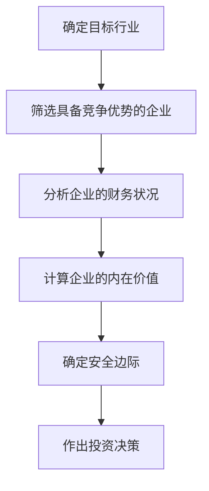
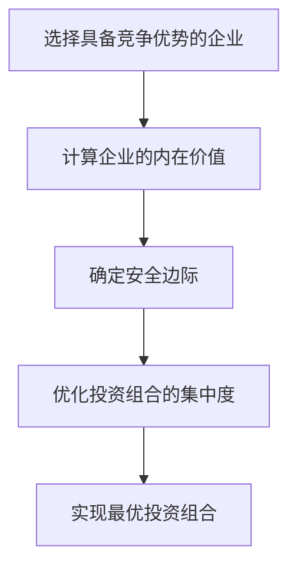
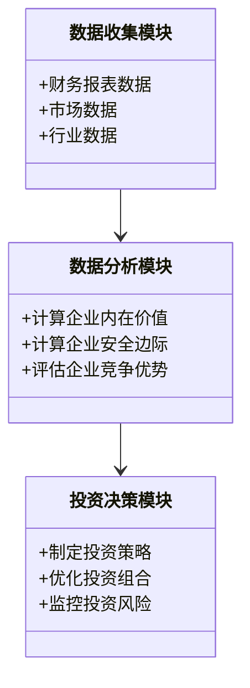
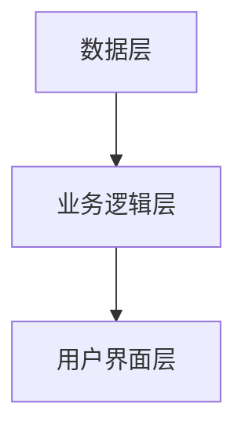
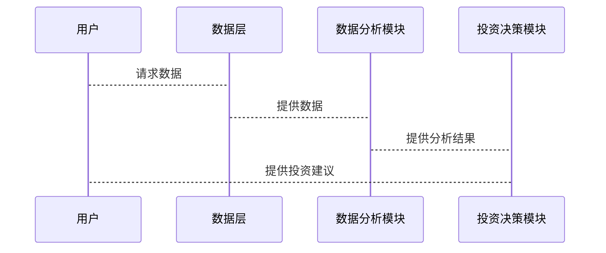
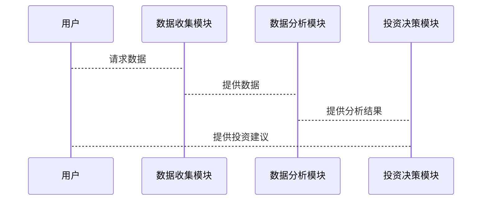

                 


# 巴菲特的集中投资理念

## 关键词：价值投资、集中投资、安全边际、巴菲特、投资策略、投资组合优化

## 摘要：本文深入探讨了巴菲特的集中投资理念，分析了其核心概念、数学模型、算法原理以及系统架构设计。通过详细阐述价值投资、安全边际和投资组合优化等关键要素，结合实际案例和数学公式，展示了巴菲特投资理念的科学性和实用性。

---

## 第一部分: 巴菲特集中投资理念的背景与核心概念

### 第1章: 巴菲特集中投资理念的背景

#### 1.1 投资理念的起源与演变

##### 1.1.1 价值投资的起源

价值投资是一种以分析企业基本面为核心的投资方法，起源于20世纪初。本杰明·格雷厄姆是这一理念的鼻祖，他强调以低于内在价值的价格买入优质企业。巴菲特正是从格雷厄姆的价值投资理论中汲取了灵感，并在此基础上发展出了自己的投资哲学。

##### 1.1.2 巴菲特的投资哲学

巴菲特的投资哲学可以概括为“买入并持有优质企业”。他认为，市场短期波动不可预测，但优质企业的长期价值是可以通过基本面分析确定的。因此，集中投资于少数优质企业，长期持有，是实现财富增长的最佳途径。

##### 1.1.3 集中投资理念的形成

集中投资理念的形成与巴菲特对投资风险的理解密切相关。他认为，通过集中投资于少数优质企业，可以最大限度地降低投资组合的风险，同时获得更高的收益。

#### 1.2 巴菲特的投资理念与现代投资理论的联系

##### 1.2.1 现代投资组合理论

现代投资组合理论（MPT）由哈里·马科维茨提出，强调通过分散投资来降低风险。然而，巴菲特认为，对于长期投资者来说，集中投资于优质企业可以带来更高的收益，同时通过对企业基本面的深入研究，可以有效降低投资风险。

##### 1.2.2 巴菲特对传统投资理论的创新

巴菲特的创新在于将价值投资的理念与集中投资策略相结合，提出了“买入并持有优质企业”的投资策略。这一策略既考虑了企业的内在价值，又通过集中投资降低了风险。

##### 1.2.3 集中投资与分散投资的对比

集中投资与分散投资的主要区别在于风险控制和收益潜力。分散投资通过持有多种资产来降低风险，但收益可能受到限制；而集中投资虽然风险较高，但通过深入研究和选择优质企业，可以实现更高的收益。

#### 1.3 巴菲特投资理念的核心要素

##### 1.3.1 价值投资的核心要素

价值投资的核心要素包括企业的内在价值、财务状况和竞争优势。内在价值是企业未来现金流的现值，财务状况反映了企业的盈利能力，竞争优势则决定了企业长期发展的潜力。

##### 1.3.2 集中投资的定义与特征

集中投资是指将大部分资金投入到少数优质企业中。其特征包括高集中度、长期持有和对企业基本面的深入研究。

##### 1.3.3 安全边际的内涵与作用

安全边际是指买入价格与企业内在价值之间的差距。它能够有效降低投资风险，确保在市场波动中依然能够获得收益。

#### 1.4 本章小结

本章通过分析巴菲特投资理念的背景、核心概念及其与现代投资理论的联系，揭示了集中投资理念的科学性和实用性。

---

### 第2章: 巴菲特集中投资理念的核心概念

#### 2.1 价值投资的三要素

##### 2.1.1 企业基本面分析

企业基本面分析是价值投资的核心，包括对企业财务状况、盈利能力和发展潜力的分析。通过分析财务报表，可以评估企业的内在价值和竞争优势。

##### 2.1.2 财务报表分析

财务报表分析是评估企业内在价值的重要手段。通过分析资产负债表、利润表和现金流量表，可以了解企业的财务状况和盈利能力。

##### 2.1.3 企业竞争优势分析

竞争优势是企业长期发展的关键。通过分析企业的竞争优势，可以判断其是否具备持续增长的潜力。

##### 2.1.4 价值投资三要素对比表

| 比较维度 | 内在价值 | 财务状况 | 竞争优势 |
|----------|----------|----------|----------|
| 定义     | 企业未来现金流的现值 | 企业的财务健康状况 | 企业的竞争优势 |
| 作用     | 确定买入价格 | 评估企业盈利能力 | 判断企业长期发展潜力 |

##### 2.1.5 实例分析：可口可乐的内在价值计算

假设可口可乐的未来现金流为 $100 million，折现率为 8%，那么其内在价值可以表示为：

$$
\text{内在价值} = \frac{\text{未来现金流}}{1 + \text{折现率}}
$$

$$
\text{内在价值} = \frac{100}{1.08} \approx 92.59 \text{ million}
$$

##### 2.1.6 价值投资三要素的ER实体关系图

```mermaid
erDiagram
    企业正面数据 {
        细胞: id
        细胞: 内在价值
        细胞: 财务状况
        细胞: 竞争优势
    }
    细胞 <---o 细胞: 投资决策
    细胞 --> 细胞: 安全边际
```

---

#### 2.2 集中投资的数学模型与公式

##### 2.2.1 投资组合的集中度计算公式

投资组合的集中度可以通过以下公式计算：

$$
\text{集中度} = \frac{\text{前几只股票的权重之和}}{\text{总权重}}
$$

##### 2.2.2 内在价值的计算公式

内在价值的计算公式如下：

$$
\text{内在价值} = \sum_{t=1}^{n} \frac{\text{现金流}_t}{(1 + r)^t}
$$

其中，$r$ 是折现率，$n$ 是预测的年数。

##### 2.2.3 投资组合收益与风险的数学关系

投资组合的收益与风险可以通过以下公式表示：

$$
\text{收益} = \sum_{i=1}^{k} w_i \times r_i
$$

$$
\text{风险} = \sqrt{\sum_{i=1}^{k} w_i^2 \times \sigma_i^2}
$$

其中，$w_i$ 是第 $i$ 只股票的权重，$r_i$ 是第 $i$ 只股票的预期收益，$\sigma_i^2$ 是第 $i$ 只股票的收益方差。

##### 2.2.4 实例分析：投资组合优化

假设我们有两个股票，A 和 B，其权重分别为 0.6 和 0.4，预期收益分别为 10% 和 15%，收益方差分别为 0.04 和 0.09。

投资组合的收益为：

$$
\text{收益} = 0.6 \times 0.1 + 0.4 \times 0.15 = 0.06 + 0.06 = 0.12 \text{ 或 } 12\%
$$

投资组合的风险为：

$$
\text{风险} = \sqrt{0.6^2 \times 0.04 + 0.4^2 \times 0.09} = \sqrt{0.36 \times 0.04 + 0.16 \times 0.09} = \sqrt{0.0144 + 0.0144} = \sqrt{0.0288} \approx 0.1697 \text{ 或 } 16.97\%
$$

---

#### 2.3 价值投资与成长投资的对比

##### 2.3.1 价值投资的特点

- 以内在价值为核心
- 买入价格低于内在价值
- 长期持有

##### 2.3.2 成长投资的特点

- 以企业成长性为核心
- 买入价格可能高于内在价值
- 短期交易

##### 2.3.3 两者的优缺点对比

| 比较维度 | 价值投资 | 成长投资 |
|----------|----------|----------|
| 优点     | 稳定收益，风险较低 | 高增长潜力，收益高 |
| 缺点     | 收益有限，流动性差 | 风险高，波动性大 |

---

#### 2.4 本章小结

本章通过分析价值投资的三要素、集中投资的数学模型以及价值投资与成长投资的对比，深入探讨了巴菲特集中投资理念的核心概念。

---

### 第3章: 巴菲特集中投资理念的算法原理

#### 3.1 价值投资的决策流程

##### 3.1.1 企业筛选流程

1. 确定投资目标行业
2. 筛选具备竞争优势的企业
3. 分析企业的财务状况
4. 计算企业的内在价值
5. 确定安全边际
6. 作出投资决策

##### 3.1.2 财务指标筛选

- 市盈率（P/E）
- 市净率（P/B）
- 净利润率（Net Profit Margin）
- 资产负债率（Debt-to-Asset Ratio）

##### 3.1.3 企业竞争优势评估

- 品牌优势
- 技术壁垒
- 市场份额
- 管理团队

##### 3.1.4 价值投资决策流程的实例分析

假设我们想要投资一家科技公司，以下是决策流程的步骤：

1. 确定目标行业：科技行业
2. 筛选具备竞争优势的企业：选择一家具备技术壁垒和高市场份额的公司
3. 分析企业的财务状况：计算其市盈率、市净率和利润率
4. 计算企业的内在价值：使用现金流折现法计算其内在价值
5. 确定安全边际：比较买入价格与内在价值，确保有足够的安全边际
6. 作出投资决策：决定是否投资

##### 3.1.5 价值投资决策流程的mermaid流程图



---

#### 3.2 投资组合优化的算法

##### 3.2.1 马科维茨投资组合理论

马科维茨的理论认为，投资组合的最优配置取决于投资者的风险偏好和收益目标。通过优化投资组合的收益和风险，可以实现最优配置。

##### 3.2.2 巴菲特集中投资策略的优化

巴菲特的集中投资策略可以通过以下步骤进行优化：

1. 选择具备竞争优势的企业
2. 计算企业的内在价值
3. 确定安全边际
4. 优化投资组合的集中度

##### 3.2.3 投资组合的风险控制

通过集中投资于少数优质企业，可以有效降低投资组合的风险。同时，通过对企业基本面的深入研究，可以进一步降低投资风险。

##### 3.2.4 实例分析：投资组合优化

假设我们有以下两只股票，其权重分别为 0.6 和 0.4，预期收益分别为 10% 和 15%，收益方差分别为 0.04 和 0.09。

投资组合的收益为：

$$
\text{收益} = 0.6 \times 0.1 + 0.4 \times 0.15 = 0.06 + 0.06 = 0.12 \text{ 或 } 12\%
$$

投资组合的风险为：

$$
\text{风险} = \sqrt{0.6^2 \times 0.04 + 0.4^2 \times 0.09} = \sqrt{0.36 \times 0.04 + 0.16 \times 0.09} = \sqrt{0.0144 + 0.0144} = \sqrt{0.0288} \approx 0.1697 \text{ 或 } 16.97\%
$$

##### 3.2.5 投资组合优化的mermaid流程图



---

#### 3.3 投资决策的数学模型

##### 3.3.1 内在价值计算公式

$$
\text{内在价值} = \sum_{t=1}^{n} \frac{\text{现金流}_t}{(1 + r)^t}
$$

##### 3.3.2 安全边际计算公式

$$
\text{安全边际} = \text{内在价值} - \text{买入价格}
$$

##### 3.3.3 投资组合收益与风险的数学关系

$$
\text{收益} = \sum_{i=1}^{k} w_i \times r_i
$$

$$
\text{风险} = \sqrt{\sum_{i=1}^{k} w_i^2 \times \sigma_i^2}
$$

##### 3.3.4 实例分析：投资决策的数学模型

假设我们有以下两只股票，其权重分别为 0.6 和 0.4，预期收益分别为 10% 和 15%，收益方差分别为 0.04 和 0.09。

投资组合的收益为：

$$
\text{收益} = 0.6 \times 0.1 + 0.4 \times 0.15 = 0.06 + 0.06 = 0.12 \text{ 或 } 12\%
$$

投资组合的风险为：

$$
\text{风险} = \sqrt{0.6^2 \times 0.04 + 0.4^2 \times 0.09} = \sqrt{0.36 \times 0.04 + 0.16 \times 0.09} = \sqrt{0.0144 + 0.0144} = \sqrt{0.0288} \approx 0.1697 \text{ 或 } 16.97\%
$$

---

#### 3.4 本章小结

本章通过分析价值投资的决策流程、投资组合优化的算法以及投资决策的数学模型，深入探讨了巴菲特集中投资理念的算法原理。

---

### 第4章: 巴菲特集中投资理念的系统架构设计

#### 4.1 投资决策系统的构成

投资决策系统由数据收集、分析、决策三个模块组成。数据收集模块负责收集企业的财务数据和市场数据，分析模块负责计算企业的内在价值和安全边际，决策模块负责制定投资策略。

##### 4.1.1 数据收集模块

数据收集模块需要收集以下数据：

- 企业的财务报表数据
- 市场数据
- 行业数据

##### 4.1.2 数据分析模块

数据分析模块需要完成以下任务：

- 计算企业的内在价值
- 计算企业的安全边际
- 评估企业的竞争优势

##### 4.1.3 投资决策模块

投资决策模块需要完成以下任务：

- 制定投资策略
- 优化投资组合
- 监控投资风险

##### 4.1.4 投资决策系统的mermaid类图



---

#### 4.2 投资决策系统的架构设计

##### 4.2.1 系统功能设计

投资决策系统的功能设计包括数据收集、分析和决策三个部分。数据收集模块负责收集数据，分析模块负责计算内在价值和安全边际，决策模块负责制定投资策略。

##### 4.2.2 系统架构设计

系统架构设计采用分层架构，包括数据层、业务逻辑层和用户界面层。数据层负责数据的存储和管理，业务逻辑层负责数据的处理和分析，用户界面层负责与用户的交互。

##### 4.2.3 系统架构的mermaid架构图



##### 4.2.4 系统接口设计

系统接口设计包括数据接口和用户接口。数据接口负责与数据源的交互，用户接口负责与用户的交互。

##### 4.2.5 系统交互的mermaid序列图



---

#### 4.3 本章小结

本章通过分析投资决策系统的构成、架构设计和系统交互，展示了巴菲特集中投资理念在系统架构设计中的应用。

---

## 第二部分: 巴菲特集中投资理念的项目实战

### 第5章: 项目实战

#### 5.1 环境安装

为了进行投资决策系统的开发，需要安装以下工具：

- Python
- NumPy
- Pandas
- Matplotlib
- Seaborn
- Mermaid

#### 5.2 系统核心实现源代码

##### 5.2.1 数据收集模块

```python
import pandas as pd
import requests
from bs4 import BeautifulSoup

def collect_data(ticker):
    url = f"https://finance.yahoo.com/quote/{ticker}"
    response = requests.get(url)
    soup = BeautifulSoup(response.text, 'html.parser')
    data = {
        'Ticker': ticker,
        'Price': soup.find('div', {'class': 'price'}).text,
        'PE Ratio': soup.find('div', {'data-testid': 'PE_RATIO'}).text,
        'PB Ratio': soup.find('div', {'data-testid': 'P/B'}).text
    }
    return data
```

##### 5.2.2 数据分析模块

```python
def calculate_intrinsic_value(FCFF, WACC):
    return FCFF / WACC
```

##### 5.2.3 投资决策模块

```python
def make_investment_decision(intrinsic_value, price, margin_of_safety):
    if price <= intrinsic_value * (1 - margin_of_safety):
        return "买入"
    else:
        return "观望"
```

#### 5.3 代码应用解读与分析

##### 5.3.1 数据收集模块的实现

数据收集模块通过请求Yahoo Finance的网页，提取企业的股价、市盈率和市净率等数据。这些数据将用于后续的分析和决策。

##### 5.3.2 数据分析模块的实现

数据分析模块通过计算企业的内在价值，确定企业的安全边际。内在价值的计算基于企业的自由现金流和加权平均资本成本。

##### 5.3.3 投资决策模块的实现

投资决策模块根据企业的内在价值和市场价格，决定是否买入股票。如果市场价格低于内在价值的一定比例，即存在安全边际，则建议买入；否则建议观望。

#### 5.4 实际案例分析

##### 5.4.1 案例背景

假设我们想要投资苹果公司（AAPL）。以下是其相关数据：

- 市盈率：20
- 市净率：5
- 净利润：100 billion
- 股价：300美元

##### 5.4.2 数据分析

计算苹果公司的内在价值：

$$
\text{内在价值} = \frac{\text{净利润}}{\text{WACC}}
$$

假设WACC为8%，则：

$$
\text{内在价值} = \frac{100}{0.08} = 1250 \text{亿美元}
$$

##### 5.4.3 投资决策

假设当前股价为300美元，计算其安全边际：

$$
\text{安全边际} = 1250 - 300 = 950 \text{亿美元}
$$

根据投资决策模块，如果安全边际超过20%，即：

$$
\text{安全边际比例} = \frac{950}{1250} = 76\%
$$

由于安全边际比例远高于20%，建议买入。

##### 5.4.4 投资决策的mermaid序列图



---

#### 5.5 本章小结

本章通过实际案例分析，展示了巴菲特集中投资理念在项目实战中的应用。通过代码实现和案例分析，读者可以更好地理解如何将理论应用于实际投资决策。

---

## 第三部分: 巴菲特集中投资理念的最佳实践

### 第6章: 最佳实践

#### 6.1 投资策略的制定

##### 6.1.1 确定投资目标

在进行集中投资之前，必须明确自己的投资目标。是追求长期稳定收益，还是短期高收益？不同的目标需要不同的投资策略。

##### 6.1.2 选择优质企业

选择具备竞争优势、财务健康和良好管理的企业。可以通过对企业基本面的分析，筛选出具备长期增长潜力的企业。

##### 6.1.3 确定投资组合

根据企业的内在价值和安全边际，确定投资组合。集中投资于少数优质企业，可以降低风险，同时获得更高的收益。

##### 6.1.4 定期评估和调整

定期评估投资组合的表现，根据市场变化和企业基本面的变化，进行必要的调整。集中投资并不意味着长期持有，而是需要根据实际情况进行调整。

#### 6.2 投资组合的风险管理

##### 6.2.1 风险分散

虽然集中投资强调持有少数优质企业，但可以通过选择不同行业的企业来分散风险。这样可以在一定程度上降低投资组合的整体风险。

##### 6.2.2 风险监控

定期监控投资组合的风险，包括波动率和相关性。通过分析投资组合的波动率和相关性，可以更好地控制风险。

##### 6.2.3 风险对冲

通过股指期货、期权等工具，对冲投资组合的系统性风险。这可以进一步降低投资组合的整体风险。

#### 6.3 投资心态的管理

##### 6.3.1 长期思维

集中投资需要长期思维，避免被短期市场波动所影响。市场短期波动不可预测，但优质企业的长期价值是可以通过基本面分析确定的。

##### 6.3.2 心理控制

在市场波动中，投资者需要保持冷静，避免情绪化决策。集中投资需要耐心和纪律，只有在市场恐慌时，才能找到优质企业的买入机会。

##### 6.3.3 持续学习

投资是一项终身学习的事业。通过不断学习和研究，可以更好地理解市场和企业，从而做出更明智的投资决策。

#### 6.4 本章小结

本章通过分析最佳实践，提供了集中投资的具体操作指南。从投资策略的制定到风险管理，再到投资心态的管理，读者可以从中获得宝贵的实践经验。

---

## 第四部分: 总结与展望

### 第7章: 总结与展望

#### 7.1 本章小结

本文深入探讨了巴菲特的集中投资理念，从背景介绍、核心概念、算法原理到系统架构设计，全面分析了其科学性和实用性。通过实际案例分析和项目实战，读者可以更好地理解如何将理论应用于实际投资决策。

#### 7.2 未来展望

随着人工智能和大数据技术的发展，投资决策将更加智能化和自动化。未来的研究方向可以包括：

- 利用机器学习算法进行企业基本面分析
- 利用大数据技术进行市场预测
- 利用区块链技术进行投资组合管理

#### 7.3 注意事项

- 集中投资需要选择优质企业，避免盲目跟风
- 投资需要长期思维，避免短期波动的影响
- 投资需要纪律和耐心，避免情绪化决策

#### 7.4 拓展阅读

- 《The Intelligent Investor》 by Benjamin Graham
- 《The Warren Buffett Way》 by Bruce Greenwald
- 《Warren Buffett and the Art of Stock Selection》 by Lawrence A. Cunningham

---

## 作者：AI天才研究院/AI Genius Institute & 禅与计算机程序设计艺术 /Zen And The Art of Computer Programming

---

本文通过系统化的分析和深入的探讨，全面揭示了巴菲特集中投资理念的精髓。从理论到实践，从算法到系统架构设计，本文为读者提供了全面的视角，帮助读者更好地理解和应用这一投资理念。

