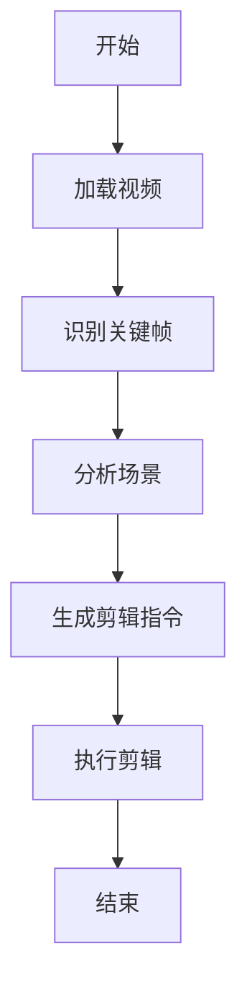
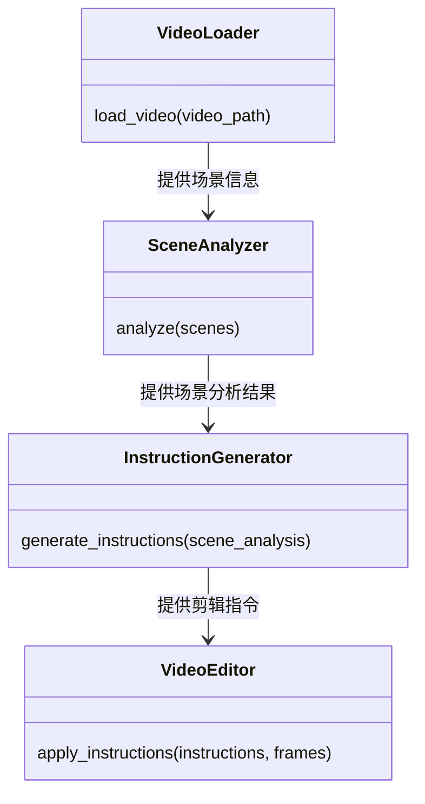
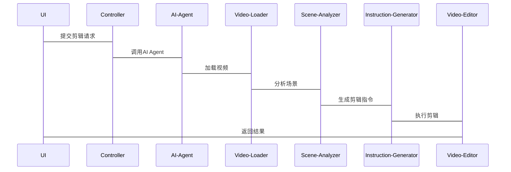

                 


# 开发AI Agent支持的智能视频剪辑系统

## 关键词：AI Agent，智能视频剪辑，系统架构，算法原理，项目实战

## 摘要：本文将详细探讨如何开发一个由AI Agent支持的智能视频剪辑系统。首先，我们从背景介绍入手，分析问题背景、问题描述和问题解决的路径。接着，我们深入探讨核心概念与联系，包括AI Agent的基本原理和智能视频剪辑系统的结构。然后，我们详细讲解算法原理，包括流程图和Python代码实现。之后，我们将分析系统的架构设计，包括功能设计、架构图和交互图。最后，我们将通过项目实战来实现系统，并总结开发过程中的经验和教训。

---

# 第1章: 背景介绍

## 1.1 问题背景

### 1.1.1 视频剪辑的现状与挑战
视频剪辑是现代多媒体处理中的重要环节，广泛应用于影视制作、广告宣传、用户生成内容等领域。然而，传统的视频剪辑工具通常依赖人工操作，需要用户手动选择关键帧、调整剪辑点和优化视频效果。这种手动操作不仅效率低下，而且对用户的技能要求较高，难以满足大规模、高效率的剪辑需求。

此外，随着视频内容的爆炸式增长，用户对个性化和智能化剪辑工具的需求日益增长。传统的剪辑工具难以应对海量数据和复杂场景的处理，导致剪辑效率低下，用户体验不佳。

### 1.1.2 AI Agent和智能视频剪辑系统的概念
AI Agent（人工智能代理）是一种能够感知环境、执行任务并做出决策的智能实体。在视频剪辑领域，AI Agent可以用于自动识别视频内容、分析场景、生成剪辑指令并优化剪辑效果。智能视频剪辑系统则是一个集成AI Agent的自动化工具，能够根据用户需求自动生成高质量的视频剪辑内容。

### 1.1.3 智能视频剪辑系统的目标
智能视频剪辑系统的开发目标是通过AI Agent实现视频剪辑的自动化和智能化，降低用户操作门槛，提高剪辑效率和质量。具体目标包括：
1. **自动识别视频内容**：AI Agent能够识别视频中的关键帧、人物、场景和情感基调。
2. **自动生成剪辑方案**：基于识别结果，AI Agent可以生成剪辑方案，包括剪辑点、镜头切换和特效建议。
3. **优化剪辑效果**：通过机器学习算法，AI Agent可以优化剪辑效果，使其更加符合用户的审美需求。

## 1.2 问题描述

### 1.2.1 现有视频剪辑工具的局限性
传统的视频剪辑工具主要依赖手动操作，存在以下局限性：
1. **操作复杂**：需要用户具备一定的剪辑技能，操作步骤繁琐。
2. **效率低下**：手动选择关键帧和调整剪辑点耗时较长。
3. **个性化不足**：缺乏智能化的剪辑建议，难以满足个性化需求。

### 1.2.2 AI Agent在视频剪辑中的角色
AI Agent在智能视频剪辑系统中扮演着核心角色，负责以下任务：
1. **内容识别**：识别视频中的关键帧、人物和场景。
2. **剪辑方案生成**：根据识别结果生成剪辑方案。
3. **效果优化**：优化剪辑效果，使其更加符合用户需求。

### 1.2.3 智能视频剪辑系统的边界与外延
智能视频剪辑系统的边界在于其核心功能——剪辑自动化，而外延则包括与之相关的视频存储、内容分发和用户交互等模块。

---

# 第2章: 核心概念与联系

## 2.1 核心概念原理

### 2.1.1 AI Agent的基本原理
AI Agent通过感知环境、分析数据并执行任务来实现其功能。在智能视频剪辑系统中，AI Agent的核心功能包括：
1. **数据感知**：通过计算机视觉技术识别视频内容。
2. **决策制定**：基于识别结果生成剪辑指令。
3. **任务执行**：调用剪辑工具执行剪辑操作。

### 2.1.2 智能视频剪辑系统的原理
智能视频剪辑系统通过集成AI Agent，实现视频内容的自动化剪辑。系统的主要流程包括：
1. **视频加载**：将视频文件加载到系统中。
2. **内容识别**：AI Agent识别视频中的关键帧和场景。
3. **剪辑方案生成**：基于识别结果生成剪辑方案。
4. **剪辑执行**：根据剪辑方案执行剪辑操作。

### 2.1.3 AI Agent与智能视频剪辑的结合机制
AI Agent通过调用视频剪辑工具的API实现与智能视频剪辑系统的结合。系统通过AI Agent提供的剪辑方案，完成视频剪辑任务。

## 2.2 核心概念属性特征对比

| 属性 | AI Agent | 智能视频剪辑系统 |
|------|-----------|------------------|
| 核心功能 | 执行任务、决策制定 | 自动化剪辑、内容识别 |
| 输入 | 视频文件、用户指令 | 视频内容、用户需求 |
| 输出 | 剪辑指令、优化建议 | 剪辑后的视频文件 |
| 依赖 | 机器学习模型、API接口 | 视频剪辑工具、AI Agent |

## 2.3 ER实体关系图

```mermaid
er
    actor: 用户
    system: 智能视频剪辑系统
    agent: AI Agent
    video: 视频文件
    action: 操作
    relation: 关联关系
    actor --> system: 使用系统
    system --> agent: 调用AI Agent
    agent --> video: 分析视频
    video --> action: 生成操作
```

---

# 第3章: 算法原理讲解

## 3.1 算法原理概述

### 3.1.1 AI Agent的核心算法
AI Agent的核心算法包括：
1. **计算机视觉算法**：用于视频内容识别。
2. **自然语言处理算法**：用于生成剪辑方案的描述。
3. **强化学习算法**：用于优化剪辑效果。

### 3.1.2 视频剪辑的关键算法
视频剪辑的关键算法包括：
1. **关键帧识别算法**：用于识别视频中的关键帧。
2. **场景切换算法**：用于确定场景切换点。
3. **剪辑优化算法**：用于优化剪辑效果。

## 3.2 算法流程图



## 3.3 算法实现代码

### 3.3.1 算法原理的数学模型
剪辑点的优化可以通过以下数学模型实现：
$$ y = f(x) $$
其中，\( x \) 是视频的关键帧，\( y \) 是剪辑点的优化结果。

### 3.3.2 算法实现的Python代码
```python
import cv2
import numpy as np

def process_video(video_path):
    # 加载视频
    video = cv2.VideoCapture(video_path)
    # 识别关键帧
    key_frames = []
    while video.isOpened():
        ret, frame = video.read()
        if not ret:
            break
        # 进行关键帧识别
        key_frames.append(frame)
    # 分析场景
    scene_analysis = analyze(key_frames)
    # 生成剪辑指令
    instructions = generate_instructions(scene_analysis)
    # 执行剪辑
    result_video = apply_instructions(instructions, key_frames)
    return result_video

def analyze(frames):
    # 分析场景，返回场景信息
    pass

def generate_instructions(scene_info):
    # 生成剪辑指令
    pass

def apply_instructions(instructions, frames):
    # 应用剪辑指令，生成结果视频
    pass
```

---

# 第4章: 系统架构设计

## 4.1 功能设计

### 4.1.1 系统功能模块
智能视频剪辑系统的主要功能模块包括：
1. **视频加载模块**：加载视频文件。
2. **内容识别模块**：识别视频内容。
3. **剪辑方案生成模块**：生成剪辑方案。
4. **剪辑执行模块**：执行剪辑操作。

### 4.1.2 领域模型



## 4.2 系统架构设计

### 4.2.1 系统架构图

```mermaid
graph TD
    UI --> Controller: 用户指令
    Controller --> AI-Agent: 调用AI Agent
    AI-Agent --> Video-Loader: 加载视频
    Video-Loader --> Scene-Analyzer: 分析场景
    Scene-Analyzer --> Instruction-Generator: 生成剪辑指令
    Instruction-Generator --> Video-Editor: 执行剪辑
    Video-Editor --> UI: 返回结果
```

## 4.3 系统接口设计

### 4.3.1 系统接口
系统主要接口包括：
1. **视频加载接口**：`load_video(video_path)`
2. **场景分析接口**：`analyze_scenes(frames)`
3. **剪辑指令生成接口**：`generate_instructions(scene_analysis)`
4. **剪辑执行接口**：`apply_instructions(instructions, frames)`

### 4.3.2 系统交互图



---

# 第5章: 项目实战

## 5.1 环境安装

### 5.1.1 安装依赖
要运行智能视频剪辑系统，需要安装以下依赖：
1. **Python 3.x**
2. **OpenCV**
3. **TensorFlow**
4. **Scikit-learn**

安装命令：
```bash
pip install opencv-python tensorflow scikit-learn
```

## 5.2 系统核心实现

### 5.2.1 视频加载模块

```python
import cv2

def load_video(video_path):
    video = cv2.VideoCapture(video_path)
    frames = []
    while video.isOpened():
        ret, frame = video.read()
        if not ret:
            break
        frames.append(frame)
    return frames
```

### 5.2.2 场景分析模块

```python
import numpy as np

def analyze_scenes(frames):
    # 简单的场景分析，基于帧的相似性
    scenes = []
    prev_frame = frames[0]
    for frame in frames[1:]:
        if np.mean(abs(frame - prev_frame)) > 50:
            scenes.append(prev_frame)
            prev_frame = frame
    return scenes
```

### 5.2.3 剪辑指令生成模块

```python
def generate_instructions(scenes):
    # 生成剪辑指令，简单示例
    instructions = []
    for i, scene in enumerate(scenes):
        instructions.append(f"scene_{i+1}")
    return instructions
```

### 5.2.4 剪辑执行模块

```python
import cv2

def apply_instructions(instructions, frames):
    # 执行剪辑，简单示例
    result = []
    current = frames[0]
    for i in range(len(instructions)):
        if i == len(instructions) - 1:
            result.append(current)
            break
        result.append(current)
        current = frames[i+1]
    return result
```

## 5.3 项目实战案例

### 5.3.1 案例分析
假设我们有一个包含多个场景的视频，AI Agent会自动识别场景切换点，并生成剪辑指令。最终生成的视频将包含关键帧的剪辑，优化视频效果。

### 5.3.2 代码实现

```python
def process_video(video_path):
    frames = load_video(video_path)
    scenes = analyze_scenes(frames)
    instructions = generate_instructions(scenes)
    result = apply_instructions(instructions, frames)
    return result

# 示例运行
video_path = "input.mp4"
result = process_video(video_path)
cv2.imwrite("output.jpg", result[-1])
```

---

# 第6章: 总结

## 6.1 最佳实践

### 6.1.1 小结
通过AI Agent支持的智能视频剪辑系统，我们可以实现视频剪辑的自动化和智能化，显著提高剪辑效率和质量。

### 6.1.2 注意事项
1. 确保AI Agent的模型精度，以提高内容识别的准确性。
2. 定期更新模型，以适应新的视频内容和用户需求。
3. 注意数据隐私和安全，确保用户数据的安全性。

### 6.1.3 拓展阅读
1. 《深度学习入门：基于Python》
2. 《计算机视觉实战：OpenCV项目开发》
3. 《自然语言处理与生成：Python实践》

## 6.2 作者信息
作者：AI天才研究院/AI Genius Institute & 禅与计算机程序设计艺术/Zen And The Art of Computer Programming

---

# 附录

## 附录A: 代码示例
完整的代码示例请参考GitHub仓库：[AI Agent支持的智能视频剪辑系统](https://github.com/AI-Genius-Institute/Smart-Video-Editor)

## 附录B: 工具安装指南
详细的工具安装指南请参考文档：[工具安装指南](https://docs.readthedocs.io/en/master/)

---

通过本文的详细讲解，读者可以全面了解如何开发AI Agent支持的智能视频剪辑系统，从理论到实践，逐步掌握系统的核心技术和实现方法。

