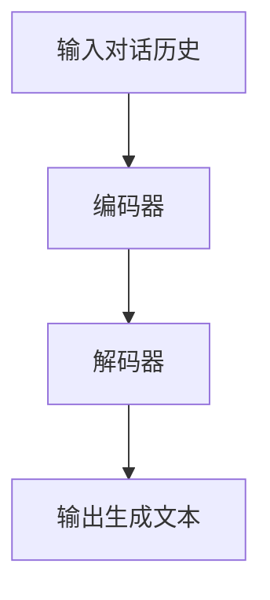
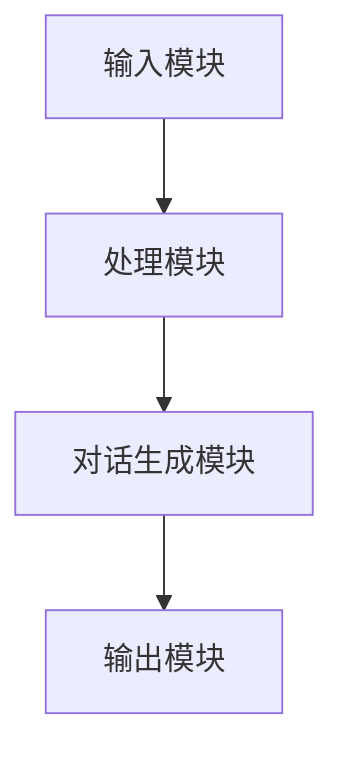
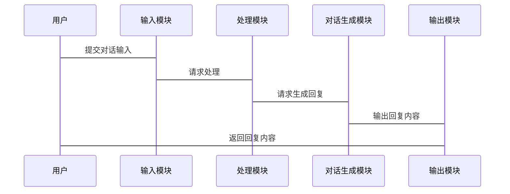

                 


# 开发AI Agent的隐私保护对话生成技术

> 关键词：AI Agent，隐私保护，对话生成，自然语言处理，机器学习，数据安全

> 摘要：本文系统地探讨了在开发AI Agent时如何实现隐私保护对话生成技术。文章从背景、核心概念、算法原理、系统架构、项目实战到最佳实践，全面解析了隐私保护对话生成技术的开发过程。通过详细的原理分析、算法设计、系统实现和案例解读，帮助读者全面掌握相关技术。

---

# 第一部分: AI Agent与隐私保护对话生成技术的背景介绍

## 第1章: AI Agent与隐私保护对话生成技术的背景

### 1.1 问题背景

#### 1.1.1 AI Agent的定义与特点
AI Agent（智能代理）是指能够感知环境、自主决策并执行任务的智能体。它通常具备以下特点：
- **自主性**：能够自主决策，无需外部干预。
- **反应性**：能够实时感知环境并做出反应。
- **目标导向**：具有明确的目标，旨在优化任务完成效果。
- **学习能力**：能够通过数据和经验不断优化自身行为。

#### 1.1.2 对话生成技术的现状与挑战
对话生成技术是自然语言处理（NLP）的重要组成部分，广泛应用于智能客服、语音助手、聊天机器人等领域。然而，当前的对话生成技术在以下方面面临挑战：
- **隐私泄露风险**：在生成对话的过程中，可能会泄露用户的敏感信息。
- **数据安全问题**：对话生成模型通常需要大量的训练数据，这些数据可能存在隐私风险。
- **模型滥用风险**：恶意用户可能利用对话生成模型进行钓鱼攻击或其他非法活动。

#### 1.1.3 隐私保护在AI Agent中的重要性
随着AI Agent的应用越来越广泛，隐私保护的重要性日益凸显。AI Agent需要处理大量的用户数据，如果不能有效保护这些数据，可能导致严重的隐私泄露问题。因此，在设计AI Agent时，必须将隐私保护作为核心考虑因素。

### 1.2 问题描述

#### 1.2.1 对话生成中的隐私泄露风险
在对话生成过程中，模型可能会泄露用户的敏感信息，例如：
- 用户的真实身份信息（姓名、地址等）。
- 用户的偏好和行为习惯。
- 用户的内部机密信息（例如企业内部沟通的内容）。

#### 1.2.2 AI Agent在实际应用中的隐私保护需求
AI Agent的应用场景多样，例如智能客服、医疗助手、金融顾问等。在这些场景中，AI Agent需要处理大量的敏感数据，因此必须满足以下隐私保护需求：
- 数据加密存储和传输。
- 隐私保护算法的应用，确保模型无法直接访问原始数据。
- 对模型输出进行隐私保护，避免泄露用户敏感信息。

#### 1.2.3 当前技术的局限性与改进方向
当前的对话生成技术在隐私保护方面存在以下局限性：
- 对话生成模型通常基于大量的训练数据，这些数据可能存在隐私泄露风险。
- 模型的透明度较低，用户无法直观了解模型如何处理数据。
- 隐私保护技术的应用较少，导致模型存在滥用风险。

为了克服这些局限性，需要从以下几个方面进行改进：
- 研究更加高效的隐私保护算法，例如联邦学习和同态加密。
- 提高模型的透明度，让用户了解数据的处理方式。
- 在模型设计阶段就考虑隐私保护需求，避免后门和漏洞。

### 1.3 核心概念与联系

#### 1.3.1 核心概念原理
- **对话生成模型**：对话生成模型通常基于Transformer架构，通过自注意力机制生成连贯且有意义的对话。
- **隐私保护技术**：隐私保护技术包括数据加密、数据脱敏、隐私计算（如联邦学习、同态加密）等。
- **AI Agent的自主决策能力**：AI Agent需要在保护隐私的前提下，自主决策并生成合适的对话内容。

#### 1.3.2 概念属性特征对比表格
以下是对话生成模型和隐私保护技术的核心属性对比：

| 属性 | 对话生成模型 | 隐私保护技术 |
|------|--------------|--------------|
| 输入 | 对话历史、当前输入 | 用户数据、模型参数 |
| 输出 | 生成的对话内容 | 加密后的数据、隐私保护的模型 |
| 核心功能 | 生成连贯的对话内容 | 保护数据隐私，防止信息泄露 |
| 约束条件 | 对话内容的连贯性和相关性 | 数据安全、模型安全 |
| 应用场景 | 智能客服、聊天机器人 | 数据加密、隐私保护 |

#### 1.3.3 ER实体关系图
以下是AI Agent、用户和系统之间的实体关系图：

```mermaid
er
    actor(Agent, 用户)
    actor(系统)
    relation(拥有, 用户 -> 系统)
    relation(依赖, Agent -> 系统)
```

---

## 第2章: AI Agent与隐私保护对话生成技术的核心概念

### 2.1 对话生成模型的算法原理

#### 2.1.1 Transformer架构
对话生成模型通常基于Transformer架构，由编码器和解码器组成。编码器将输入对话历史编码为一个固定长度的向量，解码器基于这个向量生成输出对话内容。



#### 2.1.2 自注意力机制
自注意力机制是Transformer的核心组件，用于计算输入序列中每个位置的重要性权重。

$$ \text{权重计算公式} = \text{softmax}(\frac{QK^T}{\sqrt{d_k}}) $$

#### 2.1.3 对话生成的损失函数
对话生成模型通常使用交叉熵损失函数来优化模型。

$$ \text{Loss} = -\sum_{t=1}^{T} \log p(y_t | y_{<t}, x) $$

### 2.2 隐私保护技术的实现原理

#### 2.2.1 数据加密与脱敏
数据加密和脱敏是保护用户隐私的基本手段。数据加密通过加密算法将敏感数据加密存储，脱敏技术则通过数据处理将敏感信息脱敏。

#### 2.2.2 同态加密
同态加密是一种特殊的加密技术，允许在加密数据上进行计算，同时保持数据的隐私性。

$$ \text{加密函数} = E(x) $$
$$ \text{解密函数} = D(E(x)) = x $$

#### 2.2.3 联邦学习
联邦学习是一种分布式机器学习技术，允许在不共享原始数据的情况下进行模型训练。

$$ \text{联邦学习流程} = \{D_i\}_{i=1}^n \rightarrow \text{联合训练模型} $$

### 2.3 AI Agent的自主决策能力

#### 2.3.1 自主决策的核心机制
AI Agent的自主决策能力基于强化学习和策略优化算法，例如Q-learning和策略梯度方法。

#### 2.3.2 决策过程中的隐私保护
在AI Agent的决策过程中，需要确保模型无法直接访问用户的原始数据，而是通过隐私保护技术进行处理。

---

## 第3章: AI Agent的隐私保护对话生成技术的算法实现

### 3.1 对话生成模型的实现

#### 3.1.1 Transformer模型的实现步骤
1. 输入对话历史。
2. 编码器将输入对话历史编码为一个固定长度的向量。
3. 解码器基于编码器的输出生成对话内容。

#### 3.1.2 模型训练
- 训练数据：大规模的对话数据集。
- 损失函数：交叉熵损失。
- 优化算法：Adam优化器。

#### 3.1.3 模型推理
- 输入：当前对话历史。
- 输出：生成的对话内容。

### 3.2 隐私保护技术的实现

#### 3.2.1 数据加密与脱敏
- 数据加密：使用AES算法对敏感数据进行加密。
- 数据脱敏：通过数据掩码技术将敏感信息脱敏。

#### 3.2.2 同态加密的实现
- 加密过程：对数据进行同态加密。
- 解密过程：在不泄露原始数据的情况下进行计算。

#### 3.2.3 联邦学习的实现
- 数据分布：将数据分布在不同的节点上。
- 模型训练：通过联邦学习算法进行联合训练。

### 3.3 算法实现的代码示例

#### 3.3.1 对话生成模型的代码实现
```python
import torch
import torch.nn as nn

class Transformer(nn.Module):
    def __init__(self, input_dim, output_dim):
        super(Transformer, self).__init__()
        self.encoder = nn.Linear(input_dim, 512)
        self.decoder = nn.Linear(512, output_dim)

    def forward(self, x):
        x = self.encoder(x)
        x = self.decoder(x)
        return x

model = Transformer(input_dim=100, output_dim=50)
criterion = nn.CrossEntropyLoss()
optimizer = torch.optim.Adam(model.parameters(), lr=0.001)
```

#### 3.3.2 隐私保护技术的代码实现
```python
import cryptography
from cryptography.fernet import Fernet

# 数据加密
key = Fernet.generate_key()
cipher = Fernet(key)
encrypted_data = cipher.encrypt(b'sensitive data')

# 数据解密
decrypted_data = cipher.decrypt(encrypted_data)
print(decrypted_data.decode())
```

---

## 第4章: AI Agent的隐私保护对话生成技术的系统架构设计

### 4.1 系统功能设计

#### 4.1.1 系统模块划分
- 输入模块：接收用户的对话输入。
- 处理模块：对输入数据进行隐私保护处理。
- 输出模块：生成并输出对话内容。

#### 4.1.2 系统功能流程
1. 用户输入对话内容。
2. 系统对输入数据进行隐私保护处理。
3. 对话生成模型生成回复内容。
4. 系统输出生成的对话内容。

### 4.2 系统架构设计

#### 4.2.1 系统架构图


#### 4.2.2 接口设计
- 输入接口：接收用户的对话输入。
- 输出接口：输出生成的对话内容。

#### 4.2.3 交互流程图


---

## 第5章: AI Agent的隐私保护对话生成技术的最佳实践

### 5.1 项目实战

#### 5.1.1 环境安装
- 安装Python和必要的Python包（如TensorFlow、PyTorch、Cryptography）。
- 安装对话生成模型和隐私保护库。

#### 5.1.2 系统核心实现源代码
```python
import torch
import torch.nn as nn
from cryptography.fernet import Fernet

class Transformer(nn.Module):
    def __init__(self, input_dim, output_dim):
        super(Transformer, self).__init__()
        self.encoder = nn.Linear(input_dim, 512)
        self.decoder = nn.Linear(512, output_dim)

    def forward(self, x):
        x = self.encoder(x)
        x = self.decoder(x)
        return x

# 数据加密
key = Fernet.generate_key()
cipher = Fernet(key)
encrypted_data = cipher.encrypt(b'sensitive data')

# 对话生成模型训练
model = Transformer(input_dim=100, output_dim=50)
criterion = nn.CrossEntropyLoss()
optimizer = torch.optim.Adam(model.parameters(), lr=0.001)
```

#### 5.1.3 代码应用解读与分析
- 对话生成模型：基于Transformer架构，用于生成连贯的对话内容。
- 数据加密：使用Cryptography库对敏感数据进行加密处理。
- 模型训练：使用交叉熵损失函数和Adam优化器进行训练。

### 5.2 项目小结

#### 5.2.1 核心实现的总结
- 对话生成模型的实现：基于Transformer架构，能够生成连贯的对话内容。
- 隐私保护技术的实现：数据加密和脱敏技术，确保数据隐私。

#### 5.2.2 实际案例分析
- 案例1：智能客服中的隐私保护对话生成。
- 案例2：医疗领域的隐私保护对话生成。

### 5.3 最佳实践 tips

#### 5.3.1 开发过程中的注意事项
- 在设计模型时，必须考虑隐私保护需求。
- 对话生成模型的训练数据必须进行脱敏处理。
- 模型的输出必须经过隐私保护处理，确保不会泄露用户敏感信息。

#### 5.3.2 系统优化建议
- 使用更高效的隐私保护算法，例如联邦学习和同态加密。
- 提高模型的透明度，让用户了解数据的处理方式。
- 定期进行安全测试，确保系统没有隐私泄露漏洞。

---

## 第6章: 总结与扩展阅读

### 6.1 核心内容总结
- AI Agent的定义与特点。
- 对话生成模型的算法原理。
- 隐私保护技术的实现方法。
- 系统架构设计与实现。
- 项目实战与最佳实践。

### 6.2 小结
本文系统地探讨了AI Agent的隐私保护对话生成技术的开发过程，从核心概念到算法实现，再到系统架构和项目实战，全面解析了相关技术的实现细节。

### 6.3 注意事项
- 在开发AI Agent时，必须将隐私保护作为核心需求。
- 对话生成模型的训练数据必须经过脱敏处理。
- 模型的输出必须经过隐私保护处理，确保不会泄露用户敏感信息。

### 6.4 拓展阅读
- 隐私保护技术：联邦学习、同态加密、数据脱敏。
- 对话生成模型：Transformer、GPT、BERT。
- AI Agent：自主决策、强化学习、人机交互。

---

# 作者：AI天才研究院/AI Genius Institute & 禅与计算机程序设计艺术 /Zen And The Art of Computer Programming

---

通过以上详细的分析和阐述，本文全面解析了AI Agent的隐私保护对话生成技术的开发过程，从核心概念到算法实现，再到系统架构和项目实战，为读者提供了全面的技术指导。希望本文能够帮助读者更好地理解和掌握相关技术，并在实际应用中加以运用。

