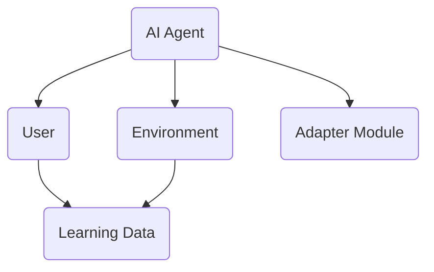
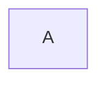
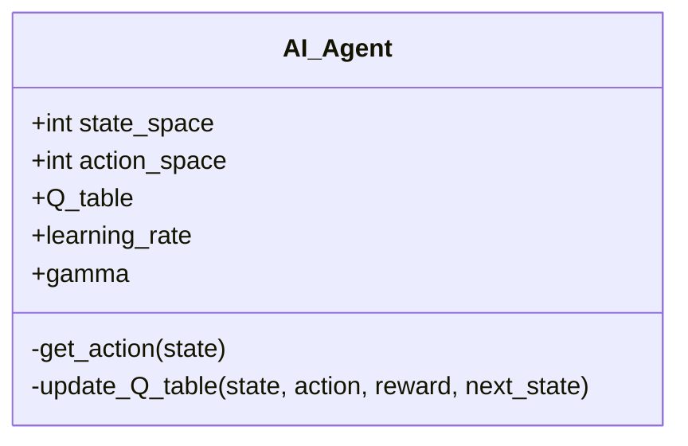
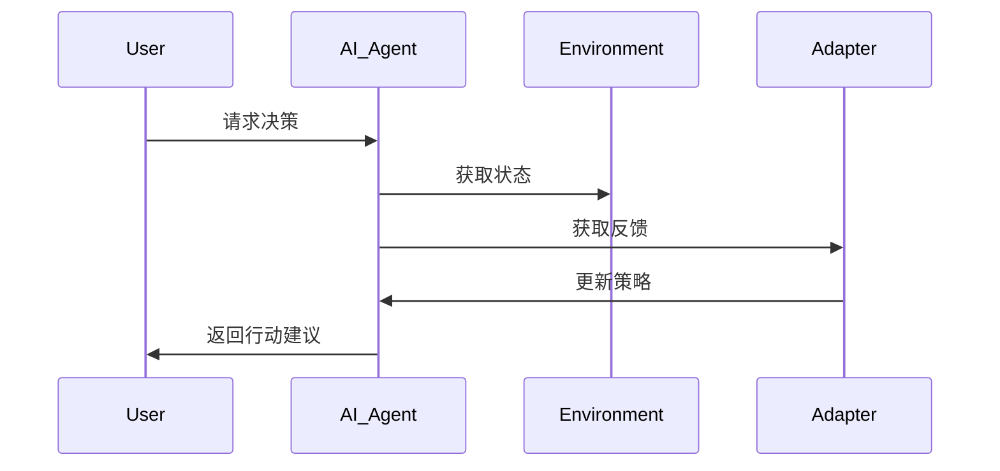

                 


# 构建AI Agent的自适应学习系统

## 关键词：AI Agent, 自适应学习, 强化学习, 自适应算法, 系统架构, 项目实战

## 摘要：本文将详细探讨如何构建一个基于AI Agent的自适应学习系统，从背景介绍、核心概念、算法原理、系统架构到项目实战，层层解析，帮助读者深入了解系统的构建过程和实现细节。

---

# 第一部分: AI Agent与自适应学习系统背景介绍

# 第1章: AI Agent与自适应学习系统概述

## 1.1 问题背景

### 1.1.1 当前AI Agent的发展现状

AI Agent（智能代理）作为人工智能的核心技术，近年来得到了飞速发展。从简单的规则引擎到复杂的深度学习模型，AI Agent在各个领域展现出强大的应用潜力。然而，现有的AI Agent大多依赖于固定的规则或预训练的模型，在动态变化的环境中难以自适应调整，这限制了其应用的广度和深度。

### 1.1.2 自适应学习系统的必要性

为了使AI Agent能够更好地适应复杂多变的环境，自适应学习系统变得尤为重要。自适应学习系统能够根据实时反馈不断优化模型参数和决策策略，从而提高系统的智能性和灵活性。

### 1.1.3 问题解决思路与方法

构建自适应学习系统的核心思路是结合强化学习算法和动态反馈机制，使AI Agent能够在与环境交互的过程中不断学习和优化。通过实时反馈调整策略，AI Agent能够更好地应对未知和变化的环境。

### 1.1.4 系统边界与外延

自适应学习系统的边界包括输入数据（如用户反馈、环境状态）、输出决策（如行动建议）、内部状态（如学习模型参数）等。系统的外延则涉及数据源、用户界面、执行环境等多个方面。

### 1.1.5 核心要素组成与关系

自适应学习系统的核心要素包括感知模块、决策模块、学习模块和反馈模块。感知模块负责获取环境信息，决策模块基于当前状态做出决策，学习模块通过反馈不断优化模型，反馈模块将结果传递给感知模块，形成闭环。

## 1.2 问题描述

### 1.2.1 AI Agent的核心功能

AI Agent需要具备以下核心功能：环境感知、自主决策、自适应学习和人机交互。这些功能共同构成了一个完整的智能代理系统。

### 1.2.2 自适应学习系统的定义

自适应学习系统是一种能够根据实时反馈不断优化自身模型和决策策略的系统。它通过与环境的交互，动态调整参数和规则，以适应不断变化的需求。

### 1.2.3 系统边界与外延

系统的边界包括输入数据、输出决策、内部状态等，而外延则涉及数据源、用户界面、执行环境等多个方面。

### 1.2.4 核心要素组成与关系

自适应学习系统的核心要素包括感知模块、决策模块、学习模块和反馈模块。这些模块之间相互关联，形成一个动态优化的闭环系统。

## 1.3 核心概念与联系

### 1.3.1 AI Agent与自适应学习系统的概念结构

AI Agent是一个智能实体，能够感知环境并采取行动；自适应学习系统是一个动态优化机制，使AI Agent能够不断改进其行为。

### 1.3.2 核心要素组成与关系

通过对比分析，制作一个对比表格，列出AI Agent和自适应学习系统的属性特征。例如：

| 特性 | AI Agent | 自适应学习系统 |
|------|-----------|----------------|
| 输入 | 环境状态   | 用户反馈       |
| 输出 | 行动建议   | 优化策略       |
| 内部 | 感知模块   | 学习模块        |

### 1.3.3 实体关系架构



## 1.4 本章小结

---

# 第二部分: 核心概念与联系

# 第2章: AI Agent的核心原理

## 2.1 AI Agent的基本原理

### 2.1.1 AI Agent的定义与分类

AI Agent可以分为简单反射式Agent和基于模型的Agent。简单反射式Agent基于当前感知做出反应，而基于模型的Agent则通过内部模型进行推理和规划。

### 2.1.2 自主决策机制

AI Agent的决策过程通常包括状态感知、策略选择和行动执行三个阶段。通过强化学习算法，AI Agent能够在复杂的环境中做出最优决策。

### 2.1.3 人机交互模型

人机交互是AI Agent与用户或环境互动的过程。通过自然语言处理和图形界面，AI Agent能够与用户进行有效的信息交流。

## 2.2 自适应学习系统的原理

### 2.2.1 自适应学习的定义

自适应学习是一种动态优化机制，使系统能够根据反馈不断改进其行为。它通常基于强化学习算法，通过奖励机制引导系统优化其策略。

### 2.2.2 知识表示与推理

自适应学习系统需要将知识表示为可计算的形式，并通过推理引擎进行逻辑推理。知识表示通常采用符号逻辑或概率图模型。

### 2.2.3 学习策略与优化

自适应学习系统的核心是学习策略，它决定了系统如何根据反馈调整其行为。常用的策略包括Q-learning、深度强化学习等。

## 2.3 核心概念对比

### 2.3.1 AI Agent与传统程序的区别

AI Agent能够感知环境并自主决策，而传统程序通常基于固定的规则执行任务。AI Agent具备更强的适应性和灵活性。

### 2.3.2 自适应学习与被动学习的对比

自适应学习系统能够主动调整其行为，而被动学习系统通常依赖于外部数据进行批量训练。自适应学习更加注重实时反馈和动态优化。

### 2.3.3 系统核心要素的属性特征对比表

| 特性 | AI Agent | 自适应学习系统 |
|------|-----------|----------------|
| 输入 | 环境状态   | 用户反馈       |
| 输出 | 行动建议   | 优化策略       |
| 内部 | 感知模块   | 学习模块        |

## 2.4 实体关系架构


## 2.5 本章小结

---

# 第三部分: 算法原理讲解

# 第3章: 强化学习算法原理

## 3.1 强化学习的基本概念

### 3.1.1 强化学习的定义

强化学习是一种通过试错机制优化决策策略的方法。系统通过与环境交互获得奖励，从而学习最优策略。

### 3.1.2 状态、动作、奖励的关系

在强化学习中，状态表示当前环境的情况，动作是系统采取的行动，奖励是系统获得的反馈。通过最大化累积奖励，系统能够学习最优策略。

### 3.1.3 Q-learning算法的数学模型

Q-learning算法的核心是更新Q值，公式为：
$$ Q(s,a) = (1-\alpha)Q(s,a) + \alpha (r + \max Q(s',a')) $$
其中，$\alpha$是学习率，$r$是奖励，$s'$是下一个状态。

## 3.2 自适应学习算法的实现

### 3.2.1 算法流程图



### 3.2.2 Python代码实现

```python
import numpy as np

class AI_Agent:
    def __init__(self, state_space, action_space):
        self.state_space = state_space
        self.action_space = action_space
        self.Q_table = np.zeros((state_space, action_space))
        self.learning_rate = 0.1
        self.gamma = 0.9

    def get_action(self, state):
        return np.argmax(self.Q_table[state])

    def update_Q_table(self, state, action, reward, next_state):
        self.Q_table[state, action] = self.Q_table[state, action] * (1 - self.learning_rate) + self.learning_rate * (reward + self.gamma * np.max(self.Q_table[next_state]))

# 示例使用
agent = AI_Agent(5, 3)
state = 0
action = agent.get_action(state)
reward = 1
next_state = 2
agent.update_Q_table(state, action, reward, next_state)
```

### 3.2.3 算法实现细节与优化

在实际应用中，Q-learning算法可以通过经验回放和目标网络进行优化。经验回放可以减少样本偏差，目标网络可以稳定训练过程。

## 3.3 本章小结

---

# 第四部分: 系统分析与架构设计

# 第4章: 问题场景介绍

## 4.1 系统需求分析

### 4.1.1 功能需求

系统需要具备环境感知、自主决策、自适应学习和人机交互功能。

### 4.1.2 性能需求

系统需要在实时环境中快速响应，保证决策的准确性和效率。

### 4.1.3 接口需求

系统需要与外部环境和用户进行数据交互，定义清晰的接口规范。

## 4.2 系统功能设计

### 4.2.1 领域模型设计

使用Mermaid类图展示系统各模块之间的关系。



### 4.2.2 系统架构设计

使用Mermaid架构图展示系统的分层结构。


### 4.2.3 系统接口设计

定义系统的主要接口，如数据输入接口、决策输出接口等。

### 4.2.4 系统交互设计

使用Mermaid序列图展示用户与系统之间的交互流程。



## 4.3 本章小结

---

# 第五部分: 项目实战

# 第5章: 环境安装与系统核心实现

## 5.1 环境安装

### 5.1.1 安装Python

确保系统已安装Python 3.6及以上版本。

### 5.1.2 安装依赖库

安装numpy和matplotlib等依赖库。

## 5.2 系统核心实现

### 5.2.1 核心代码实现

```python
import numpy as np

class AI_Agent:
    def __init__(self, state_space, action_space):
        self.state_space = state_space
        self.action_space = action_space
        self.Q_table = np.zeros((state_space, action_space))
        self.learning_rate = 0.1
        self.gamma = 0.9

    def get_action(self, state):
        return np.argmax(self.Q_table[state])

    def update_Q_table(self, state, action, reward, next_state):
        self.Q_table[state, action] = self.Q_table[state, action] * (1 - self.learning_rate) + self.learning_rate * (reward + self.gamma * np.max(self.Q_table[next_state]))

# 示例使用
agent = AI_Agent(5, 3)
state = 0
action = agent.get_action(state)
reward = 1
next_state = 2
agent.update_Q_table(state, action, reward, next_state)
```

### 5.2.2 代码解读与分析

详细解释代码的实现细节，如Q_table的更新机制、学习率的设置等。

## 5.3 实际案例分析与详细讲解

### 5.3.1 案例场景

假设系统需要在动态环境中优化用户的购物决策。

### 5.3.2 实际实现步骤

详细描述系统的实现过程，包括数据输入、模型训练、策略优化等步骤。

### 5.3.3 系统运行结果与分析

展示系统的运行结果，分析其优化效果。

## 5.4 本章小结

---

# 第六部分: 最佳实践、小结、注意事项与拓展阅读

# 第6章: 最佳实践

## 6.1 小结

通过本文的详细讲解，读者可以深入了解如何构建一个基于AI Agent的自适应学习系统。从背景介绍到算法实现，再到系统设计和项目实战，每个环节都进行了详细的分析和解读。

## 6.2 注意事项

在实际应用中，需要注意以下几点：数据质量、算法选择、系统优化和安全性保障。

## 6.3 拓展阅读

建议读者进一步学习强化学习的高级算法，如深度强化学习和多智能体强化学习，以提升系统的复杂性和智能化水平。

## 6.4 本章小结

---

# 作者：AI天才研究院/AI Genius Institute & 禅与计算机程序设计艺术 /Zen And The Art of Computer Programming

---

希望这篇文章能够为读者提供有价值的参考，帮助他们更好地理解和应用AI Agent的自适应学习系统。

