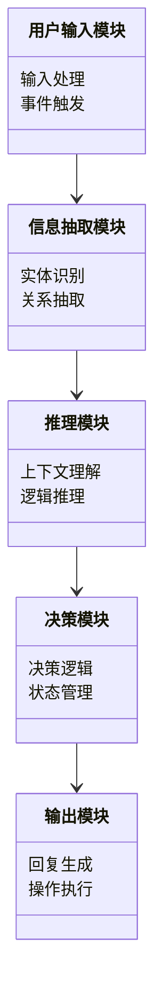
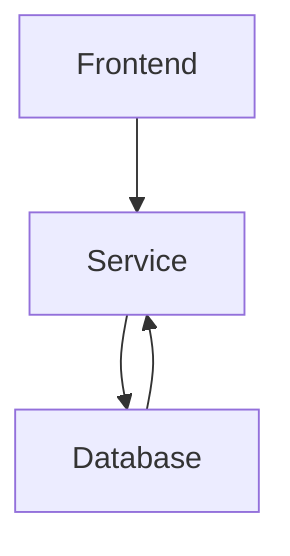
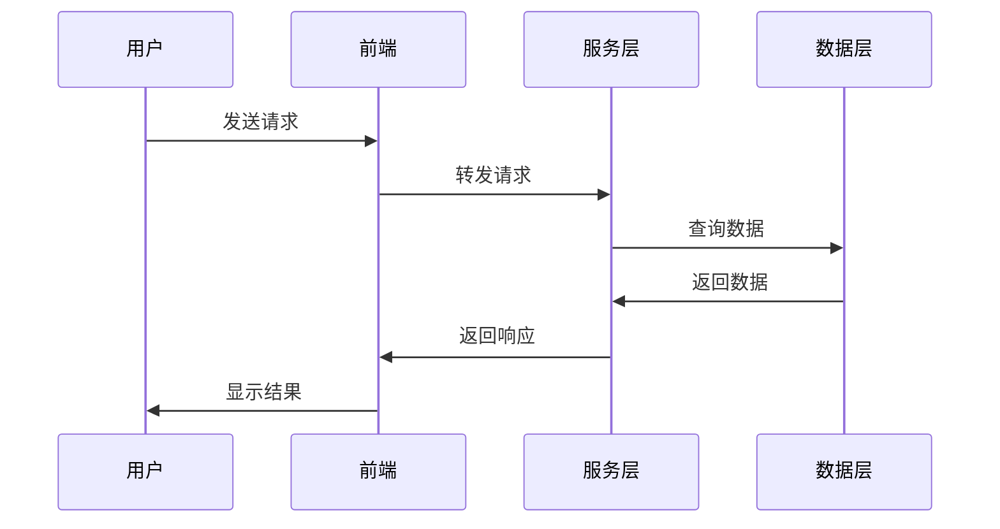

                 


# 构建LLM支持的AI Agent自然语言推理

> **关键词**：LLM、AI Agent、自然语言推理、Transformer、大语言模型  
> **摘要**：本文详细探讨了构建基于大语言模型（LLM）的AI Agent自然语言推理系统的各个方面，包括LLM的核心原理、自然语言推理的关键任务、AI Agent的设计与实现、算法原理与优化、系统架构设计以及项目实战。文章从理论到实践，逐步引导读者理解并掌握构建这一系统的全过程。

---

## 第1章: LLM与AI Agent自然语言推理概述

### 1.1 LLM与AI Agent的基本概念
#### 1.1.1 大语言模型（LLM）的定义与特点
大语言模型（LLM，Large Language Model）是指基于深度学习技术构建的、能够处理和理解大规模自然语言数据的模型。LLM的特点包括：
- **大规模**：通常训练数据量超过 billions of tokens。
- **通用性**：能够处理多种NLP任务（如文本生成、翻译、问答等）。
- **上下文理解**：基于Transformer架构，能够捕捉上下文关系。

#### 1.1.2 AI Agent的基本概念与功能
AI Agent（智能体）是一种能够感知环境、执行任务并做出决策的智能系统。其核心功能包括：
- **感知**：通过传感器或API获取环境信息。
- **推理**：基于感知信息进行逻辑推理。
- **决策**：根据推理结果做出最优决策。
- **执行**：通过执行器将决策转化为具体操作。

#### 1.1.3 自然语言推理的定义与作用
自然语言推理（NLP，Natural Language Processing）是研究如何让计算机理解和推断自然语言文本中蕴含的逻辑关系。其作用包括：
- **信息抽取**：从文本中提取关键信息。
- **逻辑推理**：基于上下文进行推理。
- **对话生成**：在对话系统中生成合理的回复。

---

### 1.2 LLM支持的AI Agent的应用场景
#### 1.2.1 人机交互中的自然语言理解
LLM支持的AI Agent能够通过自然语言理解技术，帮助用户更方便地与系统交互。例如：
- 智能音箱通过语音识别和自然语言理解实现人机对话。
- 智能客服通过理解用户的问题提供准确的答案。

#### 1.2.2 任务型AI Agent的典型应用
任务型AI Agent广泛应用于各个领域，例如：
- **客服系统**：通过自然语言理解帮助用户解决问题。
- **健康助手**：根据用户的症状提供医疗建议。
- **金融顾问**：基于用户的财务状况提供建议。

#### 1.2.3 自然语言推理在对话系统中的作用
自然语言推理在对话系统中起着关键作用：
- **理解上下文**：通过推理对话历史理解当前对话的背景。
- **生成合理回复**：基于上下文生成符合逻辑的回复。
- **处理歧义**：通过推理消除语义歧义。

---

### 1.3 本章小结
本章介绍了LLM和AI Agent的基本概念，并探讨了自然语言推理在AI Agent中的作用。通过实际应用场景的分析，读者可以理解构建LLM支持的AI Agent自然语言推理系统的重要性和必要性。

---

## 第2章: LLM的核心原理与技术

### 2.1 大语言模型的模型结构
#### 2.1.1 Transformer模型的基本结构
Transformer模型由Google于2018年提出，其核心结构包括：
- **编码器**：将输入序列编码为固定长度的向量。
- **解码器**：根据编码器输出生成目标序列。

Mermaid图示：
```mermaid
graph TD
    Encoder -> Input-Token -> Embedding-Token
    Encoder -> Input-Position -> Embedding-Position
    Encoder -> Multi-Head Attention
    Encoder -> FFN
    Decoder -> Multi-Head Attention (Self-Attention)
    Decoder -> Multi-Head Attention (Cross-Attention)
    Decoder -> FFN
```

#### 2.1.2 注意力机制的原理
注意力机制（Attention）用于计算输入序列中每个位置的重要性：
$$
\text{Attention}(Q, K, V) = \text{softmax}\left(\frac{QK^T}{\sqrt{d_k}}\right)V
$$

其中，$Q$、$K$、$V$分别为查询、键和值向量。

#### 2.1.3 编码器-解码器架构
编码器-解码器架构通过编码器将输入序列编码为语义向量，解码器根据编码结果生成目标序列。

---

### 2.2 LLM的训练与优化
#### 2.2.1 预训练任务的设计
常用的预训练任务包括：
- **Masked Language Model (MLM)**：随机遮蔽部分词并预测。
- **Next Sentence Prediction (NSP)**：预测下一句是否与前一句相邻。

#### 2.2.2 模型的并行训练技术
并行训练技术包括：
- **数据并行**：将数据分片并并行训练。
- **模型并行**：将模型分片并并行训练。

#### 2.2.3 模型的调优与微调
微调（Fine-tuning）是通过在特定任务上进一步训练模型，使其适应具体需求。

---

### 2.3 LLM的评估与基准测试
#### 2.3.1 常用的评估指标
常用的评估指标包括：
- **准确率 (Accuracy)**：分类任务中的正确预测比例。
- **F1值 (F1-Score)**：综合考虑精确率和召回率。
- **困惑度 (Perplexity)**：衡量模型生成文本的概率分布。

#### 2.3.2 基准测试的流程与方法
基准测试通常包括：
1. 数据集准备。
2. 模型训练。
3. 模型评估。
4. 结果分析。

#### 2.3.3 模型性能的提升策略
提升策略包括：
- **数据增强**：增加训练数据的多样性。
- **优化算法**：使用更高效的优化算法（如AdamW）。
- **模型剪枝**：减少模型参数数量。

---

### 2.4 本章小结
本章详细介绍了大语言模型的核心原理与技术，包括模型结构、训练方法和评估指标。这些内容为后续章节的实现奠定了基础。

---

## 第3章: 自然语言推理的核心任务与技术

### 3.1 自然语言推理的基本任务
#### 3.1.1 文本分类任务
文本分类任务包括：
- **情感分析**：判断文本的情感倾向。
- **主题分类**：将文本归类到特定主题。

#### 3.1.2 实体识别与链接
实体识别（NER，Named Entity Recognition）用于识别文本中的命名实体（如人名、地名）。

#### 3.1.3 语义角色标注
语义角色标注（SRL，Semantic Role Labeling）用于标注句子中谓词的语义角色。

---

### 3.2 基于LLM的自然语言推理实现
#### 3.2.1 基于LLM的文本理解
LLM能够通过上下文理解文本的含义，例如：
- 通过上下文推理出隐含的信息。
- 基于上下文生成连贯的回复。

#### 3.2.2 基于LLM的逻辑推理
LLM可以通过推理生成逻辑连贯的结论：
- 使用逻辑推理规则（如蕴含、矛盾等）进行判断。

#### 3.2.3 基于LLM的上下文记忆
LLM可以通过记忆机制（如记忆网络）存储和利用上下文信息。

---

### 3.3 自然语言推理的挑战与解决方案
#### 3.3.1 数据稀疏性问题
数据稀疏性问题可以通过数据增强和迁移学习解决。

#### 3.3.2 对抗性攻击的防御
对抗性攻击的防御策略包括：
- 增强模型的鲁棒性。
- 使用防御技术（如对抗训练）。

#### 3.3.3 多语言推理的实现
多语言推理可以通过多语言模型（如Marian）实现。

---

### 3.4 本章小结
本章探讨了自然语言推理的核心任务和技术，包括文本分类、实体识别和语义角色标注。同时，分析了基于LLM的推理实现及其挑战。

---

## 第4章: AI Agent的构建与设计

### 4.1 AI Agent的设计原则
#### 4.1.1 目标驱动的设计理念
AI Agent的设计应以目标为导向，确保功能与任务需求一致。

#### 4.1.2 模块化设计的实现
模块化设计包括：
- **感知模块**：负责获取输入。
- **推理模块**：负责逻辑推理。
- **决策模块**：负责做出决策。

#### 4.1.3 可扩展性设计的考虑
可扩展性设计包括：
- **插件化设计**：便于功能扩展。
- **接口标准化**：便于与其他系统集成。

---

### 4.2 基于LLM的AI Agent功能设计
#### 4.2.1 信息抽取模块
信息抽取模块用于从输入文本中提取关键信息，例如：
- 提取文本中的实体信息。
- 提取文本中的关系信息。

#### 4.2.2 知识表示模块
知识表示模块用于将提取的信息表示为知识图谱或向量形式。

#### 4.2.3 推理与决策模块
推理与决策模块基于知识表示进行推理并做出决策。

---

### 4.3 AI Agent的协作机制
#### 4.3.1 多Agent协作的实现
多Agent协作可以通过分布式架构实现，例如：
- **分布式计算**：每个Agent负责特定任务。
- **通信协议**：通过特定协议进行信息交换。

#### 4.3.2 人机协作的模式
人机协作模式包括：
- **人主导模式**：用户主导决策，AI Agent辅助。
- **AI主导模式**：AI Agent主导决策，用户辅助。

#### 4.3.3 Agent间的通信协议
通信协议包括：
- **数据格式**：定义数据的结构和格式。
- **通信接口**：定义交互的接口和方法。

---

### 4.4 本章小结
本章详细介绍了AI Agent的设计与实现，包括设计原则、功能模块和协作机制。这些内容为构建LLM支持的AI Agent奠定了基础。

---

## 第5章: 自然语言推理的算法原理与实现

### 5.1 基于Transformer的自然语言推理算法
#### 5.1.1 Transformer模型的结构
Transformer模型的结构包括编码器和解码器，每个部分包含多个堆叠的层。

Mermaid图示：
```mermaid
graph TD
    EncoderLayer --> Multi-Head Attention
    Multi-Head Attention --> FFN
    DecoderLayer --> Multi-Head Attention
    Multi-Head Attention --> Cross-Attention
    Cross-Attention --> FFN
```

#### 5.1.2 注意力机制的实现
注意力机制的实现包括：
- **计算键、查询和值向量**。
- **计算注意力权重**。
- **加权求和生成最终向量**。

#### 5.1.3 Transformer的前向传播
Transformer的前向传播过程包括：
1. **编码器输入处理**：将输入序列编码为向量。
2. **解码器输入处理**：根据编码结果生成目标序列。

---

### 5.2 基于LLM的自然语言推理实现
#### 5.2.1 LLM的微调与适应
LLM的微调包括：
- **任务特定的预训练**：在特定任务上进行微调。
- **数据增强**：增加任务相关的数据。

#### 5.2.2 推理过程中的上下文处理
上下文处理包括：
- **记忆机制**：通过记忆网络存储上下文信息。
- **状态管理**：通过状态变量管理上下文。

---

### 5.3 自然语言推理的优化策略
#### 5.3.1 模型压缩与优化
模型压缩技术包括：
- **剪枝**：删除冗余参数。
- **量化**：降低参数精度。

#### 5.3.2 多任务学习与联合优化
多任务学习通过共享特征提取部分，提高模型的泛化能力。

#### 5.3.3 模型的可解释性优化
模型的可解释性优化包括：
- **可视化**：通过可视化工具展示模型的注意力权重。
- **可解释性算法**：使用可解释性算法（如SHAP值）分析模型决策。

---

### 5.4 本章小结
本章详细介绍了自然语言推理的算法原理与实现，包括Transformer模型的结构、LLM的微调与适应，以及推理过程中的上下文处理。

---

## 第6章: 系统架构设计与实现

### 6.1 问题场景介绍
本章以一个智能客服系统为例，介绍系统架构设计。

---

### 6.2 系统功能设计
#### 6.2.1 功能模块划分
功能模块包括：
- **用户输入模块**：接收用户的输入。
- **信息抽取模块**：提取用户输入的关键信息。
- **推理模块**：基于信息进行推理。
- **决策模块**：根据推理结果做出决策。
- **输出模块**：生成回复或执行操作。

#### 6.2.2 领域模型设计
领域模型包括：
- **用户信息模型**：存储用户的基本信息。
- **问题分类模型**：分类用户的问题类型。
- **知识库模型**：存储领域知识。

Mermaid图示：


---

### 6.3 系统架构设计
#### 6.3.1 系统架构图
系统架构包括：
- **前端层**：用户交互界面。
- **服务层**：业务逻辑处理。
- **数据层**：数据存储与管理。

Mermaid图示：


#### 6.3.2 系统接口设计
系统接口包括：
- **API接口**：用于与其他系统的交互。
- **内部接口**：用于模块间的通信。

#### 6.3.3 系统交互流程
系统交互流程包括：
1. 用户输入请求。
2. 前端处理请求并传递给服务层。
3. 服务层处理请求并调用数据层。
4. 数据层处理请求并返回结果。
5. 服务层根据结果生成响应。
6. 前端显示响应结果。

Mermaid图示：


---

### 6.4 本章小结
本章详细介绍了系统架构设计与实现，包括功能模块划分、系统架构图和系统交互流程。

---

## 第7章: 项目实战——构建LLM支持的AI Agent自然语言推理系统

### 7.1 项目背景与目标
本项目旨在构建一个基于LLM的AI Agent自然语言推理系统，实现人机交互中的自然语言理解与推理。

---

### 7.2 项目环境与工具安装
#### 7.2.1 环境配置
- **操作系统**：Linux/Windows/MacOS
- **Python版本**：3.8以上
- **框架选择**：使用Hugging Face的Transformers库。

#### 7.2.2 工具安装
安装必要的库：
```bash
pip install transformers
pip install torch
pip install numpy
```

---

### 7.3 系统核心实现
#### 7.3.1 信息抽取模块实现
使用spaCy进行实体识别：
```python
import spacy

nlp = spacy.load("en_core_web_sm")
doc = nlp("John works at Google.")
for ent in doc.ents:
    print(ent.text, ent.label_)
```

#### 7.3.2 推理模块实现
基于LLM的推理实现：
```python
from transformers import AutoModelForSeq2SeqLM, AutoTokenizer

tokenizer = AutoTokenizer.from_pretrained("facebook/bart-large")
model = AutoModelForSeq2SeqLM.from_pretrained("facebook/bart-large")

inputs = tokenizer("Given that it is raining, what should I do?", return_tensors="pt")
outputs = model.generate(inputs.input_ids, max_length=50)
print(tokenizer.decode(outputs[0], skip_special_tokens=True))
```

#### 7.3.3 决策模块实现
基于推理结果的决策逻辑：
```python
def make_decision(inference_result):
    if inference_result == "yes":
        return "Execute action"
    else:
        return "Do nothing"
```

---

### 7.4 项目测试与优化
#### 7.4.1 系统测试
测试内容包括：
- **功能测试**：验证各模块的功能是否正常。
- **性能测试**：测试系统的响应时间和处理能力。
- **安全性测试**：验证系统的安全性。

#### 7.4.2 系统优化
优化策略包括：
- **模型优化**：通过剪枝和量化优化模型性能。
- **算法优化**：优化推理算法的效率。
- **系统调优**：优化系统的资源利用率。

---

### 7.5 项目小结
本章通过一个实际项目展示了如何构建基于LLM的AI Agent自然语言推理系统。通过项目实战，读者可以掌握从环境配置到系统实现的全过程。

---

## 第8章: 最佳实践与总结

### 8.1 最佳实践
#### 8.1.1 数据处理
- 数据清洗：去除噪声数据。
- 数据增强：增加数据的多样性和代表性。

#### 8.1.2 模型优化
- 模型剪枝：减少模型参数数量。
- 模型量化：降低模型参数精度。

#### 8.1.3 系统部署
- 使用容器化技术（如Docker）部署系统。
- 使用云平台（如AWS、Azure）进行扩展。

---

### 8.2 项目总结
通过本文的介绍，读者可以系统地掌握构建基于LLM的AI Agent自然语言推理系统的各个方面。从理论到实践，文章详细讲解了LLM的核心原理、自然语言推理的关键任务、AI Agent的设计与实现、系统架构设计以及项目实战。

---

## 作者：AI天才研究院/AI Genius Institute & 禅与计算机程序设计艺术 /Zen And The Art of Computer Programming

---

**小结**：本文通过详细讲解构建LLM支持的AI Agent自然语言推理系统的各个方面，帮助读者从理论到实践全面掌握相关技术。从模型原理到系统架构，从算法实现到项目实战，本文为读者提供了丰富的知识和实用的指导。

