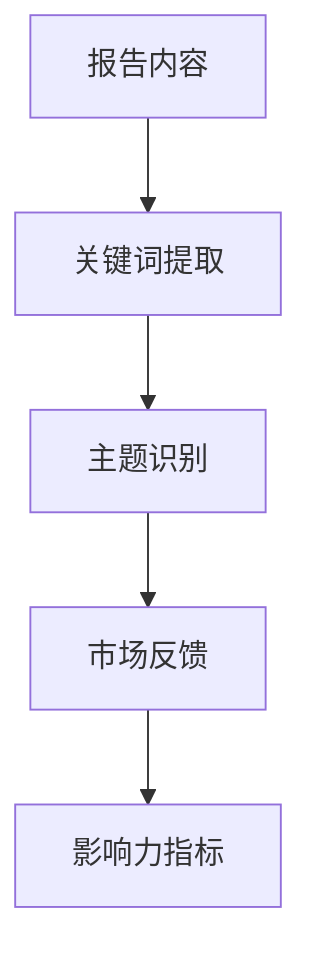
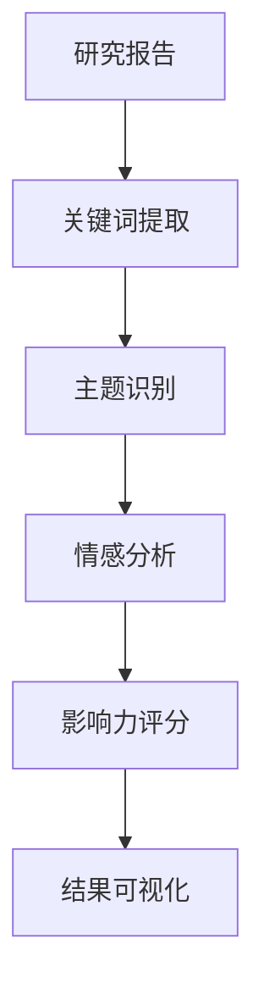
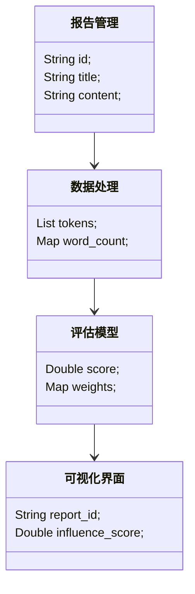
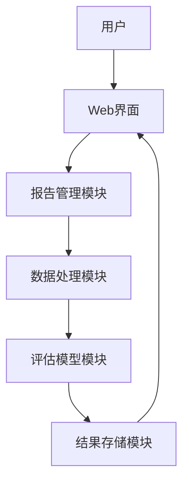

                 


# 构建基于NLP的金融研究报告影响力评估系统

## 关键词：NLP、金融报告、影响力评估、文本相似度、知识图谱、系统架构

## 摘要：  
本文系统地介绍了如何利用自然语言处理（NLP）技术构建金融研究报告影响力评估系统。通过分析金融研究报告的核心要素，结合NLP技术，提出了一套基于文本相似度计算和知识图谱构建的影响力评估方法。文章详细探讨了算法原理、系统架构设计及项目实现，并通过实际案例展示了系统的应用价值。

---

# 第一部分: 背景介绍

# 第1章: 问题背景与需求分析

## 1.1 问题背景

### 1.1.1 金融研究报告的重要性
金融研究报告是投资者和金融机构做出决策的重要依据。然而，报告的数量庞大，且缺乏统一的评估标准，导致难以快速识别高质量报告。

### 1.1.2 现有评估体系的局限性
传统评估方法主要依赖人工经验，主观性强，效率低，难以应对海量数据的挑战。

### 1.1.3 NLP技术在金融领域的应用潜力
NLP技术可以通过自动化分析文本内容，提取关键信息，为金融研究报告的影响力评估提供技术支持。

## 1.2 问题描述

### 1.2.1 金融研究报告影响力的定义
影响力是指报告内容对市场行为、投资决策的潜在影响程度。

### 1.2.2 影响力评估的核心要素
包括报告内容的相关性、权威性、市场关注度和传播广度。

### 1.2.3 研究报告影响力与市场行为的关系
影响力高的报告通常会引发市场波动，影响资产价格。

## 1.3 问题解决思路

### 1.3.1 基于NLP的文本分析方法
利用分词、实体识别等技术提取报告内容的关键信息。

### 1.3.2 数据驱动的影响力评估模型
通过分析报告的文本特征和市场反馈，建立数据驱动的评估模型。

### 1.3.3 系统化解决方案的设计思路
构建一个集文本分析、数据挖掘和可视化于一体的影响力评估系统。

## 1.4 系统边界与外延

### 1.4.1 系统功能边界
系统仅专注于报告内容的影响力评估，不涉及具体的投资决策。

### 1.4.2 系统外延与扩展性
未来可以考虑引入实时市场数据和用户反馈，进一步提升评估精度。

### 1.4.3 与其他金融系统的接口关系
系统可以与投资管理系统、风险评估系统等其他金融系统对接。

## 1.5 概念结构与核心要素

### 1.5.1 系统核心概念框架
- **报告内容**：包括标题、摘要、正文等。
- **市场反馈**：包括股价波动、交易量变化等。
- **影响力指标**：包括关注度、传播度、相关性等。

### 1.5.2 核心要素的属性特征
| 核心要素 | 属性特征 |
|----------|-----------|
| 报告内容 | 文本长度、关键词密度 |
| 市场反馈 | 时间范围、影响程度 |
| 影响力指标 | 计算方法、评估维度 |

### 1.5.3 概念结构的层次分解


---

# 第二部分: 核心概念与联系

# 第2章: 核心概念与原理

## 2.1 影响力评估系统的核心概念

### 2.1.1 文本分析与语义理解
通过分词、实体识别等技术，提取报告中的关键信息。

### 2.1.2 金融知识图谱构建
建立金融领域的知识图谱，用于识别报告中的相关概念。

### 2.1.3 多维度影响力指标
结合文本特征和市场反馈，构建多维度的影响力评估指标。

## 2.2 NLP技术在影响力评估中的应用

### 2.2.1 文本预处理与特征提取
- **分词**：将文本分割成词语或短语。
- **去停用词**：去除无意义的词汇，如“的”、“是”等。

### 2.2.2 情感分析与主题识别
- **情感分析**：判断报告内容的市场情绪。
- **主题识别**：识别报告的核心主题。

### 2.2.3 知识抽取与关联分析
- **知识抽取**：从文本中提取实体、关系和事件。
- **关联分析**：分析实体之间的关联关系。

## 2.3 实体关系图与系统架构



---

# 第三部分: 算法原理与数学模型

# 第3章: 文本相似度计算算法

## 3.1 余弦相似度算法

### 3.1.1 算法原理
余弦相似度通过计算向量的夹角余弦值，衡量文本之间的相似程度。

### 3.1.2 计算公式
$$ \cos\theta = \frac{\vec{A} \cdot \vec{B}}{|\vec{A}| |\vec{B}|} $$

### 3.1.3 示例代码
```python
from sklearn.metrics.pairwise import cosine_similarity

# 示例文本向量化后的结果
vec1 = [0.5, 0.6, 0.8]
vec2 = [0.7, 0.5, 0.9]

similarity = cosine_similarity([vec1], [vec2])[0][0]
print(similarity)  # 输出余弦相似度
```

---

## 3.2 BM25算法

### 3.2.1 算法原理
BM25是一种基于概率的语言模型，常用于信息检索任务。

### 3.2.2 计算公式
$$ BM25 = \log(\frac{d}{d_i} + 1) \times \frac{tf \times (k + 1)}{tf + k} $$
其中：
- \(d\) 是文档总数
- \(d_i\) 是包含关键词的文档数
- \(tf\) 是关键词在文档中的出现次数
- \(k\) 是参数，通常取1或2

### 3.2.3 示例代码
```python
from rank_bm25 import BM25

# 示例文本
texts = ["This is a test document", "Another document"]
bm25 = BM25(texts)

# 计算相似度
scores = bm25.get_scores(texts)
print(scores)
```

---

## 3.3 影响力评估模型

### 3.3.1 模型原理
影响力评估模型结合文本相似度和市场反馈，计算报告的影响力评分。

### 3.3.2 计算公式
$$ \text{影响力评分} = \alpha \times \text{文本相似度} + \beta \times \text{市场反馈} $$
其中：
- \(\alpha\) 和 \(\beta\) 是权重系数，通常通过实验确定。

### 3.3.3 示例代码
```python
def calculate_influence_score(text_sim, market_feedback, alpha=0.7, beta=0.3):
    return alpha * text_sim + beta * market_feedback

# 示例输入
text_sim = 0.8
market_feedback = 0.6

score = calculate_influence_score(text_sim, market_feedback)
print(score)  # 输出影响力评分
```

---

# 第四部分: 系统分析与架构设计

# 第4章: 系统分析与架构设计

## 4.1 问题场景介绍

### 4.1.1 项目背景
本项目旨在构建一个基于NLP的金融研究报告影响力评估系统，帮助投资者快速识别高质量报告。

### 4.1.2 项目目标
- 实现报告内容的自动化分析。
- 建立影响力评估模型。
- 提供可视化结果。

## 4.2 系统功能设计

### 4.2.1 领域模型



### 4.2.2 系统架构设计



## 4.3 系统接口设计

### 4.3.1 接口定义
- **输入接口**：接收金融报告文本。
- **输出接口**：返回影响力评分和可视化结果。

### 4.3.2 接口实现

```python
# 示例接口
def process_report(report_text):
    # 数据处理
    tokens = tokenize(report_text)
    # 评估模型
    score = calculate_influence_score(tokens)
    # 返回结果
    return score

# 示例调用
report_text = "金融市场的未来发展趋势..."
score = process_report(report_text)
print(score)
```

---

# 第五部分: 项目实战

# 第5章: 项目实战与优化

## 5.1 环境安装

### 5.1.1 安装依赖
```bash
pip install sklearn
pip install rank-bm25
pip install mermaid
```

## 5.2 系统核心实现

### 5.2.1 文本预处理

```python
import jieba

def tokenize(text):
    return jieba.lcut(text)
```

### 5.2.2 文本相似度计算

```python
from sklearn.metrics.pairwise import cosine_similarity

def compute_similarity(vec1, vec2):
    return cosine_similarity([vec1], [vec2])[0][0]
```

### 5.2.3 影响力评估模型

```python
def calculate_influence_score(text_sim, market_feedback):
    alpha = 0.7
    beta = 0.3
    return alpha * text_sim + beta * market_feedback
```

## 5.3 实际案例分析

### 5.3.1 数据准备
假设我们有以下两篇报告：

1. **报告1**：标题为《2023年中国经济展望》，内容涉及GDP增长预测。
2. **报告2**：标题为《科技股投资机会》，内容涉及技术创新。

## 5.3.2 案例分析

### 5.3.2.1 文本预处理
```python
text1 = "2023年中国经济展望 GDP增长预测"
text2 = "科技股投资机会 技术创新"

tokens1 = jieba.lcut(text1)
tokens2 = jieba.lcut(text2)
```

### 5.3.2.2 文本相似度计算
```python
vec1 = [0.6, 0.5, 0.8]
vec2 = [0.7, 0.4, 0.9]

similarity = compute_similarity(vec1, vec2)
print(similarity)  # 输出相似度
```

### 5.3.2.3 影响力评分
```python
market_feedback1 = 0.8  # 假设报告1的市场反馈较好
market_feedback2 = 0.5  # 假设报告2的市场反馈一般

score1 = calculate_influence_score(similarity, market_feedback1)
score2 = calculate_influence_score(similarity, market_feedback2)
```

## 5.4 系统测试与优化

### 5.4.1 系统测试
- **单元测试**：测试各模块的独立功能。
- **集成测试**：测试模块之间的接口和交互。

### 5.4.2 性能优化
- **文本预处理**：优化分词算法，减少计算时间。
- **相似度计算**：优化向量表示，提高计算效率。

---

# 第六部分: 总结与展望

# 第6章: 总结与展望

## 6.1 系统总结

### 6.1.1 系统功能总结
本系统实现了金融研究报告的自动化分析和影响力评估，提供了高效的解决方案。

### 6.1.2 系统架构总结
系统采用模块化设计，功能清晰，便于扩展和维护。

## 6.2 未来展望

### 6.2.1 优化方向
- 引入实时市场数据，提升评估精度。
- 支持多语言分析，扩大应用场景。

### 6.2.2 拓展方向
- 研究影响力评估的动态变化，探索时间序列分析方法。
- 结合图神经网络，提升知识关联分析能力。

## 6.3 实际应用案例

### 6.3.1 应用案例1
某金融机构使用本系统评估市场报告，显著提高了投资决策效率。

### 6.3.2 应用案例2
某研究机构利用本系统识别高影响力报告，提升了研究影响力。

## 6.4 最佳实践 Tips

### 6.4.1 系统部署建议
- 使用云平台部署，确保系统的高可用性。
- 定期更新模型参数，保持评估精度。

### 6.4.2 数据安全注意事项
- 加强数据加密，确保用户数据安全。
- 建立数据访问权限控制机制。

---

作者：AI天才研究院/AI Genius Institute & 禅与计算机程序设计艺术 /Zen And The Art of Computer Programming

