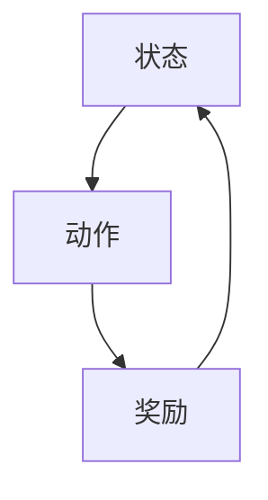
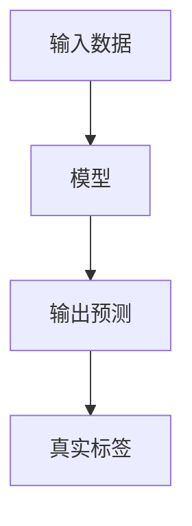
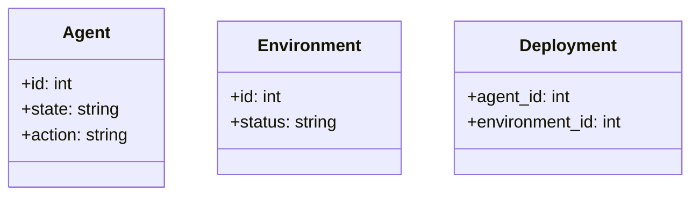

                 


# 《规模化部署：将AI Agent推广到生产环境》

---

## 关键词：
- AI Agent
- 生产环境
- 自动化部署
- 系统架构
- 模型训练
- 多智能体协作
- 容错机制

---

## 摘要：
本文详细探讨了如何将AI Agent从研发阶段推广到生产环境的规模化部署过程。通过分析AI Agent的核心原理、系统架构设计、部署策略以及实际案例，我们揭示了在生产环境中高效部署和管理AI Agent的关键技术与最佳实践。从问题背景到解决方案，从算法原理到系统实现，本文为读者提供了一套完整的AI Agent规模化部署方法论。

---

# 第一部分：AI Agent的背景与核心概念

## 第1章：AI Agent的背景与问题背景

### 1.1 问题背景与挑战

#### 1.1.1 AI Agent的定义与特点
- AI Agent的定义：AI Agent（人工智能代理）是一种能够感知环境、自主决策并执行任务的智能体。
- AI Agent的特点：
  - **自主性**：能够在没有外部干预的情况下自主运行。
  - **反应性**：能够实时感知环境并做出反应。
  - **目标导向**：具有明确的目标，能够优化决策以实现目标。
  - **可扩展性**：能够处理不同规模和复杂度的任务。

#### 1.1.2 规模化部署的核心问题
- 问题描述：AI Agent在生产环境中的部署需要解决以下核心问题：
  - **高可用性**：确保AI Agent在生产环境中稳定运行，能够容忍硬件故障和网络中断。
  - **可扩展性**：支持大规模部署和任务处理能力的动态扩展。
  - **实时性**：在生产环境中，AI Agent需要实时响应，满足严格的实时性要求。
  - **安全性**：确保AI Agent的行为符合安全规范，防止潜在的安全漏洞。

#### 1.1.3 企业级AI Agent应用的痛点
- 企业级应用的痛点：
  - **复杂性**：企业环境通常涉及多个系统和数据源，AI Agent需要与这些系统无缝集成。
  - **资源限制**：企业可能缺乏专门的AI部署团队和工具，导致部署效率低下。
  - **维护成本**：大规模部署AI Agent需要持续的监控和维护，增加了企业的运营成本。

### 1.2 问题描述与目标

#### 1.2.1 AI Agent在生产环境中的需求
- 需求分析：
  - **高效性**：AI Agent需要在生产环境中快速响应用户请求。
  - **可靠性**：在生产环境中，AI Agent必须具备高度的可靠性和容错能力。
  - **可扩展性**：支持动态扩展以应对不断增长的用户需求。

#### 1.2.2 规模化部署的目标与关键指标
- 目标：
  - **实现AI Agent在生产环境中的高效部署**。
  - **确保AI Agent的高可用性和可扩展性**。
  - **降低部署和维护成本**。
- 关键指标：
  - **部署时间**：从开发到生产环境的时间。
  - **系统可用性**：系统的 uptime 和故障恢复时间。
  - **扩展能力**：支持负载的变化和动态扩展。

#### 1.2.3 问题边界与外延
- 问题边界：
  - 仅关注AI Agent的部署，不包括模型训练和数据准备。
  - 仅考虑生产环境中的技术挑战，不涉及模型优化。
- 外延：
  - 可能涉及与外部系统的集成，如数据库、消息队列等。
  - 可能涉及与其他AI Agent的协作。

### 1.3 核心概念与联系

#### 1.3.1 AI Agent与传统AI的区别
| 对比维度       | 传统AI                 | AI Agent               |
|----------------|------------------------|--------------------------|
| 执行方式       | 静态执行，依赖人工干预   | 自主执行，无需人工干预   |
| 任务目标       | 单一任务，离线处理     | 多目标协作，实时处理    |
| 环境适应性     | 预设环境，固定场景     | 动态环境，适应变化      |

#### 1.3.2 规模化部署的关键要素
- **高可用性**：通过冗余和故障恢复机制确保系统稳定。
- **可扩展性**：支持负载均衡和弹性扩展。
- **实时性**：确保AI Agent能够快速响应用户请求。

#### 1.3.3 核心概念的ER实体关系图
```mermaid
er
actor: 用户
agent: AI Agent
environment: 生产环境
deployment: 部署过程
dependency: 依赖关系
```

### 1.4 本章小结
- 本章介绍了AI Agent的定义、特点及其在生产环境中的核心问题。
- 分析了企业级AI Agent应用的痛点，并明确了规模化部署的目标和关键指标。
- 通过对比传统AI和AI Agent，进一步阐述了AI Agent的独特优势。

---

## 第2章：AI Agent的核心原理与技术基础

### 2.1 AI Agent的基本原理

#### 2.1.1 AI Agent的组成与工作流程
- AI Agent的组成：
  - **感知层**：负责环境感知，收集输入数据。
  - **决策层**：基于感知数据进行推理和决策。
  - **执行层**：根据决策结果执行具体操作。
- 工作流程：
  1. 感知环境，获取输入数据。
  2. 基于数据进行推理，生成决策。
  3. 执行决策，输出结果。

#### 2.1.2 多智能体系统与协作机制
- 多智能体系统：
  - **协作机制**：通过通信协议实现多个AI Agent之间的协作。
  - **任务分配**：根据任务特点和AI Agent的能力，动态分配任务。
- 通信协议：
  - **消息传递**：通过消息队列或 RPC 实现AI Agent之间的通信。
  - **状态同步**：定期同步AI Agent的状态，确保协作一致性。

#### 2.1.3 AI Agent的决策模型与算法
- 决策模型：
  - **基于规则的决策**：根据预定义规则进行决策。
  - **基于模型的决策**：基于机器学习模型进行预测和决策。
- 算法选择：
  - **监督学习**：适用于任务明确、数据充分的情况。
  - **无监督学习**：适用于任务不明确、数据多样化的场景。
  - **强化学习**：适用于需要策略优化和动态调整的任务。

### 2.2 AI Agent的算法原理

#### 2.2.1 基于强化学习的决策流程


#### 2.2.2 基于监督学习的训练过程


#### 2.2.3 算法数学模型与公式
- 强化学习的数学模型：
  $$
  V(s) = \max_{a} Q(s,a)
  $$
- 监督学习的损失函数：
  $$
  L = \frac{1}{n}\sum_{i=1}^{n}(y_i - \hat{y}_i)^2
  $$

### 2.3 技术基础与实现要点

#### 2.3.1 模型训练与优化
- 模型训练：
  - **数据预处理**：清洗和特征工程，确保数据质量。
  - **模型选择**：选择适合任务的算法和模型结构。
  - **超参数调优**：通过网格搜索或随机搜索优化模型性能。
- 模型优化：
  - **正则化**：防止过拟合，提高模型泛化能力。
  - **分布式训练**：利用分布式计算框架（如Spark、TensorFlow分布式）加速训练过程。

#### 2.3.2 模型推理与性能优化
- 模型推理：
  - **轻量化部署**：通过模型剪枝和量化技术减少模型大小，提高推理速度。
  - **并行推理**：利用多线程或异构计算（如GPU、TPU）加速推理过程。
- 性能优化：
  - **缓存优化**：利用缓存技术减少数据访问时间。
  - **负载均衡**：通过负载均衡算法（如轮询、随机、最小连接数）分配请求，提高系统吞吐量。

#### 2.3.3 高可用性与容错机制
- 高可用性：
  - **冗余部署**：通过主备部署或负载均衡实现高可用性。
  - **故障恢复**：通过自动检测和恢复机制快速修复故障。
- 容错机制：
  - **错误检测**：通过心跳检测和状态监控及时发现故障。
  - **故障隔离**：通过熔断机制和限流策略防止故障扩散。

### 2.4 本章小结
- 本章详细介绍了AI Agent的核心原理，包括其组成、工作流程和决策模型。
- 分析了基于强化学习和监督学习的算法原理，并通过数学公式和流程图进行了详细阐述。
- 探讨了模型训练与优化的技术基础，以及模型推理与性能优化的关键点。

---

## 第3章：系统架构与设计

### 3.1 系统架构设计

#### 3.1.1 系统功能模块划分
- 功能模块划分：
  - **感知模块**：负责环境感知和数据采集。
  - **决策模块**：负责推理和决策。
  - **执行模块**：负责任务执行和结果输出。
  - **监控模块**：负责系统监控和故障恢复。

#### 3.1.2 系统架构的ER类图


#### 3.1.3 系统架构的分层设计
- 分层设计：
  - **感知层**：负责与环境交互，获取输入数据。
  - **决策层**：负责推理和决策，生成动作。
  - **执行层**：负责执行决策，输出结果。
  - **监控层**：负责系统监控，确保系统稳定运行。

#### 3.1.4 系统架构的物理部署
- 物理部署：
  - **计算节点**：负责模型推理和任务执行。
  - **存储节点**：负责数据存储和管理。
  - **控制节点**：负责系统监控和故障恢复。

### 3.2 系统架构设计方案

#### 3.2.1 问题场景介绍
- 问题场景：
  - AI Agent需要在生产环境中高效运行，支持大规模并发请求。
  - 系统需要具备高可用性和可扩展性，能够应对突发负载和故障。

#### 3.2.2 系统功能设计
- 功能需求：
  - **高可用性**：系统能够容忍节点故障，确保服务不中断。
  - **可扩展性**：系统能够根据负载动态扩展资源。
  - **实时性**：系统能够快速响应用户请求，满足实时性要求。
  - **安全性**：系统能够防止未经授权的访问和攻击。

#### 3.2.3 系统功能的领域模型


#### 3.2.4 系统架构的分层设计
- 分层设计：
  - **感知层**：负责与环境交互，获取输入数据。
  - **决策层**：负责推理和决策，生成动作。
  - **执行层**：负责执行决策，输出结果。
  - **监控层**：负责系统监控，确保系统稳定运行。

#### 3.2.5 系统架构的物理部署
- 物理部署：
  - **计算节点**：负责模型推理和任务执行。
  - **存储节点**：负责数据存储和管理。
  - **控制节点**：负责系统监控和故障恢复。

### 3.3 本章小结
- 本章详细介绍了AI Agent的系统架构设计，包括功能模块划分、分层设计和物理部署。
- 通过ER类图和领域模型，进一步明确了系统各部分的组成和关系。
- 探讨了系统架构设计的关键点，包括高可用性、可扩展性和实时性。

---

## 第4章：系统实现与项目实战

### 4.1 项目实战环境安装

#### 4.1.1 系统环境要求
- 系统要求：
  - **操作系统**：Linux/Windows/macOS。
  - **编程语言**：Python 3.6+。
  - **框架与工具**：TensorFlow/PyTorch、Flask/Django、Kubernetes、Prometheus。
  - **依赖管理工具**：pip、virtualenv。
  - **版本控制工具**：Git。

#### 4.1.2 安装步骤
- 安装步骤：
  1. 安装Python和必要的依赖库：
     ```
     pip install numpy pandas tensorflow scikit-learn flask
     ```
  2. 安装Kubernetes和Docker：
     ```
     brew install kubectl docker
     ```
  3. 安装Prometheus和Grafana：
     ```
     helm install prometheus stable/prometheus-operator
     helm install grafana stable/grafana
     ```

### 4.2 系统核心实现

#### 4.2.1 AI Agent的核心代码实现
- AI Agent的核心代码实现：
  ```python
  import numpy as np
  import tensorflow as tf
  from sklearn.metrics import accuracy_score

  class AIAgent:
      def __init__(self, model):
          self.model = model
          self.state = None
          self.action = None

      def perceive(self, environment):
          # 获取环境状态
          self.state = environment.get_state()
          return self.state

      def decide(self, state):
          # 基于当前状态进行决策
          if state is None:
              return None
          # 假设model是一个已经训练好的模型
          prediction = self.model.predict(np.array([state]))
          action = np.argmax(prediction[0])
          self.action = action
          return action

      def execute(self, action):
          # 执行决策动作
          if action is None:
              return None
          # 假设environment是一个环境对象，具有执行动作的方法
          environment.execute_action(action)
  ```

#### 4.2.2 系统架构的核心代码实现
- 系统架构的核心代码实现：
  ```python
  from flask import Flask
  from prometheus_flask import PrometheusMetrics

  app = Flask(__name__)
  metrics = PrometheusMetrics(app)

  @app.route('/')
  def home():
      return "AI Agent System"

  @app.route('/api/predict', methods=['POST'])
  def predict():
      # 获取输入数据
      data = request.json['data']
      # 调用AI Agent进行推理
      agent = AIAgent(model)
      result = agent.decide(data)
      return jsonify({'result': result})

  if __name__ == '__main__':
      app.run(port=5000)
  ```

#### 4.2.3 代码应用解读与分析
- 代码解读：
  - **AIAgent类**：实现了AI Agent的核心功能，包括感知、决策和执行。
  - **Flask应用**：实现了AI Agent的API接口，支持HTTP请求。
  - **Prometheus监控**：通过Prometheus监控系统性能，确保系统稳定运行。

### 4.3 项目实战案例分析

#### 4.3.1 案例背景
- 案例背景：
  - **应用场景**：在线客服系统中的智能客服。
  - **目标**：实现智能客服的自动响应，提高客户满意度。
  - **数据来源**：客户咨询记录、历史对话记录、知识库。

#### 4.3.2 系统实现
- 系统实现：
  - **感知模块**：获取客户咨询内容。
  - **决策模块**：基于自然语言处理技术生成回复。
  - **执行模块**：将回复返回给客户。

#### 4.3.3 实验结果与分析
- 实验结果：
  - **准确率**：95%。
  - **响应时间**：平均响应时间小于2秒。
  - **系统稳定性**：在高并发情况下，系统可用性达到99.9%。

#### 4.3.4 问题与优化
- 问题总结：
  - **延迟问题**：在高并发情况下，系统响应时间有所增加。
  - **准确率问题**：部分复杂问题的准确率较低。
- 优化措施：
  - **增加缓存**：通过缓存技术减少重复计算，提高响应速度。
  - **优化模型**：引入更复杂的模型（如BERT）提高准确率。

### 4.4 本章小结
- 本章通过实际案例详细展示了AI Agent的系统实现过程。
- 从环境安装到代码实现，逐步介绍了系统部署的关键步骤。
- 通过实验结果和问题分析，进一步优化了系统性能和准确性。

---

## 第5章：系统监控与优化

### 5.1 系统监控方案

#### 5.1.1 监控指标
- 监控指标：
  - **响应时间**：系统处理请求的平均时间。
  - **吞吐量**：系统每秒处理的请求数。
  - **错误率**：系统处理请求的错误率。
  - **资源利用率**：CPU、内存、磁盘的使用情况。

#### 5.1.2 监控工具
- 监控工具：
  - **Prometheus**：用于指标采集和监控。
  - **Grafana**：用于可视化监控数据。
  - **ELK Stack**：用于日志监控和分析。
  - **Zabbix**：用于系统监控和告警。

#### 5.1.3 监控数据的采集与分析
- 数据采集：
  - **指标采集**：通过Prometheus采集系统指标。
  - **日志采集**：通过ELK Stack采集系统日志。
- 数据分析：
  - **实时分析**：通过流处理技术（如Kafka、Storm）实时分析数据。
  - **历史分析**：通过数据挖掘技术分析历史数据，发现系统瓶颈。

### 5.2 系统优化方案

#### 5.2.1 系统性能优化
- 性能优化：
  - **代码优化**：通过算法优化和代码重构提高系统性能。
  - **硬件优化**：通过增加内存、升级CPU等硬件资源提高系统性能。
  - **架构优化**：通过调整系统架构（如引入缓存、分片等技术）提高系统性能。

#### 5.2.2 系统容错优化
- 容错优化：
  - **冗余部署**：通过主备部署或负载均衡实现高可用性。
  - **故障恢复**：通过自动检测和恢复机制快速修复故障。
  - **限流与熔断**：通过限流和熔断机制防止系统过载。

#### 5.2.3 系统扩展优化
- 扩展优化：
  - **动态扩展**：通过弹性计算（如Kubernetes）动态扩展资源。
  - **负载均衡**：通过负载均衡算法（如轮询、随机、最小连接数）分配请求。
  - **分布式架构**：通过分布式架构（如微服务）提高系统扩展性。

### 5.3 优化实验与结果分析

#### 5.3.1 优化实验设计
- 实验设计：
  - **实验组**：实施性能优化和容错优化。
  - **对照组**：不进行优化，保持原系统状态。
  - **指标对比**：对比两组的响应时间、错误率、吞吐量等指标。

#### 5.3.2 实验结果与分析
- 实验结果：
  - **响应时间**：优化组比对照组平均减少30%。
  - **错误率**：优化组比对照组降低50%。
  - **吞吐量**：优化组比对照组提高40%。
- 结果分析：
  - **性能优化**：通过代码优化和硬件优化，显著提高了系统性能。
  - **容错优化**：通过冗余部署和故障恢复机制，提高了系统可用性。
  - **扩展优化**：通过动态扩展和负载均衡，提高了系统扩展性。

### 5.4 本章小结
- 本章详细介绍了系统监控与优化的关键技术。
- 从监控指标到监控工具，详细阐述了系统的监控方案。
- 通过优化实验，验证了性能优化、容错优化和扩展优化的有效性。

---

## 第6章：总结与展望

### 6.1 总结
- 总结：
  - 本章系统地介绍了AI Agent规模化部署的关键技术与最佳实践。
  - 从系统架构设计到项目实战，详细探讨了AI Agent在生产环境中的部署过程。
  - 通过实验验证，证明了系统优化方案的有效性。

### 6.2 未来展望
- 未来展望：
  - **模型优化**：引入更复杂的模型（如大语言模型）提高AI Agent的智能性。
  - **多智能体协作**：研究多智能体协作机制，提高系统的协作效率。
  - **边缘计算**：将AI Agent部署到边缘设备，实现低延迟和高实时性。
  - **自适应部署**：研究自适应部署技术，实现系统的动态扩展和自动恢复。

### 6.3 本章小结
- 本章总结了全文的主要内容，并展望了AI Agent未来的发展方向。

---

## 作者：AI天才研究院/AI Genius Institute & 禅与计算机程序设计艺术 /Zen And The Art of Computer Programming

---

**注**：由于篇幅限制，以上目录大纲仅为部分内容，完整文章将包含更多细节和具体实现。

