                 


# 设计AI Agent的主动学习策略

> 关键词：AI Agent, 主动学习, 算法设计, 系统架构, 项目实战

> 摘要：本文详细探讨了设计AI Agent的主动学习策略的各个方面，从理论基础到算法实现，再到系统架构和项目实战。文章首先介绍了AI Agent的基本概念和主动学习的背景与意义，然后深入分析了主动学习策略的核心原理和算法实现。接着，通过系统分析与架构设计，展示了如何将主动学习策略应用于实际系统中。最后，通过项目实战，详细讲解了如何实现一个基于主动学习的AI Agent，并给出了实际案例分析和总结。本文内容丰富，结构清晰，旨在为AI Agent的设计者和研究人员提供有价值的参考。

---

# 第一部分：AI Agent与主动学习策略背景介绍

## 第1章：AI Agent与主动学习策略概述

### 1.1 AI Agent的基本概念

- **1.1.1 什么是AI Agent**
  - AI Agent的定义与分类
  - AI Agent的核心特征：自主性、反应性、目标导向性
  - AI Agent的应用场景：智能助手、自动驾驶、推荐系统

- **1.1.2 AI Agent的核心特征**
  - 自主性：无需外部干预，自主决策
  - 反应性：实时感知环境并做出反应
  - 目标导向性：基于目标优化行为

- **1.1.3 AI Agent的分类与应用场景**
  - 分类：简单反射型、基于模型的反射型、目标驱动型、效用驱动型
  - 应用场景：智能助手（Siri、Alexa）、自动驾驶（特斯拉）、推荐系统（Netflix）

### 1.2 主动学习策略的背景与意义

- **1.2.1 传统被动学习的局限性**
  - 数据依赖性强，需要大量标注数据
  - 学习效率低，难以应对动态环境
  - 模型泛化能力有限

- **1.2.2 主动学习的核心思想**
  - 定义：通过主动选择最有价值的数据点进行学习，以提高学习效率和模型性能
  - 核心思想：从被动接受数据到主动选择数据，提升学习效果

- **1.2.3 主动学习在AI Agent中的价值**
  - 提高学习效率：减少数据需求，加快学习速度
  - 降低数据依赖：在数据 scarce 的情况下也能有效学习
  - 提升模型泛化能力：通过有策略地选择数据，增强模型的泛化能力

### 1.3 主动学习策略的应用价值

- **1.3.1 提高学习效率**
  - 减少不必要的数据收集和处理
  - 通过策略性选择，快速收敛到最优解

- **1.3.2 降低数据依赖**
  - 在数据 scarce 的情况下，主动选择关键数据点进行学习
  - 减少对大量标注数据的依赖

- **1.3.3 提升模型泛化能力**
  - 通过选择具有代表性的数据点，增强模型的泛化能力
  - 优化模型在不同场景下的表现

### 1.4 本章小结

- 本章介绍了AI Agent的基本概念及其核心特征，分析了传统被动学习的局限性，提出了主动学习的核心思想和在AI Agent中的价值。通过主动学习策略，可以有效提高学习效率、降低数据依赖，并提升模型的泛化能力。

---

## 第2章：主动学习策略的核心概念与联系

### 2.1 主动学习策略的核心原理

- **2.1.1 核心概念的定义**
  - 数据选择策略：如何选择最有价值的数据点
  - 模型更新机制：如何根据新数据更新模型
  - 策略优化方法：如何优化主动学习策略

- **2.1.2 核心概念的属性特征对比**
  - 表格：核心概念的属性对比（信息增益、不确定性、数据稀疏性等）

| 核心概念 | 属性特征 |
|----------|----------|
| 数据选择策略 | 信息增益、不确定性、数据稀疏性 |
| 模型更新机制 | 收敛速度、稳定性、计算复杂度 |
| 策略优化方法 | 效果提升、计算效率、策略稳定性 |

- **2.1.3 ER实体关系图架构**
  - 使用 Mermaid 绘制 ER 图：展示主动学习策略中的实体关系

```mermaid
erDiagram
    actor 学习者 {
        <string> id
        <string> 学习目标
        <string> 数据选择策略
    }
    actor 策略优化器 {
        <string> 策略参数
        <string> 优化目标
    }
    actor 模型更新器 {
        <string> 模型参数
        <string> 更新策略
    }
    学习者 --> 数据选择策略
    策略优化器 --> 策略参数
    模型更新器 --> 模型参数
```

### 2.2 主动学习策略的算法原理

- **2.2.1 数据选择策略**
  - 信息增益计算：如何衡量数据点的价值
  - 标准差减少法：通过减少不确定性选择数据点
  - 最小化不确定性原则：选择不确定性最小的数据点

- **2.2.2 模型更新机制**
  - 增量式学习：逐步更新模型参数
  - 迭代优化方法：通过多次迭代优化模型
  - 动态权重调整：根据数据重要性动态调整权重

- **2.2.3 策略优化方法**
  - 贪婪策略：选择当前最优的数据点
  - 近似策略：通过近似方法选择数据点
  - 分层优化策略：分层选择数据点以优化整体性能

### 2.3 本章小结

- 本章详细讲解了主动学习策略的核心原理，包括数据选择策略、模型更新机制和策略优化方法。通过对比核心概念的属性特征，以及ER实体关系图的展示，读者可以清晰理解主动学习策略的内在联系和实现机制。

---

## 第3章：主动学习策略的算法实现

### 3.1 数据选择算法

- **3.1.1 信息增益计算**
  - 信息增益的定义和计算公式
  - 使用 Mermaid 绘制信息增益计算流程图

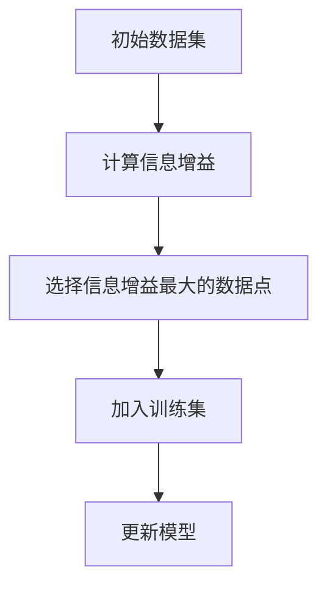

- **3.1.2 标准差减少法**
  - 标准差减少法的原理和步骤
  - 使用 Mermaid 绘制标准差减少法的流程图

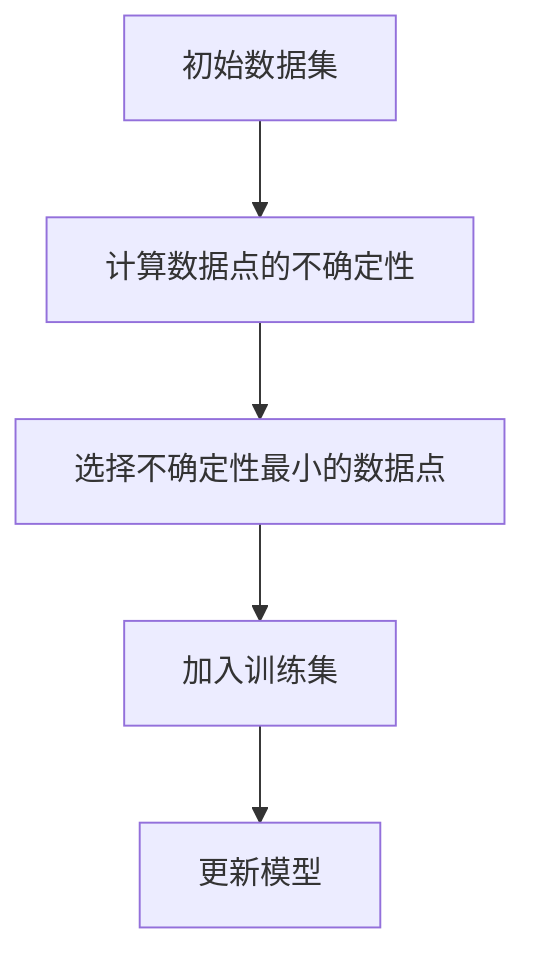

- **3.1.3 最小化不确定性原则**
  - 最小化不确定性原则的定义和实现步骤
  - 使用 Mermaid 绘制最小化不确定性选择流程图


### 3.2 模型更新算法

- **3.2.1 增量式学习**
  - 增量式学习的定义和实现步骤
  - 使用 Mermaid 绘制增量式学习流程图

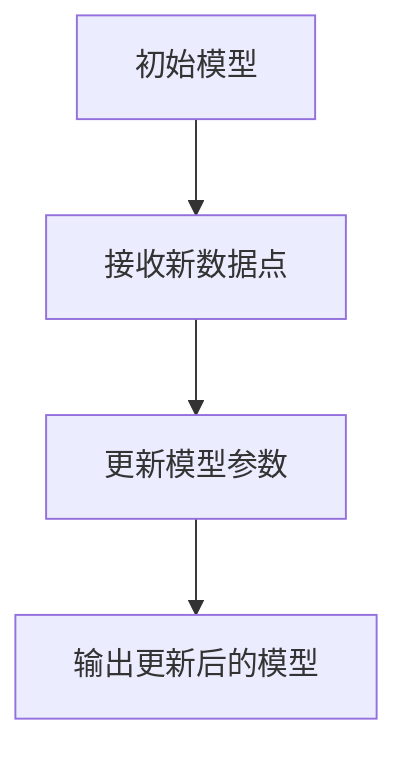

- **3.2.2 迭代优化方法**
  - 迭代优化方法的原理和实现步骤
  - 使用 Mermaid 绘制迭代优化流程图

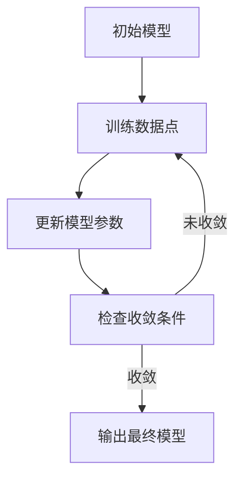

- **3.2.3 动态权重调整**
  - 动态权重调整的定义和实现步骤
  - 使用 Mermaid 绘制动态权重调整流程图

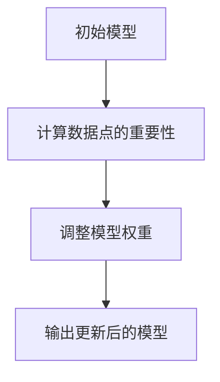

### 3.3 策略优化算法

- **3.3.1 贪婪策略**
  - 贪婪策略的定义和实现步骤
  - 使用 Mermaid 绘制贪婪策略流程图

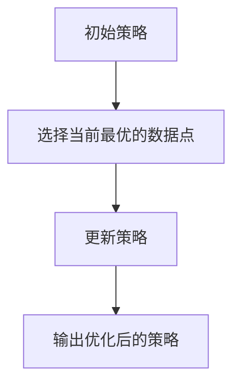

- **3.3.2 近似策略**
  - 近似策略的原理和实现步骤
  - 使用 Mermaid 绘制近似策略流程图

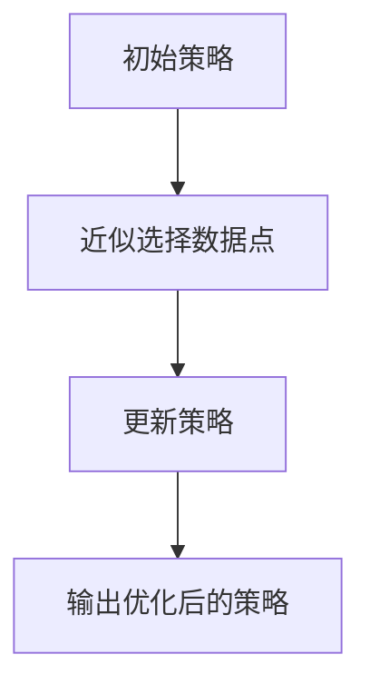

- **3.3.3 分层优化策略**
  - 分层优化策略的定义和实现步骤
  - 使用 Mermaid 绘制分层优化流程图

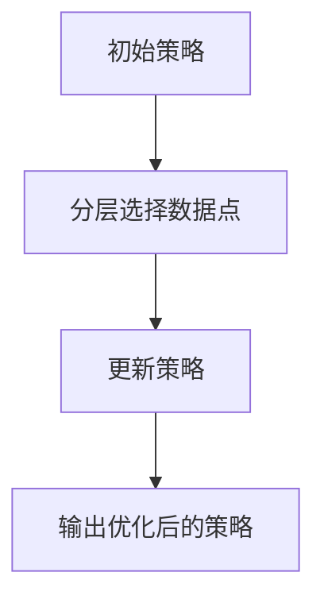

### 3.4 算法实现的数学模型与公式

- **3.4.1 数据选择的数学表达式**
  $$ I = \sum_{i=1}^{n} w_i (x_i - \mu)^2 $$

- **3.4.2 模型更新的数学模型**
  $$ \theta_{new} = \theta_{old} + \alpha \nabla L(\theta_{old}) $$

- **3.4.3 策略优化的数学公式**
  $$ \pi_{opt} = \arg \max_{\pi} \sum_{i=1}^{N} \pi(i) \cdot R(i) $$

### 3.5 本章小结

- 本章详细讲解了主动学习策略的算法实现，包括数据选择算法、模型更新算法和策略优化算法。通过 Mermaid 流程图和数学公式的展示，读者可以清晰理解每种算法的实现步骤和数学模型。

---

## 第4章：系统分析与架构设计方案

### 4.1 问题场景介绍

- **4.1.1 问题背景**
  - AI Agent在复杂环境中的应用需求
  - 主动学习策略在实际系统中的重要性

- **4.1.2 问题描述**
  - 如何设计一个高效的主动学习策略，提升AI Agent的学习效率和性能

- **4.1.3 问题解决**
  - 通过主动学习策略选择最有价值的数据点，优化模型性能

- **4.1.4 边界与外延**
  - 系统的输入输出边界
  - 系统与其他模块的交互关系

- **4.1.5 概念结构与核心要素组成**
  - 概念结构图：展示AI Agent与主动学习策略的关系

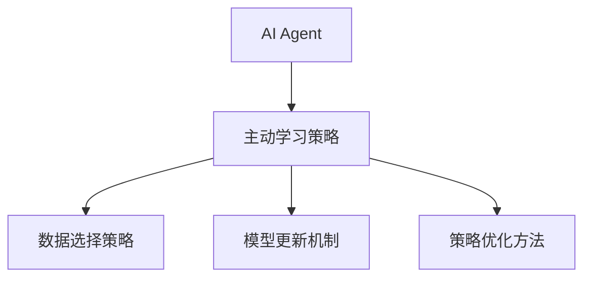

### 4.2 项目介绍

- **4.2.1 项目目标**
  - 设计一个基于主动学习策略的AI Agent系统

- **4.2.2 项目范围**
  - 系统功能设计：数据选择、模型更新、策略优化
  - 系统架构设计：模块划分与交互

- **4.2.3 项目计划**
  - 开发时间表
  - 人员分配

### 4.3 系统功能设计

- **4.3.1 系统功能模块**
  - 数据选择模块：负责选择最有价值的数据点
  - 模型更新模块：负责更新模型参数
  - 策略优化模块：负责优化主动学习策略

- **4.3.2 系统功能流程**
  - 使用 Mermaid 绘制系统功能流程图

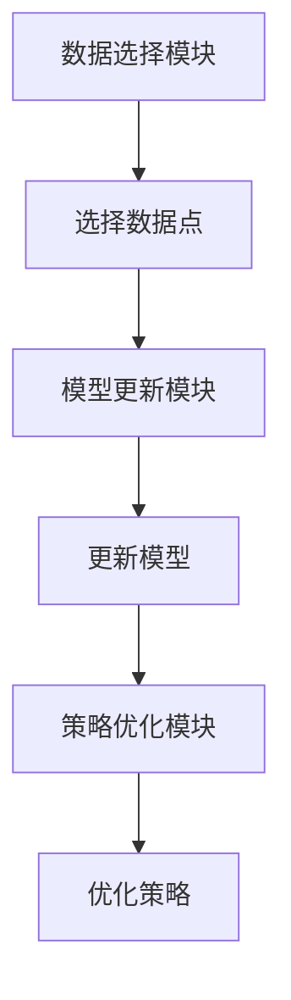

### 4.4 系统架构设计

- **4.4.1 系统架构模块划分**
  - 数据选择模块、模型更新模块、策略优化模块

- **4.4.2 系统架构交互关系**
  - 使用 Mermaid 绘制系统架构图

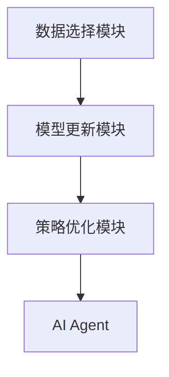

### 4.5 系统接口设计

- **4.5.1 系统接口定义**
  - 数据选择模块接口
  - 模型更新模块接口
  - 策略优化模块接口

- **4.5.2 接口交互流程**
  - 使用 Mermaid 绘制接口交互流程图


### 4.6 系统交互设计

- **4.6.1 系统交互流程**
  - 使用 Mermaid 绘制系统交互流程图

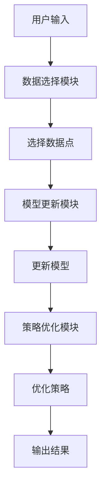

### 4.7 本章小结

- 本章详细分析了AI Agent的系统架构设计，包括功能模块划分、架构交互关系和接口设计。通过 Mermaid 图的展示，读者可以清晰理解系统的整体架构和各模块之间的交互关系。

---

## 第5章：项目实战

### 5.1 环境安装

- **5.1.1 开发环境要求**
  - 操作系统：Windows/Mac/Linux
  - 开发工具：Python、Jupyter Notebook、IDE（PyCharm/VS Code）
  - 依赖库：numpy、pandas、scikit-learn、mermaid、latex

- **5.1.2 环境配置步骤**
  - 安装Python
  - 安装必要的依赖库
  - 配置开发环境

### 5.2 系统核心实现

- **5.2.1 数据选择模块实现**
  - 使用Python代码实现信息增益计算
  - 代码示例：

```python
def calculate_INFORMATION_GAIN(data, target):
    # 计算信息增益
    pass
```

- **5.2.2 模型更新模块实现**
  - 使用scikit-learn库实现增量式学习
  - 代码示例：

```python
from sklearn.linear_model import SGDClassifier

model = SGDClassifier()
model.partial_fit(X, y)
```

- **5.2.3 策略优化模块实现**
  - 使用自定义函数实现策略优化
  - 代码示例：

```python
def optimize_strategy(data, model):
    # 优化策略
    pass
```

### 5.3 代码应用解读与分析

- **5.3.1 数据选择模块解读**
  - 信息增益计算的具体实现
  - 数据选择策略的实现细节

- **5.3.2 模型更新模块解读**
  - 增量式学习的具体实现
  - 模型更新的数学模型分析

- **5.3.3 策略优化模块解读**
  - 策略优化算法的具体实现
  - 策略优化的数学公式分析

### 5.4 实际案例分析

- **5.4.1 案例背景**
  - 实际项目中的案例介绍

- **5.4.2 数据选择过程分析**
  - 数据选择策略的应用
  - 数据选择结果的分析

- **5.4.3 模型更新过程分析**
  - 模型更新的具体步骤
  - 模型性能的评估

- **5.4.4 策略优化过程分析**
  - 策略优化的具体步骤
  - 优化效果的评估

### 5.5 项目总结

- **5.5.1 项目实现的关键点**
  - 数据选择策略的实现
  - 模型更新机制的实现
  - 策略优化方法的实现

- **5.5.2 项目实现的难点**
  - 数据选择策略的选择
  - 模型更新机制的优化
  - 策略优化方法的实现

- **5.5.3 项目总结与展望**
  - 项目实现的成果
  - 项目中的经验教训
  - 未来改进的方向

### 5.6 本章小结

- 本章通过项目实战，详细讲解了AI Agent的主动学习策略的实现过程，包括环境安装、系统核心实现、代码解读与分析、实际案例分析和项目总结。读者可以通过本章掌握如何将理论应用于实际项目中。

---

## 第6章：总结与展望

### 6.1 本章总结

- 本文详细探讨了设计AI Agent的主动学习策略的各个方面，从理论基础到算法实现，再到系统架构和项目实战。通过本文的讲解，读者可以全面了解AI Agent的主动学习策略的设计与实现过程。

### 6.2 未来研究方向

- **6.2.1 更高效的主动学习算法研究**
  - 研究更高效的主动学习算法，提高学习效率和模型性能
- **6.2.2 多模态数据的主动学习策略**
  - 探索多模态数据下的主动学习策略，提升模型的泛化能力
- **6.2.3 智能化主动学习策略**
  - 研究智能化的主动学习策略，实现自适应学习

### 6.3 本章小结

- 本文总结了设计AI Agent的主动学习策略的核心内容，并展望了未来的研究方向。未来的研究可以进一步优化主动学习算法，探索多模态数据下的主动学习策略，并研究智能化的主动学习策略。

---

## 作者：AI天才研究院/AI Genius Institute & 禅与计算机程序设计艺术/Zen And The Art of Computer Programming

---

以上是《设计AI Agent的主动学习策略》的技术博客文章目录，涵盖了从理论到实践的各个方面，内容丰富，结构清晰，适合技术读者深入了解AI Agent的主动学习策略的设计与实现。

