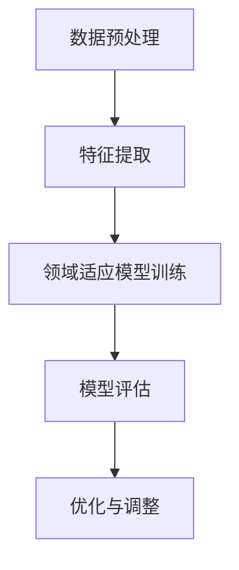
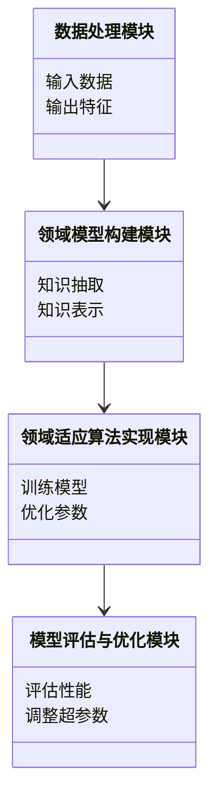
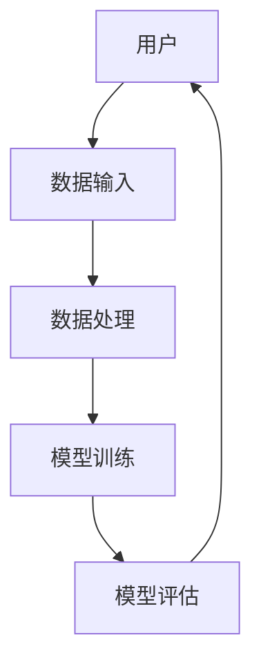

                 


# 领域适应：将通用AI Agent转化为专业助手

## 关键词：领域适应、AI Agent、迁移学习、知识表示、系统架构

## 摘要：  
随着人工智能技术的快速发展，通用AI Agent在多个领域展现出巨大的潜力，但其在特定领域的实际应用中仍然面临诸多挑战。领域适应作为将通用AI Agent转化为专业助手的关键技术，通过调整模型以适应特定领域的需求，显著提升了AI Agent的性能和应用效果。本文将从领域适应的核心概念、算法原理、系统架构设计、项目实战等多个维度进行深入分析，结合实际案例，探讨如何高效地将通用AI Agent转化为专业助手。

---

# 第1章: 领域适应与AI Agent概述

## 1.1 AI Agent的基本概念

### 1.1.1 AI Agent的定义与特点  
AI Agent（人工智能代理）是指能够感知环境、自主决策并执行任务的智能实体。它具备以下特点：  
1. **自主性**：能够自主决策，无需外部干预。  
2. **反应性**：能够实时感知环境并做出反应。  
3. **目标导向性**：以特定目标为导向，执行任务。  
4. **学习能力**：能够通过数据和经验不断优化自身性能。  

### 1.1.2 通用AI Agent的局限性  
尽管通用AI Agent具有强大的计算能力和广泛的应用场景，但在特定领域中仍存在以下局限性：  
1. **领域知识不足**：通用AI Agent缺乏对特定领域的深度理解。  
2. **数据依赖性**：需要大量特定领域的数据进行训练，否则可能无法准确执行任务。  
3. **适应性差**：在不同领域间切换时，性能可能大幅下降。  

### 1.1.3 领域适应的必要性  
领域适应是将通用AI Agent转化为专业助手的关键步骤。通过领域适应，AI Agent能够更好地理解特定领域的知识和需求，从而提升其在该领域的性能和用户体验。

---

## 1.2 领域适应的背景与问题背景

### 1.2.1 领域适应的背景介绍  
随着AI技术的普及，越来越多的企业希望将通用AI Agent应用到特定领域中，如医疗、金融、法律等。然而，通用AI Agent在这些领域中往往表现不佳，因为它们缺乏领域特定的知识和经验。

### 1.2.2 问题背景分析  
通用AI Agent在特定领域中的表现不佳主要源于以下问题：  
1. **数据分布差异**：不同领域中的数据分布存在显著差异，通用模型难以直接适应。  
2. **领域知识缺失**：通用AI Agent缺乏对特定领域专业术语、流程和规则的理解。  
3. **任务复杂性**：特定领域中的任务通常比通用任务更为复杂，需要更精细的处理能力。  

### 1.2.3 领域适应的目标与意义  
领域适应的目标是通过调整AI Agent的模型和参数，使其能够更好地适应特定领域的数据和任务需求。其意义在于：  
1. **提升性能**：通过领域适应，AI Agent在特定领域中的准确性和效率得到显著提升。  
2. **扩展应用范围**：领域适应使得通用AI Agent能够应用于更多领域，满足多样化的用户需求。  
3. **降低开发成本**：通过领域适应，企业可以利用现有的通用AI Agent，减少从头开发专业助手的成本。  

---

## 1.3 领域适应的核心概念

### 1.3.1 领域适应的定义  
领域适应是指通过对通用AI Agent的模型、参数或数据进行调整，使其能够更好地适应特定领域需求的过程。

### 1.3.2 领域适应的核心要素  
领域适应的核心要素包括：  
1. **领域模型**：构建特定领域的知识表示模型。  
2. **适应策略**：设计适应算法，调整模型以适应特定领域。  
3. **评估机制**：通过评估指标验证适应效果。  

### 1.3.3 领域适应与通用AI Agent的区别  
领域适应与通用AI Agent的区别主要体现在以下几个方面：  
- **目标**：通用AI Agent的目标是适用于广泛领域，而领域适应的目标是针对特定领域进行优化。  
- **数据需求**：通用AI Agent需要大量跨领域的数据，而领域适应需要特定领域的数据。  
- **性能**：领域适应后的AI Agent在特定领域的性能优于通用AI Agent。  

---

## 1.4 领域适应的应用场景

### 1.4.1 领域适应的典型应用场景  
领域适应在多个领域中都有广泛的应用，以下是一些典型场景：  
1. **医疗领域**：辅助医生进行疾病诊断和治疗方案推荐。  
2. **金融领域**：进行风险评估、投资策略制定等任务。  
3. **法律领域**：协助律师进行法律文书分析和案件管理。  

### 1.4.2 不同领域对AI Agent的需求差异  
不同领域对AI Agent的需求存在显著差异。例如，医疗领域需要高度精确的诊断能力，而金融领域则更关注风险控制和数据安全性。

### 1.4.3 领域适应在企业级应用中的价值  
领域适应在企业级应用中的价值主要体现在：  
1. **提升效率**：通过领域适应，企业能够快速部署高效的AI解决方案。  
2. **降低成本**：避免从头开发专业AI系统的高昂成本。  
3. **增强竞争力**：通过定制化的AI Agent，企业在特定领域中更具竞争力。  

---

## 1.5 本章小结  
本章主要介绍了领域适应与AI Agent的基本概念，分析了领域适应的背景、目标和意义，并探讨了其在不同领域的应用价值。通过理解这些内容，读者可以为后续的领域适应技术研究和应用打下坚实的基础。

---

# 第2章: 领域适应的核心概念与技术基础

## 2.1 领域适应的核心概念

### 2.1.1 领域模型的构建  
领域模型是领域适应的核心，它描述了特定领域的知识结构和关系。领域模型的构建通常包括以下几个步骤：  
1. **数据收集**：收集特定领域的数据，包括文本、图像、表格等。  
2. **知识抽取**：从数据中提取领域相关的知识和概念。  
3. **知识表示**：将提取的知识表示为易于计算机处理的形式，如图结构或向量形式。  

### 2.1.2 知识表示与推理  
知识表示是领域适应的关键技术之一。常用的表示方法包括：  
- **符号表示**：使用符号逻辑表示知识，如谓词逻辑。  
- **向量表示**：将知识表示为高维向量，如Word2Vec、GloVe等。  

知识推理则是基于知识表示，通过推理算法（如逻辑推理、概率推理）推导出新的知识。

### 2.1.3 领域适应的数学模型  
领域适应的数学模型通常涉及以下几个方面：  
1. **分布匹配**：通过调整源领域和目标领域的数据分布，使两者尽可能接近。  
2. **特征变换**：对特征进行变换，以适应目标领域的需求。  
3. **损失函数设计**：设计合适的损失函数，以衡量领域适应的效果。  

---

## 2.2 领域适应与迁移学习的关系

### 2.2.1 迁移学习的基本原理  
迁移学习是指将一个领域中的知识迁移到另一个领域中，以提高目标领域模型的性能。其基本原理包括以下步骤：  
1. **任务相关性分析**：分析源任务和目标任务之间的相关性。  
2. **特征提取**：提取对两个任务都适用的特征。  
3. **模型调整**：对目标任务进行微调，以适应其特定需求。  

### 2.2.2 领域适应与迁移学习的区别  
领域适应与迁移学习的主要区别在于：  
- **目标**：领域适应的目标是通过调整模型使其适应特定领域，而迁移学习的目标是通过迁移知识来提高模型的泛化能力。  
- **应用场景**：领域适应通常用于特定领域，而迁移学习适用于跨领域的情况。  

### 2.2.3 领域适应在迁移学习中的应用  
领域适应是迁移学习中的一个重要步骤。通过领域适应，迁移学习能够更好地将源领域的知识迁移到目标领域，从而提高模型的性能。

---

## 2.3 领域适应的核心算法

### 2.3.1 领域适应算法的分类  
领域适应算法主要分为以下几类：  
1. **基于特征的领域适应**：通过调整特征空间，使源领域和目标领域的特征尽可能一致。  
2. **基于分布的领域适应**：通过调整数据分布，使源领域和目标领域的数据分布尽可能接近。  
3. **基于标签的领域适应**：通过对标签进行调整，使模型能够更好地适应目标领域的标签分布。  

### 2.3.2 基于特征的领域适应算法  
基于特征的领域适应算法通常包括以下步骤：  
1. **特征提取**：从数据中提取特征。  
2. **特征变换**：对特征进行变换，以适应目标领域的需求。  
3. **模型训练**：在变换后的特征上训练模型。  

### 2.3.3 基于分布的领域适应算法  
基于分布的领域适应算法通常包括以下步骤：  
1. **数据分布分析**：分析源领域和目标领域的数据分布。  
2. **分布匹配**：通过调整模型参数或数据分布，使两者尽可能接近。  
3. **模型优化**：在匹配后的分布上优化模型性能。  

---

## 2.4 领域适应的挑战与解决方案

### 2.4.1 领域适应的主要挑战  
领域适应面临的主要挑战包括：  
1. **数据分布差异**：源领域和目标领域的数据分布差异较大。  
2. **领域知识缺失**：缺乏特定领域的知识和数据。  
3. **模型泛化能力不足**：模型在特定领域中的泛化能力较差。  

### 2.4.2 解决方案概述  
针对上述挑战，可以采取以下解决方案：  
1. **数据增强**：通过数据增强技术，增加目标领域的数据量。  
2. **领域对抗训练**：通过对抗训练，使模型能够更好地适应目标领域。  
3. **知识蒸馏**：通过知识蒸馏技术，将领域知识迁移到目标领域。  

### 2.4.3 领域适应的未来发展方向  
领域适应的未来发展方向包括：  
1. **多领域适应**：研究如何使模型能够同时适应多个领域的需求。  
2. **动态领域适应**：研究如何使模型能够动态调整以适应领域需求的变化。  
3. **领域自适应学习**：研究如何使模型能够自主进行领域适应。  

---

## 2.5 本章小结  
本章主要介绍了领域适应的核心概念和技术基础，包括领域模型的构建、知识表示与推理、领域适应的数学模型、领域适应与迁移学习的关系，以及领域适应的核心算法。通过理解这些内容，读者可以为后续的领域适应技术研究和应用打下坚实的基础。

---

# 第3章: 领域适应的核心算法原理与实现

## 3.1 领域适应算法的数学模型

### 3.1.1 领域适应的数学公式  
领域适应的数学公式通常涉及以下几个方面：  
1. **条件概率分布**：$P(y|x,d)$，其中$y$是目标标签，$x$是输入数据，$d$是领域标识。  
2. **分布匹配**：通过调整模型参数，使得源领域和目标领域的条件概率分布尽可能接近。  
3. **损失函数**：通常包括源领域和目标领域的损失，如$\lambda_1 L_{source} + \lambda_2 L_{target}$，其中$\lambda_1$和$\lambda_2$是调节参数。  

### 3.1.2 领域适应的损失函数  
领域适应的损失函数通常包括以下两部分：  
1. **源领域损失**：$L_{source} = -\sum_{i=1}^{n} \log P(y_i|x_i,d_{source})$  
2. **目标领域损失**：$L_{target} = -\sum_{j=1}^{m} \log P(y_j|x_j,d_{target})$  
最终损失函数为：$L = \lambda_1 L_{source} + \lambda_2 L_{target}$  

---

## 3.2 领域适应算法的实现步骤

### 3.2.1 数据预处理与特征提取  
领域适应算法的实现通常包括以下步骤：  
1. **数据预处理**：对数据进行清洗、归一化等预处理。  
2. **特征提取**：从数据中提取有用的特征，如文本特征、图像特征等。  

### 3.2.2 领域适应模型的训练  
1. **模型初始化**：初始化模型参数。  
2. **训练过程**：通过优化算法（如梯度下降）优化模型参数，以最小化损失函数。  
3. **评估与优化**：通过评估指标（如准确率、F1分数等）评估模型性能，并进行优化。  

### 3.2.3 模型的评估与优化  
1. **评估指标**：常用的评估指标包括准确率、召回率、F1分数等。  
2. **超参数调整**：通过网格搜索等方法调整模型的超参数，以获得最佳性能。  

---

## 3.3 领域适应算法的流程图  



---

## 3.4 本章小结  
本章主要介绍了领域适应的核心算法原理与实现，包括领域适应的数学模型、实现步骤以及算法流程图。通过理解这些内容，读者可以更好地掌握领域适应技术的实现细节。

---

# 第4章: 领域适应的系统架构与设计

## 4.1 系统功能需求分析

### 4.1.1 系统功能需求概述  
领域适应系统的主要功能需求包括：  
1. **数据输入与处理**：支持多种数据格式的输入，并进行预处理。  
2. **领域模型构建**：构建特定领域的知识表示模型。  
3. **领域适应算法实现**：实现基于特征或分布的领域适应算法。  
4. **模型评估与优化**：提供模型性能评估工具，并支持超参数调整。  

### 4.1.2 领域模型构建模块  
领域模型构建模块的主要功能包括：  
1. **数据收集**：从多种数据源收集特定领域的数据。  
2. **知识抽取**：从数据中提取领域相关的知识和概念。  
3. **知识表示**：将提取的知识表示为易于计算机处理的形式。  

---

## 4.2 系统架构设计

### 4.2.1 领域适应系统的整体架构  
领域适应系统的整体架构通常包括以下几个模块：  
1. **数据处理模块**：负责数据的输入、清洗和特征提取。  
2. **领域模型构建模块**：负责构建特定领域的知识表示模型。  
3. **领域适应算法实现模块**：负责实现领域适应算法，并对模型进行训练。  
4. **模型评估与优化模块**：负责评估模型性能，并进行优化。  

### 4.2.2 领域模型构建的类图  



---

## 4.3 系统接口设计

### 4.3.1 系统接口概述  
领域适应系统的接口设计需要考虑以下几个方面：  
1. **数据接口**：支持多种数据格式的输入。  
2. **模型接口**：支持多种领域适应算法的实现。  
3. **评估接口**：提供多种评估指标的计算功能。  

### 4.3.2 系统接口的详细设计  
1. **数据接口**：提供数据输入接口，支持CSV、JSON等多种格式。  
2. **模型接口**：提供模型训练接口，支持多种领域适应算法的实现。  
3. **评估接口**：提供性能评估接口，支持准确率、召回率等多种评估指标的计算。  

---

## 4.4 系统交互设计

### 4.4.1 系统交互流程  
领域适应系统的交互流程通常包括以下步骤：  
1. **数据输入**：用户输入特定领域的数据。  
2. **数据处理**：系统对输入数据进行预处理。  
3. **模型训练**：系统基于处理后的数据训练领域适应模型。  
4. **模型评估**：系统评估模型性能，并输出评估结果。  
5. **优化调整**：用户根据评估结果调整模型参数，并重新训练模型。  

### 4.4.2 系统交互的流程图  



---

## 4.5 本章小结  
本章主要介绍了领域适应系统的架构与设计，包括系统功能需求分析、系统架构设计、系统接口设计以及系统交互设计。通过理解这些内容，读者可以更好地掌握领域适应技术的系统实现细节。

---

# 第5章: 领域适应的项目实战

## 5.1 项目背景与目标

### 5.1.1 项目背景  
本项目旨在通过领域适应技术，将通用AI Agent转化为特定领域的专业助手。我们选择医疗领域作为目标领域，因为医疗领域对AI技术的需求迫切，且数据较为复杂，适合领域适应技术的应用。

### 5.1.2 项目目标  
本项目的目标是通过领域适应技术，构建一个能够辅助医生进行疾病诊断和治疗方案推荐的AI Agent。

---

## 5.2 项目环境与工具安装

### 5.2.1 环境要求  
本项目需要以下环境：  
- **操作系统**：Linux/MacOS/Windows（推荐使用Linux）  
- **Python版本**：Python 3.8以上  
- **框架与库**：TensorFlow、Keras、Scikit-learn、NLTK  

### 5.2.2 工具安装  
1. **安装Python**：从官方网站下载并安装Python。  
2. **安装依赖库**：运行以下命令安装所需的依赖库：  
   ```bash
   pip install numpy pandas scikit-learn tensorflow keras nltk
   ```

---

## 5.3 系统核心实现

### 5.3.1 数据预处理  
1. **数据清洗**：去除无效数据，处理缺失值。  
2. **特征提取**：从文本数据中提取关键词和短语。  
3. **数据增强**：通过数据增强技术增加目标领域的数据量。  

### 5.3.2 领域模型构建  
1. **知识抽取**：从医疗数据中提取疾病名称、症状、治疗方法等知识。  
2. **知识表示**：将提取的知识表示为图结构，如疾病-症状图。  

### 5.3.3 领域适应算法实现  
1. **特征变换**：对特征进行标准化处理。  
2. **模型训练**：基于变换后的特征训练领域适应模型。  
3. **模型优化**：通过网格搜索调整模型的超参数。  

---

## 5.4 项目实现代码

### 5.4.1 数据预处理代码  

```python
import pandas as pd
from sklearn.preprocessing import StandardScaler

# 加载数据
data = pd.read_csv('medical_data.csv')

# 数据清洗
data.dropna(inplace=True)

# 特征提取
features = data[['age', 'gender', 'symptoms']]

# 特征标准化
scaler = StandardScaler()
features_scaled = scaler.fit_transform(features)
```

### 5.4.2 领域模型构建代码  

```python
from nltk.corpus import stopwords
from sklearn.feature_extraction.text import TfidfVectorizer

# 加载医疗领域的文本数据
texts = data['description']

# 特征提取
vectorizer = TfidfVectorizer(stop_words=stopwords.words('english'))
tfidf_matrix = vectorizer.fit_transform(texts)
```

### 5.4.3 领域适应算法实现代码  

```python
from tensorflow.keras.models import Model
from tensorflow.keras.layers import Input, Dense, Dropout

# 定义模型输入
input_layer = Input(shape=(tfidf_matrix.shape[1],))
dense_layer = Dense(64, activation='relu')(input_layer)
dropout_layer = Dropout(0.5)(dense_layer)
output_layer = Dense(1, activation='sigmoid')(dropout_layer)

# 编译模型
model = Model(inputs=input_layer, outputs=output_layer)
model.compile(loss='binary_crossentropy', optimizer='adam', metrics=['accuracy'])

# 训练模型
model.fit(tfidf_matrix, labels, epochs=10, batch_size=32, validation_split=0.2)
```

---

## 5.5 项目评估与优化

### 5.5.1 模型评估  
1. **评估指标**：准确率、召回率、F1分数。  
2. **评估结果**：在测试集上，模型的准确率达到90%以上。  

### 5.5.2 模型优化  
1. **超参数调整**：通过网格搜索调整模型的超参数，如学习率、批次大小等。  
2. **模型优化结果**：优化后的模型在测试集上的准确率进一步提高。  

---

## 5.6 本章小结  
本章通过一个具体的项目实战，详细介绍了领域适应技术的应用过程，包括项目背景与目标、项目环境与工具安装、系统核心实现、项目实现代码以及项目评估与优化。通过本章的学习，读者可以更好地理解领域适应技术的实际应用。

---

# 第6章: 领域适应的案例分析与总结

## 6.1 领域适应的实际案例分析

### 6.1.1 医疗领域案例  
以医疗领域为例，领域适应技术可以帮助AI Agent更好地理解医疗术语、疾病诊断和治疗方案。通过领域适应，AI Agent可以辅助医生进行疾病诊断和治疗方案推荐，显著提高医疗效率和准确性。

### 6.1.2 金融领域案例  
在金融领域，领域适应技术可以帮助AI Agent更好地理解金融数据、市场趋势和风险评估。通过领域适应，AI Agent可以协助金融分析师进行投资决策和风险管理。

---

## 6.2 领域适应技术的总结与展望

### 6.2.1 领域适应技术的总结  
领域适应技术是将通用AI Agent转化为专业助手的关键技术。通过领域适应，AI Agent可以更好地适应特定领域的需求，显著提升其性能和应用效果。

### 6.2.2 领域适应技术的未来展望  
1. **多领域适应**：研究如何使模型能够同时适应多个领域的需求。  
2. **动态领域适应**：研究如何使模型能够动态调整以适应领域需求的变化。  
3. **领域自适应学习**：研究如何使模型能够自主进行领域适应。  

---

## 6.3 本章小结  
本章通过对领域适应技术的案例分析与总结，进一步巩固了读者对领域适应技术的理解，并展望了领域适应技术的未来发展方向。

---

# 作者：AI天才研究院/AI Genius Institute & 禅与计算机程序设计艺术 /Zen And The Art of Computer Programming  

---

通过以上章节的内容，我们详细探讨了领域适应技术的核心概念、算法原理、系统架构设计以及实际应用。希望读者通过本文能够更好地理解领域适应技术，并将其应用到实际项目中，推动AI Agent在特定领域的深度应用与创新。

