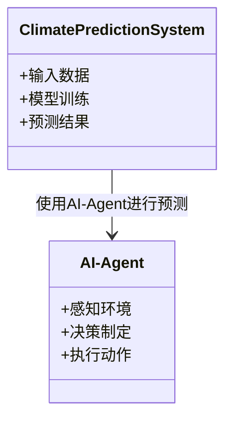
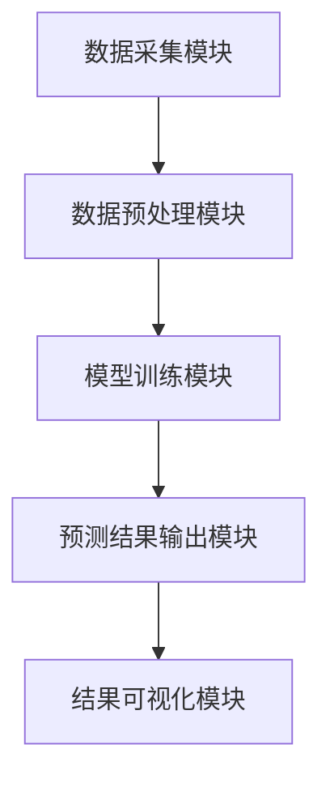
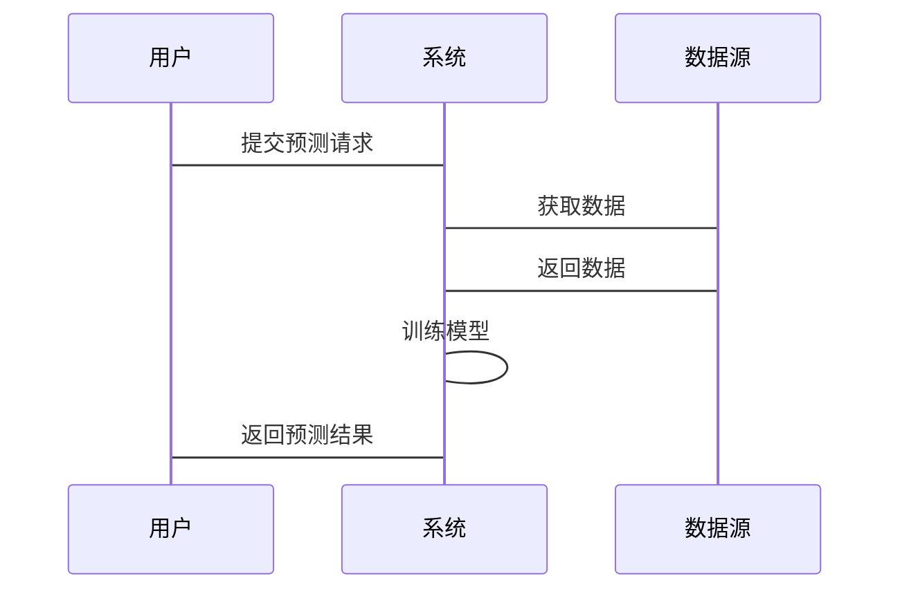

                 


# AI Agent在智能气候变化预测中的实践

---

## 关键词
AI Agent, 智能预测, 气候变化, 加强学习, 时间序列预测

---

## 摘要
本文探讨AI Agent在智能气候变化预测中的实践应用，分析AI Agent的核心概念与原理，结合具体算法实现与系统架构设计，展示如何利用AI技术提升气候变化预测的准确性与效率。文章从背景介绍、核心概念、算法原理、系统设计到项目实战，层层深入，提供全面的技术解析。

---

# 第一部分: AI Agent与智能气候变化预测的背景与基础

## 第1章: AI Agent与气候变化预测的概述

### 1.1 AI Agent的基本概念

#### 1.1.1 AI Agent的定义
AI Agent（人工智能代理）是指在计算机系统中，能够感知环境、自主决策并采取行动以实现目标的智能实体。AI Agent可以是软件程序，也可以是嵌入硬件的智能系统。

#### 1.1.2 AI Agent的核心特征
- **自主性**：无需外部干预，自主完成任务。
- **反应性**：能够实时感知环境变化并做出反应。
- **目标导向性**：所有行为均以实现特定目标为导向。
- **学习能力**：通过经验改进性能。

#### 1.1.3 AI Agent与传统AI的区别
| 特性 | 传统AI | AI Agent |
|------|--------|----------|
| 行为模式 | 静态规则 | 动态决策 |
| 任务目标 | 单一任务 | 多目标优化 |
| 应用场景 | 数据处理 | 实时交互 |

### 1.2 气候变化预测的挑战与需求

#### 1.2.1 气候变化预测的复杂性
- 气候系统涉及大气、海洋、陆地等多种交互作用。
- 数据来源多样，包括卫星、地面观测、历史记录等。
- 预测时间尺度长，不确定性高。

#### 1.2.2 气候变化预测的传统方法
- **统计模型**：基于历史数据分析趋势。
- **物理模型**：基于大气科学的方程建立数值模拟。
- **混合模型**：结合统计与物理模型的优势。

#### 1.2.3 智能化预测的需求
- 提高预测精度。
- 实现实时更新与动态调整。
- 处理多源异构数据。

### 1.3 AI Agent在气候变化预测中的应用前景

#### 1.3.1 AI Agent的优势
- **实时性**：能够快速响应数据变化。
- **自适应性**：能够根据环境变化调整预测模型。
- **多目标优化**：可以在多个预测目标间找到平衡点。

#### 1.3.2 AI Agent在气候变化预测中的潜在应用场景
- **短期预测**：预测未来几天的天气变化。
- **长期预测**：预测未来十年的气候变化趋势。
- **极端事件预警**：预测自然灾害如台风、洪水的发生概率。

#### 1.3.3 当前研究与实践的现状
- 研究机构：全球气候研究机构与高校。
- 技术难点：数据质量、模型解释性、计算资源需求。

---

## 第2章: AI Agent的核心概念与原理

### 2.1 AI Agent的体系结构

#### 2.1.1 知识表示
- **符号表示**：使用符号逻辑表示知识。
- **语义网络**：通过节点与边表示知识关系。
- **知识图谱**：构建结构化的知识网络。

#### 2.1.2 行为决策
- **基于规则的决策**：根据预定义规则做出决策。
- **基于模型的决策**：根据机器学习模型预测结果做出决策。
- **基于强化学习的决策**：通过试错学习优化决策策略。

#### 2.1.3 交互与学习
- **人机交互**：与人类用户进行自然语言交互。
- **多智能体交互**：与其他AI Agent协同工作。
- **在线学习**：实时更新知识库与预测模型。

### 2.2 AI Agent与气候变化预测的核心联系

#### 2.2.1 数据驱动的预测模型
- **数据来源**：卫星数据、地面观测数据、历史气候数据。
- **数据预处理**：数据清洗、特征提取、数据增强。

#### 2.2.2 知识图谱构建与应用
- **知识图谱构建**：将气候数据转化为知识图谱。
- **知识推理**：通过知识图谱推理气候变化趋势。

#### 2.2.3 多智能体协同预测
- **分布式计算**：多个AI Agent协同完成预测任务。
- **任务分配**：根据数据特点分配任务。
- **结果融合**：将多个预测结果融合成最终预测。

### 2.3 AI Agent的数学模型与算法

#### 2.3.1 强化学习算法
- **Q-Learning算法**：通过Q值表学习最优策略。
- **Deep Q-Network (DQN)**：使用深度神经网络近似Q值函数。
- **策略梯度法**：通过优化策略函数直接优化目标函数。

#### 2.3.2 贝叶斯网络
- **贝叶斯网络结构**：通过有向无环图表示变量间的依赖关系。
- **概率推理**：根据观测数据推断变量的概率分布。
- **证据传播**：通过证据传播算法更新概率分布。

#### 2.3.3 时间序列预测模型
- **LSTM网络**：通过长短期记忆单元捕捉时间序列的长期依赖关系。
- **Transformer模型**：通过自注意力机制捕捉全局依赖关系。
- **混合模型**：将LSTM与Transformer结合，提升预测精度。

### 2.4 本章小结
---

# 第三部分: AI Agent在气候变化预测中的算法实现

## 第3章: AI Agent算法的核心原理

### 3.1 强化学习算法原理

#### 3.1.1 状态空间与动作空间
- **状态空间**：所有可能的环境状态集合。
- **动作空间**：AI Agent在每个状态下可以执行的所有动作。

#### 3.1.2 奖励函数设计
- **即时奖励**：立即给予的奖励。
- **累积奖励**：多个步骤的奖励累积。
- **目标奖励**：达到特定目标时给予的奖励。

#### 3.1.3 策略优化方法
- **值函数优化**：通过优化值函数找到最优策略。
- **策略直接优化**：通过直接优化策略函数找到最优策略。
- **Actor-Critic方法**：同时优化策略（Actor）和价值函数（Critic）。

### 3.2 时间序列预测模型

#### 3.2.1 LSTM网络原理
- **LSTM结构**：包括输入门、遗忘门、输出门。
- **LSTM优势**：能够捕捉时间序列的长期依赖关系。
- **LSTM训练**：使用反向传播通过时间（BPTT）算法训练模型。

#### 3.2.2 Transformer模型的应用
- **自注意力机制**：计算每个位置与其他位置的相关性。
- **多头注意力**：通过并行计算多个注意力头提升模型性能。
- **位置编码**：将位置信息嵌入到模型中。

#### 3.2.3 混合模型的构建
- **混合模型结构**：将LSTM与Transformer结合，构建混合模型。
- **混合模型优势**：同时捕捉序列的局部与全局特征。
- **混合模型训练**：使用混合损失函数训练模型。

### 3.3 AI Agent算法的数学模型

#### 3.3.1 强化学习的数学公式
$$ Q(s,a) = r + \gamma \max Q(s',a') $$
其中：
- \( Q(s,a) \) 表示状态 \( s \) 下执行动作 \( a \) 的Q值。
- \( r \) 表示奖励值。
- \( \gamma \) 表示折扣因子。
- \( Q(s',a') \) 表示下一个状态 \( s' \) 下执行动作 \( a' \) 的Q值。

#### 3.3.2 LSTM网络的结构
$$ f(t) = \sigma(W_{f}x_t + b_f + U_{f}h_{t-1}) $$
其中：
- \( f(t) \) 表示输入门的输出。
- \( W_{f} \) 表示输入门的权重矩阵。
- \( x_t \) 表示输入数据。
- \( b_f \) 表示输入门的偏置向量。
- \( U_{f} \) 表示遗忘门的权重矩阵。
- \( h_{t-1} \) 表示前一时刻的隐藏状态。

### 3.4 本章小结
---

# 第四部分: 智能气候变化预测系统的架构设计

## 第4章: 智能气候变化预测系统的架构设计

### 4.1 系统功能需求分析

#### 4.1.1 数据采集与预处理
- **数据来源**：卫星、地面观测站、历史气候数据。
- **数据清洗**：去除噪声数据，填补缺失值。
- **数据转换**：将数据转换为模型可接受的格式。

#### 4.1.2 模型训练与部署
- **模型训练**：使用训练数据训练AI Agent模型。
- **模型部署**：将训练好的模型部署到预测系统中。
- **模型更新**：根据新数据不断更新模型。

#### 4.1.3 结果可视化与解释
- **结果可视化**：将预测结果以图表形式展示。
- **结果解释**：解释预测结果的含义与不确定性。

### 4.2 系统功能设计

#### 4.2.1 领域模型


#### 4.2.2 系统架构设计


#### 4.2.3 系统接口设计
- **输入接口**：接收外部数据输入。
- **输出接口**：输出预测结果与可视化界面。
- **API接口**：提供与其他系统的接口。

#### 4.2.4 系统交互流程


### 4.3 本章小结
---

## 第5章: 项目实战与案例分析

### 5.1 环境安装与配置

#### 5.1.1 安装Python环境
```bash
pip install python3
pip install numpy
pip install pandas
pip install tensorflow
pip install keras
pip install matplotlib
```

#### 5.1.2 安装深度学习框架
```bash
pip install tensorflow
pip install keras
pip install scikit-learn
pip install xgboost
```

### 5.2 核心代码实现

#### 5.2.1 数据预处理代码
```python
import pandas as pd
import numpy as np

# 读取数据
data = pd.read_csv('climate_data.csv')

# 去除缺失值
data.dropna(inplace=True)

# 标准化处理
from sklearn.preprocessing import StandardScaler
scaler = StandardScaler()
data_scaled = scaler.fit_transform(data)
```

#### 5.2.2 AI Agent模型实现
```python
import tensorflow as tf
from tensorflow.keras import layers

# 定义AI Agent模型
class AI_Agent(tf.keras.Model):
    def __init__(self, state_size, action_size):
        super(AI_Agent, self).__init__()
        self.state_size = state_size
        self.action_size = action_size
        self.dense1 = layers.Dense(64, activation='relu')
        self.dense2 = layers.Dense(32, activation='relu')
        self.dense3 = layers.Dense(action_size, activation='linear')

    def call(self, inputs):
        x = self.dense1(inputs)
        x = self.dense2(x)
        x = self.dense3(x)
        return x

# 定义强化学习算法
class DQN:
    def __init__(self, state_size, action_size):
        self.state_size = state_size
        self.action_size = action_size
        self.model = AI_Agent(state_size, action_size)
        self.target_model = AI_Agent(state_size, action_size)
        self.gamma = 0.99
        self.epsilon = 0.1
        self.optimizer = tf.keras.optimizers.Adam(lr=0.001)

    def remember(self, state, action, reward, next_state):
        # 记忆存储
        pass

    def act(self, state):
        # 选择动作
        pass

    def replay(self, batch_size):
        # 回放记忆
        pass

    def train(self, state, action, reward, next_state):
        # 训练模型
        pass
```

#### 5.2.3 模型训练代码
```python
# 初始化DQN
dqn = DQN(state_size=10, action_size=5)

# 训练模型
for episode in range(1000):
    state = get_state()
    action = dqn.act(state)
    next_state = get_next_state(action)
    reward = get_reward(next_state)
    dqn.remember(state, action, reward, next_state)
    dqn.replay(32)
    dqn.train(state, action, reward, next_state)
```

### 5.3 代码解读与分析

#### 5.3.1 数据预处理代码解读
- **读取数据**：使用pandas读取CSV格式的气候数据。
- **去除缺失值**：删除数据中的缺失值，确保数据完整性。
- **标准化处理**：对数据进行标准化处理，使数据具有可比性。

#### 5.3.2 AI Agent模型实现解读
- **模型定义**：定义一个简单的神经网络模型，包含三层全连接层。
- **强化学习算法实现**：实现一个简单的DQN算法，包含记忆、选择动作、回放记忆和训练模型四个部分。

#### 5.3.3 模型训练代码解读
- **初始化DQN**：创建一个DQN实例，指定状态空间和动作空间的大小。
- **训练循环**：在每个episode中，选择一个动作，执行动作，获取奖励，更新模型。

### 5.4 案例分析与结果展示

#### 5.4.1 案例分析
- **训练过程**：展示训练过程中预测精度的变化。
- **预测结果**：展示最终的预测结果与实际值的对比。

#### 5.4.2 结果可视化
```python
import matplotlib.pyplot as plt

# 绘制训练曲线
plt.plot(history['loss'], label='训练损失')
plt.plot(history['val_loss'], label='验证损失')
plt.xlabel('Epoch')
plt.ylabel('Loss')
plt.legend()
plt.show()

# 绘制预测结果
plt.plot(y_true, label='真实值')
plt.plot(y_pred, label='预测值')
plt.xlabel('时间')
plt.ylabel('值')
plt.legend()
plt.show()
```

### 5.5 本章小结
---

## 第6章: 最佳实践与总结

### 6.1 最佳实践Tips
- **数据质量**：确保数据的完整性和准确性。
- **模型选择**：根据具体任务选择合适的模型。
- **计算资源**：保证足够的计算资源支持模型训练。
- **模型解释性**：注重模型的可解释性，便于结果分析。
- **持续优化**：根据新数据不断优化模型。

### 6.2 小结
本文详细介绍了AI Agent在智能气候变化预测中的应用，从理论基础到算法实现，再到系统设计与项目实战，全面展示了如何利用AI技术提升气候变化预测的精度与效率。

### 6.3 注意事项
- **数据隐私**：注意保护气候数据的隐私性。
- **模型泛化能力**：确保模型具有良好的泛化能力。
- **计算效率**：优化模型结构，提升计算效率。

### 6.4 拓展阅读
- **推荐书籍**：《深度学习》——Ian Goodfellow
- **推荐论文**：《Mastering the Game of Go with Deep Neural Networks and Tree Search》
- **推荐课程**：Coursera上的《机器学习》课程

---

## 作者：AI天才研究院/AI Genius Institute & 禅与计算机程序设计艺术 /Zen And The Art of Computer Programming

---

# END

