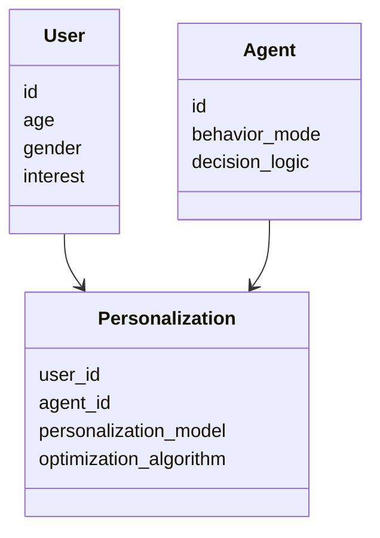
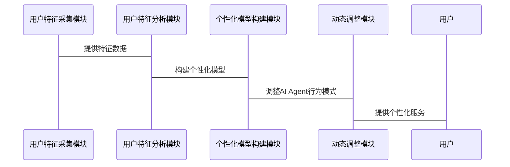

                 


# 个性化定制：根据用户特征调整AI Agent

> 关键词：个性化定制、AI Agent、用户特征、动态调整、人工智能

> 摘要：个性化定制AI Agent是通过分析用户的特征，动态调整AI Agent的行为模式和决策逻辑，以提供更加智能化、个性化的服务。本文将从背景、核心概念、算法原理、系统架构、项目实战等方面详细阐述如何根据用户特征调整AI Agent。

---

## 第一部分：个性化定制AI Agent的背景与核心概念

### 第1章：个性化定制AI Agent的背景介绍

#### 1.1 问题背景

##### 1.1.1 当前AI Agent的发展现状
AI Agent（人工智能代理）是一种能够感知环境、自主决策并执行任务的智能体。随着技术的进步，AI Agent已广泛应用于推荐系统、智能助手、自动驾驶等领域。然而，大多数AI Agent的设计基于通用规则，缺乏对用户的个性化特征的深度理解。

##### 1.1.2 个性化定制的需求驱动
用户的需求千差万别，不同用户的行为习惯、偏好和使用场景存在显著差异。传统AI Agent的通用性使其难以满足用户个性化的需求，用户体验受限，服务质量下降。

##### 1.1.3 传统AI Agent的局限性
传统AI Agent通常基于固定的规则和预设的模型进行决策，无法根据用户特征动态调整其行为模式。这种静态的决策方式在面对多样化的用户需求时显得力不从心。

#### 1.2 问题描述

##### 1.2.1 用户特征的多样性
用户的特征包括但不限于年龄、性别、兴趣爱好、行为习惯、地理位置等。这些特征决定了用户的需求和偏好，是个性化定制的基础。

##### 1.2.2 AI Agent适应性不足的问题
AI Agent需要能够根据用户特征动态调整其行为模式，以提供个性化的服务。然而，现有技术在动态调整能力方面存在不足，难以满足用户需求的多样性。

##### 1.2.3 个性化定制的核心目标
个性化定制的核心目标是通过分析用户特征，动态调整AI Agent的行为模式和决策逻辑，从而提供更加智能化、个性化的服务。

#### 1.3 问题解决

##### 1.3.1 个性化定制AI Agent的解决方案
通过采集和分析用户特征，构建个性化模型，动态调整AI Agent的行为模式和决策逻辑，以实现个性化的服务。

##### 1.3.2 核心技术的突破方向
重点突破用户特征分析、动态调整机制、个性化策略优化等关键技术，提升AI Agent的个性化能力。

##### 1.3.3 实现路径的优化策略
从数据采集、特征分析、模型构建到动态调整，优化每一步的实现路径，确保个性化定制的高效性和准确性。

#### 1.4 边界与外延

##### 1.4.1 个性化定制的适用范围
个性化定制适用于需要根据用户特征动态调整服务的场景，如推荐系统、智能助手、个性化教育等领域。

##### 1.4.2 与非个性化AI Agent的区别
个性化AI Agent能够根据用户特征动态调整行为模式，而非个性化AI Agent基于固定规则运行。

##### 1.4.3 与其他定制化技术的关联
个性化定制AI Agent与数据挖掘、机器学习、自然语言处理等技术密切相关，是多技术融合的应用场景。

#### 1.5 核心要素组成

##### 1.5.1 用户特征的采集与分析
通过数据采集技术获取用户的特征数据，包括行为数据、兴趣数据、属性数据等，并进行清洗和分析。

##### 1.5.2 AI Agent的动态调整机制
基于用户特征分析结果，动态调整AI Agent的行为模式和决策逻辑，以实现个性化服务。

##### 1.5.3 个性化策略的优化算法
采用机器学习算法对个性化策略进行优化，提升个性化定制的效果和用户体验。

---

### 第2章：个性化定制AI Agent的核心概念与联系

#### 2.1 核心概念原理

##### 2.1.1 用户特征的定义与分类
用户特征包括用户的基本信息、行为特征、兴趣特征等。不同特征的分类有助于个性化定制的实现。

##### 2.1.2 AI Agent的行为模式
AI Agent的行为模式包括感知环境、决策推理、执行操作等。个性化定制需要动态调整这些行为模式。

##### 2.1.3 个性化定制的实现机制
通过分析用户特征，构建个性化模型，动态调整AI Agent的行为模式，以实现个性化的服务。

#### 2.2 核心概念属性对比表

| 概念       | 属性1      | 属性2      | 属性3      |
|------------|------------|------------|------------|
| 用户特征   | 基本信息    | 行为特征    | 兴趣特征    |
| AI Agent   | 行为模式    | 决策逻辑    | 执行能力    |
| 个性化定制 | 动态调整    | 个性化模型 | 优化算法    |

#### 2.3 核心概念的ER实体关系图

```mermaid
er
  actor(User) {
    id
    age
    gender
    interest
  }
  agent(AI Agent) {
    id
    behavior_mode
    decision_logic
  }
  relationship(Personalization) {
    user_id
    agent_id
    personalization_model
    optimization_algorithm
  }
```

---

## 第三部分：个性化定制AI Agent的算法原理

### 第3章：个性化定制AI Agent的算法原理

#### 3.1 协同过滤算法

##### 3.1.1 协同过滤算法原理
协同过滤算法通过分析用户的行为数据，找到与目标用户相似的用户群体，推荐相似的物品或服务。

##### 3.1.2 协同过滤算法实现步骤

1. 数据采集与预处理
2. 用户相似度计算
3. 物品推荐

##### 3.1.3 协同过滤算法的Python实现

```python
import numpy as np

def cosine_similarity(user_vector):
    # 计算余弦相似度
    return user_vector.dot(user_vector.T) / (np.linalg.norm(user_vector) * np.linalg.norm(user_vector.T))
```

##### 3.1.4 协同过滤算法的数学模型

$$ \text{相似度} = \frac{\vec{u} \cdot \vec{v}}{\|\vec{u}\| \|\vec{v}\|} $$

---

#### 3.2 聚类分析算法

##### 3.2.1 聚类分析算法原理
聚类分析算法通过将用户特征数据划分为不同的簇，实现用户的细分与个性化推荐。

##### 3.2.2 聚类分析算法实现步骤

1. 数据预处理
2. 特征提取
3. 聚类

##### 3.2.3 聚类分析算法的Python实现

```python
from sklearn.cluster import KMeans

def kmeans_clustering(features, n_clusters):
    model = KMeans(n_clusters=n_clusters)
    model.fit(features)
    return model.labels_
```

##### 3.2.4 聚类分析算法的数学模型

$$ \text{目标函数} = \sum_{i=1}^{n} \sum_{j=1}^{k} w_{ij}d_{ij} $$

---

#### 3.3 深度学习模型

##### 3.3.1 深度学习模型原理
深度学习模型通过多层神经网络学习用户特征的高维表示，实现个性化的预测和推荐。

##### 3.3.2 深度学习模型实现步骤

1. 数据预处理
2. 模型训练
3. 模型预测

##### 3.3.3 深度学习模型的Python实现

```python
import tensorflow as tf

def build_model(input_shape):
    model = tf.keras.Sequential()
    model.add(tf.keras.layers.Dense(64, activation='relu', input_shape=input_shape))
    model.add(tf.keras.layers.Dense(32, activation='relu'))
    model.add(tf.keras.layers.Dense(1, activation='sigmoid'))
    return model
```

##### 3.3.4 深度学习模型的数学模型

$$ P(y|x) = \sigma(w x + b) $$

---

## 第四部分：个性化定制AI Agent的系统分析与架构设计

### 第4章：个性化定制AI Agent的系统分析与架构设计

#### 4.1 问题场景介绍

##### 4.1.1 个性化定制AI Agent的应用场景
个性化定制AI Agent广泛应用于推荐系统、智能助手、个性化教育等领域。

##### 4.1.2 系统目标
构建一个能够根据用户特征动态调整的AI Agent系统，提供个性化的服务。

##### 4.1.3 系统需求
支持用户特征采集、分析、动态调整等功能。

#### 4.2 系统功能设计

##### 4.2.1 领域模型设计



##### 4.2.2 系统架构设计


##### 4.2.3 接口设计



---

## 第五部分：个性化定制AI Agent的项目实战

### 第5章：个性化定制AI Agent的项目实战

#### 5.1 环境安装与配置

##### 5.1.1 环境要求
安装Python、TensorFlow、Scikit-learn等依赖库。

##### 5.1.2 环境配置
配置虚拟环境，安装所需依赖。

#### 5.2 核心功能实现

##### 5.2.1 用户特征采集模块

```python
def collect_user_features():
    # 实现用户特征采集功能
    pass
```

##### 5.2.2 特征分析模块

```python
def analyze_features(features):
    # 实现特征分析功能
    pass
```

##### 5.2.3 个性化模型构建模块

```python
def build_personalization_model(features):
    # 实现个性化模型构建功能
    pass
```

##### 5.2.4 动态调整模块

```python
def adjust_agent_behavior(model):
    # 实现动态调整功能
    pass
```

#### 5.3 代码实现与解读

##### 5.3.1 代码实现

```python
import numpy as np
from sklearn.cluster import KMeans

def collect_user_features(users):
    # 采集用户特征数据
    pass

def analyze_features(features):
    # 分析用户特征数据
    pass

def build_personalization_model(features):
    # 构建个性化模型
    model = KMeans(n_clusters=5)
    model.fit(features)
    return model

def adjust_agent_behavior(model):
    # 动态调整AI Agent行为模式
    pass
```

##### 5.3.2 代码解读与分析
代码实现了用户特征采集、分析、模型构建和动态调整功能，展示了个性化定制AI Agent的核心实现过程。

#### 5.4 案例分析与详细讲解

##### 5.4.1 案例分析
以推荐系统为例，展示如何根据用户特征调整AI Agent的行为模式，提供个性化的推荐服务。

##### 5.4.2 详细讲解
详细分析案例中的每个步骤，解释个性化定制的实现过程和优化策略。

#### 5.5 项目小结

##### 5.5.1 项目总结
个性化定制AI Agent的实现需要结合用户特征分析、动态调整机制和优化算法，实现智能化的个性化服务。

##### 5.5.2 项目收获
通过项目实践，掌握了个性化定制的核心技术，提升了AI Agent的开发能力。

##### 5.5.3 项目注意事项
在实际应用中，需要注意数据隐私保护、模型优化和系统性能等问题。

---

## 第六部分：个性化定制AI Agent的最佳实践

### 第6章：个性化定制AI Agent的最佳实践

#### 6.1 小结

##### 6.1.1 核心内容回顾
回顾个性化定制AI Agent的核心概念、算法原理和系统架构设计。

##### 6.1.2 关键技术总结
总结用户特征分析、动态调整机制和优化算法等关键技术。

#### 6.2 注意事项

##### 6.2.1 数据隐私保护
在个性化定制过程中，需注意用户数据的隐私保护，遵守相关法律法规。

##### 6.2.2 模型优化
定期优化个性化模型，提升服务质量和用户体验。

##### 6.2.3 系统性能
关注系统性能，确保个性化定制的高效性和稳定性。

#### 6.3 拓展阅读

##### 6.3.1 推荐阅读书籍
推荐《机器学习实战》、《深度学习》等书籍，帮助读者深入理解相关技术。

##### 6.3.2 技术博客与资源
推荐相关技术博客、开源项目和在线课程，供读者进一步学习和研究。

---

## 作者信息

作者：AI天才研究院/AI Genius Institute & 禅与计算机程序设计艺术 /Zen And The Art of Computer Programming

---

以上是《个性化定制：根据用户特征调整AI Agent》的完整目录大纲和文章内容。

