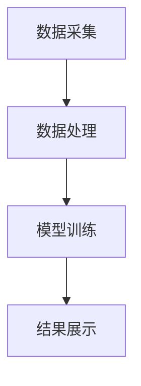

                 


# 企业估值中的AI驱动的自动化风险评估平台评估

> 关键词：企业估值，AI驱动，风险评估，自动化平台，系统架构，算法原理，项目实战

> 摘要：本文深入探讨了AI技术在企业估值中的应用，重点分析了自动化风险评估平台的核心概念、算法原理和系统架构。通过实际案例的详细讲解，展示了如何利用AI技术提升企业估值的准确性和效率，为企业管理者和投资者提供决策支持。

---

## 第1章: 企业估值与风险评估概述

### 1.1 企业估值的基本概念
企业估值是通过对企业的财务状况、市场表现、管理团队等多个维度的分析，估算其市场价值的过程。传统的企业估值方法主要包括DCF模型、EV/EBITDA倍数法和可比公司分析等，但这些方法往往依赖人工判断，存在主观性强、效率低下的问题。

#### 1.1.1 企业估值的定义与意义
- **定义**：企业估值是对企业整体价值的评估，包括资产、负债、未来现金流等多方面的考量。
- **意义**：准确的企业估值能够为企业的融资、并购、上市等重大决策提供依据。

#### 1.1.2 传统企业估值方法的局限性
- **主观性强**：传统方法依赖人工判断，结果可能受评估师主观因素影响。
- **效率低下**：手工计算和分析耗时长，难以应对大规模数据处理。

#### 1.1.3 风险评估在企业估值中的重要性
- **风险评估的核心作用**：通过识别和量化风险，评估企业可能面临的不确定性，从而调整估值结果。
- **风险与估值的关系**：高风险通常会导致估值下调，而低风险则可能提高估值。

### 1.2 风险评估的核心要素
风险评估是企业估值的重要组成部分，主要包括以下几个核心要素：

#### 1.2.1 风险的定义与分类
- **定义**：风险是指企业在经营过程中可能遇到的不确定性，可能导致损失或收益减少。
- **分类**：常见的风险包括市场风险、信用风险、操作风险和流动性风险等。

#### 1.2.2 风险评估的关键指标
- **贝塔系数（Beta）**：衡量企业资产相对于市场的波动性，用于计算系统性风险。
- **VaR（Value at Risk）**：在给定置信水平下，可能承受的最大损失。
- **信用评级**：反映企业偿还债务的能力，评级越高，风险越低。

#### 1.2.3 风险与企业估值的关系
- **风险对估值的影响**：高风险企业通常需要更高的风险溢价，导致估值下降。
- **风险的量化与定价**：通过风险评估模型，将风险因素转化为具体的估值调整。

### 1.3 AI驱动的自动化风险评估平台的背景
随着AI技术的快速发展，企业估值和风险评估领域正在经历一场变革。传统的手工评估方式逐渐被自动化、智能化的AI平台所取代。

#### 1.3.1 AI技术在金融领域的应用现状
- **自然语言处理（NLP）**：用于分析新闻、财报等文本数据，提取关键信息。
- **机器学习**：通过训练模型，预测企业未来的财务状况和市场表现。
- **大数据分析**：利用海量数据，构建多维度的企业画像。

#### 1.3.2 自动化风险评估的必要性
- **提高效率**：AI平台能够快速处理大量数据，显著提高评估效率。
- **减少人为误差**：通过算法自动计算风险，降低主观判断的影响。

#### 1.3.3 平台化解决方案的优势
- **模块化设计**：不同功能模块独立开发，便于扩展和维护。
- **用户体验优化**：统一的平台界面，方便用户操作。

### 1.4 本章小结
本章主要介绍了企业估值和风险评估的基本概念，分析了传统方法的局限性，并探讨了AI驱动的自动化风险评估平台的背景和优势。下一章将深入探讨AI驱动的风险评估平台的核心概念和功能模块。

---

## 第2章: AI驱动的自动化风险评估平台的核心概念

### 2.1 风险评估平台的构成要素
AI驱动的自动化风险评估平台通常包括以下几个关键模块：

#### 2.1.1 数据采集模块
- **功能**：从企业财报、市场数据、新闻等多个来源获取数据。
- **实现**：通过API接口或爬虫技术，自动收集相关数据。

#### 2.1.2 数据处理模块
- **功能**：对采集到的数据进行清洗、转换和标准化处理。
- **实现**：使用Python的Pandas库进行数据处理，构建特征工程。

#### 2.1.3 风险评估模型
- **功能**：基于处理后的数据，训练机器学习模型，预测企业风险。
- **实现**：采用XGBoost或随机森林等算法，构建分类或回归模型。

#### 2.1.4 结果展示模块
- **功能**：将评估结果以可视化的方式呈现给用户。
- **实现**：使用Matplotlib或Tableau等工具，生成图表和报告。

#### 2.1.5 模型优化模块
- **功能**：通过调参和验证，优化模型的性能。
- **实现**：使用GridSearchCV等工具，进行参数优化。

#### 2.1.6 风险定价模块
- **功能**：将风险评估结果转化为具体的估值调整。
- **实现**：基于模型预测结果，计算风险溢价。

#### 2.1.7 用户交互模块
- **功能**：提供友好的用户界面，方便用户输入数据和查看结果。
- **实现**：使用React等前端框架，构建动态交互界面。

### 2.2 AI算法在风险评估中的应用
AI算法在风险评估中的应用主要体现在数据处理、模型训练和结果预测等方面。

#### 2.2.1 机器学习算法的分类
- **监督学习**：用于分类和回归问题，如预测企业违约概率。
- **无监督学习**：用于聚类分析，如识别客户群体的风险特征。
- **半监督学习**：结合少量标注数据和大量无标签数据，用于提升模型性能。

#### 2.2.2 常见的AI驱动风险评估算法
- **线性回归**：用于预测连续型变量，如企业的信用评分。
- **随机森林**：用于分类和回归，具有较强的鲁棒性和解释性。
- **支持向量机（SVM）**：适用于高维数据的分类问题，如企业风险等级划分。
- **神经网络**：用于处理复杂非线性关系，如深度学习模型预测企业违约风险。

#### 2.2.3 算法选择的依据
- **数据类型**：根据数据的特征选择合适的算法。
- **计算效率**：考虑模型训练和预测的时间成本。
- **模型解释性**：根据需求选择可解释性较强的模型。

### 2.3 平台的架构与功能
AI驱动的风险评估平台通常采用模块化设计，各功能模块之间相互协作，共同完成风险评估任务。

#### 2.3.1 平台的整体架构
- **分层架构**：包括数据层、算法层、应用层和用户层。
- **功能模块**：数据采集、处理、建模、优化和展示。

#### 2.3.2 功能模块的划分
- **数据采集模块**：负责数据的获取和存储。
- **数据处理模块**：对数据进行清洗、转换和特征提取。
- **模型训练模块**：训练机器学习模型，预测风险。
- **结果展示模块**：将评估结果以图表形式展示。

#### 2.3.3 系统的可扩展性与灵活性
- **模块化设计**：各功能模块独立开发，便于扩展和维护。
- **灵活配置**：支持多种算法和数据源的配置。

### 2.4 本章小结
本章详细介绍了AI驱动的风险评估平台的核心概念和功能模块，包括数据采集、处理、建模和展示等部分。同时，还探讨了不同AI算法在风险评估中的应用和选择依据。下一章将深入讲解风险评估平台的数学模型与算法原理。

---

## 第3章: 风险评估平台的数学模型与算法原理

### 3.1 风险评估的数学模型
数学模型是风险评估的核心，常见的模型包括线性回归、随机森林和神经网络等。

#### 3.1.1 线性回归模型
- **数学公式**：
  $$ y = \beta_0 + \beta_1 x_1 + \beta_2 x_2 + \dots + \beta_n x_n + \epsilon $$
  其中，$y$是目标变量，$x_i$是自变量，$\beta_i$是回归系数，$\epsilon$是误差项。
- **应用**：用于预测企业的信用评分，评估企业的财务健康状况。

#### 3.1.2 随机森林模型
- **数学原理**：随机森林是一种基于决策树的集成算法，通过投票或平均的方式得出最终结果。
- **应用**：用于分类问题，如企业风险等级的划分。

#### 3.1.3 神经网络模型
- **数学原理**：神经网络通过多层非线性变换，提取数据的特征，最终输出预测结果。
- **应用**：用于处理复杂的非线性关系，如企业违约风险的预测。

### 3.2 基于机器学习的算法实现
机器学习算法在风险评估中的实现涉及数据处理、模型训练和结果预测等步骤。

#### 3.2.1 数据预处理
- **特征选择**：通过相关性分析，选择对风险评估影响较大的特征。
- **数据标准化**：对数据进行归一化处理，消除量纲的影响。

#### 3.2.2 模型训练
- **训练集划分**：将数据划分为训练集和验证集，用于模型的训练和调优。
- **模型训练**：使用训练数据，训练机器学习模型。
- **交叉验证**：通过K折交叉验证，评估模型的泛化能力。

#### 3.2.3 模型评估
- **评估指标**：常用的评估指标包括准确率、召回率、F1分数和AUC值等。
- **结果分析**：根据评估结果，优化模型参数，提升预测性能。

### 3.3 算法的优缺点对比
不同算法在风险评估中的表现各有优劣，选择合适的算法需要综合考虑多个因素。

#### 3.3.1 线性回归
- **优点**：简单易懂，计算效率高。
- **缺点**：只能处理线性关系，对非线性数据的拟合能力较弱。

#### 3.3.2 随机森林
- **优点**：具有较强的抗过拟合能力，模型解释性较好。
- **缺点**：计算复杂度较高，需要较多的计算资源。

#### 3.3.3 神经网络
- **优点**：能够处理复杂的非线性关系，模型表达能力强。
- **缺点**：训练时间较长，模型解释性较差。

### 3.4 本章小结
本章详细讲解了风险评估平台中常用的数学模型和机器学习算法，分析了不同算法的优缺点和适用场景。下一章将探讨系统架构设计和项目实战。

---

## 第4章: 风险评估平台的系统架构设计

### 4.1 系统功能模块设计
风险评估平台的功能模块设计需要考虑数据处理、模型训练和结果展示等多个方面。

#### 4.1.1 数据采集模块
- **功能**：从企业财报、市场数据和新闻等来源获取数据。
- **实现**：使用爬虫技术，获取公开数据；通过API接口，连接数据源。

#### 4.1.2 数据处理模块
- **功能**：对数据进行清洗、转换和特征提取。
- **实现**：使用Python的Pandas库，进行数据预处理。

#### 4.1.3 模型训练模块
- **功能**：训练机器学习模型，预测企业风险。
- **实现**：使用Scikit-learn库，训练随机森林或神经网络模型。

#### 4.1.4 结果展示模块
- **功能**：将评估结果以图表形式展示给用户。
- **实现**：使用Matplotlib库，生成可视化图表。

#### 4.1.5 模型优化模块
- **功能**：通过调参和验证，优化模型的性能。
- **实现**：使用GridSearchCV，进行参数优化。

### 4.2 系统架构图
以下是一个简化的系统架构图：



### 4.3 系统接口设计
- **数据接口**：提供RESTful API，供其他系统调用数据。
- **模型接口**：提供预测接口，供外部系统调用模型服务。
- **用户接口**：提供友好的Web界面，供用户查看和操作。

### 4.4 系统交互流程
以下是系统的交互流程图：

```mermaid
sequenceDiagram
    participant 用户
    participant 数据采集模块
    participant 数据处理模块
    participant 模型训练模块
    participant 结果展示模块
    用户 -> 数据采集模块: 提交数据请求
    数据采集模块 -> 数据处理模块: 传输数据
    数据处理模块 -> 模型训练模块: 提供处理后的数据
    模型训练模块 -> 结果展示模块: 返回评估结果
    结果展示模块 -> 用户
```

### 4.5 本章小结
本章详细设计了风险评估平台的系统架构，包括功能模块、接口设计和交互流程。下一章将通过实际案例，展示平台的实现和应用。

---

## 第5章: 项目实战——基于AI的风险评估平台开发

### 5.1 项目背景
本项目旨在开发一个基于AI的自动化风险评估平台，利用机器学习技术，提升企业估值的准确性和效率。

### 5.2 环境安装
- **Python版本**：建议使用Python 3.8或以上版本。
- **依赖库安装**：
  ```bash
  pip install numpy pandas scikit-learn matplotlib
  ```

### 5.3 系统核心实现源代码
以下是平台的核心代码实现：

#### 5.3.1 数据采集模块
```python
import requests
from bs4 import BeautifulSoup

def fetch_data(url):
    response = requests.get(url)
    soup = BeautifulSoup(response.text, 'html.parser')
    data = []
    for item in soup.find_all('div', class_='data-item'):
        data.append({
            'name': item.find('h3').text,
            'value': float(item.find('span').text)
        })
    return data
```

#### 5.3.2 数据处理模块
```python
import pandas as pd

def preprocess_data(data):
    df = pd.DataFrame(data)
    df['value'] = (df['value'] - df['value'].mean()) / df['value'].std()
    return df
```

#### 5.3.3 模型训练模块
```python
from sklearn.ensemble import RandomForestClassifier
from sklearn.metrics import accuracy_score

def train_model(X, y):
    model = RandomForestClassifier(n_estimators=100, max_depth=5)
    model.fit(X, y)
    return model

def evaluate_model(model, X_test, y_test):
    y_pred = model.predict(X_test)
    print("Accuracy:", accuracy_score(y_test, y_pred))
```

#### 5.3.4 结果展示模块
```python
import matplotlib.pyplot as plt

def plot_results(results):
    plt.figure(figsize=(10,6))
    plt.plot(results, label='Predicted Value')
    plt.xlabel('Time')
    plt.ylabel('Value')
    plt.legend()
    plt.show()
```

### 5.4 代码应用解读与分析
- **数据采集模块**：通过爬虫技术，从指定URL获取企业数据。
- **数据处理模块**：对数据进行标准化处理，消除量纲的影响。
- **模型训练模块**：使用随机森林算法，训练分类模型，预测企业风险等级。
- **结果展示模块**：将预测结果以图表形式展示，方便用户理解和分析。

### 5.5 实际案例分析
以某制造企业为例，分析平台的实际应用效果。

#### 5.5.1 数据准备
```python
data = fetch_data('http://example.com/data')
df = preprocess_data(data)
```

#### 5.5.2 模型训练
```python
X = df.drop('label', axis=1)
y = df['label']
model = train_model(X, y)
```

#### 5.5.3 结果展示
```python
results = model.predict(X_test)
plot_results(results)
```

### 5.6 项目小结
通过实际案例的分析，验证了AI驱动的风险评估平台的有效性和准确性。平台能够快速处理大量数据，显著提高企业估值的效率和准确性。

---

## 第6章: 总结与最佳实践

### 6.1 总结
本文深入探讨了AI技术在企业估值中的应用，重点分析了自动化风险评估平台的核心概念、算法原理和系统架构。通过实际案例的详细讲解，展示了如何利用AI技术提升企业估值的准确性和效率。

### 6.2 最佳实践 tips
- **数据质量**：确保数据的准确性和完整性，避免无效数据的干扰。
- **模型选择**：根据具体问题选择合适的算法，避免盲目使用复杂模型。
- **系统优化**：通过模块化设计和并行计算，提高系统的运行效率。
- **持续学习**：定期更新模型和数据，保持系统的适应性和先进性。

### 6.3 注意事项
- **数据隐私**：在处理企业数据时，需遵守相关法律法规，保护数据隐私。
- **模型解释性**：选择具有较高解释性的模型，便于用户理解和分析。
- **系统稳定性**：确保系统的稳定性和可靠性，避免因技术问题影响业务。

### 6.4 拓展阅读
- **《机器学习实战》**：深入学习机器学习算法的实现和应用。
- **《深度学习》**：探索深度学习技术在企业估值中的应用潜力。

---

## 作者：AI天才研究院/AI Genius Institute & 禅与计算机程序设计艺术/Zen And The Art of Computer Programming

