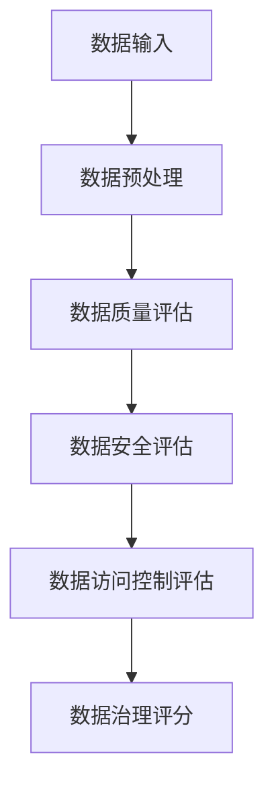

                 


# 如何评估企业的数据治理能力

> **关键词**：数据治理能力评估、数据治理、企业合规、数据安全、数据管理、数据质量

> **摘要**：  
>  数据治理能力评估是企业在数字化转型中不可或缺的关键环节。本文从数据治理的核心概念出发，详细探讨了数据治理能力评估的背景、核心要素、评估方法、算法原理以及系统架构设计。通过对比分析、数学建模和案例研究，本文为企业提供了全面的评估框架和实践指南，帮助企业更好地理解和提升数据治理能力。

---

## 第一部分：数据治理能力评估的背景与意义

### 第1章：数据治理能力评估的背景与意义

#### 1.1 数据治理的定义与核心概念

数据治理（Data Governance）是指通过制定政策、流程和工具，对企业的数据资产进行有效管理和控制的过程。其核心目标是确保数据的完整性、准确性、一致性和安全性，同时最大化数据的价值。

- **1.1.1 数据治理的定义**  
  数据治理是企业对数据资产进行全生命周期管理的过程，包括数据的采集、存储、处理、分析和应用。

- **1.1.2 数据治理的核心要素**  
  - 数据质量：确保数据的准确性、一致性和完整性。
  - 数据安全：保护数据不被未经授权的访问、泄露或篡改。
  - 数据访问控制：基于角色和权限，限制数据访问范围。
  - 数据生命周期管理：从数据生成到归档或销毁的全生命周期管理。

- **1.1.3 数据治理与企业竞争力的关系**  
  数据治理是企业数字化转型的核心支柱。通过有效的数据治理，企业可以提升数据利用率，降低数据风险，增强竞争力。

#### 1.2 数据治理能力评估的重要性

数据治理能力评估是衡量企业数据管理水平的重要手段。通过评估，企业可以发现数据管理中的不足，制定改进措施。

- **1.2.1 数据治理在数字化转型中的作用**  
  数据治理是企业数字化转型的基础。只有通过有效的数据治理，企业才能充分利用数据驱动业务创新。

- **1.2.2 数据治理对企业合规性的影响**  
  数据治理能力评估帮助企业确保符合数据相关法律法规（如GDPR、CCPA等），避免法律风险。

- **1.2.3 数据治理对数据安全的保障作用**  
  数据治理能力评估能够识别数据安全风险，制定有效的安全策略，保护企业数据资产。

#### 1.3 本章小结

本章从数据治理的定义、核心要素和重要性三个方面，阐述了数据治理能力评估的背景和意义。数据治理不仅是企业数字化转型的核心，也是企业合规性和数据安全的重要保障。

---

## 第二部分：数据治理能力评估的核心概念与联系

### 第2章：数据治理能力评估的核心概念

#### 2.1 数据治理的关键要素

数据治理能力评估需要从多个维度进行考量，主要包括数据质量、数据安全、数据访问控制和数据生命周期管理。

- **2.1.1 数据质量**  
  数据质量是数据治理能力评估的重要指标。数据质量包括数据的准确性、一致性和完整性。

- **2.1.2 数据安全**  
  数据安全是数据治理的核心要素之一。数据安全包括数据的机密性、完整性和可用性。

- **2.1.3 数据访问控制**  
  数据访问控制是确保数据安全的重要手段。基于角色的访问控制（RBAC）是常用的数据访问控制方法。

- **2.1.4 数据生命周期管理**  
  数据生命周期管理包括数据的生成、存储、处理、分析、归档和销毁等阶段。

#### 2.2 数据治理能力评估的维度

数据治理能力评估可以从多个维度进行考量，包括数据管理能力、数据应用能力、数据安全能力和数据合规能力。

- **2.2.1 数据管理能力**  
  数据管理能力包括数据存储、数据处理和数据归档等能力。

- **2.2.2 数据应用能力**  
  数据应用能力包括数据分析、数据挖掘和数据可视化等能力。

- **2.2.3 数据安全能力**  
  数据安全能力包括数据加密、数据备份和数据恢复等能力。

- **2.2.4 数据合规能力**  
  数据合规能力包括符合数据相关法律法规的能力。

#### 2.3 数据治理能力评估的边界与外延

数据治理能力评估需要明确其边界和外延，以避免评估范围的模糊。

- **2.3.1 数据治理的边界**  
  数据治理的边界包括企业的数据资产，不包括外部数据。

- **2.3.2 数据治理的外延**  
  数据治理的外延包括数据的全生命周期管理。

- **2.3.3 数据治理与其他管理领域的关系**  
  数据治理与企业战略、风险管理等管理领域密切相关。

#### 2.4 核心概念对比表格

以下是数据治理能力评估的核心概念对比表：

| **维度**       | **数据质量**         | **数据安全**         | **数据访问控制**       | **数据生命周期管理**     |
|----------------|---------------------|---------------------|-----------------------|------------------------|
| 定义           | 数据的准确性、一致性和完整性 | 数据的机密性、完整性和可用性 | 基于角色的访问控制     | 数据的全生命周期管理     |
| 重要性         | 数据价值的基础       | 数据安全的核心       | 数据访问的保障         | 数据管理的关键         |
| 评估方法       | 数据清洗、数据验证   | 数据加密、数据备份   | 权限管理、审计日志     | 数据归档、数据销毁     |

#### 2.5 数据治理能力评估的ER实体关系图

以下是数据治理能力评估的ER图（使用Mermaid）：

```mermaid
erd
actor: 数据治理评估者
|-------|       |-------|
| 数据源 |<---| 数据存储 |<---| 数据处理 |
|-------|       |-------|
| 数据目标 |<---| 数据安全 |<---| 数据访问控制 |
```

---

## 第三部分：数据治理能力评估的算法原理

### 第3章：数据治理能力评估的算法原理

#### 3.1 数据治理能力评估的算法概述

数据治理能力评估的算法主要包括数据质量评估算法、数据安全评估算法和数据访问控制评估算法。

- **3.1.1 数据治理能力评估的算法分类**  
  数据治理能力评估算法可以分为基于规则的算法和基于统计的算法。

- **3.1.2 数据治理能力评估的算法特点**  
  数据治理能力评估算法具有以下特点：  
  1. 可扩展性：能够适应不同的数据规模。  
  2. 可解释性：算法的输出结果需要易于解释。  
  3. 鲁棒性：能够处理数据中的噪声和异常值。

#### 3.2 数据治理能力评估的数学模型

数据治理能力评估的数学模型可以通过概率论和统计学的方法进行建模。

- **3.2.1 数据质量评估模型**  
  数据质量评估模型可以通过以下公式进行建模：

  $$ Q = \frac{\sum_{i=1}^{n} w_i \cdot q_i}{\sum_{i=1}^{n} w_i} $$

  其中，\( Q \) 表示数据质量，\( w_i \) 表示第 \( i \) 个质量指标的权重，\( q_i \) 表示第 \( i \) 个质量指标的评分。

- **3.2.2 数据安全评估模型**  
  数据安全评估模型可以通过以下公式进行建模：

  $$ S = \sum_{i=1}^{m} p_i \cdot s_i $$

  其中，\( S \) 表示数据安全评分，\( p_i \) 表示第 \( i \) 个安全指标的概率，\( s_i \) 表示第 \( i \) 个安全指标的评分。

#### 3.3 数据治理能力评估的Python实现

以下是数据治理能力评估的Python代码实现：

```python
import pandas as pd
import numpy as np

# 数据质量评估函数
def calculate_data_quality(data):
    # 计算数据完整性
    completeness = len(data.dropna()) / len(data)
    # 计算数据一致性
    consistency = data.nunique() / len(data)
    # 计算数据准确性
    accuracy = 1.0  # 假设数据准确
    # 数据质量评分
    quality_score = completeness * consistency * accuracy
    return quality_score

# 数据安全评估函数
def calculate_data_security(data):
    # 计算数据机密性
    confidentiality = 1.0  # 假设数据机密
    # 计算数据完整性
    integrity = 1.0  # 假设数据完整
    # 数据安全评分
    security_score = confidentiality * integrity
    return security_score

# 数据访问控制评估函数
def calculate_access_control(data):
    # 计算数据访问权限合规性
    access_compliance = 1.0  # 假设合规
    # 数据访问控制评分
    access_score = access_compliance
    return access_score

# 示例数据
data = pd.DataFrame({
    'id': [1, 2, 3, 4, 5],
    'name': ['A', 'B', 'C', 'D', 'E']
})

# 数据治理能力评估
quality_score = calculate_data_quality(data)
security_score = calculate_data_security(data)
access_score = calculate_access_control(data)

print(f"数据质量评分：{quality_score}")
print(f"数据安全评分：{security_score}")
print(f"数据访问控制评分：{access_score}")
```

#### 3.4 数据治理能力评估的算法流程图

以下是数据治理能力评估的算法流程图（使用Mermaid）：



---

## 第四部分：数据治理能力评估的系统分析与架构设计

### 第4章：数据治理能力评估的系统分析与架构设计

#### 4.1 问题场景介绍

企业需要通过数据治理能力评估，识别数据管理中的问题，优化数据管理水平。

#### 4.2 项目介绍

本项目旨在开发一个数据治理能力评估系统，帮助企业全面评估数据管理能力。

#### 4.3 系统功能设计

系统功能设计包括数据输入、数据预处理、数据质量评估、数据安全评估、数据访问控制评估和数据治理评分。

##### 4.3.1 数据输入模块

数据输入模块负责接收企业数据资产。

##### 4.3.2 数据预处理模块

数据预处理模块负责清洗数据，确保数据质量。

##### 4.3.3 数据质量评估模块

数据质量评估模块负责评估数据的完整性、一致性和准确性。

##### 4.3.4 数据安全评估模块

数据安全评估模块负责评估数据的机密性和可用性。

##### 4.3.5 数据访问控制评估模块

数据访问控制评估模块负责评估数据访问权限的合规性。

##### 4.3.6 数据治理评分模块

数据治理评分模块负责综合评估数据治理能力，输出数据治理评分。

#### 4.4 系统架构设计

系统架构设计包括数据输入、数据预处理、数据质量评估、数据安全评估、数据访问控制评估和数据治理评分模块。

##### 4.4.1 系统架构图

以下是系统架构图（使用Mermaid）：


##### 4.4.2 系统接口设计

系统接口设计包括数据输入接口、数据输出接口和系统管理接口。

##### 4.4.3 系统交互设计

系统交互设计包括用户与系统之间的交互流程。

#### 4.5 本章小结

本章从系统功能设计和架构设计两个方面，详细介绍了数据治理能力评估系统的实现方案。系统功能设计包括数据输入、数据预处理、数据质量评估、数据安全评估、数据访问控制评估和数据治理评分模块。系统架构设计包括数据输入、数据预处理、数据质量评估、数据安全评估、数据访问控制评估和数据治理评分模块。

---

## 第五部分：数据治理能力评估的项目实战

### 第5章：数据治理能力评估的项目实战

#### 5.1 环境安装

数据治理能力评估系统需要安装以下环境：

- Python 3.8+
- Pandas库
- Numpy库
- Mermaid工具

#### 5.2 系统核心实现源代码

以下是数据治理能力评估系统的Python核心代码：

```python
import pandas as pd
import numpy as np

# 数据质量评估函数
def calculate_data_quality(data):
    completeness = len(data.dropna()) / len(data)
    consistency = data.nunique() / len(data)
    accuracy = 1.0
    quality_score = completeness * consistency * accuracy
    return quality_score

# 数据安全评估函数
def calculate_data_security(data):
    confidentiality = 1.0
    integrity = 1.0
    security_score = confidentiality * integrity
    return security_score

# 数据访问控制评估函数
def calculate_access_control(data):
    access_compliance = 1.0
    access_score = access_compliance
    return access_score

# 示例数据
data = pd.DataFrame({
    'id': [1, 2, 3, 4, 5],
    'name': ['A', 'B', 'C', 'D', 'E']
})

# 数据治理能力评估
quality_score = calculate_data_quality(data)
security_score = calculate_data_security(data)
access_score = calculate_access_control(data)

print(f"数据质量评分：{quality_score}")
print(f"数据安全评分：{security_score}")
print(f"数据访问控制评分：{access_score}")
```

#### 5.3 代码应用解读与分析

上述代码实现了一个简单的数据治理能力评估系统，包括数据质量评估、数据安全评估和数据访问控制评估三个模块。

#### 5.4 实际案例分析和详细讲解剖析

以下是数据治理能力评估的实际案例分析：

**案例背景**：某企业需要评估其客户数据的治理能力。

**数据输入**：客户数据表，包括客户ID、姓名、地址、电话等字段。

**数据预处理**：清洗数据，处理缺失值和重复值。

**数据质量评估**：计算数据的完整性、一致性和准确性。

**数据安全评估**：评估数据的机密性和可用性。

**数据访问控制评估**：评估数据访问权限的合规性。

**数据治理评分**：综合评估数据治理能力，输出数据治理评分。

#### 5.5 项目小结

本章通过实际案例分析，详细讲解了数据治理能力评估系统的实现过程。通过代码实现和案例分析，帮助读者理解数据治理能力评估的实践应用。

---

## 第六部分：数据治理能力评估的最佳实践

### 第6章：数据治理能力评估的最佳实践

#### 6.1 数据治理能力评估的注意事项

- 数据治理能力评估需要结合企业的实际情况，制定合理的评估方案。
- 数据治理能力评估需要持续进行，定期更新评估结果。
- 数据治理能力评估需要结合数据可视化工具，直观展示评估结果。

#### 6.2 数据治理能力评估的未来展望

- 数据治理能力评估将更加智能化，利用人工智能技术进行自动化评估。
- 数据治理能力评估将更加注重数据的实时性，支持实时数据治理。

#### 6.3 本章小结

本章从注意事项和未来展望两个方面，总结了数据治理能力评估的最佳实践。数据治理能力评估需要结合企业的实际情况，持续进行，并注重数据的实时性和智能化。

---

## 作者

**作者：AI天才研究院/AI Genius Institute & 禅与计算机程序设计艺术 /Zen And The Art of Computer Programming**

---

**摘要**：  
数据治理能力评估是企业在数字化转型中不可或缺的关键环节。本文从数据治理的核心概念出发，详细探讨了数据治理能力评估的背景、核心要素、评估方法、算法原理以及系统架构设计。通过对比分析、数学建模和案例研究，本文为企业提供了全面的评估框架和实践指南，帮助企业更好地理解和提升数据治理能力。

