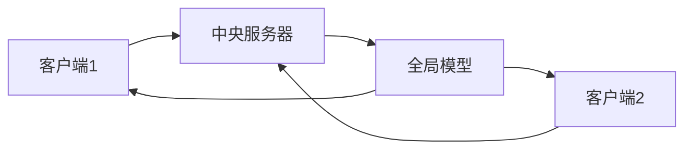
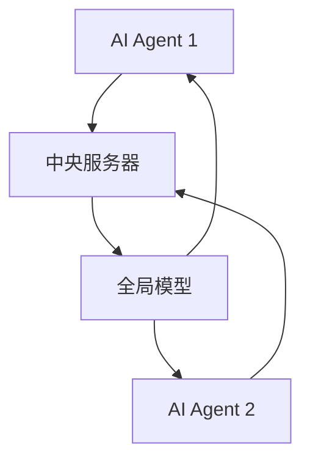
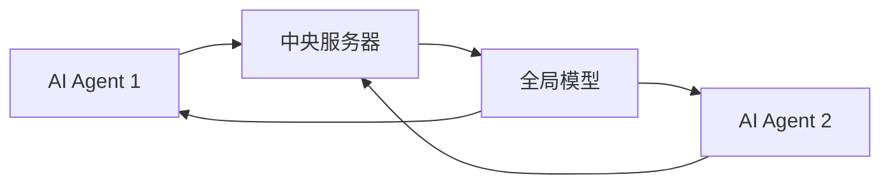

                 


# 开发具有隐私保护联邦学习能力的AI Agent

> **关键词**: 联邦学习, AI Agent, 隐私保护, 分布式机器学习, 同态加密

> **摘要**: 本文详细探讨了如何开发具有隐私保护能力的联邦学习AI Agent。文章从联邦学习和AI Agent的基本概念入手，分析了两者结合的必要性与优势，深入讲解了联邦学习的原理、隐私保护机制及算法框架，详细阐述了AI Agent的系统架构设计，通过实际案例展示了如何在项目中实现隐私保护联邦学习能力，并提供了最佳实践建议。

---

# 第1章: 联邦学习与AI Agent背景介绍

## 1.1 联邦学习的基本概念

### 1.1.1 联邦学习的定义

联邦学习（Federated Learning，FL）是一种分布式机器学习技术，允许多个参与方在不共享原始数据的情况下协作训练模型。通过将模型参数在各方之间进行交换和同步，联邦学习能够在保护数据隐私的前提下，实现全局模型的优化。

$$ \text{联邦学习的核心目标是：} \text{数据不出域，模型多训练} $$

### 1.1.2 联邦学习的核心特点

1. **数据本地化**：数据无需离开原始设备或服务器，仅传输模型参数。
2. **去中心化**：通过去中心化的通信机制实现模型训练。
3. **隐私保护**：通过加密和差分隐私等技术保护参与方的数据隐私。

### 1.1.3 联邦学习的背景与应用领域

随着数据隐私保护法规（如GDPR）的严格，联邦学习在保护数据隐私的前提下进行协作学习的需求日益增长。其典型应用场景包括：

- **医疗领域**：在保护患者隐私的前提下，协作训练疾病诊断模型。
- **金融领域**：联合多家金融机构的数据，训练风险评估模型。
- **移动设备**：通过移动设备间的联邦学习，优化推荐算法。

---

## 1.2 AI Agent的基本概念

### 1.2.1 AI Agent的定义

AI Agent（人工智能代理）是指能够感知环境、自主决策并执行任务的智能体。它能够根据环境反馈调整行为，完成特定目标。

### 1.2.2 AI Agent的核心功能与特点

1. **自主性**：无需外部干预，自主完成任务。
2. **反应性**：能够感知环境变化并实时调整行为。
3. **学习能力**：通过学习提升任务执行效率。

### 1.2.3 AI Agent与传统AI的区别

| 属性             | 传统AI                          | AI Agent                         |
|------------------|---------------------------------|----------------------------------|
| 自主性           | 依赖外部指令                   | 自主决策                         |
| 适应性           | 静态或弱适应性                 | 强适应性                         |
| 交互方式         | 单向输入输出                   | 双向交互                         |

---

## 1.3 联邦学习与AI Agent的结合

### 1.3.1 联邦学习在AI Agent中的作用

通过联邦学习，AI Agent可以在不共享原始数据的情况下，与其他Agent协作训练模型，提升整体智能水平。

### 1.3.2 联邦学习如何增强AI Agent的能力

1. **数据隐私保护**：联邦学习确保AI Agent之间的协作不会泄露原始数据。
2. **全局优化**：通过联邦学习，多个AI Agent可以共同优化全局模型，提升任务执行效率。
3. **分布式协作**：支持去中心化的协作模式，增强系统的鲁棒性。

### 1.3.3 联邦学习与AI Agent的未来发展趋势

随着AI Agent在智能城市、智能家居等领域的广泛应用，联邦学习将为其提供更强大的数据隐私保护能力和协作能力。

---

## 1.4 本章小结

本章介绍了联邦学习和AI Agent的基本概念，分析了两者结合的必要性与优势，为后续章节的深入探讨奠定了基础。

---

# 第2章: 联邦学习的核心概念与原理

## 2.1 联邦学习的原理

### 2.1.1 联邦学习的基本原理

联邦学习的核心流程包括以下步骤：

1. **初始化**：所有参与方初始化本地模型参数。
2. **局部训练**：每个参与方在本地数据上训练模型，更新本地参数。
3. **参数同步**：通过通信协议将本地参数上传到中央服务器或直接与其他参与方同步。
4. **全局优化**：中央服务器聚合所有参与方的参数，更新全局模型。
5. **迭代优化**：重复局部训练和参数同步，直到模型收敛。

### 2.1.2 联邦学习的通信机制

联邦学习的通信机制可以分为以下几种：

1. **全连接通信**：所有参与方直接与中央服务器通信。
2. **分层通信**：通过多级服务器进行通信，减少通信开销。
3. **点对点通信**：参与方之间直接进行参数同步。

### 2.1.3 联邦学习的同步策略

- **同步联邦学习**：所有参与方同时更新模型参数。
- **异步联邦学习**：参与方可以异步更新模型参数，减少通信开销。

---

## 2.2 联邦学习的隐私保护机制

### 2.2.1 数据加密与隐私保护

联邦学习中常用加密技术保护数据隐私，例如：

- **同态加密**：允许在加密数据上进行计算，结果解密后与直接计算结果相同。
- **差分隐私**：通过在数据中添加噪声，确保个体数据无法被推断。

### 2.2.2 差分隐私与联邦学习的结合

差分隐私通过在模型更新过程中添加噪声，确保单个参与方的数据对全局模型的影响可以忽略不计。

$$ \text{差分隐私的噪声添加公式：} \epsilon \text{ - 沉默参数} $$

### 2.2.3 同态加密在联邦学习中的应用

同态加密允许在加密数据上进行线性运算，确保数据在传输过程中保持加密状态。

---

## 2.3 联邦学习的算法框架

### 2.3.1 联邦平均算法（FedAvg）

**算法流程图（使用Mermaid）：**



**数学模型：**

$$ \text{全局模型更新公式：} \theta_{\text{global}} = \frac{\sum w_i \theta_{\text{local}}}{\sum w_i} $$

其中，\( w_i \) 是客户端 \( i \) 的权重。

### 2.3.2 联邦直推算法（FedProx）

**算法流程图（使用Mermaid）：**


**数学模型：**

$$ L_{\text{total}} = \sum_{i=1}^n w_i (L_i(\theta_{\text{global}}, \theta_{\text{local}}) + \frac{1}{2\tau} \|\theta_{\text{local}} - \theta_{\text{global}}\|^2) $$

---

## 2.4 联邦学习的数学模型与公式

### 2.4.1 联邦平均算法的数学模型

$$ \theta_{\text{global}}^{(t+1)} = \frac{\sum_{i=1}^n w_i \theta_i^{(t)}}{\sum_{i=1}^n w_i} $$

其中，\( w_i \) 是客户端 \( i \) 的权重，\( \theta_i^{(t)} \) 是客户端 \( i \) 在第 \( t \) 轮的模型参数。

### 2.4.2 联邦直推算法的数学模型

$$ L_{\text{total}} = \sum_{i=1}^n w_i (L_i(\theta_{\text{global}}, \theta_{\text{local}}) + \frac{1}{2\tau} \|\theta_{\text{local}} - \theta_{\text{global}}\|^2) $$

---

## 2.5 本章小结

本章详细介绍了联邦学习的核心原理、隐私保护机制以及常用的算法框架，为后续章节的系统设计奠定了理论基础。

---

# 第3章: AI Agent的核心概念与架构

## 3.1 AI Agent的设计原则

### 3.1.1 智能性与自主性

AI Agent需要具备自主决策的能力，能够在复杂环境中自主选择最优行动方案。

### 3.1.2 可解释性与透明性

AI Agent的行为需要可解释，以便用户理解和信任。

### 3.1.3 安全性与隐私保护

AI Agent必须具备强大的数据隐私保护能力，防止数据泄露和攻击。

---

## 3.2 AI Agent的系统架构

### 3.2.1 基于联邦学习的AI Agent架构

**系统架构图（使用Mermaid）：**



### 3.2.2 联邦学习与AI Agent的交互

**交互流程图（使用Mermaid）：**



---

## 3.3 本章小结

本章详细分析了AI Agent的设计原则和系统架构，为后续章节的项目实战奠定了基础。

---

# 第4章: 项目实战——开发具有隐私保护的联邦学习AI Agent

## 4.1 项目背景与目标

### 4.1.1 项目背景

随着数据隐私保护的日益严格，开发具有隐私保护能力的AI Agent成为趋势。

### 4.1.2 项目目标

通过联邦学习技术，开发一个能够在保护数据隐私的前提下，与其他AI Agent协作训练模型的智能代理。

---

## 4.2 环境安装与配置

### 4.2.1 环境要求

- Python 3.8+
- TensorFlow Federated (TFF)库
- PyTorch Federated库

### 4.2.2 安装依赖

```bash
pip install tensorflow-federated torch-federated
```

---

## 4.3 系统核心实现

### 4.3.1 联邦学习模型实现

```python
import tensorflow as tf
import tensorflow_federated as tff

# 定义模型结构
model = tf.keras.Sequential([
    tf.keras.layers.Dense(128, activation='relu'),
    tf.keras.layers.Dense(10, activation='softmax')
])

# 定义损失函数和优化器
loss_fn = tf.keras.losses.SparseCategoricalCrossentropy(from_logits=True)
optimizer = tf.keras.optimizers.Adam()

# 转换为TFF模型
tff_model = tff.models.from_keras_model(model, loss=loss_fn, optimizer=optimizer)
```

### 4.3.2 联邦学习训练流程

```python
# 初始化中央服务器
server_state = tff.federated_server_state.ServerState(
    model_weights=tff_model.weights,
    global_model=tff_model
)

# 定义训练循环
def train_one_round(server_state, federated_dataset):
    model = server_state.global_model
    optimizer = model.optimizer
    loss_fn = model.loss

    # 更新全局模型
    for batch in federated_dataset:
        x, y = batch
        with tf.GradientTape() as tape:
            y_pred = model(x)
            loss = loss_fn(y, y_pred)
        gradients = tape.gradient(loss, model.trainable_weights)
        optimizer.apply_gradients(zip(gradients, model.trainable_weights))
    return tff_server_state.global_model
```

---

## 4.4 代码应用解读与分析

### 4.4.1 代码功能分析

上述代码实现了基于TensorFlow Federated库的联邦学习模型，包括模型定义、损失函数、优化器以及训练循环。

### 4.4.2 代码实现细节

- **模型定义**：使用Keras定义了一个简单的多层感知机模型。
- **损失函数和优化器**：使用交叉熵损失和Adam优化器。
- **联邦学习训练循环**：通过梯度下降更新全局模型参数。

---

## 4.5 实际案例分析与详细讲解

### 4.5.1 案例背景

假设我们有多个移动设备，每个设备上都有本地数据，希望通过联邦学习训练一个全局模型，用于推荐系统。

### 4.5.2 案例实现

```python
# 初始化客户端数据
federated_dataset = [client_data_1, client_data_2, ..., client_data_n]

# 初始化中央服务器
server_state = tff.federated_server_state.ServerState(
    model_weights=tff_model.weights,
    global_model=tff_model
)

# 开始训练
for round in range(num_rounds):
    server_state = train_one_round(server_state, federated_dataset)
```

---

## 4.6 项目小结

本章通过一个实际案例，详细讲解了如何开发具有隐私保护能力的联邦学习AI Agent，展示了代码实现和系统设计的细节。

---

# 第5章: 最佳实践与注意事项

## 5.1 最佳实践

### 5.1.1 数据预处理与清洗

确保数据质量，避免脏数据对模型训练的影响。

### 5.1.2 模型调优

通过交叉验证和超参数调优，提升模型性能。

### 5.1.3 安全性与隐私保护

在实际应用中，建议结合差分隐私和同态加密等技术，进一步提升隐私保护能力。

---

## 5.2 注意事项

1. **数据隐私保护**：在实际项目中，必须严格遵守数据隐私保护法规。
2. **通信效率**：优化通信协议，减少通信开销。
3. **模型收敛性**：确保模型能够快速收敛，避免训练时间过长。

---

## 5.3 拓展阅读

建议读者进一步阅读以下资料：

- TensorFlow Federated官方文档
- 《Differential Privacy》
- 《Homomorphic Encryption》

---

# 作者

**作者：AI天才研究院/AI Genius Institute & 禅与计算机程序设计艺术 /Zen And The Art of Computer Programming**

---

以上是《开发具有隐私保护联邦学习能力的AI Agent》的完整目录大纲，涵盖背景介绍、核心概念、系统架构设计、项目实战及最佳实践等内容，结合理论与实践，帮助读者全面掌握开发具有隐私保护联邦学习能力的AI Agent的相关知识。

