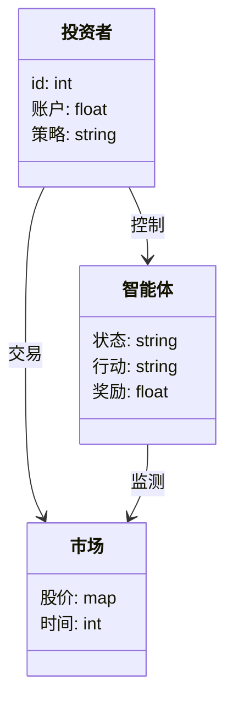
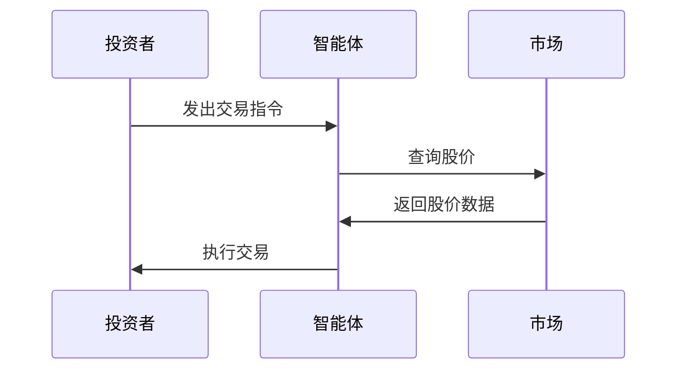

                 


# 智能体群体在模拟投资者行为中的应用

## 关键词：智能体群体，投资者行为，群体智能，强化学习，算法原理，系统架构

## 摘要：  
智能体群体模拟投资者行为是一种新兴的研究方向，旨在通过模拟投资者的决策过程和群体行为，揭示市场波动的内在规律。本文从智能体群体的基本概念出发，逐步深入探讨其在模拟投资者行为中的应用。通过分析强化学习和群体智能算法，结合系统架构设计和实际案例，本文展示了如何利用智能体群体技术来优化投资策略和预测市场趋势。最终，本文总结了智能体群体模拟投资者行为的优势与挑战，并提出了未来研究的方向。

---

# 第1章: 智能体群体与投资者行为概述

## 1.1 智能体群体的基本概念

### 1.1.1 智能体的定义与特征
智能体（Agent）是一种能够感知环境并采取行动以实现目标的实体。其核心特征包括自主性、反应性、社会性和学习性。智能体可以是软件程序，也可以是物理设备，但它们共同的特点是能够在复杂环境中自主决策。

### 1.1.2 群体智能的定义与特点
群体智能是指多个智能体通过协作和竞争共同完成复杂任务的能力。群体智能的核心在于个体之间的信息共享和协同决策。与个体智能相比，群体智能能够更好地应对动态和不确定的环境。

### 1.1.3 智能体群体与投资者行为的关系
投资者行为是指投资者在金融市场中做出决策的过程，包括买入、卖出和持有可能性。智能体群体可以通过模拟投资者的决策过程，揭示市场波动的内在规律。

## 1.2 投资者行为的复杂性与挑战

### 1.2.1 投资者行为的多样性
投资者行为受到多种因素的影响，包括个人情绪、市场环境和宏观经济指标。不同投资者可能采取不同的策略，导致市场行为的多样性。

### 1.2.2 投资者决策的非理性特征
投资者在决策过程中往往受到情绪和认知偏差的影响，导致决策的非理性。例如，过度自信和从众心理会影响投资者的决策行为。

### 1.2.3 群体行为对市场的影响
投资者的群体行为会导致市场波动。例如，羊群效应和恐慌情绪会导致市场短期内剧烈波动。

## 1.3 智能体群体模拟投资者行为的意义

### 1.3.1 提高市场预测的准确性
通过模拟投资者行为，可以更好地预测市场趋势，从而提高投资决策的准确性。

### 1.3.2 优化投资策略的制定
智能体群体模拟可以帮助投资者制定更加科学和合理的投资策略，避免非理性决策的影响。

### 1.3.3 理解市场波动的内在机制
通过模拟投资者行为，可以揭示市场波动的内在机制，帮助投资者更好地应对市场变化。

## 1.4 本章小结
本章介绍了智能体群体的基本概念，分析了投资者行为的复杂性与挑战，并探讨了智能体群体模拟投资者行为的意义。

---

# 第2章: 智能体群体的核心概念与原理

## 2.1 智能体的属性与行为模型

### 2.1.1 智能体的感知与决策机制
智能体通过感知环境信息，利用决策算法做出决策。例如，智能体可以通过分析市场数据，利用强化学习算法选择最优的投资策略。

### 2.1.2 智能体的协作与竞争关系
智能体群体中的个体可以协作或竞争。例如，多个智能体可以通过共享信息，共同预测市场趋势，或者通过竞争优化决策。

### 2.1.3 智能体的适应性与学习能力
智能体可以通过机器学习算法不断优化自身的决策模型，提高适应性。例如，使用深度学习算法，智能体可以更好地理解和预测市场行为。

## 2.2 投资者行为的建模方法

### 2.2.1 基于个体的投资者行为建模
基于个体的建模方法将每个投资者视为一个独立的个体，分析其决策行为。例如，可以通过强化学习算法模拟投资者的决策过程。

### 2.2.2 基于群体的投资者行为建模
基于群体的建模方法将投资者群体视为一个整体，分析其行为特征。例如，可以通过群体智能算法模拟投资者的集体决策过程。

### 2.2.3 市场环境对投资者行为的影响
市场环境，如经济指标和政策变化，会影响投资者的行为。例如，政策变化可能导致投资者行为的剧烈波动。

## 2.3 智能体群体与投资者行为的关联性

### 2.3.1 智能体群体的特征与投资者行为的共性
智能体群体和投资者行为都具有多样性和复杂性。例如，智能体群体可以通过协作和竞争优化决策，投资者群体也可以通过协作和竞争影响市场。

### 2.3.2 智能体群体模拟投资者行为的可行性
智能体群体可以通过强化学习和群体智能算法模拟投资者行为。例如，智能体可以模拟投资者的决策过程，预测市场趋势。

### 2.3.3 智能体群体模拟的局限性与改进方向
智能体群体模拟投资者行为的局限性在于模型的复杂性和数据的不足。例如，模型可能无法完全捕捉投资者行为的非理性特征。

## 2.4 本章小结
本章探讨了智能体群体的核心概念与原理，分析了投资者行为的建模方法，并探讨了智能体群体与投资者行为的关联性。

---

# 第3章: 智能体群体模拟投资者行为的算法原理

## 3.1 强化学习算法在智能体行为模拟中的应用

### 3.1.1 强化学习的基本原理
强化学习是一种通过试错机制优化决策的算法。智能体通过与环境交互，获得奖励或惩罚，从而优化决策策略。

### 3.1.2 Q-learning算法的实现与应用
Q-learning算法是一种常用的强化学习算法。通过Q表记录状态-动作对的期望奖励值，智能体可以优化决策策略。

$$ Q(s, a) = Q(s, a) + \alpha (r + \gamma \max Q(s', a) - Q(s, a)) $$

### 3.1.3 多智能体强化学习的挑战与解决方案
多智能体强化学习的挑战在于智能体之间的协作与竞争。可以通过分布式Q-learning算法解决这个问题。

## 3.2 群体智能算法的实现与优化

### 3.2.1 群体智能算法的基本框架
群体智能算法包括初始化、信息共享、决策优化和结果分析等步骤。例如，粒子群优化算法（PSO）是一种常用的群体智能算法。

### 3.2.2 群体智能算法的优化策略
可以通过自适应学习率和种群多样性等方法优化群体智能算法。例如，动态调整种群规模和信息共享频率。

### 3.2.3 群体智能算法在投资者行为模拟中的应用案例
例如，可以通过粒子群优化算法模拟投资者的决策过程，优化投资组合。

## 3.3 投资者行为模拟的数学模型与公式

### 3.3.1 投资者决策的数学模型
投资者决策可以表示为一个动态过程，可以通过差分方程描述：

$$ dP/dt = \sum_{i=1}^{n} \lambda_i x_i - \mu P $$

其中，P表示资产价格，x_i表示投资者的决策变量，λ_i表示权重，μ表示市场摩擦。

### 3.3.2 群体行为的数学建模
群体行为可以通过元胞自动机模型模拟：

$$ S_{t+1}(i) = \begin{cases} 
1 & \text{如果} \sum_{j=1}^{n} w_j S_t(j) > 0 \\
0 & \text{否则}
\end{cases} $$

### 3.3.3 市场波动的数学表达与分析
市场波动可以用随机微分方程描述：

$$ dS = \mu S dt + \sigma S dW $$

其中，S表示资产价格，μ表示期望回报率，σ表示波动率，W表示布朗运动。

## 3.4 本章小结
本章探讨了强化学习和群体智能算法在智能体行为模拟中的应用，分析了投资者行为的数学模型与公式。

---

# 第4章: 智能体群体模拟投资者行为的系统架构

## 4.1 问题场景介绍
本章通过一个实际案例介绍智能体群体模拟投资者行为的系统架构。假设我们开发一个模拟股票市场的系统，其中智能体模拟投资者的决策过程。

## 4.2 系统功能设计

### 4.2.1 领域模型设计
领域模型可以用mermaid类图表示：



### 4.2.2 系统架构设计
系统架构可以用mermaid架构图表示：


### 4.2.3 系统接口设计
系统接口包括投资者接口、市场接口和智能体接口。投资者可以通过HTTP接口与系统交互，智能体通过RPC接口与系统交互。

### 4.2.4 系统交互设计
系统交互可以用mermaid序列图表示：



## 4.3 本章小结
本章通过实际案例介绍了智能体群体模拟投资者行为的系统架构，包括领域模型设计、系统架构设计、系统接口设计和系统交互设计。

---

# 第5章: 智能体群体模拟投资者行为的项目实战

## 5.1 环境安装

### 5.1.1 安装Python环境
需要安装Python 3.8以上版本，并安装必要的库，如numpy、pandas和matplotlib。

### 5.1.2 安装强化学习库
安装强化学习库，如tensorflow和keras。

### 5.1.3 安装群体智能库
安装群体智能库，如DEAP和numpy。

## 5.2 系统核心实现源代码

### 5.2.1 强化学习算法实现
以下是一个强化学习算法的Python实现示例：

```python
import numpy as np
import random

class QLearning:
    def __init__(self, state_space, action_space):
        self.state_space = state_space
        self.action_space = action_space
        self.Q = np.zeros((state_space, action_space))

    def choose_action(self, state, epsilon):
        if random.random() < epsilon:
            return random.randint(0, self.action_space - 1)
        return np.argmax(self.Q[state, :])

    def update_Q(self, state, action, reward, next_state, alpha, gamma):
        self.Q[state, action] += alpha * (reward + gamma * np.max(self.Q[next_state, :]) - self.Q[state, action])
```

### 5.2.2 群体智能算法实现
以下是一个群体智能算法的Python实现示例：

```python
import random

def particle Swarm Optimization(fitness_func, bounds, n_particles, max_iter):
    n_dim = len(bounds[0])
    particles = [[random.uniform(bounds[i][0], bounds[i][1]) for i in range(n_dim)] for _ in range(n_particles)]
    velocities = [[0.0 for _ in range(n_dim)] for _ in range(n_particles)]
    best = particles.copy()

    for _ in range(max_iter):
        for i in range(n_particles):
            current_fitness = fitness_func(particles[i])
            if current_fitness > fitness_func(best[i]):
                best[i] = particles[i].copy()
        for i in range(n_particles):
            for j in range(n_dim):
                velocities[i][j] = 0.5 * velocities[i][j] + 0.5 * (best[i][j] - particles[i][j])
                particles[i][j] += velocities[i][j]
    return best

```

## 5.3 案例分析与详细解读

### 5.3.1 投资者行为模拟案例
模拟一个简单的股票市场，智能体模拟投资者的决策过程，预测股票价格的变化。

### 5.3.2 系统实现与分析
通过实现强化学习和群体智能算法，智能体能够优化投资策略，提高预测准确性。

## 5.4 本章小结
本章通过实际案例介绍了智能体群体模拟投资者行为的实现过程，包括环境安装、系统核心代码实现、案例分析和系统优化。

---

# 第6章: 最佳实践与小结

## 6.1 最佳实践 tips

### 6.1.1 系统优化建议
可以通过分布式计算和并行优化技术提高系统的计算效率。

### 6.1.2 算法选择建议
根据具体问题选择合适的算法，强化学习适用于动态环境，群体智能适用于复杂环境。

### 6.1.3 数据隐私保护
在实际应用中，需要重视数据隐私保护，避免数据泄露和滥用。

## 6.2 小结

### 6.2.1 本文总结
本文通过智能体群体模拟投资者行为，探讨了其在金融领域的应用，分析了算法原理和系统架构。

### 6.2.2 未来研究方向
未来研究可以进一步优化算法，探索新的应用场景，如加密货币市场和风险管理。

## 6.3 注意事项

### 6.3.1 模型泛化能力
需要注意模型的泛化能力，避免过度拟合训练数据。

### 6.3.2 数据质量和数量
需要保证数据质量和数量，提高模型的预测准确性。

### 6.3.3 系统安全性
需要重视系统安全性，防止网络攻击和数据篡改。

## 6.4 拓展阅读

### 6.4.1 推荐书籍
1. 《强化学习》
2. 《群体智能》
3. 《智能体建模与仿真》

### 6.4.2 推荐论文
1. "Multi-Agent Reinforcement Learning: A Survey"
2. "Particle Swarm Optimization: A Technical Survey"

## 6.5 本章小结
本章总结了智能体群体模拟投资者行为的优势与挑战，并提出了未来研究的方向。

---

# 作者：AI天才研究院 & 禅与计算机程序设计艺术

