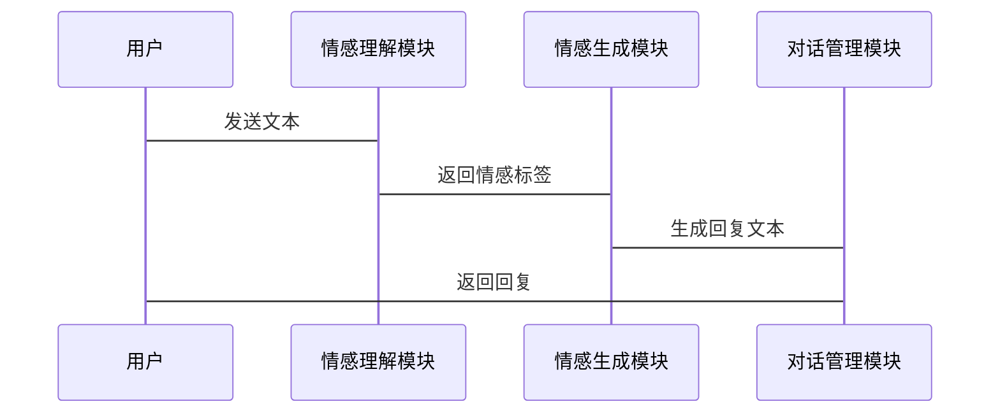

                 


# 《构建具有情感生成能力的AI Agent》

## 关键词：
AI Agent, 情感生成, 深度学习, 情感计算, 对抗训练

## 摘要：
本文旨在探讨如何构建具有情感生成能力的AI Agent。通过分析情感生成的核心概念、算法原理和系统架构，结合实际项目案例，深入讲解如何实现一个能够理解和生成情感的智能体。文章内容涵盖从基础理论到实战应用的全过程，帮助读者系统地掌握情感生成AI Agent的设计与实现。

---

# 第4章 情感生成模型的算法原理

## 4.4 情感生成模型的训练与优化

### 4.4.1 情感生成模型的训练流程
1. **数据预处理**：将情感数据进行清洗、分词和标注，确保数据质量。
2. **模型初始化**：选择合适的深度学习模型（如Transformer）并初始化参数。
3. **训练过程**：
   - 输入情感数据，生成初始预测结果。
   - 计算预测结果与真实结果之间的误差。
   - 使用梯度下降方法优化模型参数。
4. **评估与调优**：通过验证集评估模型性能，调整超参数以优化生成效果。

### 4.4.2 情感生成模型的优化方法
1. **学习率调整**：使用学习率衰减策略，避免模型过早收敛。
2. **Dropout技术**：在训练过程中随机屏蔽部分神经元，防止过拟合。
3. **多任务学习**：结合情感分类和生成任务，提升模型的综合能力。
4. **对抗训练**：引入生成对抗网络（GAN），进一步优化生成结果的质量。

### 4.4.3 情感生成模型的数学公式
1. **序列生成模型**：
   $$ P(y_t | y_{<t}, x) $$
   其中，$y_t$ 表示生成的第 $t$ 个情感词，$y_{<t}$ 表示之前的生成序列，$x$ 表示输入数据。

2. **Transformer模型结构**：
   - **编码器**：将输入序列映射到一个固定长度的向量。
     $$ \text{Encoder}(x) = x + \text{PositionalEncoding}(x) $$
   - **解码器**：根据编码器输出生成目标序列。
     $$ \text{Decoder}(y) = y + \text{PositionalEncoding}(y) $$

3. **对抗训练模型**：
   - **生成器**：生成符合情感要求的文本。
     $$ G(x) = y $$
   - **判别器**：判断生成文本的真实性。
     $$ D(x, y) = p(x \text{ 和 } y \text{ 真实相关}) $$

---

## 4.5 情感生成模型的实现代码

### 4.5.1 环境配置
```python
import torch
import torch.nn as nn
import torch.optim as optim
from torch.utils.data import DataLoader
```

### 4.5.2 情感生成模型定义
```python
class TransformerGenerator(nn.Module):
    def __init__(self, vocab_size, embedding_dim, hidden_dim):
        super(TransformerGenerator, self).__init__()
        self.embedding = nn.Embedding(vocab_size, embedding_dim)
        self.transformer = nn.Transformer(embedding_dim, hidden_dim)
        self.fc = nn.Linear(hidden_dim, vocab_size)
    
    def forward(self, x):
        embedded = self.embedding(x)
        output = self.transformer(embedded, embedded)
        output = self.fc(output)
        return output
```

### 4.5.3 对抗训练实现
```python
class Discriminator(nn.Module):
    def __init__(self, vocab_size, embedding_dim, hidden_dim):
        super(Discriminator, self).__init__()
        self.embedding = nn.Embedding(vocab_size, embedding_dim)
        self.transformer = nn.Transformer(embedding_dim, hidden_dim)
        self.fc = nn.Linear(hidden_dim, 1)
    
    def forward(self, x):
        embedded = self.embedding(x)
        output = self.transformer(embedded, embedded)
        output = self.fc(output)
        return output.sigmoid()
```

### 4.5.4 训练流程
```python
def train_generator(vocab_size, embedding_dim, hidden_dim, batch_size, num_epochs):
    generator = TransformerGenerator(vocab_size, embedding_dim, hidden_dim)
    discriminator = Discriminator(vocab_size, embedding_dim, hidden_dim)
    optimizer_gen = optim.Adam(generator.parameters(), lr=0.001)
    optimizer_disc = optim.Adam(discriminator.parameters(), lr=0.001)
    
    for epoch in range(num_epochs):
        for batch in DataLoader(train_dataset, batch_size):
            # 生成假数据
            fake_data = generator(batch)
            # 判别真假数据
            real_output = discriminator(batch)
            fake_output = discriminator(fake_data)
            
            # 计算损失
            loss_gen = torch.mean(torch.log(fake_output))
            loss_dis = -torch.mean(torch.log(real_output) + torch.log(1 - fake_output))
            
            # 更新生成器参数
            optimizer_gen.zero_grad()
            loss_gen.backward()
            optimizer_gen.step()
            
            # 更新判别器参数
            optimizer_disc.zero_grad()
            loss_dis.backward()
            optimizer_disc.step()
    
    return generator, discriminator
```

---

## 4.6 情感生成模型的评估与分析

### 4.6.1 模型性能评估
1. **生成质量**：通过 BLEU、ROUGE 等指标评估生成文本的质量。
2. **多样性评估**：计算生成结果的多样性，确保模型能够生成不同的情感表达。
3. **可解释性分析**：通过注意力机制分析生成结果的逻辑性。

### 4.6.2 案例分析
以实际对话数据为例，展示模型在不同情感输入下的生成效果，并对比不同算法的生成结果，分析其优劣。

---

## 4.7 本章小结

---

# 第5章 情感生成AI Agent的系统架构与设计

## 5.1 系统功能模块设计

### 5.1.1 情感理解模块
- 输入：用户文本
- 输出：情感标签（如：快乐、悲伤、愤怒）

### 5.1.2 情感生成模块
- 输入：情感标签
- 输出：生成的情感文本

### 5.1.3 对话管理模块
- 输入：用户文本、情感标签
- 输出：生成的回复文本

## 5.2 系统架构设计

### 5.2.1 分层架构
- 数据层：处理情感数据的输入、存储和预处理。
- 业务逻辑层：实现情感理解、生成和对话管理功能。
- 表示层：展示用户交互界面，接收输入并显示生成结果。

### 5.2.2 模块间交互设计
使用 Mermaid 序列图描述模块之间的调用流程：


## 5.3 接口设计与实现

### 5.3.1 API 接口定义
- `/api/v1/analyze`: 接收文本，返回情感标签。
- `/api/v1/generate`: 接收情感标签，返回生成文本。

### 5.3.2 接口实现
```python
@app.route('/api/v1/analyze', methods=['POST'])
def analyze_emotion():
    data = request.json
    text = data['text']
    # 调用情感理解模块进行分析
    emotion_label = emotion_analyzer.predict(text)
    return jsonify({'emotion': emotion_label})

@app.route('/api/v1/generate', methods=['POST'])
def generate_response():
    data = request.json
    emotion_label = data['emotion']
    # 调用情感生成模块生成文本
    response = generator.generate(emotion_label)
    return jsonify({'response': response})
```

---

## 5.4 系统交互设计

### 5.4.1 用户交互流程
1. 用户发送文本输入。
2. 系统分析文本情感，生成情感标签。
3. 系统根据情感标签生成回复文本。
4. 用户接收回复文本，完成交互。

### 5.4.2 交互优化
- 实时反馈：生成结果即时显示。
- 多轮对话：支持连续对话，提升用户体验。
- 可选调整：用户可以调整生成结果的风格和语气。

---

## 5.5 本章小结

---

# 第6章 情感生成AI Agent的项目实战

## 6.1 项目背景与目标

### 6.1.1 项目背景
构建一个能够理解用户情感并生成相应情感文本的AI Agent，应用于智能客服、教育辅助等领域。

### 6.1.2 项目目标
1. 实现情感理解与生成功能。
2. 对接实际场景，提供实用的交互服务。
3. 持续优化模型性能，提升用户体验。

## 6.2 项目实现步骤

### 6.2.1 环境搭建
- 安装必要的库：PyTorch、Transformers、Flask等。
- 配置开发环境：Python 3.8+，GPU支持。

### 6.2.2 数据准备
- 收集用户对话数据。
- 标注情感标签，建立训练数据集。

### 6.2.3 模型训练
- 使用预处理数据训练情感理解与生成模型。
- 调参优化，提升模型性能。

### 6.2.4 系统集成
- 实现API接口，提供外部调用功能。
- 开发用户界面，展示交互结果。

## 6.3 项目实现代码

### 6.3.1 情感理解模块
```python
class EmotionAnalyzer:
    def __init__(self, model_path):
        self.model = torch.load(model_path)
    
    def predict(self, text):
        inputs = tokenize(text)
        outputs = self.model(inputs)
        return get_label(outputs)
```

### 6.3.2 情感生成模块
```python
class EmotionGenerator:
    def __init__(self, model_path):
        self.model = torch.load(model_path)
    
    def generate(self, emotion_label):
        inputs = encode_emotion(emotion_label)
        outputs = self.model(inputs)
        return decode_output(outputs)
```

### 6.3.3 对话管理模块
```python
class DialogManager:
    def __init__(self):
        self.current_context = ""
    
    def process_dialog(self, user_input):
        emotion_label = emotion_analyzer.predict(user_input)
        response = generator.generate(emotion_label)
        self.current_context += user_input + response
        return response
```

## 6.4 项目测试与优化

### 6.4.1 功能测试
- 情感理解测试：输入不同文本，验证情感标签是否准确。
- 情感生成测试：根据情感标签，生成符合预期的文本。

### 6.4.2 性能优化
- 提升模型生成速度。
- 优化用户体验，减少响应延迟。

### 6.4.3 模型调优
- 调整超参数，如学习率、批次大小等。
- 引入更复杂的模型结构，提升生成质量。

## 6.5 项目案例分析

### 6.5.1 案例一：智能客服应用
用户输入： "我对你们的服务非常不满！"
系统响应： "非常抱歉给您带来不好的体验，我们会尽快解决问题。请问您具体遇到了什么问题？"

### 6.5.2 案例二：教育辅助应用
用户输入： "这道题我怎么也做不出来，好烦啊。"
系统响应： "别担心，我来帮你分析一下这个问题。我们可以一步步来解决。"

---

## 6.6 本章小结

---

# 第7章 总结与展望

## 7.1 总结
本文详细介绍了情感生成AI Agent的构建过程，从算法原理到系统设计，再到项目实战，全面探讨了情感生成的核心问题和解决方法。通过实践案例，展示了情感生成技术在实际应用中的巨大潜力。

## 7.2 展望
未来，情感生成AI Agent的发展将朝着以下几个方向迈进：
1. **多模态情感生成**：结合视觉、听觉等多模态信息，提升情感生成的丰富性。
2. **增强可解释性**：通过注意力机制等方法，使生成过程更加透明和可解释。
3. **个性化生成**：根据用户个性化需求，生成更贴合其风格的情感文本。
4. **实时交互优化**：提升模型的实时生成能力，支持更高效的用户交互。

---

## 作者：
AI天才研究院/AI Genius Institute  
禅与计算机程序设计艺术/Zen And The Art of Computer Programming

