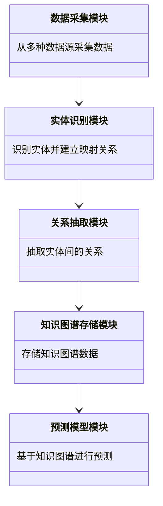
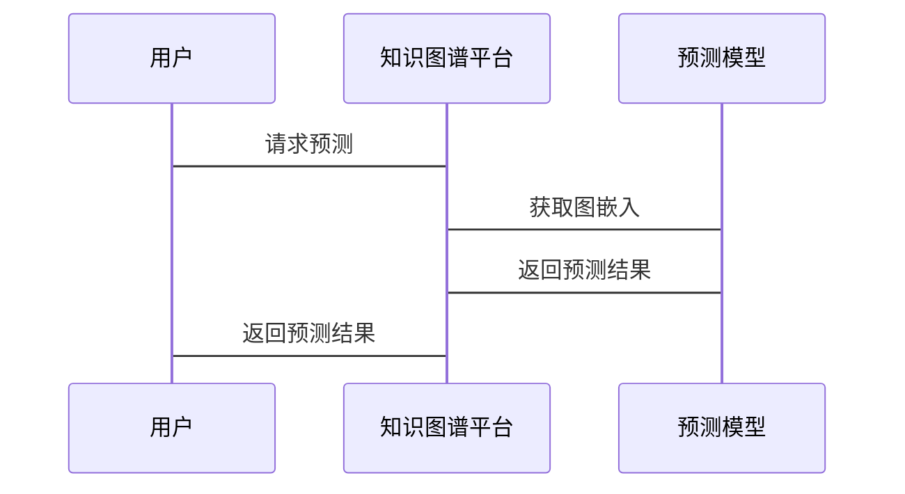

                 


# 构建基于知识图谱的金融监管沙盒测试结果预测平台

## 关键词：知识图谱、金融监管、监管沙盒、测试结果预测、人工智能、机器学习

## 摘要

本文详细探讨了如何利用知识图谱构建金融监管沙盒测试结果预测平台。首先，介绍了知识图谱的基本概念和金融监管沙盒的定义及其在金融领域的应用。接着，深入分析了知识图谱的核心概念、构建方法及其在金融监管中的优势。随后，详细讲解了如何利用知识图谱进行金融监管沙盒的测试与预测，包括算法原理、系统架构设计及项目实战。最后，总结了构建该平台的意义和未来发展方向。

---

# 第一部分: 知识图谱与金融监管沙盒概述

## 第1章: 知识图谱与金融监管沙盒概述

### 1.1 知识图谱的基本概念

#### 1.1.1 知识图谱的定义与特点

知识图谱是一种以图结构形式表示知识的语义网络，由节点（实体）和边（关系）组成，具有语义丰富、结构化和可扩展性强的特点。例如，节点可以表示公司、金融产品等实体，边可以表示“属于”、“影响”等关系。

#### 1.1.2 知识图谱的构建方法

知识图谱的构建包括数据采集、实体识别、关系抽取等步骤。例如，通过爬取金融新闻数据，识别公司实体，并抽取公司之间的“投资”关系。

#### 1.1.3 知识图谱在金融领域的应用

知识图谱在金融领域的应用包括风险评估、关联交易分析和合规性检查等。例如，通过知识图谱可以识别同一实际控制人控制的多家公司，从而评估潜在的关联交易风险。

### 1.2 金融监管沙盒的基本概念

#### 1.2.1 金融监管沙盒的定义与作用

金融监管沙盒是为创新金融产品提供安全测试环境的监管工具，允许金融机构在受控环境中测试新产品，同时确保合规性和风险管理。

#### 1.2.2 金融监管沙盒的核心功能

金融监管沙盒的核心功能包括产品测试、风险评估和数据收集。例如，测试一个新型理财产品在不同市场条件下的表现，并收集用户反馈。

#### 1.2.3 金融监管沙盒的实施流程

实施流程包括申请、测试、评估和反馈。例如，金融机构申请测试新产品，监管机构批准后，产品在沙盒环境中运行，监管机构评估其风险，并根据结果反馈意见。

### 1.3 知识图谱与金融监管沙盒的结合

#### 1.3.1 知识图谱在金融监管中的优势

知识图谱能够整合多源数据，构建金融市场的知识网络，帮助识别潜在风险和关联交易。例如，通过知识图谱可以发现某公司与多家P2P平台有关联，可能存在资金池风险。

#### 1.3.2 金融监管沙盒测试结果预测的必要性

通过知识图谱分析沙盒中的金融产品，预测其市场表现和风险，帮助监管机构提前识别潜在问题。例如，预测新产品在不同用户群体中的接受度和潜在风险。

#### 1.3.3 本章小结

本章介绍了知识图谱和金融监管沙盒的基本概念，并探讨了两者结合的意义。知识图谱能够增强监管沙盒的分析能力，帮助监管机构更有效地评估创新产品。

---

## 第2章: 知识图谱的核心概念

### 2.1 知识图谱的核心要素

#### 2.1.1 实体与关系的定义

实体是知识图谱的基本单位，如公司、产品等。关系描述实体之间的关联，如“投资”、“控制”。

#### 2.1.2 属性与值的描述

属性是描述实体的特征，如“注册资本”、“成立时间”。值是对属性的赋值，如“注册资本为1000万元”。

#### 2.1.3 知识图谱的语义网络结构

知识图谱通过节点和边构建语义网络，形成复杂的关联关系。例如，公司A投资公司B，公司B从事金融科技业务。

### 2.2 知识图谱的构建流程

#### 2.2.1 数据采集与预处理

数据来源包括公开财报、新闻报道和政府公告。预处理包括清洗数据、去除噪声和格式统一。

#### 2.2.2 实体识别与链接

使用自然语言处理技术识别文本中的实体，并通过字符串匹配或语义相似度进行实体对齐。例如，识别“中国平安”和“平安集团”为同一实体。

#### 2.2.3 关系抽取与构建

基于依存句法分析和模式匹配，从文本中抽取关系。例如，从新闻中抽取“平安集团投资某金融科技公司”的关系。

### 2.3 知识图谱的存储与管理

#### 2.3.1 知识图谱的存储方式

常用图数据库包括Neo4j、ArangoDB和MongoDB。例如，使用Neo4j存储知识图谱，利用其高效的查询性能。

#### 2.3.2 知识图谱的数据库选择

选择数据库时需考虑数据规模、查询性能和扩展性。例如，小型项目选择Neo4j，大型项目选择分布式图数据库。

#### 2.3.3 知识图谱的查询与检索

使用SPARQL查询语言进行复杂关联查询。例如，查询“所有投资过金融科技公司的机构投资者”。

### 2.4 知识图谱的可视化

#### 2.4.1 知识图谱的可视化工具

常用工具包括Gephi、Cytoscape和Graphviz。例如，使用Gephi生成网络图，展示实体之间的关联关系。

#### 2.4.2 知识图谱的可视化方法

包括节点布局、边长调整和颜色编码。例如，使用节点大小表示实体的重要性，颜色表示实体类型。

#### 2.4.3 知识图谱的交互式分析

支持用户通过拖拽、筛选等方式进行交互式分析。例如，用户选择某个公司节点，系统展示其所有关联关系。

### 2.5 本章小结

本章详细介绍了知识图谱的核心概念和构建方法，包括数据采集、实体识别、关系抽取和存储管理。通过知识图谱可以构建金融市场的知识网络，支持后续的监管分析。

---

## 第3章: 金融监管沙盒的核心功能

### 3.1 金融监管沙盒的测试场景

#### 3.1.1 金融产品的合规性测试

测试产品是否符合相关法律法规。例如，测试P2P平台是否合规，是否涉及资金池操作。

#### 3.1.2 金融风险的评估与预警

通过沙盒环境模拟不同市场条件，评估产品的风险敞口。例如，测试理财产品在市场波动情况下的赎回压力。

#### 3.1.3 金融市场的模拟与分析

模拟真实市场环境，分析产品的市场表现。例如，测试创新型保险产品在不同经济周期下的销售情况。

### 3.2 金融监管沙盒的测试结果预测

#### 3.2.1 基于知识图谱的预测方法

利用知识图谱中的关联关系，预测产品可能的市场表现和风险。例如，分析同类产品的历史表现，预测新产品的风险等级。

#### 3.2.2 算法原理

使用图嵌入技术将知识图谱中的实体表示为低维向量，输入到机器学习模型中进行预测。例如，使用Word2Vec对实体进行嵌入，输入到LSTM网络中预测产品风险。

#### 3.2.3 预测模型的实现

通过训练数据生成知识图谱，提取图嵌入，构建预测模型。例如，训练数据包括历史产品的属性和关系，预测目标包括风险等级和市场表现。

### 3.3 知识图谱在金融监管沙盒中的应用

#### 3.3.1 知识图谱支持的监管分析

通过知识图谱分析沙盒中的产品，识别潜在风险。例如，发现某产品与多家问题平台有关联，可能存在合规性问题。

#### 3.3.2 知识图谱支持的决策支持

基于知识图谱的分析结果，提供决策支持。例如，建议监管机构重点关注某类产品的风险。

#### 3.3.3 本章小结

本章探讨了知识图谱在金融监管沙盒中的应用，包括测试场景、预测方法和模型实现。通过知识图谱可以增强监管沙盒的分析能力，帮助监管机构更有效地评估创新产品。

---

## 第4章: 系统分析与架构设计

### 4.1 问题场景介绍

金融监管沙盒测试结果预测平台需要支持知识图谱的构建、存储和分析，以及基于知识图谱的预测模型。

### 4.2 项目介绍

本项目旨在构建一个支持金融监管沙盒测试结果预测的知识图谱平台，帮助监管机构评估创新产品。

### 4.3 系统功能设计

#### 4.3.1 领域模型设计

使用Mermaid类图展示系统模块。例如：



#### 4.3.2 系统架构设计

使用Mermaid架构图展示系统架构。例如：

```mermaid
container 知识图谱平台 {
    数据采集模块
    实体识别模块
    关系抽取模块
    知识图谱存储模块
    预测模型模块
}
```

#### 4.3.3 系统接口设计

使用Mermaid序列图展示系统接口。例如：



### 4.4 系统交互设计

#### 4.4.1 用户与系统的交互流程

用户提交测试请求，系统返回预测结果。例如：

1. 用户提交新产品进行测试。
2. 系统构建知识图谱，提取图嵌入。
3. 预测模型生成预测结果。
4. 系统返回预测结果。

#### 4.4.2 系统模块之间的交互

模块之间通过API进行交互。例如：

- 数据采集模块调用API从数据源获取数据。
- 实体识别模块调用API进行实体识别。

### 4.5 本章小结

本章分析了系统的功能需求，设计了系统架构和接口。通过模块化设计，确保系统各部分协同工作，支持知识图谱的构建和预测模型的运行。

---

## 第5章: 项目实战

### 5.1 环境安装与配置

安装必要的工具和库，如Python、Neo4j、TensorFlow和Scikit-learn。例如：

1. 安装Python：`python --version`
2. 安装Neo4j：`brew install neo4j`（MacOS）
3. 安装TensorFlow：`pip install tensorflow`

### 5.2 核心实现代码

#### 5.2.1 数据采集模块

```python
import requests

def fetch_data(url):
    response = requests.get(url)
    return response.text
```

#### 5.2.2 实体识别模块

```python
from spacy.lang.zh import Chinese

nlp = Chinese()
doc = nlp("中国平安投资了某金融科技公司")
entities = [ent.text for ent in doc.ents]
```

#### 5.2.3 关系抽取模块

```python
from spacy import displacy

doc = nlp("平安集团控制多家金融科技公司")
relations = displacy.parse_deps(doc)
```

#### 5.2.4 知识图谱存储模块

```python
from neo4j import GraphDatabase

driver = GraphDatabase.driver("bolt://localhost:7687")
def add_entity(tx, entity, label):
    tx.run("CREATE (n:%s {name: '%s'})" % (label, entity))
```

#### 5.2.5 预测模型模块

```python
import tensorflow as tf
from tensorflow.keras import layers

model = tf.keras.Sequential([
    layers.Dense(64, activation='relu'),
    layers.Dense(1, activation='sigmoid')
])
model.compile(optimizer='adam', loss='binary_crossentropy')
```

### 5.3 代码解读与分析

#### 5.3.1 数据采集模块

从指定URL获取数据，返回文本内容。例如，从金融新闻网站获取公司投资信息。

#### 5.3.2 实体识别模块

使用spaCy进行中文实体识别，提取文本中的实体。例如，识别“中国平安”为公司实体。

#### 5.3.3 关系抽取模块

使用spaCy的依赖句法分析，抽取实体之间的关系。例如，从句子中抽取“投资”关系。

#### 5.3.4 知识图谱存储模块

使用Neo4j存储知识图谱，创建节点和关系。例如，创建“中国平安”节点，类型为公司。

#### 5.3.5 预测模型模块

构建一个简单的深度学习模型，用于分类预测。例如，输入图嵌入，输出风险等级。

### 5.4 实际案例分析

#### 5.4.1 案例背景

假设我们测试一款创新型理财产品，需要预测其市场表现和风险。

#### 5.4.2 数据准备

从知识图谱中提取相关数据，包括产品属性和关联关系。例如，提取产品的历史表现和市场环境数据。

#### 5.4.3 模型训练

使用历史数据训练预测模型，生成图嵌入。例如，使用Word2Vec生成产品嵌入，输入到LSTM网络中。

#### 5.4.4 模型预测

输入新产品数据，生成预测结果。例如，预测新产品在不同市场条件下的表现和风险等级。

### 5.5 项目小结

本章通过具体案例展示了平台的实现过程，包括环境搭建、核心代码实现和案例分析。通过实际操作，验证了平台的有效性和实用性。

---

## 第6章: 总结与展望

### 6.1 本章小结

本文详细探讨了构建基于知识图谱的金融监管沙盒测试结果预测平台的方法，包括知识图谱的核心概念、金融监管沙盒的功能需求、系统架构设计和项目实战。通过知识图谱和机器学习的结合，可以有效支持监管机构评估创新产品。

### 6.2 注意事项

在实际应用中，需要注意数据隐私和模型泛化能力。例如，确保数据合规性，避免模型过拟合。

### 6.3 拓展阅读

推荐学习知识图谱和机器学习的相关知识，深入了解图嵌入技术和金融监管领域的最新研究。

---

## 作者

作者：AI天才研究院/AI Genius Institute & 禅与计算机程序设计艺术/Zen And The Art of Computer Programming

