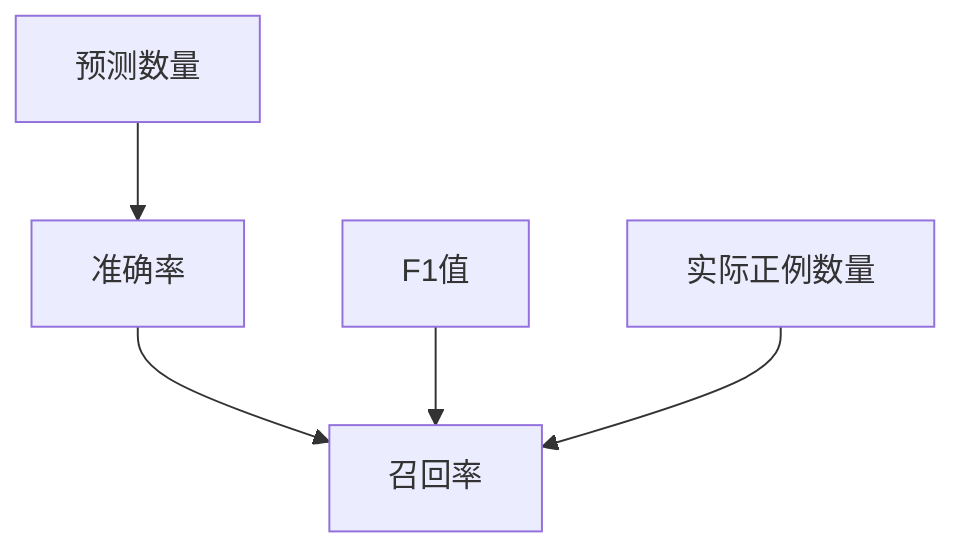
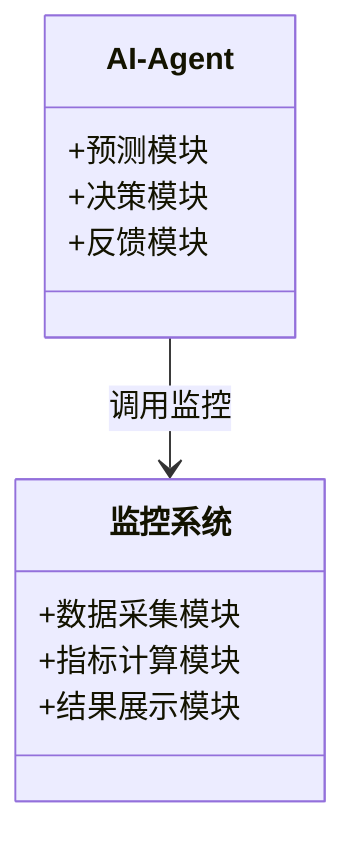
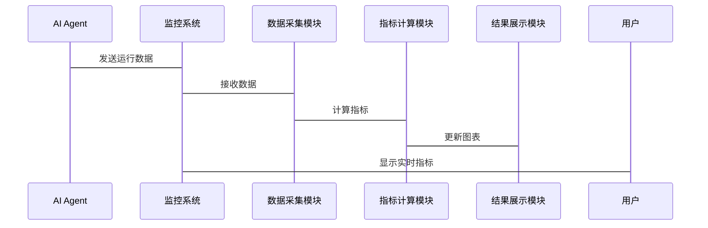

                 


# 监控与优化AI Agent性能的关键指标

---

## 关键词：
AI Agent、性能监控、关键指标、优化策略、系统架构

---

## 摘要：
本文详细探讨了监控与优化AI Agent性能的关键指标，涵盖了从理论到实践的各个方面。通过分析核心概念、算法原理、系统架构及实际案例，本文为读者提供了全面的视角，帮助其理解如何通过关键指标提升AI Agent的性能。从背景介绍到项目实战，文章深入浅出地解析了每个环节，为AI开发者和架构师提供了实用的指导。

---

# 目录大纲：

1. **背景介绍**
   - 1.1 问题背景
     - 1.1.1 AI Agent的定义与特点
     - 1.1.2 AI Agent性能监控的重要性
     - 1.1.3 当前AI Agent性能监控的挑战
   - 1.2 问题描述
     - 1.2.1 AI Agent性能监控的核心目标
     - 1.2.2 监控指标的选择与优化
     - 1.2.3 监控与优化的边界与外延
   - 1.3 问题解决思路
     - 1.3.1 监控指标的选择原则
     - 1.3.2 优化策略的制定
     - 1.3.3 监控与优化的实施步骤
   - 1.4 关键指标的定义与作用
     - 1.4.1 常见监控指标的分类
     - 1.4.2 关键指标的核心定义
     - 1.4.3 监控与优化的意义

2. **核心概念与联系**
   - 2.1 关键指标的原理与特性
     - 2.1.1 准确率、召回率、F1值的计算公式
     - 2.1.2 指标的对比分析
   - 2.2 核心概念的联系
     - 2.2.1 指标之间的关系
     - 2.2.2 实体关系图的构建

3. **算法原理讲解**
   - 3.1 算法的实现步骤
     - 3.1.1 数据预处理
     - 3.1.2 指标计算的算法流程
   - 3.2 算法实现代码
     - 3.2.1 Python代码示例
     - 3.2.2 代码解读与优化
   - 3.3 数学模型与公式
     - 3.3.1 准确率、召回率、F1值的数学表达

4. **系统分析与架构设计**
   - 4.1 系统功能设计
     - 4.1.1 领域模型的构建
     - 4.1.2 系统功能模块
   - 4.2 系统架构设计
     - 4.2.1 模块划分与交互
     - 4.2.2 系统架构图的绘制
   - 4.3 接口设计与交互流程
     - 4.3.1 接口定义
     - 4.3.2 交互流程图的展示

5. **项目实战**
   - 5.1 环境安装与配置
     - 5.1.1 开发环境的选择
     - 5.1.2 工具链的安装
   - 5.2 核心代码实现
     - 5.2.1 代码结构与功能模块
     - 5.2.2 代码实现与优化
   - 5.3 代码解读与分析
     - 5.3.1 代码逻辑的梳理
     - 5.3.2 优化策略的实施
   - 5.4 实际案例分析
     - 5.4.1 案例背景与目标
     - 5.4.2 实施步骤与结果

6. **最佳实践与总结**
   - 6.1 最佳实践
     - 6.1.1 指标选择的建议
     - 6.1.2 优化策略的推荐
   - 6.2 小结
     - 6.2.1 文章总结
     - 6.2.2 未来展望
   - 6.3 注意事项
     - 6.3.1 常见误区
     - 6.3.2 实施中的注意事项
   - 6.4 拓展阅读
     - 6.4.1 相关领域推荐
     - 6.4.2 进阶学习资料

---

# 正文：

## 第一部分：背景介绍

### 1.1 问题背景

#### 1.1.1 AI Agent的定义与特点
AI Agent（人工智能代理）是指能够感知环境并采取行动以实现目标的智能体。AI Agent具有自主性、反应性、目标导向和社会能力等特点，广泛应用于自动驾驶、智能助手、推荐系统等领域。

#### 1.1.2 AI Agent性能监控的重要性
AI Agent的性能直接影响用户体验和系统效率。监控性能指标能够帮助我们及时发现问题，优化系统，提升整体表现。

#### 1.1.3 当前AI Agent性能监控的挑战
随着AI Agent的应用场景越来越复杂，监控和优化其性能面临数据量大、指标多样性、实时性要求高等挑战。

### 1.2 问题描述

#### 1.2.1 AI Agent性能监控的核心目标
通过监控关键指标，识别性能瓶颈，优化系统配置，提升AI Agent的响应速度和准确性。

#### 1.2.2 监控指标的选择与优化
选择合适的指标是监控和优化的基础，需要结合具体应用场景和业务需求。

#### 1.2.3 监控与优化的边界与外延
明确监控的范围和优化的边界，避免资源浪费和过度优化。

### 1.3 问题解决思路

#### 1.3.1 监控指标的选择原则
根据业务需求选择指标，确保指标的全面性和代表性。

#### 1.3.2 优化策略的制定
基于监控数据，制定合理的优化策略，分阶段实施。

#### 1.3.3 监控与优化的实施步骤
从数据采集、指标分析到策略实施，形成闭环的优化流程。

### 1.4 关键指标的定义与作用

#### 1.4.1 常见监控指标的分类
指标可分为性能指标、响应指标、资源指标等，每类指标都有其独特的应用场景。

#### 1.4.2 关键指标的核心定义
准确率、召回率、F1值等是常用的性能指标，用于评估模型的效果。

#### 1.4.3 监控与优化的意义
通过监控关键指标，能够量化系统表现，为优化提供数据支持。

---

## 第二部分：核心概念与联系

### 2.1 关键指标的原理与特性

#### 2.1.1 准确率、召回率、F1值的计算公式
- 准确率：$$\text{准确率} = \frac{\text{正确预测的数量}}{\text{总预测数量}}$$
- 召回率：$$\text{召回率} = \frac{\text{正确预测的正例数量}}{\text{实际正例数量}}$$
- F1值：$$\text{F1} = 2 \times \frac{\text{准确率} \times \text{召回率}}{\text{准确率} + \text{召回率}}$$

#### 2.1.2 指标的对比分析
| 指标 | 定义 | 适用场景 |
|------|------|----------|
| 准确率 | 模型预测的正确比例 | 数据均衡时使用 |
| 召回率 | 模型识别正例的能力 | 正例较少时使用 |
| F1值 | 调和平均数 | 平衡准确率和召回率时使用 |

#### 2.1.3 指标之间的关系
- 当准确率高但召回率低时，说明模型倾向于预测更多负例，可能漏掉部分正例。
- 当F1值较高时，说明准确率和召回率的平衡较好。

### 2.2 核心概念的联系

#### 2.2.1 指标之间的关系
- 准确率和召回率是互补的，F1值综合了两者的优缺点。

#### 2.2.2 实体关系图的构建


---

## 第三部分：算法原理讲解

### 3.1 算法的实现步骤

#### 3.1.1 数据预处理
- 数据清洗：去除噪声数据。
- 数据标准化：统一数据格式。

#### 3.1.2 指标计算的算法流程
1. 预测结果与真实结果对比，统计真阳性（TP）、假阳性（FP）、真阴性（TN）、假阴性（FN）。
2. 计算准确率、召回率、F1值。

### 3.2 算法实现代码

#### 3.2.1 Python代码示例
```python
def calculate_metrics(true_labels, predicted_labels):
    tp = 0
    fp = 0
    fn = 0
    tn = 0
    for true, pred in zip(true_labels, predicted_labels):
        if true == 1 and pred == 1:
            tp += 1
        elif true == 0 and pred == 1:
            fp += 1
        elif true == 1 and pred == 0:
            fn += 1
        elif true == 0 and pred == 0:
            tn += 1
    accuracy = tp + tn / (tp + fp + tn + fn)
    recall = tp / (tp + fn)
    f1 = 2 * (accuracy * recall) / (accuracy + recall)
    return accuracy, recall, f1

true_labels = [1, 0, 1, 1, 0]
predicted_labels = [1, 1, 1, 0, 0]
accuracy, recall, f1 = calculate_metrics(true_labels, predicted_labels)
print(f"Accuracy: {accuracy}, Recall: {recall}, F1: {f1}")
```

#### 3.2.2 代码解读与优化
- 代码通过遍历真实标签和预测标签，计算TP、FP、FN、TN。
- 基于这些值计算准确率、召回率和F1值。
- 优化点：可以结合机器学习库（如scikit-learn）中的函数，提高计算效率。

### 3.3 数学模型与公式

#### 3.3.1 准确率、召回率、F1值的数学表达
- 准确率：$$\text{Precision} = \frac{TP}{TP + FP}$$
- 召回率：$$\text{Recall} = \frac{TP}{TP + FN}$$
- F1值：$$F1 = 2 \times \frac{\text{Precision} \times \text{Recall}}{\text{Precision} + \text{Recall}}$$

---

## 第四部分：系统分析与架构设计

### 4.1 系统功能设计

#### 4.1.1 领域模型的构建


#### 4.1.2 系统功能模块
- 数据采集模块：收集AI Agent的运行数据。
- 指标计算模块：计算并存储关键指标。
- 结果展示模块：以图表形式展示指标数据。

### 4.2 系统架构设计

#### 4.2.1 模块划分与交互
- 数据采集模块与AI Agent交互，获取运行数据。
- 指标计算模块处理数据，生成指标。
- 结果展示模块接收指标数据，展示给用户。

#### 4.2.2 系统架构图的绘制


### 4.3 接口设计与交互流程

#### 4.3.1 接口定义
- 数据采集接口：提供数据采集模块与AI Agent的交互接口。
- 指标查询接口：允许用户查询特定时间段的指标数据。

#### 4.3.2 交互流程图的展示


---

## 第五部分：项目实战

### 5.1 环境安装与配置

#### 5.1.1 开发环境的选择
- 使用Python 3.8及以上版本。
- 安装必要的库：numpy、pandas、scikit-learn、matplotlib。

#### 5.1.2 工具链的安装
```bash
pip install numpy pandas scikit-learn matplotlib
```

### 5.2 核心代码实现

#### 5.2.1 代码结构与功能模块
- 数据采集模块：读取日志文件，提取性能数据。
- 指标计算模块：计算准确率、召回率、F1值。
- 结果展示模块：生成图表，展示指标趋势。

#### 5.2.2 代码实现与优化
```python
import pandas as pd
from sklearn.metrics import accuracy_score, recall_score, f1_score

def load_data(file_path):
    # 加载数据
    data = pd.read_csv(file_path)
    return data

def calculate_metrics(y_true, y_pred):
    # 计算准确率、召回率、F1值
    accuracy = accuracy_score(y_true, y_pred)
    recall = recall_score(y_true, y_pred)
    f1 = f1_score(y_true, y_pred)
    return accuracy, recall, f1

def visualize_metrics(metrics_dict):
    # 生成图表
    import matplotlib.pyplot as plt
    plt.figure(figsize=(10, 6))
    plt.bar(range(3), list(metrics_dict.values()), align='center')
    plt.xticks(range(3), ['Accuracy', 'Recall', 'F1'])
    plt.title('Performance Metrics')
    plt.show()

# 示例使用
data = load_data('performance.csv')
y_true = data['true_labels'].tolist()
y_pred = data['predicted_labels'].tolist()
accuracy, recall, f1 = calculate_metrics(y_true, y_pred)
metrics = {'Accuracy': accuracy, 'Recall': recall, 'F1': f1}
visualize_metrics(metrics)
```

### 5.3 代码解读与分析

#### 5.3.1 代码逻辑的梳理
- `load_data`：加载性能数据，提取真实标签和预测标签。
- `calculate_metrics`：使用scikit-learn库中的函数计算准确率、召回率和F1值。
- `visualize_metrics`：生成柱状图，直观展示指标。

#### 5.3.2 优化策略的实施
- 使用高效的库函数提高计算速度。
- 通过图表可视化，便于分析和发现问题。

### 5.4 实际案例分析

#### 5.4.1 案例背景与目标
分析一个AI Agent在自然语言处理任务中的性能表现。

#### 5.4.2 实施步骤与结果
- 加载数据，计算指标，生成图表，分析结果。
- 根据指标表现，优化模型参数，重新计算指标，验证优化效果。

---

## 第六部分：最佳实践与总结

### 6.1 最佳实践

#### 6.1.1 指标选择的建议
- 根据业务需求选择合适的指标。
- 定期更新指标，适应系统变化。

#### 6.1.2 优化策略的推荐
- 从小范围优化开始，逐步扩展。
- 结合监控数据，制定动态优化策略。

### 6.2 小结

#### 6.2.1 文章总结
监控与优化AI Agent性能的关键在于选择合适的指标，结合系统的实际情况，制定合理的优化策略。

#### 6.2.2 未来展望
随着AI技术的发展，监控和优化指标将更加多样化和智能化，需要持续关注新技术和新方法。

### 6.3 注意事项

#### 6.3.1 常见误区
- 仅关注单个指标，忽视整体表现。
- 过度优化，导致资源浪费。

#### 6.3.2 实施中的注意事项
- 确保数据的准确性和完整性。
- 优化过程中保持监控，及时调整策略。

### 6.4 拓展阅读

#### 6.4.1 相关领域推荐
- 机器学习模型的性能优化。
- 分布式系统的性能监控。

#### 6.4.2 进阶学习资料
- 《机器学习实战》
- 《系统性能优化的艺术》

---

## 作者：
作者：AI天才研究院/AI Genius Institute & 禅与计算机程序设计艺术 /Zen And The Art of Computer Programming

