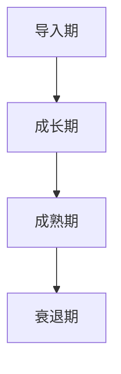
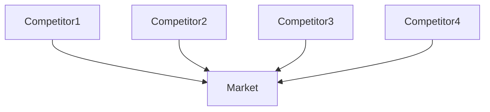
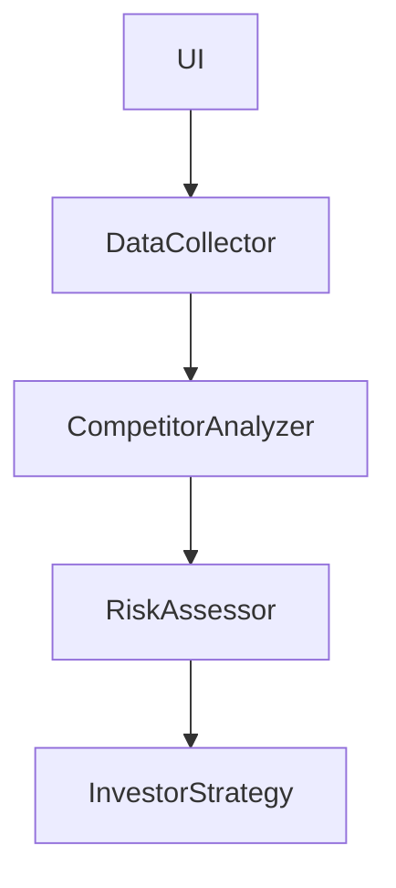
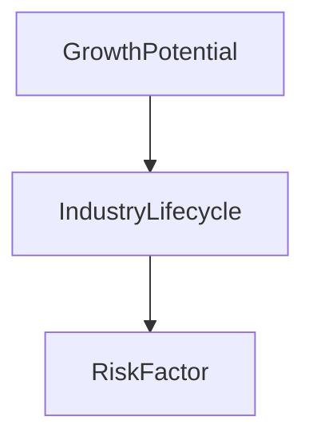
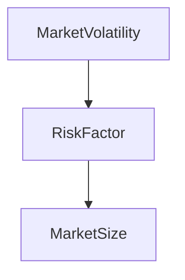
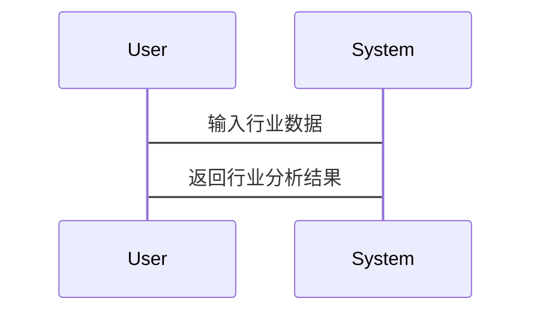
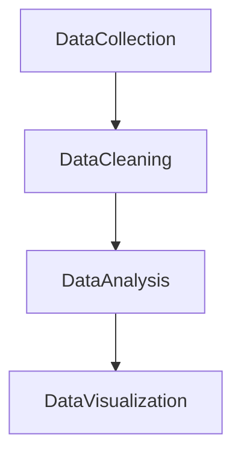

                 


# 费雪的行业研究方法：了解公司的竞争环境

> 关键词：费雪、行业研究、竞争环境、投资分析、数据分析、企业战略  
> 摘要：本文深入探讨了费雪的行业研究方法，分析了如何通过了解公司的竞争环境来评估行业的增长潜力和投资价值。文章从行业生命周期、竞争结构、市场风险等多个维度展开，结合实际案例和数学模型，系统地阐述了费雪方法的核心原理和应用实践。

---

# 引言

## 1.1 行业研究的基本概念

### 1.1.1 行业研究的定义  
行业研究是对特定行业内的市场结构、竞争环境、增长潜力和风险因素进行系统性分析的过程。通过行业研究，投资者和企业能够更好地理解行业的运作规律，从而做出更明智的决策。

### 1.1.2 费雪行业研究方法的核心观点  
费雪的行业研究方法强调从竞争环境的角度出发，分析行业的核心竞争力和潜在风险。这种方法不仅关注行业的当前状况，还注重行业的长期发展趋势。

### 1.1.3 行业研究的意义与价值  
行业研究能够帮助投资者识别高增长行业，评估行业风险，并制定有效的投资策略。对于企业而言，行业研究则有助于制定市场进入策略和竞争优势分析。

---

## 1.2 费雪行业研究方法的演变

### 1.2.1 传统行业研究方法的局限性  
传统行业研究方法往往过于注重行业规模和财务指标，忽视了行业内部的竞争结构和市场动态。

### 1.2.2 费雪方法的创新与突破  
费雪方法将行业研究的核心目标从“描述行业现状”转向“分析行业竞争环境”，并引入了竞争程度、市场进入壁垒等关键指标。

### 1.2.3 费雪方法在投资分析中的应用  
费雪方法在投资分析中得到了广泛应用，尤其是在评估企业的行业地位和竞争优势方面。

---

## 1.3 行业研究的基本框架

### 1.3.1 行业生命周期分析  
行业的生命周期可以分为导入期、成长期、成熟期和衰退期。不同阶段的行业特征和投资策略需要结合具体情况进行调整。

### 1.3.2 行业竞争结构分析  
行业竞争结构包括竞争对手分析、市场集中度评估和市场进入壁垒分析。这些因素共同决定了行业的竞争强度和企业盈利能力。

### 1.3.3 行业风险评估  
行业风险包括宏观经济风险、政策风险和市场风险等。通过系统性分析这些风险，可以更好地评估行业的投资价值。

---

# 第二部分：行业研究的核心要素与框架

## 2.1 行业生命周期分析

### 2.1.1 行业生命周期的定义与阶段划分  
行业的生命周期分为导入期、成长期、成熟期和衰退期。每个阶段的特征和投资策略有所不同。

### 2.1.2 不同阶段的行业特征与投资策略  
- **导入期**：市场需求不足，竞争压力小，企业可以利用先发优势。  
- **成长期**：市场需求快速增长，竞争加剧，企业需要通过创新提高市场份额。  
- **成熟期**：市场需求稳定，竞争格局稳定，企业需要通过成本控制和差异化竞争。  
- **衰退期**：市场需求下降，竞争格局恶化，企业需要考虑退出策略。

### 2.1.3 行业生命周期对竞争环境的影响  
行业生命周期的不同阶段会影响竞争环境的强度和企业的盈利能力。

---

## 2.2 行业竞争结构分析

### 2.2.1 行业集中度分析  
行业集中度可以通过市场份额的集中程度来衡量。高集中度的行业通常竞争压力较小，低集中度的行业则竞争激烈。

### 2.2.2 市场进入壁垒分析  
市场进入壁垒包括技术壁垒、品牌壁垒、资金壁垒等。这些因素会影响新进入者的竞争能力。

### 2.2.3 竞争对手分析框架  
竞争对手分析包括竞争对手的市场份额、产品定位、竞争优势和战略目标等方面。

---

## 2.3 行业竞争环境的数学模型

### 2.3.1 行业竞争强度指数（CCI）  
行业竞争强度指数（Competitive Climate Index，CCI）可以通过以下公式计算：  
$$CCI = \sum_{i=1}^{n} \frac{Market\ Share_i}{n} \times 100$$  
其中，$n$为行业内的主要竞争对手数量。

### 2.3.2 示例：假设某行业有4家主要竞争对手，其市场份额分别为30%、25%、20%和25%。  
$$CCI = \frac{30 + 25 + 20 + 25}{4} \times 100 = 25 \times 100 = 2500$$  
解释：CCI值越高，行业竞争强度越大。

---

## 2.4 行业竞争环境的可视化分析

### 2.4.1 用Mermaid绘制行业生命周期图  


### 2.4.2 用Mermaid绘制行业竞争结构图  


---

## 2.5 行业竞争环境的系统分析

### 2.5.1 问题场景介绍  
假设我们正在分析一个新兴行业，该行业有较高的市场进入壁垒，但市场需求增长迅速。

### 2.5.2 系统功能设计  
- **数据收集模块**：收集行业市场规模、竞争对手市场份额等数据。  
- **竞争分析模块**：计算行业竞争强度指数，分析市场进入壁垒。  
- **风险评估模块**：评估行业风险，并制定投资策略。

### 2.5.3 系统架构设计  


---

## 2.6 项目实战：行业竞争环境分析

### 2.6.1 环境安装  
- 数据来源：公开市场数据、行业报告、财务报表等。  
- 工具：Excel、Python（Pandas、Matplotlib）等。

### 2.6.2 核心实现  
```python
import pandas as pd
import matplotlib.pyplot as plt

# 示例数据：行业市场份额
data = {'Competitor': ['A', 'B', 'C', 'D'],
        'Market Share': [30, 25, 20, 25]}
df = pd.DataFrame(data)

# 计算CCI
cci = (df['Market Share'].sum() / len(df['Market Share'])) * 100
print(f"CCI: {cci}")

# 可视化市场份额分布
df.plot(kind='bar', x='Competitor', y='Market Share')
plt.title('Market Share Distribution')
plt.show()
```

### 2.6.3 代码解读与分析  
- 数据收集：从公开数据源获取行业市场份额数据。  
- 计算CCI：通过公式计算行业竞争强度指数。  
- 可视化：使用Matplotlib绘制市场份额分布图。

---

## 2.7 实际案例分析  
以科技行业为例，分析行业生命周期、竞争结构和市场进入壁垒。通过案例分析，我们可以更好地理解费雪行业研究方法的应用。

---

## 2.8 最佳实践 tips  
- 在进行行业研究时，需要结合定量分析和定性分析，全面评估行业的竞争环境。  
- 数据来源要多样化，包括行业报告、财务报表和市场调研等。  
- 使用数据分析工具提高效率，例如Python、Excel等。

---

## 2.9 小结  
本章详细介绍了费雪行业研究方法的核心要素和框架，包括行业生命周期分析、竞争结构分析和行业风险评估。通过数学模型和实际案例的分析，我们可以更好地理解行业的竞争环境，并制定有效的投资策略。

---

# 第三部分：费雪行业研究方法的数学模型与公式

## 3.1 行业增长潜力评估模型

### 3.1.1 行业增长潜力的计算公式  
$$Growth\ Potential = \frac{Market\ Size}{5} \times Growth\ Rate$$

### 3.1.2 示例：$$Growth\ Potential = \frac{1000}{5} \times 0.1 = 20$$  
解释：增长潜力为20，表示该行业的增长潜力较高。

---

## 3.2 行业风险评估模型

### 3.2.1 风险评估的数学模型  
$$Risk\ Factor = \frac{Market\ Volatility}{Market\ Size} \times 100$$

### 3.2.2 示例：$$Risk\ Factor = \frac{0.2}{1000} \times 100 = 2$$  
解释：风险因子为2，表示行业的风险较低。

---

## 3.3 行业竞争环境的可视化分析

### 3.3.1 用Mermaid绘制行业增长潜力图  


### 3.3.2 用Mermaid绘制行业风险评估图  


---

## 3.4 系统交互设计

### 3.4.1 问题场景介绍  
假设我们正在开发一个行业研究工具，用户需要输入行业数据并进行分析。

### 3.4.2 系统交互流程  


---

## 3.5 项目实战：行业增长潜力分析

### 3.5.1 环境安装  
- 数据来源：行业市场规模和增长率数据。  
- 工具：Python（Pandas、NumPy）。

### 3.5.2 核心实现  
```python
import pandas as pd
import numpy as np

# 示例数据：行业市场规模和增长率
data = {'Market Size': [1000, 2000, 1500, 800],
        'Growth Rate': [0.1, 0.15, 0.08, 0.12]}
df = pd.DataFrame(data)

# 计算增长潜力
df['Growth Potential'] = df['Market Size'] / 5 * df['Growth Rate']
print(df)
```

### 3.5.3 代码解读与分析  
- 数据输入：从数据框中读取行业市场规模和增长率数据。  
- 计算增长潜力：使用公式$$Growth\ Potential = \frac{Market\ Size}{5} \times Growth\ Rate$$进行计算。  
- 输出结果：展示增长潜力分析结果。

---

## 3.6 实际案例分析  
以医疗行业为例，分析行业增长潜力和风险因素。通过案例分析，我们可以更好地理解数学模型的应用。

---

## 3.7 最佳实践 tips  
- 在进行行业研究时，需要结合定量分析和定性分析，全面评估行业的竞争环境。  
- 数据来源要多样化，包括行业报告、财务报表和市场调研等。  
- 使用数据分析工具提高效率，例如Python、Excel等。

---

## 3.8 小结  
本章详细介绍了费雪行业研究方法的数学模型和公式，包括行业增长潜力评估模型和行业风险评估模型。通过实际案例的分析，我们可以更好地理解这些模型的应用，并制定有效的投资策略。

---

# 第四部分：费雪行业研究方法的实际应用

## 4.1 科技行业的竞争环境分析

### 4.1.1 科技行业概述  
科技行业是一个高度竞争的行业，市场需求增长迅速，但市场进入壁垒较高。

### 4.1.2 科技行业的竞争结构  
- 主要竞争对手：苹果、谷歌、微软、亚马逊等。  
- 市场集中度高，竞争强度大。

### 4.1.3 科技行业的增长潜力  
$$Growth\ Potential = \frac{Market\ Size}{5} \times Growth\ Rate = \frac{2000}{5} \times 0.15 = 60$$  
解释：增长潜力为60，表示科技行业的增长潜力较高。

---

## 4.2 医疗行业的竞争环境分析

### 4.2.1 医疗行业概述  
医疗行业是一个需求稳定的行业，市场需求增长缓慢，但市场进入壁垒较高。

### 4.2.2 医疗行业的竞争结构  
- 主要竞争对手：辉瑞、强生、罗氏、默克等。  
- 市场集中度较高，竞争强度一般。

### 4.2.3 医疗行业的增长潜力  
$$Growth\ Potential = \frac{1500}{5} \times 0.08 = 24$$  
解释：增长潜力为24，表示医疗行业的增长潜力较低。

---

## 4.3 消费品行业的竞争环境分析

### 4.3.1 消费品行业概述  
消费品行业是一个需求多样化的行业，市场需求增长稳定，但市场进入壁垒较低。

### 4.3.2 消费品行业的竞争结构  
- 主要竞争对手：可口可乐、百事可乐、宝洁、联合利华等。  
- 市场集中度较低，竞争强度较大。

### 4.3.3 消费品行业的增长潜力  
$$Growth\ Potential = \frac{1000}{5} \times 0.05 = 10$$  
解释：增长潜力为10，表示消费品行业的增长潜力较低。

---

## 4.4 行业竞争环境的总结与比较  
通过对比科技、医疗和消费品行业的竞争环境，我们可以更好地理解不同行业的特点和投资价值。

---

## 4.5 最佳实践 tips  
- 在进行行业研究时，需要结合定量分析和定性分析，全面评估行业的竞争环境。  
- 数据来源要多样化，包括行业报告、财务报表和市场调研等。  
- 使用数据分析工具提高效率，例如Python、Excel等。

---

## 4.6 小结  
本章通过实际案例分析，详细介绍了费雪行业研究方法在科技、医疗和消费品行业的应用。通过对比不同行业的竞争环境，我们可以更好地理解行业的特点和投资价值。

---

# 第五部分：费雪行业研究方法的工具与框架

## 5.1 数据分析工具的选择

### 5.1.1 数据分析工具概述  
常用的数据分析工具包括Excel、Python、R、SPSS等。

### 5.1.2 选择工具的依据  
- 数据量大小：小数据适合Excel，大数据适合Python或R。  
- 分析需求：统计分析适合SPSS，可视化分析适合Excel和Python。

---

## 5.2 数据分析框架的设计

### 5.2.1 数据分析框架概述  
数据分析框架包括数据收集、数据清洗、数据分析和数据可视化四个阶段。

### 5.2.2 数据分析流程图  


---

## 5.3 数据分析的实现

### 5.3.1 数据收集  
- 数据来源：公开市场数据、行业报告、财务报表等。  
- 数据格式：结构化数据和非结构化数据。

### 5.3.2 数据清洗  
- 数据清洗步骤：去重、处理缺失值、异常值处理等。  
- 工具：Python（Pandas库）。

### 5.3.3 数据分析  
- 数据分析方法：统计分析、趋势分析、竞争对手分析等。  
- 工具：Python（NumPy、Pandas库）、Excel函数。

### 5.3.4 数据可视化  
- 数据可视化工具：Matplotlib、Seaborn（Python）、Excel图表。  
- 可视化类型：柱状图、折线图、饼图等。

---

## 5.4 数据分析的实战案例

### 5.4.1 环境安装  
- 数据来源：行业市场份额数据。  
- 工具：Python（Pandas、Matplotlib）。

### 5.4.2 核心实现  
```python
import pandas as pd
import matplotlib.pyplot as plt

# 示例数据：行业市场份额
data = {'Competitor': ['A', 'B', 'C', 'D'],
        'Market Share': [30, 25, 20, 25]}
df = pd.DataFrame(data)

# 数据清洗
df.drop_duplicates(subset=['Competitor'], inplace=True)

# 数据分析
df['Market Share'].describe()

# 数据可视化
df.plot(kind='bar', x='Competitor', y='Market Share')
plt.title('Market Share Distribution')
plt.show()
```

### 5.4.3 代码解读与分析  
- 数据清洗：使用Pandas库的drop_duplicates函数去除重复数据。  
- 数据分析：使用Pandas库的describe方法进行数据描述性分析。  
- 数据可视化：使用Matplotlib绘制柱状图，展示市场份额分布。

---

## 5.5 最佳实践 tips  
- 在进行数据清洗时，需要根据具体数据特点选择合适的清洗方法。  
- 数据分析时，需要结合行业背景和业务需求选择合适的分析方法。  
- 数据可视化时，需要根据数据特点选择合适的可视化类型，确保图表清晰易懂。

---

## 5.6 小结  
本章详细介绍了费雪行业研究方法的工具与框架，包括数据分析工具的选择、数据分析框架的设计和数据分析的实现。通过实际案例的分析，我们可以更好地理解这些工具和框架的应用。

---

# 第六部分：总结与展望

## 6.1 费雪行业研究方法的总结

### 6.1.1 费雪行业研究方法的核心思想  
费雪行业研究方法的核心思想是通过分析行业的竞争环境，评估行业的增长潜力和投资价值。

### 6.1.2 费雪行业研究方法的主要步骤  
1. 确定研究目标与范围  
2. 行业环境分析  
3. 竞争环境分析  
4. 行业增长潜力评估  
5. 行业风险评估  
6. 制定投资策略

---

## 6.2 费雪行业研究方法的展望

### 6.2.1 费雪行业研究方法的未来发展趋势  
随着大数据和人工智能技术的发展，费雪行业研究方法将更加智能化和自动化。

### 6.2.2 费雪行业研究方法的潜在应用领域  
费雪行业研究方法不仅适用于投资分析，还可以应用于企业战略制定、市场进入决策等领域。

---

## 6.3 最佳实践 tips  
- 在进行行业研究时，需要结合定量分析和定性分析，全面评估行业的竞争环境。  
- 数据来源要多样化，包括行业报告、财务报表和市场调研等。  
- 使用数据分析工具提高效率，例如Python、Excel等。

---

## 6.4 小结  
本章总结了费雪行业研究方法的核心思想和主要步骤，并展望了其未来的发展趋势和潜在应用领域。通过全面分析行业的竞争环境，我们可以更好地制定投资策略和企业战略。

---

# 作者：AI天才研究院/AI Genius Institute & 禅与计算机程序设计艺术/Zen And The Art of Computer Programming

