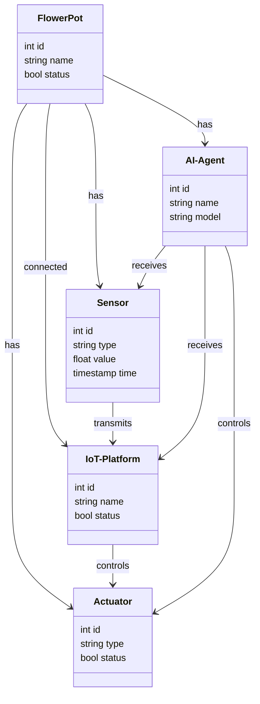
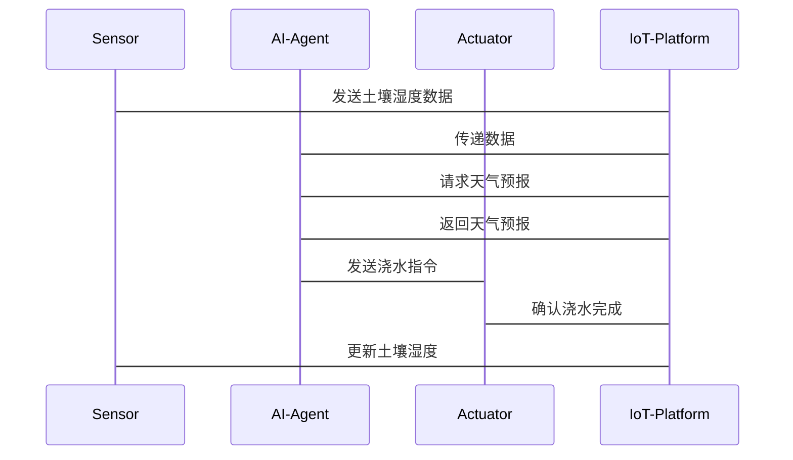

                 


# AI Agent在智能花盆中的自动浇水系统

## 关键词：AI Agent, 智能花盆, 自动浇水系统, 物联网, 决策树算法, 遗传算法, 系统架构设计

## 摘要：本文详细探讨了AI Agent在智能花盆自动浇水系统中的应用，从背景介绍、核心概念、算法原理、系统架构设计到项目实战，全面分析了该系统的实现过程。通过结合物联网技术和AI算法，本文展示了如何利用AI Agent优化浇水策略，实现高效、智能的植物养护。文章还提供了详细的代码实现和案例分析，为读者提供了一套完整的解决方案。

---

# 第1章: 背景介绍

## 1.1 问题背景

### 1.1.1 智能花盆的市场需求
随着城市化进程的加快，越来越多的人生活在有限空间中，智能花盆因其便捷性和高效性，逐渐成为家庭园艺爱好者的首选。然而，传统花盆需要人工浇水，不仅费时费力，还可能导致植物因缺水或过水而死亡。

### 1.1.2 自动浇水系统的必要性
自动浇水系统可以解决人工浇水的不足，但传统的自动浇水系统缺乏智能性，无法根据植物的实际需求调整浇水策略。因此，引入AI Agent，通过智能化决策优化浇水方案，成为智能花盆发展的必然趋势。

### 1.1.3 AI Agent在农业自动化中的作用
AI Agent（智能代理）能够通过传感器数据实时感知环境，结合历史数据和机器学习模型，做出最优决策。在农业自动化中，AI Agent可以显著提高资源利用效率，降低成本，并提升植物生长质量。

## 1.2 问题描述

### 1.2.1 花盆浇水的传统方式及其局限性
传统浇水方式依赖人工操作，存在以下问题：
- **浇水不及时**：无法根据天气、土壤湿度等实时因素调整浇水频率。
- **资源浪费**：过度浇水会导致水资源浪费，同时可能对植物根系造成损害。
- **效率低下**：人工浇水需要大量时间和精力，特别是在大规模种植场景下。

### 1.2.2 智能浇水系统的定义与目标
智能浇水系统是一种基于物联网和AI技术的自动化系统，旨在根据植物的生长需求、环境条件和历史数据，自动调整浇水策略，实现精准浇水。

### 1.2.3 AI Agent在智能浇水系统中的角色
AI Agent在智能浇水系统中扮演决策者的角色，通过整合传感器数据、天气预报和植物生长模型，制定最优的浇水计划，并通过执行器（如水泵）实现自动化浇水。

## 1.3 问题解决

### 1.3.1 AI Agent的核心功能
AI Agent的主要功能包括：
- **数据采集**：接收土壤湿度、天气预报等数据。
- **决策制定**：基于数据，计算出最优的浇水时间和量。
- **指令执行**：向执行器发送浇水指令。

### 1.3.2 自动化浇水系统的实现方式
通过AI Agent、传感器、执行器和物联网平台的协同工作，实现智能化浇水。传感器实时采集数据，AI Agent进行分析和决策，执行器根据决策结果执行浇水操作。

### 1.3.3 AI Agent如何优化浇水策略
AI Agent通过机器学习模型（如决策树）分析历史数据和实时数据，不断优化浇水策略，确保植物生长的最佳条件。

## 1.4 边界与外延

### 1.4.1 系统的边界条件
- 系统仅负责浇水，不涉及施肥或其他养护操作。
- 系统依赖外部传感器和执行器，不包括硬件部分。

### 1.4.2 系统的外延功能
- 扩展至其他智能设备（如智能灯泡、温度调节器）的协同工作。
- 支持多语言界面，方便不同用户的操作。

### 1.4.3 系统与其他智能设备的协同
通过物联网平台，AI Agent可以与其他智能设备（如智能灯泡、空调）协同工作，实现更复杂的植物养护方案。

## 1.5 概念结构与核心要素

### 1.5.1 系统的核心要素
- **传感器**：采集土壤湿度、温度等数据。
- **AI Agent**：分析数据并制定决策。
- **执行器**：根据决策结果执行浇水操作。
- **物联网平台**：负责数据传输和设备管理。

### 1.5.2 要素之间的关系
传感器向AI Agent传输数据，AI Agent通过分析数据向执行器发出指令，执行器完成浇水任务，同时将执行结果反馈给AI Agent，形成闭环。

### 1.5.3 系统的逻辑架构
1. 传感器采集数据并传输至物联网平台。
2. AI Agent从物联网平台获取数据，结合历史数据和机器学习模型，制定浇水策略。
3. AI Agent向执行器发送指令，执行器启动水泵进行浇水。
4. 执行器将浇水结果反馈至物联网平台，供AI Agent优化后续决策。

---

# 第2章: 核心概念与联系

## 2.1 AI Agent的定义与原理

### 2.1.1 AI Agent的基本概念
AI Agent是一种能够感知环境、自主决策并执行任务的智能实体。在智能花盆中，AI Agent负责接收传感器数据，分析植物的水分需求，并通过执行器实现自动浇水。

### 2.1.2 AI Agent的核心原理
AI Agent通过以下步骤实现智能决策：
1. **感知环境**：接收土壤湿度、温度等传感器数据。
2. **分析数据**：利用机器学习模型（如决策树）分析数据。
3. **制定决策**：根据分析结果，决定是否需要浇水及浇水量。
4. **执行决策**：向执行器发送指令，启动浇水程序。

### 2.1.3 AI Agent的分类与特点
AI Agent可以分为简单反射型、基于模型的反应型、目标驱动型和效用驱动型。在智能花盆中，AI Agent属于目标驱动型，其特点是能够根据目标优化浇水策略。

## 2.2 物联网技术在智能花盆中的应用

### 2.2.1 物联网技术的基本概念
物联网（IoT）是指通过各种信息传感设备，按照约定的协议，把任何物品与互联网连接起来，进行信息交换和通信。在智能花盆中，物联网技术主要用于数据采集和设备控制。

### 2.2.2 物联网在智能花盆中的应用场景
- **数据采集**：通过传感器采集土壤湿度、温度、光照强度等数据。
- **数据传输**：通过无线网络将数据传输至云端。
- **设备控制**：通过物联网平台向执行器发送控制指令。

### 2.2.3 物联网技术的核心组件
- **传感器**：如土壤湿度传感器、温度传感器。
- **通信模块**：如Wi-Fi、蓝牙模块。
- **云端平台**：用于存储和处理数据。
- **执行器**：如水泵、LED灯。

## 2.3 AI Agent与物联网的结合

### 2.3.1 AI Agent与物联网的协同工作
物联网为AI Agent提供实时数据，AI Agent通过分析数据制定决策，并通过物联网平台控制执行器。

### 2.3.2 AI Agent在物联网中的作用
AI Agent作为物联网系统的“大脑”，负责数据处理和决策制定，是物联网系统的核心部分。

### 2.3.3 AI Agent与物联网技术的融合
通过深度学习和边缘计算，AI Agent可以更高效地处理数据，提升决策的准确性。

## 2.4 核心概念属性对比

### 2.4.1 AI Agent与传统自动控制系统的对比
| 特性               | AI Agent                 | 传统自动控制系统         |
|--------------------|--------------------------|--------------------------|
| 决策方式           | 基于机器学习模型         | 基于预设规则             |
| 自适应能力         | 强，能够根据数据优化策略   | 弱，无法自适应变化         |
| 扩展性             | 强，支持多种传感器和执行器   | 有限，通常仅支持特定设备     |

### 2.4.2 物联网与AI Agent的对比
| 特性               | 物联网                   | AI Agent                 |
|--------------------|--------------------------|--------------------------|
| 核心功能           | 数据采集与传输           | 数据分析与决策制定       |
| 技术基础           | 传感器、通信技术         | 机器学习、人工智能       |
| 应用场景           | 智能家居、工业物联网     | 智能花盆、自动驾驶等       |

### 2.4.3 智能花盆与其他智能设备的对比
| 特性               | 智能花盆                 | 智能灯泡                 |
|--------------------|--------------------------|--------------------------|
| 核心功能           | 自动浇水                 | 自动调节亮度             |
| 传感器             | 土壤湿度、温度传感器     | 光线传感器               |
| 执行器             | 水泵                     | LED灯                   |

## 2.5 ER实体关系图

```mermaid
erd
    FlowerPot {
        <id, name, status>
    }
    Sensor {
        <id, type, value, timestamp>
    }
    Actuator {
        <id, type, status>
    }
    AI-Agent {
        <id, name, model>
    }
    IoT-Platform {
        <id, name, status>
    }
    relationship: FlowerPot -[has]-> Sensor
    relationship: FlowerPot -[has]-> Actuator
    relationship: FlowerPot -[has]-> AI-Agent
    relationship: FlowerPot -[connected]-> IoT-Platform
    relationship: Sensor ->[transmits]-> IoT-Platform
    relationship: IoT-Platform ->[controls]-> Actuator
    relationship: AI-Agent ->[receives]-> Sensor, IoT-Platform
    relationship: AI-Agent ->[controls]-> Actuator
```

---

# 第3章: 算法原理讲解

## 3.1 决策树算法

### 3.1.1 决策树算法的介绍
决策树是一种基于树结构的预测模型，通过特征分裂的方式将数据划分到不同的叶子节点，最终得到预测结果。

### 3.1.2 决策树算法的流程
1. **选择根节点**：选择具有最大信息增益的特征作为根节点。
2. **分裂节点**：根据特征值将数据集分成多个子集。
3. **递归分裂**：对每个子集重复选择根节点的过程，直到叶子节点满足停止条件。
4. **剪枝优化**：通过剪枝减少过拟合的风险，提升模型的泛化能力。

### 3.1.3 决策树算法的数学模型
信息增益公式：
$$
\text{信息增益} = H(X) - H(X|A)
$$
其中，$H(X)$是数据集的熵，$H(X|A)$是根据特征$A$划分后的熵。

### 3.1.4 决策树算法的实现

```python
class DecisionTree:
    def __init__(self, criterion='gini'):
        self.criterion = criterion
        self.tree = None

    def fit(self, X, y):
        self.tree = self._build_tree(X, y)

    def _build_tree(self, X, y):
        # 计算特征分裂的最优特征
        best_feature = self._select_best_feature(X, y)
        # 创建根节点
        node = {
            'feature': best_feature,
            'value': X[:, best_feature].unique().tolist()[0],
            'children': {}
        }
        # 递归构建子树
        values = y.unique().tolist()
        for value in values:
            subset = X[y == value]
            if len(subset) == 0:
                node['children'][value] = {'leaf': True, 'value': value}
            else:
                node['children'][value] = self._build_tree(subset, y[y == value])
        return node

    def _select_best_feature(self, X, y):
        best_feature = 0
        max_info_gain = 0
        for feature in range(X.shape[1]):
            info_gain = self._calculate_info_gain(X, y, feature)
            if info_gain > max_info_gain:
                max_info_gain = info_gain
                best_feature = feature
        return best_feature

    def _calculate_info_gain(self, X, y, feature):
        # 计算熵
        def entropy(y):
            probs = y.value_counts() / len(y)
            return -sum(probs * np.log2(probs))

        feature_values = X[:, feature].unique()
        total_entropy = entropy(y)
        weighted_avg_entropy = 0
        for value in feature_values:
            subset = y[X[:, feature] == value]
            weighted_avg_entropy += (len(subset) / len(y)) * entropy(subset)
        info_gain = total_entropy - weighted_avg_entropy
        return info_gain

    def predict(self, X):
        def _predict(node, sample):
            if node['leaf']:
                return node['value']
            feature = node['feature']
            value = node['value']
            for key in node['children']:
                if sample[feature] == key:
                    return _predict(node['children'][key], sample)
            return None
        return np.array([_predict(self.tree, sample) for sample in X])
```

### 3.1.5 决策树算法的应用
在智能花盆中，决策树算法可以用于预测最佳浇水时间。通过分析历史浇水数据和植物生长数据，决策树可以建立一个模型，预测在不同环境条件下是否需要浇水。

## 3.2 遗传算法

### 3.2.1 遗传算法的介绍
遗传算法是一种模拟生物进化过程的优化算法，通过自然选择和遗传变异来寻找最优解。

### 3.2.2 遗传算法的流程
1. **初始化种群**：随机生成一组初始解。
2. **计算适应度**：评估每个解的适应度。
3. **选择操作**：选择适应度较高的个体作为父代。
4. **交叉操作**：对父代进行交叉，生成新的个体。
5. **变异操作**：对新个体进行随机变异。
6. **代际更新**：将新个体加入种群，替换适应度较低的个体。
7. **终止条件判断**：若满足终止条件，输出最优解；否则，重复步骤2-7。

### 3.2.3 遗传算法的数学模型
适应度函数：
$$
f(x) = \text{适应度值}
$$
选择概率：
$$
P_i = \frac{f(x_i)}{\sum_{j=1}^{N} f(x_j)}
$$
其中，$N$是种群的大小。

### 3.2.4 遗传算法的实现

```python
import random

def fitness(individual):
    # 计算个体的适应度
    # 例如：计算个体的浇水策略在历史数据中的准确率
    pass

def select_parents(population, fitness_values):
    # 根据适应度选择父代
    total_fitness = sum(fitness_values)
    probabilities = [fv / total_fitness for fv in fitness_values]
    parents = []
    for _ in range(2):
        r = random.uniform(0, 1)
        for i in range(len(probabilities)):
            if r < probabilities[i]:
                parents.append(population[i])
                break
    return parents

def crossover(parent1, parent2):
    # 单点交叉
    crossover_point = random.randint(1, len(parent1)-1)
    child1 = parent1[:crossover_point] + parent2[crossover_point:]
    child2 = parent2[:crossover_point] + parent1[crossover_point:]
    return child1, child2

def mutate(individual):
    # 随机变异
    mutation_point = random.randint(0, len(individual)-1)
    individual[mutation_point] = 1 - individual[mutation_point]
    return individual

def genetic_algorithm(initial_population, fitness_function, generations=100):
    population = initial_population
    for _ in range(generations):
        fitness_values = [fitness_function(individual) for individual in population]
        parents = select_parents(population, fitness_values)
        child1, child2 = crossover(parents[0], parents[1])
        child1 = mutate(child1)
        child2 = mutate(child2)
        new_population = [child1, child2] + [population[i] for i in range(2, len(population))]
        population = new_population
    return population[0]

# 示例：初始种群
initial_population = [
    [1, 0, 1, 0],
    [0, 1, 1, 1],
    [1, 1, 0, 0],
    [0, 0, 1, 1]
]
# 运行遗传算法
best_individual = genetic_algorithm(initial_population, fitness)
```

### 3.2.5 遗传算法的应用
在智能花盆中，遗传算法可以用于优化浇水策略。通过不断迭代，遗传算法可以找到最优的浇水时间间隔和浇水量，从而提高植物的生长效率。

---

# 第4章: 系统分析与架构设计方案

## 4.1 项目介绍

### 4.1.1 项目概述
本项目旨在开发一个基于AI Agent的智能花盆自动浇水系统，通过物联网技术和机器学习算法，实现精准浇水。

## 4.2 系统功能设计

### 4.2.1 领域模型



### 4.2.2 系统架构设计


### 4.2.3 系统接口设计
- **传感器接口**：向AI-Agent发送土壤湿度数据。
- **执行器接口**：接收AI-Agent的浇水指令。
- **物联网平台接口**：负责数据的接收和转发。

### 4.2.4 系统交互流程



## 4.3 系统实现方案

### 4.3.1 系统设计
- **传感器模块**：使用土壤湿度传感器，每隔1小时采集一次数据。
- **AI-Agent模块**：基于决策树算法，分析历史数据，制定浇水策略。
- **执行器模块**：根据AI-Agent的指令启动水泵。

### 4.3.2 系统实现
- **环境安装**：安装Python 3.8及以上版本，安装必要的库（如scikit-learn、paho-mqtt）。
- **核心代码实现**：实现AI-Agent的决策逻辑，集成传感器和执行器。

### 4.3.3 代码应用解读与分析
以下是一个AI-Agent的核心代码示例：

```python
from sklearn.tree import DecisionTreeClassifier
from sklearn.metrics import accuracy_score
import paho.mqtt.client as mqtt

# 初始化AI-Agent
agent = DecisionTreeClassifier()

# 训练模型
X_train = ...  # 特征数据
y_train = ...  # 标签数据
agent.fit(X_train, y_train)

# 连接物联网平台
client = mqtt.Client()
client.connect("localhost", 1883, 60)

# 订阅传感器数据
def on_message(client, userdata, message):
    data = message.payload.decode()
    # 预测是否需要浇水
    prediction = agent.predict([[data]])
    if prediction[0] == 1:
        client.publish("actuator_topic", "start_water_pump")

client.on_message = on_message
client.loop_start()
```

### 4.3.4 案例分析
假设我们有一个花盆，土壤湿度传感器每隔1小时采集一次数据。AI-Agent通过分析历史数据和天气预报，决定是否需要浇水。如果预测结果为“需要浇水”，AI-Agent会向执行器发送指令，启动水泵。

## 4.4 系统优化

### 4.4.1 系统性能优化
- **数据预处理**：对传感器数据进行清洗和归一化处理，提高模型的准确率。
- **模型优化**：使用超参数调优和交叉验证，提升决策树模型的性能。

### 4.4.2 系统安全性优化
- **数据加密**：对传感器数据和指令进行加密传输，防止数据被篡改。
- **访问控制**：限制只有授权的设备才能连接到物联网平台。

### 4.4.3 系统维护建议
- **定期校准传感器**：确保传感器的准确性。
- **更新模型**：定期重新训练模型，适应环境的变化。

---

# 第5章: 项目实战

## 5.1 环境安装

### 5.1.1 安装Python环境
安装Python 3.8及以上版本，并安装必要的库：
```bash
pip install scikit-learn paho-mqtt
```

## 5.2 核心代码实现

### 5.2.1 AI-Agent的核心代码
```python
from sklearn.tree import DecisionTreeClassifier
import paho.mqtt.client as mqtt
import numpy as np

class AI-Agent:
    def __init__(self):
        self.model = DecisionTreeClassifier()

    def train(self, X, y):
        self.model.fit(X, y)

    def predict(self, X):
        return self.model.predict(X)

# 初始化AI-Agent
agent = AI-Agent()
agent.train(X_train, y_train)

# MQTT客户端
client = mqtt.Client()
client.connect("localhost", 1883, 60)

# 订阅传感器数据
def on_message(client, userdata, message):
    data = message.payload.decode()
    X_test = np.array([[float(data)])
    prediction = agent.predict(X_test)
    if prediction[0] == 1:
        client.publish("actuator_topic", "start_water_pump")

client.on_message = on_message
client.loop_start()
```

### 5.2.2 传感器和执行器的代码实现
传感器代码：
```python
import time
import Adafruit_DHT

sensor = Adafruit_DHT.DHT22
gpio = 4
while True:
    humidity, temperature = Adafruit_DHT.read_retry(sensor, gpio)
    print(f"湿度: {humidity}%，温度: {temperature}°C")
    time.sleep(3600)
```

执行器代码：
```python
import RPi.GPIO as GPIO
import time

pump_pin = 17
GPIO.setmode(GPIO.BCM)
GPIO.setup(pump_pin, GPIO.OUT)

def water_plant(duration):
    GPIO.output(pump_pin, GPIO.HIGH)
    time.sleep(duration)
    GPIO.output(pump_pin, GPIO.LOW)

# 接收MQTT指令
def on_message(client, userdata, message):
    if message.topic == "actuator_topic":
        if message.payload.decode() == "start_water_pump":
            water_plant(5)  # 浇水5秒

client.on_message = on_message
client.loop_start()
```

## 5.3 代码应用解读与分析

### 5.3.1 AI-Agent的代码解读
- **模型训练**：使用`DecisionTreeClassifier`训练模型，输入特征数据`X_train`和标签数据`y_train`。
- **预测逻辑**：当接收到传感器数据时，调用`predict`方法进行预测，判断是否需要浇水。

### 5.3.2 传感器代码解读
- **传感器类型**：使用DHT22传感器，每隔1小时采集一次数据。
- **数据输出**：将湿度和温度打印出来，也可以通过MQTT协议发送到物联网平台。

### 5.3.3 执行器代码解读
- **GPIO控制**：使用树莓派的GPIO引脚控制水泵。
- **浇水逻辑**：当接收到“start_water_pump”指令时，启动水泵浇水5秒。

## 5.4 实际案例分析

### 5.4.1 数据采集与分析
假设传感器每隔1小时采集一次数据，记录湿度和温度。AI-Agent通过分析这些数据，预测是否需要浇水。

### 5.4.2 系统运行流程
1. 传感器采集湿度和温度数据。
2. 数据通过MQTT协议发送到物联网平台。
3. AI-Agent接收到数据后，调用决策树模型进行预测。
4. 如果预测结果为“需要浇水”，AI-Agent向执行器发送指令。
5. 执行器启动水泵，开始浇水。
6. 浇水完成后，执行器向物联网平台发送确认消息。

## 5.5 项目小结

### 5.5.1 项目成果
通过本项目，我们实现了基于AI Agent的智能花盆自动浇水系统，能够根据环境条件和植物需求自动调整浇水策略。

### 5.5.2 经验与教训
- **经验**：使用决策树算法能够快速实现分类任务，适合处理离散型问题。
- **教训**：模型的泛化能力有限，需要不断优化和调整。

### 5.5.3 项目总结
本项目展示了AI Agent在农业自动化中的潜力，通过结合物联网技术和机器学习算法，能够显著提升植物养护的效率和质量。

---

# 第6章: 最佳实践

## 6.1 系统性能优化

### 6.1.1 数据预处理
- **数据清洗**：去除异常值和缺失值。
- **特征工程**：提取有意义的特征，如土壤湿度变化率、天气预报数据。

### 6.1.2 模型优化
- **超参数调优**：使用网格搜索（Grid Search）优化决策树模型的参数。
- **集成学习**：尝试使用随机森林（Random Forest）等集成学习方法，提升模型的准确率。

## 6.2 系统安全性优化

### 6.2.1 数据加密
- 在数据传输过程中，使用AES加密算法对数据进行加密，防止数据被篡改。

### 6.2.2 访问控制
- 实施基于角色的访问控制（RBAC），确保只有授权的用户才能访问系统。

### 6.2.3 安全审计
- 定期进行安全审计，发现并修复潜在的安全漏洞。

## 6.3 系统维护建议

### 6.3.1 日常维护
- 定期检查传感器和执行器的连接，确保设备正常运行。
- 定期更新AI-Agent的决策模型，适应环境变化。

### 6.3.2 故障排除
- 如果传感器数据异常，检查传感器和连接线路。
- 如果浇水不正常，检查执行器和控制指令。

## 6.4 小结

### 6.4.1 系统优势
- **智能化**：AI Agent能够根据环境条件和植物需求自动调整浇水策略。
- **高效性**：通过物联网技术实现数据的实时采集和传输，提高系统的响应速度。
- **可扩展性**：系统架构设计灵活，支持扩展到更多的花盆和传感器。

### 6.4.2 系统劣势
- **依赖网络**：物联网平台的稳定性直接影响系统的运行。
- **计算资源**：复杂的决策模型需要较高的计算资源。

### 6.4.3 改进建议
- **边缘计算**：将部分计算任务迁移到边缘设备，减少对云端的依赖。
- **多模型融合**：结合多种算法（如遗传算法和决策树），提升系统的鲁棒性。

## 6.5 注意事项

### 6.5.1 系统稳定性
- 确保物联网平台和传感器的稳定性，避免因设备故障导致系统崩溃。

### 6.5.2 数据隐私
- 保护用户的隐私数据，确保数据不被滥用。

### 6.5.3 环境适应性
- 系统应具备一定的环境适应性，能够应对不同的气候和土壤条件。

## 6.6 拓展阅读

### 6.6.1 推荐书目
- 《机器学习实战》
- 《物联网开发实战》
- 《Python物联网开发》

### 6.6.2 在线资源
- [物联网 tutorial](https://www.iotutorials.com/)
- [机器学习 tutorial](https://www.dataquest.io/)
- [MQTT协议文档](https://mqtt.org/)

### 6.6.3 技术博客
- [AI Agent在农业中的应用](https://example.com/ai-in-agriculture)
- [物联网技术与智能家居](https://example.com/iot-in-smart-home)

---

# 作者：AI天才研究院/AI Genius Institute & 禅与计算机程序设计艺术 /Zen And The Art of Computer Programming

