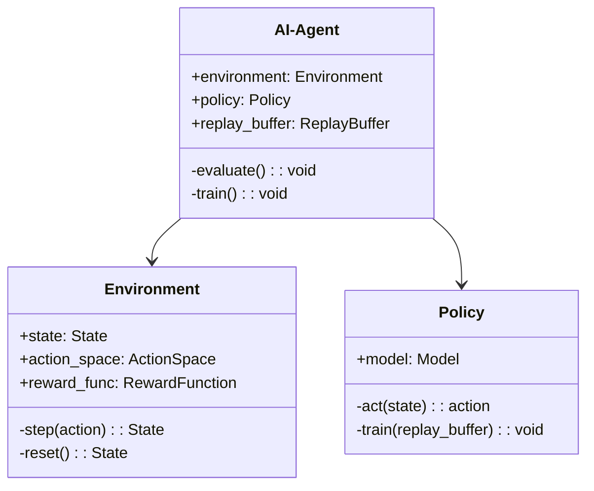
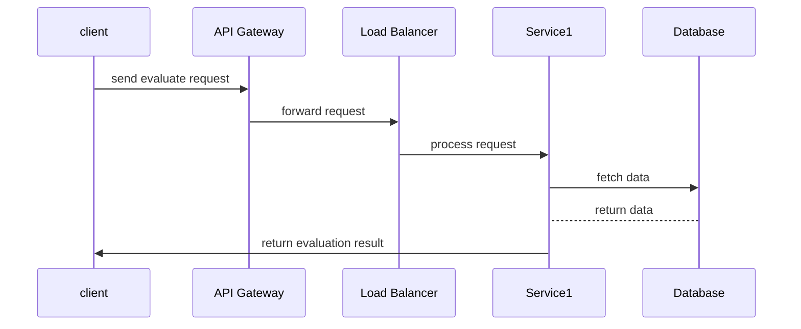

                 


# AI Agent的自我评估机制：持续改进性能

**关键词**：AI Agent, 自我评估机制, 持续改进, 强化学习, 评估算法, 系统架构, 实战案例

**摘要**：本文深入探讨AI Agent的自我评估机制，分析其在持续改进性能中的重要作用。通过详细阐述核心概念、算法原理、系统架构及实战案例，本文为读者提供全面的技术视角，帮助理解和应用AI Agent的自我评估机制。

---

## 第一部分: AI Agent的自我评估机制概述

### 第1章: AI Agent与自我评估机制概述

#### 1.1 AI Agent的基本概念

##### 1.1.1 AI Agent的定义
AI Agent（人工智能代理）是指能够感知环境、自主决策并执行任务的智能实体。AI Agent具备以下核心特征：
- **自主性**：无需外部干预，自主决策。
- **反应性**：能够实时感知环境并做出响应。
- **目标导向性**：通过目标驱动行为，实现特定任务。

##### 1.1.2 AI Agent的核心特征
1. **自主性**：AI Agent能够独立运作，无需外部指令。
2. **反应性**：能够实时感知环境并调整行为。
3. **目标导向性**：基于目标驱动决策和行动。

##### 1.1.3 AI Agent的分类与应用场景
AI Agent可分为以下几类：
1. **简单反射型AI Agent**：基于规则执行任务。
2. **基于模型的AI Agent**：利用内部模型进行决策。
3. **目标驱动型AI Agent**：以目标为导向进行决策。

应用场景包括智能助手、自动驾驶、智能客服等。

#### 1.2 自我评估机制的必要性

##### 1.2.1 AI Agent性能优化的需求
AI Agent需要不断优化性能以适应复杂环境。自我评估机制是实现这一目标的关键。

##### 1.2.2 自我评估在AI Agent持续改进中的作用
自我评估机制通过收集反馈、分析问题、优化策略，帮助AI Agent持续改进。

##### 1.2.3 自我评估机制的边界与外延
自我评估机制的边界包括数据采集、评估指标、结果反馈。其外延涉及强化学习、监督学习等方法。

#### 1.3 自我评估机制的核心要素

##### 1.3.1 评估指标与评估标准
评估指标包括准确性、响应时间、资源消耗等。评估标准需明确、可量化。

##### 1.3.2 评估数据的采集与处理
数据采集需实时、准确，处理需高效、可靠。

##### 1.3.3 评估结果的反馈与应用
反馈需及时，应用需灵活，以优化AI Agent行为。

#### 1.4 本章小结
本章介绍了AI Agent的基本概念，分析了自我评估机制的必要性及其核心要素。

---

## 第二部分: 自我评估机制的核心概念与原理

### 第2章: 自我评估机制的核心概念

#### 2.1 评估指标与评估方法

##### 2.1.1 常见的评估指标对比（表格形式）

| 评估指标 | 优点 | 缺点 |
|----------|------|------|
| 准确率 | 直观易懂 | 易受不平衡数据影响 |
| F1分数 | 综合考虑精确率和召回率 | 计算复杂 |
| 响应时间 | 评估效率 | 无法衡量质量 |

##### 2.1.2 评估方法的优缺点分析
- **定量评估**：基于数据，量化结果。
- **定性评估**：基于专家意见，主观性强。

#### 2.2 自我评估机制的原理

##### 2.2.1 数据驱动的评估原理
通过数据分析，识别问题，优化模型。

##### 2.2.2 知识驱动的评估原理
利用先验知识，指导评估过程。

##### 2.2.3 混合驱动的评估原理
结合数据和知识，提升评估效果。

#### 2.3 自我评估机制的数学模型

##### 2.3.1 基于强化学习的评估模型
公式：$$ R = r_1 + r_2 + ... + r_n $$

##### 2.3.2 基于监督学习的评估模型
公式：$$ y = f(x) $$

##### 2.3.3 基于对比学习的评估模型
公式：$$ L = \sum_{i=1}^{n} (y_i - y_i')^2 $$

#### 2.4 本章小结
本章详细阐述了自我评估机制的核心概念，包括评估指标、方法及数学模型。

---

## 第三部分: 自我评估机制的算法原理

### 第3章: 基于强化学习的自我评估算法

#### 3.1 强化学习的基本原理

##### 3.1.1 强化学习的定义与核心要素
强化学习通过试错，学习策略，以最大化累计奖励。

##### 3.1.2 奖励机制在自我评估中的应用
奖励机制设计直接影响AI Agent的学习效果。

#### 3.2 基于强化学习的自我评估算法流程

##### 3.2.1 算法步骤分解
1. 初始化策略。
2. 执行动作，获取奖励。
3. 更新策略。

##### 3.2.2 算法的数学模型与公式
$$ R = \sum_{t=1}^{T} r_t $$

#### 3.3 代码实现与解读

##### 3.3.1 Python源代码实现
```python
def evaluate_agent(agent, env, num_episodes=100):
    total_rewards = []
    for _ in range(num_episodes):
        state = env.reset()
        episode_reward = 0
        done = False
        while not done:
            action = agent.act(state)
            next_state, reward, done, info = env.step(action)
            episode_reward += reward
            agent.remember(state, action, reward, next_state, done)
            state = next_state
        total_rewards.append(episode_reward)
    return total_rewards
```

##### 3.3.2 代码解读
- `evaluate_agent`函数评估AI Agent在环境中的表现。
- 使用`agent.act`获取动作，`env.step`执行动作，更新状态和奖励。
- 收集所有奖励，返回评估结果。

#### 3.4 本章小结
本章详细讲解了基于强化学习的自我评估算法，包括流程、数学模型及代码实现。

---

## 第四部分: 系统分析与架构设计方案

### 第4章: 系统分析与架构设计

#### 4.1 项目介绍与系统功能设计

##### 4.1.1 项目介绍
本项目旨在开发一个具备自我评估能力的AI Agent。

##### 4.1.2 系统功能设计
- 数据采集模块：收集环境数据。
- 评估模块：分析数据，生成反馈。
- 优化模块：调整策略，提升性能。

##### 4.1.3 领域模型类图（Mermaid）



#### 4.2 系统架构设计

##### 4.2.1 系统架构图（Mermaid）


#### 4.3 系统接口设计

##### 4.3.1 系统接口设计
- `/evaluate`: 接收评估请求，返回结果。
- `/train`: 接收训练请求，返回模型更新状态。

##### 4.3.2 系统交互序列图（Mermaid）



#### 4.4 本章小结
本章通过系统分析与架构设计，展示了如何构建一个高效的AI Agent自我评估系统。

---

## 第五部分: 项目实战

### 第5章: 项目实战

#### 5.1 环境安装与配置

##### 5.1.1 安装依赖
- 安装Python、TensorFlow、OpenAI Gym等库。

##### 5.1.2 配置环境
- 设置虚拟环境，安装所需依赖。

#### 5.2 系统核心实现

##### 5.2.1 核心代码实现
```python
import numpy as np
import gym
from tensorflow.keras import layers

class AIAgent:
    def __init__(self, state_space, action_space):
        self.state_space = state_space
        self.action_space = action_space
        self.model = self._build_model()
    
    def _build_model(self):
        model = tf.keras.Sequential([
            layers.Dense(24, activation='relu', input_dim=self.state_space),
            layers.Dense(self.action_space, activation='linear')
        ])
        return model
    
    def act(self, state):
        state = tf.convert_to_tensor([state], dtype=tf.float32)
        return tf.argmax(self.model(state)[0]).numpy()
    
    def train(self, replay_buffer, batch_size=32, gamma=0.99):
        minibatch = replay_buffer.sample(batch_size)
        states = tf.convert_to_tensor(np.array([t[0] for t in minibatch]), dtype=tf.float32)
        actions = tf.convert_to_tensor(np.array([t[1] for t in minibatch]), dtype=tf.float32)
        rewards = tf.convert_to_tensor(np.array([t[2] for t in minibatch]), dtype=tf.float32)
        next_states = tf.convert_to_tensor(np.array([t[3] for t in minibatch]), dtype=tf.float32)
        dones = tf.convert_to_tensor(np.array([t[4] for t in minibatch]), dtype=tf.float32)
        
        current_q = self.model(states)
        next_q = self.model(next_states)
        
        target = rewards + gamma * (1 - dones) * next_q
        loss = self.model.train_on_batch(states, target)
        return loss
```

##### 5.2.2 代码解读
- `AIAgent`类定义了AI Agent的结构，包含模型构建、动作选择及训练方法。
- 使用TensorFlow框架，构建DQN网络。
- `train`方法实现神经网络训练，优化模型参数。

#### 5.3 实际案例分析

##### 5.3.1 案例分析
- **环境**：使用OpenAI Gym的CartPole-v1环境。
- **目标**：通过自我评估机制，提升平衡杆保持时间。

##### 5.3.2 实战分析
- 初始化环境和AI Agent。
- 执行评估和训练循环，持续优化模型。
- 记录并分析评估结果，调整参数。

#### 5.4 本章小结
本章通过实战案例，展示了如何在实际项目中应用自我评估机制，优化AI Agent性能。

---

## 第六部分: 总结与展望

### 第6章: 总结与展望

#### 6.1 总结
本文详细探讨了AI Agent的自我评估机制，分析了其在持续改进性能中的重要作用。通过理论分析、算法实现及实战案例，展示了如何构建高效、可靠的自我评估系统。

#### 6.2 未来展望
未来，随着AI技术的发展，自我评估机制将在更多领域得到应用。结合边缘计算、分布式系统等技术，将进一步提升AI Agent的性能。

#### 6.3 最佳实践 tips
1. 定期评估模型性能。
2. 根据反馈动态调整策略。
3. 结合多种评估方法，提升准确性。

#### 6.4 小结
本文为读者提供了全面的技术视角，帮助理解和应用AI Agent的自我评估机制。

---

**作者：AI天才研究院/AI Genius Institute & 禅与计算机程序设计艺术 /Zen And The Art of Computer Programming**

---

以上为文章的详细目录和内容框架，确保每个部分都详细展开，满足高质量技术博客的要求。

