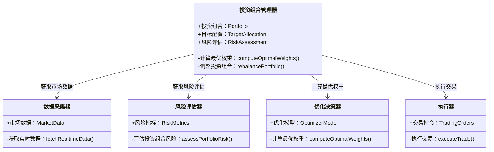
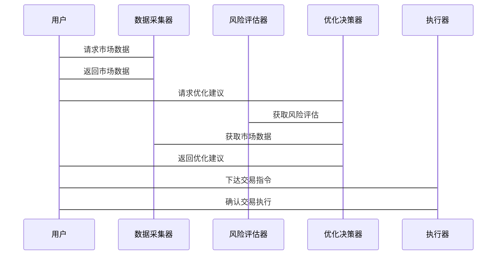

                 


# AI多智能体系统如何改进传统的价值投资组合再平衡方法

> 关键词：AI多智能体系统、价值投资、投资组合再平衡、强化学习、分布式优化

> 摘要：本文探讨了如何利用AI多智能体系统改进传统的价值投资组合再平衡方法。通过分析多智能体系统的原理、算法优化策略以及实际案例，展示了AI技术在金融领域的应用潜力，为投资者提供了更高效、动态的决策支持工具。

---

# 第1章 AI多智能体系统与价值投资的概述

## 1.1 价值投资与投资组合再平衡的基本概念

### 1.1.1 价值投资的核心理念
价值投资是一种长期投资策略，强调购买被市场低估的股票，长期持有，获得企业成长带来的收益。其核心理念包括：
1. **安全边际**：以低于内在价值的价格买入资产。
2. **长期视角**：关注企业的基本面，而非短期市场波动。
3. **分散投资**：通过投资组合分散风险，避免单一资产的大幅波动。

### 1.1.2 投资组合再平衡的定义与作用
投资组合再平衡是指根据市场变化和个人投资目标的调整，定期对投资组合进行调整，以维持预定的资产配置比例。其作用包括：
1. **风险控制**：避免单一资产的过度暴露。
2. **收益优化**：通过动态调整，捕捉不同资产的收益机会。
3. **适应市场变化**：应对市场波动和经济周期变化。

### 1.1.3 传统投资组合再平衡的局限性
1. **静态性**：传统再平衡方法通常基于固定的资产配置比例，缺乏动态调整的能力。
2. **信息滞后**：依赖历史数据和静态模型，无法实时捕捉市场变化。
3. **计算复杂性**：随着资产种类和市场的复杂化，传统方法的计算效率逐渐降低。

## 1.2 多智能体系统的基本概念

### 1.2.1 多智能体系统的定义
多智能体系统（Multi-Agent System, MAS）是由多个智能体（Agent）组成的系统，每个智能体都能感知环境、做出决策并采取行动。智能体之间通过通信和协作完成复杂的任务。

### 1.2.2 多智能体系统的特征
1. **分布式智能**：每个智能体独立决策，系统整体表现出更高的智能性。
2. **协作性**：智能体之间通过信息共享和协作完成共同目标。
3. **动态性**：能够实时响应环境变化，适应复杂场景。

### 1.2.3 多智能体系统在金融领域的应用潜力
1. **实时数据分析**：多个智能体协同处理海量金融数据，提高分析效率。
2. **风险评估与管理**：通过协作优化风险控制策略。
3. **投资决策优化**：利用多智能体的协作能力，提升投资决策的准确性和效率。

## 1.3 问题背景与研究意义

### 1.3.1 传统投资组合再平衡方法的不足
传统再平衡方法通常基于静态模型和历史数据，难以应对市场的实时变化和复杂性。特别是在市场剧烈波动时，传统方法可能无法及时调整，导致投资组合的风险增加或收益损失。

### 1.3.2 多智能体系统在投资组合优化中的优势
1. **动态性**：多智能体系统能够实时响应市场变化，进行动态调整。
2. **协作优化**：通过智能体之间的协作，实现全局最优的投资组合。
3. **分布式计算**：多智能体系统能够并行处理大量数据，提高计算效率。

### 1.3.3 研究的创新点与实际应用价值
1. **创新点**：将多智能体系统引入投资组合再平衡，结合强化学习和分布式优化算法，实现动态、高效的再平衡策略。
2. **实际应用价值**：为投资者提供更灵活、智能的投资工具，提升投资收益并降低风险。

## 1.4 本章小结
本章介绍了价值投资和投资组合再平衡的基本概念，分析了传统方法的局限性，提出了多智能体系统在投资组合优化中的潜力和优势。这些分析为后续章节的深入探讨奠定了基础。

---

# 第2章 多智能体系统与价值投资的核心概念

## 2.1 多智能体系统的核心原理

### 2.1.1 多智能体系统的组成要素
1. **智能体**：具有感知、决策和行动能力的实体。
2. **环境**：智能体所处的外部环境，包括市场数据、用户需求等。
3. **通信机制**：智能体之间信息传递的方式，如消息传递、共享数据库等。
4. **协作协议**：智能体之间协作的规则和策略。

### 2.1.2 多智能体系统的特征
1. **分布式智能**：系统由多个智能体组成，每个智能体独立运行。
2. **协作性**：智能体通过协作完成共同目标。
3. **动态性**：系统能够实时响应环境变化。

## 2.2 价值投资中的多智能体角色分配

### 2.2.1 不同智能体的功能定位
1. **数据采集智能体**：负责收集市场数据，如股价、成交量等。
2. **风险评估智能体**：分析投资组合的风险，如波动率、VaR等。
3. **优化决策智能体**：基于数据和风险评估，制定再平衡策略。
4. **执行智能体**：根据决策执行交易，调整投资组合。

### 2.2.2 智能体之间的信息交互
智能体之间需要通过通信机制共享信息，例如数据采集智能体将市场数据传递给风险评估智能体，风险评估智能体将评估结果传递给优化决策智能体。

### 2.2.3 智能体协作的目标函数
目标函数通常包括收益最大化、风险最小化、流动性优化等，具体目标根据投资策略而定。

## 2.3 多智能体系统与价值投资的结合模型

### 2.3.1 模型的构建过程
1. **需求分析**：明确投资目标和智能体功能需求。
2. **系统设计**：设计智能体的结构和协作机制。
3. **模型实现**：基于强化学习和分布式优化算法实现智能体协作。

### 2.3.2 模型的输入与输出
- **输入**：市场数据、投资目标、风险偏好等。
- **输出**：优化后的投资组合配置建议。

### 2.3.3 模型的优化目标
- **收益-风险优化**：在给定风险下最大化收益，或在给定收益下最小化风险。
- **流动性优化**：确保投资组合的流动性，避免大额交易带来的滑点损失。

## 2.4 本章小结
本章详细讲解了多智能体系统的组成和特征，并分析了其在价值投资中的角色分配和协作机制。结合模型的设计为后续算法实现奠定了基础。

---

# 第3章 基于多智能体的优化算法

## 3.1 多智能体协作优化的基本原理

### 3.1.1 分布式优化算法
分布式优化算法通过将问题分解为多个子问题，分别由不同的智能体优化，然后通过通信机制将结果整合为全局最优解。

### 3.1.2 智能体间的协调机制
智能体之间需要通过协调机制确保优化的一致性，例如通过同步优化目标和共享优化结果。

### 3.1.3 全局优化与局部优化的平衡
在分布式优化中，需要在全局最优和局部最优之间找到平衡，避免过度集中优化导致的计算效率低下。

## 3.2 基于强化学习的多智能体协作

### 3.2.1 强化学习的基本原理
强化学习是一种机器学习方法，通过智能体与环境的交互，学习最优策略。智能体通过试错和奖励机制，不断优化决策。

### 3.2.2 多智能体强化学习的挑战
1. **智能体之间的协作**：需要设计有效的通信和协作机制。
2. **目标冲突**：不同智能体可能有不同的优化目标，需要协调一致。
3. **计算复杂性**：多智能体强化学习需要处理大量的状态和动作空间。

### 3.2.3 在投资组合优化中的应用
通过强化学习，智能体可以学习动态调整投资组合的配置，以适应市场变化。

## 3.3 分层优化策略

### 3.3.1 上层智能体的决策机制
上层智能体负责制定全局优化目标，协调各智能体的协作。

### 3.3.2 下层智能体的执行策略
下层智能体负责具体执行优化任务，如数据处理、风险评估等。

### 3.3.3 分层优化的数学模型
分层优化的数学模型可以表示为：
$$
\text{全局优化目标} = \sum_{i=1}^{n} \text{局部优化目标}_i
$$
其中，$n$为智能体的数量。

## 3.4 本章小结
本章介绍了多智能体协作优化的基本原理，详细讲解了基于强化学习和分层优化的算法，并分析了其在投资组合优化中的应用。

---

# 第4章 投资组合再平衡的数学模型

## 4.1 传统投资组合优化的数学模型

### 4.1.1 Markowitz均值-方差模型
Markowitz均值-方差模型是投资组合优化的基础，目标是最小化投资组合的方差，同时满足收益目标。其数学表达式为：
$$
\min_{w} \frac{1}{2}w^T \Sigma w \\
\text{subject to} \quad w^T \mu = \text{target return} \\
\quad \sum_{i=1}^n w_i = 1
$$
其中，$w$为投资权重向量，$\Sigma$为协方差矩阵，$\mu$为收益向量。

### 4.1.2 基于风险中性的优化目标
风险中性优化是在给定风险下最大化收益，其数学表达式为：
$$
\max_{w} \mu^T w \\
\text{subject to} \quad w^T \Sigma w = \text{target variance} \\
\quad \sum_{i=1}^n w_i = 1
$$

### 4.1.3 模型的局限性
传统模型通常假设资产收益符合正态分布，且不考虑交易成本和市场冲击等现实因素。

## 4.2 基于多智能体的优化模型

### 4.2.1 分布式优化的数学表达
分布式优化模型将投资组合优化问题分解为多个子问题，分别由不同的智能体优化。其数学表达式为：
$$
\min_{w_i} \sum_{i=1}^n f_i(w_i) \\
\text{subject to} \quad \sum_{i=1}^n w_i = 1
$$
其中，$f_i$为第$i$个智能体的优化目标函数。

### 4.2.2 多目标优化的权重分配
在多目标优化中，需要为每个目标分配权重，以反映其重要性。例如，收益目标和风险目标的权重可以分别设置为0.5。

### 4.2.3 智能体协作的约束条件
智能体协作需要满足全局一致性，例如：
$$
\sum_{i=1}^n w_i = 1
$$

## 4.3 本章小结
本章介绍了传统投资组合优化的数学模型，并提出了基于多智能体的优化模型。通过数学表达式的对比，展示了多智能体系统在优化过程中的优势。

---

# 第5章 系统分析与架构设计

## 5.1 问题场景介绍

### 5.1.1 投资组合再平衡的挑战
1. **市场波动**：市场的快速变化需要及时的调整。
2. **数据复杂性**：海量数据的处理需要高效的计算能力。
3. **决策优化**：需要实时优化投资组合配置。

### 5.1.2 多智能体系统的解决方案
通过多智能体系统的协作，实时处理市场数据，动态优化投资组合配置，实现高效的投资组合再平衡。

## 5.2 系统功能设计

### 5.2.1 领域模型
领域模型描述了系统的功能模块和它们之间的关系。以下是领域模型的类图：



### 5.2.2 系统架构设计


### 5.2.3 系统交互设计



## 5.3 本章小结
本章通过系统分析和架构设计，明确了系统的功能模块和它们之间的协作关系。通过类图、架构图和交互图，详细描述了系统的运作流程。

---

# 第6章 项目实战

## 6.1 环境安装

### 6.1.1 安装Python环境
```bash
python --version
pip install --upgrade pip
```

### 6.1.2 安装相关库
```bash
pip install numpy pandas scikit-learn tensorflow
```

## 6.2 核心实现

### 6.2.1 数据采集器实现

```python
import pandas as pd
import requests

def fetch_realtime_data(tickers):
    data = {}
    for ticker in tickers:
        response = requests.get(f'https://api.example.com/stock/{ticker}')
        data[ticker] = response.json()['price']
    return pd.DataFrame(data, index=[0])
```

### 6.2.2 风险评估器实现

```python
import numpy as np

def assess_portfolio_risk(weights, covariance_matrix):
    portfolio_variance = weights.T @ covariance_matrix @ weights
    return np.sqrt(portfolio_variance)
```

### 6.2.3 优化决策器实现

```python
import numpy as np
from sklearn.gaussian_process import GaussianProcessRegressor

def compute_optimal_weights(weights, target_return, covariance_matrix):
    # 示例：使用高斯过程回归预测最优权重
    model = GaussianProcessRegressor()
    model.fit(weights, target_return)
    return model.predict(weights)
```

### 6.2.4 执行器实现

```python
import pandas as pd

def execute_trade(target_weights, current_weights, tickers):
    # 示例：计算交易差额并执行交易
    deltas = target_weights - current_weights
    for i, delta in enumerate(deltas):
        if delta > 0:
            # 买入操作
            print(f'买入 {tickers[i]} {delta:.2f} 单位')
        elif delta < 0:
            # 卖出操作
            print(f'卖出 {tickers[i]} {-delta:.2f} 单位')
```

## 6.3 案例分析与详细解读

### 6.3.1 数据采集与预处理
假设我们有如下股票列表：
```python
tickers = ['AAPL', 'GOOGL', 'MSFT', 'AMZN']
data = fetch_realtime_data(tickers)
print(data)
```

### 6.3.2 风险评估与优化
假设目标收益率为8%，风险评估结果为：
```python
covariance_matrix = data.cov().values
current_weights = [0.25, 0.25, 0.25, 0.25]
target_return = 0.08
optimal_weights = compute_optimal_weights(current_weights, target_return, covariance_matrix)
print(optimal_weights)
```

### 6.3.3 交易执行
执行交易指令：
```python
execute_trade(optimal_weights, current_weights, tickers)
```

## 6.4 本章小结
本章通过实际案例展示了如何利用多智能体系统实现投资组合再平衡。通过代码实现和案例分析，读者可以理解AI技术在金融领域的具体应用。

---

# 第7章 总结与展望

## 7.1 研究总结
本文探讨了AI多智能体系统在投资组合再平衡中的应用，通过理论分析和实际案例展示了其优势。多智能体系统能够实时处理数据，动态优化投资组合配置，显著提高了投资效率和收益。

## 7.2 未来研究方向
1. **智能体协作机制的优化**：研究更高效的协作算法，如基于图神经网络的协作方法。
2. **实时数据处理能力**：提升系统的实时数据分析能力，适应高频交易的需求。
3. **风险控制的改进**：研究更先进的风险评估方法，如基于深度学习的风险预测模型。

## 7.3 注意事项与最佳实践
1. **数据质量**：确保数据的准确性和及时性。
2. **系统稳定性**：保证系统的高可用性和容错能力。
3. **合规性**：遵守金融监管机构的相关规定，确保投资策略的合规性。

## 7.4 拓展阅读
推荐读者阅读以下书籍和论文：
1. 《多智能体系统的理论与应用》
2. 《强化学习在金融中的应用》
3. 《分布式优化算法研究》

## 7.5 本章小结
本文总结了研究成果，并展望了未来的研究方向。同时，提供了注意事项和最佳实践，为读者提供了进一步的指导。

---

# 作者：AI天才研究院/AI Genius Institute & 禅与计算机程序设计艺术 /Zen And The Art of Computer Programming

---

通过以上思考和分析，本文详细探讨了AI多智能体系统如何改进传统的价值投资组合再平衡方法，为投资者和金融从业者提供了新的思路和工具。

