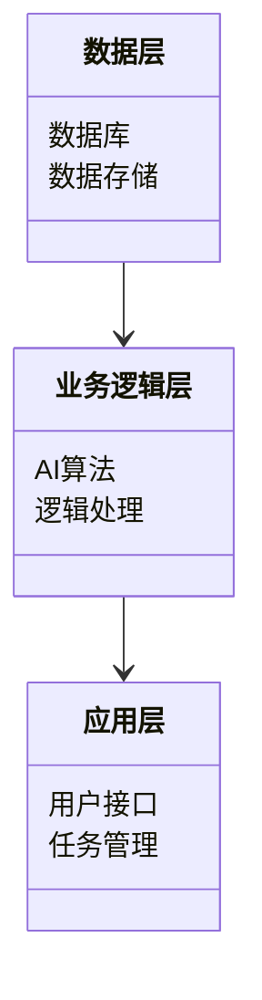
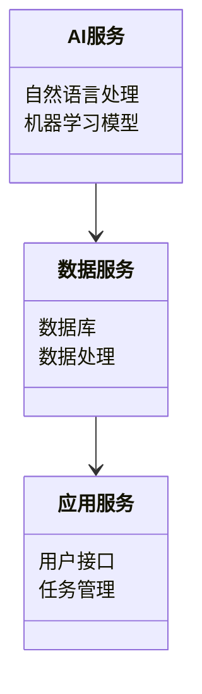
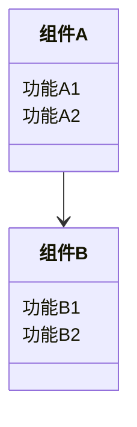
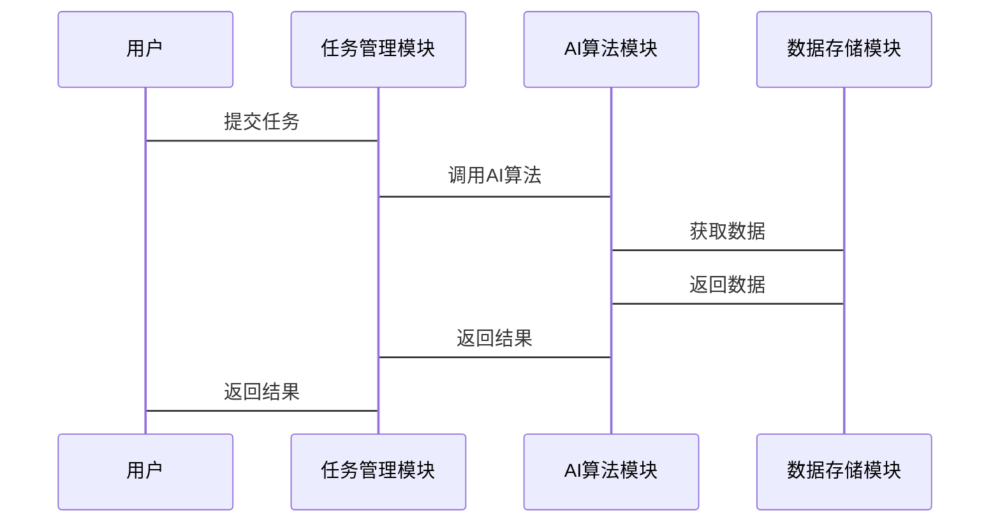

                 


# 企业级AI Agent的可扩展性设计

> 关键词：企业级AI Agent, 可扩展性设计, 系统架构, AI算法, 项目实战

> 摘要：  
本文深入探讨了企业级AI Agent的可扩展性设计的核心概念、设计原则、系统架构和实际项目实现。通过分析AI Agent的扩展性设计模型、系统架构设计、算法原理和项目实战，为读者提供了一套完整的可扩展性设计方案，帮助企业在实际应用中实现高效的AI Agent系统设计。

---

## 第一章: 企业级AI Agent的背景与概念

### 1.1 AI Agent的基本概念

#### 1.1.1 AI Agent的定义
AI Agent（人工智能代理）是一种能够感知环境、自主决策并执行任务的智能实体。它通过传感器获取信息，利用算法进行分析和推理，并通过执行器与环境交互。

#### 1.1.2 企业级AI Agent的特点
- **智能化**：基于AI算法，能够进行自主决策。
- **可扩展性**：支持大规模数据处理和多任务并行执行。
- **高可靠性**：在企业级系统中，必须保证高可用性和稳定性。

#### 1.1.3 企业级AI Agent的应用场景
- **企业自动化**：如自动处理订单、库存管理。
- **智能客服**：通过自然语言处理提供智能咨询服务。
- **决策支持**：基于大数据分析提供决策支持。

### 1.2 可扩展性设计的背景

#### 1.2.1 企业级系统的特点
- **高并发**：需要处理大量的请求。
- **强一致性**：数据必须保证一致性和准确性。
- **可扩展性**：系统需要支持业务的快速增长。

#### 1.2.2 AI Agent在企业级系统中的扩展需求
- **任务扩展**：支持多种类型的任务。
- **数据扩展**：能够处理不同类型和规模的数据。
- **性能扩展**：在高负载下保持系统性能稳定。

#### 1.2.3 企业级AI Agent的可扩展性挑战
- **系统架构设计**：如何设计高效的系统架构。
- **组件通信**：如何实现组件之间的高效通信。
- **资源分配**：如何优化资源分配以提高系统性能。

### 1.3 本章小结
本章从AI Agent的基本概念出发，介绍了企业级AI Agent的特点和应用场景，并分析了可扩展性设计的背景和挑战。

---

## 第二章: 企业级AI Agent的可扩展性核心概念

### 2.1 可扩展性的定义与分类

#### 2.1.1 可扩展性的定义
可扩展性是指系统在面对负载增加时，能够通过增加资源或重新分配任务来保持性能的能力。

#### 2.1.2 可扩展性的分类
- **水平扩展**：通过增加服务器的数量来提高系统处理能力。
- **垂直扩展**：通过升级单台服务器的性能来提高系统处理能力。
- **混合扩展**：结合水平和垂直扩展的策略。

#### 2.1.3 企业级AI Agent的可扩展性特点
- **模块化**：系统分为多个模块，每个模块独立运行。
- **可扩展性接口**：系统提供标准接口，支持模块的动态扩展。
- **高可用性**：系统在扩展过程中保持高可用性。

### 2.2 AI Agent的扩展性设计原则

#### 2.2.1 模块化设计
将系统划分为多个模块，每个模块负责特定的功能，模块之间通过接口通信。

#### 2.2.2 分层设计
将系统分为多个层次，每一层负责不同的功能，如数据层、逻辑层、应用层。

#### 2.2.3 组件化设计
将系统功能封装成可复用的组件，通过组件之间的协作实现系统功能。

### 2.3 可扩展性设计的关键要素

#### 2.3.1 系统架构设计
- **分层架构**：将系统分为数据层、业务逻辑层和应用层。
- **微服务架构**：将系统功能分解成多个独立的服务。

#### 2.3.2 接口设计
- **标准化接口**：定义统一的接口规范，支持不同模块之间的通信。
- **可扩展接口**：接口设计支持模块的动态扩展。

#### 2.3.3 组件间的通信机制
- **消息队列**：通过消息队列实现组件之间的异步通信。
- **RPC调用**：通过远程过程调用实现组件之间的同步通信。

### 2.4 本章小结
本章详细介绍了企业级AI Agent的可扩展性核心概念，包括可扩展性的定义、分类、设计原则和关键要素。

---

## 第三章: 企业级AI Agent的可扩展性设计原理

### 3.1 可扩展性设计的原理概述

#### 3.1.1 可扩展性的实现机制
- **负载均衡**：通过负载均衡算法分配任务到不同的节点。
- **资源分配**：动态分配资源以适应负载变化。
- **容错机制**：通过冗余设计和故障恢复机制保证系统可靠性。

#### 3.1.2 可扩展性与系统性能的关系
- **系统吞吐量**：可扩展性设计能够提高系统的吞吐量。
- **响应时间**：可扩展性设计能够在高负载下保持较低的响应时间。

#### 3.1.3 可扩展性与系统稳定性的平衡
- **稳定性**：可扩展性设计需要在扩展性和稳定性之间找到平衡点。
- **系统容错**：通过冗余设计和故障恢复机制保证系统稳定性。

### 3.2 AI Agent的扩展性设计模型

#### 3.2.1 模块化扩展模型
- **模块划分**：将系统功能划分为多个模块，每个模块独立运行。
- **模块通信**：模块之间通过接口进行通信，实现功能协作。

#### 3.2.2 分层扩展模型
- **分层设计**：将系统分为数据层、业务逻辑层和应用层。
- **层次扩展**：在每一层内部进行扩展，提高系统的整体性能。

#### 3.2.3 组件化扩展模型
- **组件封装**：将系统功能封装成可复用的组件。
- **组件协作**：通过组件之间的协作实现系统功能。

### 3.3 可扩展性设计的数学模型

#### 3.3.1 系统扩展性评估公式
$$ \text{系统扩展性} = \frac{\text{系统吞吐量}}{\text{系统资源消耗}} $$

#### 3.3.2 扩展性与系统负载的关系
$$ \text{系统吞吐量} = \text{系统资源} \times \text{扩展性} $$

#### 3.3.3 扩展性与系统响应时间的关系
$$ \text{响应时间} = \frac{\text{系统负载}}{\text{系统扩展性}} $$

### 3.4 本章小结
本章从原理上分析了企业级AI Agent的可扩展性设计，包括实现机制、设计模型和数学模型。

---

## 第四章: 企业级AI Agent的系统架构设计

### 4.1 系统架构设计概述

#### 4.1.1 系统架构设计的原则
- **模块化设计**：系统功能划分为多个模块。
- **可扩展性设计**：系统架构支持模块的动态扩展。
- **高可用性设计**：系统架构保证高可用性。

#### 4.1.2 系统架构设计的方法
- **分层设计法**：将系统分为数据层、业务逻辑层和应用层。
- **微服务设计法**：将系统功能分解成多个独立的服务。

### 4.2 企业级AI Agent的架构模型

#### 4.2.1 分层架构模型


#### 4.2.2 微服务架构模型


#### 4.2.3 组件化架构模型


### 4.3 系统架构设计的实现

#### 4.3.1 模块划分
- **数据层**：负责数据的存储和检索。
- **业务逻辑层**：负责业务逻辑的处理和AI算法的实现。
- **应用层**：负责与用户交互和任务管理。

#### 4.3.2 接口定义
- **数据层接口**：定义数据存储和检索的接口。
- **业务逻辑层接口**：定义AI算法和逻辑处理的接口。
- **应用层接口**：定义用户接口和任务管理的接口。

#### 4.3.3 组件间的通信机制
- **消息队列**：通过消息队列实现组件之间的异步通信。
- **RPC调用**：通过远程过程调用实现组件之间的同步通信。

### 4.4 系统架构设计的优化

#### 4.4.1 系统性能优化
- **负载均衡**：通过负载均衡算法分配任务到不同的节点。
- **缓存优化**：通过缓存技术减少数据访问的延迟。

#### 4.4.2 系统安全性优化
- **权限控制**：通过权限控制保证系统的安全性。
- **加密技术**：通过加密技术保证数据的安全性。

#### 4.4.3 系统可维护性优化
- **模块化设计**：通过模块化设计提高系统的可维护性。
- **日志管理**：通过日志管理方便系统调试和维护。

### 4.5 本章小结
本章详细介绍了企业级AI Agent的系统架构设计，包括架构模型、实现和优化。

---

## 第五章: 企业级AI Agent的项目实战

### 5.1 项目介绍

#### 5.1.1 项目背景
- **项目名称**：企业级AI Agent系统。
- **项目目标**：实现一个可扩展的企业级AI Agent系统，支持多种任务和高并发请求。

#### 5.1.2 项目需求
- **功能需求**：支持多种任务类型，如自然语言处理、机器学习推理。
- **性能需求**：支持高并发请求，系统响应时间小于1秒。
- **扩展性需求**：支持任务的动态扩展和系统的水平扩展。

### 5.2 系统功能设计

#### 5.2.1 系统功能模块
- **任务管理模块**：负责任务的分派和监控。
- **AI算法模块**：负责自然语言处理和机器学习推理。
- **数据存储模块**：负责数据的存储和检索。

#### 5.2.2 系统功能流程


### 5.3 系统实现

#### 5.3.1 环境安装
- **操作系统**：Linux
- **编程语言**：Python
- **框架**：Django
- **数据库**：MySQL
- **消息队列**：RabbitMQ

#### 5.3.2 核心实现代码

```python
# 任务管理模块
from django.http import JsonResponse
import requests

def submit_task(request):
    task_type = request.POST.get('task_type')
    task_data = request.POST.get('task_data')
    # 提交任务到AI算法模块
    response = requests.post('http://ai_module:8000/process_task', 
                            json={'task_type': task_type, 'task_data': task_data})
    return JsonResponse({'status': 'success', 'message': '任务已提交'})

# AI算法模块
from django.http import JsonResponse
import rabbitmq

def process_task(request):
    task_type = request.json.get('task_type')
    task_data = request.json.get('task_data')
    # 处理任务
    result = ai_algorithm(task_type, task_data)
    # 发送结果到任务管理模块
    rabbitmq.publish_result(result)
    return JsonResponse({'status': 'success', 'message': '任务处理完成'})

# 数据存储模块
from django.http import JsonResponse
import mysql.connector

def store_data(request):
    data = request.json.get('data')
    # 存储数据到数据库
    cursor = mysql.connector.cursor()
    cursor.execute("INSERT INTO data_table (data) VALUES (%s)", (data,))
    cursor.close()
    return JsonResponse({'status': 'success', 'message': '数据已存储'})
```

#### 5.3.3 代码解读与分析
- **任务管理模块**：负责接收用户的任务请求，并提交到AI算法模块。
- **AI算法模块**：负责处理具体的AI算法任务，并将结果发送到任务管理模块。
- **数据存储模块**：负责存储和检索数据。

### 5.4 项目小结
本章通过一个实际的项目案例，详细介绍了企业级AI Agent系统的实现过程，包括环境安装、核心实现和代码解读。

---

## 第六章: 企业级AI Agent的总结与展望

### 6.1 本章总结
本文详细探讨了企业级AI Agent的可扩展性设计的核心概念、设计原则、系统架构和实际项目实现。通过分析AI Agent的扩展性设计模型、系统架构设计、算法原理和项目实战，为读者提供了一套完整的可扩展性设计方案。

### 6.2 未来展望
随着人工智能技术的不断发展，企业级AI Agent的可扩展性设计将更加重要。未来的研究方向包括：
- **更高效的扩展性设计**：进一步优化系统架构和算法，提高系统的扩展性。
- **更智能的AI算法**：研究更先进的AI算法，提高系统的智能性和决策能力。
- **更安全的系统设计**：研究更安全的系统设计，保证系统的安全性。

### 6.3 注意事项
- **系统维护**：定期维护系统，确保系统的稳定性和可靠性。
- **性能优化**：根据系统运行情况，不断优化系统的性能。
- **安全性保障**：加强系统的安全性设计，防止数据泄露和攻击。

### 6.4 拓展阅读
- **相关书籍**：《企业级系统设计》、《人工智能算法》。
- **技术博客**：推荐一些优秀的技术博客，供读者进一步学习。

---

## 作者：AI天才研究院/AI Genius Institute & 禅与计算机程序设计艺术 /Zen And The Art of Computer Programming

---

通过以上内容，我们全面分析了企业级AI Agent的可扩展性设计，从理论到实践，为读者提供了一套完整的解决方案。希望本文对读者在企业级AI Agent的可扩展性设计方面有所帮助。

