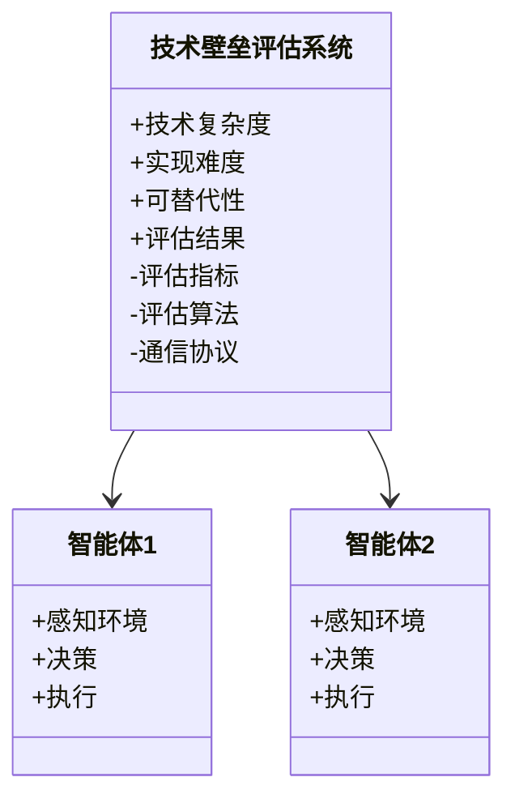
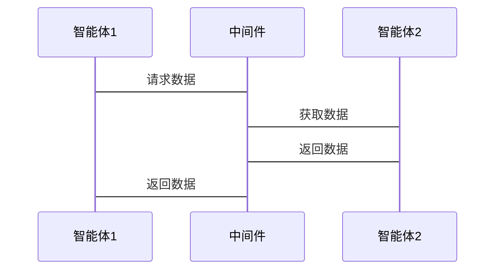

                 


# 多智能体系统在评估公司技术壁垒中的应用

> 关键词：多智能体系统，技术壁垒，博弈论，分布式计算，协同决策

> 摘要：本文探讨了多智能体系统（MAS）在评估公司技术壁垒中的应用。通过分析技术壁垒评估的核心问题，结合多智能体系统的原理与算法，提出了一种基于多智能体协同的解决方案。本文从背景、原理、应用、算法、系统架构到项目实战，全面阐述了多智能体系统在技术壁垒评估中的价值与实现方法。

---

# 第一部分：多智能体系统与技术壁垒评估背景

# 第1章：多智能体系统与技术壁垒评估概述

## 1.1 多智能体系统的基本概念

### 1.1.1 多智能体系统（MAS）的定义

多智能体系统（Multi-Agent System, MAS）是由多个智能体（Agent）组成的复杂系统，这些智能体能够自主决策、协作交互，并共同完成特定任务。智能体可以是软件程序、算法模型，也可以是物理设备。

$$
\text{MAS} = \{A_1, A_2, \ldots, A_n\}, \text{其中 } A_i \text{ 是智能体}
$$

### 1.1.2 多智能体系统的特征

| 特性 | 描述 |
|------|------|
| 分布式 | 智能体独立运行，通过通信协作完成任务 |
| 协作性 | 智能体之间通过共享信息协同决策 |
| 动态性 | 系统环境动态变化，智能体需实时调整策略 |

### 1.1.3 多智能体系统与单智能体系统的区别

| 对比维度 | 单智能体系统 | 多智能体系统 |
|----------|--------------|--------------|
| 决策中心 | 单一决策中心 | 分布式决策中心 |
| 信息共享 | 信息集中管理 | 信息分布式共享 |
| 系统复杂度 | 系统相对简单 | 系统高度复杂 |

## 1.2 技术壁垒评估的定义与意义

### 1.2.1 技术壁垒的定义

技术壁垒是指公司在技术上的优势或独特性，使得竞争对手难以在短时间内复制或超越。它通常体现在技术复杂度、实现难度和可替代性等方面。

### 1.2.2 技术壁垒评估的重要性

1. 评估公司核心竞争力
2. 为技术创新提供方向
3. 为投资决策提供依据
4. 为防御性策略提供支持

### 1.2.3 技术壁垒评估的常见方法

1. 技术复杂度评估
2. 技术实现难度分析
3. 技术可替代性评估

## 1.3 多智能体系统在技术壁垒评估中的应用价值

### 1.3.1 多智能体系统的优势

1. 分布式计算能力
2. 多维度信息分析
3. 动态环境适应性

### 1.3.2 技术壁垒评估中的关键问题

1. 信息分散与整合
2. 多维度评估指标
3. 动态环境下的评估调整

### 1.3.3 多智能体系统如何解决这些问题

1. 分布式信息采集与整合
2. 多维度协同评估
3. 动态调整评估策略

## 1.4 本章小结

本章介绍了多智能体系统的基本概念和特征，阐述了技术壁垒评估的意义和常见方法，并探讨了多智能体系统在技术壁垒评估中的应用价值。

---

# 第二部分：多智能体系统的核心概念与原理

# 第2章：多智能体系统的原理与架构

## 2.1 多智能体系统的组成结构

### 2.1.1 智能体的定义与分类

智能体（Agent）是一种能够感知环境、自主决策并执行任务的实体。根据智能体的类型，可以分为：

1. **简单反射型智能体**：基于当前感知做出反应
2. **基于模型的反射型智能体**：基于内部模型和当前感知做出反应
3. **目标驱动型智能体**：基于目标驱动决策
4. **效用驱动型智能体**：基于效用函数优化决策

### 2.1.2 智能体之间的交互方式

智能体之间的交互可以通过以下方式进行：

1. **直接通信**：智能体之间通过共享信息或直接交换数据
2. **间接通信**：通过中间媒介（如数据库或消息队列）进行信息交换
3. **协同决策**：智能体共同制定决策方案

### 2.1.3 多智能体系统的层次结构

多智能体系统的层次结构可以分为：

1. **个体层**：单个智能体的决策与行为
2. **群体层**：多个智能体的协同与协作
3. **系统层**：整体系统的组织与管理

## 2.2 多智能体系统的通信与协调机制

### 2.2.1 智能体之间的通信协议

智能体通信可以通过以下协议实现：

1. **消息传递协议（如HTTP、WebSocket）**
2. **分布式计算协议（如P2P、RPC）**
3. **事件驱动协议（如消息队列、事件总线）**

### 2.2.2 协调机制的实现方法

协调机制可以通过以下方式实现：

1. **基于规则的协调**：通过预定义规则约束智能体行为
2. **基于协商的协调**：智能体之间通过协商达成共识
3. **基于模型的协调**：通过共享模型进行协同决策

### 2.2.3 共享状态与分布式计算

共享状态可以通过以下方式实现：

1. **分布式数据库**：如DynamoDB、Cassandra
2. **一致性协议**：如Paxos、Raft
3. **消息队列**：如Kafka、RabbitMQ

## 2.3 多智能体系统的算法与模型

### 2.3.1 基于博弈论的多智能体决策模型

博弈论模型是多智能体系统中常用的决策模型。以下是纳什均衡的概念：

$$
\text{纳什均衡}：\text{在纳什均衡中，每个智能体的策略都是最佳反应，即没有任何单个智能体可以通过单方面改变策略而获得更好的结果。}
$$

### 2.3.2 分布式计算与并行处理

分布式计算和并行处理是多智能体系统的重要实现方法。以下是MapReduce模型的简单示例：

$$
\text{Map}(f, input) \rightarrow \text{输出键值对} \\
\text{Reduce}(f, input) \rightarrow \text{最终结果}
$$

### 2.3.3 联合学习（Collaborative Learning）

联合学习是多智能体系统中常用的协同学习方法。以下是联合学习的基本流程：

1. 数据预处理
2. 模型训练
3. 模型更新
4. 模型融合

## 2.4 本章小结

本章详细介绍了多智能体系统的组成结构、通信与协调机制，以及相关的算法与模型。

---

# 第三部分：多智能体系统在技术壁垒评估中的应用

# 第3章：技术壁垒评估的核心问题

## 3.1 技术壁垒评估的关键维度

### 3.1.1 技术复杂度评估

技术复杂度评估可以从以下方面进行：

1. 技术实现的复杂性
2. 技术的可扩展性
3. 技术的可维护性

### 3.1.2 技术实现难度分析

技术实现难度分析可以从以下方面进行：

1. 技术的成熟度
2. 技术的门槛
3. 技术的可实现性

### 3.1.3 技术可替代性评估

技术可替代性评估可以从以下方面进行：

1. 技术的独特性
2. 技术的市场替代方案
3. 技术的未来发展潜力

## 3.2 技术壁垒评估的流程与方法

### 3.2.1 评估流程的标准化

1. 确定评估目标
2. 收集相关信息
3. 评估指标设计
4. 实施评估
5. 评估结果分析

### 3.2.2 数据采集与处理

1. 数据来源
2. 数据清洗
3. 数据分析

### 3.2.3 评估结果的量化分析

1. 量化指标设计
2. 评估结果的可视化
3. 评估结果的解释

## 3.3 多智能体系统在评估中的具体应用

### 3.3.1 多智能体系统的任务分配

多智能体系统可以根据任务需求分配不同的智能体来完成特定任务。

### 3.3.2 多智能体系统的协同决策

通过多智能体系统中的智能体协同决策，可以提高技术壁垒评估的准确性和全面性。

### 3.3.3 多智能体系统的动态调整

多智能体系统可以根据环境变化动态调整评估策略，确保评估结果的实时性和准确性。

## 3.4 本章小结

本章详细介绍了技术壁垒评估的核心问题，探讨了多智能体系统在技术壁垒评估中的具体应用。

---

# 第四部分：多智能体系统的算法原理与数学模型

# 第4章：多智能体系统的算法原理

## 4.1 基于博弈论的多智能体决策模型

### 4.1.1 博弈论的基本概念

博弈论是研究多个决策主体在竞争或合作环境下的策略选择和行为的理论。

### 4.1.2 多智能体博弈模型的构建

多智能体博弈模型可以分为：

1. 合作博弈
2. 非合作博弈

### 4.1.3 基于纳什均衡的决策优化

纳什均衡是多智能体博弈中的一个关键概念，可以用于优化决策。

## 4.2 分布式计算与并行处理算法

### 4.2.1 分布式计算的基本原理

分布式计算是将计算任务分发到多个节点上并行执行。

### 4.2.2 并行处理的实现方法

并行处理可以通过多线程、多进程等方式实现。

### 4.2.3 分布式算法的收敛性分析

分布式算法的收敛性分析是确保算法能够正确完成任务的重要步骤。

## 4.3 联合学习（Collaborative Learning）算法

### 4.3.1 联合学习的定义与特点

联合学习是一种多智能体协同学习的方法。

### 4.3.2 联合学习的实现流程

1. 数据预处理
2. 模型训练
3. 模型更新
4. 模型融合

## 4.4 本章小结

本章详细介绍了多智能体系统的算法原理，包括博弈论模型、分布式计算和联合学习算法。

---

# 第五部分：多智能体系统在技术壁垒评估中的系统架构设计

# 第5章：系统分析与架构设计方案

## 5.1 问题场景介绍

技术壁垒评估需要考虑多方面的因素，包括技术复杂度、实现难度和可替代性等。

## 5.2 项目介绍

本项目旨在利用多智能体系统来评估公司技术壁垒。

## 5.3 系统功能设计

### 5.3.1 领域模型（Mermaid 类图）



### 5.3.2 系统架构设计（Mermaid 架构图）

```mermaid
container 技术壁垒评估系统 {
    智能体1
    智能体2
    中间件
}

中间件 --> 智能体1
中间件 --> 智能体2
```

### 5.3.3 系统接口设计

1. 智能体接口
2. 通信接口
3. 评估接口

### 5.3.4 系统交互（Mermaid 序列图）



## 5.4 本章小结

本章详细介绍了技术壁垒评估系统的架构设计，包括系统功能设计、架构设计和系统交互设计。

---

# 第六部分：项目实战

# 第6章：项目实战

## 6.1 环境安装

### 6.1.1 安装依赖

1. Python 3.x
2. pip
3. numpy
4. matplotlib
5. mermaid

### 6.1.2 安装命令

```bash
pip install numpy matplotlib
```

## 6.2 系统核心实现源代码

### 6.2.1 技术壁垒评估算法实现

```python
import numpy as np

def技术复杂度评估(data):
    return np.mean(data)

def实现难度分析(data):
    return np.std(data)

def可替代性评估(data):
    return np.max(data)

# 多智能体协同评估
def多智能体评估(data):
    复杂度 = 技术复杂度评估(data)
    难度 = 实现难度分析(data)
    可替代性 = 可替代性评估(data)
    return 复杂度, 难度, 可替代性

# 测试数据
data = np.random.randn(100)
复杂度, 难度, 可替代性 = 多智能体评估(data)
print("技术复杂度:", 复杂度)
print("实现难度:", 难度)
print("可替代性:", 可替代性)
```

### 6.2.2 算法实现解读

1. 技术复杂度评估：计算数据的平均值
2. 实现难度分析：计算数据的标准差
3. 可替代性评估：计算数据的最大值

## 6.3 实际案例分析与详细讲解

### 6.3.1 案例背景

假设某公司有三项核心技术，需要评估其技术壁垒。

### 6.3.2 数据分析

```python
import matplotlib.pyplot as plt

# 生成随机数据
技术复杂度 = np.random.randn(100)
实现难度 = np.random.randn(100)
可替代性 = np.random.randn(100)

# 绘制图表
plt.figure(figsize=(12,6))
plt.subplot(1,3,1)
plt.hist(技术复杂度, bins=10)
plt.title('技术复杂度')

plt.subplot(1,3,2)
plt.hist(实现难度, bins=10)
plt.title('实现难度')

plt.subplot(1,3,3)
plt.hist(可替代性, bins=10)
plt.title('可替代性')

plt.show()
```

### 6.3.3 详细讲解

1. 数据采集与处理
2. 指标量化分析
3. 结果可视化

## 6.4 项目小结

本章通过实际案例展示了多智能体系统在技术壁垒评估中的应用，详细讲解了算法实现和数据分析过程。

---

# 第七部分：最佳实践与总结

# 第7章：最佳实践

## 7.1 小结

本项目展示了多智能体系统在技术壁垒评估中的应用，通过分布式计算和协同决策，提高了评估的准确性和全面性。

## 7.2 注意事项

1. 数据的准确性和完整性
2. 算法的可扩展性和可维护性
3. 系统的安全性和稳定性

## 7.3 拓展阅读

1. 多智能体系统的经典论文
2. 分布式计算的相关书籍
3. 博弈论在人工智能中的应用

---

# 作者：AI天才研究院 & 禅与计算机程序设计艺术

---

以上是完整的《多智能体系统在评估公司技术壁垒中的应用》技术博客文章大纲和内容。

