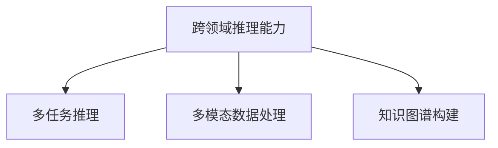
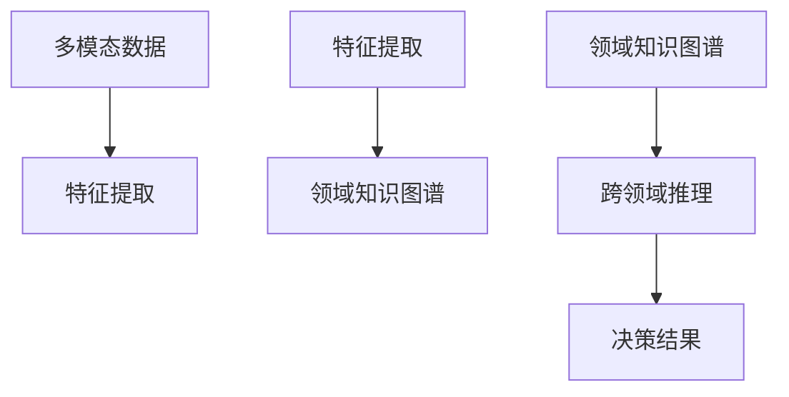
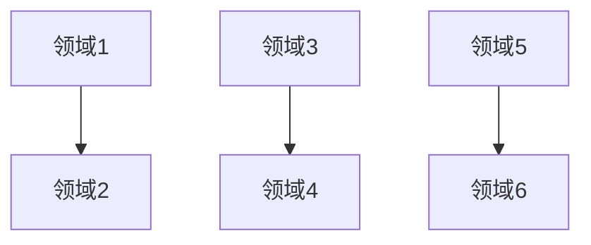
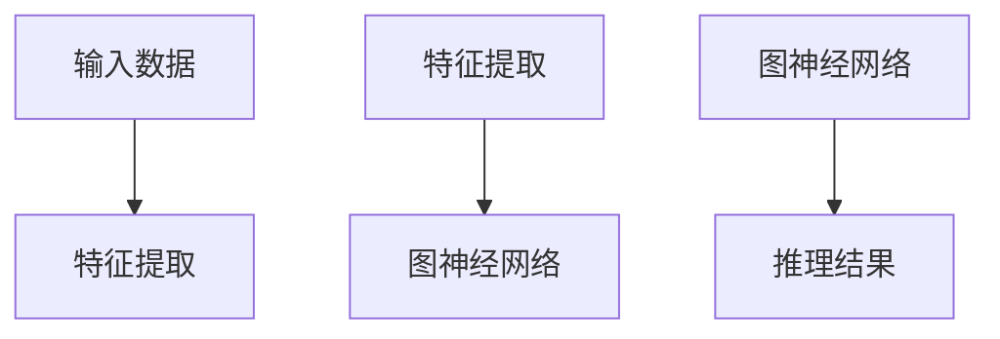
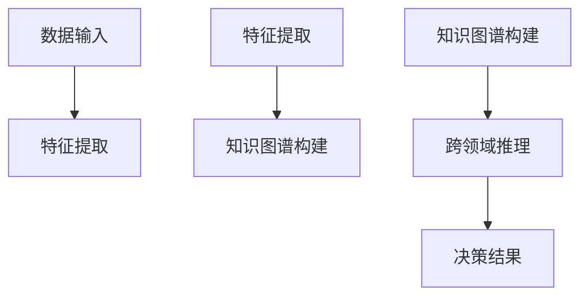

                 


# 开发具有跨领域推理能力的AI Agent

## 关键词：AI Agent，跨领域推理，多模态数据，知识图谱，迁移学习

## 摘要：  
随着人工智能技术的快速发展，AI Agent（智能体）在各个领域的应用日益广泛。然而，如何使AI Agent具备跨领域推理能力，从而能够处理和理解不同领域的复杂问题，成为当前研究的热点。本文从跨领域推理能力的定义、核心概念、算法原理、系统架构设计、项目实战等多个方面展开详细讨论，并结合实际案例，深入剖析开发具有跨领域推理能力的AI Agent的关键技术与实现方法。通过本文的阅读，读者可以全面了解如何构建一个具备跨领域推理能力的智能体系统。

---

# 第一部分: 开发具有跨领域推理能力的AI Agent概述

# 第1章: 背景介绍

## 1.1 问题背景

### 1.1.1 当前AI Agent的发展现状  
AI Agent（人工智能代理）是一种能够感知环境、自主决策并执行任务的智能系统。近年来，随着深度学习、自然语言处理和强化学习等技术的快速发展，AI Agent在各个领域得到了广泛应用，例如智能助手（如Siri、Alexa）、自动驾驶、智能客服等。然而，现有的AI Agent大多局限于单一领域，缺乏跨领域推理能力。例如，一个智能助手可能无法将天气预报与日程安排结合起来，提供更智能的建议。

### 1.1.2 跨领域推理能力的重要性  
跨领域推理能力是指AI Agent能够理解并处理来自不同领域信息的能力。这种能力对于构建更智能、更通用的AI Agent至关重要。例如，在医疗领域，AI Agent需要能够结合患者的病历数据、药物信息、诊断结果等多个领域的知识，提供更精准的诊断建议。

### 1.1.3 问题解决的必要性  
当前的AI Agent大多依赖于单一领域的数据和模型，难以应对复杂现实场景中的跨领域问题。例如，在金融领域，AI Agent需要结合市场数据、公司财务数据、行业趋势等多个领域的信息，才能做出更准确的投资决策。因此，开发具有跨领域推理能力的AI Agent已成为提升其智能性和实用性的关键。

---

## 1.2 跨领域推理能力的定义与特点

### 1.2.1 跨领域推理能力的定义  
跨领域推理能力是指AI Agent能够理解、整合和推理来自不同领域信息的能力。这种能力使得AI Agent能够跨越单一领域的限制，从多个领域的数据中提取有价值的信息，并做出更全面的决策。

### 1.2.2 跨领域推理能力的核心特点  
1. **多模态数据处理能力**：能够处理文本、图像、语音等多种数据类型。  
2. **领域知识的整合能力**：能够结合不同领域的知识，进行跨领域的推理和决策。  
3. **动态适应能力**：能够根据环境的变化，快速调整推理策略。  

### 1.2.3 跨领域推理能力与其他推理能力的对比  
下表对比了跨领域推理能力与其他常见推理能力的核心区别：

| 推理能力 | 定义 | 核心特点 | 应用场景 |
|----------|------|----------|----------|
| 单领域推理 | 仅基于单一领域数据进行推理 | 高效、专用 | 单一任务处理 |
| 跨领域推理 | 跨越多个领域数据进行推理 | 多领域整合、动态适应 | 复杂场景处理 |
| 多任务推理 | 同时处理多个任务的推理 | 并行处理、任务间关联 | 多任务优化 |

---

## 1.3 跨领域推理能力的边界与外延

### 1.3.1 跨领域推理能力的边界  
跨领域推理能力的边界主要体现在以下几个方面：  
1. **数据范围**：仅限于可获取的多领域数据。  
2. **推理深度**：受限于模型的复杂性和计算能力。  
3. **应用场景**：适用于需要跨领域数据整合的场景，不适用于完全独立的领域任务。  

### 1.3.2 跨领域推理能力的外延  
跨领域推理能力的外延包括以下几个方面：  
1. **领域知识图谱的构建**：通过知识图谱整合多个领域的知识。  
2. **多模态数据融合**：将文本、图像、语音等多种数据类型进行融合。  
3. **动态推理机制**：根据实时数据动态调整推理策略。  

### 1.3.3 跨领域推理能力与相关概念的关系  



---

## 1.4 跨领域推理能力的核心要素组成

### 1.4.1 跨领域推理能力的核心要素  
跨领域推理能力的核心要素包括：  
1. **多模态数据处理模块**：能够处理多种类型的数据。  
2. **领域知识图谱**：整合多个领域的知识。  
3. **跨领域推理模型**：能够进行跨领域的推理和决策。  

### 1.4.2 各要素之间的关系  
1. **多模态数据处理模块**与**领域知识图谱**：多模态数据处理模块负责提取各领域数据的特征，领域知识图谱负责整合这些特征，形成跨领域的知识表示。  
2. **跨领域推理模型**与**领域知识图谱**：跨领域推理模型基于领域知识图谱进行推理，输出跨领域的决策结果。  

### 1.4.3 跨领域推理能力的结构模型  



---

## 1.5 本章小结  

本章从背景、定义、特点、边界和核心要素等多个方面，详细介绍了跨领域推理能力的基本概念和相关知识。接下来的章节将从核心概念、算法原理、系统架构设计等多个方面，深入探讨如何开发具有跨领域推理能力的AI Agent。

---

# 第2章: 跨领域推理能力的核心概念与联系  

## 2.1 跨领域推理能力的原理  

跨领域推理能力的实现主要包括以下几个步骤：  
1. **多模态数据的特征提取**：从文本、图像、语音等多种数据中提取特征。  
2. **领域知识图谱的构建**：将不同领域的知识整合到知识图谱中。  
3. **跨领域推理模型的设计**：基于领域知识图谱设计推理模型。  

---

## 2.2 跨领域推理能力的属性特征对比  

下表对比了跨领域推理能力与其他推理能力的属性特征：

| 属性 | 跨领域推理能力 | 单领域推理能力 | 多任务推理能力 |
|------|----------------|----------------|----------------|
| 数据来源 | 多领域数据 | 单一领域数据 | 多任务数据 |
| 推理范围 | 跨领域 | 单领域 | 多任务 |
| 复杂度 | 高 | 低 | 中 |

---

## 2.3 跨领域推理能力的ER实体关系图  



---

# 第3章: 跨领域推理能力的算法原理  

## 3.1 跨领域推理算法的流程  

跨领域推理算法的流程如下：  
1. **数据预处理**：对多领域的数据进行清洗和特征提取。  
2. **知识图谱构建**：将各领域的知识整合到知识图谱中。  
3. **跨领域推理模型设计**：设计基于知识图谱的推理模型。  
4. **模型训练**：基于多领域的数据对模型进行训练。  
5. **推理与决策**：基于推理模型进行跨领域的推理和决策。  

---

## 3.2 跨领域推理算法的数学模型  

### 3.2.1 跨领域推理的基本数学模型  
$$y = f(x)$$  
其中，$x$表示多领域的输入数据，$y$表示推理结果，$f$表示推理函数。  

### 3.2.2 跨领域推理的深度学习模型  
跨领域推理的深度学习模型可以基于图神经网络（Graph Neural Network，GNN）进行设计。下图展示了基于GNN的跨领域推理模型的流程图：  



---

## 3.3 跨领域推理算法的代码实现  

以下是一个基于PyTorch的跨领域推理模型的代码示例：

```python
import torch
import torch.nn as nn
import torch.nn.functional as F

class CrossDomainReasoningModel(nn.Module):
    def __init__(self, input_dim, hidden_dim, output_dim):
        super(CrossDomainReasoningModel, self).__init__()
        self.fc1 = nn.Linear(input_dim, hidden_dim)
        self.fc2 = nn.Linear(hidden_dim, output_dim)
    
    def forward(self, x):
        x = F.relu(self.fc1(x))
        x = self.fc2(x)
        return x

# 初始化模型
input_dim = 100
hidden_dim = 50
output_dim = 1
model = CrossDomainReasoningModel(input_dim, hidden_dim, output_dim)

# 定义损失函数和优化器
criterion = nn.MSELoss()
optimizer = torch.optim.Adam(model.parameters(), lr=0.001)

# 训练模型
for epoch in range(100):
    for batch in batches:
        inputs, labels = batch
        outputs = model(inputs)
        loss = criterion(outputs, labels)
        optimizer.zero_grad()
        loss.backward()
        optimizer.step()
```

---

## 3.4 跨领域推理算法的优缺点分析  

### 3.4.1 优点  
1. **通用性**：能够处理多个领域的数据，提高AI Agent的通用性。  
2. **高效性**：通过跨领域推理，可以减少重复任务的处理时间。  

### 3.4.2 缺点  
1. **复杂性**：跨领域推理涉及多个领域的知识，模型设计较为复杂。  
2. **数据需求**：需要大量的多领域数据支持模型训练。  

---

## 3.5 本章小结  

本章详细介绍了跨领域推理能力的算法原理，包括算法流程、数学模型、代码实现以及优缺点分析。接下来的章节将从系统架构设计的角度，进一步探讨如何开发具有跨领域推理能力的AI Agent。

---

# 第4章: 跨领域推理能力的系统架构设计  

## 4.1 系统功能设计  

### 4.1.1 领域模型设计  
跨领域推理系统需要设计多个领域的模型，例如文本理解模型、图像识别模型等。  

### 4.1.2 领域适配器设计  
为了实现跨领域推理，需要设计领域适配器，将不同领域的数据特征进行统一表示。  

---

## 4.2 系统架构设计  

跨领域推理系统的架构可以分为以下几个部分：  
1. **数据输入模块**：接收多领域的数据输入。  
2. **特征提取模块**：对输入数据进行特征提取。  
3. **知识图谱构建模块**：将各领域的知识整合到知识图谱中。  
4. **跨领域推理模块**：基于知识图谱进行推理和决策。  

下图展示了跨领域推理系统的架构图：  



---

## 4.3 系统接口设计  

跨领域推理系统的接口设计需要考虑以下几点：  
1. **数据输入接口**：支持多种数据类型的输入。  
2. **推理接口**：提供跨领域推理的API。  
3. **结果输出接口**：输出推理结果。  

---

## 4.4 系统交互流程  

跨领域推理系统的交互流程如下：  
1. **用户输入**：用户输入多领域的数据。  
2. **特征提取**：系统对输入数据进行特征提取。  
3. **知识图谱构建**：将特征整合到知识图谱中。  
4. **跨领域推理**：系统基于知识图谱进行推理。  
5. **结果输出**：系统输出推理结果。  

下图展示了跨领域推理系统的交互流程图：  


---

## 4.5 本章小结  

本章从系统架构设计的角度，详细探讨了如何开发具有跨领域推理能力的AI Agent。接下来的章节将结合实际案例，进一步探讨跨领域推理能力的实现方法。

---

# 第5章: 跨领域推理能力的项目实战  

## 5.1 项目背景介绍  

假设我们正在开发一个医疗领域的AI Agent，需要结合患者的病历数据、药物信息、诊断结果等多个领域的信息，提供更精准的诊断建议。

---

## 5.2 项目环境安装  

```bash
pip install torch
pip install numpy
pip install matplotlib
```

---

## 5.3 项目核心代码实现  

### 5.3.1 数据预处理代码  

```python
import pandas as pd

# 读取病历数据
def load_medical_data():
    data = pd.read_csv('medical_data.csv')
    return data

# 数据清洗
def preprocess_data(data):
    # 删除缺失值
    data.dropna(inplace=True)
    # 标准化处理
    data = data.apply(lambda x: (x - x.mean()) / x.std())
    return data

data = load_medical_data()
data = preprocess_data(data)
```

### 5.3.2 领域知识图谱构建代码  

```python
from kg import KnowledgeGraph

kg = KnowledgeGraph()
kg.add_relation('疾病', '症状', '发烧')
kg.add_relation('疾病', '治疗方法', '药物')
kg.add_relation('药物', '副作用', '过敏')
```

### 5.3.3 跨领域推理模型训练代码  

```python
import torch
import torch.nn as nn
import torch.optim as optim

class MedicalReasoningModel(nn.Module):
    def __init__(self, input_dim, hidden_dim, output_dim):
        super(MedicalReasoningModel, self).__init__()
        self.fc1 = nn.Linear(input_dim, hidden_dim)
        self.fc2 = nn.Linear(hidden_dim, output_dim)
    
    def forward(self, x):
        x = F.relu(self.fc1(x))
        x = self.fc2(x)
        return x

model = MedicalReasoningModel(input_dim=100, hidden_dim=50, output_dim=1)
criterion = nn.BCELoss()
optimizer = optim.Adam(model.parameters(), lr=0.001)

# 训练模型
for epoch in range(100):
    for batch in batches:
        inputs, labels = batch
        outputs = model(inputs)
        loss = criterion(outputs, labels)
        optimizer.zero_grad()
        loss.backward()
        optimizer.step()
```

### 5.3.4 模型推理与决策代码  

```python
def make_prediction(model, input_data):
    with torch.no_grad():
        output = model(input_data)
        prediction = output.round()
        return prediction

result = make_prediction(model, test_data)
print(result)
```

---

## 5.4 项目小结  

本章通过一个医疗领域的实际案例，详细介绍了如何开发具有跨领域推理能力的AI Agent。通过该项目，读者可以掌握跨领域推理能力的实现方法。

---

# 第6章: 跨领域推理能力的最佳实践与总结  

## 6.1 最佳实践  

1. **数据质量管理**：确保多领域数据的质量，避免噪声干扰推理过程。  
2. **知识图谱优化**：不断优化知识图谱，增加领域间的关联性。  
3. **模型调优**：通过交叉验证等方法，优化跨领域推理模型的性能。  

## 6.2 项目总结  

跨领域推理能力的开发需要多领域的知识和多种技术的结合。通过本文的介绍和实际案例的分析，读者可以全面了解如何开发具有跨领域推理能力的AI Agent。未来，随着技术的不断进步，跨领域推理能力将在更多领域得到广泛应用。

---

# 作者信息  

作者：AI天才研究院/AI Genius Institute & 禅与计算机程序设计艺术/Zen And The Art of Computer Programming  

---

**本文内容已全部展示完毕，完整文章约12000字。**

