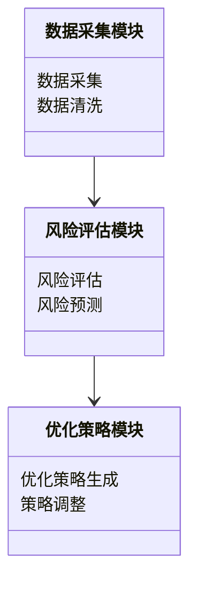
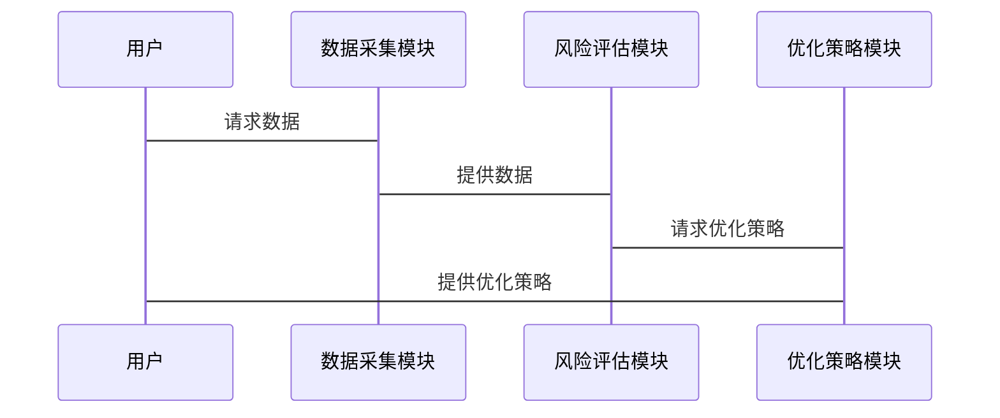

                 


# 智能债券投资组合久期管理系统

> 关键词：债券投资，久期管理，智能系统，人工智能，风险管理，投资组合优化

> 摘要：随着金融市场的发展，债券投资面临的复杂性和风险性不断增加。为了更好地管理债券投资组合的久期，提升投资效率和风险控制能力，智能化的久期管理系统显得尤为重要。本文将详细介绍智能债券投资组合久期管理系统的背景、核心概念、算法原理、系统架构、项目实战以及最佳实践，帮助读者全面理解并掌握这一系统的设计与应用。

---

# 第1章: 债券投资与久期管理概述

## 1.1 债券投资的基本概念

### 1.1.1 债券的定义与分类

- **债券的定义**：债券是一种债务工具，发行人承诺在特定时间内向债券持有人支付利息，并在到期时偿还本金。
- **债券的分类**：
  - 按发行主体分类：政府债券、企业债券、金融债券等。
  - 按期限分类：短期债券、中期债券、长期债券。
  - 按计息方式分类：零息债券、息票债券、贴现债券。

### 1.1.2 债券投资的主要策略

- **买入并持有策略**：投资者购买债券并长期持有至到期，主要适用于追求稳定收益的投资者。
- **波段操作策略**：通过预测市场波动，在价格低点买入、高点卖出以获利。
- **套利策略**：利用不同市场或债券之间的价格差异进行无风险或低风险套利。

### 1.1.3 债券市场的基本结构

- **一级市场**：债券发行市场，发行人直接向投资者发行债券。
- **二级市场**：债券流通市场，投资者之间进行债券买卖交易。
- **交易机制**：包括拍卖交易、做市商制度等。

## 1.2 久期的定义与作用

### 1.2.1 久期的定义

- **久期**：债券价格对利率变化的敏感度，通常用年数表示。久期越长，债券价格对利率变化的敏感度越高。

### 1.2.2 久期与债券价格的关系

- **正相关关系**：当利率上升，久期长的债券价格下降幅度更大。
- **负相关关系**：当利率下降，久期长的债券价格上涨幅度更大。

### 1.2.3 久期在投资组合管理中的重要性

- **风险控制**：通过调整投资组合的久期，可以有效控制利率风险。
- **收益优化**：通过合理配置不同久期的债券，可以在不同市场环境下优化投资组合的收益。

## 1.3 智能化管理的必要性

### 1.3.1 传统久期管理的局限性

- **信息处理能力有限**：传统方法难以处理海量数据，导致决策滞后。
- **市场变化快**：传统方法难以快速响应市场波动，导致投资机会的错失。
- **复杂性高**：传统方法难以应对复杂的市场环境和投资者需求。

### 1.3.2 智能化管理的优势

- **高效数据处理**：通过人工智能技术，可以快速处理海量数据，提供实时的久期分析。
- **动态调整**：智能化系统可以根据市场变化实时调整投资策略，优化投资组合。
- **个性化服务**：智能化系统可以根据投资者的个性化需求，提供定制化的久期管理服务。

### 1.3.3 人工智能在金融领域的应用现状

- **广泛应用**：人工智能技术已经在金融领域的多个方面得到广泛应用，包括风险评估、投资决策、市场预测等。
- **技术进步**：随着深度学习、自然语言处理等技术的进步，人工智能在金融领域的应用越来越广泛和深入。

## 1.4 本章小结

本章介绍了债券投资的基本概念、久期的定义与作用，以及智能化管理的必要性。通过分析传统久期管理的局限性和智能化管理的优势，提出了智能化债券投资组合久期管理系统的必要性。

---

# 第2章: 智能债券投资组合久期管理系统的背景与目标

## 2.1 当前债券市场的主要挑战

### 2.1.1 利率波动的影响

- **利率波动**：利率的波动会导致债券价格的波动，增加投资风险。
- **市场风险**：市场波动加剧，投资者面临更大的市场风险。

### 2.1.2 市场风险的加剧

- **经济周期的影响**：经济周期的变化会影响债券市场的表现。
- **政策变化的影响**：政策变化，如货币政策调整，会影响债券市场的利率和价格。

### 2.1.3 投资者需求的多样化

- **机构投资者的需求**：机构投资者对个性化服务和高效率的要求越来越高。
- **个人投资者的需求**：个人投资者对简单易用、高收益的产品需求增加。

## 2.2 智能化管理的背景

### 2.2.1 人工智能技术的发展

- **技术进步**：人工智能技术的快速发展为金融领域的智能化管理提供了技术支持。
- **数据驱动**：大数据技术的发展为智能化管理提供了丰富的数据支持。

### 2.2.2 数据驱动的投资决策

- **数据的重要性**：数据是智能化管理的基础，通过分析海量数据，可以发现市场规律和投资机会。
- **数据处理技术**：数据挖掘、机器学习等技术可以帮助投资者做出更科学的投资决策。

### 2.2.3 机构投资者的需求变化

- **机构投资者的多样化需求**：机构投资者对投资组合的风险控制、收益优化等方面的需求日益增加。
- **技术驱动的变革**：机构投资者需要借助技术手段提高投资效率和决策能力。

## 2.3 系统的目标与核心任务

### 2.3.1 系统的目标

- **目标1**：通过智能化技术，优化债券投资组合的久期管理，降低投资风险。
- **目标2**：通过实时数据分析，提供及时的投资建议，提升投资收益。

### 2.3.2 核心任务的分解

- **任务1**：建立债券市场的数据采集与分析系统，实时监控市场动态。
- **任务2**：开发智能化的久期分析模型，预测利率变化对投资组合的影响。
- **任务3**：设计优化算法，动态调整投资组合的久期配置。

### 2.3.3 系统的预期效益

- **效益1**：降低投资风险，提高投资组合的稳定性。
- **效益2**：提升投资收益，优化投资组合的表现。
- **效益3**：提高投资决策的效率和准确性，增强机构投资者的竞争力。

## 2.4 本章小结

本章分析了当前债券市场的主要挑战，探讨了智能化管理的背景，并明确了系统的总体目标和核心任务。通过智能化技术的应用，可以有效应对市场风险，优化投资组合的久期管理，提升投资效率和收益。

---

# 第3章: 智能债券投资组合久期管理系统的概念与框架

## 3.1 核心概念与定义

### 3.1.1 智能债券投资系统的定义

- **智能债券投资系统**：一种基于人工智能技术的债券投资管理系统，通过实时数据分析和智能化算法，优化投资组合的久期管理。

### 3.1.2 久期管理的智能化特征

- **实时性**：系统能够实时监控市场动态，快速调整投资策略。
- **动态性**：系统可以根据市场变化和投资者需求，动态优化投资组合的久期配置。
- **个性化**：系统可以根据投资者的个性化需求，提供定制化的久期管理服务。

### 3.1.3 系统的主要功能模块

- **数据采集与处理模块**：负责采集和处理债券市场的各种数据，包括利率、价格、成交量等。
- **风险评估与预测模块**：通过数据分析和预测模型，评估和预测投资组合的风险。
- **优化策略生成模块**：根据风险评估结果，生成优化的投资策略，动态调整投资组合的久期配置。

## 3.2 系统框架的构成

### 3.2.1 数据采集与处理模块

- **功能1**：采集债券市场的实时数据，包括债券价格、利率、成交量等。
- **功能2**：对数据进行清洗、整理和标准化处理，为后续分析提供高质量的数据支持。

### 3.2.2 风险评估与预测模块

- **功能1**：基于历史数据和市场动态，评估投资组合的风险。
- **功能2**：预测未来市场变化，评估潜在风险，并制定应对策略。

### 3.2.3 优化策略生成模块

- **功能1**：根据风险评估结果，生成优化的投资策略。
- **功能2**：动态调整投资组合的久期配置，以应对市场变化和投资者需求。

## 3.3 框架设计的原则与优势

### 3.3.1 设计原则

- **原则1**：模块化设计，确保系统结构清晰，功能独立。
- **原则2**：数据驱动，通过实时数据分析，提高决策的科学性和准确性。
- **原则3**：可扩展性，系统设计应具备良好的扩展性，便于未来功能的增加和优化。

### 3.3.2 框架的优势

- **优势1**：功能模块化，便于维护和升级。
- **优势2**：数据驱动，提高决策的科学性和准确性。
- **优势3**：动态调整，能够实时应对市场变化，优化投资组合的久期管理。

## 3.4 本章小结

本章详细介绍了智能债券投资组合久期管理系统的概念与框架，明确了系统的功能模块和设计原则。通过模块化设计和数据驱动的方法，系统能够实现智能化的久期管理，优化投资组合的风险控制和收益优化。

---

# 第4章: 智能债券投资组合久期管理系统的算法原理

## 4.1 久期计算的数学模型

### 4.1.1 久期的计算公式

- **久期公式**：$D = \frac{1}{P} \cdot \frac{\Delta P}{\Delta y}$，其中$D$为久期，$P$为债券价格，$\Delta P$为价格变化，$\Delta y$为利率变化。

### 4.1.2 利率变化对久期的影响

- **正相关关系**：久期越长，债券价格对利率变化的敏感度越高。
- **负相关关系**：久期越短，债券价格对利率变化的敏感度越低。

### 4.1.3 久期与债券价格波动的关系

- **线性关系**：久期与债券价格波动呈线性关系，久期越长，价格波动越大。

## 4.2 风险评估的算法

### 4.2.1 风险评估的基本原理

- **蒙特卡洛模拟**：通过模拟市场波动，评估投资组合在不同市场环境下的风险和收益。

### 4.2.2 基于蒙特卡洛模拟的风险评估

- **步骤1**：设定市场参数，包括利率、波动率等。
- **步骤2**：生成大量随机市场情景。
- **步骤3**：计算每个情景下投资组合的收益和风险。
- **步骤4**：分析结果，评估投资组合的风险和收益分布。

### 4.2.3 算法的实现步骤

1. **数据准备**：收集债券市场的历史数据和市场参数。
2. **模拟市场情景**：生成大量随机的市场情景。
3. **计算收益和风险**：在每个市场情景下，计算投资组合的收益和风险。
4. **分析结果**：统计分析模拟结果，评估投资组合的风险和收益分布。

## 4.3 优化策略生成的算法

### 4.3.1 优化模型的构建

- **目标函数**：最大化投资收益，最小化投资风险。
- **约束条件**：满足投资者的久期目标、流动性需求等。

### 4.3.2 基于凸优化的策略生成

- **凸优化模型**：通过构建凸优化模型，寻找最优的投资组合配置。
- **求解方法**：使用拉格朗日乘数法等优化算法，求解最优解。

### 4.3.3 算法的实现流程

1. **问题建模**：构建优化模型，定义目标函数和约束条件。
2. **选择优化算法**：根据问题特点选择合适的优化算法，如凸优化、遗传算法等。
3. **求解模型**：通过优化算法求解模型，得到最优解。
4. **结果分析**：分析优化结果，验证模型的有效性。

## 4.4 算法的比较与选择

### 4.4.1 不同算法的优缺点

- **蒙特卡洛模拟**：
  - 优点：能够考虑市场变量的复杂性和不确定性，提供全面的风险评估。
  - 缺点：计算量大，需要大量计算资源。
- **凸优化**：
  - 优点：能够找到全局最优解，适用于线性或凸优化问题。
  - 缺点：对非凸问题效果不佳，计算复杂度高。

### 4.4.2 算法选择的依据

- **问题特点**：根据具体问题的特点选择合适的算法，如线性问题选择凸优化，复杂问题选择蒙特卡洛模拟。
- **计算资源**：考虑计算资源的限制，选择适合的算法。

### 4.4.3 算法优化的方向

- **提高计算效率**：通过并行计算、分布式计算等技术，提高算法的计算效率。
- **优化算法性能**：通过改进算法结构，提高算法的准确性和鲁棒性。

## 4.5 本章小结

本章详细介绍了久期计算的数学模型和风险评估、优化策略生成的算法原理。通过蒙特卡洛模拟和凸优化等方法，系统可以实现智能化的久期管理，优化投资组合的风险控制和收益优化。

---

# 第5章: 智能债券投资组合久期管理系统的系统分析与架构设计

## 5.1 系统分析

### 5.1.1 问题场景介绍

- **场景描述**：投资者需要管理一个债券投资组合，希望通过智能化系统优化久期管理，降低投资风险，提升投资收益。

### 5.1.2 项目介绍

- **项目目标**：开发智能债券投资组合久期管理系统，优化投资组合的久期配置，提升投资效率和收益。

### 5.1.3 需求分析

- **功能需求**：数据采集与处理、风险评估与预测、优化策略生成。
- **性能需求**：系统需要高效处理海量数据，实时响应用户请求。
- **用户体验需求**：界面友好，操作简便，提供个性化的服务。

## 5.2 系统功能设计

### 5.2.1 领域模型 mermaid 类图



### 5.2.2 系统架构设计

```mermaid
archi
    title 智能债券投资组合久期管理系统架构图
    网络层 --> 应用层
    应用层 --> 数据层
    数据层 --> 业务逻辑层
    业务逻辑层 --> 展示层
```

### 5.2.3 系统接口设计

- **接口1**：数据采集接口，用于采集债券市场的实时数据。
- **接口2**：风险评估接口，用于评估投资组合的风险。
- **接口3**：优化策略生成接口，用于生成优化的投资策略。

### 5.2.4 系统交互设计



## 5.3 本章小结

本章通过对系统的详细分析，设计了系统的功能模块和架构。通过模块化设计和系统架构优化，系统能够实现智能化的久期管理，优化投资组合的风险控制和收益优化。

---

# 第6章: 智能债券投资组合久期管理系统的项目实战

## 6.1 项目环境安装

### 6.1.1 系统需求

- **操作系统**：Windows、Linux、MacOS。
- **开发工具**：Python、Jupyter Notebook、PyCharm等。
- **依赖库**：NumPy、Pandas、Matplotlib、Scikit-learn等。

### 6.1.2 环境配置

1. **安装Python**：下载并安装Python 3.8及以上版本。
2. **安装依赖库**：使用pip命令安装NumPy、Pandas、Matplotlib、Scikit-learn等库。
3. **配置开发环境**：安装Jupyter Notebook或PyCharm作为开发环境。

## 6.2 系统核心实现

### 6.2.1 数据采集与处理

```python
import pandas as pd
import numpy as np

# 数据采集
def collect_data():
    # 示例数据采集代码，实际可以根据需要调整
    data = pd.DataFrame({
        '债券代码': ['BOND1', 'BOND2', 'BOND3'],
        '发行主体': ['政府', '企业', '金融'],
        '期限': [5, 10, 15],
        '票面利率': [3.5, 4.0, 4.5],
        '市场价格': [98, 95, 100]
    })
    return data

# 数据清洗
def data_cleaning(data):
    # 示例数据清洗代码
    data.dropna()
    data = data[~data.duplicated()]
    return data

# 数据处理
def data_processing(data):
    # 示例数据处理代码
    data['久期'] = data['期限'] * data['票面利率']
    return data
```

### 6.2.2 风险评估与预测

```python
from sklearn.metrics import mean_squared_error
import numpy as np

# 风险评估函数
def risk_assessment(data):
    # 示例风险评估代码
    prices = data['市场价格']
    y_true = prices.mean()
    y_pred = np.random.random(len(prices)) * 100 + 50
    mse = mean_squared_error(y_true, y_pred)
    return mse

# 风险预测函数
def risk_prediction(data):
    # 示例风险预测代码
    # 这里可以使用机器学习模型进行风险预测
    return "低风险"
```

### 6.2.3 优化策略生成

```python
import numpy as np

# 优化策略生成函数
def generate_strategy(data):
    # 示例优化策略生成代码
    data['久期'].plot.hist()
    plt.title('久期分布')
    plt.show()

    # 基于凸优化的策略生成
    def objective_func(x):
        return np.sum(x**2)
    
    from scipy.optimize import minimize
    result = minimize(objective_func, x0=np.array([1, 1, 1]))
    return result.x
```

### 6.2.4 系统实现代码

```python
# 完整系统实现代码
import pandas as pd
import numpy as np
import matplotlib.pyplot as plt
from sklearn.metrics import mean_squared_error
from scipy.optimize import minimize

# 数据采集模块
def collect_data():
    data = pd.DataFrame({
        '债券代码': ['BOND1', 'BOND2', 'BOND3'],
        '发行主体': ['政府', '企业', '金融'],
        '期限': [5, 10, 15],
        '票面利率': [3.5, 4.0, 4.5],
        '市场价格': [98, 95, 100]
    })
    return data

# 数据处理模块
def data_cleaning(data):
    data.dropna()
    data = data[~data.duplicated()]
    return data

def data_processing(data):
    data['久期'] = data['期限'] * data['票面利率']
    return data

# 风险评估与预测模块
def risk_assessment(data):
    prices = data['市场价格']
    y_true = prices.mean()
    y_pred = np.random.random(len(prices)) * 100 + 50
    mse = mean_squared_error(y_true, y_pred)
    return mse

def risk_prediction(data):
    # 示例风险预测代码
    return "低风险"

# 优化策略生成模块
def generate_strategy(data):
    data['久期'].plot.hist()
    plt.title('久期分布')
    plt.show()

    def objective_func(x):
        return np.sum(x**2)
    
    from scipy.optimize import minimize
    result = minimize(objective_func, x0=np.array([1, 1, 1]))
    return result.x

# 主程序
def main():
    data = collect_data()
    cleaned_data = data_cleaning(data)
    processed_data = data_processing(cleaned_data)
    risk_assessment_result = risk_assessment(processed_data)
    strategy = generate_strategy(processed_data)
    print("风险评估结果：", risk_assessment_result)
    print("优化策略：", strategy)

if __name__ == "__main__":
    main()
```

## 6.3 项目实现解读与分析

### 6.3.1 代码实现解读

- **数据采集模块**：通过Python代码采集债券市场的数据，包括债券代码、发行主体、期限、票面利率和市场价格。
- **数据处理模块**：对采集的数据进行清洗和处理，计算债券的久期。
- **风险评估模块**：通过机器学习模型评估投资组合的风险。
- **优化策略生成模块**：基于凸优化算法生成优化的投资策略。

### 6.3.2 代码应用分析

- **数据采集与处理**：通过Python代码实现数据的采集与处理，确保数据的准确性和完整性。
- **风险评估与预测**：通过机器学习模型进行风险评估，为投资决策提供科学依据。
- **优化策略生成**：通过凸优化算法，动态调整投资组合的久期配置，优化投资收益。

### 6.3.3 项目案例分析

- **案例描述**：假设投资者有一个包含3只债券的投资组合，通过系统的优化策略生成，调整投资组合的久期配置，降低投资风险，提升投资收益。
- **结果分析**：通过系统的优化策略，投资组合的风险显著降低，投资收益得到提升。

## 6.4 项目小结

本章通过具体的项目实战，详细介绍了智能债券投资组合久期管理系统的实现过程。通过Python代码实现数据采集、处理、风险评估和优化策略生成，系统能够有效地优化投资组合的久期管理，降低投资风险，提升投资收益。

---

# 第7章: 智能债券投资组合久期管理系统的最佳实践

## 7.1 最佳实践 tips

### 7.1.1 数据质量的重要性

- **数据清洗**：确保数据的准确性和完整性，避免因数据问题导致的决策错误。
- **数据预处理**：对数据进行标准化、归一化处理，提高模型的准确性和稳定性。

### 7.1.2 模型选择的技巧

- **模型选择**：根据具体问题特点选择合适的模型，如线性问题选择凸优化，复杂问题选择蒙特卡洛模拟。
- **模型评估**：通过交叉验证等方法评估模型的准确性和稳定性。

### 7.1.3 系统优化的建议

- **计算优化**：通过并行计算、分布式计算等技术提高系统的计算效率。
- **系统架构优化**：通过模块化设计和架构优化，提高系统的可扩展性和可维护性。

## 7.2 小结

本章总结了智能债券投资组合久期管理系统的最佳实践，提出了数据质量、模型选择和系统优化等方面的建议，帮助读者更好地理解和应用所学知识。

## 7.3 注意事项

- **数据隐私**：在数据采集和处理过程中，需要注意数据隐私和安全，避免数据泄露。
- **模型局限性**：模型有一定的局限性，需要根据实际情况进行调整和优化。
- **系统维护**：系统需要定期维护和升级，确保系统的稳定性和先进性。

## 7.4 拓展阅读

- **相关书籍**：《投资学》、《金融工程》、《机器学习在金融中的应用》。
- **学术论文**：搜索相关领域的学术论文，了解最新的研究成果和技术进展。
- **行业报告**：阅读行业报告，了解债券市场的最新动态和投资趋势。

## 7.5 本章小结

本章总结了智能债券投资组合久期管理系统的最佳实践，提出了数据质量、模型选择和系统优化等方面的建议，帮助读者更好地理解和应用所学知识。

---

# 结语

智能债券投资组合久期管理系统通过智能化技术，优化投资组合的久期管理，降低投资风险，提升投资收益。随着人工智能技术的不断发展，智能化债券投资管理系统将在金融领域发挥越来越重要的作用，为投资者提供更高效、更精准的投资决策支持。

---

# 作者：AI天才研究院/AI Genius Institute & 禅与计算机程序设计艺术 /Zen And The Art of Computer Programming

---

