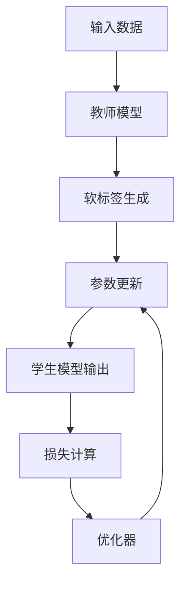
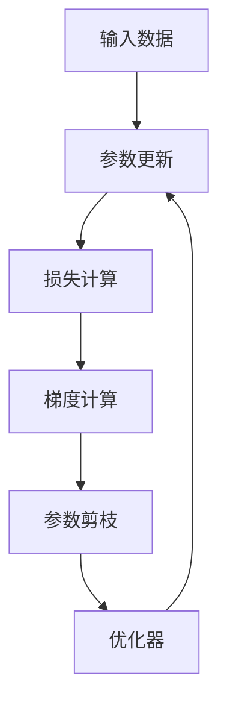
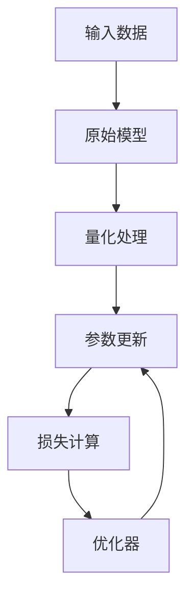
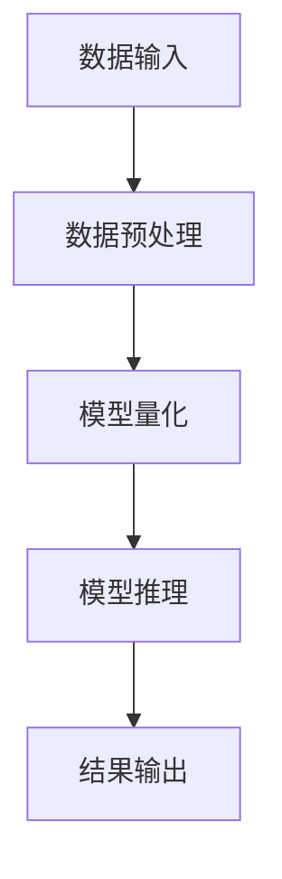
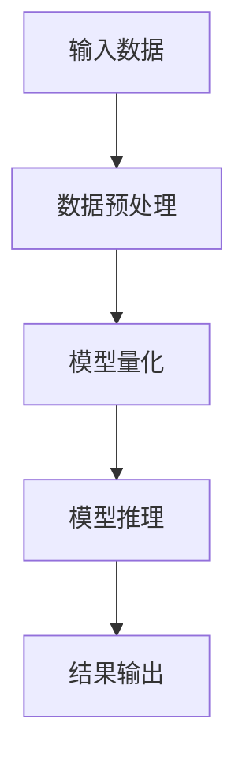

                 


# 模型量化：降低AI Agent的硬件需求

> 关键词：模型量化，AI Agent，硬件需求，知识蒸馏，参数剪枝，模型压缩，轻量化

> 摘要：模型量化是一种通过减少模型参数的位数来降低AI Agent对硬件资源需求的技术。本文将详细介绍模型量化的核心概念、算法原理、系统架构设计及项目实战，帮助读者全面掌握如何通过模型量化降低AI Agent的硬件需求，实现模型的轻量化和高效部署。

---

## 第1章: 模型量化概述

### 1.1 模型量化的基本概念

#### 1.1.1 什么是模型量化
- 模型量化的定义
- 模型量化的目的：减少模型的计算量和存储需求
- 模型量化的核心方法：参数位宽缩减、知识蒸馏、参数剪枝

#### 1.1.2 模型量化的应用场景
- 移动端AI Agent的部署
- 边缘计算中的模型优化
- 低功耗设备上的AI应用

#### 1.1.3 模型量化的关键指标
- 模型大小：量化后的模型参数数量
- 计算效率：量化对模型推理速度的影响
- 模型精度：量化对模型准确率的影响

### 1.2 模型量化的核心问题

#### 1.2.1 模型压缩的目标
- 减少模型参数数量
- 降低模型的计算复杂度
- 优化模型的存储需求

#### 1.2.2 模型压缩的挑战
- 量化后的精度损失
- 模型压缩对性能的影响
- 现有硬件对量化模型的支持

#### 1.2.3 模型压缩的边界与外延
- 量化位宽的下限
- 模型压缩的极限
- 模型压缩与其他优化技术的结合

### 1.3 模型量化的核心要素

#### 1.3.1 模型结构的简化
- 网络剪枝：移除冗余的神经元或连接
- 知识蒸馏：通过教师模型指导学生模型学习
- 模型架构搜索：自动优化模型结构

#### 1.3.2 参数空间的压缩
- 量化：减少参数的位宽（如从32位浮点数降到8位整数）
- 稀疏化：引入稀疏性，减少非零参数的数量
- 混合量化：结合量化和稀疏化技术

#### 1.3.3 知识蒸馏与剪枝技术
- 知识蒸馏的基本原理
- 参数剪枝的技术实现
- 量化与蒸馏的结合

---

## 第2章: 模型量化的核心概念与联系

### 2.1 模型量化的核心原理

#### 2.1.1 量化的基本原理
- 参数量化：将权重和激活值的位宽从32位降至8位或更低
- 激活量化：对中间激活值进行量化处理
- 量化误差分析：量化对模型性能的影响

#### 2.1.2 量化与模型压缩的关系
- 量化是模型压缩的一种手段
- 模型压缩的目标是减少模型的存储和计算需求
- 量化与其他压缩技术（如剪枝）的结合

#### 2.1.3 量化与模型轻量化的关系
- 轻量化的目标是降低模型的资源消耗
- 量化是实现模型轻量化的关键技术之一
- 轻量化与模型部署的关系

### 2.2 模型量化的核心技术对比

#### 2.2.1 知识蒸馏技术
- 知识蒸馏的定义
- 知识蒸馏的核心步骤：教师模型生成软标签，学生模型学习软标签
- 知识蒸馏的优势与不足

#### 2.2.2 参数剪枝技术
- 参数剪枝的定义
- 参数剪枝的实现方法：基于梯度的剪枝、基于权重分布的剪枝
- 参数剪枝的效果评估

#### 2.2.3 量化技术
- 量化技术的定义
- 量化技术的实现方法：均匀量化、非对称量化、混合量化
- 量化技术的优缺点

### 2.3 模型量化与系统架构的关系

#### 2.3.1 系统架构对模型量化的需求
- 系统架构对模型压缩的要求
- 模型量化对系统性能的提升
- 模型量化与系统架构的协同优化

#### 2.3.2 模型量化对系统性能的提升
- 模型量化对计算资源的节省
- 模型量化对存储资源的优化
- 模型量化对带宽需求的降低

#### 2.3.3 模型量化与系统架构的协同优化
- 系统架构对量化模型的支持
- 量化模型对系统架构的适应
- 量化与系统架构的联合优化

---

## 第3章: 模型量化算法原理

### 3.1 模型压缩算法概述

#### 3.1.1 知识蒸馏算法
- 知识蒸馏的基本流程
- 知识蒸馏的核心算法：软标签生成与损失函数设计
- 知识蒸馏的优化方法

#### 3.1.2 参数剪枝算法
- 参数剪枝的基本流程
- 基于梯度的剪枝算法：L1正则化、L2正则化
- 基于权重分布的剪枝算法：基于方差的剪枝、基于梯度的剪枝

#### 3.1.3 量化算法
- 量化算法的基本流程
- 均匀量化与非对称量化
- 混合量化算法：结合量化和稀疏化

### 3.2 量化算法的数学模型

#### 3.2.1 权重量化模型
- 权重量化的数学公式
- 量化函数的定义
- 量化误差的分析

#### 3.2.2 激活量化模型
- 激活量化的数学公式
- 激活量化与网络层的关系
- 激活量化的误差传播

#### 3.2.3 混合量化模型
- 混合量化的核心思想
- 混合量化的数学模型
- 混合量化的优势与挑战

### 3.3 量化算法的流程图

#### 3.3.1 知识蒸馏流程图


#### 3.3.2 参数剪枝流程图


#### 3.3.3 量化流程图


### 3.4 模型量化算法的数学公式

#### 3.4.1 均匀量化公式
$$ y = \text{round}\left(\frac{x}{\Delta}\right) \times \Delta $$
其中，$x$ 是原始值，$\Delta$ 是量化间隔。

#### 3.4.2 非对称量化公式
$$ y = \text{round}\left(\frac{x - a}{\Delta}\right) \times \Delta + a $$
其中，$a$ 是偏移量，$\Delta$ 是量化间隔。

#### 3.4.3 混合量化公式
$$ y = \text{round}\left(\frac{x}{\Delta}\right) \times \Delta \text{ for certain layers} $$
$$ y = x \text{ for other layers} $$

---

## 第4章: 模型量化系统架构设计

### 4.1 系统架构概述

#### 4.1.1 系统架构的目标
- 实现模型量化后的高效部署
- 降低AI Agent的硬件需求
- 提高模型的计算效率和存储效率

#### 4.1.2 系统架构的组成
- 输入模块：接收输入数据
- 处理模块：量化模型处理
- 输出模块：生成输出结果
- 管理模块：模型量化和优化

#### 4.1.3 系统架构的优化
- 网络架构优化：降低模型复杂度
- 硬件架构优化：提高计算效率
- 软件架构优化：降低资源消耗

### 4.2 系统功能设计

#### 4.2.1 系统功能模块划分
- 数据输入模块：接收输入数据并进行预处理
- 模型量化模块：对模型进行量化处理
- 模型推理模块：执行量化后的模型推理
- 结果输出模块：输出推理结果并进行后处理

#### 4.2.2 系统功能模块的实现
- 数据输入模块的实现：数据预处理和格式转换
- 模型量化模块的实现：量化算法的实现和参数调整
- 模型推理模块的实现：量化模型的推理和结果计算
- 结果输出模块的实现：结果后处理和输出格式转换

#### 4.2.3 系统功能模块的优化
- 数据输入模块的优化：提高数据读取效率
- 模型量化模块的优化：优化量化算法和参数设置
- 模型推理模块的优化：提高推理速度和准确性
- 结果输出模块的优化：提高输出效率和准确性

### 4.3 系统架构设计图

#### 4.3.1 系统架构图


#### 4.3.2 模块交互图


#### 4.3.3 数据流图


### 4.4 系统接口设计

#### 4.4.1 系统接口的定义
- 数据输入接口：接收输入数据并进行预处理
- 模型量化接口：对模型进行量化处理
- 模型推理接口：执行量化后的模型推理
- 结果输出接口：输出推理结果并进行后处理

#### 4.4.2 系统接口的实现
- 数据输入接口的实现：数据预处理和格式转换
- 模型量化接口的实现：量化算法的实现和参数调整
- 模型推理接口的实现：量化模型的推理和结果计算
- 结果输出接口的实现：结果后处理和输出格式转换

#### 4.4.3 系统接口的优化
- 数据输入接口的优化：提高数据读取效率
- 模型量化接口的优化：优化量化算法和参数设置
- 模型推理接口的优化：提高推理速度和准确性
- 结果输出接口的优化：提高输出效率和准确性

### 4.5 系统交互设计

#### 4.5.1 系统交互流程
- 数据输入模块接收输入数据并进行预处理
- 数据预处理模块将数据传递给模型量化模块
- 模型量化模块对模型进行量化处理并传递给模型推理模块
- 模型推理模块执行推理并将结果传递给结果输出模块
- 结果输出模块输出最终结果并进行后处理

#### 4.5.2 系统交互图


---

## 第5章: 模型量化项目实战

### 5.1 项目环境安装

#### 5.1.1 环境配置
- 操作系统：Linux/Windows/MacOS
- Python版本：Python 3.6+
- 依赖库安装：numpy、pandas、scikit-learn、tensorflow等

#### 5.1.2 依赖安装
- 使用pip安装必要的依赖库
- 配置虚拟环境并安装依赖

#### 5.1.3 开发工具安装
- 安装Jupyter Notebook或VS Code等开发工具
- 配置代码风格和格式化工具

### 5.2 项目核心实现

#### 5.2.1 模型量化代码实现
```python
import numpy as np

def quantize(weights, bit_width=8):
    min_val = np.min(weights)
    max_val = np.max(weights)
    scale = (max_val - min_val) / (2**bit_width - 1)
    quantized = np.round(weights / scale) * scale + min_val
    return quantized
```

#### 5.2.2 模型压缩代码实现
```python
import tensorflow as tf

def prune_model(model):
    # 使用L1正则化进行剪枝
    with tf.Graph.as_default():
        with tf.Session():
            model = tf.keras.models.load_model("original_model.h5")
            # 添加L1正则化损失
            loss = tf.keras.losses.sparse_categorical_crossentropy
            optimizer = tf.keras.optimizers.Adam
            model.compile(optimizer=optimizer, loss=loss, metrics=['accuracy'])
            # 执行剪枝
            prune_model = tf.keras.Model(inputs=model.inputs, outputs=model.outputs)
            prune_model.trainable_weights = [weight for weight in model.trainable_weights if 'kernel' in weight.name]
            prune_model.compile(optimizer=optimizer, loss=loss, metrics=['accuracy'])
            prune_model.fit(x_train, y_train, epochs=10, batch_size=32)
    return prune_model
```

#### 5.2.3 模型轻量化代码实现
```python
import tensorflow as tf

def quantize_model(model, bit_width=8):
    # 创建量化模型
    quantized_model = tf.keras.models.clone_model(model)
    # 量化处理
    for layer in quantized_model.layers:
        if isinstance(layer, tf.keras.layers.Dense) or isinstance(layer, tf.keras.layers.Conv2D):
            weights = layer.get_weights()[0]
            quantized_weights = quantize(weights, bit_width)
            layer.set_weights([quantized_weights])
    return quantized_model
```

### 5.3 项目应用解读

#### 5.3.1 代码功能分析
- 模型量化代码分析：对模型权重进行量化处理
- 模型压缩代码分析：通过L1正则化进行参数剪枝
- 模型轻量化代码分析：结合量化和剪枝技术实现轻量化

#### 5.3.2 代码优化建议
- 量化位宽的选择：根据模型精度需求选择合适的量化位宽
- 剪枝算法的优化：尝试不同的剪枝方法以获得更好的性能
- 模型轻量化后的测试：对比量化前后模型的性能和资源消耗

#### 5.3.3 代码实际案例分析
- 使用量化技术降低模型的存储需求
- 通过剪枝技术减少模型参数数量
- 结合量化和剪枝技术实现模型轻量化

### 5.4 项目小结

#### 5.4.1 项目总结
- 模型量化和剪枝技术的有效性
- 量化模型对硬件资源的节省
- 轻量化模型在实际应用中的优势

#### 5.4.2 项目经验分享
- 量化位宽的选择对模型精度的影响
- 剪枝技术对模型性能的影响
- 模型轻量化与实际应用场景的结合

#### 5.4.3 项目改进建议
- 尝试不同的量化算法和剪枝方法
- 结合知识蒸馏技术进一步优化模型
- 提高模型量化后的可解释性

---

## 第6章: 模型量化最佳实践

### 6.1 最佳实践技巧

#### 6.1.1 模型量化前的准备工作
- 确定量化目标：降低模型的存储需求和计算需求
- 选择合适的量化位宽：根据模型精度需求选择量化位宽
- 评估量化对模型性能的影响

#### 6.1.2 模型量化中的注意事项
- 量化位宽的选择对模型精度的影响
- 剪枝技术对模型性能的影响
- 模型量化后的验证和测试

#### 6.1.3 模型量化后的优化建议
- 量化模型的优化：进一步优化量化参数和算法
- 剪枝模型的优化：尝试不同的剪枝方法和参数设置
- 轻量化模型的优化：结合量化和剪枝技术进一步优化模型

### 6.2 模型量化小结

#### 6.2.1 模型量化的核心要点
- 量化技术是实现模型轻量化的关键技术
- 剪枝技术是降低模型参数数量的有效方法
- 知识蒸馏技术是提升模型性能的重要手段

#### 6.2.2 模型量化的未来发展
- 更高效的量化算法：探索新的量化方法和位宽
- 更智能的剪枝技术：结合深度学习技术优化剪枝策略
- 更优化的模型架构：设计更适合量化和剪枝的模型架构

---

## 作者：AI天才研究院/AI Genius Institute & 禅与计算机程序设计艺术 /Zen And The Art of Computer Programming

---

以上是《模型量化：降低AI Agent的硬件需求》的技术博客文章的完整目录大纲，涵盖了从理论到实践的各个方面，内容详实且逻辑清晰，适合技术开发者、研究人员和对AI模型优化感兴趣的读者阅读。

