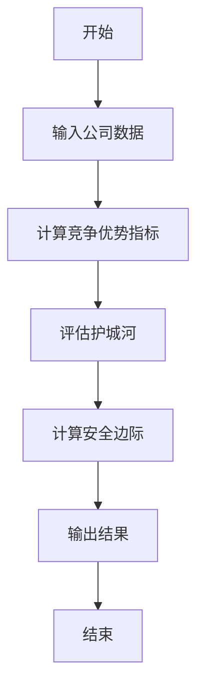
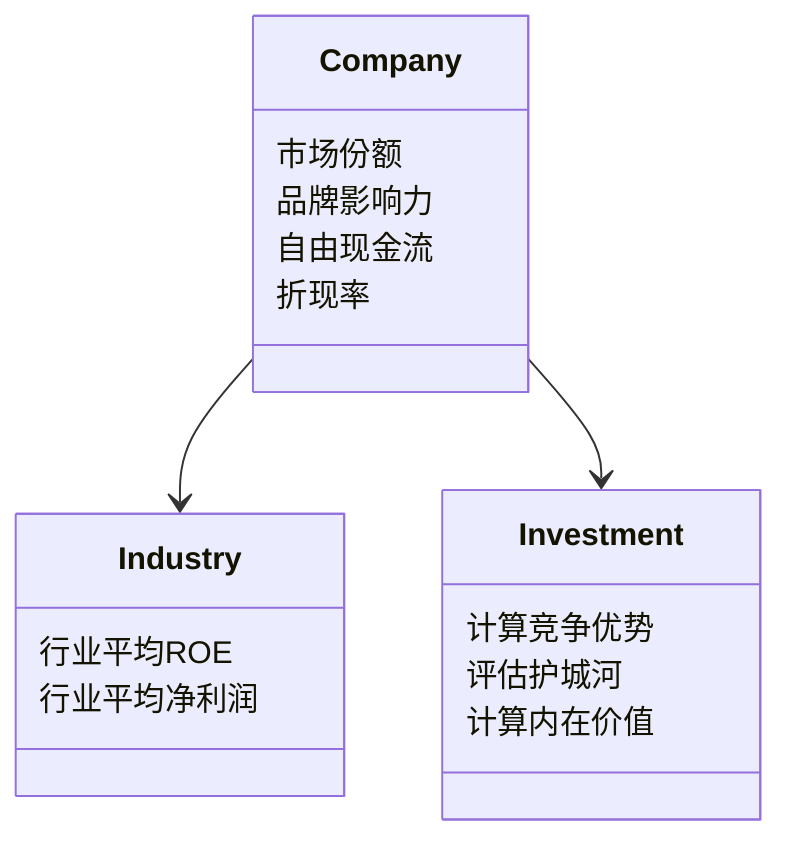
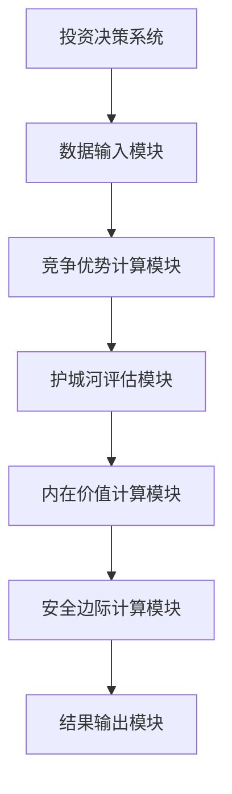
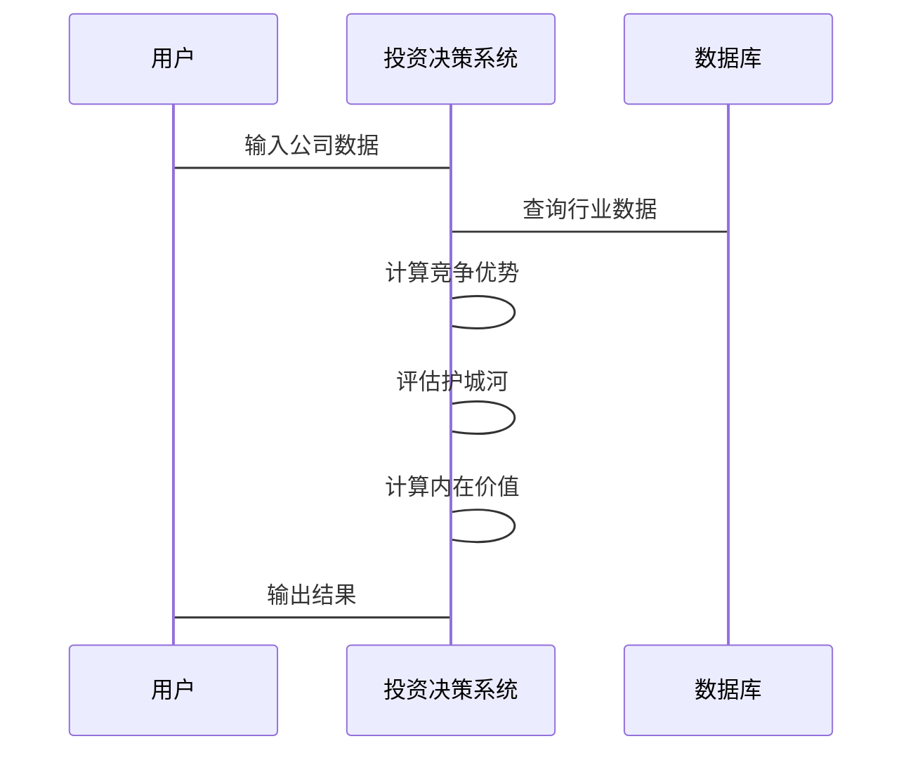

                 


# 《芒格的"反向工程"思维在投资中的应用》

> 关键词：芒格，反向工程，投资，竞争优势，护城河，安全边际

> 摘要：本文深入探讨了芒格的"反向工程"思维在投资决策中的应用，从核心概念、数学模型、算法原理到系统架构，结合实际案例分析，详细解读了如何通过反向工程思维发现投资机会、评估企业价值，并最终实现稳健的投资回报。

---

# 第一部分：芒格的"反向工程"思维概述

## 第1章：投资的基础概念与芒格思维的起源

### 1.1 投资的基本概念

#### 1.1.1 投资的定义与分类
投资是指将资金投入到某种资产或企业中，以期在未来获得收益或资本增值的行为。根据投资对象的不同，可以将投资分为以下几类：
- **股票投资**：购买公司股权，成为股东。
- **债券投资**：购买公司或政府发行的债券，定期获得利息。
- **房地产投资**：购买土地或房产，通过租金或升值获利。
- **其他投资**：包括黄金、艺术品等。

#### 1.1.2 投资的基本原则
成功的投资需要遵循一些基本原则，包括：
- **价值投资**：关注企业的内在价值，而非市场的短期波动。
- **分散投资**：降低风险，避免过度集中。
- **长期投资**：耐心持有优质资产，避免频繁交易。

#### 1.1.3 芒格思维的起源
芒格（Charlie Munger）是世界著名投资家巴菲特（Warren Buffett）的长期合作伙伴。芒格的投资理念深受其物理学背景影响，他将投资视为一种“反向工程”过程。他认为，投资的本质是通过分析企业的内在价值，寻找那些具有强大竞争优势的企业，并长期持有。

### 1.2 芒格投资理念的核心思想

#### 1.2.1 "反向工程"思维的定义
反向工程思维是指从结果出发，逆向推导出原因或方法。在投资中，这意味着从企业的市场表现、财务数据和行业地位出发，分析其竞争优势、护城河和内在价值。

#### 1.2.2 芒格投资理念的特点
- **注重企业基本面**：关注企业的财务数据、行业地位和竞争优势。
- **寻找护城河**：寻找那些具有强大竞争优势和护城河的公司，确保其长期盈利能力。
- **安全边际**：在投资时，确保买入价格低于企业的内在价值，以留有安全边际。

#### 1.2.3 芒格思维与其他投资方法的对比
以下是芒格反向工程思维与其他投资方法的对比：

| 投资方法 | 核心思想 | 优势 | 局限性 |
|----------|----------|------|--------|
| 技术分析 | 通过价格走势预测市场 | 短期操作性强 | 易受市场情绪影响 |
| 基本面分析 | 关注企业的财务数据 | 更具稳定性 | 需要大量数据支持 |
| 芒格反向工程思维 | 从结果推导原因，寻找竞争优势 | 确保投资标的的长期价值 | 需要深入分析，耗时较长 |

### 1.3 芒格思维在投资中的应用价值

#### 1.3.1 芒格思维的核心优势
- **长期视角**：芒格的反向工程思维注重企业的长期价值，而非短期波动。
- **竞争优势识别**：通过分析企业的竞争优势和护城河，筛选出具有长期盈利能力的公司。
- **安全边际**：确保买入价格低于内在价值，降低投资风险。

#### 1.3.2 芒格思维在投资决策中的作用
芒格思维可以帮助投资者避免情绪化决策，从理性的角度分析投资标的的价值。通过识别企业的竞争优势和护城河，投资者可以更好地规避短期市场波动带来的风险。

#### 1.3.3 芒格思维的局限性与适用场景
尽管芒格思维在长期投资中表现优异，但在短期市场波动较大或企业基本面突然变化时，可能会显得迟钝。因此，芒格思维更适合长期价值投资者，而非短期交易者。

### 1.4 本章小结
本章介绍了投资的基本概念和芒格反向工程思维的起源，强调了芒格思维在投资中的长期视角和竞争优势识别能力。通过对比其他投资方法，突出了芒格思维的核心优势和适用场景。

---

## 第2章：芒格"反向工程"思维的核心概念与原理

### 2.1 "反向工程"思维的定义与特点

#### 2.1.1 "反向工程"思维的定义
反向工程思维是一种从结果出发，逆向推导原因或方法的思维方式。在投资中，这意味着从企业的市场表现、财务数据和行业地位出发，分析其竞争优势、护城河和内在价值。

#### 2.1.2 "反向工程"思维的特点
- **结果导向**：从企业的市场表现出发，分析其内在原因。
- **长期视角**：关注企业的长期价值和竞争优势。
- **理性分析**：通过数据和逻辑推导，避免情绪化决策。

### 2.2 芒格思维的核心概念体系

#### 2.2.1 核心概念1：竞争优势
竞争优势是指企业在市场上相对于竞争对手的独特优势。这些优势可以是技术、品牌、成本、资源等。以下是竞争优势的分类：

| 竞争优势类型 | 定义 | 示例 |
|--------------|------|------|
| 技术优势 | 拥有独特的技术或专利 | 苹果的创新技术 |
| 品牌优势 | 品牌知名度高，消费者忠诚度高 | 可口可乐的品牌影响力 |
| 成本优势 | 生产成本低于竞争对手 | 麦当劳的规模化效应 |

#### 2.2.2 核心概念2：护城河
护城河是指企业在市场上难以被竞争对手复制或超越的独特优势。强大的护城河可以确保企业在长期竞争中保持领先地位。以下是护城河的常见形式：

| 护城河类型 | 定义 | 示例 |
|------------|------|------|
| 技术护城河 | 通过技术专利或独特技术保持竞争优势 | 英特尔的芯片技术 |
| 品牌护城河 | 通过强大的品牌影响力吸引消费者 | 耐克的品牌价值 |
| 成本护城河 | 通过规模化生产降低成本 | 麦当劳的供应链优势 |

#### 2.2.3 核心概念3：安全边际
安全边际是指买入价格低于企业的内在价值，从而在市场波动时仍能获得收益。安全边际的计算公式如下：

$$ \text{安全边际} = \text{内在价值} - \text{买入价格} $$

### 2.3 芒格思维的原理与逻辑

#### 2.3.1 芒格思维的逻辑框架
芒格的反向工程思维可以通过以下步骤进行：

1. **分析企业的财务数据**：计算ROE（净资产收益率）、ROA（资产回报率）等指标，评估企业的盈利能力。
2. **识别竞争优势**：分析企业的竞争优势，如技术优势、品牌优势等。
3. **评估护城河**：判断企业的护城河是否强大，能否长期保持竞争优势。
4. **计算内在价值**：使用DCF（现金流折现法）等方法，估算企业的内在价值。
5. **确定买入价格**：确保买入价格低于内在价值，留有安全边际。

#### 2.3.2 芒格思维的数学模型
以下是芒格思维中常用的数学模型：

1. **ROE（净资产收益率）**：
$$ \text{ROE} = \frac{\text{净利润}}{\text{净资产}} $$

2. **ROA（资产回报率）**：
$$ \text{ROA} = \frac{\text{净利润}}{\text{总资产}} $$

3. **DCF（现金流折现法）**：
$$ \text{内在价值} = \sum_{t=1}^{n} \frac{\text{现金流}}{(1 + r)^t} $$

其中，\( r \) 是折现率。

#### 2.3.3 芒格思维的实践步骤
以下是芒格思维的实践步骤：

1. **选择行业**：选择具有成长性的行业，如科技、消费等领域。
2. **筛选企业**：寻找那些具有强大竞争优势和护城河的企业。
3. **分析财务数据**：计算ROE、ROA等指标，评估企业的盈利能力。
4. **计算内在价值**：使用DCF模型估算企业的内在价值。
5. **确定买入价格**：确保买入价格低于内在价值，留有安全边际。
6. **长期持有**：耐心持有优质资产，避免频繁交易。

### 2.4 本章小结
本章详细介绍了芒格反向工程思维的核心概念，包括竞争优势、护城河和安全边际。通过数学模型和实践步骤，展示了如何通过这些概念进行投资决策。

---

## 第3章：芒格思维的数学模型与算法原理

### 3.1 芒格思维的数学模型

#### 3.1.1 竞争优势的量化模型
竞争优势可以通过以下公式量化：

$$ \text{竞争优势} = \frac{\text{企业净利润}}{\text{行业平均净利润}} $$

#### 3.1.2 护城河的评估公式
护城河的评估可以通过以下公式进行：

$$ \text{护城河强度} = \text{市场份额} \times \text{品牌影响力} $$

其中，市场份额可以通过企业的收入占行业总收入的比例来衡量，品牌影响力可以通过市场调研或品牌价值评估来确定。

#### 3.1.3 安全边际的计算方法
安全边际的计算公式如下：

$$ \text{安全边际} = \text{内在价值} - \text{买入价格} $$

### 3.2 芒格思维的算法实现

#### 3.2.1 竞争优势的识别算法
以下是竞争优势的识别算法：

1. **收集数据**：收集企业的财务数据和行业数据。
2. **计算ROE和ROA**：使用ROE和ROA公式计算企业的盈利能力。
3. **比较行业平均水平**：将企业的ROE和ROA与行业平均水平进行比较。
4. **判断竞争优势**：如果企业的ROE和ROA显著高于行业平均水平，则认为企业具有竞争优势。

#### 3.2.2 护城河的评估算法
以下是护城河的评估算法：

1. **收集数据**：收集企业的市场份额和品牌影响力数据。
2. **计算市场份额**：计算企业的收入占行业总收入的比例。
3. **评估品牌影响力**：通过市场调研或品牌价值评估确定品牌影响力。
4. **计算护城河强度**：使用护城河强度公式计算护城河强度。

#### 3.2.3 安全边际的计算算法
以下是安全边际的计算算法：

1. **计算内在价值**：使用DCF模型估算企业的内在价值。
2. **确定买入价格**：选择低于内在价值的价格买入。
3. **计算安全边际**：使用安全边际公式计算安全边际。

### 3.3 算法的流程图与代码实现

#### 3.3.1 算法流程图（使用mermaid）


#### 3.3.2 算法代码实现（Python示例）

```python
def calculate_competitive_edge(company_data):
    # 计算竞争优势指标
    industry_avg_roe = company_data['行业平均ROE']
    company_roe = company_data['公司ROE']
    competitive_edge = company_roe / industry_avg_roe
    return competitive_edge

def assess_moat(company_data):
    # 评估护城河
    market_share = company_data['市场份额']
    brand_influence = company_data['品牌影响力']
    moat_strength = market_share * brand_influence
    return moat_strength

def calculate_intrinsic_value(company_data):
    # 计算内在价值（简化版DCF模型）
    free_cash_flow = company_data['自由现金流']
    discount_rate = company_data['折现率']
    n = company_data['预测年数']
    intrinsic_value = 0
    for i in range(n):
        intrinsic_value += free_cash_flow / (1 + discount_rate) ** (i + 1)
    return intrinsic_value

def main():
    # 示例数据
    company_data = {
        '行业平均ROE': 0.1,
        '公司ROE': 0.15,
        '市场份额': 0.3,
        '品牌影响力': 0.8,
        '自由现金流': 1000000,
        '折现率': 0.1,
        '预测年数': 5
    }
    # 计算竞争优势
    ce = calculate_competitive_edge(company_data)
    # 评估护城河
    moat = assess_moat(company_data)
    # 计算内在价值
    iv = calculate_intrinsic_value(company_data)
    # 输出结果
    print(f"竞争优势：{ce}")
    print(f"护城河强度：{moat}")
    print(f"内在价值：{iv}")
    
if __name__ == "__main__":
    main()
```

### 3.4 本章小结
本章通过数学模型和算法实现，详细介绍了如何通过反向工程思维进行投资决策。通过Python代码和流程图，展示了如何量化竞争优势、评估护城河和计算安全边际。

---

## 第4章：芒格思维的系统架构与实现

### 4.1 系统架构设计

#### 4.1.1 系统功能设计（领域模型）



#### 4.1.2 系统架构设计（架构图）



### 4.2 系统接口设计

#### 4.2.1 输入接口
- **公司数据**：包括市场份额、品牌影响力、自由现金流等。
- **行业数据**：包括行业平均ROE、行业平均净利润等。

#### 4.2.2 输出接口
- **竞争优势指标**
- **护城河强度**
- **内在价值**
- **安全边际**

### 4.3 系统交互设计（序列图）



### 4.4 本章小结
本章通过系统架构设计，展示了如何将芒格的反向工程思维应用于投资决策系统。通过模块化设计和接口设计，确保系统能够高效地进行投资分析。

---

## 第5章：项目实战——基于芒格思维的投资分析

### 5.1 项目背景与目标

#### 5.1.1 项目背景
假设我们是一家投资机构，希望通过芒格的反向工程思维，筛选出具有强大竞争优势和护城河的公司。

#### 5.1.2 项目目标
- 筛选出具有强大竞争优势的公司。
- 评估公司的护城河强度。
- 计算公司的内在价值和安全边际。
- 为投资决策提供数据支持。

### 5.2 数据收集与处理

#### 5.2.1 数据来源
- 公司财务数据：包括净利润、ROE、ROA等。
- 行业数据：包括行业平均ROE、行业平均净利润等。
- 市场数据：包括公司市场份额、品牌影响力等。

#### 5.2.2 数据处理
将收集到的数据进行清洗和整理，确保数据的准确性和完整性。

### 5.3 竞争优势分析

#### 5.3.1 计算竞争优势指标
使用ROE和ROA公式，计算公司的竞争优势指标。

#### 5.3.2 竞争优势评估
将公司的竞争优势指标与行业平均水平进行比较，判断公司是否具有竞争优势。

### 5.4 护城河评估

#### 5.4.1 计算市场份额和品牌影响力
通过市场调研或公开数据，获取公司的市场份额和品牌影响力。

#### 5.4.2 评估护城河强度
使用护城河强度公式，计算公司的护城河强度。

### 5.5 内在价值计算

#### 5.5.1 收集现金流数据
获取公司的自由现金流数据。

#### 5.5.2 计算内在价值
使用DCF模型，计算公司的内在价值。

### 5.6 安全边际计算

#### 5.6.1 确定买入价格
确保买入价格低于内在价值。

#### 5.6.2 计算安全边际
使用安全边际公式，计算安全边际。

### 5.7 投资决策

#### 5.7.1 确定投资标的
选择具有强大竞争优势和护城河的公司。

#### 5.7.2 确定买入价格
确保买入价格低于内在价值，留有安全边际。

#### 5.7.3 制定投资策略
制定长期持有策略，避免频繁交易。

### 5.8 项目小结
本章通过一个实际项目，展示了如何将芒格的反向工程思维应用于投资分析。通过数据收集、竞争优势分析、护城河评估和内在价值计算，最终确定投资标的和买入价格。

---

## 第6章：芒格思维的投资策略与实战技巧

### 6.1 投资策略

#### 6.1.1 长期投资
芒格的反向工程思维强调长期投资，关注企业的长期价值。

#### 6.1.2 价值投资
通过分析企业的内在价值，寻找那些被市场低估的企业。

#### 6.1.3 分散投资
通过分散投资降低风险，避免过度集中。

### 6.2 投资实战技巧

#### 6.2.1 精选行业
选择具有成长性的行业，如科技、消费等领域。

#### 6.2.2 深入分析
通过财务数据和行业地位，深入分析企业的竞争优势和护城河。

#### 6.2.3 确保安全边际
在买入价格上留有安全边际，降低投资风险。

### 6.3 案例分析

#### 6.3.1 案例背景
假设我们分析一家科技公司，以下是其数据：

| 数据项 | 数值 |
|--------|------|
| 净利润 | 1000万元 |
| 净资产 | 5000万元 |
| 行业平均ROE | 0.1 |
| 市场份额 | 0.25 |
| 品牌影响力 | 0.7 |
| 自由现金流 | 500万元 |
| 折现率 | 0.1 |
| 预测年数 | 5 |

#### 6.3.2 分析过程
1. **计算ROE**：
$$ \text{ROE} = \frac{1000}{5000} = 0.2 $$

2. **计算竞争优势**：
$$ \text{竞争优势} = \frac{0.2}{0.1} = 2 $$

3. **计算市场份额和品牌影响力**：
$$ \text{护城河强度} = 0.25 \times 0.7 = 0.175 $$

4. **计算内在价值**：
$$ \text{内在价值} = \sum_{t=1}^{5} \frac{500}{(1 + 0.1)^t} = 2123.45 \text{万元} $$

5. **确定买入价格**：
$$ \text{买入价格} = \text{内在价值} \times 0.9 = 2123.45 \times 0.9 = 1911.11 \text{万元} $$

6. **计算安全边际**：
$$ \text{安全边际} = 2123.45 - 1911.11 = 212.34 \text{万元} $$

#### 6.3.3 投资决策
根据分析结果，该科技公司具有强大的竞争优势和护城河，内在价值为2123.45万元，建议以1911.11万元的价格买入，留有212.34万元的安全边际。

### 6.4 本章小结
本章通过实战技巧和案例分析，展示了如何将芒格的反向工程思维应用于具体投资决策。通过精选行业、深入分析和确保安全边际，投资者可以更好地发现投资机会并降低风险。

---

## 第7章：芒格思维的优化与扩展

### 7.1 芒格思维的优化

#### 7.1.1 数据优化
通过引入更多的数据源，如社交媒体数据、客户反馈等，进一步优化分析结果。

#### 7.1.2 模型优化
通过机器学习等技术，优化竞争优势和护城河的评估模型。

### 7.2 芒格思维的扩展

#### 7.2.1 多元化投资
将芒格思维应用于多种投资领域，如股票、债券、房地产等。

#### 7.2.2 全球化投资
将芒格思维扩展到全球市场，寻找具有全球竞争优势的企业。

### 7.3 芒格思维的未来发展方向

#### 7.3.1 技术驱动
随着人工智能和大数据技术的发展，芒格思维可以通过技术手段进一步优化。

#### 7.3.2 全球化视角
从全球视角出发，寻找具有全球竞争优势的企业。

### 7.4 本章小结
本章探讨了芒格思维的优化与扩展方向，通过技术驱动和全球化视角，进一步提升芒格思维的应用效果。

---

## 第8章：总结与展望

### 8.1 总结
芒格的反向工程思维是一种从结果出发，逆向推导原因或方法的思维方式。通过分析企业的竞争优势、护城河和内在价值，投资者可以更好地发现投资机会并降低风险。

### 8.2 展望
随着技术的进步和数据的丰富，芒格思维可以通过技术手段进一步优化。未来，芒格思维将更加广泛地应用于全球投资领域，帮助投资者实现稳健的投资回报。

---

## 作者：AI天才研究院/AI Genius Institute & 禅与计算机程序设计艺术 /Zen And The Art of Computer Programming

