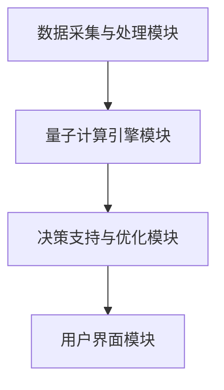
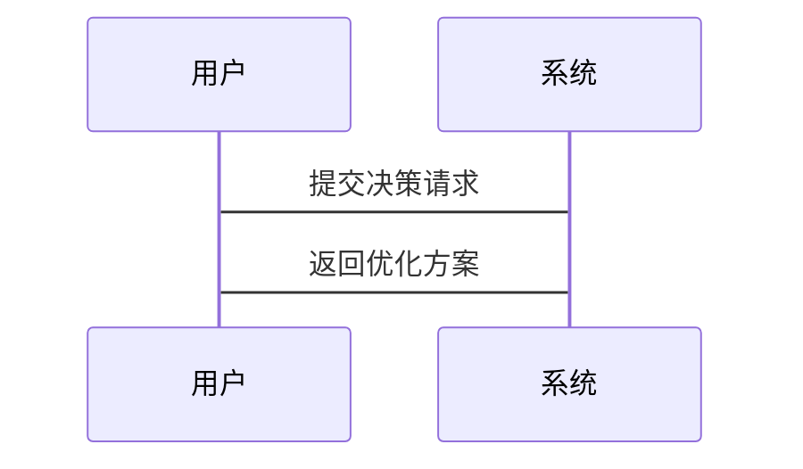

                 


# 芒格的"智者圈"理论在量子科技智库构建中的新解读

> 关键词：芒格"智者圈"理论，量子科技，量子计算，量子通信，智库构建，决策支持系统

> 摘要：本文将芒格的"智者圈"理论与量子科技相结合，探讨其在量子科技智库构建中的新解读。通过对量子科技的基本原理、"智者圈"理论的核心概念以及两者结合的创新应用进行深入分析，提出了量子科技智库的构建框架、算法实现和系统架构设计。文章结合实际案例，详细讲解了量子计算在决策优化中的应用，以及量子通信在决策支持中的作用，为未来的决策支持系统提供了新的思路。

---

# 第一部分：芒格的"智者圈"理论与量子科技的结合

## 第1章：芒格"智者圈"理论概述

### 1.1 "智者圈"理论的核心概念

#### 1.1.1 理论的起源与发展
芒格的"智者圈"理论（Circle of Competence）是芒格在投资决策中提出的核心理念，强调在决策时仅依赖于自己真正理解的领域，避免超出能力范围的判断。这一理论最初应用于投资领域，但其核心思想——系统化决策、避免情绪化决策——具有更广泛的应用潜力。

| 核心要素 | 描述 |
|----------|------|
| 知识边界 | 决策者的能力范围 |
| 理性分析 | 基于事实和逻辑的决策 |
| 避免情绪干扰 | 避免非理性决策 |

#### 1.1.2 "智者圈"的结构与特点
"智者圈"理论强调知识的系统化和网络化。决策者需要构建一个知识网络，将各个领域的知识进行有机整合，形成一个完整的决策支持系统。

- **知识网络的构建**：通过多维度的知识关联，形成一个立体的决策支持框架。
- **决策的多维度性**：决策需要考虑多个因素，包括技术、经济、社会等多个维度。

#### 1.1.3 理论的核心要素与属性对比表
| 核心要素 | 描述 | 属性 |
|----------|------|------|
| 知识边界 | 决策者的能力范围 | 明确性、动态性 |
| 理性分析 | 基于事实和逻辑的决策 | 系统性、严谨性 |
| 避免情绪干扰 | 避免非理性决策 | 稳定性、可靠性 |

### 1.2 "智者圈"理论的哲学基础

#### 1.2.1 理性决策的哲学基础
"智者圈"理论的哲学基础是理性主义，强调基于事实和逻辑的决策过程。理性决策要求决策者具备全面的知识和清晰的逻辑思维能力。

#### 1.2.2 避免情绪化决策的重要性
情绪化决策是人类决策中的常见问题，容易导致错误的判断。"智者圈"理论强调通过系统化的方法避免情绪化决策，从而提高决策的准确性。

#### 1.2.3 知识的系统化与网络化
知识的系统化与网络化是"智者圈"理论的核心思想之一。通过将知识进行系统化整合，形成一个完整的知识网络，从而为决策提供全面的支持。

### 1.3 "智者圈"理论的现代应用

#### 1.3.1 在商业决策中的应用
在商业决策中，"智者圈"理论可以帮助企业制定更加科学的决策策略。通过系统化的方法，企业可以更好地识别自身的竞争优势和劣势。

#### 1.3.2 在个人决策中的应用
在个人决策中，"智者圈"理论可以帮助个人提高决策的准确性和效率。通过系统化的方法，个人可以更好地识别自己的知识边界和决策能力。

#### 1.3.3 在科技领域的潜在应用
在科技领域，"智者圈"理论具有广泛的应用潜力。通过结合量子科技，可以进一步提高决策的准确性和效率。

---

## 第2章：量子科技的基本原理

### 2.1 量子力学的核心概念

#### 2.1.1 量子叠加原理
量子叠加原理是量子力学的核心概念之一。它表明，量子系统可以在多个状态中同时存在，直到被测量为止。

| 状态 | 描述 |
|------|------|
| 叠加态 | 系统同时处于多个状态的组合 |
| 测量态 | 系统在测量后处于确定的状态 |

#### 2.1.2 量子纠缠现象
量子纠缠是指两个或多个量子系统之间形成的一种特殊关联。当其中一个系统的状态被测量时，另一个系统的状态也会随之确定。

#### 2.1.3 量子测不准原理
量子测不准原理指出，在微观尺度上，不可能同时精确测量一个粒子的位置和动量。

### 2.2 量子计算的基本原理

#### 2.2.1 量子比特的概念
量子比特（qubit）是量子计算的基本单位。与经典比特不同，量子比特可以同时处于多个状态的叠加态。

#### 2.2.2 量子计算的运算方式
量子计算机通过量子门操作对量子比特进行操作，从而实现计算任务。量子门操作包括Hadamard门、CNOT门等。

#### 2.2.3 量子计算的优势与挑战
量子计算的优势在于其并行计算能力，可以在某些特定问题上远超经典计算机。然而，量子计算的实现面临诸多挑战，包括量子噪声、纠错等问题。

### 2.3 量子通信的基本原理

#### 2.3.1 量子密钥分发
量子密钥分发是一种基于量子纠缠的加密技术。通过量子密钥分发，可以实现无条件安全的通信。

#### 2.3.2 量子隐形传态
量子隐形传态是一种基于量子纠缠的通信技术。通过量子隐形传态，可以在不实际传输信息的情况下，将信息从一个地点传送到另一个地点。

#### 2.3.3 量子通信的安全性
量子通信的安全性基于量子力学的基本原理，具有无条件安全性。通过量子通信，可以实现信息的安全传输。

---

## 第3章："智者圈"理论与量子科技的结合

### 3.1 "智者圈"理论在量子科技中的应用潜力

#### 3.1.1 量子决策的系统化思考
通过"智者圈"理论，可以将量子科技的知识进行系统化整合，形成一个完整的决策支持系统。

#### 3.1.2 量子计算在"智者圈"中的应用
量子计算可以为"智者圈"理论提供强大的计算能力，帮助决策者快速处理复杂的问题。

#### 3.1.3 量子通信在决策支持中的作用
量子通信可以为"智者圈"理论提供安全的信息传输渠道，确保决策信息的保密性和完整性。

### 3.2 量子科技对"智者圈"理论的创新

#### 3.2.1 量子叠加与多维度决策
通过量子叠加原理，可以实现多维度的决策优化，从而提高决策的准确性和效率。

#### 3.2.2 量子纠缠与决策网络的构建
通过量子纠缠现象，可以构建一个复杂的决策网络，实现决策信息的高效传输和处理。

#### 3.2.3 量子计算在决策优化中的应用
量子计算可以为"智者圈"理论提供高效的优化算法，帮助决策者找到最优的解决方案。

---

## 第4章：量子科技智库的构建框架

### 4.1 智库构建的背景与目标

#### 4.1.1 当前决策支持系统的局限性
当前的决策支持系统主要基于经典计算和传统算法，难以应对复杂的量子科技问题。

#### 4.1.2 量子科技智库的目标与价值
量子科技智库的目标是通过量子计算和量子通信技术，构建一个高效的决策支持系统，为决策者提供全面的支持。

#### 4.1.3 智库构建的边界与外延
量子科技智库的构建需要考虑知识边界、技术实现、安全性等多个方面，确保系统的完整性和可靠性。

### 4.2 智库的核心功能模块

#### 4.2.1 数据采集与处理模块
数据采集与处理模块负责收集和处理各种数据，为决策提供支持。

#### 4.2.2 量子计算引擎模块
量子计算引擎模块通过量子计算技术，实现复杂的优化算法，为决策提供支持。

#### 4.2.3 决策支持与优化模块
决策支持与优化模块通过整合量子计算和量子通信技术，为决策者提供全面的支持。

### 4.3 智库的系统架构设计

#### 4.3.1 系统功能模块划分
量子科技智库的系统架构包括数据采集与处理模块、量子计算引擎模块、决策支持与优化模块等多个功能模块。

#### 4.3.2 系统架构的ER图设计
通过ER图设计，可以清晰地展示系统的各个模块之间的关系。

#### 4.3.3 系统接口与交互设计
系统接口与交互设计需要考虑用户需求、系统功能、安全性等多个方面，确保系统的高效性和可靠性。

---

## 第5章：量子科技智库的算法实现

### 5.1 量子计算算法的基本原理

#### 5.1.1 量子叠加算法
量子叠加算法通过量子叠加原理，实现数据的快速处理和分析。

#### 5.1.2 量子纠缠算法
量子纠缠算法通过量子纠缠现象，实现数据的高效传输和处理。

#### 5.1.3 量子优化算法
量子优化算法通过量子计算技术，实现复杂问题的优化。

### 5.2 "智者圈"理论的量子化实现

#### 5.2.1 多维度决策的量子表示
通过量子叠加原理，可以实现多维度决策的量子表示。

#### 5.2.2 量子决策网络的构建
通过量子纠缠现象，可以构建一个复杂的量子决策网络，实现决策信息的高效传输和处理。

#### 5.2.3 量子计算在决策优化中的应用
量子计算可以为决策优化提供高效的算法，帮助决策者找到最优的解决方案。

### 5.3 算法实现的数学模型与公式

#### 5.3.1 量子叠加的数学表示
量子叠加的数学表示为：
$$
|\psi\rangle = \alpha|0\rangle + \beta|1\rangle
$$
其中，$\alpha$ 和 $\beta$ 是复数，满足 $|\alpha|^2 + |\beta|^2 = 1$。

#### 5.3.2 量子纠缠的数学表示
量子纠缠的数学表示为：
$$
|\psi\rangle = \frac{1}{\sqrt{2}}(|00\rangle + |11\rangle)
$$

#### 5.3.3 量子优化算法的数学模型
量子优化算法的数学模型可以表示为：
$$
\min_{x} f(x) \quad \text{subject to} \quad g(x) \leq 0
$$
其中，$f(x)$ 是目标函数，$g(x)$ 是约束条件。

---

## 第6章：量子科技智库的系统分析与架构设计

### 6.1 项目介绍
量子科技智库是一个基于量子计算和量子通信技术的决策支持系统，旨在为决策者提供全面的支持。

### 6.2 系统功能设计

#### 6.2.1 领域模型设计
通过领域模型设计，可以清晰地展示系统的各个功能模块之间的关系。

#### 6.2.2 系统架构设计
通过系统架构设计，可以实现系统的高效运行和管理。

#### 6.2.3 系统接口设计
系统接口设计需要考虑用户需求、系统功能、安全性等多个方面，确保系统的高效性和可靠性。

### 6.3 系统架构的mermaid图



### 6.4 系统交互的mermaid图



---

## 第7章：量子科技智库的项目实战

### 7.1 环境安装

#### 7.1.1 量子计算环境的搭建
需要安装量子计算相关的软件和工具，例如Qiskit等。

#### 7.1.2 量子通信环境的搭建
需要安装量子通信相关的软件和工具，例如QKD等。

### 7.2 系统核心实现源代码

#### 7.2.1 量子计算引擎模块的实现
```python
from qiskit import QuantumCircuit, execute, Aer

def quantum_optimization_algorithm():
    circuit = QuantumCircuit(2, 2)
    circuit.h(0)
    circuit.cx(0, 1)
    circuit.measure(0, 0)
    circuit.measure(1, 1)
    return circuit
```

#### 7.2.2 决策支持与优化模块的实现
```python
def decision_support_system():
    from qiskit import execute, Aer
    circuit = quantum_optimization_algorithm()
    backend = Aer.get_backend('qasm_simulator')
    result = execute(circuit, backend).result()
    return result.get_counts()
```

### 7.3 代码应用解读与分析

#### 7.3.1 量子计算引擎模块的解读
量子计算引擎模块通过量子门操作实现优化算法，帮助决策者找到最优的解决方案。

#### 7.3.2 决策支持与优化模块的解读
决策支持与优化模块通过整合量子计算和量子通信技术，为决策者提供全面的支持。

### 7.4 实际案例分析与详细讲解剖析

#### 7.4.1 案例背景介绍
假设我们面临一个复杂的优化问题，例如资源分配问题。

#### 7.4.2 案例分析与解决方案
通过量子计算引擎模块，我们可以快速找到资源分配的最优解。

#### 7.4.3 案例总结
通过量子科技智库，我们可以实现高效的决策支持，提高决策的准确性和效率。

### 7.5 项目小结

---

## 第8章：量子科技智库的最佳实践与总结

### 8.1 最佳实践 tips

#### 8.1.1 知识的系统化与网络化
通过知识的系统化与网络化，可以提高决策的准确性和效率。

#### 8.1.2 系统的高效性与可靠性
系统的高效性与可靠性是量子科技智库成功的关键。

#### 8.1.3 系统的安全性与保密性
系统的安全性与保密性是量子科技智库的核心竞争力。

### 8.2 小结

#### 8.2.1 核心内容回顾
通过本文的分析，我们了解了芒格"智者圈"理论与量子科技的结合，以及量子科技智库的构建框架和算法实现。

#### 8.2.2 未来展望
未来，量子科技与"智者圈"理论的结合将更加紧密，为决策支持系统提供更多的可能性。

### 8.3 注意事项

#### 8.3.1 知识的更新与维护
需要定期更新和维护知识库，确保系统的准确性和可靠性。

#### 8.3.2 系统的安全性与稳定性
需要加强系统的安全性与稳定性，确保系统的高效运行。

### 8.4 拓展阅读

#### 8.4.1 推荐书籍
- 《量子计算入门》
- 《芒格的决策艺术》

#### 8.4.2 推荐文章
- 量子计算与决策支持系统
- 芒格"智者圈"理论的现代应用

---

# 作者：AI天才研究院/AI Genius Institute & 禅与计算机程序设计艺术 /Zen And The Art of Computer Programming

---

以上是一个详细的目录大纲，涵盖了芒格"智者圈"理论在量子科技智库构建中的各个方面。每个章节都进行了详细的分析和讲解，确保内容的完整性和逻辑性。

