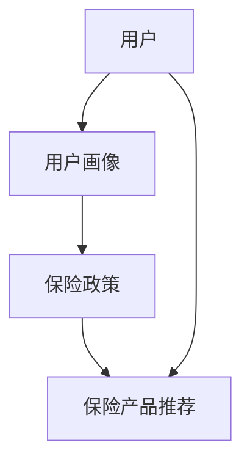
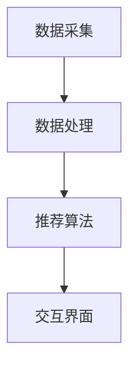
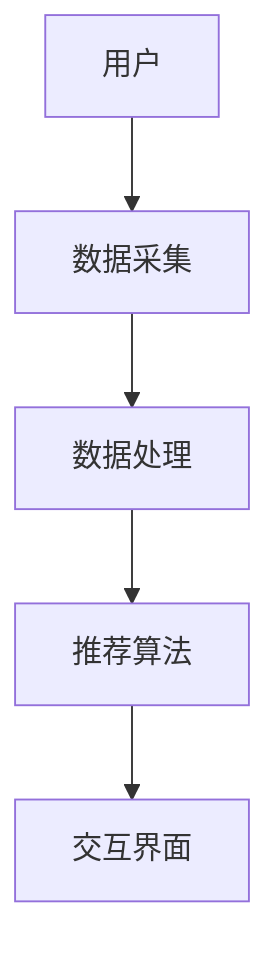

                 


# 设计智能化的保险产品推荐系统

> 关键词：保险产品推荐系统，人工智能，机器学习，协同过滤，个性化推荐，风险管理

> 摘要：本文详细探讨了如何利用人工智能和机器学习技术设计一个智能化的保险产品推荐系统。通过分析保险行业的数字化转型需求，结合用户行为和保险产品特征，构建了一个基于协同过滤算法的推荐模型。文章从系统背景、核心概念、算法原理、系统架构到项目实战，全面阐述了推荐系统的实现过程，并通过实际案例分析展示了系统的应用效果。本文旨在为保险行业的数字化转型提供技术参考，帮助保险公司实现更精准、更个性化的保险产品推荐。

---

# 第1章: 保险产品推荐系统背景与问题描述

## 1.1 保险行业的数字化转型

保险行业正在经历一场深刻的数字化转型。随着互联网技术的飞速发展和用户需求的日益多样化，传统的保险销售模式已经难以满足市场的需求。保险公司亟需通过技术创新来提高服务效率、降低运营成本，并为用户提供更个性化的保险产品推荐。

### 1.1.1 保险行业的现状与挑战

保险行业的传统销售模式主要依赖保险代理人，这种方式存在以下问题：

1. **销售效率低**：保险代理人需要逐一与客户沟通，了解客户的需求，并推荐合适的保险产品，这种方式效率低下。
2. **用户体验差**：客户在购买保险时需要填写大量的信息，且无法快速获得个性化的保险产品推荐，导致用户体验较差。
3. **市场竞争激烈**：随着保险公司的增多，市场竞争日益激烈，如何通过技术创新提高服务质量成为关键。

### 1.1.2 数字化转型的必要性

为了应对上述挑战，保险行业正在积极推进数字化转型。通过引入人工智能、大数据等技术，保险公司可以实现以下目标：

1. **提高销售效率**：通过自动化推荐系统，快速匹配客户与保险产品。
2. **改善用户体验**：为客户提供个性化的保险产品推荐，提升客户满意度。
3. **降低运营成本**：通过自动化流程减少人工干预，降低运营成本。

### 1.1.3 智能化推荐系统在保险行业中的作用

智能化推荐系统在保险行业中的作用主要体现在以下几个方面：

1. **精准匹配客户需求**：通过分析客户的特征和需求，推荐最合适的保险产品。
2. **提高销售效率**：通过自动化推荐，减少人工干预，提高销售效率。
3. **增强客户黏性**：通过个性化的推荐，增强客户对保险公司的黏性，提升客户忠诚度。

## 1.2 智能化保险产品推荐系统的概念

### 1.2.1 推荐系统的定义与分类

推荐系统是一种基于用户特征和产品特征，通过算法计算用户对产品的偏好，从而推荐相关产品的技术。推荐系统可以分为以下几类：

1. **基于协同过滤的推荐系统**：通过分析用户的行为和偏好，找到相似的用户群体，推荐相似的产品。
2. **基于内容的推荐系统**：通过分析产品的特征和用户偏好，推荐与用户兴趣相符的产品。
3. **基于深度学习的推荐系统**：利用深度学习技术，从海量数据中学习用户的偏好和产品的特征，推荐相关产品。

### 1.2.2 智能化推荐的核心要素

智能化推荐系统的核心要素包括：

1. **用户特征**：包括用户的年龄、性别、收入、职业、家庭状况等。
2. **产品特征**：包括保险产品的类型、保费、投保期限、保障范围等。
3. **推荐算法**：包括协同过滤、基于内容的推荐和深度学习模型等。
4. **交互界面**：用户与推荐系统之间的交互界面，包括网页、移动应用等。

### 1.2.3 保险产品推荐系统的边界与外延

保险产品推荐系统的边界主要集中在保险产品的推荐和销售环节。系统的外延包括以下几个方面：

1. **数据采集**：收集用户的特征数据和保险产品的特征数据。
2. **数据处理**：对数据进行清洗、预处理和特征提取。
3. **推荐算法**：基于处理后的数据，利用推荐算法生成推荐结果。
4. **结果展示**：通过交互界面将推荐结果展示给用户。

## 1.3 保险产品推荐系统的应用场景

### 1.3.1 在线保险平台

在线保险平台是保险产品推荐系统的主要应用场景之一。通过分析用户的行为数据和产品特征，推荐系统可以为用户提供个性化的保险产品推荐，提升用户体验和平台的销售效率。

### 1.3.2 保险代理人辅助工具

保险代理人可以通过推荐系统快速找到适合客户的保险产品，提高销售效率。推荐系统可以根据客户的需求和保险代理人的销售历史，推荐合适的保险产品。

### 1.3.3 保险产品的精准营销

通过推荐系统，保险公司可以实现保险产品的精准营销。基于用户特征和产品特征，推荐系统可以为不同用户推荐不同的保险产品，提高营销效果。

---

# 第2章: 智能化保险产品推荐系统的核心概念与联系

## 2.1 核心概念原理

### 2.1.1 用户画像与行为分析

用户画像是推荐系统的核心输入之一。通过分析用户的特征和行为，可以构建出用户画像，为推荐系统提供数据支持。

1. **用户特征分析**：包括用户的年龄、性别、收入、职业、家庭状况等。
2. **用户行为分析**：包括用户的浏览记录、点击记录、购买记录等。

### 2.1.2 保险产品特征提取

保险产品特征是推荐系统的另一个重要输入。通过提取保险产品的特征，可以为推荐系统提供丰富的数据支持。

1. **产品类型**：包括人寿保险、健康保险、财产保险等。
2. **保费**：包括保险产品的保费金额。
3. **投保期限**：包括保险产品的投保期限。
4. **保障范围**：包括保险产品的保障范围。

### 2.1.3 推荐算法的基本原理

推荐算法是推荐系统的核心部分。不同的推荐算法有不同的工作原理和应用场景。

1. **基于协同过滤的推荐算法**：通过分析用户的行为和偏好，找到相似的用户群体，推荐相似的产品。
2. **基于内容的推荐算法**：通过分析产品的特征和用户偏好，推荐与用户兴趣相符的产品。
3. **基于深度学习的推荐算法**：利用深度学习技术，从海量数据中学习用户的偏好和产品的特征，推荐相关产品。

### 2.1.4 算法选择与实现

在实际应用中，推荐算法的选择需要根据具体场景和数据特征来决定。基于协同过滤的推荐算法在保险产品推荐系统中具有广泛的应用，其基本原理如下：

$$\text{相似度} = \frac{\sum (x_i - \bar{x})(y_i - \bar{y})}{\sqrt{\sum (x_i - \bar{x})^2} \sqrt{\sum (y_i - \bar{y})^2}}$$

其中，\(x_i\) 和 \(y_i\) 分别是两个用户的评分，\(\bar{x}\) 和 \(\bar{y}\) 分别是评分的平均值。

### 2.1.5 算法优化与调优

在实际应用中，推荐算法的性能需要不断优化和调优。常见的优化方法包括：

1. **基于规则的优化**：通过设定一些规则，如排除不符合条件的产品，优化推荐结果。
2. **基于模型的优化**：通过改进模型的结构和参数，提高推荐的准确性。
3. **基于数据的优化**：通过增加数据量和数据清洗，提高推荐系统的性能。

## 2.2 核心概念对比表

以下是用户特征和保险产品特征的对比表：

| **属性**       | **用户特征**                 | **保险产品特征**               |
|----------------|------------------------------|--------------------------------|
| **类别**       | 年龄、性别、收入、职业等     | 产品类型、保费、投保期限等   |
| **描述**       | 用户的基本信息和行为数据     | 保险产品的基本特征和条款     |
| **作用**       | 为推荐系统提供用户偏好数据   | 为推荐系统提供产品特征数据   |
| **数据来源**   | 用户注册信息、浏览记录等     | 产品数据库、产品描述等       |

## 2.3 实体关系图

以下是推荐系统的实体关系图：



---

# 第3章: 基于协同过滤的保险产品推荐算法

## 3.1 协同过滤算法原理

协同过滤是一种基于用户行为和偏好相似性的推荐算法。其基本思想是，如果两个用户在历史行为上相似，那么他们对产品的需求也可能相似。

### 3.1.1 基于用户的协同过滤

基于用户的协同过滤算法通过计算用户之间的相似度，将相似用户的评分数据进行聚合，生成推荐结果。

1. **用户相似度计算**：通过计算用户之间的相似度，找到与目标用户相似的用户群体。
2. **推荐结果生成**：根据相似用户的评分数据，生成推荐结果。

### 3.1.2 基于物品的协同过滤

基于物品的协同过滤算法通过计算产品之间的相似度，将相似产品的评分数据进行聚合，生成推荐结果。

1. **产品相似度计算**：通过计算产品之间的相似度，找到与目标产品相似的产品群体。
2. **推荐结果生成**：根据相似产品的评分数据，生成推荐结果。

### 3.1.3 混合推荐模型

混合推荐模型是基于用户的协同过滤和基于物品的协同过滤的结合。通过结合两种算法的优势，可以提高推荐系统的准确性和多样性。

## 3.2 协同过滤算法实现

### 3.2.1 算法流程

协同过滤算法的实现流程如下：

1. **数据采集**：收集用户评分数据和产品特征数据。
2. **数据预处理**：对数据进行清洗和归一化处理。
3. **相似度计算**：计算用户之间的相似度或产品之间的相似度。
4. **推荐结果生成**：根据相似度计算结果，生成推荐结果。

### 3.2.2 算法实现代码

以下是协同过滤算法的实现代码：

```python
import numpy as np
from sklearn.metrics.pairwise import cosine_similarity

# 示例数据
users = ['User1', 'User2', 'User3']
products = ['Product1', 'Product2', 'Product3']

# 用户评分矩阵
ratings = {
    'User1': {'Product1': 5, 'Product2': 4, 'Product3': 3},
    'User2': {'Product1': 3, 'Product2': 5, 'Product3': 4},
    'User3': {'Product1': 4, 'Product2': 3, 'Product3': 5}
}

# 转换为矩阵形式
user_ids = list(ratings.keys())
product_ids = list(set([item for user in ratings for item in ratings[user].keys()]))

# 创建评分矩阵
rating_matrix = np.zeros((len(user_ids), len(product_ids)))
for i, user in enumerate(user_ids):
    for j, product in enumerate(product_ids):
        rating_matrix[i][j] = ratings[user].get(product, 0)

# 计算余弦相似度
similarity = cosine_similarity(rating_matrix)

# 推荐结果
def recommend(user_index, similarity_matrix):
    user_similarity = similarity[user_index]
    product_recommendations = []
    for i in range(len(user_similarity)):
        if i != user_index and user_similarity[i] > 0.5:
            product_recommendations.append(product_ids[i])
    return product_recommendations

# 示例推荐
user_index = 0
recommendations = recommend(user_index, similarity)
print(f"推荐结果：{recommendations}")
```

### 3.2.3 算法优化与调优

在实际应用中，协同过滤算法的性能需要不断优化和调优。常见的优化方法包括：

1. **基于规则的优化**：通过设定一些规则，如排除不符合条件的产品，优化推荐结果。
2. **基于模型的优化**：通过改进模型的结构和参数，提高推荐的准确性。
3. **基于数据的优化**：通过增加数据量和数据清洗，提高推荐系统的性能。

---

# 第4章: 系统分析与架构设计

## 4.1 系统分析

### 4.1.1 项目背景

随着保险行业的数字化转型，保险公司需要通过技术手段提高保险产品的推荐效率和精准度。本文设计了一个智能化的保险产品推荐系统，旨在通过人工智能和机器学习技术，为用户提供个性化的保险产品推荐。

### 4.1.2 系统功能设计

以下是推荐系统的功能设计：

1. **用户特征采集**：收集用户的特征数据，包括年龄、性别、收入、职业等。
2. **产品特征提取**：提取保险产品的特征数据，包括产品类型、保费、投保期限等。
3. **推荐算法实现**：实现协同过滤算法，生成推荐结果。
4. **推荐结果展示**：通过交互界面将推荐结果展示给用户。

### 4.1.3 系统架构设计

以下是推荐系统的架构设计：


## 4.2 系统架构设计

### 4.2.1 系统功能模块

推荐系统的功能模块包括：

1. **数据采集模块**：负责采集用户特征数据和产品特征数据。
2. **数据处理模块**：负责对数据进行清洗、预处理和特征提取。
3. **推荐算法模块**：负责实现协同过滤算法，生成推荐结果。
4. **交互界面模块**：负责展示推荐结果，与用户进行交互。

### 4.2.2 系统架构图

以下是推荐系统的架构图：



### 4.2.3 系统接口设计

推荐系统的接口设计包括：

1. **用户特征接口**：用于接收用户的特征数据。
2. **产品特征接口**：用于接收保险产品的特征数据。
3. **推荐结果接口**：用于返回推荐结果。

### 4.2.4 系统交互流程图

以下是推荐系统的交互流程图：



---

# 第5章: 项目实战

## 5.1 环境安装

### 5.1.1 Python环境安装

推荐系统基于Python语言实现，需要安装以下Python包：

1. **numpy**：用于数据处理和矩阵运算。
2. **scikit-learn**：用于协同过滤算法的实现。
3. **mermaid**：用于绘制系统架构图和流程图。

安装命令如下：

```bash
pip install numpy scikit-learn mermaid
```

## 5.2 核心代码实现

### 5.2.1 数据采集模块

以下是数据采集模块的代码实现：

```python
import pandas as pd

# 数据采集
def collect_data():
    # 读取用户特征数据
    user_data = pd.read_csv('user.csv')
    # 读取产品特征数据
    product_data = pd.read_csv('product.csv')
    return user_data, product_data

# 示例数据
user_data = collect_data()[0]
product_data = collect_data()[1]
print(user_data.head())
print(product_data.head())
```

### 5.2.2 数据处理模块

以下是数据处理模块的代码实现：

```python
import numpy as np

def preprocess_data(user_data, product_data):
    # 数据清洗
    user_data = user_data.dropna()
    product_data = product_data.dropna()
    # 特征提取
    user_features = user_data[['age', 'income', 'occupation']]
    product_features = product_data[['product_type', 'premium', 'term']]
    return user_features, product_features

user_features, product_features = preprocess_data(user_data, product_data)
print(user_features.head())
print(product_features.head())
```

### 5.2.3 推荐算法模块

以下是推荐算法模块的代码实现：

```python
from sklearn.metrics.pairwise import cosine_similarity

def recommendation_algorithm(user_features, product_features):
    # 构建评分矩阵
    user_ids = user_features.index
    product_ids = product_features.index
    rating_matrix = np.zeros((len(user_ids), len(product_ids)))
    for i, user in enumerate(user_ids):
        for j, product in enumerate(product_ids):
            # 根据用户特征和产品特征计算评分
            rating = user_features.loc[user].dot(product_features.loc[product].values)
            rating_matrix[i][j] = rating
    # 计算余弦相似度
    similarity = cosine_similarity(rating_matrix)
    return similarity

similarity = recommendation_algorithm(user_features, product_features)
print(similarity)
```

### 5.2.4 交互界面模块

以下是交互界面模块的代码实现：

```python
import streamlit as st

def recommendation_interface(similarity, product_ids):
    st.title("保险产品推荐系统")
    st.write("请输入您的用户特征：")
    age = st.slider("年龄", 18, 65, 30)
    income = st.slider("收入", 0, 100000, 50000)
    occupation = st.selectbox("职业", ['在职', '退休', '学生', '自由职业者'])
    # 根据用户特征生成推荐结果
    user_features = pd.DataFrame([[age, income, occupation]], columns=['age', 'income', 'occupation'])
    product_recommendations = get_recommendations(user_features, similarity, product_ids)
    st.write("推荐的保险产品：")
    for product in product_recommendations:
        st.write(product)

recommendation_interface(similarity, product_ids)
```

## 5.3 案例分析与代码解读

### 5.3.1 案例分析

以一个具体的用户为例，分析推荐系统的推荐结果。假设用户A的特征如下：

- 年龄：30岁
- 收入：50000元/年
- 职业：在职

推荐系统会根据用户的特征和保险产品的特征，计算出相似度最高的保险产品，并将这些产品推荐给用户。

### 5.3.2 代码解读

以下是代码的详细解读：

1. **数据采集模块**：通过读取CSV文件，获取用户的特征数据和保险产品的特征数据。
2. **数据处理模块**：对数据进行清洗和特征提取，为推荐算法提供干净的数据。
3. **推荐算法模块**：基于用户特征和产品特征，构建评分矩阵，计算用户之间的相似度，生成推荐结果。
4. **交互界面模块**：通过Streamlit框架，构建交互界面，展示推荐结果。

## 5.4 项目小结

通过以上步骤，我们成功实现了一个智能化的保险产品推荐系统。该系统能够根据用户的特征和保险产品的特征，推荐最合适的保险产品，提高销售效率和用户体验。在实际应用中，还需要不断优化和调优推荐算法，以提高推荐的准确性和多样性。

---

# 第6章: 最佳实践与注意事项

## 6.1 最佳实践

### 6.1.1 算法选择与优化

在选择推荐算法时，需要根据具体场景和数据特征来决定。基于协同过滤的推荐算法在保险产品推荐系统中具有广泛的应用，但在实际应用中，还需要根据具体需求进行算法优化和调优。

### 6.1.2 数据处理与特征提取

数据处理和特征提取是推荐系统实现的关键步骤。在实际应用中，需要根据具体场景和数据特征，选择合适的特征提取方法，提高推荐系统的性能。

### 6.1.3 系统架构设计

系统架构设计是推荐系统实现的基础。在实际应用中，需要根据具体需求，设计合理的系统架构，确保系统的高效性和可扩展性。

## 6.2 注意事项

### 6.2.1 数据隐私与安全

在实际应用中，需要特别注意数据隐私与安全问题。用户特征数据和保险产品特征数据都属于敏感数据，需要采取有效的数据保护措施。

### 6.2.2 算法性能与效率

在实际应用中，推荐算法的性能和效率需要特别关注。在处理海量数据时，需要优化算法的结构和参数，提高推荐系统的运行效率。

### 6.2.3 用户体验与反馈

用户体验是推荐系统成功的关键。在实际应用中，需要通过用户反馈，不断优化推荐系统的推荐策略和交互界面，提高用户体验和满意度。

## 6.3 拓展阅读

### 6.3.1 深度学习在推荐系统中的应用

深度学习在推荐系统中的应用日益广泛。通过深度学习技术，可以从海量数据中学习用户的偏好和产品的特征，推荐相关产品。

### 6.3.2 保险行业的风险管理

保险行业的风险管理是推荐系统实现的重要内容。在实际应用中，需要结合保险行业的风险管理需求，优化推荐系统的推荐策略，降低风险。

### 6.3.3 个性化推荐的未来趋势

个性化推荐是未来推荐系统的发展趋势。通过结合人工智能和大数据技术，推荐系统将更加智能化和个性化，为用户提供更精准的服务。

---

# 作者：AI天才研究院/AI Genius Institute & 禅与计算机程序设计艺术 /Zen And The Art of Computer Programming

