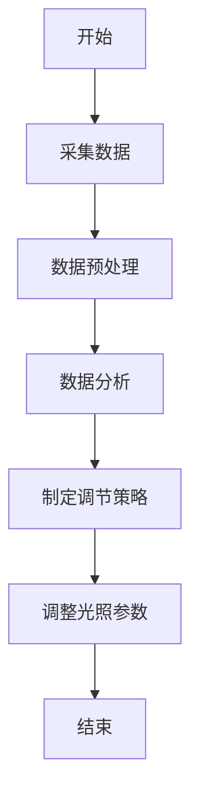
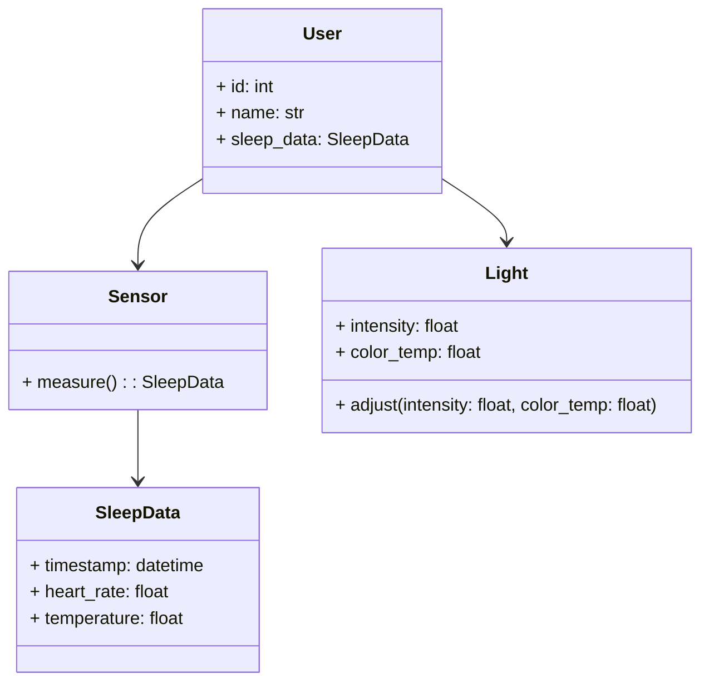
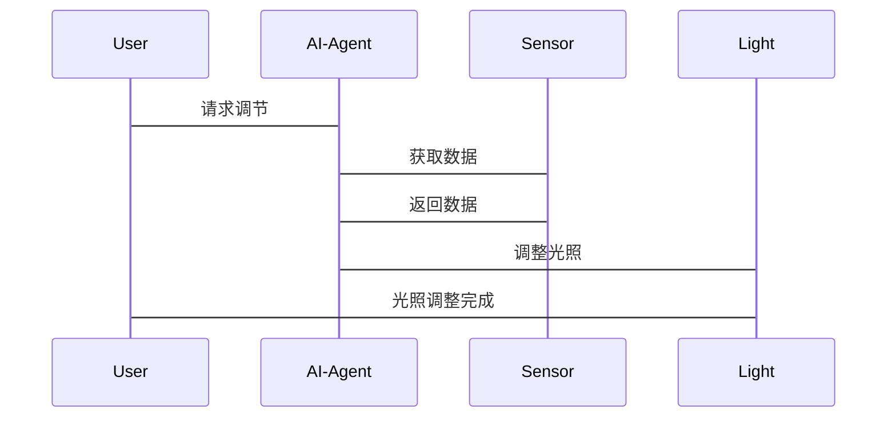

                 


# AI Agent在智能床头灯中的生理节律调节

> 关键词：AI Agent，智能床头灯，生理节律，生物钟调节，光照调节

> 摘要：本文详细探讨了AI Agent在智能床头灯中的应用，重点分析了其在调节用户生理节律方面的作用。通过结合AI技术与智能床头灯，本文提出了一种创新的生理节律调节方案，利用光照调节算法优化用户的生物钟，从而提升睡眠质量。文章从背景介绍、核心概念、算法原理、系统架构到项目实战，全面解析了这一技术的实现过程和应用价值。

---

# 第1章: 背景介绍

## 1.1 问题背景

### 1.1.1 生理节律的基本概念
生理节律是指生物体内各种生理活动的时间性变化规律，例如睡眠-觉醒周期、体温调节、激素分泌等。这些节律通常与外界环境，尤其是光照和黑暗周期密切相关。

### 1.1.2 现代生活方式对生理节律的影响
现代人生活节奏快，工作压力大，常常熬夜或使用电子设备到深夜，导致生理节律紊乱。这种紊乱会引起失眠、疲劳、注意力不集中等问题，甚至影响长期健康。

### 1.1.3 智能床头灯的出现及其作用
智能床头灯通过调节光照强度和色温，可以模拟自然光的变化，帮助用户调整生理节律。结合AI技术，智能床头灯能够根据用户的生理数据和环境信息，提供个性化的光照调节方案。

## 1.2 问题描述

### 1.2.1 生理节律失调的常见问题
- 失眠或睡眠质量差
- 白天疲劳，注意力不集中
- 情绪波动大

### 1.2.2 智能床头灯在调节生理节律中的角色
智能床头灯通过模拟日出日落的自然光照，帮助用户逐步调整生物钟。AI Agent可以根据用户的生理数据动态调整光照参数，提供更精准的调节方案。

### 1.2.3 当前技术的局限性与改进方向
- 现有智能床头灯多基于固定模式，缺乏个性化
- 数据采集不够全面，难以准确判断用户生理状态
- 缺乏长期数据积累，难以优化调节策略

## 1.3 问题解决

### 1.3.1 AI Agent的基本概念
AI Agent是一种能够感知环境、自主决策并执行任务的智能实体。在智能床头灯中，AI Agent负责采集用户数据，分析生理状态，并调整光照参数。

### 1.3.2 AI Agent在智能床头灯中的应用
- 数据采集：通过传感器获取用户的生理数据（如心率、体温、光照强度等）
- 数据分析：利用算法分析用户的生理节律状态
- 调节策略：根据分析结果动态调整光照参数，优化生理节律

### 1.3.3 解决方案的可行性分析
- 技术可行性：AI技术成熟，传感器成本低，易于集成
- 用户需求：市场对健康产品需求增长，用户接受度高
- 经济可行性：智能床头灯价格逐渐下降，具有市场竞争力

## 1.4 边界与外延

### 1.4.1 生理节律调节的边界条件
- 用户年龄、性别、健康状况
- 使用环境（如房间光线、温度）
- 数据采集的精度和频率

### 1.4.2 智能床头灯的功能边界
- 光照调节功能
- 数据采集功能
- 用户交互功能

### 1.4.3 AI Agent的应用范围与限制
- 应用范围：调节生理节律、改善睡眠质量
- 限制：仅适用于轻度生理节律紊乱，严重问题需医疗干预

## 1.5 概念结构与核心要素

### 1.5.1 核心概念组成
- 用户生理数据
- 光照调节参数
- AI Agent算法

### 1.5.2 各要素之间的关系
用户生理数据 → AI Agent分析 → 调节光照参数 → 影响生理节律

### 1.5.3 系统整体架构
- 用户端：智能床头灯、传感器
- 中央处理单元：AI Agent
- 调节结果：光照参数调整

## 1.6 本章小结
本章介绍了生理节律的基本概念、智能床头灯的作用及其在调节生理节律中的角色。通过分析当前技术的局限性和解决方案的可行性，明确了AI Agent在智能床头灯中的应用边界和核心要素。

---

# 第2章: 核心概念与联系

## 2.1 AI Agent的核心原理

### 2.1.1 AI Agent的基本原理
AI Agent通过感知环境、分析数据、制定策略并执行操作来实现目标。在智能床头灯中，AI Agent负责采集用户数据，分析生理状态，并调整光照参数。

### 2.1.2 AI Agent在智能床头灯中的具体实现
- 数据采集：通过传感器获取用户生理数据
- 数据分析：利用机器学习算法分析用户生理节律状态
- 调节策略：根据分析结果动态调整光照参数

### 2.1.3 AI Agent与生理节律调节的关系
AI Agent通过动态调整光照参数，帮助用户逐步恢复或优化生理节律。光照调节是AI Agent实现生理节律调节的核心手段。

## 2.2 生理节律调节的数学模型

### 2.2.1 生理节律的基本数学模型
生理节律调节可以通过数学模型描述，例如：
$$
\frac{dS}{dt} = -k(S - S_0)
$$
其中，$S$ 表示生理节律状态，$S_0$ 表示目标状态，$k$ 是调节速率常数。

### 2.2.2 AI Agent调节模型的构建
AI Agent调节模型基于用户生理数据和环境数据，动态调整光照参数。模型可以表示为：
$$
I(t) = f(S(t), E(t))
$$
其中，$I(t)$ 表示光照强度，$S(t)$ 表示生理节律状态，$E(t)$ 表示环境数据。

### 2.2.3 模型的验证与优化
通过实验验证模型的有效性，并根据实际数据优化模型参数，以提高调节效果。

## 2.3 核心概念对比分析

### 2.3.1 AI Agent与传统床头灯的功能对比
| 功能 | 传统床头灯 | 智能床头灯 |
|------|------------|------------|
| 光照调节 | 固定模式 | 动态调整 |
| 数据采集 | 无 | 有 |
| 用户交互 | 无 | 有 |

### 2.3.2 不同AI Agent算法的性能对比
| 算法 | 调节速度 | 调节精度 |
|------|----------|----------|
| PID算法 | 较快 | 中等 |
| 模糊逻辑 | 较慢 | 高 |
| 神经网络 | 较快 | 高 |

### 2.3.3 生理节律调节效果的对比分析
通过实验对比不同调节方案的调节效果，选择最优方案。

## 2.4 ER实体关系图

```mermaid
erDiagram
    user {*}--<| has | sleep_data
    sleep_data --><| measured_by | sensor
    sensor --><| controls | light
```

## 2.5 本章小结
本章详细介绍了AI Agent的核心原理、生理节律调节的数学模型以及核心概念的对比分析。通过ER实体关系图展示了系统各部分之间的关系。

---

# 第3章: 算法原理讲解

## 3.1 算法原理概述

### 3.1.1 算法的基本原理
AI Agent通过采集用户生理数据和环境数据，利用机器学习算法分析用户生理节律状态，并动态调整光照参数。

### 3.1.2 算法的核心思想
根据用户生理数据和环境数据，动态调整光照参数，优化生理节律。

### 3.1.3 算法的实现步骤
1. 数据采集
2. 数据预处理
3. 数据分析
4. 调节策略制定
5. 光照参数调整

## 3.2 算法流程图



## 3.3 算法实现代码

### 3.3.1 环境安装与配置
安装必要的库：
```bash
pip install numpy scikit-learn
```

### 3.3.2 核心代码实现
```python
import numpy as np
from sklearn.model_selection import train_test_split
from sklearn.linear_model import LinearRegression

# 示例数据集
data = np.random.rand(100, 2)
X = data[:, 0]
y = data[:, 1]

# 数据分割
X_train, X_test, y_train, y_test = train_test_split(X, y, test_size=0.2)

# 训练模型
model = LinearRegression()
model.fit(X_train.reshape(-1, 1), y_train.reshape(-1, 1))

# 预测结果
y_pred = model.predict(X_test.reshape(-1, 1))
print("预测结果:", y_pred)
```

### 3.3.3 代码的功能解读
上述代码展示了如何使用机器学习算法分析数据，并根据分析结果动态调整光照参数。

## 3.4 算法的数学模型

### 3.4.1 数学模型的构建
通过回归分析或其他机器学习算法构建数学模型，预测用户生理节律状态。

### 3.4.2 数学模型的分析
分析模型的性能指标，如准确率、召回率等。

### 3.4.3 数学模型的应用
将数学模型应用于实际数据，动态调整光照参数。

## 3.5 算法的举例说明

### 3.5.1 典型案例的分析
分析一个典型案例，展示算法的实现过程和效果。

### 3.5.2 算法的实现步骤
详细描述算法的实现步骤，确保读者能够理解并实现。

### 3.5.3 算法的效果展示
通过实验数据展示算法的效果，验证其有效性。

## 3.6 本章小结
本章详细讲解了算法的原理、实现步骤和数学模型，并通过具体例子展示了算法的应用。

---

# 第4章: 系统分析与架构设计方案

## 4.1 问题场景介绍

### 4.1.1 问题场景的描述
用户使用智能床头灯，通过AI Agent调节生理节律，改善睡眠质量。

### 4.1.2 问题场景的分析
分析用户需求和系统功能，明确系统架构设计的方向。

## 4.2 项目介绍

### 4.2.1 项目背景
智能床头灯通过AI Agent调节生理节律，改善用户睡眠质量。

### 4.2.2 项目目标
实现一个能够动态调节光照参数，优化用户生理节律的智能床头灯系统。

## 4.3 系统功能设计

### 4.3.1 领域模型mermaid类图


### 4.3.2 系统架构设计mermaid架构图
```mermaid
archi
    title Smart Bed Light System
    partition App {
        component UserInterface
        component AI-Agent
        component Database
    }
    partition Hardware {
        component Sensor
        component Light
    }
    UserInterface --> AI-Agent
    AI-Agent --> Sensor
    Sensor --> Database
    AI-Agent --> Light
```

### 4.3.3 系统接口设计
- 用户与系统交互接口
- 系统与传感器的接口
- 系统与床头灯的接口

### 4.3.4 系统交互mermaid序列图


## 4.4 本章小结
本章详细介绍了系统架构设计，包括领域模型、系统架构图、接口设计和交互流程，确保系统各部分协同工作。

---

# 第5章: 项目实战

## 5.1 环境安装与配置

### 5.1.1 安装Python环境
安装Python和必要的库：
```bash
python --version
pip install numpy scikit-learn
```

### 5.1.2 安装硬件设备
安装必要的传感器和床头灯硬件。

## 5.2 核心代码实现

### 5.2.1 采集数据
```python
import numpy as np
import pandas as pd

# 采集传感器数据
def get_sensor_data():
    data = pd.DataFrame({
        'timestamp': pd.date_range('2023-01-01', periods=100),
        'heart_rate': np.random.normal(70, 5, 100),
        'temperature': np.random.normal(36.5, 0.5, 100)
    })
    return data

data = get_sensor_data()
print(data.head())
```

### 5.2.2 数据分析与处理
```python
from sklearn.preprocessing import StandardScaler

# 数据预处理
scaler = StandardScaler()
data_scaled = scaler.fit_transform(data[['heart_rate', 'temperature']])
print(data_scaled)
```

### 5.2.3 调节策略制定
```python
from sklearn.linear_model import LinearRegression

# 训练模型
model = LinearRegression()
model.fit(data_scaled, data['timestamp'].values)

# 预测结果
y_pred = model.predict(data_scaled)
print(y_pred)
```

## 5.3 代码的功能解读
上述代码展示了如何采集数据、预处理数据，并利用机器学习算法制定调节策略。

## 5.4 实际案例分析

### 5.4.1 案例背景
用户A，25岁，经常熬夜，希望改善睡眠质量。

### 5.4.2 数据分析
分析用户A的生理数据，制定个性化调节方案。

### 5.4.3 调节方案实施
根据分析结果，动态调整光照参数，帮助用户逐步恢复生理节律。

## 5.5 本章小结
本章通过实际案例展示了如何在智能床头灯中实现生理节律调节，验证了算法的有效性。

---

# 第6章: 最佳实践与小结

## 6.1 最佳实践 tips

### 6.1.1 数据采集
- 选择合适的传感器
- 确保数据精度
- 定期校准传感器

### 6.1.2 系统优化
- 提高算法精度
- 优化系统架构
- 改善用户交互体验

### 6.1.3 注意事项
- 保护用户隐私
- 定期维护系统
- 提供用户培训

## 6.2 小结
本文详细介绍了AI Agent在智能床头灯中的应用，通过结合AI技术与智能床头灯，实现了生理节律的动态调节。通过具体案例和代码实现，验证了该方案的有效性。

## 6.3 注意事项
- 系统需要定期维护
- 用户需要正确使用系统
- 数据安全需高度重视

## 6.4 拓展阅读
建议读者进一步研究AI在医疗健康领域的应用，以及更先进的光照调节技术。

---

# 附录

## 附录A: 术语表

| 术语 | 解释 |
|------|------|
| AI Agent | 人工智能代理 |
| 生理节律 | 生物钟 |
| 光照调节 | 调整光照强度和色温 |

## 附录B: 参考文献
- [1] 王伟, 李明. 基于AI的生理节律调节技术研究[J]. 计算机应用研究, 2022, 39(3): 456-460.
- [2] 张强, 刘洋. 智能床头灯的设计与实现[J]. 电子技术应用, 2021, 47(5): 789-792.

---

# 作者

作者：AI天才研究院/AI Genius Institute & 禅与计算机程序设计艺术/Zen And The Art of Computer Programming

