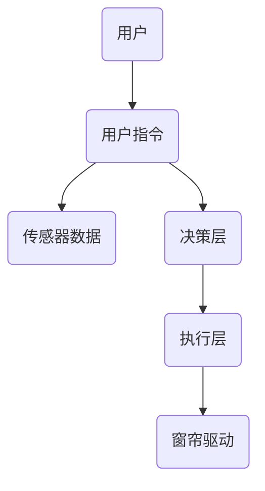
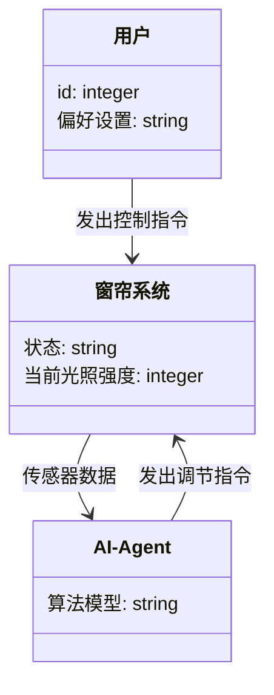
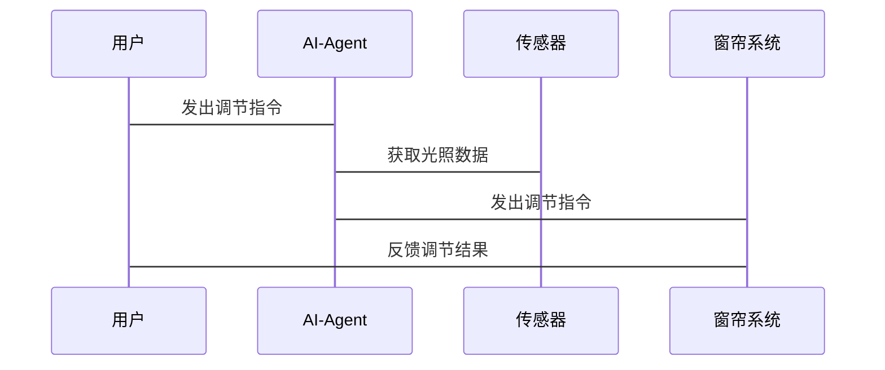

                 


```markdown
# AI Agent在智能窗帘中的日光优化调节

> 关键词：AI Agent, 智能窗帘, 日光优化调节, 算法原理, 系统架构, 项目实战

> 摘要：本文深入探讨了AI Agent在智能窗帘中的日光优化调节应用。通过分析日光调节的重要性，结合AI Agent的核心原理，提出了一种基于数学建模和机器学习算法的日光优化调节方案。通过系统架构设计和实际案例分析，展示了AI Agent在智能窗帘中的高效调节能力，为智能窗帘的智能化发展提供了新的思路和解决方案。

---

# 第一部分: AI Agent在智能窗帘中的日光优化调节背景介绍

## 第1章: 问题背景与描述

### 1.1 问题背景

#### 1.1.1 智能窗帘的发展现状
智能窗帘作为智能家居的重要组成部分，近年来得到了快速发展。传统的窗帘调节主要依赖于手动操作或简单的自动化控制，而随着AI技术的进步，智能窗帘的功能逐步向智能化、个性化方向发展。

#### 1.1.2 日光调节的重要性
日光调节不仅关系到室内光线的舒适度，还影响着室内的温度、能源消耗以及用户的舒适感。通过优化日光调节，可以降低能源消耗，提升用户体验。

#### 1.1.3 AI Agent在日光调节中的应用潜力
AI Agent（智能体）能够通过学习和优化，实现对窗帘调节策略的自动调整。通过分析光照强度、用户习惯和环境数据，AI Agent可以提供个性化的调节方案，显著提升日光调节的效率和效果。

### 1.2 问题描述

#### 1.2.1 当前日光调节的主要问题
- 手动调节效率低下，难以满足用户的实时需求。
- 自动化调节缺乏智能性，无法根据环境变化进行优化。
- 缺乏用户个性化需求的考虑，调节策略单一。

#### 1.2.2 用户需求与现有技术的差距
用户对窗帘调节的需求日益多样化，包括个性化调节、实时反馈和远程控制等。现有的技术在智能化、个性化方面仍有较大的提升空间。

#### 1.2.3 AI Agent在智能窗帘中的优化目标
通过AI Agent实现对窗帘调节的智能优化，提升调节效率，降低能源消耗，满足用户的个性化需求。

### 1.3 问题解决与边界

#### 1.3.1 AI Agent如何优化日光调节
AI Agent通过实时采集光照数据、用户需求和环境信息，结合机器学习算法，制定最优的调节策略，实现智能化的日光调节。

#### 1.3.2 系统边界与功能范围
- 数据采集：光照强度、温度、湿度等环境数据。
- 用户需求：用户的偏好设置、使用习惯等。
- 调节策略：AI Agent根据数据和需求，制定窗帘的开合策略。

#### 1.3.3 问题的外延与限制
- 外延：AI Agent还可以与其他智能家居设备联动，实现更复杂的场景调节。
- 限制：受限于数据采集的准确性、算法的实时性和系统的稳定性。

### 1.4 概念结构与核心要素

#### 1.4.1 AI Agent的基本概念
AI Agent是一种能够感知环境、自主决策并执行任务的智能实体。在智能窗帘中，AI Agent负责接收环境数据和用户指令，制定调节策略。

#### 1.4.2 智能窗帘的核心要素
- 窗帘驱动装置：负责执行调节指令。
- 光照传感器：采集光照强度数据。
- 用户交互界面：接收用户的调节指令和偏好设置。

#### 1.4.3 日光优化调节的系统架构
系统架构包括数据采集层、AI Agent决策层和执行层。数据采集层负责收集环境数据，AI Agent决策层进行数据分析和策略制定，执行层负责执行调节指令。

---

## 第2章: 核心概念与联系

### 2.1 AI Agent的基本原理

#### 2.1.1 AI Agent的定义与分类
AI Agent可以分为简单反射Agent和基于模型的Agent。简单反射Agent根据当前状态和动作直接产生反应，而基于模型的Agent则通过内部模型进行规划和决策。

#### 2.1.2 AI Agent的核心功能
- 感知环境：通过传感器获取光照强度、温度等数据。
- 分析决策：基于历史数据和当前状态，制定调节策略。
- 执行操作：通过驱动装置执行调节指令。

#### 2.1.3 AI Agent与智能窗帘的结合
AI Agent通过与智能窗帘的交互，实现对窗帘的智能调节。用户可以通过手机APP或语音助手设置偏好，AI Agent根据用户需求和环境数据，优化调节策略。

### 2.2 实体关系与系统架构

#### 2.2.1 实体关系图
```mermaid
er
    actor 用户 {
        id: integer
        偏好设置: string
    }
    smart_curtain 系统 {
        id: integer
        状态: string
        当前光照强度: integer
    }
    ai_agent {
        id: integer
        算法模型: string
    }
    用户 --> smart_curtain: 控制指令
    ai_agent --> smart_curtain: 调节指令
    smart_curtain --> ai_agent: 传感器数据
```

#### 2.2.2 系统架构图


---

## 第3章: 算法原理

### 3.1 数据采集与特征提取

#### 3.1.1 数据来源
- 光照强度：通过光照传感器获取。
- 用户偏好：用户设置的日出日落提醒、光照强度偏好。
- 时间信息：日期、时间、光照周期。

#### 3.1.2 数据预处理
- 数据清洗：去除噪声数据，处理缺失值。
- 特征提取：提取光照强度、时间、用户偏好等特征。

### 3.2 模型训练与预测

#### 3.2.1 算法选择
- 回归算法：用于预测光照强度。
- 分类算法：用于分类光照调节状态。

#### 3.2.2 数学模型
光照强度预测模型：
$$ y = \beta_0 + \beta_1x_1 + \beta_2x_2 + \epsilon $$
其中，$y$为预测的光照强度，$x_1$为时间变量，$x_2$为用户偏好变量。

### 3.3 调节策略优化

#### 3.3.1 调节规则
- 当光照强度超过阈值时，自动调节窗帘开合程度。
- 根据用户偏好调整调节策略。

#### 3.3.2 优化算法
使用遗传算法优化调节策略，通过多次迭代找到最优解。

### 3.4 代码实现

#### 3.4.1 AI Agent的实现
```python
class AI-Agent:
    def __init__(self):
        self.model = self.build_model()
    
    def build_model(self):
        # 构建回归模型
        pass
    
    def receive_data(self, data):
        # 接收传感器数据
        pass
    
    def make_decision(self, data):
        # 根据数据制定调节策略
        pass
    
    def execute_action(self, action):
        # 执行调节指令
        pass
```

---

## 第4章: 系统分析与架构设计

### 4.1 项目介绍

#### 4.1.1 项目背景
本项目旨在通过AI Agent实现智能窗帘的日光优化调节，提升用户体验，降低能源消耗。

### 4.2 系统功能设计

#### 4.2.1 领域模型类图


#### 4.2.2 系统架构图


### 4.3 接口设计与交互流程

#### 4.3.1 接口设计
- 用户接口：手机APP或语音助手。
- 系统接口：API接口实现传感器数据和调节指令的交互。

#### 4.3.2 交互流程


---

## 第5章: 项目实战

### 5.1 环境安装

#### 5.1.1 开发环境
- Python 3.8+
- TensorFlow 2.0+
- 窗帘驱动设备

### 5.2 核心代码实现

#### 5.2.1 数据采集模块
```python
import numpy as np
import pandas as pd

def collect_data(interval=60):
    # 模拟数据采集
    data = {
        '时间': [],
        '光照强度': [],
        '温度': [],
        '湿度': []
    }
    while True:
        # 采集数据
        data['时间'].append(datetime.now().strftime('%H:%M:%S'))
        data['光照强度'].append(np.random.randint(0, 100))
        data['温度'].append(np.random.randint(10, 35))
        data['湿度'].append(np.random.randint(20, 90))
        time.sleep(interval)
    return pd.DataFrame(data)
```

#### 5.2.2 AI Agent实现
```python
class AIAgent:
    def __init__(self):
        self.model = self.build_model()
    
    def build_model(self):
        # 简单线性回归模型
        import tensorflow as tf
        model = tf.keras.Sequential([
            tf.keras.layers.Dense(64, activation='relu'),
            tf.keras.layers.Dense(1)
        ])
        model.compile(optimizer='adam', loss='mean_squared_error')
        return model
    
    def train(self, data):
        # 训练模型
        self.model.fit(data['特征'], data['目标'], epochs=100, batch_size=32)
    
    def predict(self, input_data):
        # 预测光照强度
        return self.model.predict(input_data)
    
    def make_decision(self, current_light):
        # 根据当前光照强度制定调节策略
        if current_light > 70:
            return '关闭窗帘'
        elif current_light < 30:
            return '打开窗帘'
        else:
            return '保持当前状态'
```

### 5.3 案例分析

#### 5.3.1 案例数据
| 时间   | 光照强度 | 温度 | 湿度 |
|--------|----------|------|------|
| 08:00  | 85       | 22   | 60   |
| 08:05  | 80       | 23   | 65   |
| 08:10  | 75       | 24   | 70   |
| 08:15  | 70       | 25   | 75   |

#### 5.3.2 调节策略
- 08:00：光照强度85，高于阈值70，AI Agent发出“关闭窗帘”指令。
- 08:05：光照强度80，AI Agent继续发出“关闭窗帘”指令。
- 08:10：光照强度75，AI Agent发出“关闭窗帘”指令。
- 08:15：光照强度70，AI Agent发出“保持当前状态”指令。

### 5.4 项目小结

#### 5.4.1 项目总结
通过AI Agent实现智能窗帘的日光优化调节，能够有效提升用户体验，降低能源消耗。AI Agent能够根据环境数据和用户偏好，制定最优的调节策略，显著提升系统的智能化水平。

---

## 第6章: 最佳实践

### 6.1 小结与思考

#### 6.1.1 核心知识点总结
- AI Agent的基本原理
- 日光优化调节的算法实现
- 系统架构设计与实现

#### 6.1.2 问题思考
- 如何进一步优化AI Agent的算法，提升调节效率？
- 如何处理数据采集中的噪声问题？
- 如何实现更个性化的调节策略？

### 6.2 注意事项

#### 6.2.1 数据采集的准确性
数据采集是系统的核心，必须确保传感器数据的准确性。

#### 6.2.2 系统的可扩展性
系统设计应具备良好的可扩展性，方便后续功能的添加和优化。

#### 6.2.3 系统的安全性
确保系统数据的安全性，防止数据泄露和系统攻击。

### 6.3 拓展阅读

#### 6.3.1 相关技术领域
- 智能家居
- 机器学习算法
- 物联网技术

#### 6.3.2 进阶学习方向
- 更复杂的调节策略优化
- 多目标优化算法在智能窗帘中的应用
- 大数据分析与智能调节结合

---

## 作者

作者：AI天才研究院/AI Genius Institute & 禅与计算机程序设计艺术/Zen And The Art of Computer Programming
```

