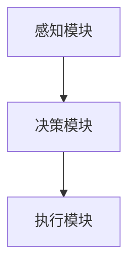
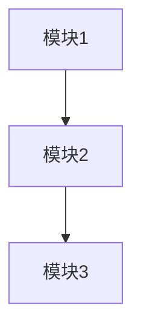
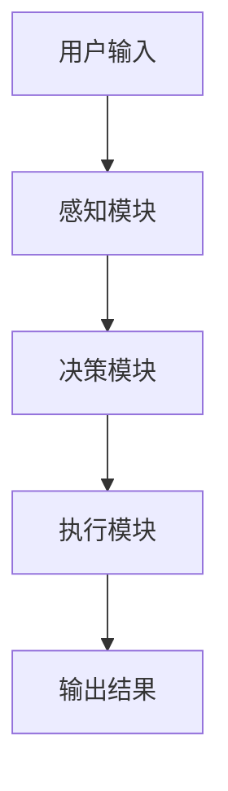
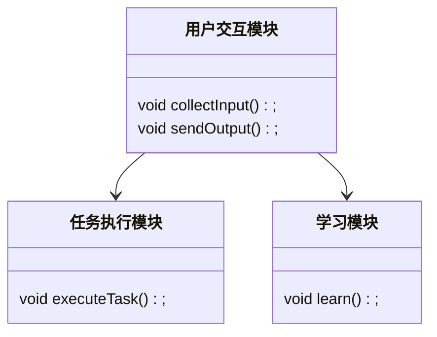
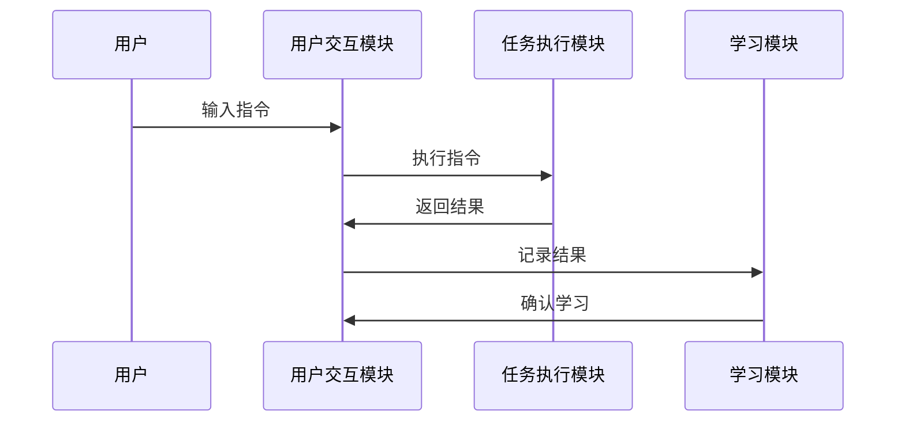
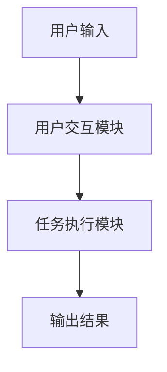
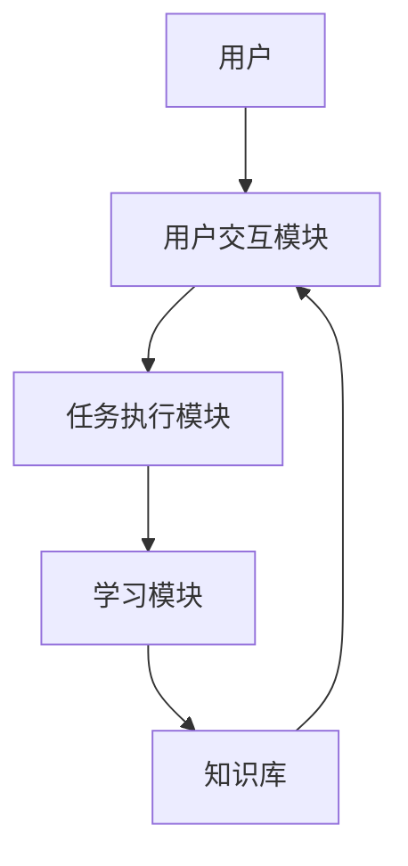
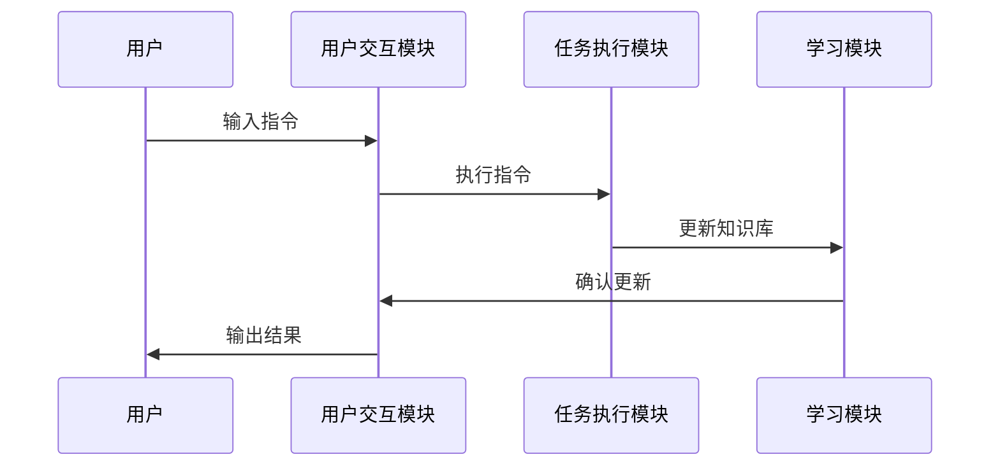

                 


# AI Agent的模块化设计：提高系统可维护性和扩展性

> 关键词：AI Agent，模块化设计，可维护性，扩展性，系统架构，代码实现，最佳实践

> 摘要：本文将详细介绍AI Agent的模块化设计方法，从基本概念到具体实现，深入分析模块化设计如何提高系统的可维护性和扩展性。通过实际案例和系统架构设计，我们将展示如何通过模块化设计来构建高效、灵活的AI Agent系统。

---

# 第1章: AI Agent的模块化设计概述

## 1.1 AI Agent的基本概念

### 1.1.1 什么是AI Agent

AI Agent（人工智能代理）是指能够感知环境、做出决策并执行任务的智能实体。它可以是一个软件程序、一个机器人，或者是任何能够执行智能任务的实体。AI Agent的核心目标是通过与环境的交互，完成特定的目标或任务。

### 1.1.2 AI Agent的类型与特点

AI Agent可以根据功能和应用场景分为多种类型，常见的类型包括：

- **简单反射型Agent**：基于当前感知做出反应，不依赖历史信息。
- **基于模型的反射型Agent**：利用内部状态模型进行决策。
- **目标驱动型Agent**：根据目标选择最优行动。
- **效用驱动型Agent**：通过最大化效用函数来决策。

### 1.1.3 模块化设计的定义与优势

模块化设计是一种将系统分解为多个独立模块的方法，每个模块负责特定的功能。模块化设计的优势包括：

- **可维护性**：模块化设计使得每个模块的代码独立，便于维护和更新。
- **扩展性**：需要扩展功能时，只需添加新的模块，而无需修改现有代码。
- **复用性**：模块化设计使得模块可以在不同项目中复用。

---

## 1.2 模块化设计的重要性

### 1.2.1 提高系统可维护性的意义

模块化设计通过将系统分解为多个独立模块，使得每个模块的代码独立，从而降低了系统的耦合性。这种设计使得在需要修改或更新某部分功能时，只需专注于特定的模块，而不会影响整个系统的其他部分。

### 1.2.2 提高系统扩展性的必要性

随着AI Agent的功能需求不断增加，系统的复杂性也会随之增加。模块化设计使得在扩展新功能时，可以轻松地添加新的模块，而无需对现有代码进行大规模的修改。

### 1.2.3 模块化设计在AI Agent中的应用

在AI Agent中，模块化设计可以应用于感知模块、决策模块、执行模块等多个方面。例如，感知模块负责收集环境信息，决策模块基于感知信息做出决策，执行模块负责执行具体的任务。

---

## 1.3 本书的目标与结构

### 1.3.1 本书的核心目标

本书的核心目标是通过模块化设计的方法，帮助读者提高AI Agent系统的可维护性和扩展性。

### 1.3.2 本书的章节安排

本书分为7章，内容安排如下：

1. 第1章：AI Agent的模块化设计概述
2. 第2章：AI Agent的模块化设计原理
3. 第3章：AI Agent的模块化设计实现
4. 第4章：AI Agent模块化设计的实战案例
5. 第5章：AI Agent模块化设计的系统架构
6. 第6章：AI Agent模块化设计的算法原理
7. 第7章：AI Agent模块化设计的最佳实践

### 1.3.3 学习本书的注意事项

为了更好地理解本书内容，建议读者具备基本的AI Agent知识和编程基础。同时，本书涉及的代码实现部分主要使用Python语言，因此建议读者熟悉Python编程。

---

# 第2章: AI Agent的模块化设计原理

## 2.1 模块化设计的核心概念

### 2.1.1 模块的定义与属性

模块是指具有明确功能和接口的独立组件。每个模块都有以下属性：

- **功能**：模块所实现的功能。
- **接口**：模块与其他模块之间的交互接口。
- **状态**：模块的运行状态。

### 2.1.2 模块之间的依赖关系

模块之间的依赖关系可以通过依赖注入的方式进行管理。依赖注入是一种将对象依赖的外部服务传递到对象中的设计模式，可以有效降低模块之间的耦合性。

### 2.1.3 模块的通信机制

模块之间的通信可以通过消息队列、事件发布-订阅机制等方式实现。这些通信机制需要在模块设计时明确定义。

## 2.2 模块化设计的实现原理

### 2.2.1 模块划分的算法原理

模块划分的算法需要考虑系统的功能需求和模块的独立性。一种常见的模块划分方法是基于功能需求的分解，将系统功能划分为多个独立的模块。

### 2.2.2 模块之间的接口设计

模块之间的接口需要明确输入和输出的数据格式，以及模块之间的调用方式。接口设计可以通过接口定义语言（IDL）进行描述。

### 2.2.3 模块的动态加载与卸载

模块的动态加载与卸载可以通过动态链接库（DLL）或类似的技术实现。这种方法使得模块可以在运行时动态地加载或卸载，提高了系统的灵活性。

---

## 2.3 模块化设计的数学模型

### 2.3.1 模块划分的数学表达式

模块划分可以表示为一个集合：

$$模块划分 = \{M_1, M_2, ..., M_n\}$$

其中，$M_i$ 表示第 $i$ 个模块。

### 2.3.2 模块间依赖关系的图论表示

模块之间的依赖关系可以用图论中的有向图表示，节点表示模块，边表示依赖关系。

### 2.3.3 模块通信的协议设计

模块之间的通信协议可以通过消息队列或事件驱动的方式实现。这些协议需要在模块设计时明确定义。

---

# 第3章: AI Agent的模块化设计实现

## 3.1 模块化设计的具体实现步骤

### 3.1.1 系统功能分解

系统功能分解是模块化设计的第一步。需要将系统的功能需求分解为多个独立的功能模块。

### 3.1.2 模块划分与实现

根据功能分解的结果，将系统划分为多个模块，并为每个模块实现具体的功能。

### 3.1.3 模块之间的接口定义

在模块划分完成后，需要定义模块之间的接口。接口定义需要明确模块之间的输入和输出数据格式，以及模块之间的调用方式。

## 3.2 模块化设计的代码实现

### 3.2.1 环境安装与配置

模块化设计的代码实现需要选择合适的编程语言和开发环境。本文以Python为例，介绍如何在Python中实现模块化设计。

### 3.2.2 核心模块的实现代码

以下是Python中实现模块化设计的核心模块的示例代码：

```python
# 模块1：感知模块
class PerceptionModule:
    def __init__(self):
        self.sensors = []
    
    def collect_data(self):
        # 收集环境数据
        pass

# 模块2：决策模块
class DecisionModule:
    def __init__(self):
        pass
    
    def make_decision(self, data):
        # 基于数据做出决策
        pass
```

### 3.2.3 模块之间的通信代码

模块之间的通信可以通过消息队列或事件驱动的方式实现。以下是基于消息队列的通信代码示例：

```python
# 消息队列模块
class MessageQueue:
    def __init__(self):
        self.queue = []
    
    def publish(self, message):
        self.queue.append(message)
    
    def subscribe(self, callback):
        # 订阅消息的回调函数
        pass
```

---

## 3.3 模块化设计的系统架构

### 3.3.1 系统功能架构图

以下是系统功能架构图的Mermaid图示：



### 3.3.2 模块之间的依赖关系图

以下是模块之间依赖关系的Mermaid图示：



### 3.3.3 系统的整体架构图

以下是系统整体架构图的Mermaid图示：



---

# 第4章: AI Agent模块化设计的实战案例

## 4.1 实战项目介绍

### 4.1.1 项目背景与目标

本实战项目的目标是设计一个智能助手AI Agent，能够根据用户的需求执行特定的任务。

### 4.1.2 项目需求分析

智能助手AI Agent需要具备以下功能：

- **用户交互模块**：与用户进行对话交互。
- **任务执行模块**：根据用户的指令执行任务。
- **学习模块**：通过与用户的交互不断优化自身。

### 4.1.3 项目功能设计

以下是项目功能设计的Mermaid类图：



---

## 4.2 项目实现

### 4.2.1 环境安装与配置

项目实现需要以下环境：

- **Python 3.8+**
- **必要的Python库**（如`flask`、`numpy`等）

### 4.2.2 核心模块的实现代码

以下是核心模块的实现代码：

```python
# 用户交互模块
class UserInterface:
    def __init__(self):
        self.input = ""
        self.output = ""
    
    def collect_input(self):
        self.input = input("请输入指令：")
    
    def send_output(self):
        print(self.output)

# 任务执行模块
class TaskExecution:
    def __init__(self):
        pass
    
    def execute_task(self, task):
        print(f"执行任务：{task}")

# 学习模块
class LearningModule:
    def __init__(self):
        self.data = []
    
    def learn(self, data):
        self.data.append(data)
        print(f"已学习数据：{data}")
```

### 4.2.3 系统交互流程

以下是系统交互流程的Mermaid序列图：



---

## 4.3 项目测试与优化

### 4.3.1 功能测试

对实现的模块进行功能测试，确保每个模块都能正常工作。

### 4.3.2 性能优化

根据测试结果，对系统进行性能优化，例如优化模块之间的通信效率。

---

# 第5章: AI Agent模块化设计的系统架构

## 5.1 系统功能架构

### 5.1.1 功能架构图

以下是系统功能架构图的Mermaid图示：



### 5.1.2 功能模块之间的关系

用户输入通过用户交互模块传递给任务执行模块，任务执行模块执行任务后，将结果返回给用户交互模块，最终输出给用户。

## 5.2 系统架构设计

### 5.2.1 系统整体架构图

以下是系统整体架构图的Mermaid图示：



### 5.2.2 模块之间的接口设计

模块之间的接口需要明确输入和输出的数据格式，以及模块之间的调用方式。以下是接口设计的示例：

```python
# 接口定义
class Interface:
    def receive_data(self, data):
        pass
    
    def send_data(self, data):
        pass
```

---

## 5.3 系统接口设计

### 5.3.1 接口定义

模块之间的接口需要定义明确的输入和输出格式，以及模块之间的调用方式。

### 5.3.2 接口实现

以下是接口实现的示例代码：

```python
# 接口实现
class ModuleA:
    def receive_data(self, data):
        print(f"接收到数据：{data}")
    
    def send_data(self, data):
        print(f"发送数据：{data}")
```

---

## 5.4 系统交互序列图

### 5.4.1 交互流程

以下是系统交互流程的Mermaid序列图：



---

# 第6章: AI Agent模块化设计的算法原理

## 6.1 模块划分算法

### 6.1.1 模块划分的算法原理

模块划分的算法需要考虑系统的功能需求和模块的独立性。一种常见的模块划分方法是基于功能需求的分解，将系统功能划分为多个独立的模块。

### 6.1.2 模块划分算法的实现

以下是模块划分算法的实现代码：

```python
def module_partitioning(system_function):
    modules = []
    for func in system_function:
        modules.append(func)
    return modules
```

---

## 6.2 模块通信协议设计

### 6.2.1 模块通信的协议设计

模块之间的通信协议可以通过消息队列或事件驱动的方式实现。以下是基于消息队列的通信协议设计：

```python
# 消息队列模块
class MessageQueue:
    def __init__(self):
        self.queue = []
    
    def publish(self, message):
        self.queue.append(message)
    
    def subscribe(self, callback):
        # 订阅消息的回调函数
        pass
```

---

## 6.3 模块化设计的数学模型

### 6.3.1 模块划分的数学表达式

模块划分可以表示为一个集合：

$$模块划分 = \{M_1, M_2, ..., M_n\}$$

其中，$M_i$ 表示第 $i$ 个模块。

### 6.3.2 模块间依赖关系的图论表示

模块之间的依赖关系可以用图论中的有向图表示，节点表示模块，边表示依赖关系。

---

# 第7章: AI Agent模块化设计的最佳实践

## 7.1 模块化设计的优势

### 7.1.1 提高系统的可维护性

模块化设计使得每个模块的代码独立，便于维护和更新。

### 7.1.2 提高系统的扩展性

模块化设计使得在扩展新功能时，可以轻松地添加新的模块，而无需对现有代码进行大规模的修改。

## 7.2 模块化设计的注意事项

### 7.2.1 模块划分的合理性

模块划分需要合理，避免模块之间的耦合度过高。

### 7.2.2 模块之间的接口设计

模块之间的接口需要明确输入和输出的数据格式，以及模块之间的调用方式。

## 7.3 模块化设计的未来趋势

### 7.3.1 微服务架构的应用

随着AI Agent系统的复杂性不断增加，模块化设计将更加依赖微服务架构。

### 7.3.2 云计算与边缘计算的结合

未来的AI Agent模块化设计将更加依赖云计算和边缘计算的结合，实现更高效的资源管理。

---

## 7.4 拓展阅读

### 7.4.1 推荐书籍

- 《设计模式：可复用面向对象的软件组件》
- 《Clean Architecture: A Craftsman's Guide to Software Design》

### 7.4.2 推荐博客与技术文章

- [模块化设计的最佳实践](https://example.com)
- [AI Agent的最新研究进展](https://example.com)

---

# 作者：AI天才研究院/AI Genius Institute & 禅与计算机程序设计艺术 /Zen And The Art of Computer Programming

