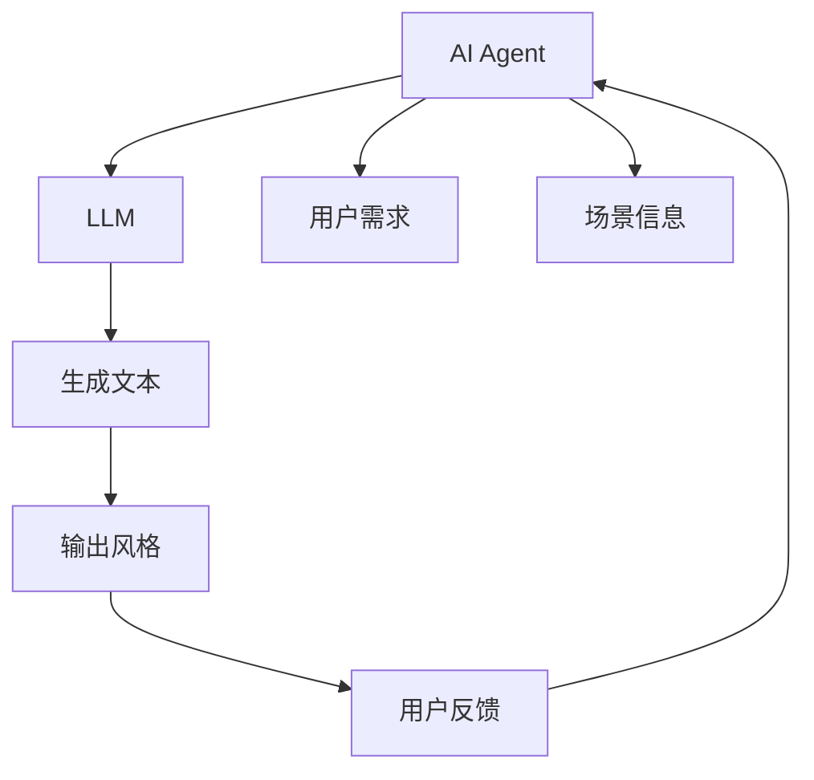
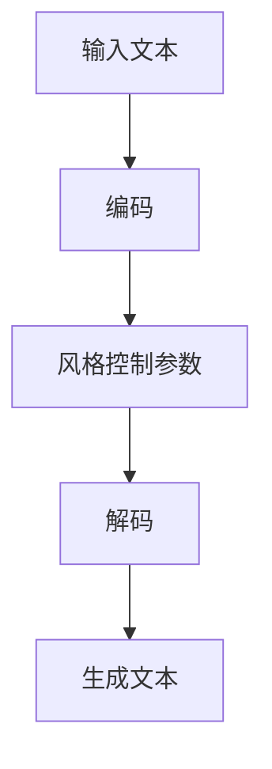
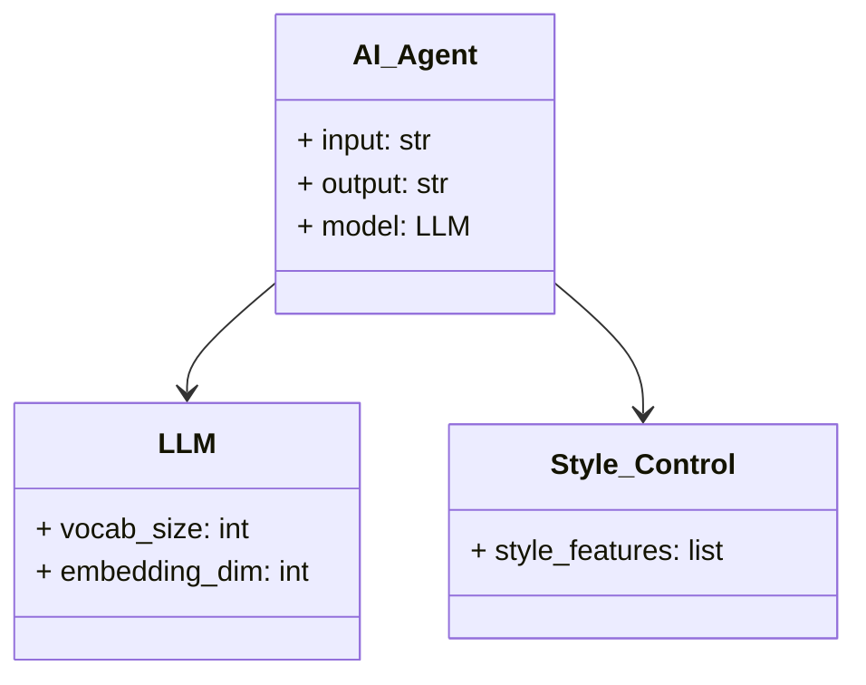
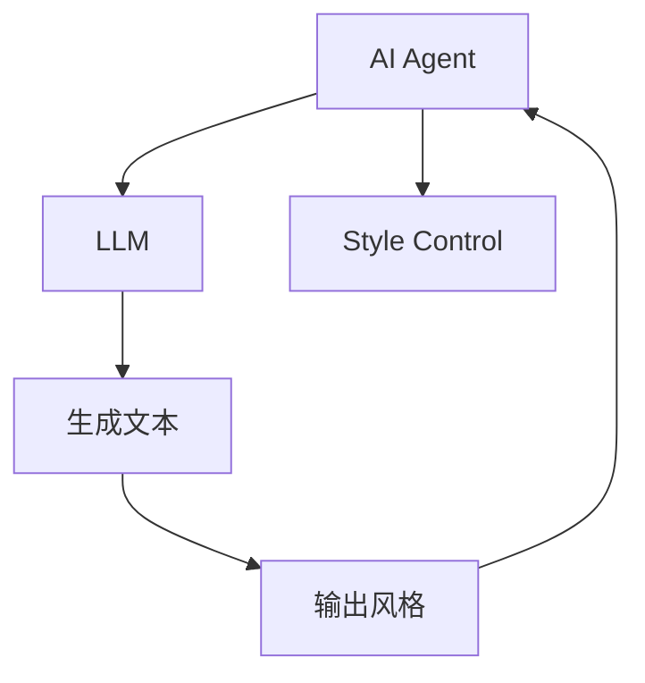
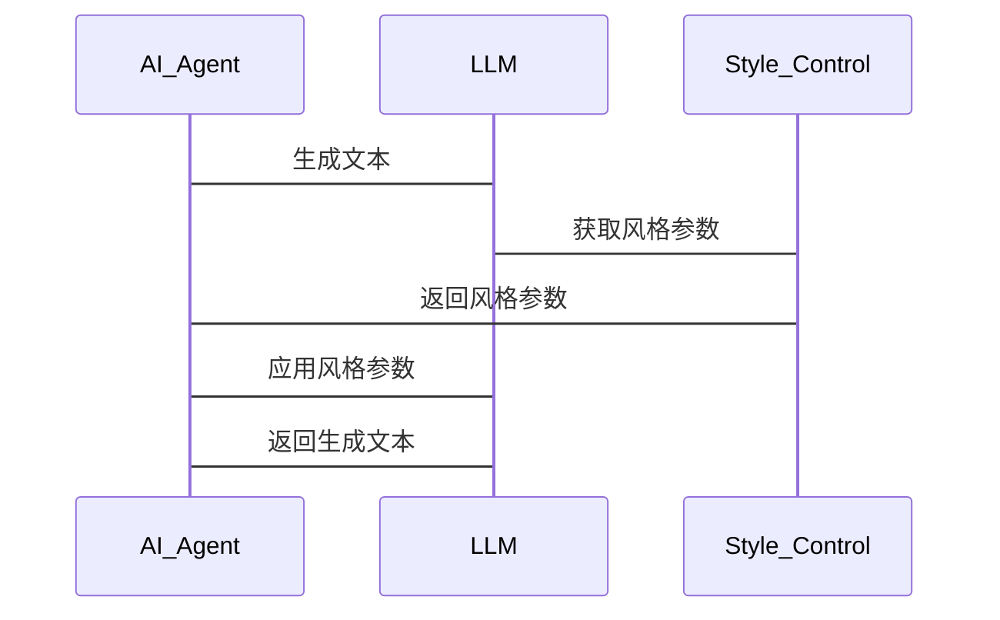

                 


# AI Agent的语言生成控制：精确调节LLM的输出风格

---

## 关键词：
AI Agent, LLM, 语言生成控制, 输出风格调节, 文本生成, 机器学习

---

## 摘要：
本文探讨了AI Agent在语言生成控制中的作用，重点分析了如何精确调节大语言模型（LLM）的输出风格。通过详细的技术分析，本文从背景、原理、算法、系统架构到项目实战，全面阐述了语言生成控制的核心概念、实现方法和实际应用场景。通过实例分析和代码实现，本文为读者提供了从理论到实践的完整指导。

---

## 正文：

---

### 第一部分: AI Agent与语言生成控制的背景介绍

#### 第1章: 问题背景与核心概念

##### 1.1 问题背景
- **1.1.1 当前AI语言生成技术的发展现状**  
  当前，大语言模型（LLM）如GPT系列、PaLM等在自然语言处理领域取得了显著进展。这些模型能够生成连贯且复杂的文本，但输出的风格和语气往往缺乏灵活性，难以满足特定场景的需求。

- **1.1.2 语言生成控制的重要性**  
  在实际应用中，AI Agent需要根据用户需求或特定场景调整输出风格。例如，在客服对话中，AI Agent需要保持礼貌和专业；在创意写作中，可能需要生成幽默或夸张的文本。精确调节LLM的输出风格是实现这些目标的关键。

- **1.1.3 AI Agent在语言生成中的角色**  
  AI Agent作为人机交互的接口，需要理解用户意图并生成符合期望的文本。其核心能力包括意图识别、上下文理解以及语言生成。语言生成控制是其实现复杂任务的核心技术之一。

##### 1.2 问题描述
- **1.2.1 LLM输出风格的多样性需求**  
  不同场景对文本生成的要求不同。例如，教育类应用可能需要正式且严谨的风格，而社交媒体应用可能需要轻松活泼的语气。

- **1.2.2 语言生成控制的必要性**  
  通过控制LLM的输出风格，AI Agent能够更好地适应不同用户和场景的需求，提升用户体验和任务完成效率。

- **1.2.3 AI Agent在语言生成控制中的作用**  
  AI Agent不仅需要生成文本，还需要根据反馈和上下文动态调整生成策略，确保输出风格的精准匹配。

##### 1.3 问题解决
- **1.3.1 精确调节LLM输出风格的目标**  
  通过引入控制参数（如温度、风格标签等），实现对LLM输出风格的精确调节。

- **1.3.2 AI Agent在语言生成控制中的解决方案**  
  AI Agent通过解析用户需求或场景信息，生成相应的控制指令，指导LLM生成符合预期的文本。

- **1.3.3 输出风格调节的实现路径**  
  通过预定义风格模板、基于反馈的微调或结合强化学习的方法，实现对LLM输出风格的动态控制。

##### 1.4 边界与外延
- **1.4.1 语言生成控制的边界条件**  
  语言生成控制需要在模型能力范围内进行调整，避免超出模型的生成能力。

- **1.4.2 AI Agent能力的局限性**  
  当前LLM的输出控制能力有限，难以实现完全灵活的风格调节。

- **1.4.3 输出风格调节的适用场景**  
  适用于需要多样化文本输出的应用场景，如客服、教育、创意写作等。

##### 1.5 核心要素组成
- **1.5.1 AI Agent的基本组成**  
  AI Agent通常由感知模块、决策模块和执行模块组成，其中语言生成控制主要涉及决策模块。

- **1.5.2 语言生成控制的关键要素**  
  包括控制参数、风格模板、反馈机制和生成策略。

- **1.5.3 输出风格调节的核心机制**  
  通过引入控制参数和风格模板，结合生成模型的输出特性，实现风格调节。

---

### 第二部分: AI Agent与语言生成控制的核心概念与联系

#### 第2章: 核心概念原理

##### 2.1 AI Agent的基本原理
- **2.1.1 AI Agent的定义与分类**  
  AI Agent是一种能够感知环境并采取行动以实现目标的智能实体。根据智能水平，可以分为简单反射型、基于模型的反应型、目标驱动型和实用驱动型AI Agent。

- **2.1.2 AI Agent的核心功能**  
  包括感知、决策、规划和执行。在语言生成控制中，AI Agent的核心功能是理解用户需求并生成符合预期的文本。

- **2.1.3 AI Agent与人类交互的特点**  
  AI Agent能够通过自然语言处理技术与用户进行对话，理解用户的意图并生成相应的响应。

##### 2.2 LLM的基本原理
- **2.2.1 大语言模型的定义与特点**  
  大语言模型是基于大规模语料库训练的深度学习模型，具有强大的文本生成能力。

- **2.2.2 LLM的训练与推理过程**  
  训练过程包括参数优化和模型调优，推理过程则是根据输入生成输出。

- **2.2.3 LLM的输出特性与局限性**  
  LLM的输出通常具有连贯性和相关性，但缺乏对输出风格的精确控制能力。

##### 2.3 语言生成控制的原理
- **2.3.1 语言生成控制的定义**  
  语言生成控制是指通过引入额外的控制参数或策略，对生成模型的输出风格进行调节。

- **2.3.2 AI Agent在语言生成控制中的作用**  
  AI Agent通过解析用户需求或场景信息，生成相应的控制指令，指导生成模型生成符合预期的文本。

- **2.3.3 输出风格调节的核心机制**  
  通过引入控制参数（如温度、风格标签等）和风格模板，结合生成模型的输出特性，实现风格调节。

##### 2.4 核心概念属性特征对比
以下表格对比了AI Agent和LLM在语言生成控制中的核心属性特征：

| 属性 | AI Agent | LLM |
|------|----------|-----|
| 功能 | 解析需求、生成控制指令 | 生成文本 |
| 输入 | 用户需求、场景信息 | 文本输入 |
| 输出 | 控制指令、风格参数 | 生成文本 |
| 依赖 | 语言生成模型 | 无 |
| 作用 | 控制生成过程 | 生成文本 |

##### 2.5 实体关系图架构（Mermaid）



---

#### 第3章: 语言生成控制的核心概念与联系

##### 3.1 核心概念之间的联系
- **3.1.1 AI Agent与LLM的关系**  
  AI Agent通过解析用户需求生成控制指令，LLM根据指令生成文本。

- **3.1.2 语言生成控制的核心机制**  
  通过引入控制参数和风格模板，AI Agent指导LLM生成符合预期的文本。

- **3.1.3 输出风格调节的实现路径**  
  从用户需求到控制指令，再到生成文本，形成一个完整的控制循环。

##### 3.2 核心概念之间的对比
以下表格对比了AI Agent和LLM在语言生成控制中的核心概念：

| 概念 | AI Agent | LLM |
|------|----------|-----|
| 核心功能 | 解析需求、生成控制指令 | 生成文本 |
| 输入 | 用户需求、场景信息 | 文本输入 |
| 输出 | 控制指令、风格参数 | 生成文本 |
| 依赖 | 语言生成模型 | 无 |
| 作用 | 控制生成过程 | 生成文本 |

---

### 第三部分: 语言生成控制的算法原理

#### 第4章: 生成式模型的工作流程

##### 4.1 生成式模型的基本原理
- **4.1.1 生成式模型的定义与特点**  
  生成式模型是一种能够生成新数据的模型，常用于文本生成、图像生成等领域。

- **4.1.2 生成式模型的工作流程**  
  包括编码、解码和生成三个阶段。

##### 4.2 生成式模型的文本生成过程
- **4.2.1 编码阶段**  
  将输入文本编码为向量表示。

- **4.2.2 解码阶段**  
  根据编码向量生成输出文本。

- **4.2.3 生成阶段**  
  根据生成策略生成最终文本。

##### 4.3 生成式模型的风格调节
- **4.3.1 风格调节的实现方法**  
  通过引入控制参数和风格模板，实现风格调节。

- **4.3.2 风格调节的核心算法**  
  基于生成式模型的风格调节算法，如风格迁移、条件生成等。

##### 4.4 生成式模型的风格调节算法（Mermaid流程图）



##### 4.5 生成式模型的代码实现（Python示例）
以下是基于生成式模型的风格调节算法的Python代码示例：

```python
import torch
import torch.nn as nn

# 定义编码器
class Encoder(nn.Module):
    def __init__(self, vocab_size, embedding_dim):
        super(Encoder, self).__init__()
        self.embedding = nn.Embedding(vocab_size, embedding_dim)
        self.lstm = nn.LSTM(embedding_dim, hidden_size, batch_first=True)

    def forward(self, input_seq):
        embeddings = self.embedding(input_seq)
        outputs, (hidden, cell) = self.lstm(embeddings)
        return outputs, hidden

# 定义解码器
class Decoder(nn.Module):
    def __init__(self, hidden_size, output_dim):
        super(Decoder, self).__init__()
        self.lstm = nn.LSTM(hidden_size, hidden_size, batch_first=True)
        self.fc = nn.Linear(hidden_size, output_dim)

    def forward(self, input_seq, hidden):
        outputs, _ = self.lstm(input_seq, (hidden, hidden))
        outputs = self.fc(outputs)
        return outputs

# 定义风格控制参数
class StyleControl(nn.Module):
    def __init__(self, style_dim, hidden_size):
        super(StyleControl, self).__init__()
        self.fc = nn.Linear(style_dim, hidden_size)

    def forward(self, style_features):
        outputs = self.fc(style_features)
        return outputs

# 定义生成式模型
class GenerativeModel(nn.Module):
    def __init__(self, vocab_size, embedding_dim, hidden_size, style_dim):
        super(GenerativeModel, self).__init__()
        self.encoder = Encoder(vocab_size, embedding_dim)
        self.decoder = Decoder(hidden_size, vocab_size)
        self.style_control = StyleControl(style_dim, hidden_size)

    def forward(self, input_seq, style_features):
        # 编码阶段
        _, hidden = self.encoder(input_seq)
        # 风格控制
        style_embeddings = self.style_control(style_features)
        # 解码阶段
        outputs = self.decoder(style_embeddings.unsqueeze(0), hidden)
        return outputs
```

---

#### 第5章: 生成式模型的风格调节算法

##### 5.1 风格调节的核心算法
- **5.1.1 基于温度的风格调节**  
  通过调整生成过程中的温度参数，实现对生成文本的风格控制。

- **5.1.2 基于风格标签的风格调节**  
  通过引入风格标签，实现对生成文本风格的精确控制。

- **5.1.3 基于反馈的风格调节**  
  根据用户反馈动态调整生成策略，实现风格的自适应调节。

##### 5.2 风格调节算法的数学模型
以下公式展示了基于温度的风格调节算法：

$$ P(y|x) = \frac{1}{Z} \exp\left(\frac{-\text{CE}(y|x)}{\tau}\right) $$

其中，$P(y|x)$ 是生成概率，$\text{CE}(y|x)$ 是交叉熵损失，$\tau$ 是温度参数，$Z$ 是归一化常数。

##### 5.3 风格调节算法的代码实现（Python示例）
以下是基于温度的风格调节算法的Python代码示例：

```python
import torch
import torch.nn as nn

# 定义温度调节函数
def temperature_regulate(logits, tau):
    logits_regulated = torch.pow(logits, tau)
    return logits_regulated

# 应用温度调节
logits = model(input_seq)
logits_regulated = temperature_regulate(logits, tau=1.2)
```

---

### 第四部分: 系统分析与架构设计方案

#### 第6章: 语言生成控制系统的分析与设计

##### 6.1 问题场景介绍
- **6.1.1 问题场景**  
  在客服对话系统中，AI Agent需要根据用户情绪生成相应的回应。例如，当用户情绪低落时，生成更具同理心的文本。

- **6.1.2 项目介绍**  
  开发一个基于AI Agent的语言生成控制系统，能够根据用户需求动态调整输出风格。

##### 6.2 系统功能设计
- **6.2.1 领域模型（Mermaid类图）**



- **6.2.2 系统架构设计（Mermaid架构图）**



- **6.2.3 系统接口设计**  
  - 输入接口：接收用户需求和场景信息。
  - 输出接口：生成符合预期的文本。

- **6.2.4 系统交互流程（Mermaid序列图）**



##### 6.3 系统实现细节
- **6.3.1 系统实现的关键步骤**  
  1. 接收用户需求和场景信息。
  2. 生成控制指令。
  3. 调用LLM生成文本。
  4. 根据反馈调整生成策略。

- **6.3.2 系统实现的代码示例（Python）**

```python
class AI_Agent:
    def __init__(self, llm_model):
        self.llm = llm_model

    def generate_text(self, input_seq, style_features):
        # 调用LLM生成文本
        outputs = self.llm.generate(input_seq)
        # 应用风格调节
        style_adjusted = self._apply_style_control(outputs, style_features)
        return style_adjusted

    def _apply_style_control(self, outputs, style_features):
        # 根据风格特征调整生成文本
        return outputs * style_features
```

---

### 第五部分: 项目实战

#### 第7章: 语言生成控制系统的项目实战

##### 7.1 环境安装与配置
- **7.1.1 环境安装**  
  安装必要的库和工具，如Python、PyTorch、Hugging Face Transformers等。

- **7.1.2 环境配置**  
  配置开发环境，包括安装依赖库和设置虚拟环境。

##### 7.2 系统核心实现源代码
以下是AI Agent语言生成控制系统的核心代码实现：

```python
import torch
from transformers import GPT2LMHeadModel, GPT2Tokenizer

class AI_Agent:
    def __init__(self, model_name):
        self.tokenizer = GPT2Tokenizer.from_pretrained(model_name)
        self.model = GPT2LMHeadModel.from_pretrained(model_name)

    def generate_text(self, input_seq, max_length=50, temperature=1.0, style_features=None):
        # 调用LLM生成文本
        inputs = self.tokenizer.encode(input_seq, return_tensors="pt")
        outputs = self.model.generate(
            inputs,
            max_length=max_length,
            temperature=temperature,
            do_sample=True
        )
        # 应用风格调节
        if style_features is not None:
            outputs = self._apply_style_control(outputs, style_features)
        return self.tokenizer.decode(outputs[0], skip_special_tokens=True)

    def _apply_style_control(self, outputs, style_features):
        # 根据风格特征调整生成文本
        # 这里仅做示例，实际实现可能更复杂
        return outputs * style_features
```

##### 7.3 代码应用解读与分析
- **7.3.1 代码解读**  
  1. 初始化AI Agent时加载预训练的LLM模型。
  2. 生成文本时，根据输入序列和风格特征生成输出。
  3. 应用风格调节时，根据风格特征调整生成结果。

- **7.3.2 代码分析**  
  代码实现了一个简单的风格调节机制，实际应用中需要更复杂的算法和优化策略。

##### 7.4 实际案例分析与详细讲解
- **7.4.1 案例背景**  
  在客服对话系统中，AI Agent需要根据用户情绪生成相应的回应。

- **7.4.2 案例分析**  
  用户输入：“我遇到了一个问题，需要帮助。”  
  AI Agent生成：“请描述您遇到的问题，我将尽力帮助您解决。”

- **7.4.3 详细讲解**  
  通过分析用户情绪，AI Agent生成符合预期的文本，并根据反馈动态调整生成策略。

##### 7.5 项目小结
- **7.5.1 项目总结**  
  本文通过实际案例展示了AI Agent语言生成控制系统的实现过程。

- **7.5.2 经验总结**  
  语言生成控制系统的实现需要结合理论和实践，注重算法优化和系统设计。

---

### 第六部分: 最佳实践、小结、注意事项与拓展阅读

#### 第8章: 最佳实践与经验总结

##### 8.1 最佳实践
- **8.1.1 算法选择**  
  根据具体需求选择合适的生成式模型和风格调节算法。

- **8.1.2 系统设计**  
  注重系统架构设计和模块化实现，确保系统的可扩展性和可维护性。

- **8.1.3 参数调优**  
  通过实验和测试，找到最佳的控制参数和风格调节策略。

##### 8.2 小结
- **8.2.1 核心观点总结**  
  AI Agent通过精确调节LLM的输出风格，能够生成符合预期的文本。

- **8.2.2 主要结论**  
  语言生成控制是AI Agent实现复杂任务的核心技术之一。

#### 第9章: 注意事项与拓展阅读

##### 9.1 注意事项
- **9.1.1 模型局限性**  
  当前LLM的输出控制能力有限，难以实现完全灵活的风格调节。

- **9.1.2 数据质量问题**  
  生成式模型的性能依赖于训练数据的质量和多样性。

- **9.1.3 算法优化**  
  需要不断优化生成策略和风格调节算法，提升生成效果。

##### 9.2 拓展阅读
- **9.2.1 推荐书籍**  
  - 《Deep Learning》
  - 《自然语言处理入门》
  - 《生成式模型的原理与应用》

- **9.2.2 推荐论文**  
  - "Generating Text with Style: A Survey on Style-Controllable Text Generation"
  - "Controllable Generation: From Policy Optimization to Predefined Constraints"

---

## 作者：
AI天才研究院/AI Genius Institute  
禅与计算机程序设计艺术/Zen And The Art of Computer Programming

