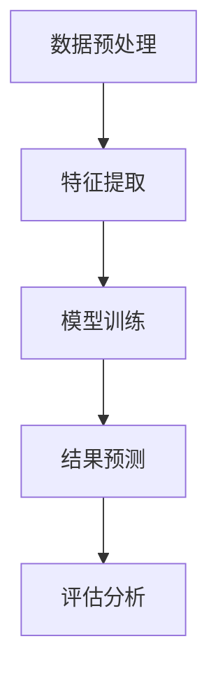
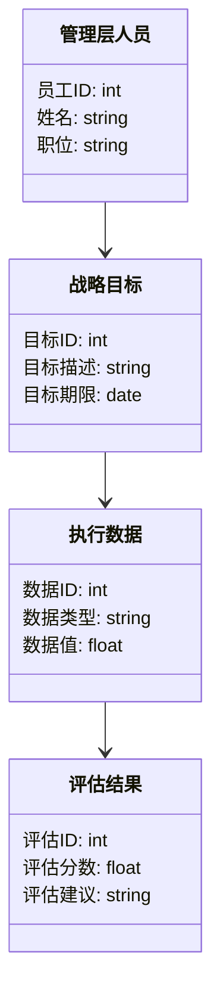
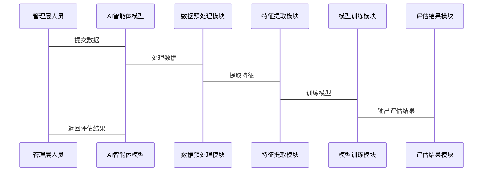

                 


# AI智能体在评估公司管理层执行力和战略规划能力中的应用

## 关键词：AI智能体、管理层执行力、战略规划能力、管理评估、人工智能技术

## 摘要：  
随着人工智能技术的飞速发展，AI智能体在企业管理领域的应用逐渐成为热点。本文深入探讨了AI智能体在评估公司管理层执行力和战略规划能力中的应用，从背景、原理、系统架构到实际案例，全面解析了这一技术的核心要点。通过分析AI智能体的算法原理、系统架构设计以及实际项目实现，本文为读者提供了清晰的技术路线和实践指导。  

---

# 第1章: AI智能体与管理评估概述

## 1.1 AI智能体的定义与核心概念  
AI智能体（Artificial Intelligence Agent）是指具有感知环境、自主决策和执行任务能力的智能系统。它能够通过数据输入、信息处理和模型推理，帮助管理者评估公司管理层的执行力和战略规划能力。  

### 1.1.1 AI智能体的基本定义  
AI智能体是一种能够感知环境、做出决策并执行动作的智能系统。它具备以下核心特征：  
1. **自主性**：能够自主完成任务，无需外部干预。  
2. **反应性**：能够实时感知环境变化并做出反应。  
3. **目标导向性**：具有明确的目标，并通过行为实现目标。  

### 1.1.2 智能体的核心属性与特征  
- **知识表示**：通过数据结构和逻辑规则表示知识。  
- **推理能力**：基于知识和数据进行逻辑推理。  
- **学习能力**：通过机器学习算法不断优化模型。  

### 1.1.3 AI智能体在管理评估中的应用潜力  
AI智能体可以通过分析海量数据，帮助管理者快速评估管理层的执行力和战略规划能力。其潜力主要体现在以下几个方面：  
1. **数据驱动决策**：通过分析历史数据和实时数据，提供科学的决策依据。  
2. **自动化评估**：自动完成数据采集、处理和评估过程，提高效率。  
3. **实时监控**：实时跟踪管理层的行为和结果，提供动态反馈。  

## 1.2 管理层执行力与战略规划能力的定义  
### 1.2.1 执行力的定义与关键要素  
执行力是指将战略目标转化为具体行动并实现目标的能力。其关键要素包括：  
1. **目标设定**：明确目标和优先级。  
2. **资源配置**：合理分配资源以支持目标实现。  
3. **过程监控**：实时跟踪执行过程并进行调整。  
4. **结果评估**：评估执行结果并进行反馈。  

### 1.2.2 战略规划能力的内涵与外延  
战略规划能力是指制定长期发展目标和实现路径的能力。其内涵包括：  
1. **目标设定**：明确企业的长期发展目标。  
2. **策略制定**：制定实现目标的具体策略和行动计划。  
3. **风险评估**：识别潜在风险并制定应对措施。  
4. **资源规划**：合理分配资源以支持战略实施。  

### 1.2.3 执行力与战略规划能力的关系  
执行力是战略规划能力的延续和具体实施。战略规划能力决定了企业的发展方向，而执行力则是实现目标的关键。两者相辅相成，共同推动企业目标的实现。  

## 1.3 AI智能体在管理评估中的问题背景  
### 1.3.1 传统管理评估的局限性  
传统管理评估方法通常依赖主观判断和经验分析，存在以下问题：  
1. **主观性**：评估结果容易受到评估者的主观影响。  
2. **低效性**：评估过程繁琐，耗时且成本高。  
3. **缺乏动态性**：无法实时跟踪管理层的行为和结果。  

### 1.3.2 AI技术在管理评估中的优势  
AI技术能够通过大数据分析和机器学习算法，提供客观、高效且动态的评估结果。其优势包括：  
1. **数据驱动**：基于大量数据提供科学评估。  
2. **自动化**：自动化完成数据采集、处理和分析过程。  
3. **实时性**：实时跟踪管理层的行为和结果，提供动态反馈。  

### 1.3.3 当前AI智能体在管理评估中的应用现状  
目前，AI智能体在管理评估中的应用主要集中在以下几个方面：  
1. **数据挖掘**：通过挖掘企业数据，识别管理层的执行能力和战略规划能力。  
2. **预测分析**：预测管理层的执行效果和战略目标的实现可能性。  
3. **决策支持**：为管理者提供实时的决策支持和优化建议。  

## 1.4 本章小结  
本章主要介绍了AI智能体的基本概念、管理层执行力和战略规划能力的定义及其关系，以及AI智能体在管理评估中的问题背景和应用优势。通过对这些内容的分析，为后续章节的深入探讨奠定了基础。  

---

# 第2章: AI智能体评估模型的核心概念与联系  

## 2.1 AI智能体评估模型的构成要素  
### 2.1.1 输入数据的类型与特征  
AI智能体评估模型的输入数据主要包括以下类型：  
1. **文本数据**：如公司战略文档、管理层会议记录等。  
2. **结构化数据**：如财务数据、项目进度数据等。  
3. **非结构化数据**：如社交媒体数据、员工反馈等。  

### 2.1.2 模型的处理逻辑与算法  
AI智能体评估模型的核心算法包括：  
1. **自然语言处理（NLP）**：用于分析文本数据，提取关键词和情感倾向。  
2. **机器学习**：用于分类、回归和聚类分析，预测管理层的执行能力和战略规划能力。  
3. **深度学习**：用于复杂模式识别和特征提取。  

### 2.1.3 输出结果的结构与意义  
模型输出的结果通常包括：  
1. **评估分数**：量化管理层的执行力和战略规划能力。  
2. **改进建议**：基于评估结果提出优化建议。  
3. **风险预警**：识别潜在风险并发出预警信号。  

## 2.2 核心概念的ER实体关系图  
```
```mermaid
erDiagram
    manager 管理层人员 : 员工ID, 姓名, 职位
    strategy 战略目标 : 目标ID, 目标描述, 目标期限
    execution 执行数据 : 数据ID, 数据类型, 数据值
    assessment 评估结果 : 评估ID, 评估分数, 评估建议
    ai_agent AI智能体模型 : 模型ID, 模型类型, 模型版本
    管理层人员 -->|拥有| 战略目标
    战略目标 -->|关联| 执行数据
    执行数据 -->|输入| AI智能体模型
    AI智能体模型 -->|输出| 评估结果
```
```

## 2.3 本章小结  
本章详细分析了AI智能体评估模型的构成要素及其关系，通过ER实体关系图展示了各实体之间的关联。这些内容为后续章节的算法原理和系统架构设计奠定了基础。  

---

# 第3章: AI智能体评估模型的算法原理  

## 3.1 智能体评估模型的算法流程  
```

```

## 3.2 算法实现的Python代码示例  

### 3.2.1 数据预处理代码  
```python
import pandas as pd

data = pd.read_csv('management_data.csv')
data = data.dropna()
```

### 3.2.2 特征提取代码  
```python
from sklearn.feature_extraction.text import TfidfVectorizer

vectorizer = TfidfVectorizer()
features = vectorizer.fit_transform(data['text'])
```

### 3.2.3 模型训练代码  
```python
from sklearn.model_selection import train_test_split
from sklearn.linear_model import LinearRegression

X_train, X_test, y_train, y_test = train_test_split(features, data['score'], test_size=0.2)
model = LinearRegression()
model.fit(X_train, y_train)
```

### 3.2.4 结果预测代码  
```python
y_pred = model.predict(X_test)
```

## 3.3 算法原理的数学模型和公式  
AI智能体评估模型的数学模型可以表示为：  
$$ y = \beta_0 + \beta_1x_1 + \beta_2x_2 + \ldots + \beta_nx_n + \epsilon $$  
其中，$y$ 是目标变量（管理层执行力或战略规划能力的评估分数），$x_i$ 是自变量（特征），$\beta_i$ 是回归系数，$\epsilon$ 是误差项。  

---

# 第4章: 系统分析与架构设计  

## 4.1 问题场景介绍  
本系统旨在通过AI智能体评估模型，帮助企业管理者快速评估管理层的执行力和战略规划能力。系统需要处理大量结构化和非结构化的数据，并通过机器学习算法生成评估结果和改进建议。  

## 4.2 系统功能设计  
### 4.2.1 领域模型  
```

```

### 4.2.2 系统架构设计  
```

```

## 4.3 系统接口设计  
系统接口主要包括数据输入接口、模型调用接口和结果输出接口。  

## 4.4 系统交互设计  
```

```

## 4.5 本章小结  
本章从系统角度分析了AI智能体评估模型的架构设计和交互流程，为后续章节的项目实现提供了指导。  

---

# 第5章: 项目实战  

## 5.1 环境安装  
- **Python版本**：3.8及以上  
- **依赖库**：Pandas、Scikit-learn、Mermaid  

## 5.2 核心代码实现  

### 5.2.1 数据预处理  
```python
import pandas as pd

data = pd.read_csv('management_data.csv')
data = data.dropna()
```

### 5.2.2 特征提取  
```python
from sklearn.feature_extraction.text import TfidfVectorizer

vectorizer = TfidfVectorizer()
features = vectorizer.fit_transform(data['text'])
```

### 5.2.3 模型训练与预测  
```python
from sklearn.model_selection import train_test_split
from sklearn.linear_model import LinearRegression

X_train, X_test, y_train, y_test = train_test_split(features, data['score'], test_size=0.2)
model = LinearRegression()
model.fit(X_train, y_train)
y_pred = model.predict(X_test)
```

## 5.3 代码应用解读与分析  
通过对上述代码的运行，我们可以得到管理层执行力和战略规划能力的评估分数。评估分数越高，说明管理层的能力越强。  

## 5.4 实际案例分析  
以某公司为例，假设我们有以下数据：  
```csv
管理层人员,战略目标,执行数据,评估分数
张三,市场拓展,销售额增长10%, 0.85
李四,产品创新,新产品开发周期缩短20%, 0.90
王五,成本控制,成本降低15%, 0.75
```

通过AI智能体模型的评估，我们可以得到每个管理层人员的评估分数，并基于这些分数提出改进建议。  

## 5.5 项目小结  
本章通过实际案例分析，展示了AI智能体评估模型的实现过程和应用效果。通过代码实现和案例分析，读者可以更好地理解AI智能体在管理评估中的实际应用。  

---

# 第6章: 最佳实践、小结、注意事项与拓展阅读  

## 6.1 最佳实践  
1. **数据质量**：确保数据的完整性和准确性，避免噪声数据的干扰。  
2. **模型选择**：根据具体场景选择合适的算法和模型。  
3. **持续优化**：定期更新模型和数据，保持评估结果的准确性。  

## 6.2 小结  
本文从理论到实践，全面探讨了AI智能体在评估公司管理层执行力和战略规划能力中的应用。通过算法原理、系统架构设计和项目实战的详细讲解，为读者提供了完整的技术路线和实践指导。  

## 6.3 注意事项  
1. **数据隐私**：在处理企业数据时，需注意数据隐私和合规性。  
2. **模型解释性**：确保模型的可解释性，便于管理者理解和使用评估结果。  
3. **技术支持**：在实际应用中，建议配备专业的技术支持团队，确保系统的稳定运行。  

## 6.4 拓展阅读  
1. 《机器学习实战》  
2. 《深度学习入门：基于Python》  
3. 《自然语言处理入门》  

---

# 作者：AI天才研究院/AI Genius Institute & 禅与计算机程序设计艺术 /Zen And The Art of Computer Programming

