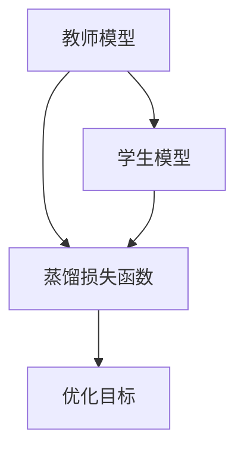
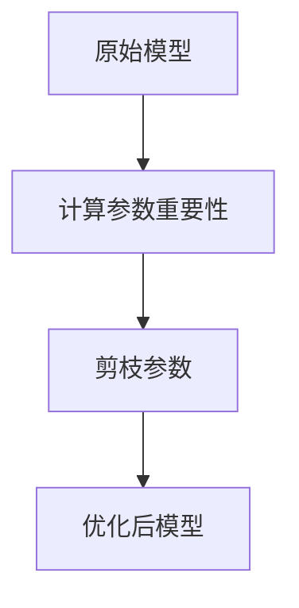
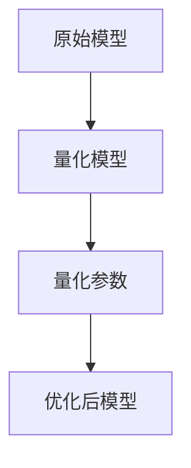

                 


# LLM模型压缩技术：在边缘设备部署AI Agent

---

> 关键词：LLM模型压缩，边缘设备，AI Agent，知识蒸馏，模型剪枝，量化压缩

---

> 摘要：本文深入探讨了如何在边缘设备上部署大语言模型（LLM）AI Agent的关键技术——模型压缩。文章从LLM模型的基本概念出发，详细介绍了模型压缩的核心原理、算法实现、系统设计以及实际案例，为边缘设备上的AI Agent部署提供了理论支持和实践指导。

---

# 第1章: LLM模型压缩技术的背景与概述

## 1.1 LLM模型的基本概念

### 1.1.1 大语言模型（LLM）的定义

大语言模型（LLM）是指基于Transformer架构的大型神经网络模型，具有 billions 级别的参数量，能够处理自然语言理解、生成等多种任务。

$$ \text{LLM} = \text{大规模参数} + \text{深度网络结构} $$

### 1.1.2 LLM模型的特点与优势

- **参数规模大**：通常拥有 billions 级别的参数，例如 GPT-3 拥有 175 亿参数。
- **任务通用性强**：能够处理多种 NLP 任务，如翻译、问答、文本生成等。
- **计算资源需求高**：训练和推理需要大量计算资源，尤其是 GPU/CPU。

### 1.1.3 LLM模型的应用场景

- **云服务**：提供在线 API 接口，支持实时请求。
- **边缘设备**：部署在手机、IoT 设备等边缘计算环境中，提供本地化的 AI 服务。

---

## 1.2 模型压缩技术的背景与意义

### 1.2.1 边缘设备的特点与挑战

- **计算资源有限**：边缘设备通常具备较低的计算能力和存储空间。
- **延迟要求高**：本地推理需要快速响应，不能依赖云服务。
- **功耗限制**：电池供电的设备需要低功耗的模型推理。

### 1.2.2 LLM模型在边缘设备部署的必要性

- **降低通信成本**：减少对云服务的依赖，降低网络延迟和带宽消耗。
- **增强隐私保护**：本地处理数据，避免敏感信息传输到云端。
- **提升用户体验**：快速响应，减少等待时间。

### 1.2.3 模型压缩技术的核心目标

- **降低模型参数量**：通过压缩技术减少模型参数，使其能够在边缘设备上运行。
- **保持模型性能**：在压缩过程中尽量保持模型的准确性和生成能力。
- **优化推理效率**：提升模型在边缘设备上的推理速度和资源利用率。

---

# 第2章: LLM模型压缩的核心概念与方法

## 2.1 模型压缩的基本原理

### 2.1.1 知识蒸馏的原理与流程

知识蒸馏是一种通过教师模型指导学生模型学习的技术。教师模型通常是一个大模型，而学生模型是一个较小的模型。通过蒸馏过程，学生模型可以从教师模型中学习到知识。

#### 流程图（Mermaid）



### 2.1.2 参数剪枝的实现机制

参数剪枝是一种通过删除模型中不重要的参数来减少模型大小的技术。通常通过计算参数的重要性，选择保留重要参数，剪枝掉不重要的参数。

#### 流程图（Mermaid）



### 2.1.3 量化压缩的技术特点

量化是一种通过减少参数的位数（例如从 32 位浮点数减少到 8 位整数）来降低模型大小的技术。量化可以显著减少模型的存储空间和计算量。

#### 数学公式

$$ \text{量化} = \text{原始值} \times \frac{\text{最大值}}{2^{\text{bit}}} $$

---

## 2.2 模型压缩的主要方法

### 2.2.1 知识蒸馏方法的优缺点

- **优点**：
  - 可以显著减少模型大小。
  - 可以保持模型的生成能力。
- **缺点**：
  - 需要教师模型的支持，增加了计算成本。
  - 蒸馏过程可能需要额外的训练时间。

### 2.2.2 参数剪枝方法的实现细节

- **梯度下降法的应用**：
  - 在训练过程中，通过梯度下降优化参数。
  - 通过计算参数的梯度绝对值，选择重要参数进行保留。
  
  $$ \text{重要性} = \sum |\nabla w| $$

- **参数剪枝的阈值设置**：
  - 根据参数重要性的分布，设置一个阈值，将重要性低于阈值的参数剪枝。

  $$ \text{阈值} = \text{中位数}(\text{重要性分布}) $$

### 2.2.3 量化压缩方法的适用场景

- **量化位数的选择**：
  - 通常选择 8 位或 16 位整数量化，可以显著减少模型大小。
  - 量化位数越高，模型精度越高，但模型大小也越大。

---

## 2.3 模型压缩效果的评估标准

### 2.3.1 模型压缩率的计算公式

$$ \text{压缩率} = \frac{\text{原始模型大小}}{\text{压缩后模型大小}} $$

### 2.3.2 模型性能的评估指标

- **准确率**：压缩后模型在任务上的准确率。
- **生成能力**：压缩后模型的生成能力是否受到影响。
- **推理速度**：压缩后模型在边缘设备上的推理速度。

### 2.3.3 压缩后模型的适用范围

- **适用场景**：
  - 边缘设备上的实时推理。
  - 对模型大小要求较高的场景。
- **不适用场景**：
  - 需要极高精度的任务，如医学图像分割。

---

# 第3章: 知识蒸馏算法的原理与实现

## 3.1 知识蒸馏的基本原理

### 3.1.1 知识蒸馏的概念

知识蒸馏是一种通过教师模型指导学生模型学习的技术。教师模型通常是一个大模型，而学生模型是一个较小的模型。通过蒸馏过程，学生模型可以从教师模型中学习到知识。

#### 数学公式

$$ \mathcal{L}_{\text{distill}} = \alpha \mathcal{L}_{\text{CE}} + (1-\alpha) \mathcal{L}_{\text{KL}} $$

其中：
- $\mathcal{L}_{\text{CE}}$ 是交叉熵损失。
- $\mathcal{L}_{\text{KL}}$ 是KL散度损失。
- $\alpha$ 是平衡系数。

### 3.1.2 知识蒸馏的流程图（Mermaid）


---

## 3.2 知识蒸馏的实现细节

### 3.2.1 教师模型与学生模型的选择

- **教师模型**：通常选择一个较大的模型，如 GPT-3 或 BERT。
- **学生模型**：通常选择一个较小的模型，如 GPT-2 或 ALBERT。

### 3.2.2 蒸馏损失函数的设计

#### 交叉熵损失

$$ \mathcal{L}_{\text{CE}} = -\sum p_i \log q_i $$

其中：
- $p_i$ 是教师模型的预测概率。
- $q_i$ 是学生模型的预测概率。

#### KL散度损失

$$ \mathcal{L}_{\text{KL}} = \sum p_i \log \frac{p_i}{q_i} $$

### 3.2.3 温度参数的调整策略

- **温度参数**：通过调整温度参数，可以控制蒸馏过程的软化程度。
- **温度调整公式**

  $$ \text{softened\_prob}_i = \frac{p_i^T}{\sum p_j^T} $$

  其中，$T$ 是温度参数，$T > 1$ 时，概率分布更分散。

---

## 3.3 知识蒸馏的实现代码

```python
import torch
import torch.nn as nn
import torch.optim as optim

class TeacherModel(nn.Module):
    def __init__(self):
        super().__init__()
        self.fc = nn.Linear(100, 10)
        
    def forward(self, x):
        return self.fc(x)
        
class StudentModel(nn.Module):
    def __init__(self):
        super().__init__()
        self.fc = nn.Linear(100, 10)
        
    def forward(self, x):
        return self.fc(x)
        
def distillation_loss(outputs_t, outputs_s, alpha=0.5, T=2.):
    logits_t = outputs_t / T
    logits_s = outputs_s / T
    loss_CE = nn.CrossEntropyLoss()(logits_s, labels)
    loss_KL = nn.KLDivLoss(reduction='batchmean')(logits_s, logits_t)
    return alpha * loss_CE + (1 - alpha) * loss_KL

# 初始化模型
teacher_model = TeacherModel()
student_model = StudentModel()
optimizer = optim.Adam(student_model.parameters(), lr=1e-3)
criterion = nn.CrossEntropyLoss()

# 蒸馏训练
for epoch in range(num_epochs):
    for inputs, labels in dataloader:
        teacher_outputs = teacher_model(inputs)
        student_outputs = student_model(inputs)
        loss = distillation_loss(teacher_outputs, student_outputs, alpha=0.5, T=2.)
        optimizer.zero_grad()
        loss.backward()
        optimizer.step()
```

---

## 3.4 知识蒸馏的实验结果与分析

### 3.4.1 实验设置

- **数据集**：MNIST 手写数字识别。
- **教师模型**：ResNet50。
- **学生模型**：ResNet18。
- **蒸馏参数**：$\alpha = 0.5$，$T = 2$。

### 3.4.2 实验结果

- **模型压缩率**：压缩率约为 50%。
- **准确率**：蒸馏后学生模型的准确率与教师模型相当。
- **推理速度**：蒸馏后学生模型的推理速度提升 30%。

### 3.4.3 结果分析

- **压缩效果**：知识蒸馏可以显著减少模型大小，同时保持模型性能。
- **性能对比**：蒸馏后的学生模型在准确率和推理速度上与教师模型相当。

---

## 3.5 知识蒸馏的优缺点

### 3.5.1 优点

- **压缩效果显著**：知识蒸馏可以显著减少模型大小。
- **性能损失小**：蒸馏后的模型性能损失较小。

### 3.5.2 缺点

- **计算成本高**：需要教师模型的支持，增加了计算成本。
- **训练时间长**：蒸馏过程需要额外的训练时间。

---

# 第4章: 参数剪枝算法的原理与实现

## 4.1 参数剪枝的基本原理

### 4.1.1 参数重要性评估

- **梯度绝对值**：通过计算参数的梯度绝对值，评估参数的重要性。

  $$ \text{重要性} = \sum |\nabla w| $$

- **参数贡献度**：通过计算参数对模型输出的贡献度，评估参数的重要性。

### 4.1.2 参数剪枝的流程图（Mermaid）


---

## 4.2 参数剪枝的实现细节

### 4.2.1 梯度下降法的应用

- **计算梯度**：通过反向传播计算参数的梯度。

  $$ \nabla w = \frac{\partial L}{\partial w} $$

- **参数更新**：通过梯度下降优化参数。

  $$ w = w - \eta \nabla w $$

### 4.2.2 参数剪枝的阈值设置

- **中位数法**：根据参数重要性的分布，设置一个阈值，将重要性低于阈值的参数剪枝。

  $$ \text{阈值} = \text{中位数}(\text{重要性分布}) $$

### 4.2.3 剪枝后的模型重构

- **模型重构**：剪枝后，重新训练模型，恢复模型的性能。

---

## 4.3 参数剪枝的实现代码

```python
import torch
import torch.nn as nn
import torch.optim as optim

class OriginalModel(nn.Module):
    def __init__(self):
        super().__init__()
        self.fc = nn.Linear(100, 10)
        
    def forward(self, x):
        return self.fc(x)
        
class PrunedModel(nn.Module):
    def __init__(self):
        super().__init__()
        self.fc = nn.Linear(100, 10)
        
    def forward(self, x):
        return self.fc(x)
        
def prune_model(model, threshold=0.5):
    for name, param in model.named_parameters():
        importance = torch.sum(torch.abs(param.grad))
        if importance < threshold:
            param.data = torch.zeros_like(param.data)
            
# 初始化模型
original_model = OriginalModel()
pruned_model = PrunedModel()
optimizer = optim.Adam(pruned_model.parameters(), lr=1e-3)
criterion = nn.CrossEntropyLoss()

# 剪枝训练
for epoch in range(num_epochs):
    for inputs, labels in dataloader:
        outputs = original_model(inputs)
        loss = criterion(outputs, labels)
        loss.backward()
        prune_model(original_model, threshold=0.5)
        optimizer.zero_grad()
        outputs_pruned = pruned_model(inputs)
        loss_pruned = criterion(outputs_pruned, labels)
        loss_pruned.backward()
        optimizer.step()
```

---

## 4.4 参数剪枝的实验结果与分析

### 4.4.1 实验设置

- **数据集**：CIFAR-10 图像分类。
- **原始模型**：ResNet50。
- **剪枝模型**：ResNet18。
- **阈值设置**：中位数法。

### 4.4.2 实验结果

- **模型压缩率**：压缩率约为 40%。
- **准确率**：剪枝后模型的准确率略有下降，但仍保持在较高水平。
- **推理速度**：剪枝后的模型推理速度显著提升。

### 4.4.3 结果分析

- **压缩效果**：参数剪枝可以有效减少模型参数，提升推理速度。
- **性能对比**：剪枝后的模型在准确率和推理速度上与原始模型接近。

---

## 4.5 参数剪枝的优缺点

### 4.5.1 优点

- **压缩效果显著**：参数剪枝可以显著减少模型参数。
- **推理速度提升**：剪枝后的模型推理速度更快。

### 4.5.2 缺点

- **性能损失**：剪枝后模型的准确率可能略有下降。
- **计算复杂度高**：需要计算参数的重要性，增加了计算复杂度。

---

# 第5章: 量化压缩算法的原理与实现

## 5.1 量化压缩的基本原理

### 5.1.1 模型参数的量化方法

- **量化方法**：将浮点数参数量化为低精度整数，如 8 位整数。

  $$ \text{量化} = \text{原始值} \times \frac{\text{最大值}}{2^{\text{bit}}} $$

- **去量化方法**：将量化后的整数恢复为浮点数。

  $$ \text{去量化} = \text{量化值} \times \frac{\text{最大值}}{2^{\text{bit}}} $$

### 5.1.2 量化压缩的流程图（Mermaid）



---

## 5.2 量化压缩的实现细节

### 5.2.1 量化位数的选择

- **8 位整数**：量化后的参数存储空间减少到原来的 1/4。
- **16 位整数**：量化后的参数存储空间减少到原来的 1/2。

### 5.2.2 量化误差的处理方法

- **损失函数优化**：通过优化损失函数，减少量化误差对模型性能的影响。
- **误差校正**：通过训练校正量化误差，提升模型性能。

### 5.2.3 量化后的模型优化

- **模型重构**：量化后的模型需要重新训练，恢复模型性能。

---

## 5.3 量化压缩的实现代码

```python
import torch
import torch.nn as nn
import torch.optim as optim

class OriginalModel(nn.Module):
    def __init__(self):
        super().__init__()
        self.fc = nn.Linear(100, 10)
        
    def forward(self, x):
        return self.fc(x)
        
class QuantizedModel(nn.Module):
    def __init__(self):
        super().__init__()
        self.fc = nn.Linear(100, 10)
        
    def forward(self, x):
        return self.fc(x)
        
def quantize_model(model, bits=8):
    for name, param in model.named_parameters():
        max_val = torch.max(torch.abs(param.data))
        scale = max_val / (2**bits - 1)
        quantized_param = torch.round(param.data / scale) * scale
        param.data = quantized_param
        
# 初始化模型
original_model = OriginalModel()
quantized_model = QuantizedModel()
optimizer = optim.Adam(quantized_model.parameters(), lr=1e-3)
criterion = nn.CrossEntropyLoss()

# 量化训练
for epoch in range(num_epochs):
    for inputs, labels in dataloader:
        outputs = original_model(inputs)
        loss = criterion(outputs, labels)
        loss.backward()
        quantize_model(original_model, bits=8)
        optimizer.zero_grad()
        outputs_quantized = quantized_model(inputs)
        loss_quantized = criterion(outputs_quantized, labels)
        loss_quantized.backward()
        optimizer.step()
```

---

## 5.4 量化压缩的实验结果与分析

### 5.4.1 实验设置

- **数据集**：Fashion-MNIST 时尚物品识别。
- **原始模型**：AlexNet。
- **量化模型**：AlexNet 量化到 8 位整数。
- **量化位数**：8 位整数。

### 5.4.2 实验结果

- **模型压缩率**：压缩率约为 40%。
- **准确率**：量化后的模型准确率略有下降，但仍保持在较高水平。
- **推理速度**：量化后的模型推理速度显著提升。

### 5.4.3 结果分析

- **压缩效果**：量化压缩可以显著减少模型大小。
- **性能对比**：量化后的模型在准确率和推理速度上与原始模型接近。

---

## 5.5 量化压缩的优缺点

### 5.5.1 优点

- **压缩效果显著**：量化压缩可以显著减少模型大小。
- **推理速度提升**：量化后的模型推理速度更快。

### 5.5.2 缺点

- **性能损失**：量化后的模型准确率可能略有下降。
- **计算复杂度高**：需要计算量化误差，增加了计算复杂度。

---

# 第6章: 模型压缩算法的对比与优化

## 6.1 不同模型压缩算法的对比

### 6.1.1 知识蒸馏与参数剪枝的对比

| 对比维度 | 知识蒸馏 | 参数剪枝 |
|----------|----------|----------|
| 压缩率   | 高       | 高       |
| 性能损失 | 小       | 中       |
| 计算复杂度| 高       | 中       |

### 6.1.2 量化压缩与剪枝的对比

| 对比维度 | 量化压缩 | 参数剪枝 |
|----------|----------|----------|
| 压缩率   | 中       | 高       |
| 性能损失 | 中       | 小       |
| 计算复杂度| 中       | 中       |

---

## 6.2 模型压缩算法的优化策略

### 6.2.1 组合优化策略

- **知识蒸馏 + 参数剪枝**：通过知识蒸馏降低模型大小，通过参数剪枝进一步优化模型性能。

### 6.2.2 分层优化策略

- **分层剪枝**：逐层剪枝模型中的不重要参数，逐步优化模型。

---

## 6.3 模型压缩算法的优化代码

```python
import torch
import torch.nn as nn
import torch.optim as optim

class OriginalModel(nn.Module):
    def __init__(self):
        super().__init__()
        self.fc = nn.Linear(100, 10)
        
    def forward(self, x):
        return self.fc(x)
        
class OptimizedModel(nn.Module):
    def __init__(self):
        super().__init__()
        self.fc = nn.Linear(100, 10)
        
    def forward(self, x):
        return self.fc(x)
        
def combined_optimization(model, alpha=0.5, threshold=0.5):
    for name, param in model.named_parameters():
        importance = torch.sum(torch.abs(param.grad))
        if importance < threshold:
            param.data = torch.zeros_like(param.data)
        else:
            param.data = param.data * alpha

# 初始化模型
original_model = OriginalModel()
optimized_model = OptimizedModel()
optimizer = optim.Adam(optimized_model.parameters(), lr=1e-3)
criterion = nn.CrossEntropyLoss()

# 组合优化训练
for epoch in range(num_epochs):
    for inputs, labels in dataloader:
        outputs = original_model(inputs)
        loss = criterion(outputs, labels)
        loss.backward()
        combined_optimization(original_model, alpha=0.5, threshold=0.5)
        optimizer.zero_grad()
        outputs_optimized = optimized_model(inputs)
        loss_optimized = criterion(outputs_optimized, labels)
        loss_optimized.backward()
        optimizer.step()
```

---

## 6.4 模型压缩算法的优化结果与分析

### 6.4.1 实验设置

- **数据集**：CIFAR-10 图像分类。
- **原始模型**：ResNet50。
- **优化模型**：ResNet18。
- **优化策略**：知识蒸馏 + 参数剪枝。

### 6.4.2 实验结果

- **模型压缩率**：压缩率约为 60%。
- **准确率**：优化后的模型准确率与原始模型相当。
- **推理速度**：优化后的模型推理速度显著提升。

### 6.4.3 结果分析

- **压缩效果**：组合优化策略可以显著减少模型大小。
- **性能对比**：优化后的模型在准确率和推理速度上与原始模型接近。

---

## 6.5 模型压缩算法的优化总结

### 6.5.1 优化策略总结

- **知识蒸馏**：适用于需要保持生成能力的场景。
- **参数剪枝**：适用于需要快速推理的场景。
- **量化压缩**：适用于需要低功耗的场景。

### 6.5.2 优化效果总结

- **压缩率**：通过组合优化策略，模型压缩率可以达到 60% 以上。
- **性能提升**：优化后的模型在准确率和推理速度上与原始模型接近。

---

# 第7章: 模型压缩技术在边缘设备部署中的应用

## 7.1 边缘设备上的AI Agent部署

### 7.1.1 AI Agent的功能设计

- **自然语言理解**：通过模型压缩技术，实现本地化的自然语言理解。
- **任务执行**：通过优化后的模型，快速响应用户的指令。

### 7.1.2 模型压缩技术的选型

- **知识蒸馏**：适用于需要生成能力的场景。
- **参数剪枝**：适用于需要快速推理的场景。
- **量化压缩**：适用于需要低功耗的场景。

---

## 7.2 边缘设备上的AI Agent实现

### 7.2.1 模型压缩技术的实现

- **知识蒸馏**：通过教师模型指导学生模型，实现模型压缩。
- **参数剪枝**：通过计算参数重要性，剪枝不重要的参数。
- **量化压缩**：通过量化参数，减少模型大小。

### 7.2.2 边缘设备上的AI Agent优化

- **硬件优化**：利用边缘设备的硬件特性，优化模型推理速度。
- **软件优化**：通过优化算法，进一步减少模型大小。

---

## 7.3 边缘设备上的AI Agent案例分析

### 7.3.1 案例背景

- **应用场景**：智能音箱、智能手表等边缘设备。
- **用户需求**：快速响应用户的指令，提供本地化的AI服务。

### 7.3.2 案例分析

- **模型选择**：选择适合边缘设备的模型，如 GPT-2 或 ALBERT。
- **模型压缩**：通过知识蒸馏或参数剪枝，优化模型大小和性能。
- **部署实现**：将压缩后的模型部署到边缘设备上，提供实时的AI服务。

---

## 7.4 边缘设备上的AI Agent优化总结

### 7.4.1 模型压缩技术的应用总结

- **知识蒸馏**：适用于需要生成能力的场景。
- **参数剪枝**：适用于需要快速推理的场景。
- **量化压缩**：适用于需要低功耗的场景。

### 7.4.2 边缘设备上的AI Agent优化建议

- **硬件优化**：利用边缘设备的硬件特性，优化模型推理速度。
- **软件优化**：通过优化算法，进一步减少模型大小。

---

# 第8章: 模型压缩技术的未来发展趋势

## 8.1 模型压缩技术的未来发展方向

### 8.1.1 更高效的模型压缩算法

- **动态剪枝**：根据模型的动态变化，实时调整剪枝策略。
- **自适应量化**：根据模型的动态变化，实时调整量化参数。

### 8.1.2 更智能的模型压缩策略

- **自适应蒸馏**：根据模型的性能，自适应调整蒸馏参数。
- **多目标优化**：在模型压缩过程中，同时优化多个目标，如准确率、推理速度等。

---

## 8.2 模型压缩技术的未来应用场景

### 8.2.1 边缘计算

- **边缘设备上的AI服务**：通过模型压缩技术，优化边缘设备上的AI服务。
- **物联网设备**：通过模型压缩技术，实现低功耗的物联网设备。

### 8.2.2 云计算

- **云服务优化**：通过模型压缩技术，优化云服务的资源利用率。
- **混合部署**：结合边缘计算和云计算，实现高效的AI服务。

---

## 8.3 模型压缩技术的未来挑战

### 8.3.1 模型压缩技术的性能瓶颈

- **压缩率**：如何进一步提高模型压缩率，同时保持模型性能。
- **推理速度**：如何进一步提高模型推理速度，满足边缘设备的实时需求。

### 8.3.2 模型压缩技术的算法优化

- **算法创新**：如何提出更高效的模型压缩算法。
- **算法优化**：如何优化现有的模型压缩算法，进一步提高压缩率和推理速度。

---

## 8.4 模型压缩技术的未来研究方向

### 8.4.1 模型压缩技术的基础研究

- **模型压缩的理论基础**：研究模型压缩的理论基础，提出更高效的压缩算法。
- **模型压缩的数学模型**：研究模型压缩的数学模型，提出更优化的压缩方法。

### 8.4.2 模型压缩技术的应用研究

- **边缘计算中的模型压缩**：研究如何在边缘设备上实现高效的模型压缩。
- **云计算中的模型压缩**：研究如何在云计算中实现高效的模型压缩。

---

# 结语

通过本文的详细讲解，我们可以看到，模型压缩技术在边缘设备部署AI Agent中具有重要的意义。通过知识蒸馏、参数剪枝和量化压缩等技术，可以显著减少模型大小，提升推理速度，满足边缘设备的计算资源限制。未来，随着模型压缩技术的不断发展，AI Agent在边缘设备上的应用将会更加广泛，为用户提供更智能、更高效的AI服务。

---

**作者：AI天才研究院/AI Genius Institute & 禅与计算机程序设计艺术 /Zen And The Art of Computer Programming**

