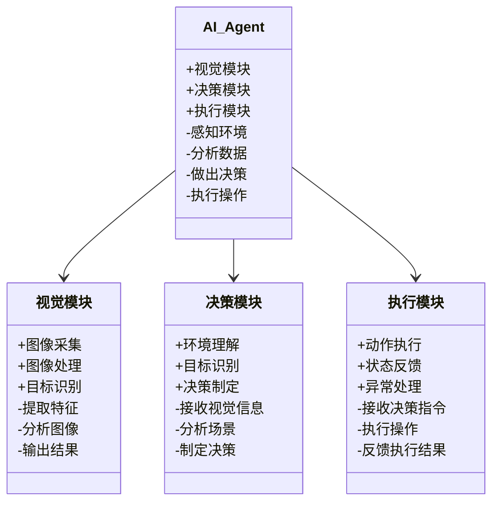
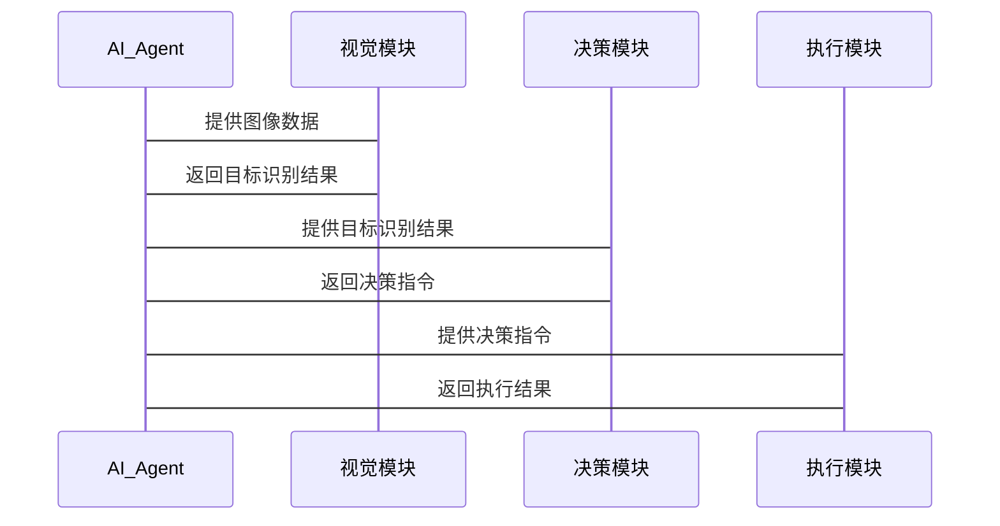

                 


# 实现AI Agent的视觉理解能力：图像识别与分析

---

## 关键词：
AI Agent, 视觉理解, 图像识别, 深度学习, 图像分析, 计算机视觉, 系统架构

---

## 摘要：
本文深入探讨了AI Agent的视觉理解能力，重点分析了图像识别与分析的核心技术。通过系统化的结构，从AI Agent的背景与概念出发，逐步解析视觉理解能力的关键模块、算法原理、系统架构及实际应用。文章不仅详细讲解了图像分类、目标检测和图像分割等算法的实现原理，还结合实际案例，展示了如何将这些技术应用于AI Agent系统中。通过数学公式、mermaid图和代码示例，本文为读者提供了从理论到实践的全面指导，帮助读者掌握AI Agent视觉理解能力的实现方法。

---

## 第一部分：AI Agent视觉理解能力的背景与概述

## 第2章：AI Agent与视觉理解能力概述

### 2.1 AI Agent的基本概念

#### 2.1.1 AI Agent的定义
AI Agent（人工智能代理）是指能够感知环境、自主决策并执行任务的智能实体。它能够通过传感器获取信息，利用推理能力进行分析，并通过执行器与环境交互。

#### 2.1.2 AI Agent的核心特征
- **自主性**：能够在没有外部干预的情况下自主运行。
- **反应性**：能够实时感知环境并做出反应。
- **目标导向**：具有明确的目标，并通过行动实现目标。
- **学习能力**：能够通过经验改进性能。

#### 2.1.3 AI Agent的分类与应用场景
AI Agent可以分为**简单反射型**、**基于模型的反应型**、**目标导向型**和**实用导向型**。其应用场景包括自动驾驶、智能助手、机器人控制、图像识别等。

---

### 2.2 视觉理解能力的定义与重要性

#### 2.2.1 视觉理解能力的定义
视觉理解能力是指AI Agent能够通过视觉感知（如图像或视频）获取信息，并通过分析和理解这些信息来执行任务的能力。

#### 2.2.2 视觉理解能力在AI Agent中的作用
- **环境感知**：帮助AI Agent理解周围环境的物理布局。
- **目标识别与跟踪**：识别特定目标并进行实时跟踪。
- **交互与决策支持**：通过视觉信息辅助决策，与人类或其他系统进行交互。

#### 2.2.3 视觉理解能力的应用场景
- **自动驾驶**：识别道路、车辆、行人和交通标志。
- **智能安防**：监控视频中的异常行为检测。
- **机器人操作**：通过视觉感知抓取和操作物体。

---

### 2.3 图像识别与分析的背景与技术发展

#### 2.3.1 图像识别技术的发展历程
图像识别技术经历了从传统的图像处理到基于深度学习的转变。早期的图像识别依赖于手工特征提取，而深度学习的兴起（特别是卷积神经网络CNN）极大地推动了图像识别技术的发展。

#### 2.3.2 深度学习在图像识别中的应用
深度学习模型（如CNN、ResNet、Faster R-CNN等）在图像分类、目标检测和图像分割等任务中表现出色。

#### 2.3.3 当前图像识别技术的挑战与未来趋势
当前图像识别技术面临数据多样性、实时性、鲁棒性等问题。未来，多模态数据的融合、轻量化模型和边缘计算将是图像识别技术的重要发展方向。

---

### 2.4 本章小结
本章介绍了AI Agent的基本概念、视觉理解能力的定义与重要性，以及图像识别技术的发展历程和未来趋势。通过这些内容，读者可以理解AI Agent视觉理解能力的核心作用及其在实际场景中的广泛应用。

---

## 第三部分：图像识别与分析的算法原理

## 第3章：图像分类算法原理

### 3.1 基于CNN的图像分类

#### 3.1.1 卷积神经网络（CNN）的结构与原理
CNN是一种深度学习模型，通过卷积层、池化层和全连接层的组合，能够有效地提取图像的高层次特征。

**CNN的结构**：
- **卷积层**：提取图像的空间特征。
- **池化层**：降低计算复杂度并提取更具判别性的特征。
- **全连接层**：将卷积层输出的特征向量映射到类别标签。

#### 3.1.2 常见的CNN模型
- **AlexNet**：首个在ImageNet大规模视觉识别挑战赛（ILSVRC）中取得优异成绩的CNN模型。
- **VGGNet**：通过堆叠多个3x3卷积核简化网络结构。
- **ResNet**：通过残差学习结构缓解深层网络中的梯度消失问题。

#### 3.1.3 图像分类任务的损失函数与优化方法
- **损失函数**：常用的损失函数包括交叉熵损失和均方误差损失。
- **优化方法**：常用的优化算法包括随机梯度下降（SGD）、Adam优化器等。

---

#### 3.1.4 图像分类任务的实现流程
**步骤1：数据预处理与增强**
- 数据增强技术（如旋转、缩放、翻转等）可以提高模型的泛化能力。

**步骤2：模型训练与调优**
- 使用训练数据训练模型，并通过验证集调整模型参数以防止过拟合。

**步骤3：模型评估与部署**
- 使用测试集评估模型性能，并将模型部署到实际应用中。

---

### 3.2 实例分析：图像分类任务的实现

#### 3.2.1 使用PyTorch实现图像分类
以下是基于PyTorch实现图像分类任务的代码示例：

```python
import torch
import torch.nn as nn
import torch.optim as optim
from torchvision import datasets, transforms

# 数据预处理与增强
transform = transforms.Compose([
    transforms.Resize((32, 32)),
    transforms.ToTensor(),
    transforms.Normalize((0.5, 0.5, 0.5), (0.5, 0.5, 0.5)),
])

# 加载数据集
train_dataset = datasets.CIFAR10(root='./data', train=True, download=True, transform=transform)
train_loader = torch.utils.data.DataLoader(train_dataset, batch_size=32, shuffle=True, num_workers=2)

# 定义模型
class SimpleCNN(nn.Module):
    def __init__(self):
        super(SimpleCNN, self).__init__()
        self.conv1 = nn.Conv2d(3, 6, 5, padding=2)
        self.pool = nn.MaxPool2d(2, 2)
        self.conv2 = nn.Conv2d(6, 16, 5, padding=2)
        self.fc = nn.Linear(16 * 5 * 5, 120)
        self.output = nn.Linear(120, 10)

    def forward(self, x):
        x = self.pool(F.relu(self.conv1(x)))
        x = self.pool(F.relu(self.conv2(x)))
        x = x.view(x.size(0), -1)
        x = F.relu(self.fc(x))
        x = self.output(x)
        return x

# 初始化模型和优化器
model = SimpleCNN()
criterion = nn.CrossEntropyLoss()
optimizer = optim.SGD(model.parameters(), lr=0.001)

# 训练模型
for epoch in range(10):
    for batch_x, batch_y in train_loader:
        outputs = model(batch_x)
        loss = criterion(outputs, batch_y)
        optimizer.zero_grad()
        loss.backward()
        optimizer.step()

print("模型训练完成！")
```

---

#### 3.2.2 模型训练与预测的代码示例
以下是基于PyTorch实现图像分类任务的预测代码：

```python
# 加载训练好的模型
model.load_state_dict(torch.load('cnn.pth'))

# 加载测试图像
test_image = datasets.CIFAR10(root='./data', train=False, download=True, transform=transform)[0][0]

# 预测类别
outputs = model(test_image.unsqueeze(0))
_, predicted = torch.max(outputs.data, 1)
print("预测的类别为：", predicted.item())
```

---

#### 3.2.3 实验结果分析与优化建议
- **实验结果分析**：通过混淆矩阵和分类准确率评估模型性能。
- **优化建议**：增加数据增强、调整学习率、优化网络结构等。

---

### 3.3 本章小结
本章详细讲解了基于CNN的图像分类算法，包括模型结构、训练流程和实现代码。通过实例分析，读者可以掌握图像分类任务的基本实现方法。

---

## 第4章：目标检测算法原理

### 4.1 基于目标检测算法的核心原理

#### 4.1.1 目标检测的定义与挑战
目标检测是指在图像中定位并识别目标物体的位置和类别。其挑战包括小目标检测、遮挡处理和多样化的物体形状。

#### 4.1.2 常见的目标检测算法
- **Faster R-CNN**：通过区域建议网络（RPN）生成候选框，再进行目标检测。
- **YOLO**：单阶段目标检测算法，具有高检测速度。
- **SSD**：通过多尺度特征图进行目标检测。

---

### 4.2 使用YOLO实现目标检测

#### 4.2.1 YOLO算法的结构与原理
YOLO通过将图像划分为多个网格，每个网格负责检测特定区域内的目标物体。

#### 4.2.2 YOLO的实现流程
- **图像输入**：将图像输入YOLO网络，得到特征图。
- **候选框生成**：在特征图上生成候选框，并预测每个候选框的类别和置信度。
- **非极大值抑制（NMS）**：去除重叠的候选框，保留置信度高的结果。

---

#### 4.2.3 YOLO的代码实现
以下是基于PyTorch实现YOLO目标检测的代码示例：

```python
import torch
import torch.nn as nn
from torchvision import transforms

# 定义YOLO模型
class YOLO(nn.Module):
    def __init__(self):
        super(YOLO, self).__init__()
        self.conv1 = nn.Conv2d(3, 32, 3, padding=1)
        self.pool = nn.MaxPool2d(2, 2)
        self.conv2 = nn.Conv2d(32, 64, 3, padding=1)
        self.fc = nn.Linear(64 * 16 * 16, 120)
        self.output = nn.Linear(120, 20)

    def forward(self, x):
        x = self.pool(F.relu(self.conv1(x)))
        x = self.pool(F.relu(self.conv2(x)))
        x = x.view(x.size(0), -1)
        x = F.relu(self.fc(x))
        x = self.output(x)
        return x

# 初始化模型和优化器
model = YOLO()
criterion = nn.CrossEntropyLoss()
optimizer = optim.SGD(model.parameters(), lr=0.001)

# 训练模型
for epoch in range(10):
    for batch_x, batch_y in train_loader:
        outputs = model(batch_x)
        loss = criterion(outputs, batch_y)
        optimizer.zero_grad()
        loss.backward()
        optimizer.step()

print("模型训练完成！")
```

---

#### 4.2.4 实验结果分析与优化建议
- **实验结果分析**：通过检测准确率和召回率评估模型性能。
- **优化建议**：增加数据增强、调整网络结构、优化损失函数等。

---

### 4.3 本章小结
本章详细讲解了目标检测算法的核心原理和实现方法，通过YOLO算法的实例分析，读者可以掌握目标检测任务的基本实现流程。

---

## 第5章：图像分割算法原理

### 5.1 基于图像分割算法的核心原理

#### 5.1.1 图像分割的定义与挑战
图像分割是指将图像划分为多个区域，每个区域对应于一个特定的目标或背景。其挑战包括复杂的物体形状和背景噪声。

#### 5.1.2 常见的图像分割算法
- **FCN**：全卷积网络，通过上采样操作恢复图像的尺寸。
- **U-Net**：经典的图像分割模型，通过跳跃连接实现特征融合。
- **Mask R-CNN**：结合目标检测和语义分割的模型。

---

### 5.2 使用U-Net实现图像分割

#### 5.2.1 U-Net算法的结构与原理
U-Net通过编码器-解码器结构实现图像分割，编码器提取图像的高层次特征，解码器通过跳跃连接恢复图像的细节信息。

#### 5.2.2 U-Net的实现流程
- **图像输入**：将图像输入U-Net网络，得到特征图。
- **特征融合**：通过跳跃连接将编码器和解码器的特征图进行融合。
- **分割结果输出**：输出图像的分割结果。

---

#### 5.2.3 U-Net的代码实现
以下是基于PyTorch实现U-Net图像分割的代码示例：

```python
import torch
import torch.nn as nn
from torchvision import transforms

# 定义U-Net模型
class UNet(nn.Module):
    def __init__(self):
        super(UNet, self).__init__()
        self.conv1 = nn.Conv2d(3, 64, 3, padding=1)
        self.pool = nn.MaxPool2d(2, 2)
        self.conv2 = nn.Conv2d(64, 128, 3, padding=1)
        self.upconv = nn.ConvTranspose2d(128, 64, 2, stride=2)
        self.conv3 = nn.Conv2d(64, 1, 1)

    def forward(self, x):
        x1 = F.relu(self.conv1(x))
        x = self.pool(x1)
        x2 = F.relu(self.conv2(x))
        x = self.upconv(x2)
        x = torch.cat((x, x1), dim=1)
        x = F.relu(self.conv3(x))
        return x

# 初始化模型和优化器
model = UNet()
criterion = nn.CrossEntropyLoss()
optimizer = optim.SGD(model.parameters(), lr=0.001)

# 训练模型
for epoch in range(10):
    for batch_x, batch_y in train_loader:
        outputs = model(batch_x)
        loss = criterion(outputs, batch_y)
        optimizer.zero_grad()
        loss.backward()
        optimizer.step()

print("模型训练完成！")
```

---

#### 5.2.4 实验结果分析与优化建议
- **实验结果分析**：通过分割准确率和IOU（交并比）评估模型性能。
- **优化建议**：增加数据增强、优化损失函数、调整网络结构等。

---

### 5.3 本章小结
本章详细讲解了图像分割算法的核心原理和实现方法，通过U-Net算法的实例分析，读者可以掌握图像分割任务的基本实现流程。

---

## 第四部分：系统分析与架构设计方案

## 第6章：AI Agent视觉理解能力的系统架构设计

### 6.1 问题场景介绍
AI Agent需要通过视觉感知（如图像或视频）获取信息，并通过分析和理解这些信息来执行任务。例如，在自动驾驶中，AI Agent需要通过视觉感知道路、车辆、行人和交通标志，并做出相应的驾驶决策。

---

### 6.2 系统功能设计

#### 6.2.1 领域模型（领域模型mermaid类图）


---

#### 6.2.2 系统架构设计（mermaid架构图）


---

#### 6.2.3 系统接口设计
- **输入接口**：接收图像数据和环境信息。
- **输出接口**：输出决策指令和执行结果。

---

#### 6.2.4 系统交互流程（mermaid序列图）


---

### 6.3 本章小结
本章通过问题场景分析和系统架构设计，展示了AI Agent视觉理解能力的整体框架。通过领域模型、系统架构图和交互流程图，读者可以清晰地理解AI Agent视觉理解系统的各个组成部分及其相互关系。

---

## 第五部分：项目实战

## 第7章：基于视觉理解的AI Agent项目实战

### 7.1 项目环境安装与配置

#### 7.1.1 安装必要的库
```bash
pip install torch torchvision matplotlib numpy
```

---

#### 7.1.2 配置运行环境
- **操作系统**：建议使用Linux或MacOS。
- **Python版本**：建议使用Python 3.6以上版本。
- **GPU支持**：建议使用NVIDIA GPU并安装NVIDIA驱动和CUDA toolkit。

---

### 7.2 系统核心实现源代码

#### 7.2.1 图像分类任务的实现代码
```python
import torch
import torch.nn as nn
import torch.optim as optim
from torchvision import datasets, transforms

# 数据预处理与增强
transform = transforms.Compose([
    transforms.Resize((32, 32)),
    transforms.ToTensor(),
    transforms.Normalize((0.5, 0.5, 0.5), (0.5, 0.5, 0.5)),
])

# 加载数据集
train_dataset = datasets.CIFAR10(root='./data', train=True, download=True, transform=transform)
train_loader = torch.utils.data.DataLoader(train_dataset, batch_size=32, shuffle=True, num_workers=2)

# 定义模型
class SimpleCNN(nn.Module):
    def __init__(self):
        super(SimpleCNN, self).__init__()
        self.conv1 = nn.Conv2d(3, 6, 5, padding=2)
        self.pool = nn.MaxPool2d(2, 2)
        self.conv2 = nn.Conv2d(6, 16, 5, padding=2)
        self.fc = nn.Linear(16 * 5 * 5, 120)
        self.output = nn.Linear(120, 10)

    def forward(self, x):
        x = self.pool(F.relu(self.conv1(x)))
        x = self.pool(F.relu(self.conv2(x)))
        x = x.view(x.size(0), -1)
        x = F.relu(self.fc(x))
        x = self.output(x)
        return x

# 初始化模型和优化器
model = SimpleCNN()
criterion = nn.CrossEntropyLoss()
optimizer = optim.SGD(model.parameters(), lr=0.001)

# 训练模型
for epoch in range(10):
    for batch_x, batch_y in train_loader:
        outputs = model(batch_x)
        loss = criterion(outputs, batch_y)
        optimizer.zero_grad()
        loss.backward()
        optimizer.step()

print("模型训练完成！")
```

---

#### 7.2.2 目标检测任务的实现代码
```python
import torch
import torch.nn as nn
from torchvision import transforms

# 定义YOLO模型
class YOLO(nn.Module):
    def __init__(self):
        super(YOLO, self).__init__()
        self.conv1 = nn.Conv2d(3, 32, 3, padding=1)
        self.pool = nn.MaxPool2d(2, 2)
        self.conv2 = nn.Conv2d(32, 64, 3, padding=1)
        self.fc = nn.Linear(64 * 16 * 16, 120)
        self.output = nn.Linear(120, 20)

    def forward(self, x):
        x = self.pool(F.relu(self.conv1(x)))
        x = self.pool(F.relu(self.conv2(x)))
        x = x.view(x.size(0), -1)
        x = F.relu(self.fc(x))
        x = self.output(x)
        return x

# 初始化模型和优化器
model = YOLO()
criterion = nn.CrossEntropyLoss()
optimizer = optim.SGD(model.parameters(), lr=0.001)

# 训练模型
for epoch in range(10):
    for batch_x, batch_y in train_loader:
        outputs = model(batch_x)
        loss = criterion(outputs, batch_y)
        optimizer.zero_grad()
        loss.backward()
        optimizer.step()

print("模型训练完成！")
```

---

#### 7.2.3 图像分割任务的实现代码
```python
import torch
import torch.nn as nn
from torchvision import transforms

# 定义U-Net模型
class UNet(nn.Module):
    def __init__(self):
        super(UNet, self).__init__()
        self.conv1 = nn.Conv2d(3, 64, 3, padding=1)
        self.pool = nn.MaxPool2d(2, 2)
        self.conv2 = nn.Conv2d(64, 128, 3, padding=1)
        self.upconv = nn.ConvTranspose2d(128, 64, 2, stride=2)
        self.conv3 = nn.Conv2d(64, 1, 1)

    def forward(self, x):
        x1 = F.relu(self.conv1(x))
        x = self.pool(x1)
        x2 = F.relu(self.conv2(x))
        x = self.upconv(x2)
        x = torch.cat((x, x1), dim=1)
        x = F.relu(self.conv3(x))
        return x

# 初始化模型和优化器
model = UNet()
criterion = nn.CrossEntropyLoss()
optimizer = optim.SGD(model.parameters(), lr=0.001)

# 训练模型
for epoch in range(10):
    for batch_x, batch_y in train_loader:
        outputs = model(batch_x)
        loss = criterion(outputs, batch_y)
        optimizer.zero_grad()
        loss.backward()
        optimizer.step()

print("模型训练完成！")
```

---

#### 7.2.4 案例分析与详细讲解
通过上述代码，我们可以实现图像分类、目标检测和图像分割任务。以下是一个具体的案例分析：

**案例分析：自动驾驶中的目标检测**
在自动驾驶场景中，AI Agent需要通过摄像头获取道路图像，并通过目标检测算法（如YOLO）识别道路上的车辆、行人和交通标志。通过模型的预测结果，AI Agent可以做出相应的驾驶决策（如加速、减速、转向等）。

---

#### 7.2.5 项目经验总结
- **数据的重要性**：高质量的数据是模型性能的关键。
- **模型调优**：通过调整学习率、批量大小和网络结构可以提高模型性能。
- **实时性优化**：通过模型轻量化和边缘计算技术可以提高模型的实时性。

---

### 7.3 本章小结
本章通过实际项目案例，展示了AI Agent视觉理解能力在图像分类、目标检测和图像分割任务中的实现过程。通过代码实现和案例分析，读者可以掌握这些技术的实际应用方法。

---

## 第六部分：总结与展望

## 第8章：总结与展望

### 8.1 本章总结
本文系统地介绍了AI Agent视觉理解能力的核心技术，包括图像分类、目标检测和图像分割的实现方法。通过理论分析和实际案例，读者可以掌握这些技术的基本原理和实现流程。

---

### 8.2 未来展望
未来，AI Agent视觉理解能力将朝着以下几个方向发展：
1. **多模态数据融合**：结合图像、文本、语音等多种模态数据，提高模型的综合理解能力。
2. **实时性优化**：通过模型轻量化和边缘计算技术，提高模型的实时性。
3. **自适应学习**：通过自监督学习和强化学习，实现模型的自适应优化。

---

### 8.3 最佳实践 tips
- **数据预处理**：数据预处理和增强是提高模型性能的关键。
- **模型调优**：通过调整学习率、批量大小和网络结构可以提高模型性能。
- **实时性优化**：通过模型轻量化和边缘计算技术可以提高模型的实时性。

---

### 8.4 学习建议
- **理论学习**：深入理解深度学习和计算机视觉的基本原理。
- **实践操作**：通过实际项目案例掌握技术实现方法。
- **持续关注**：关注AI和计算机视觉领域的最新研究和技术发展。

---

## 作者：AI天才研究院/AI Genius Institute & 禅与计算机程序设计艺术 /Zen And The Art of Computer Programming

---

**注**：由于篇幅限制，上述内容未包含所有细节和完整的代码实现，实际应用中需要根据具体需求进行调整和优化。

