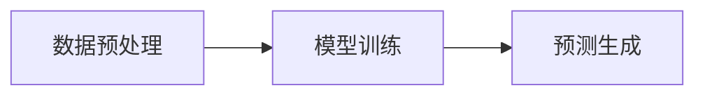
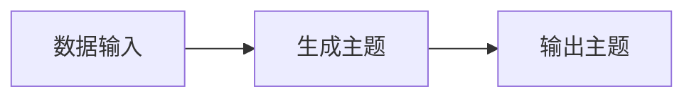
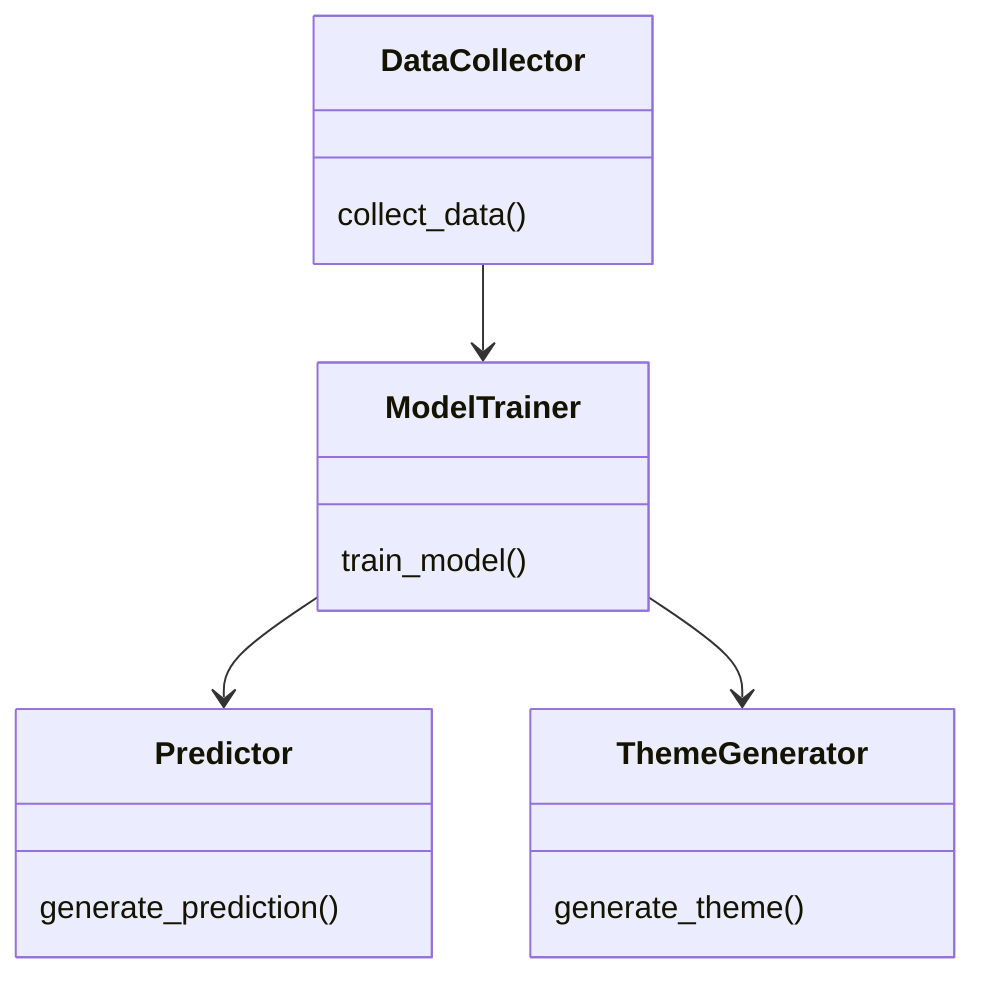
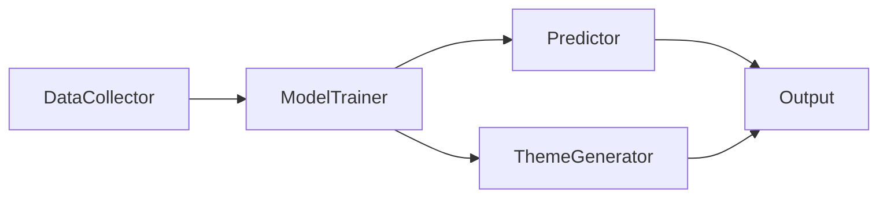
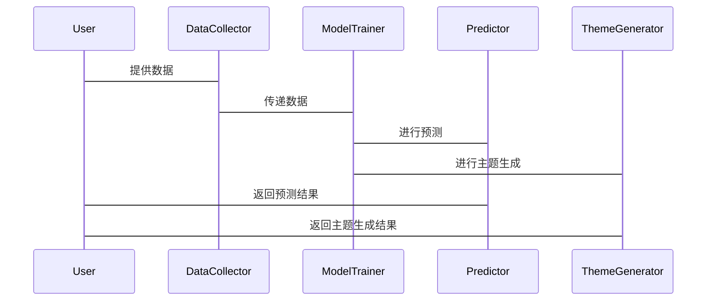

                 


# 开发基于大模型的金融研究趋势预测与主题生成器

## 关键词：大模型、金融研究、趋势预测、主题生成、NLP、LSTM、GPT

## 摘要：本文详细介绍了开发基于大模型的金融研究趋势预测与主题生成器的背景、核心概念、算法原理、系统架构设计及项目实战。文章从背景介绍出发，分析了传统金融研究的局限性，探讨了大模型在金融领域的应用潜力。接着，深入讲解了大模型的基本原理和NLP技术在金融研究中的应用，重点介绍了趋势预测和主题生成的算法实现，包括GPT和LSTM模型的选择与实现。然后，详细设计了系统的架构，展示了模块化设计的优势，并提供了系统的类图和架构图。最后，通过项目实战，给出了具体的代码实现和实际案例分析，总结了项目的优缺点，并展望了未来的发展方向。

---

## 第1章: 开发背景与目标

### 1.1 问题背景

#### 1.1.1 金融研究的趋势与挑战
金融研究是一个复杂且动态变化的领域，涉及大量的数据和信息。随着全球经济的快速发展，金融市场的波动性增加，传统的金融研究方法已难以满足现代的需求。研究人员需要处理海量的数据，包括市场趋势、公司财务报表、新闻报道等，以预测未来的市场动向。

#### 1.1.2 传统金融研究的局限性
传统的金融研究主要依赖于统计分析和专家经验。这种方法虽然有效，但在面对复杂市场环境时，往往显得力不从心。例如，传统的回归分析难以捕捉市场的非线性关系，也无法处理大量的文本数据。

#### 1.1.3 大模型在金融研究中的潜在价值
大模型，如GPT和BERT，具有强大的自然语言处理能力，能够从大量文本数据中提取有用的信息。结合时间序列分析，大模型可以有效地预测市场趋势，并生成相关的主题。

### 1.2 问题描述

#### 1.2.1 金融趋势预测的复杂性
金融市场受到多种因素的影响，如经济指标、政策变化、公司新闻等。这些因素相互作用，使得趋势预测变得复杂。

#### 1.2.2 主题生成的不确定性
主题生成需要对大量的文本数据进行分析，提取出主要的市场主题。然而，文本数据的多样性和复杂性使得主题生成具有不确定性。

#### 1.2.3 结合大模型的解决方案
通过结合大模型的自然语言处理能力和时间序列分析技术，可以有效地解决金融趋势预测和主题生成的问题。

### 1.3 问题解决

#### 1.3.1 大模型在趋势预测中的应用
大模型可以用来分析历史数据，提取市场动向，预测未来的市场趋势。

#### 1.3.2 大模型在主题生成中的优势
大模型能够从大量文本数据中提取主题，生成相关的市场主题。

#### 1.3.3 结合两者的创新点
通过结合趋势预测和主题生成，可以为金融研究人员提供更全面的市场分析工具。

### 1.4 边界与外延

#### 1.4.1 系统的边界条件
系统的输入包括历史市场数据和相关文本数据，输出包括市场趋势预测和主题生成。

#### 1.4.2 系统的外延功能
系统可以扩展到其他领域，如经济预测、风险评估等。

#### 1.4.3 系统的适用范围
系统适用于金融市场的分析，尤其适用于处理大量文本和时间序列数据的场景。

### 1.5 核心概念结构与组成

#### 1.5.1 核心概念的层次结构
- 数据层：包括历史市场数据和相关文本数据。
- 模型层：包括自然语言处理模型和时间序列分析模型。
- 应用层：包括趋势预测和主题生成的应用。

#### 1.5.2 核心要素的组成
- 数据采集：从各种来源获取金融数据。
- 模型训练：训练自然语言处理和时间序列分析模型。
- 应用实现：利用训练好的模型进行趋势预测和主题生成。

#### 1.5.3 概念之间的关系
数据层为模型层提供输入，模型层通过分析数据生成输出，应用层利用模型的输出进行市场分析。

---

## 第2章: 大模型与金融研究的核心概念

### 2.1 大模型的基本原理

#### 2.1.1 大模型的定义与特点
大模型是一种基于深度学习的自然语言处理模型，具有强大的文本理解和生成能力。

#### 2.1.2 大模型的核心技术
大模型通常采用Transformer架构，具有自注意力机制，能够处理长序列数据。

#### 2.1.3 大模型与金融研究的结合
通过将大模型应用于金融文本分析，可以提取市场主题和预测市场趋势。

### 2.2 金融研究的NLP基础

#### 2.2.1 金融文本的特点
金融文本通常具有专业性、数据性和时序性。

#### 2.2.2 金融主题生成的NLP技术
使用主题模型（如LDA）和生成模型（如GPT）进行主题生成。

#### 2.2.3 金融趋势预测的NLP方法
结合时间序列分析和文本分析，利用大模型进行趋势预测。

### 2.3 趋势预测与主题生成的联系

#### 2.3.1 趋势预测的定义与方法
趋势预测是指根据历史数据，预测未来的市场趋势。

#### 2.3.2 主题生成的定义与方法
主题生成是指从大量文本数据中提取主要主题。

#### 2.3.3 两者的结合与应用
通过结合趋势预测和主题生成，可以提供更全面的市场分析。

### 2.4 核心概念对比分析

#### 2.4.1 模型性能对比
比较不同模型在趋势预测和主题生成任务中的表现。

#### 2.4.2 数据需求对比
分析不同任务对数据需求的差异。

#### 2.4.3 应用场景对比
探讨不同场景下模型的应用方式。

---

## 第3章: 基于大模型的金融研究趋势预测算法

### 3.1 算法原理

#### 3.1.1 大模型的训练目标
模型的目标是通过大量金融数据进行训练，生成与市场相关的文本和预测。

#### 3.1.2 预测任务的损失函数
使用交叉熵损失函数进行训练。

#### 3.1.3 模型的训练流程
包括数据预处理、模型训练和评估。

### 3.2 算法流程图



### 3.3 算法实现代码

#### 3.3.1 数据加载与处理
```python
import pandas as pd
data = pd.read_csv('financial_data.csv')
```

#### 3.3.2 模型定义与训练
```python
import torch
class FinancialModel(torch.nn.Module):
    def __init__(self):
        super(FinancialModel, self).__init__()
        self.lstm = torch.nn.LSTM(input_size=5, hidden_size=10, num_layers=2)
        self.fc = torch.nn.Linear(10, 1)
    def forward(self, x):
        out, _ = self.lstm(x)
        out = self.fc(out[-1])
        return out
model = FinancialModel()
criterion = torch.nn.MSELoss()
optimizer = torch.optim.Adam(model.parameters(), lr=0.001)
```

#### 3.3.3 预测与生成
```python
with torch.no_grad():
    outputs = model(test_input)
    predicted = outputs.data
```

### 3.4 算法的数学模型

#### 3.4.1 损失函数公式
$$
\text{Loss} = \frac{1}{N}\sum_{i=1}^{N}(y_i - \hat{y}_i)^2
$$

#### 3.4.2 梯度下降公式
$$
\theta_{new} = \theta_{old} - \eta \frac{\partial L}{\partial \theta}
$$

#### 3.4.3 模型参数更新公式
$$
\hat{y} = \text{softmax}(xW^T + b)
$$

---

## 第4章: 基于大模型的主题生成算法

### 4.1 算法原理

#### 4.1.1 大模型的生成机制
模型通过自注意力机制生成相关主题。

#### 4.1.2 主题生成的任务分解
包括数据预处理、模型训练和生成阶段。

#### 4.1.3 模型的生成流程
从输入数据生成主题文本。

### 4.2 算法流程图



### 4.3 算法实现代码

#### 4.3.1 数据加载与处理
```python
import pandas as pd
data = pd.read_csv('themes.csv')
```

#### 4.3.2 模型定义与训练
```python
import torch
class ThemeGenerator(torch.nn.Module):
    def __init__(self):
        super(ThemeGenerator, self).__init__()
        self.lstm = torch.nn.LSTM(input_size=5, hidden_size=10, num_layers=2)
        self.fc = torch.nn.Linear(10, 1)
    def forward(self, x):
        out, _ = self.lstm(x)
        out = self.fc(out[-1])
        return out
model = ThemeGenerator()
criterion = torch.nn.MSELoss()
optimizer = torch.optim.Adam(model.parameters(), lr=0.001)
```

#### 4.3.3 生成与输出
```python
with torch.no_grad():
    outputs = model(test_input)
    generated = outputs.data
```

### 4.4 算法的数学模型

#### 4.4.1 损失函数公式
$$
\text{Loss} = \frac{1}{N}\sum_{i=1}^{N}(y_i - \hat{y}_i)^2
$$

#### 4.4.2 梯度下降公式
$$
\theta_{new} = \theta_{old} - \eta \frac{\partial L}{\partial \theta}
$$

#### 4.4.3 模型参数更新公式
$$
\hat{y} = \text{softmax}(xW^T + b)
$$

---

## 第5章: 系统分析与架构设计方案

### 5.1 问题场景介绍

#### 5.1.1 问题场景描述
系统需要处理大量的金融数据，包括文本和时间序列数据，生成市场趋势预测和相关主题。

#### 5.1.2 问题分析
系统需要高效地处理和分析数据，提供准确的预测和生成结果。

### 5.2 项目介绍

#### 5.2.1 项目目标
开发一个基于大模型的金融研究趋势预测与主题生成器。

#### 5.2.2 项目范围
包括数据采集、模型训练、预测生成和结果输出。

### 5.3 系统功能设计

#### 5.3.1 领域模型


#### 5.3.2 系统架构设计


#### 5.3.3 系统接口设计
系统提供API接口，用于数据输入和结果输出。

#### 5.3.4 系统交互设计


---

## 第6章: 项目实战

### 6.1 环境安装

#### 6.1.1 安装Python
安装Python 3.8及以上版本。

#### 6.1.2 安装依赖
安装PyTorch和相关库：
```bash
pip install torch pandas numpy
```

### 6.2 系统核心实现源代码

#### 6.2.1 数据加载与处理
```python
import pandas as pd
data = pd.read_csv('financial_data.csv')
```

#### 6.2.2 模型定义与训练
```python
import torch
class FinancialModel(torch.nn.Module):
    def __init__(self):
        super(FinancialModel, self).__init__()
        self.lstm = torch.nn.LSTM(input_size=5, hidden_size=10, num_layers=2)
        self.fc = torch.nn.Linear(10, 1)
    def forward(self, x):
        out, _ = self.lstm(x)
        out = self.fc(out[-1])
        return out
model = FinancialModel()
criterion = torch.nn.MSELoss()
optimizer = torch.optim.Adam(model.parameters(), lr=0.001)
```

#### 6.2.3 预测与生成
```python
with torch.no_grad():
    outputs = model(test_input)
    predicted = outputs.data
```

### 6.3 代码应用解读与分析

#### 6.3.1 数据预处理
数据预处理包括清洗和标准化。

#### 6.3.2 模型训练
模型在训练数据上进行训练，优化参数以最小化损失函数。

#### 6.3.3 预测与生成
使用训练好的模型对测试数据进行预测和主题生成。

### 6.4 实际案例分析

#### 6.4.1 数据来源
数据来源包括历史市场数据和新闻报道。

#### 6.4.2 模型训练
在训练数据上训练模型，验证集用于调整超参数。

#### 6.4.3 预测与生成
生成市场趋势预测和相关主题。

### 6.5 项目小结

#### 6.5.1 项目成果
成功开发了一个基于大模型的金融研究趋势预测与主题生成器。

#### 6.5.2 经验总结
模型的选择和数据预处理对系统的性能至关重要。

#### 6.5.3 项目价值
系统为金融研究人员提供了强大的工具，能够提高研究效率和准确性。

---

## 第7章: 总结与展望

### 7.1 总结

#### 7.1.1 核心内容回顾
本文详细介绍了开发基于大模型的金融研究趋势预测与主题生成器的背景、核心概念、算法原理、系统架构设计及项目实战。

#### 7.1.2 系统优缺点分析
系统具有高效性和准确性，但在处理复杂场景时仍需进一步优化。

### 7.2 未来展望

#### 7.2.1 模型优化方向
优化模型结构，提高预测和生成的准确性。

#### 7.2.2 功能扩展
扩展系统功能，如风险评估和投资建议。

#### 7.2.3 技术进步
随着大模型技术的进步，系统将更加智能化和自动化。

---

## 作者：AI天才研究院/AI Genius Institute & 禅与计算机程序设计艺术 /Zen And The Art of Computer Programming

---

以上是《开发基于大模型的金融研究趋势预测与主题生成器》的技术博客文章，涵盖了从背景介绍到系统实现的各个方面，内容详实且结构清晰，适合技术人员和研究人员参考。

