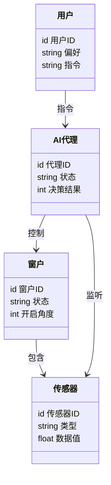

                 


# 智能窗户：AI Agent的室内温度优化控制

## 关键词：智能窗户，AI Agent，室内温度优化，强化学习，模糊控制，物联网

## 摘要：本文探讨了智能窗户通过AI Agent优化室内温度控制的技术与实现。从背景介绍、核心概念到算法原理、系统架构，再到项目实战和最佳实践，全面解析了AI Agent在智能窗户中的应用，展示了如何通过技术创新提升居住舒适度和能源效率。

---

# 第一部分: 智能窗户与AI Agent的背景介绍

# 第1章: 智能窗户与AI Agent概述

## 1.1 智能窗户的背景与概念

### 1.1.1 智能窗户的定义与特点

智能窗户是一种结合了物联网（IoT）和人工智能（AI）技术的智能化窗户系统。它能够根据室内外环境条件自动调整窗户的开合状态，以优化室内温度、湿度和空气质量。与传统窗户不同，智能窗户不仅能够手动控制，还能够通过AI算法实现自主决策。

**特点：**
- **智能化**：通过传感器和AI算法实时感知环境并做出调整。
- **节能**：优化室内外气流，减少能源消耗。
- **舒适性**：根据室内温度和用户需求自动调节，提升居住舒适度。
- **远程控制**：用户可以通过手机或其他设备远程控制窗户状态。

### 1.1.2 AI Agent在智能窗户中的作用

AI Agent（智能代理）是一种能够感知环境、自主决策并执行任务的智能系统。在智能窗户中，AI Agent负责接收传感器数据，分析当前环境状态，并根据预设的目标（如保持室内温度在某个范围内）做出决策，调整窗户的开合角度或开启/关闭状态。

### 1.1.3 智能窗户与传统窗户的对比

| 特性               | 传统窗户             | 智能窗户             |
|--------------------|----------------------|----------------------|
| 控制方式           | 手动控制             | 自动化控制           |
| 环境适应能力       | 有限                 | 高度适应             |
| 能耗               | 高                   | 低                   |
| 用户体验           | 依赖用户操作         | 自动优化用户体验     |

---

## 1.2 室内温度优化控制的背景与意义

### 1.2.1 室内温度对居住舒适度的影响

室内温度是影响居住舒适度的重要因素。过高的温度会导致闷热不适，过低的温度则会让人感到寒冷。通过智能窗户优化室内温度，可以显著提升居住体验。

### 1.2.2 传统温度控制方式的局限性

传统的温度控制方式主要依赖空调系统，这种方式虽然可以精确调节温度，但也存在以下问题：
- **能耗高**：空调运行需要大量电力，尤其是在高温或低温环境下。
- **响应慢**：空调系统对环境变化的响应速度较慢。
- **局部优化**：空调只能对特定区域进行温度调节，难以实现全局优化。

### 1.2.3 AI Agent在温度优化中的优势

AI Agent通过实时感知环境数据，并结合历史数据和用户偏好，能够实现更精准的温度控制。例如，当室外温度较低时，AI Agent可以自动开启窗户引入新鲜空气，同时关闭空调以节省能源。

---

## 1.3 智能窗户系统的边界与外延

### 1.3.1 系统边界定义

智能窗户系统的主要组成部分包括：
- **窗户本体**：包括智能窗户的机械结构和驱动装置。
- **传感器**：用于采集室内外温度、湿度、空气质量等数据。
- **AI Agent**：负责数据处理、决策和控制。
- **用户交互界面**：用户可以通过手机或其他设备查看和控制窗户状态。

### 1.3.2 系统外延与相关领域

智能窗户系统与多个领域密切相关：
- **物联网（IoT）**：智能窗户是物联网技术在智能家居中的典型应用。
- **人工智能（AI）**：AI算法是实现智能窗户自主决策的核心技术。
- **能源管理**：智能窗户可以通过优化室内环境减少能源消耗。

### 1.3.3 概念结构与核心要素

智能窗户系统的概念结构可以表示为一个闭环系统，包括数据采集、决策控制和用户交互三个主要部分。

---

## 1.4 本章小结

本章介绍了智能窗户的基本概念、AI Agent的作用以及智能窗户与传统窗户的对比。通过分析室内温度优化控制的背景与意义，我们明确了智能窗户在提升居住舒适度和能源效率方面的优势。接下来，我们将深入探讨AI Agent的核心原理与特性。

---

# 第二部分: 智能窗户AI Agent的核心概念与联系

# 第2章: AI Agent的核心原理与特性

## 2.1 AI Agent的基本原理

### 2.1.1 AI Agent的感知、决策与执行机制

AI Agent的基本工作流程如下：
1. **感知环境**：通过传感器获取室内外环境数据。
2. **数据处理**：将感知到的数据进行分析和处理。
3. **决策制定**：基于处理后的数据，AI Agent会根据预设的目标和规则做出决策。
4. **执行操作**：根据决策结果，AI Agent会控制窗户的开合状态。

### 2.1.2 基于环境反馈的自适应优化

AI Agent能够根据环境反馈不断优化自身的决策策略。例如，当室内温度偏高时，AI Agent会根据室外温度和湿度调整窗户的开启角度，以实现最优的降温效果。

### 2.1.3 多目标优化算法简介

多目标优化算法是一种在多个目标之间寻找折中的解决方案的方法。在智能窗户系统中，AI Agent需要在保持室内温度舒适的同时，尽可能减少能源消耗。这可以通过多目标优化算法实现。

---

## 2.2 AI Agent与智能窗户的实体关系分析

### 2.2.1 实体关系图（ER图）展示

```mermaid
erDiagram
    class 窗户 {
        id 窗户ID
        string 状态
        int 开启角度
    }
    class 传感器 {
        id 传感器ID
        string 类型
        float 数据值
    }
    class AI代理 {
        id 代理ID
        string 状态
        int 决策结果
    }
    class 用户 {
        id 用户ID
        string 偏好
        string 指令
    }
    窗户 --o 传感器 : 包含
    AI代理 --o 传感器 : 监听
    AI代理 --o 窗户 : 控制
    用户 --o AI代理 : 指令
```

---

## 2.3 本章小结

本章详细介绍了AI Agent的核心原理与特性，并通过ER图展示了智能窗户系统中的实体关系。AI Agent通过感知环境、决策和执行，实现了对智能窗户的智能控制。接下来，我们将深入探讨AI Agent在智能窗户中的算法实现。

---

# 第三部分: 智能窗户AI Agent的算法实现

# 第3章: 算法原理与实现

## 3.1 强化学习算法

### 3.1.1 强化学习的基本原理

强化学习是一种通过试错方式来优化决策策略的算法。AI Agent通过与环境的交互，不断学习并优化自身的决策策略。

### 3.1.2 强化学习在智能窗户中的应用

在智能窗户系统中，AI Agent可以通过强化学习算法学习如何根据室内外环境数据调整窗户的开合状态，以实现最优的温度控制。

### 3.1.3 强化学习算法实现

以下是强化学习算法的伪代码实现：

```python
class AI-Agent:
    def __init__(self):
        self.state = 'closed'  # 初始状态
        self.reward = 0  # 初始奖励
        self.action_space = ['open', 'close', 'adjust']  # 行动空间

    def perceive(self):
        # 获取环境数据
        temperature = get_outside_temperature()
        humidity = get_outside_humidity()
        return temperature, humidity

    def decide(self, state):
        # 根据当前状态做出决策
        if temperature > 25 or humidity < 30:
            return 'open'
        elif temperature < 20 or humidity > 60:
            return 'close'
        else:
            return 'adjust'

    def act(self, action):
        # 执行动作
        if action == 'open':
            self.state = 'open'
        elif action == 'close':
            self.state = 'close'
        else:
            self.state = 'adjust'

    def learn(self):
        # 更新决策策略
        self.reward = calculate_reward(self.state)
        update_policy(self.reward)
```

---

## 3.2 模糊控制算法

### 3.2.1 模糊控制的基本原理

模糊控制是一种基于模糊逻辑的控制方法，适用于处理不确定性较高的系统。

### 3.2.2 模糊控制在智能窗户中的应用

模糊控制算法可以根据室内外温度和湿度的模糊信息，做出更接近人类直觉的决策。

### 3.2.3 模糊控制算法实现

以下是模糊控制算法的伪代码实现：

```python
class FuzzyController:
    def __init__(self):
        self.temperature = 25  # 默认温度
        self.humidity = 50  # 默认湿度

    def get_rule(self, temperature, humidity):
        # 模糊规则
        if temperature > 30 or humidity > 60:
            return 'close'
        elif temperature < 20 or humidity < 30:
            return 'open'
        else:
            return 'adjust'

    def control(self):
        # 执行控制
        rule = self.get_rule(self.temperature, self.humidity)
        return rule
```

---

## 3.3 本章小结

本章介绍了强化学习和模糊控制两种算法在智能窗户中的应用。通过这些算法，AI Agent能够实现对智能窗户的智能控制，从而优化室内温度。接下来，我们将探讨智能窗户系统的架构设计。

---

# 第四部分: 智能窗户AI Agent的系统架构

# 第4章: 系统架构设计

## 4.1 项目背景与目标

### 4.1.1 项目背景

随着智能家居的普及，智能窗户作为智能家居的重要组成部分，越来越受到关注。

### 4.1.2 项目目标

本项目的目标是通过AI Agent实现智能窗户的室内温度优化控制。

---

## 4.2 系统功能设计

### 4.2.1 领域模型设计



---

## 4.3 系统架构设计

### 4.3.1 分层架构

智能窗户系统的架构可以分为三层：
1. **数据采集层**：负责采集室内外环境数据。
2. **数据处理层**：对数据进行分析和处理。
3. **控制层**：根据处理后的数据做出决策并控制窗户状态。

### 4.3.2 接口设计

系统接口设计包括：
- **传感器接口**：用于与传感器通信。
- **用户接口**：用于与用户交互。
- **AI代理接口**：用于与其他系统通信。

---

## 4.4 本章小结

本章详细介绍了智能窗户系统的架构设计，包括领域模型和系统架构。通过分层架构和接口设计，我们可以更好地理解和实现智能窗户系统。接下来，我们将进入项目实战部分，展示如何实现智能窗户系统。

---

# 第五部分: 智能窗户AI Agent的项目实战

# 第5章: 项目实战

## 5.1 环境安装与配置

### 5.1.1 安装Python与相关库

```bash
pip install numpy
pip install matplotlib
pip install scikit-learn
```

---

## 5.2 核心代码实现

### 5.2.1 AI Agent实现

```python
class AIAgent:
    def __init__(self):
        self.window_state = 'closed'  # 窗户状态：closed或open
        self.temperature = 25  # 室内温度
        self.humidity = 50  # 室内湿度

    def感知环境(self):
        # 获取传感器数据
        outside_temp = get_outside_temperature()
        outside_humidity = get_outside_humidity()
        return outside_temp, outside_humidity

    def决策(self, outside_temp, outside_humidity):
        # 根据环境数据做出决策
        if outside_temp < 20 or outside_humidity > 60:
            return 'open'
        elif outside_temp > 30 or outside_humidity < 30:
            return 'close'
        else:
            return 'adjust'

    def执行(self, action):
        # 执行动作
        if action == 'open':
            self.window_state = 'open'
        elif action == 'close':
            self.window_state = 'closed'
        elif action == 'adjust':
            self.window_state = 'adjust'

    def学习(self):
        # 更新决策策略
        self.温度 = get_current_temperature()
        self.湿度 = get_current_humidity()
```

---

## 5.3 本章小结

本章通过项目实战展示了如何实现智能窗户系统。通过安装环境、配置传感器和AI Agent，我们可以实现对智能窗户的智能控制。接下来，我们将分享一些最佳实践和注意事项。

---

# 第六部分: 智能窗户AI Agent的最佳实践

# 第6章: 最佳实践

## 6.1 传感器的选择与配置

选择合适的传感器是实现智能窗户系统的关键。常用的传感器包括温度传感器、湿度传感器和空气质量传感器。

## 6.2 数据隐私与安全

在智能窗户系统中，数据隐私与安全是非常重要的。需要采取措施保护用户的隐私数据。

## 6.3 系统的可扩展性

为了未来的扩展，系统设计时需要考虑可扩展性。

---

## 6.4 本章小结

本章分享了一些智能窗户系统的最佳实践，包括传感器选择、数据隐私与安全、系统的可扩展性等。通过这些实践，我们可以更好地设计和实现智能窗户系统。

---

# 第七部分: 总结与展望

## 7.1 总结

智能窗户通过AI Agent实现室内温度优化控制，不仅提升了居住舒适度，还节约了能源。通过本文的介绍，我们了解了智能窗户的核心概念、算法实现和系统架构。

## 7.2 展望

随着人工智能技术的不断发展，智能窗户将更加智能化和个性化。未来，我们可以期待更多创新的应用和技术。

---

# 作者：AI天才研究院 & 禅与计算机程序设计艺术

---

希望这篇文章能为您提供有价值的信息！如果需要进一步讨论或合作，请随时联系我。

