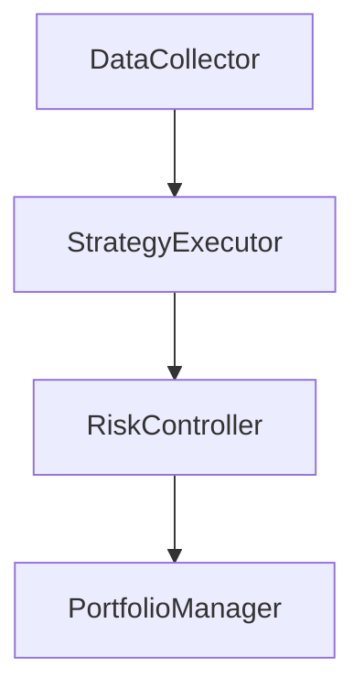

                 


# 约翰·聂夫的反向投资理念

> 关键词：反向投资、价值投资、约翰·聂夫、安全边际、投资策略

> 摘要：本文将详细介绍约翰·聂夫的反向投资理念，探讨其核心概念、投资策略、数学模型以及实际应用。通过系统分析和案例研究，我们将深入理解逆向投资的原理和实践方法，帮助读者在投资领域做出更明智的决策。

---

## 第1章: 逆向投资的起源与发展

### 1.1 逆向投资的定义与特点

逆向投资是一种不同于传统投资的策略，它强调在市场低迷或不被看好时买入，而在市场繁荣时卖出。这种策略的核心在于寻找被市场低估的机会，避免随波逐流。

#### 1.1.1 逆向投资的定义
逆向投资是指在市场恐慌或低迷时，投资者买入被市场低估的资产，而在市场狂热时卖出的行为。这种策略与传统的顺势投资相反，强调逆市场情绪操作。

#### 1.1.2 逆向投资的核心特点
- **反周期性**：逆向投资通常在市场低谷时进行，而在市场高点时退出。
- **逆市场情绪**：投资者在市场恐慌时寻找机会，而在市场乐观时保持谨慎。
- **长期视角**：逆向投资注重长期价值，而非短期波动。

#### 1.1.3 逆向投资与传统投资的区别
| 特性            | 逆向投资                          | 传统投资                          |
|-----------------|-----------------------------------|------------------------------------|
| 市场态度         | 偏好低迷市场                      | 偏好繁荣市场                      |
| 投资时机         | 在恐慌时买入                    | 在乐观时买入                    |
| 风险承受能力     | 高                                | 低                                |
| 投资目标         | 寻找被低估的资产                  | 追求市场趋势                      |

### 1.2 约翰·聂夫的背景与投资理念

#### 1.2.1 约翰·聂夫的生平简介
约翰·聂夫（John Neff）是美国著名的投资经理人，以其在逆向投资领域的卓越表现而闻名。他在投资行业有着丰富的经验，曾管理过多个投资基金，取得了显著的业绩。

#### 1.2.2 约翰·聂夫的投资哲学
约翰·聂夫的投资理念基于价值投资，他强调寻找那些被市场低估的优质企业，并长期持有这些股票，直到它们的价值被市场重新发现。

#### 1.2.3 约翰·聂夫的成功案例
约翰·聂夫在其职业生涯中取得了显著的成绩，他的投资策略帮助他管理的基金多次跑赢市场指数。他的成功证明了逆向投资的有效性。

---

## 第2章: 价值投资的核心概念

### 2.1 价值投资的定义与原则

#### 2.1.1 价值投资的定义
价值投资是一种投资策略，强调以低于内在价值的价格购买资产。这种方法的核心在于寻找市场低估的资产，并在价格回归其价值时获利。

#### 2.1.2 价值投资的核心原则
- **安全边际**：购买价格低于内在价值，以确保有足够的安全空间。
- **长期视角**：关注企业的长期价值，而非短期市场波动。
- **基本面分析**：通过分析企业的财务状况、行业地位等因素，评估其内在价值。

#### 2.1.3 价值投资与成长投资的区别
| 特性            | 价值投资                          | 成长投资                          |
|-----------------|-----------------------------------|------------------------------------|
| 投资目标         | 寻找被低估的资产                  | 寻找高增长的资产                  |
| 风险承受能力     | 中等                               | 较高                               |
| 投资期限         | 中长期                            | 中长期                            |

### 2.2 安全边际的概念与作用

#### 2.2.1 安全边际的定义
安全边际是指购买价格与资产内在价值之间的差距。它提供了一种保护，确保即使市场波动，投资者也能在一定程度上避免损失。

#### 2.2.2 安全边际在投资中的作用
- **降低风险**：通过安全边际，投资者可以减少因市场价格波动带来的损失。
- **增加收益潜力**：当市场价格回归内在价值时，安全边际为投资者提供了额外的收益空间。

#### 2.2.3 安全边际的计算方法
假设一只股票的内在价值为$V$，购买价格为$P$，则安全边际为$V - P$。投资者应选择$V - P$较大的股票进行投资。

---

## 第3章: 约翰·聂夫的投资策略

### 3.1 约翰·聂夫的选股标准

#### 3.1.1 低市盈率股票的选择
市盈率（P/E）是衡量股票价值的重要指标。约翰·聂夫倾向于选择市盈率低于市场平均水平的股票。

#### 3.1.2 高ROE企业的筛选
ROE（净资产收益率）是衡量企业盈利能力的重要指标。约翰·聂夫偏好ROE较高的企业，因为这表明企业在有效利用资产创造利润。

#### 3.1.3 企业基本面分析
基本面分析包括对企业财务状况、行业地位、管理团队等方面的评估。约翰·聂夫注重选择那些财务健康、管理优秀的企业。

### 3.2 约翰·聂夫的投资组合管理

#### 3.2.1 投资组合的构建原则
- **分散投资**：通过投资不同行业和不同风险等级的股票，降低投资组合的整体风险。
- **长期持有**：约翰·聂夫主张长期持有优质股票，避免频繁交易带来的成本和风险。

#### 3.2.2 投资组合的调整策略
- **定期审查**：定期检查投资组合，确保所选股票仍然符合价值投资的标准。
- **动态调整**：根据市场变化和个人投资目标的调整，逐步优化投资组合。

#### 3.2.3 风险控制与仓位管理
- **风险分散**：通过投资不同类型的资产，降低投资组合的整体风险。
- **仓位控制**：根据市场情况和个人风险承受能力，合理配置投资仓位。

---

## 第4章: 逆向投资的数学模型与算法

### 4.1 逆向投资的估值模型

#### 4.1.1 现金流折现模型
现金流折现模型（DCF）是一种用于估计资产内在价值的方法。通过对未来现金流进行折现，可以计算出资产的内在价值。

$$ V = \sum_{t=1}^{n} \frac{CF_t}{(1 + r)^t} $$

其中，$V$ 是内在价值，$CF_t$ 是第 $t$ 年的现金流，$r$ 是折现率。

#### 4.1.2 市盈率与市净率分析
市盈率（P/E）和市净率（P/B）是衡量股票价值的重要指标。约翰·聂夫倾向于选择市盈率和市净率低于市场平均水平的股票。

#### 4.1.3 内在价值的计算公式
内在价值可以通过多种方法计算，如现金流折现模型、可比公司分析等。约翰·聂夫常用现金流折现模型来估算股票的内在价值。

### 4.2 约翰·聂夫投资策略的算法实现

#### 4.2.1 低市盈率股票筛选算法
```python
def screen_low_pe(stocks, market_pe):
    selected_stocks = []
    for stock in stocks:
        if stock.pe < market_pe:
            selected_stocks.append(stock)
    return selected_stocks
```

#### 4.2.2 高ROE企业识别算法
```python
def identify_high_roe(stocks, threshold=15):
    selected_stocks = []
    for stock in stocks:
        if stock.roe > threshold:
            selected_stocks.append(stock)
    return selected_stocks
```

#### 4.2.3 投资组合优化算法
```python
def optimize_portfolio(stocks, risk_tolerance=0.05):
    import numpy as np
    returns = np.array([stock.return for stock in stocks])
    covariance = np.cov(returns)
    weights = np.linalg.solve(covariance, np.ones(len(stocks)))
    weights = weights / np.sum(weights)
    return weights
```

---

## 第5章: 逆向投资的系统架构与实现

### 5.1 投资决策系统的模块划分

#### 5.1.1 数据采集模块
数据采集模块负责收集市场数据，包括股票价格、财务指标等。

#### 5.1.2 策略执行模块
策略执行模块根据预先设定的策略，筛选出符合投资条件的股票。

#### 5.1.3 风险控制模块
风险控制模块监控投资组合的风险，根据市场变化进行调整。

### 5.2 系统架构设计

#### 5.2.1 系统功能模块图


#### 5.2.2 系统数据流图
```mermaid
graph TD
    DataCollector -> DataStorage
    DataStorage -> StrategyExecutor
    StrategyExecutor -> RiskController
    RiskController -> PortfolioManager
```

#### 5.2.3 系统交互流程图
```mermaid
graph TD
    User -> DataCollector: 提供数据源
    DataCollector -> DataStorage: 存储数据
    DataStorage -> StrategyExecutor: 执行投资策略
    StrategyExecutor -> RiskController: 控制风险
    RiskController -> PortfolioManager: 管理投资组合
```

---

## 第6章: 项目实战与案例分析

### 6.1 实战环境搭建

#### 6.1.1 数据源选择与获取
使用Yahoo Finance获取股票数据，利用Pandas进行数据清洗和处理。

#### 6.1.2 投资分析工具安装
安装并配置Python环境，包括Pandas、NumPy、Matplotlib等库。

#### 6.1.3 系统开发框架选择
选择Django或Flask框架，搭建一个简单的投资分析系统。

### 6.2 核心代码实现

#### 6.2.1 低市盈率股票筛选代码
```python
import pandas as pd

def screen_low_pe(stocks, market_pe=15):
    selected = []
    for stock in stocks:
        if stock.pe < market_pe:
            selected.append(stock)
    return selected
```

#### 6.2.2 高ROE企业识别代码
```python
def identify_high_roe(stocks, threshold=15):
    selected = []
    for stock in stocks:
        if stock.roe > threshold:
            selected.append(stock)
    return selected
```

#### 6.2.3 投资组合优化代码
```python
import numpy as np

def optimize_portfolio(stocks):
    returns = np.array([stock.return for stock in stocks])
    covariance = np.cov(returns)
    weights = np.linalg.solve(covariance, np.ones(len(stocks)))
    weights = weights / np.sum(weights)
    return weights
```

### 6.3 实战案例分析

#### 6.3.1 案例背景介绍
假设当前市场市盈率为15，我们选择市盈率低于15的股票，并进一步筛选ROE高于15%的企业。

#### 6.3.2 数据分析与策略实施
通过对市场数据的分析，筛选出符合条件的股票，并计算其内在价值。

#### 6.3.3 投资结果与经验总结
通过实际投资，验证逆向投资策略的有效性，并总结经验教训。

---

## 第7章: 总结与展望

### 7.1 本书的核心观点总结

#### 7.1.1 逆向投资的定义与特点
逆向投资是在市场低迷时买入，而在市场繁荣时卖出的策略，强调逆市场情绪操作。

#### 7.1.2 约翰·聂夫的投资哲学
约翰·聂夫的逆向投资理念基于价值投资，注重寻找被市场低估的优质企业，并长期持有。

#### 7.1.3 投资策略与数学模型
通过低市盈率和高ROE的筛选标准，结合数学模型进行投资组合优化，实现风险控制和收益最大化。

### 7.2 投资领域的未来展望

#### 7.2.1 数字化与智能化
随着技术的进步，投资领域将更加依赖于数据和技术分析，人工智能将在投资决策中发挥越来越重要的作用。

#### 7.2.2 可持续投资
可持续投资和ESG（环境、社会、治理）因素将成为未来投资的重要考量，投资者将更加关注企业的社会责任和长期发展潜力。

#### 7.2.3 全球化与多元化
随着全球经济的深度融合，投资者将更加注重全球化配置资产，以分散风险并抓住不同市场的投资机会。

---

## 作者：AI天才研究院/AI Genius Institute & 禅与计算机程序设计艺术 /Zen And The Art of Computer Programming

---

以上是《约翰·聂夫的反向投资理念》的完整目录和内容概要。通过系统分析和实际案例，我们深入探讨了逆向投资的核心理念、数学模型和实际应用，希望对读者在投资领域有所帮助。

