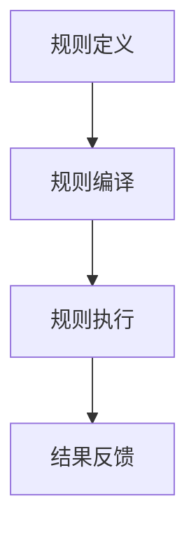
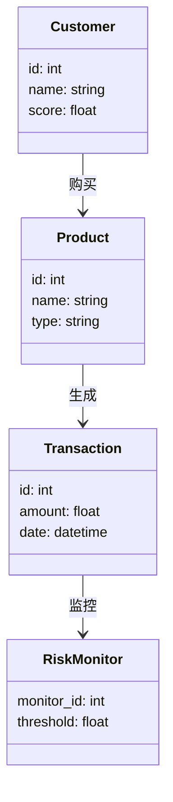
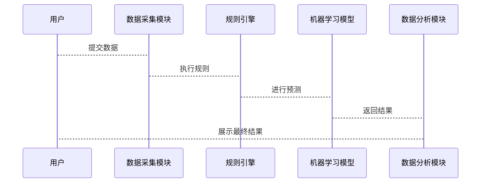

                 


```markdown
# 《金融产品生命周期管理自动化系统》

> 关键词：金融产品生命周期、自动化系统、系统架构、算法原理、项目实战、最佳实践

> 摘要：本文详细探讨了金融产品生命周期管理自动化系统的构建与实现。从背景介绍到核心概念，从算法原理到系统架构设计，再到项目实战和最佳实践，系统地阐述了如何利用现代技术手段提高金融产品管理的效率与准确性。通过本文的讲解，读者将能够全面理解金融产品生命周期管理自动化系统的原理与应用，并掌握其实现的关键技术与方法。

---

## 第一部分：金融产品生命周期管理自动化系统概述

### 第1章：金融产品生命周期管理概述

#### 1.1 金融产品生命周期管理的背景与意义

##### 1.1.1 金融产品的定义与分类

金融产品是指金融机构提供给客户的一系列服务或工具，旨在满足客户的财务需求。常见的金融产品包括存款、贷款、证券、基金、保险等。根据产品类型，金融产品可以分为债权类、股权类、衍生品类和混合类产品。

##### 1.1.2 金融产品生命周期的阶段划分

金融产品的生命周期通常分为以下几个阶段：

1. **设计与开发阶段**：包括产品需求分析、设计、开发和测试。
2. **上线与运营阶段**：产品正式推向市场，进行推广、销售和运营。
3. **监控与维护阶段**：对产品运行情况进行实时监控，及时发现并解决问题。
4. **终止与退市阶段**：产品到期或不再符合市场需求，逐步退出市场。

##### 1.1.3 金融产品生命周期管理的重要性

金融产品生命周期管理是金融机构高效运营的核心环节。通过科学的生命周期管理，金融机构可以提高产品开发效率、降低运营成本、优化资源配置，并有效控制风险。

---

#### 1.2 传统金融产品管理的痛点与挑战

##### 1.2.1 传统管理方式的效率问题

传统的金融产品管理方式通常依赖人工操作，效率低下，容易出现疏漏。例如，产品上线后需要手动监控市场反应，及时调整策略，耗时耗力。

##### 1.2.2 人工操作的误差与风险

人工操作不仅效率低，还容易出错，尤其是在数据处理和风险评估环节，容易引发重大风险事件。

##### 1.2.3 信息孤岛与数据不一致的问题

不同部门之间可能存在信息孤岛，导致数据不一致，影响决策的准确性和效率。

---

#### 1.3 金融产品生命周期管理自动化系统的必要性

##### 1.3.1 提高管理效率与准确性

自动化系统可以实现数据的自动采集、处理和分析，显著提高管理效率和准确性。

##### 1.3.2 降低运营成本与风险

通过自动化管理，可以减少人工干预，降低运营成本，并有效控制风险。

##### 1.3.3 适应金融行业的数字化转型

随着金融行业的数字化转型，自动化管理成为必然趋势，能够帮助金融机构更好地应对市场变化和客户需求。

---

## 第2章：金融产品生命周期管理自动化系统的核心概念

### 2.1 金融产品生命周期管理的核心要素

#### 2.1.1 产品设计与开发

产品设计与开发阶段是金融产品生命周期的起点，涉及需求分析、产品设计、开发和测试。

#### 2.1.2 产品上线与运营

产品上线后，需要进行市场推广、销售和运营，确保产品顺利运行。

#### 2.1.3 产品终止与退市

当产品生命周期结束时，需要有序地进行产品终止和退市，避免对客户和市场造成不良影响。

### 2.2 自动化系统的功能模块

#### 2.2.1 数据采集与处理模块

数据采集与处理模块负责从各个渠道采集数据，并进行清洗和转换，确保数据的准确性和一致性。

#### 2.2.2 流程自动化模块

流程自动化模块通过规则引擎实现业务流程的自动化，减少人工干预，提高效率。

#### 2.2.3 风险监控与预警模块

风险监控与预警模块利用机器学习模型实时监控产品运行中的风险，并及时发出预警。

#### 2.2.4 报告生成与分析模块

报告生成与分析模块根据数据生成各种报告，并进行数据分析和可视化展示。

### 2.3 核心概念的联系与对比

#### 2.3.1 核心概念的属性特征对比表

| 核心概念      | 属性特征              |
|---------------|-----------------------|
| 数据采集模块  | 数据来源、数据格式    |
| 流程自动化模块| 规则引擎、执行流程    |
| 风险监控模块  | 监控指标、预警机制    |
| 报告分析模块  | 数据可视化、分析模型  |

#### 2.3.2 ER实体关系图（Mermaid）

```mermaid
erd
    title 金融产品生命周期管理系统的ER图

    Customer
    Product
    Transaction
    RiskMonitor

    Customer -|> Product: 购买
    Product -|> Transaction: 生成
    Transaction -|> RiskMonitor: 监控
```

---

## 第3章：金融产品生命周期管理自动化系统的算法原理

### 3.1 规则引擎的原理与实现

#### 3.1.1 规则引擎的工作流程

规则引擎通过定义一系列规则，对业务流程进行自动化处理。其工作流程如下：

1. **规则定义**：用户定义规则，例如“如果客户信用评分低于600，则拒绝贷款申请”。
2. **规则编译**：将规则转换为计算机可执行的代码。
3. **规则执行**：根据当前业务数据，执行规则并生成结果。
4. **结果反馈**：将规则执行结果反馈给系统。

#### 3.1.2 规则引擎的Mermaid流程图



#### 3.1.3 规则引擎的Python实现代码

```python
# 示例规则引擎代码
class RuleEngine:
    def __init__(self):
        self.rules = []

    def add_rule(self, rule):
        self.rules.append(rule)

    def execute(self, data):
        results = []
        for rule in self.rules:
            if rule.matches(data):
                results.append(rule.apply(data))
        return results

# 示例规则类
class Rule:
    def __init__(self, condition, action):
        self.condition = condition
        self.action = action

    def matches(self, data):
        return self.condition(data)

    def apply(self, data):
        return self.action(data)

# 示例使用
engine = RuleEngine()
rule = Rule(lambda x: x['score'] < 600, lambda x: '拒绝贷款申请')
engine.add_rule(rule)
result = engine.execute({'name': '张三', 'score': 550})
print(result)
```

---

#### 3.2 机器学习模型的构建与应用

##### 3.2.1 机器学习模型的选择与训练

在金融产品生命周期管理中，机器学习模型主要用于风险评估和预测。常用的算法包括逻辑回归、支持向量机（SVM）和随机森林。

##### 3.2.2 机器学习模型的数学公式

以逻辑回归为例，其概率函数可以表示为：

$$ P(y=1|x) = \frac{1}{1 + e^{-\beta x}} $$

其中，$\beta$ 是模型的系数，$x$ 是输入特征。

##### 3.2.3 机器学习模型的Python实现代码

```python
# 示例逻辑回归模型代码
import numpy as np
from sklearn.linear_model import LogisticRegression

# 数据准备
X = np.array([[1, 2], [3, 4], [5, 6]])
y = np.array([0, 1, 1])

# 模型训练
model = LogisticRegression()
model.fit(X, y)

# 预测
new_data = np.array([[2, 3]])
prediction = model.predict(new_data)
print(prediction)
```

---

#### 3.2.4 机器学习模型的实际应用案例

例如，在风险监控模块中，可以使用逻辑回归模型预测客户违约的概率，并根据预测结果制定相应的风险控制策略。

---

## 第4章：金融产品生命周期管理自动化系统的系统架构设计

### 4.1 系统功能设计

#### 4.1.1 领域模型（Mermaid类图）



### 4.2 系统架构设计

#### 4.2.1 系统架构（Mermaid架构图）


### 4.3 系统接口设计

#### 4.3.1 接口描述

- **数据采集接口**：从外部系统获取数据，格式为JSON。
- **规则引擎接口**：接收规则请求，返回执行结果。
- **机器学习模型接口**：接收输入数据，返回预测结果。

### 4.4 系统交互（Mermaid序列图）



---

## 第5章：金融产品生命周期管理自动化系统的项目实战

### 5.1 环境安装与配置

#### 5.1.1 系统环境要求

- 操作系统：Windows 10 或更高版本，或Linux系统。
- Python版本：Python 3.6 或更高版本。
- 需要安装的库：numpy、pandas、scikit-learn、flask等。

#### 5.1.2 安装依赖

```bash
pip install numpy pandas scikit-learn flask
```

### 5.2 系统核心代码实现

#### 5.2.1 规则引擎实现

```python
class RuleEngine:
    def __init__(self):
        self.rules = []

    def add_rule(self, rule):
        self.rules.append(rule)

    def execute(self, data):
        results = []
        for rule in self.rules:
            if rule.matches(data):
                results.append(rule.apply(data))
        return results

class Rule:
    def __init__(self, condition, action):
        self.condition = condition
        self.action = action

    def matches(self, data):
        return self.condition(data)

    def apply(self, data):
        return self.action(data)
```

#### 5.2.2 机器学习模型实现

```python
import numpy as np
from sklearn.linear_model import LogisticRegression

class RiskPredictor:
    def __init__(self):
        self.model = LogisticRegression()

    def train(self, X, y):
        self.model.fit(X, y)

    def predict(self, X):
        return self.model.predict(X)
```

### 5.3 实际案例分析

#### 5.3.1 案例背景

假设我们正在开发一个信用评分系统，用于评估客户的贷款申请风险。

#### 5.3.2 数据准备

```python
import pandas as pd

data = pd.DataFrame({
    'income': [50000, 60000, 70000],
    'score': [600, 700, 800]
})
```

#### 5.3.3 模型训练与预测

```python
model = RiskPredictor()
model.train(data[['income', 'score']], [0, 1, 1])

new_customer = {'income': 55000, 'score': 580}
prediction = model.predict(pd.DataFrame([new_customer]))
print(prediction)
```

### 5.4 项目小结

通过本项目，我们实现了金融产品生命周期管理自动化系统的核心功能，包括数据采集、规则引擎和机器学习模型的集成应用。系统能够高效地处理业务流程，实时监控风险，并生成详细的分析报告。

---

## 第6章：金融产品生命周期管理自动化系统的最佳实践

### 6.1 系统性能优化

- 使用缓存技术减少重复计算。
- 优化数据库查询，提高数据访问效率。

### 6.2 系统安全性

- 数据加密存储，确保客户信息的安全性。
- 实施严格的权限管理，防止未授权访问。

### 6.3 系统可扩展性

- 设计模块化架构，便于功能扩展。
- 使用微服务架构，提高系统的可扩展性。

### 6.4 系统维护与升级

- 定期进行系统检查和维护。
- 及时更新规则和模型，确保系统的有效性。

### 6.5 系统优缺点分析

- **优点**：高效、准确、减少人工干预。
- **缺点**：初期开发成本较高，系统复杂性增加。

### 6.6 未来发展方向

- 结合区块链技术，提高系统的透明度和安全性。
- 引入人工智能技术，进一步提升系统的智能化水平。

---

## 第7章：总结与展望

### 7.1 总结

本文详细探讨了金融产品生命周期管理自动化系统的构建与实现。通过系统化的分析和设计，结合实际项目案例，展示了如何利用现代技术手段提高金融产品管理的效率与准确性。

### 7.2 展望

随着人工智能和大数据技术的不断发展，金融产品生命周期管理自动化系统将更加智能化和自动化。未来，我们可以期待更多创新技术的应用，进一步推动金融行业的数字化转型。

---

## 作者

作者：AI天才研究院/AI Genius Institute & 禅与计算机程序设计艺术/Zen And The Art of Computer Programming

---

**注**：由于篇幅限制，本文仅展示了部分内容。完整文章可根据上述结构和内容详细展开，确保每一部分都达到预期的深度和广度。
```

