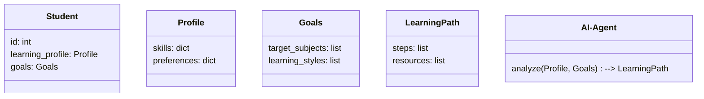
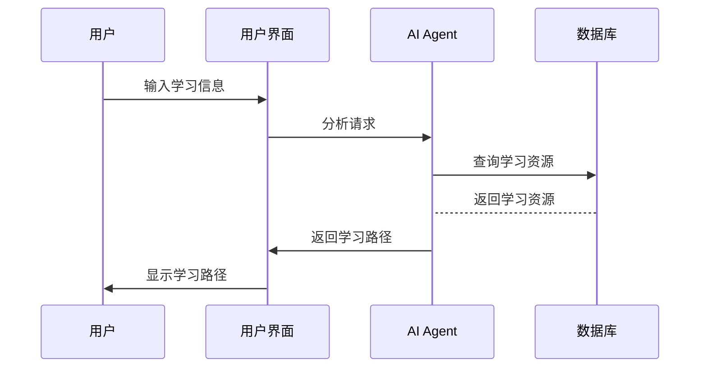

                 


# AI Agent在智能个性化学习路径规划中的应用

> 关键词：AI Agent，个性化学习，学习路径规划，智能教育，自适应学习系统

> 摘要：本文探讨AI Agent在智能个性化学习路径规划中的应用，详细分析其核心概念、算法原理、系统架构，并通过实际案例展示其在教育领域的实践价值。

---

# 第一部分: AI Agent与个性化学习的背景

## 第1章: AI Agent的基本概念与应用

### 1.1 AI Agent的定义与特点

AI Agent（智能体）是指在计算机系统中，能够感知环境并采取行动以实现目标的实体。其特点包括自主性、反应性、目标导向和社交能力。

1.1.1 AI Agent的定义  
AI Agent是能够感知环境、自主决策并执行任务的智能实体，广泛应用于教育、医疗、交通等领域。

1.1.2 AI Agent的核心特点  
- 自主性：无需外部干预，自主决策。  
- 反应性：根据环境反馈调整行为。  
- 目标导向：为实现特定目标而行动。  
- 社交能力：与人或其他系统交互协作。

1.1.3 AI Agent与传统算法的区别  
AI Agent具备自主性和目标导向，而传统算法通常基于固定规则执行任务，缺乏灵活性和适应性。

### 1.2 个性化学习的基本概念

个性化学习强调根据学生的个体差异，提供定制化的学习方案，以最大化学习效果。

1.2.1 个性化学习的定义  
个性化学习是指根据学生的特点、需求和学习风格，量身定制学习计划和资源。

1.2.2 个性化学习的目标与价值  
- 提高学习效率和效果。  
- 适应不同学生的学习节奏和能力水平。  
- 增强学习兴趣和动力。

1.2.3 个性化学习的实现方式  
- 数据驱动的分析：利用学习数据构建学生模型。  
- 自适应学习系统：实时调整学习路径和资源。  
- 智能推荐算法：个性化推荐学习内容。

## 第2章: AI Agent在教育领域的应用价值

### 2.1 教育领域的个性化学习需求

教育领域对个性化学习的需求日益增长，主要体现在学生学习特点的多样性、教学资源的个性化分配以及学习效果的动态评估。

2.1.1 学生学习特点的多样性  
学生在学习能力、兴趣、风格等方面存在显著差异，传统统一的教学方式难以满足个性化需求。

2.1.2 教学资源的个性化分配  
AI Agent可以根据学生特点，智能分配适合的学习资源，避免资源浪费，提高学习效率。

2.1.3 学习效果的动态评估  
AI Agent能够实时分析学生的学习行为和效果，动态调整学习计划，确保学习目标的实现。

### 2.2 AI Agent在个性化学习中的优势

AI Agent通过数据驱动的个性化分析、自适应学习路径规划和智能化资源推荐，为个性化学习提供了强有力的支持。

2.2.1 数据驱动的个性化分析  
AI Agent能够收集和分析大量学习数据，构建学生模型，精准识别学习需求和潜力。

2.2.2 自适应学习路径规划  
AI Agent可以根据学生的学习情况，实时调整学习路径，确保学习内容的连贯性和有效性。

2.2.3 智能化学习资源推荐  
基于学生的学习数据和偏好，AI Agent能够推荐最适合的学习资源，提升学习效果。

### 2.3 AI Agent在教育中的应用场景

AI Agent在教育中的应用场景包括智能教学助手、学生学习行为分析和自适应学习系统。

2.3.1 智能教学助手  
AI Agent可以辅助教师进行教学设计、个性化辅导和学习效果评估，减轻教师的工作负担。

2.3.2 学生学习行为分析  
通过分析学生的学习行为数据，AI Agent能够识别学习困难点，提供针对性的指导和建议。

2.3.3 自适应学习系统  
AI Agent构建的自适应学习系统能够根据学生的学习情况，动态调整学习内容和进度，实现个性化学习。

---

# 第二部分: AI Agent的核心概念与联系

## 第3章: AI Agent的核心原理

### 3.1 AI Agent的基本原理

AI Agent的基本原理包括知识表示、行为决策和状态空间。

3.1.1 知识表示  
知识表示是AI Agent理解世界的基础，常用的表示方法包括符号逻辑、概率模型和神经网络。

3.1.2 行为决策  
AI Agent通过感知环境信息，利用知识表示和推理机制，制定并执行行动。

3..1.3 状态空间  
状态空间是AI Agent所有可能的状态集合，通过状态转移实现行为决策。

### 3.2 AI Agent的学习机制

AI Agent的学习机制包括监督学习、强化学习和无监督学习。

3.2.1 监督学习  
通过标注数据进行训练，AI Agent学习输入与输出之间的映射关系。

3.2.2 强化学习  
通过与环境交互，AI Agent学习最优行为策略，以最大化累积奖励。

3.2.3 无监督学习  
通过发现数据中的模式和结构，AI Agent进行无监督学习。

## 第4章: AI Agent与个性化学习的关系

### 4.1 个性化学习的核心要素

个性化学习的核心要素包括学生特征、学习目标和学习路径。

4.1.1 学生特征  
学生特征包括学习能力、兴趣、风格和背景等，是个性化学习的基础。

4.1.2 学习目标  
学习目标是个性化学习的核心，AI Agent需要根据学生特征制定个性化目标。

4.1.3 学习路径  
学习路径是实现学习目标的具体步骤，AI Agent通过动态调整路径优化学习效果。

### 4.2 AI Agent与个性化学习的联系

AI Agent通过数据驱动的方法，分析学生特征，制定个性化目标和路径，实现个性化学习。

---

# 第三部分: AI Agent在个性化学习中的算法原理

## 第5章: 推荐算法原理

### 5.1 协同过滤推荐算法

协同过滤推荐算法通过分析用户行为，找到相似用户或物品，进行推荐。

5.1.1 基于用户的协同过滤  
基于用户相似性进行推荐，例如基于余弦相似度的计算。

5.1.2 基于物品的协同过滤  
基于物品相似性进行推荐，例如基于协同矩阵的计算。

### 5.2 基于聚类的推荐算法

基于聚类的推荐算法将用户或物品进行聚类，推荐相似类别中的内容。

5.2.1 用户聚类  
将用户分为不同类别，推荐同类用户的偏好内容。

5.2.2 物品聚类  
将物品分为不同类别，推荐同类物品。

### 5.3 基于深度学习的推荐算法

基于深度学习的推荐算法通过神经网络学习用户偏好，进行推荐。

5.3.1 基于神经网络的推荐系统  
利用卷积神经网络或循环神经网络进行推荐。

5.3.2 基于注意力机制的推荐系统  
通过注意力机制捕捉用户行为中的重要特征，进行推荐。

### 5.4 算法实现与代码

以下是协同过滤推荐算法的Python实现示例：

```python
import numpy as np

def cosine_similarity(user_profiles, item_profiles):
    # 计算余弦相似度
    numerator = np.dot(user_profiles, item_profiles.T)
    denominator = np.linalg.norm(user_profiles) * np.linalg.norm(item_profiles.T)
    return numerator / denominator

def collaborative_filtering(train_data, test_data):
    # 训练数据构建用户-物品矩阵
    user_item_matrix = {}
    for user, item, rating in train_data:
        if user not in user_item_matrix:
            user_item_matrix[user] = {}
        user_item_matrix[user][item] = rating

    # 提取用户和物品的特征向量
    users = list(user_item_matrix.keys())
    items = list(user_item_matrix[users[0]].keys())

    user_profiles = np.zeros((len(users), len(items)))
    for i, user in enumerate(users):
        for j, item in enumerate(items):
            user_profiles[i, j] = user_item_matrix[user].get(item, 0)

    # 计算相似度矩阵
    similarity_matrix = cosine_similarity(user_profiles, user_profiles)

    # 预测评分
    predictions = {}
    for user, item, _ in test_data:
        # 找出与当前用户相似的用户
        similar_users = np.where(similarity_matrix[i, :] > 0.5)[0]
        # 计算平均评分
        average_rating = np.mean([user_item_matrix[user][item] for user in similar_users if item in user_item_matrix[user]])
        predictions[(user, item)] = average_rating

    return predictions
```

---

# 第四部分: 系统分析与架构设计方案

## 第6章: 系统分析与架构设计

### 6.1 问题场景介绍

系统需要实现一个基于AI Agent的个性化学习路径规划系统，帮助学生根据自身特点制定最优学习计划。

### 6.2 项目介绍

本项目旨在构建一个智能化的个性化学习路径规划系统，利用AI Agent技术实现动态调整和优化。

### 6.3 系统功能设计

#### 6.3.1 领域模型（Mermaid 类图）



#### 6.3.2 系统架构设计（Mermaid 架构图）

```mermaid
rectangle Database {
    Student_Profile
    Learning_Resource
    Learning_Path
}

rectangle AI-Agent {
    analyze(student_profile, goals) --> learning_path
}

rectangle User_Interface {
    input: student_info
    output: recommended_learning_path
}

Database --> AI-Agent
AI-Agent --> User_Interface
```

#### 6.3.3 系统接口设计

系统接口包括数据输入接口、AI Agent分析接口和用户界面接口。

#### 6.3.4 系统交互设计（Mermaid 序列图）



---

# 第五部分: 项目实战

## 第7章: 项目实战

### 7.1 环境安装

需要安装Python、NumPy、Scikit-learn和Mermaid工具。

### 7.2 核心代码实现

以下是基于协同过滤的推荐系统实现：

```python
import numpy as np
from sklearn.metrics.pairwise import cosine_similarity

def collaborative_filtering(train_data, test_data):
    user_profiles = {}
    for user, item, rating in train_data:
        if user not in user_profiles:
            user_profiles[user] = {}
        user_profiles[user][item] = rating

    users = list(user_profiles.keys())
    items = list(user_profiles[users[0]].keys())

    user_item_matrix = np.zeros((len(users), len(items)))
    for i, user in enumerate(users):
        for j, item in enumerate(items):
            user_item_matrix[i, j] = user_profiles[user].get(item, 0)

    similarity_matrix = cosine_similarity(user_item_matrix)

    predictions = {}
    for user, item, _ in test_data:
        user_index = users.index(user)
        similar_users = np.where(similarity_matrix[user_index, :] > 0.5)[0]
        ratings = []
        for u_index in similar_users:
            u = users[u_index]
            ratings.append(user_profiles[u].get(item, 0))
        average_rating = np.mean(ratings)
        predictions[(user, item)] = average_rating

    return predictions
```

### 7.3 案例分析

通过具体案例分析AI Agent如何动态调整学习路径，提高学习效果。

---

# 第六部分: 总结与展望

## 第8章: 总结与展望

### 8.1 最佳实践

AI Agent在个性化学习中的应用需要注意数据隐私保护、算法可解释性和系统鲁棒性。

### 8.2 小结

本文详细探讨了AI Agent在智能个性化学习路径规划中的应用，从核心概念到算法实现，再到系统设计和项目实战，为读者提供了全面的视角。

### 8.3 未来展望

未来，随着AI技术的发展，AI Agent在教育领域的应用将更加广泛和深入，个性化学习将更加智能化和精准化。

---

# 作者

作者：AI天才研究院/AI Genius Institute & 禅与计算机程序设计艺术 /Zen And The Art of Computer Programming

