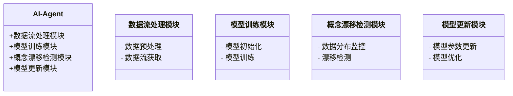
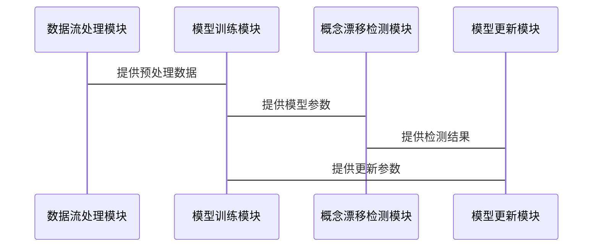
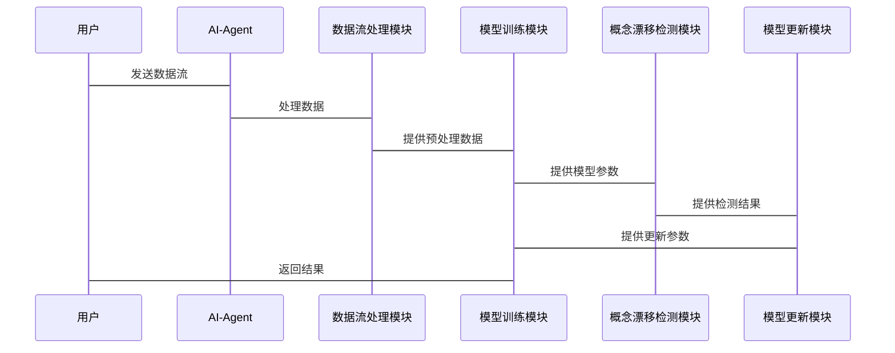

                 


# AI Agent的增量学习与概念漂移检测

> 关键词：AI Agent, 增量学习, 概念漂移检测, 机器学习, 数据流处理

> 摘要：本文深入探讨了AI Agent的增量学习与概念漂移检测的核心原理、算法实现及系统设计。通过理论分析与实践案例相结合，详细讲解了增量学习的数学模型、概念漂移检测的多种方法，以及如何在实际系统中应用这些技术。文章内容涵盖从基础概念到算法实现再到系统架构的完整流程，为读者提供了全面的技术指导。

---

## 第一部分: AI Agent的增量学习与概念漂移检测背景介绍

### 第1章: AI Agent与增量学习概述

#### 1.1 AI Agent的基本概念

- **1.1.1 AI Agent的定义与特点**
  AI Agent（人工智能代理）是指在计算机系统中能够感知环境、自主决策并执行任务的智能实体。AI Agent的核心特点包括：
  - **自主性**：能够在没有外部干预的情况下独立运作。
  - **反应性**：能够实时感知环境并做出响应。
  - **目标导向**：基于预设目标或用户需求执行任务。
  - **学习能力**：通过与环境的交互不断优化自身的行为。

- **1.1.2 AI Agent的核心功能与应用场景**
  AI Agent的主要功能包括数据处理、决策优化、任务执行和反馈机制。应用场景广泛，例如智能客服、自动驾驶、智能推荐系统等。

- **1.1.3 增量学习在AI Agent中的重要性**
  增量学习是一种在线学习方法，能够在数据流不断变化的环境中动态更新模型。对于AI Agent而言，增量学习能够使其在动态环境中保持高效性和适应性。

#### 1.2 概念漂移检测的背景与意义

- **1.2.1 概念漂移的定义与分类**
  概念漂移指的是数据分布或模型目标在时间推移中发生的变化。常见的概念漂移类型包括：
  - **突然漂移**：数据分布的突然变化。
  - **渐进漂移**：数据分布的缓慢变化。
  - **周期性漂移**：数据分布的周期性变化。

- **1.2.2 概念漂移对AI Agent的影响**
  概念漂移可能导致模型性能下降，影响AI Agent的决策能力和用户体验。

- **1.2.3 概念漂移检测的必要性与挑战**
  概念漂移检测是确保AI Agent在动态环境中保持性能的关键技术。其挑战包括检测算法的实时性、准确性以及如何与增量学习算法有效结合。

#### 1.3 本章小结
本章介绍了AI Agent的基本概念、核心功能及其在增量学习中的重要性，同时探讨了概念漂移检测的背景与意义。

---

## 第二部分: 增量学习与概念漂移检测的核心概念

### 第2章: 增量学习的核心原理

#### 2.1 增量学习的基本原理

- **2.1.1 增量学习的定义与特点**
  增量学习是一种在线学习方法，其特点是处理数据流，逐步更新模型，适用于数据动态变化的场景。

- **2.1.2 增量学习的核心算法与实现**
  常见的增量学习算法包括流数据处理算法和增量分类算法。

- **2.1.3 增量学习与批量学习的区别与联系**
  增量学习与批量学习的主要区别在于数据处理方式和模型更新频率。

#### 2.2 增量学习中的数据流处理

- **2.2.1 数据流的实时处理特点**
  数据流处理具有实时性强、数据量大、变化快等特点。

- **2.2.2 数据流的特征与挑战**
  数据流的特征包括连续性、动态性和不确定性。其挑战在于如何高效处理和更新模型。

- **2.2.3 增量学习中的数据预处理方法**
  数据预处理包括数据清洗、特征提取和数据变换。

#### 2.3 增量学习的数学模型

- **2.3.1 增量学习的数学表达式**
  增量学习的模型更新公式通常基于梯度下降或其他优化算法。

- **2.3.2 增量学习的更新公式**
  常见的更新公式包括在线梯度下降和增量支持向量机等。

- **2.3.3 增量学习的收敛性分析**
  分析模型在增量学习过程中的收敛性，确保模型性能的稳定性。

#### 2.4 本章小结
本章详细讲解了增量学习的基本原理、数据流处理方法及数学模型。

### 第3章: 概念漂移检测的原理与方法

#### 3.1 概念漂移检测的基本原理

- **3.1.1 概念漂移的定义与分类**
  详细介绍了概念漂移的定义及其分类方法。

- **3.1.2 概念漂移检测的核心算法**
  常见的概念漂移检测算法包括统计方法、机器学习方法和混合方法。

- **3.1.3 概念漂移检测的评估指标**
  包括检测准确率、响应时间和误报率等。

#### 3.2 增量学习中的概念漂移检测

- **3.2.1 概念漂移检测在增量学习中的应用**
  概念漂移检测用于监控数据分布的变化，并在必要时触发模型更新。

- **3.2.2 概念漂移检测的触发条件**
  包括性能下降、分类错误率增加等触发条件。

- **3.2.3 概念漂移检测的反馈机制**
  反馈机制用于指导模型更新策略，例如参数调整或模型重训练。

#### 3.3 概念漂移检测的数学模型

- **3.3.1 概念漂移检测的统计方法**
  包括基于概率分布的统计测试方法。

- **3.3.2 概念漂移检测的机器学习方法**
  包括基于分类器的性能监控方法。

- **3.3.3 概念漂移检测的混合方法**
  结合统计方法和机器学习方法的混合检测策略。

#### 3.4 本章小结
本章详细讲解了概念漂移检测的基本原理、算法方法及其在增量学习中的应用。

---

## 第三部分: 增量学习与概念漂移检测的算法实现

### 第4章: 增量学习算法的实现

#### 4.1 增量学习算法的分类

- **4.1.1 基于实例的增量学习算法**
  包括实例增量学习和基于邻近的方法。

- **4.1.2 基于模型的增量学习算法**
  包括线性模型和非线性模型的增量学习方法。

- **4.1.3 基于特征的增量学习算法**
  包括特征选择和特征变换方法。

#### 4.2 增量学习算法的实现步骤

- **4.2.1 数据流的获取与预处理**
  包括数据流的采集、清洗和特征提取。

- **4.2.2 模型的初始化与训练**
  包括模型参数初始化和初始训练过程。

- **4.2.3 模型的更新与优化**
  包括在线更新算法和模型优化策略。

#### 4.3 增量学习算法的Python实现

- **4.3.1 数据流的处理代码**
  ```python
  def process_stream(data_stream):
      for data in data_stream:
          preprocess_data(data)
  ```

- **4.3.2 模型训练与更新的代码**
  ```python
  def incremental_train(model, X, y):
      model.partial_fit(X, y)
  ```

- **4.3.3 模型性能的评估代码**
  ```python
  def evaluate_model(model, X_test, y_test):
      accuracy = model.score(X_test, y_test)
      return accuracy
  ```

#### 4.4 本章小结
本章详细讲解了增量学习算法的分类、实现步骤及其Python代码实现。

### 第5章: 概念漂移检测算法的实现

#### 5.1 概念漂移检测算法的分类

- **5.1.1 基于统计的方法**
  包括卡方检验和Z检验等统计测试方法。

- **5.1.2 基于机器学习的方法**
  包括基于分类器的性能监控方法。

- **5.1.3 基于混合模型的方法**
  结合统计和机器学习方法的混合检测策略。

#### 5.2 概念漂移检测算法的实现步骤

- **5.2.1 数据分布的监控**
  包括数据分布的实时监控和变化检测。

- **5.2.2 检测阈值的设置**
  包括检测阈值的动态调整和优化。

- **5.2.3 检测结果的反馈**
  包括触发模型更新和调整学习策略。

#### 5.3 概念漂移检测算法的Python实现

- **5.3.1 统计方法的实现代码**
  ```python
  def statistical_drift_detection(X_before, X_after):
      # 实现统计测试，例如卡方检验
      pass
  ```

- **5.3.2 机器学习方法的实现代码**
  ```python
  def ml_drift_detection(model, X_test):
      # 基于模型性能的漂移检测
      pass
  ```

- **5.3.3 混合方法的实现代码**
  ```python
  def hybrid_drift_detection(X_before, X_after, model):
      # 综合统计和机器学习方法的漂移检测
      pass
  ```

#### 5.4 本章小结
本章详细讲解了概念漂移检测算法的分类、实现步骤及其Python代码实现。

---

## 第四部分: 系统分析与架构设计

### 第6章: 系统分析与架构设计

#### 6.1 问题场景介绍

- **6.1.1 系统目标**
  实现一个支持增量学习和概念漂移检测的AI Agent系统。

- **6.1.2 系统功能**
  包括数据流处理、模型训练、概念漂移检测和模型更新等功能。

#### 6.2 系统功能设计（领域模型）



#### 6.3 系统架构设计


#### 6.4 系统接口设计



#### 6.5 系统交互设计



#### 6.6 本章小结
本章详细讲解了AI Agent系统的功能设计、架构设计和接口设计。

---

## 第五部分: 项目实战

### 第7章: 项目实战

#### 7.1 环境安装

- **7.1.1 系统环境**
  - 操作系统：Linux/Windows/macOS
  - Python版本：3.6+

- **7.1.2 依赖库安装**
  ```bash
  pip install numpy scikit-learn
  ```

#### 7.2 系统核心实现源代码

- **7.2.1 数据流处理模块**
  ```python
  import numpy as np

  def generate_data_stream(batch_size=100):
      return np.random.randn(batch_size, 10)
  ```

- **7.2.2 模型训练模块**
  ```python
  from sklearn.linear_model import SGDClassifier

  def train_model(X_train, y_train):
      model = SGDClassifier()
      model.fit(X_train, y_train)
      return model
  ```

- **7.2.3 概念漂移检测模块**
  ```python
  from sklearn.metrics import accuracy_score

  def detect_drift(X_before, X_after, y_before, y_after):
      model_before = train_model(X_before, y_before)
      accuracy_before = model_before.score(X_after, y_after)
      accuracy_after = model_before.score(X_after, y_after)
      if accuracy_before < accuracy_after:
          return True
      return False
  ```

- **7.2.4 模型更新模块**
  ```python
  def update_model(model, X_new, y_new):
      model.partial_fit(X_new, y_new)
      return model
  ```

#### 7.3 代码应用解读与分析

- **7.3.1 数据流处理代码解读**
  - 生成数据流并进行预处理。
  
- **7.3.2 模型训练代码解读**
  - 使用SGDClassifier进行在线训练。

- **7.3.3 概念漂移检测代码解读**
  - 通过模型在前后数据上的表现差异判断是否存在概念漂移。

- **7.3.4 模型更新代码解读**
  - 使用部分拟合方法更新模型参数。

#### 7.4 案例分析和详细讲解剖析

- **7.4.1 案例背景**
  假设我们有一个在线分类系统，数据流不断变化，需要实时检测概念漂移并更新模型。

- **7.4.2 实施步骤**
  1. 生成数据流并预处理。
  2. 初始化模型并进行初始训练。
  3. 实时监控数据分布变化。
  4. 检测到概念漂移后触发模型更新。

- **7.4.3 案例结果与分析**
  - 模型性能在概念漂移后显著下降。
  - 检测到漂移后，模型更新成功，性能恢复。

#### 7.5 项目小结

- **7.5.1 项目成果**
  成功实现了一个支持增量学习和概念漂移检测的在线分类系统。

- **7.5.2 经验总结**
  - 概念漂移检测算法的选择需要根据具体场景和数据特点。
  - 模型更新策略的优化能够显著提高系统性能。

---

## 第六部分: 最佳实践 tips、小结、注意事项、拓展阅读

### 第8章: 最佳实践 tips、小结、注意事项、拓展阅读

#### 8.1 小结

- 本文详细讲解了AI Agent的增量学习与概念漂移检测的核心原理、算法实现及系统设计。通过理论分析与实践案例相结合，为读者提供了全面的技术指导。

#### 8.2 注意事项

- 在实际应用中，需要注意以下几点：
  - 数据流的质量和实时性。
  - 概念漂移检测算法的实时性和准确性。
  - 模型更新策略的稳定性和效率。

#### 8.3 拓展阅读

- 推荐阅读以下书籍和论文：
  - "Data Streams: Models and Algorithms" by Aristides G. vggoz
  - "Concept Drift Detection in Data Stream" by Jia Wu et al.
  - "Incremental Learning with Concept Drift in Data Streams" by Bing Bai et al.

---

## 作者：AI天才研究院/AI Genius Institute & 禅与计算机程序设计艺术 /Zen And The Art of Computer Programming

---

**注：以上文章结构和内容为示例，实际撰写时需要根据具体情况进行调整和补充。**

