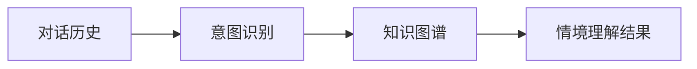
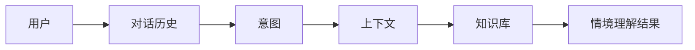
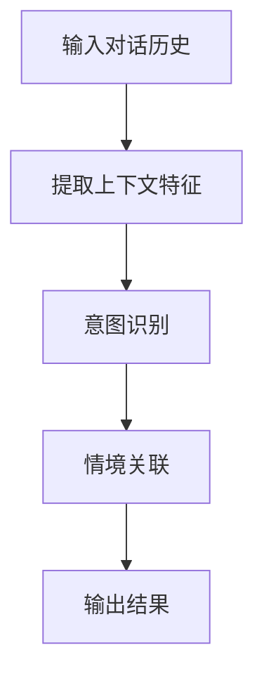
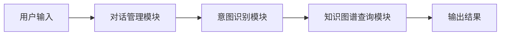
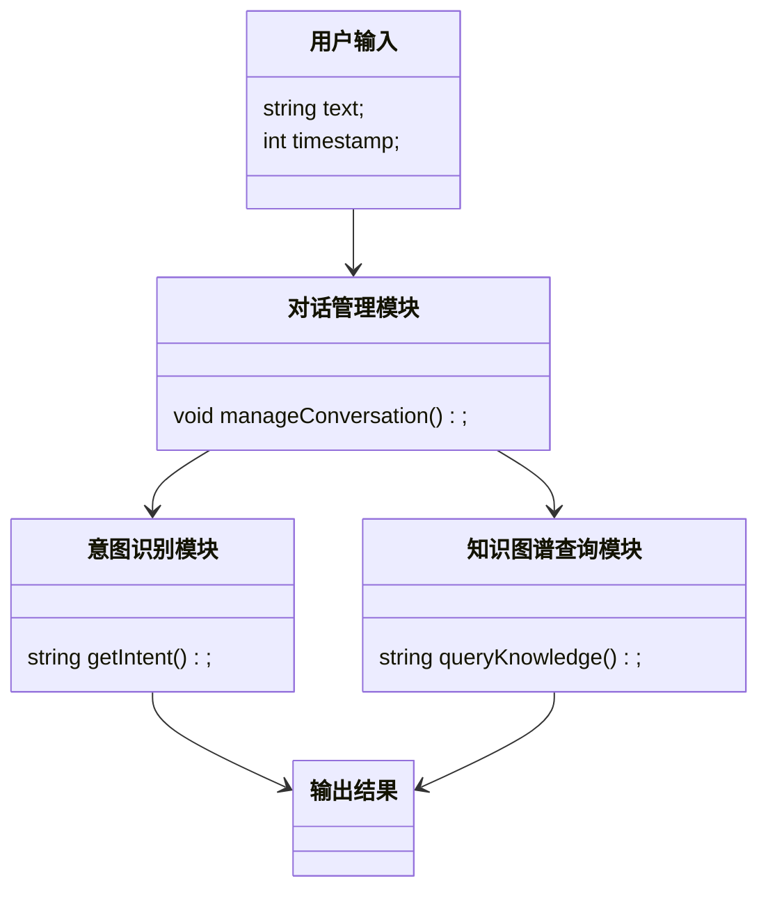
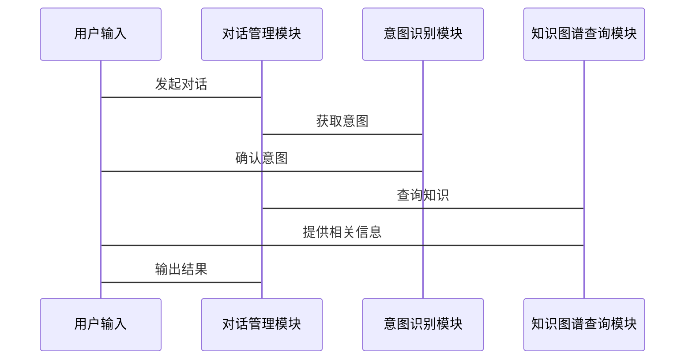

                 


# AI Agent的情境理解：超越单一对话的上下文把握

## 关键词：AI Agent，情境理解，上下文，多轮对话，知识图谱

## 摘要：  
本文深入探讨AI Agent在情境理解中的核心原理与技术，超越传统的单一对话上下文，结合多模态数据和知识图谱，实现更智能的对话管理和决策支持。通过理论分析、算法设计和项目实战，全面解析情境理解的关键技术，展示其在实际应用中的巨大潜力。

---

# 第一部分: AI Agent的情境理解概述

## 第1章: 情境理解的背景与问题

### 1.1 问题背景

#### 1.1.1 AI Agent的定义与特点  
AI Agent（智能体）是指在特定环境中能够感知并自主行动以实现目标的实体。AI Agent具备以下特点：  
- **自主性**：无需外部干预，自主决策。  
- **反应性**：能够实时感知环境并做出反应。  
- **目标导向性**：所有行动均以实现特定目标为导向。  

#### 1.1.2 单一对话的局限性  
传统的对话系统往往仅局限于单次对话的上下文理解，无法处理跨对话的关联信息。例如：  
- **信息碎片化**：每次对话仅处理局部信息，缺乏整体关联。  
- **知识隔离**：不同对话之间的知识无法共享和复用。  

#### 1.1.3 情境理解的必要性  
在实际应用中，AI Agent需要理解对话的全局情境，包括：  
- **对话历史**：用户过去的行为和对话内容。  
- **用户意图**：用户的真实需求和目标。  
- **环境信息**：对话发生的具体场景和背景。  

### 1.2 问题描述

#### 1.2.1 上下文理解的挑战  
上下文理解的关键挑战包括：  
- **信息不完整**：用户可能未明确表达所有信息。  
- **歧义性**：同一句话可能有多种解释。  
- **动态变化**：对话情境可能随着交流的深入而不断变化。  

#### 1.2.2 多轮对话中的信息关联  
在多轮对话中，信息的关联性是情境理解的核心，例如：  
- 用户在不同轮次中表达的需求可能相互关联。  
- 前文提到的信息可能在后文中起到关键作用。  

#### 1.2.3 情境理解的核心目标  
情境理解的目标是通过整合多源信息，准确识别用户的意图，并在此基础上生成合理的响应。

### 1.3 问题解决

#### 1.3.1 情境理解的关键技术  
情境理解的关键技术包括：  
- **自然语言处理（NLP）**：用于理解和生成人类语言。  
- **知识图谱**：用于构建和表示领域知识。  
- **对话管理**：用于协调多轮对话的流程。  

#### 1.3.2 多模态数据的整合  
AI Agent需要整合多模态数据，例如：  
- 文本：对话内容、用户输入。  
- 语音：用户的语气、语调。  
- 图像：用户的视觉信息。  

#### 1.3.3 知识图谱的作用  
知识图谱通过构建领域知识网络，帮助AI Agent更好地理解对话情境。例如：  
- 产品信息：产品的属性、功能、价格等。  
- 用户信息：用户的偏好、历史行为等。  

### 1.4 边界与外延

#### 1.4.1 情境理解的边界  
情境理解的边界包括：  
- **信息范围**：仅处理与当前对话相关的上下文信息。  
- **知识限制**：受限于知识图谱的覆盖范围。  

#### 1.4.2 相关概念的区分  
需要区分以下概念：  
- **意图识别**：识别用户的直接需求。  
- **情感分析**：分析用户的情感倾向。  
- **实体识别**：识别文本中的实体信息。  

#### 1.4.3 情境理解的外延  
情境理解的外延包括：  
- **跨领域应用**：适用于不同领域和场景。  
- **动态更新**：随着对话的进行，实时更新情境信息。  

### 1.5 概念结构与核心要素

#### 1.5.1 情境理解的层次模型  
情境理解的层次模型包括：  
1. **表面理解**：对文本的词法、句法分析。  
2. **语义理解**：理解文本的含义和意图。  
3. **情境关联**：整合对话历史和外部知识。  

#### 1.5.2 核心要素的分解  
情境理解的核心要素包括：  
- **对话历史**：用户过去的行为和对话内容。  
- **意图识别**：用户当前的直接需求。  
- **知识图谱**：领域知识的结构化表示。  

#### 1.5.3 概念结构的可视化  
以下是情境理解的概念结构图：



---

## 第2章: 情境理解的核心概念与联系

### 2.1 核心概念原理

#### 2.1.1 上下文感知的机制  
上下文感知的机制包括：  
- **短期记忆**：记录当前对话的上下文信息。  
- **长期记忆**：存储用户的历史行为和偏好。  

#### 2.1.2 情境记忆的模型  
情境记忆的模型包括：  
- **基于规则的模型**：通过预定义规则匹配情境。  
- **基于学习的模型**：利用机器学习算法学习情境特征。  

#### 2.1.3 多轮对话的关联性  
多轮对话的关联性体现在：  
- **信息传递**：前一轮对话的信息传递到后一轮。  
- **意图延续**：用户意图可能在多轮对话中持续。  

### 2.2 概念属性特征对比

#### 2.2.1 情境理解与意图识别的对比  
以下是情境理解与意图识别的对比表：

| 特性             | 情境理解                | 意图识别                |
|------------------|-------------------------|-------------------------|
| 定义             | 对整体对话情境的理解    | 对用户意图的识别        |
| 范围             | 包括上下文和外部知识    | 仅关注用户的直接需求    |
| 方法             | 综合分析多源信息        | 基于NLP技术进行分析      |

#### 2.2.2 上下文关联性与语义理解的对比  
以下是上下文关联性与语义理解的对比表：

| 特性             | 上下文关联性           | 语义理解               |
|------------------|------------------------|------------------------|
| 定义             | 对话中的信息关联性     | 对文本含义的理解       |
| 依赖             | 依赖对话历史          | 依赖文本本身           |
| 应用             | 多轮对话中的信息整合   | 单次对话的理解         |

#### 2.2.3 情境记忆与知识图谱的对比  
以下是情境记忆与知识图谱的对比表：

| 特性             | 情境记忆               | 知识图谱               |
|------------------|------------------------|------------------------|
| 定义             | 用户对话中的历史信息   | 领域知识的结构化表示   |
| 作用             | 支持多轮对话理解       | 支持领域知识查询       |
| 表示方式         | 文本形式               | 图结构                 |

### 2.3 ER实体关系图架构

以下是情境理解的ER实体关系图：



---

## 第3章: 情境理解的算法原理

### 3.1 算法原理讲解

#### 3.1.1 上下文窗口处理  
上下文窗口处理的关键步骤包括：  
1. **窗口滑动**：将对话历史划分为多个窗口。  
2. **特征提取**：提取每个窗口的特征信息。  
3. **权重计算**：计算每个窗口的重要性权重。  

#### 3.1.2 意图识别的流程  
意图识别的流程包括：  
1. **文本预处理**：分词、去停用词等。  
2. **特征提取**：提取文本的特征向量。  
3. **模型训练**：训练意图分类模型。  
4. **意图预测**：基于模型预测用户意图。  

#### 3.1.3 多模态数据融合  
多模态数据融合的步骤包括：  
1. **数据采集**：获取文本、语音、图像等多种数据。  
2. **特征提取**：分别提取各模态的特征。  
3. **融合策略**：采用加权融合或投票融合等方式。  
4. **最终决策**：综合各模态的信息生成最终结果。  

### 3.2 算法流程图

以下是上下文窗口处理的算法流程图：



### 3.3 数学模型与公式

#### 3.3.1 概率计算模型  
以下是概率计算模型的公式：

$$ P(\text{intent} | \text{context}) = \frac{P(\text{context} | \text{intent}) \cdot P(\text{intent})}{\sum_{i} P(\text{context} | i) \cdot P(i)} $$

---

# 总结与展望

## 第4章: 情境理解的系统分析与架构设计

### 4.1 系统架构设计

以下是系统架构设计的架构图：



### 4.2 系统功能设计

以下是系统功能设计的类图：



### 4.3 系统接口设计

以下是系统接口设计的序列图：



## 第5章: 项目实战

### 5.1 项目介绍

#### 5.1.1 项目背景  
本项目旨在实现一个具备情境理解能力的AI Agent，应用于智能客服场景。  

#### 5.1.2 项目目标  
通过整合对话历史和知识图谱，提升客服系统的对话理解能力。  

### 5.2 环境安装

#### 5.2.1 安装Python  
安装Python 3.8或更高版本。  

#### 5.2.2 安装依赖库  
安装以下依赖库：  
- `numpy`：`pip install numpy`  
- `scikit-learn`：`pip install scikit-learn`  
- `networkx`：`pip install networkx`  

### 5.3 核心实现

#### 5.3.1 对话管理模块  
以下是对话管理模块的代码实现：

```python
class ConversationManager:
    def __init__(self):
        self.history = []
        self.current_intent = None

    def add_to_history(self, text):
        self.history.append(text)

    def get_intent(self):
        # 简单实现：基于最近一条对话的意图
        if self.history:
            return self.history[-1]
        else:
            return None
```

#### 5.3.2 意图识别模块  
以下是意图识别模块的代码实现：

```python
from sklearn.feature_extraction.text import TfidfVectorizer
from sklearn.naive_bayes import MultinomialNB

class IntentRecognizer:
    def __init__(self):
        self.vectorizer = TfidfVectorizer()
        self.classifier = MultinomialNB()

    def train(self, X, y):
        self.vectorizer.fit(X)
        X_vec = self.vectorizer.transform(X)
        self.classifier.fit(X_vec, y)

    def predict(self, text):
        text_vec = self.vectorizer.transform([text])
        return self.classifier.predict(text_vec)[0]
```

#### 5.3.3 知识图谱查询模块  
以下是知识图谱查询模块的代码实现：

```python
import networkx as nx

class KnowledgeGraphQuery:
    def __init__(self):
        self.graph = nx.Graph()

    def add_edge(self, node1, node2):
        self.graph.add_edge(node1, node2)

    def query(self, start_node):
        return list(self.graph.neighbors(start_node))
```

### 5.4 实际案例分析

#### 5.4.1 案例描述  
用户在智能客服系统中咨询产品信息，对话历史如下：  
1. 用户：我想了解一下你们的产品。  
2. 客服：我们有多种产品，您具体想了解哪一款？  
3. 用户：我想了解你们的旗舰产品。  

#### 5.4.2 案例分析  
1. 对话管理模块记录对话历史。  
2. 意图识别模块识别用户的意图：咨询旗舰产品信息。  
3. 知识图谱查询模块查询旗舰产品的相关信息。  

### 5.5 项目小结  
通过本项目的实现，我们展示了AI Agent在智能客服中的应用潜力。未来，可以通过优化算法和扩展知识图谱进一步提升情境理解能力。

---

## 第6章: 总结与展望

### 6.1 最佳实践Tips

#### 6.1.1 系统设计  
- **模块化设计**：确保系统各模块独立且易于扩展。  
- **数据预处理**：对数据进行充分的清洗和标注。  

#### 6.1.2 算法优化  
- **特征工程**：设计有效的特征提取方法。  
- **模型选择**：选择适合任务的机器学习模型。  

### 6.2 小结  
本文系统性地探讨了AI Agent情境理解的关键技术，结合理论分析和项目实战，展示了其在实际应用中的巨大潜力。  

### 6.3 注意事项  
- **数据隐私**：确保用户数据的安全性和隐私性。  
- **系统稳定性**：确保系统的高可用性和稳定性。  

### 6.4 拓展阅读  
- **推荐书籍**：《自然语言处理入门》、《机器学习实战》。  
- **推荐论文**：阅读相关领域的顶级会议论文，如ACL、CVPR等。  

---

## 作者：AI天才研究院 & 禅与计算机程序设计艺术

---

**感谢您的阅读！希望本文能为您提供有价值的技术洞察和实践指导。**

