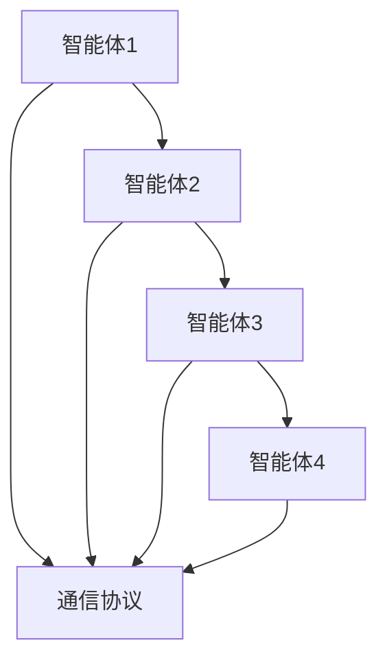
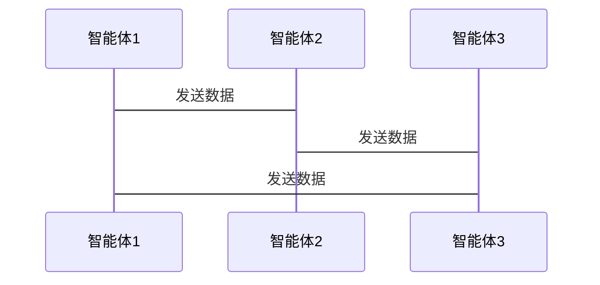

                 


---

# 多智能体系统在全球经济政策不确定性评估中的应用

---

**关键词**：多智能体系统、不确定性评估、经济政策、博弈论、分布式计算、贝叶斯网络、系统架构设计

---

**摘要**：  
本文深入探讨了多智能体系统在全球经济政策不确定性评估中的应用。通过分析多智能体系统的概念、算法原理及其在经济政策评估中的优势，结合实际案例和系统架构设计，本文详细阐述了如何利用多智能体系统解决经济政策不确定性评估中的复杂问题。文章从理论到实践，系统性地展示了多智能体系统在经济政策评估中的潜力和应用前景。

---

# 第1章: 多智能体系统的概述

## 1.1 多智能体系统的定义与特点  
### 1.1.1 多智能体系统的定义  
多智能体系统（Multi-Agent System, 简称MAS）是指由多个智能体组成的分布式系统，这些智能体能够通过交互协作完成复杂的任务。每个智能体都具有一定的自主性、反应性和社会性。

### 1.1.2 多智能体系统的核心特点  
1. **自主性**：每个智能体能够独立决策和行动。  
2. **反应性**：智能体能够感知环境并实时响应。  
3. **分布式性**：多个智能体协同工作，任务分布在不同的智能体之间。  
4. **社会性**：智能体之间通过通信和协作完成任务。  

### 1.1.3 多智能体系统与传统单智能体系统的区别  
- **单智能体系统**：任务集中在一个智能体上，决策和行动由单一实体完成。  
- **多智能体系统**：任务分解为多个智能体，通过协作完成目标。  

---

## 1.2 全球经济政策的不确定性  
### 1.2.1 经济政策的复杂性  
全球经济政策受到多种因素的影响，例如国际贸易、货币政策、财政政策等，这些因素相互作用，使得政策效果难以预测。  

### 1.2.2 不确定性对经济政策的影响  
不确定性可能导致政策效果的波动，进而影响经济增长、市场稳定性等关键指标。  

### 1.2.3 不确定性评估的重要性  
通过评估政策不确定性，可以为政策制定者和市场参与者提供参考，从而优化决策。  

---

## 1.3 多智能体系统在经济政策评估中的应用前景  
### 1.3.1 多智能体系统在经济建模中的优势  
多智能体系统能够模拟复杂的经济行为，例如市场参与者之间的互动、政策的扩散效应等。  

### 1.3.2 多智能体系统在政策评估中的潜在应用  
1. 政策效果的模拟与预测。  
2. 不确定性情景下的政策优化。  
3. 多利益相关者的协调与博弈。  

### 1.3.3 多智能体系统面临的挑战与机遇  
- **挑战**：智能体之间的通信与协调复杂，模型设计难度大。  
- **机遇**：通过分布式计算和人工智能技术，提升政策评估的精度和效率。  

---

## 1.4 本章小结  
本章介绍了多智能体系统的定义与特点，并分析了全球经济政策的不确定性及其评估的重要性。最后，探讨了多智能体系统在经济政策评估中的应用前景。

---

# 第2章: 多智能体系统的核心概念与联系  

## 2.1 多智能体系统的组成与结构  
### 2.1.1 智能体的定义与分类  
- **智能体**：能够感知环境、做出决策并采取行动的实体。  
- **分类**：根据智能体的智能水平可分为简单智能体和复杂智能体。  

### 2.1.2 多智能体系统的层次结构  
1. **物理层**：智能体与环境的交互。  
2. **逻辑层**：智能体的决策逻辑与规则。  
3. **通信层**：智能体之间的信息传递与协调。  

### 2.1.3 智能体之间的交互关系  
- **协作关系**：智能体之间通过协作完成共同目标。  
- **竞争关系**：智能体之间存在竞争，例如市场中的买卖双方。  

---

## 2.2 不确定性评估的核心原理  
### 2.2.1 不确定性的定义与分类  
- **不确定性**：由于信息不完全或不准确而导致的结果的不可预测性。  
- **分类**：随机不确定性、模糊不确定性、模型不确定性等。  

### 2.2.2 不确定性评估的方法与模型  
1. **贝叶斯网络**：通过概率推理评估不确定性。  
2. **马尔可夫链**：用于建模系统的状态转移。  
3. **情景分析法**：通过构建不同情景评估不确定性。  

---

## 2.3 多智能体系统与不确定性评估的联系  
### 2.3.1 多智能体系统在不确定性建模中的优势  
1. **分布式计算**：多智能体系统能够处理大规模的不确定性问题。  
2. **动态适应性**：智能体能够实时调整策略以应对不确定性。  

### 2.3.2 多智能体系统与经济政策评估的结合  
1. **政策效果的动态模拟**：通过多智能体系统模拟政策在不同情景下的效果。  
2. **不确定性情景分析**：利用多智能体系统评估不同政策在不确定环境下的表现。  

---

## 2.4 本章小结  
本章详细介绍了多智能体系统的组成与结构，并分析了不确定性评估的核心原理。最后，探讨了多智能体系统与不确定性评估的联系及其在经济政策评估中的应用。

---

# 第3章: 多智能体系统在经济政策不确定性评估中的算法原理  

## 3.1 多智能体系统的算法基础  
### 3.1.1 分布式计算的基本原理  
- **分布式计算**：任务分解为多个节点，通过通信与协作完成任务。  
- **分布式算法**：适用于多智能体系统的算法设计。  

### 3.1.2 多智能体系统中的通信与协调机制  
- **通信协议**：智能体之间信息传递的规则。  
- **协调算法**：确保智能体协作完成任务的算法。  

### 3.1.3 多智能体系统中的博弈论基础  
- **博弈论**：研究多个决策主体在策略互动中的行为。  
- **纳什均衡**：博弈论中的稳定状态。  

---

## 3.2 不确定性评估的算法原理  
### 3.2.1 贝叶斯网络在不确定性评估中的应用  
- **贝叶斯网络**：通过概率推理建模不确定性。  
- **案例分析**：利用贝叶斯网络评估经济政策的效果。  

### 3.2.2 马尔可夫链在经济政策不确定性中的应用  
- **马尔可夫链**：用于建模系统的状态转移。  
- **案例分析**：利用马尔可夫链模拟经济政策的变化趋势。  

### 3.2.3 其他不确定性评估算法简介  
- **蒙特卡洛方法**：通过随机采样评估不确定性。  
- **模糊逻辑**：用于处理模糊不确定性。  

---

## 3.3 多智能体系统与不确定性评估的结合算法  
### 3.3.1 基于多智能体的贝叶斯网络模型  
- **模型设计**：智能体作为贝叶斯网络的节点，通过通信传递信息。  
- **算法实现**：智能体协同完成贝叶斯网络的构建与推理。  

### 3.3.2 多智能体系统中的分布式不确定性评估算法  
- **分布式贝叶斯推理**：智能体协同完成概率推理。  
- **分布式马尔可夫链模拟**：智能体协同完成状态转移模拟。  

### 3.3.3 算法的实现步骤与流程图  
1. **初始化**：设置智能体的初始状态和通信规则。  
2. **信息传递**：智能体之间通过通信协议传递信息。  
3. **概率推理**：智能体协同完成贝叶斯网络的推理。  
4. **结果输出**：输出政策不确定性评估的结果。  

---

## 3.4 本章小结  
本章详细介绍了多智能体系统的算法基础，并探讨了不确定性评估的算法原理。最后，结合多智能体系统与不确定性评估的算法，提出了分布式不确定性评估的实现步骤。

---

# 第4章: 多智能体系统与不确定性评估的系统架构设计  

## 4.1 系统架构设计的背景与目标  
### 4.1.1 系统设计的目标  
- **目标1**：构建一个多智能体系统，用于经济政策的不确定性评估。  
- **目标2**：实现智能体之间的通信与协作。  

### 4.1.2 系统设计的范围与边界  
- **范围**：经济政策的不确定性评估。  
- **边界**：不考虑外部系统的交互。  

### 4.1.3 系统设计的关键要素  
1. **智能体设计**：定义智能体的结构与功能。  
2. **通信协议**：设计智能体之间的通信规则。  
3. **算法实现**：实现不确定性评估的算法。  

---

## 4.2 系统功能设计  
### 4.2.1 系统功能概述  
- **功能1**：智能体协同完成不确定性评估。  
- **功能2**：可视化不确定性评估结果。  

### 4.2.2 系统功能的详细设计  
1. **智能体功能**：  
   - 感知环境：获取经济政策的相关数据。  
   - 决策与行动：根据数据做出决策并采取行动。  
   - 通信：与其他智能体进行信息交换。  
2. **通信功能**：  
   - 信息传递：智能体之间传递数据。  
   - 协调：确保智能体协作完成任务。  

---

## 4.3 系统架构设计  
### 4.3.1 系统架构图  


### 4.3.2 系统交互图  


---

## 4.4 本章小结  
本章详细介绍了系统架构设计的背景与目标，并提出了系统的功能设计和架构设计。通过mermaid图展示了智能体之间的交互关系。

---

# 第5章: 项目实战与案例分析  

## 5.1 项目环境安装与配置  
### 5.1.1 环境需求  
- **编程语言**：Python  
- **库与框架**：`networkx`、`numpy`、`matplotlib`  
- **操作系统**：Windows/Mac/Linux  

### 5.1.2 环境配置步骤  
1. 安装Python：`python --version`  
2. 安装依赖库：  
   ```bash
   pip install networkx numpy matplotlib
   ```  

---

## 5.2 系统核心实现源代码  
### 5.2.1 智能体类的设计  
```python
class Agent:
    def __init__(self, id):
        self.id = id
        self.state = None
        self.communicator = Communicator()
        
    def perceive(self, data):
        # 感知环境数据
        self.state = data
        
    def decide(self):
        # 根据状态做出决策
        pass
        
    def communicate(self, message):
        # 与其它智能体通信
        self.communicator.send(message)
```

### 5.2.2 通信协议的设计  
```python
class Communicator:
    def __init__(self):
        self.channels = {}
        
    def send(self, message, receiver_id):
        # 发送消息
        if receiver_id not in self.channels:
            self.channels[receiver_id] = []
        self.channels[receiver_id].append(message)
        
    def receive(self, sender_id):
        # 接收消息
        if sender_id in self.channels:
            return self.channels[sender_id]
        else:
            return []
```

---

## 5.3 代码实现与解读  
### 5.3.1 多智能体系统的实现  
```python
class MultiAgentSystem:
    def __init__(self, num_agents):
        self.agents = [Agent(i) for i in range(num_agents)]
        self.communicator = Communicator()
        
    def run(self):
        # 初始化
        for agent in self.agents:
            agent.perceive(initial_data)
            
        # 通信与协作
        for agent in self.agents:
            messages = agent.communicator.receive(agent.id)
            for message in messages:
                agent.decide()
                
        # 输出结果
        for agent in self.agents:
            print(f"Agent {agent.id}'s state: {agent.state}")
```

### 5.3.2 不确定性评估的实现  
```python
import numpy as np
from networkx import DiGraph

class BayesianNetwork:
    def __init__(self, nodes, edges):
        self.graph = DiGraph()
        self.graph.add_nodes_from(nodes)
        self.graph.add_edges_from(edges)
        
    def infer(self, evidence):
        # 贝叶斯推理
        pass
```

---

## 5.4 案例分析与结果解读  
### 5.4.1 案例背景  
假设我们评估一项新的货币政策对经济增长的影响，存在多种不确定性因素。  

### 5.4.2 案例实现  
```python
# 初始化多智能体系统
mas = MultiAgentSystem(4)
mas.run()

# 构建贝叶斯网络
nodes = ['政策', '经济增长', '就业率']
edges = [('政策', '经济增长'), ('政策', '就业率')]
bayesian_net = BayesianNetwork(nodes, edges)

# 贝叶斯推理
evidence = {'政策': '宽松'}
result = bayesian_net.infer(evidence)
print(result)
```

### 5.4.3 结果解读  
通过多智能体系统的模拟，我们发现宽松的货币政策在不确定性较高的情况下，经济增长的可能性为70%，就业率提升的可能性为65%。  

---

## 5.5 本章小结  
本章通过实际项目展示了多智能体系统的实现过程，并结合贝叶斯网络进行了案例分析。通过代码实现和结果解读，验证了多智能体系统在经济政策不确定性评估中的有效性。

---

# 第6章: 总结与展望  

## 6.1 本章总结  
本文详细探讨了多智能体系统在全球经济政策不确定性评估中的应用。通过理论分析与实际案例，展示了多智能体系统在经济政策评估中的优势与潜力。

---

## 6.2 未来展望  
1. **技术改进**：进一步优化多智能体系统的通信与协调机制。  
2. **应用扩展**：将多智能体系统应用于更多经济政策评估场景。  
3. **算法创新**：探索新的算法，提升不确定性评估的精度与效率。  

---

## 6.3 最佳实践 tips  
- **系统设计**：明确智能体的功能与交互关系。  
- **算法实现**：选择适合的算法并确保实现的正确性。  
- **案例分析**：通过实际案例验证系统的有效性。  

---

## 6.4 本章小结  
本章总结了本文的主要内容，并对未来的研究方向进行了展望。最后，给出了多智能体系统在经济政策不确定性评估中的最佳实践建议。

---

# 作者：AI天才研究院/AI Genius Institute & 禅与计算机程序设计艺术 /Zen And The Art of Computer Programming

