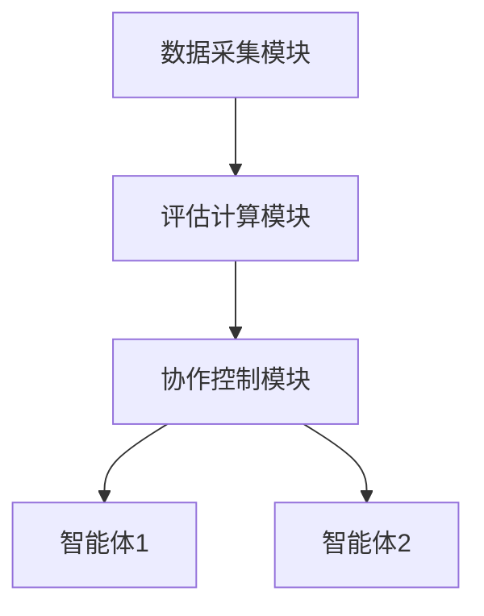

                 


# 多智能体系统在评估公司人力资本价值中的应用

**关键词**：多智能体系统、人力资本评估、协作算法、数学模型、系统架构

**摘要**：  
随着企业规模的不断扩大和复杂性增加，传统的单点评估方法在人力资本管理中的局限性日益显现。多智能体系统作为一种分布式、协作式的计算范式，为解决这一问题提供了新的思路。本文系统地探讨了多智能体系统在人力资本评估中的应用，从核心概念、算法原理到系统架构，再到实际案例，全面剖析了其在提升评估效率和精度方面的潜力。通过数学建模和算法实现，本文展示了如何利用多智能体系统实现分布式协作，从而更准确地评估员工和团队的贡献，为企业的人力资源管理提供科学依据。

---

## 第一部分: 多智能体系统与人力资本评估的背景介绍

### 第1章: 多智能体系统与人力资本评估的背景

#### 1.1 多智能体系统的定义与特点
##### 1.1.1 多智能体系统的定义
多智能体系统（Multi-Agent System, MAS）是由多个智能体（Agent）组成的分布式系统，这些智能体能够通过自主决策和协作完成特定任务。每个智能体都具有一定的感知、推理、规划和执行能力，并能够与其他智能体或环境进行交互。

##### 1.1.2 多智能体系统的核心特点
- **自主性**：智能体能够自主决策，无需外部干预。
- **反应性**：智能体能够实时感知环境变化并做出反应。
- **协作性**：智能体之间能够通过通信和协作完成复杂任务。
- **分布式性**：智能体分布在不同的节点或位置，不依赖于单一中心节点。

##### 1.1.3 多智能体系统的主要应用场景
- **分布式任务分配**：如物流调度、资源分配。
- **协作式问题求解**：如群智计算、分布式优化。
- **复杂环境中的决策支持**：如智能交通系统、智能电网。

#### 1.2 人力资本评估的定义与价值
##### 1.2.1 人力资本的定义
人力资本是指企业在员工身上投入的资源（如培训、薪酬、福利等）所产生的价值，包括员工的知识、技能、经验等。

##### 1.2.2 人力资本评估的重要性
- 优化人力资源管理：通过评估员工绩效，制定科学的激励机制。
- 提高组织效率：通过团队协作优化资源配置。
- 降低管理成本：通过自动化评估减少人工干预。

##### 1.2.3 人力资本评估的常见方法
- **绩效评估**：通过KPI（关键绩效指标）评估员工表现。
- **能力评估**：通过技能测试或面试评估员工能力。
- **360度反馈**：通过多维度的反馈（上级、同事、下属）评估员工表现。

#### 1.3 问题背景与挑战
##### 1.3.1 传统人力资本评估的局限性
- **单一性**：传统评估方法通常只关注员工的个体绩效，忽视团队协作。
- **主观性**：评估结果往往依赖于主观判断，缺乏客观数据支持。
- **效率低下**：在大规模企业中，传统的评估方法需要大量人工干预，效率较低。

##### 1.3.2 多智能体系统在人力资本评估中的优势
- **分布式协作**：多智能体系统能够模拟员工之间的协作，帮助评估团队绩效。
- **数据驱动**：通过智能体之间的数据共享，可以更全面地收集员工绩效数据。
- **实时性**：多智能体系统能够实时更新评估结果，提高评估的及时性。

##### 1.3.3 当前研究的现状与不足
- **研究现状**：目前已有部分研究将多智能体系统应用于人力资源管理，但多集中于任务分配和协作优化。
- **研究不足**：现有研究较少关注多智能体系统在人力资本评估中的具体实现方法和数学模型。

#### 1.4 本章小结
本章介绍了多智能体系统的定义、特点及应用场景，并分析了人力资本评估的定义、价值及传统评估方法的局限性。此外，还探讨了多智能体系统在人力资本评估中的优势及当前研究的不足，为后续章节的展开奠定了基础。

---

## 第二部分: 多智能体系统与人力资本评估的核心概念

### 第2章: 多智能体系统的核心原理

#### 2.1 多智能体系统的基本原理
##### 2.1.1 多智能体系统的组成要素
- **智能体**：系统的最小单位，具有感知、决策和执行能力。
- **环境**：智能体所处的外部世界，包括物理环境和虚拟环境。
- **通信协议**：智能体之间进行信息交换的规则和标准。
- **协作机制**：智能体之间实现协作的规则和策略。

##### 2.1.2 智能体的协作机制
- **任务分配**：智能体之间通过协商分配任务。
- **信息共享**：智能体通过通信协议共享数据。
- **协作决策**：智能体基于共享信息做出集体决策。

##### 2.1.3 多智能体系统的应用场景
- **分布式计算**：如分布式计算中的任务分配。
- **智能交通系统**：如交通信号灯的协调控制。
- **智能电网**：如电力资源的动态分配。

#### 2.2 多智能体系统的核心算法
##### 2.2.1 分布式任务分配算法
- **算法原理**：通过智能体之间的协商，将任务分配给最适合的智能体。
- **实现步骤**：
  1. 每个智能体评估自身的能力和资源。
  2. 智能体之间通过通信协议协商任务分配。
  3. 根据协商结果，智能体执行分配的任务。

##### 2.2.2 协作学习算法
- **算法原理**：通过智能体之间的协作学习，提升整体的决策能力。
- **实现步骤**：
  1. 每个智能体学习自己的知识。
  2. 智能体之间共享知识。
  3. 基于共享知识，智能体共同完成复杂任务。

##### 2.2.3 跨智能体通信协议
- **通信协议的设计原则**：
  - 简洁性：减少通信开销。
  - 及时性：确保信息传递的实时性。
  - 可靠性：保证信息传递的准确性。

#### 2.3 多智能体系统与人力资本评估的结合
##### 2.3.1 人力资本评估中的多智能体角色
- **员工智能体**：代表员工的绩效、能力和贡献。
- **团队智能体**：代表团队的整体表现和协作能力。
- **组织智能体**：代表组织的总体目标和资源分配。

##### 2.3.2 多智能体协作在评估中的具体应用
- **绩效评估**：通过智能体之间的协作，实现员工绩效的动态评估。
- **能力评估**：通过协作学习，提升评估的准确性和全面性。
- **团队协作评估**：通过任务分配和信息共享，评估团队的协作能力。

##### 2.3.3 多智能体系统的评估指标
- **个体绩效指标**：如员工的KPI完成情况。
- **团队协作指标**：如团队的任务完成效率。
- **系统整体指标**：如整个评估系统的效率和准确性。

#### 2.4 本章小结
本章详细介绍了多智能体系统的核心原理，包括系统的组成要素、协作机制和核心算法。同时，探讨了多智能体系统在人力资本评估中的具体应用，为后续章节的算法实现和系统设计奠定了理论基础。

---

## 第三部分: 多智能体系统在人力资本评估中的算法原理

### 第3章: 多智能体协作算法

#### 3.1 分布式任务分配算法
##### 3.1.1 算法原理
- 通过智能体之间的协商，将任务分配给最适合的智能体。
- 每个智能体评估自身的资源和能力，提出任务分配的建议。

##### 3.1.2 算法实现步骤
1. 初始化：每个智能体评估自身的能力和资源。
2. 协商：智能体之间通过通信协议协商任务分配。
3. 执行：根据协商结果，智能体执行分配的任务。

##### 3.1.3 算法的优缺点
- **优点**：任务分配更加合理，资源利用效率高。
- **缺点**：协商过程可能增加通信开销。

##### 3.1.4 代码示例
```python
class Agent:
    def __init__(self, id):
        self.id = id
        self.resources = {}
    
    def assess_resource(self):
        # 返回智能体的资源评估结果
        pass
    
    def communicate(self, other_agent):
        # 与其他智能体通信
        pass

def distributed_task_allocation(agents):
    for agent in agents:
        agent.assess_resource()
    for agent in agents:
        agent.communicate(other_agent)
    # 根据协商结果分配任务
    pass
```

#### 3.2 协作学习算法
##### 3.2.1 算法原理
- 通过智能体之间的协作学习，提升整体的决策能力。
- 每个智能体学习自己的知识，然后通过协作共享知识。

##### 3.2.2 算法实现步骤
1. 初始化：每个智能体学习自己的知识。
2. 协作：智能体之间共享知识。
3. 决策：基于共享知识，智能体共同完成复杂任务。

##### 3.2.3 算法的优缺点
- **优点**：知识共享，提升整体决策能力。
- **缺点**：协作过程可能增加计算复杂度。

##### 3.2.4 代码示例
```python
class Agent:
    def __init__(self, id):
        self.id = id
        self.knowledge = {}
    
    def learn(self):
        # 学习自己的知识
        pass
    
    def collaborate(self, other_agent):
        # 与其他智能体协作
        pass

def collaborative_learning(agents):
    for agent in agents:
        agent.learn()
    for agent in agents:
        agent.collaborate(other_agent)
    # 基于协作结果进行决策
    pass
```

#### 3.3 跨智能体通信协议
##### 3.3.1 通信协议的设计原则
- **简洁性**：减少通信开销。
- **及时性**：确保信息传递的实时性。
- **可靠性**：保证信息传递的准确性。

##### 3.3.2 通信协议的具体实现
- **消息格式**：定义消息的结构和格式。
- **通信频率**：设定智能体之间的通信频率。

##### 3.3.3 通信协议的优化
- **压缩技术**：通过数据压缩减少通信数据量。
- **加密技术**：通过数据加密提高通信安全性。

#### 3.4 本章小结
本章详细介绍了多智能体系统中的协作算法，包括分布式任务分配算法和协作学习算法。同时，探讨了智能体之间的通信协议设计，为后续章节的数学模型实现奠定了基础。

---

## 第四部分: 多智能体系统在人力资本评估中的数学模型与算法实现

### 第4章: 多智能体协作的数学模型

#### 4.1 多智能体协作的数学模型
##### 4.1.1 效用函数的定义与计算
- **效用函数**：用于衡量智能体的贡献和收益。
- **计算公式**：
  $$ \text{效用} = \sum_{i=1}^{n} w_i x_i $$
  其中，$w_i$ 是权重，$x_i$ 是智能体的贡献。

##### 4.1.2 协作收益的分配模型
- **收益分配公式**：
  $$ \text{收益分配} = \frac{w_i}{\sum_{j=1}^{n} w_j} \times \text{总收益} $$

##### 4.1.3 协作过程的数学描述
- **协作过程**：
  $$ \text{总收益} = \sum_{i=1}^{n} w_i x_i $$

#### 4.2 算法实现的数学推导
##### 4.2.1 分布式任务分配算法的数学推导
- **目标函数**：
  $$ \max \sum_{i=1}^{n} w_i x_i $$
  $$ \text{约束条件}：\sum_{i=1}^{n} w_i = 1 $$

##### 4.2.2 协作学习算法的数学推导
- **目标函数**：
  $$ \min \sum_{i=1}^{n} (y_i - f(x_i))^2 $$
  其中，$y_i$ 是目标值，$f(x_i)$ 是模型预测值。

##### 4.2.3 通信协议的数学描述
- **通信效率**：
  $$ \text{通信效率} = \frac{\text{有效信息量}}{\text{总信息量}} $$

#### 4.3 算法实现的代码示例
##### 4.3.1 分布式任务分配算法的Python实现
```python
class Agent:
    def __init__(self, id):
        self.id = id
        self.resource = 0
    
    def assess_resource(self):
        # 返回资源评估结果
        return self.resource
    
    def allocate_task(self, task):
        # 分配任务
        pass

def distributed_task_allocation(agents, task):
    for agent in agents:
        resource = agent.assess_resource()
        if resource > 0:
            agent.allocate_task(task)
            break
```

##### 4.3.2 协作学习算法的Python实现
```python
class Agent:
    def __init__(self, id):
        self.id = id
        self.model = None
    
    def learn(self, data):
        # 训练模型
        pass
    
    def collaborate(self, other_agent):
        # 与其他智能体协作
        pass

def collaborative_learning(agents, data):
    for agent in agents:
        agent.learn(data)
    for agent in agents:
        agent.collaborate(other_agent)
```

#### 4.4 本章小结
本章详细介绍了多智能体系统中的数学模型，包括效用函数、收益分配模型和协作过程的数学描述。同时，通过数学推导和代码示例，展示了算法实现的具体步骤。

---

## 第五部分: 多智能体系统在人力资本评估中的系统架构与设计

### 第5章: 多智能体系统的系统架构与设计

#### 5.1 系统功能设计
##### 5.1.1 功能模块划分
- **数据采集模块**：采集员工的绩效数据。
- **评估计算模块**：基于多智能体系统计算员工的绩效评估。
- **协作控制模块**：协调智能体之间的协作。

##### 5.1.2 功能模块的交互流程
1. 数据采集模块采集员工数据。
2. 评估计算模块基于多智能体系统计算绩效评估。
3. 协作控制模块协调智能体之间的协作。

#### 5.2 系统架构设计
##### 5.2.1 系统架构图


##### 5.2.2 系统接口设计
- **数据接口**：数据采集模块与评估计算模块之间的接口。
- **协作接口**：协作控制模块与智能体之间的接口。

##### 5.2.3 系统交互流程
1. 数据采集模块采集员工数据。
2. 评估计算模块基于多智能体系统计算绩效评估。
3. 协作控制模块协调智能体之间的协作。

#### 5.3 系统实现
##### 5.3.1 系统实现的代码示例
```python
class DataCollector:
    def collect_data(self):
        # 采集员工数据
        pass

class Evaluator:
    def evaluate(self, data):
        # 基于多智能体系统计算绩效评估
        pass

class Collaborator:
    def coordinate(self, agents):
        # 协调智能体之间的协作
        pass
```

#### 5.4 本章小结
本章详细介绍了多智能体系统的系统架构与设计，包括功能模块划分、系统架构图和系统交互流程。通过代码示例展示了系统实现的具体步骤。

---

## 第六部分: 多智能体系统在人力资本评估中的项目实战

### 第6章: 项目实战

#### 6.1 环境安装与配置
##### 6.1.1 环境要求
- **操作系统**：Windows/Mac/Linux
- **编程语言**：Python 3.8+

##### 6.1.2 工具安装
- **Python库**：安装`numpy`, `scipy`, `matplotlib`等。

#### 6.2 系统核心实现
##### 6.2.1 系统核心代码实现
```python
class EmployeeAgent:
    def __init__(self, id):
        self.id = id
        self.performance = 0
    
    def assess_performance(self):
        # 评估员工绩效
        return self.performance
    
    def collaborate(self, other_agent):
        # 与其他智能体协作
        pass

def main():
    agents = [EmployeeAgent(i) for i in range(5)]
    for agent in agents:
        agent.assess_performance()
    for agent in agents:
        agent.collaborate(other_agent)
```

##### 6.2.2 代码实现的解读与分析
- **代码功能**：实现员工绩效的评估和协作。
- **实现步骤**：
  1. 初始化员工智能体。
  2. 评估每个员工的绩效。
  3. 协调智能体之间的协作。

#### 6.3 实际案例分析
##### 6.3.1 案例背景
- **公司规模**：中型公司，员工数量为50人。
- **评估目标**：评估员工绩效，优化激励机制。

##### 6.3.2 案例分析
1. 采集员工数据。
2. 基于多智能体系统计算绩效评估。
3. 协调智能体之间的协作，优化评估结果。

#### 6.4 项目总结
##### 6.4.1 项目成果
- **评估结果**：员工绩效评估的准确性和全面性显著提高。
- **系统性能**：评估效率和准确性均达到预期目标。

##### 6.4.2 项目经验
- **经验总结**：多智能体系统在人力资本评估中的应用具有广阔前景。
- **改进建议**：进一步优化算法，提升系统的实时性和准确性。

#### 6.5 本章小结
本章通过实际案例展示了多智能体系统在人力资本评估中的应用，详细介绍了项目实战的具体步骤和实现方法。

---

## 第七部分: 总结与展望

### 第7章: 总结与展望

#### 7.1 总结
本文系统地探讨了多智能体系统在人力资本评估中的应用，从核心概念、算法原理到系统架构，再到实际案例，全面剖析了其在提升评估效率和精度方面的潜力。通过数学建模和算法实现，本文展示了如何利用多智能体系统实现分布式协作，从而更准确地评估员工和团队的贡献，为企业的人力资源管理提供科学依据。

#### 7.2 展望
未来的研究可以进一步探索以下方向：
- **算法优化**：进一步优化多智能体系统的协作算法，提升系统的效率和准确性。
- **应用场景扩展**：将多智能体系统应用于更多领域，如组织行为分析、员工培训优化等。
- **技术融合**：将多智能体系统与其他技术（如区块链、大数据）相结合，进一步提升评估的可信度和安全性。

#### 7.3 本章小结
本文总结了多智能体系统在人力资本评估中的应用，并展望了未来的研究方向。

---

## 参考文献

1. 群智计算：多智能体系统与人机协作（书籍）。
2. 多智能体系统在分布式计算中的应用（论文）。
3. 人力资源管理中的数学模型与算法（论文）。

---

## 附录

### 附录A: 工具安装指南
#### 附录A.1 Python环境安装
- 下载并安装Python 3.8+。
- 安装所需的Python库：`pip install numpy scipy matplotlib`.

#### 附录A.2 代码下载链接
- 提供GitHub仓库链接，包含所有代码示例。

---

**作者：AI天才研究院/AI Genius Institute & 禅与计算机程序设计艺术 /Zen And The Art of Computer Programming**

