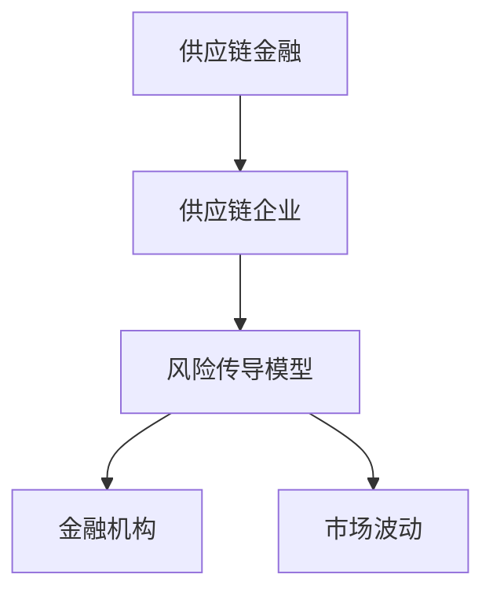
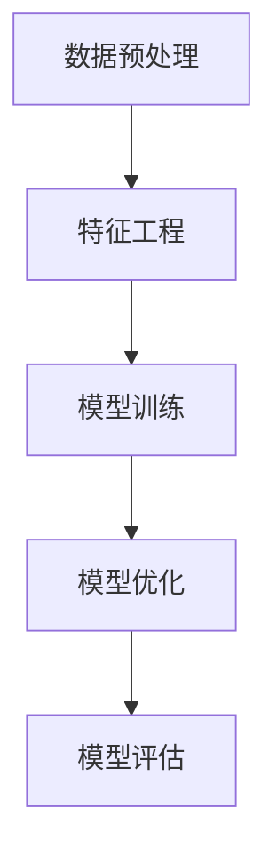
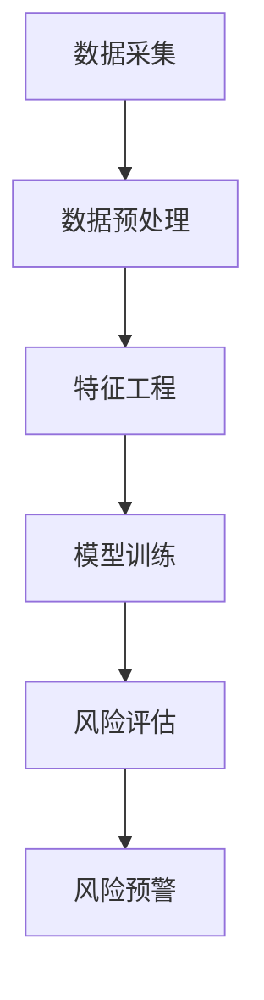
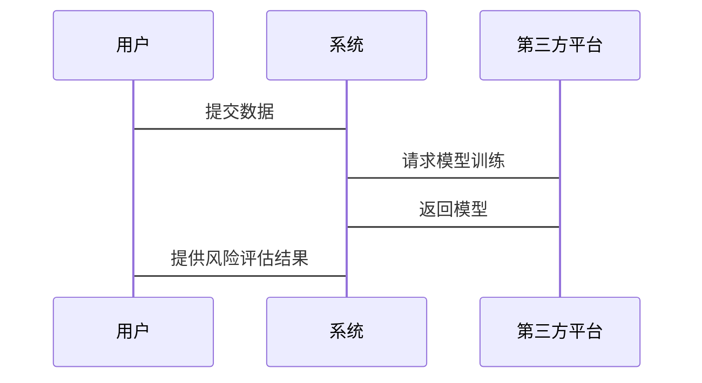

                 


# 开发智能化的供应链金融风险传导模型

> 关键词：供应链金融、风险管理、人工智能、机器学习、系统架构

> 摘要：本文详细探讨了开发智能化的供应链金融风险传导模型的全过程，从背景介绍、核心概念、算法原理、系统架构到项目实战，结合实际案例和最佳实践，为读者提供全面的理论与实践指导。文章内容涵盖供应链金融的基本概念、风险传导机制、智能化模型的设计与实现、系统架构优化以及项目实施中的关键技术与方法。

---

## 第一部分: 供应链金融与风险传导模型的背景与概念

## 第1章: 供应链金融的定义与特点

### 1.1 供应链金融的基本概念

#### 1.1.1 供应链金融的定义
供应链金融是指通过整合供应链上下游企业的资金流、物流和信息流，为供应链上的企业提供融资支持的一种金融服务模式。其核心在于通过控制物流和信息流，降低企业的融资成本，提高资金使用效率。

#### 1.1.2 供应链金融的核心特点
- **整体性**：关注整个供应链的运作，而非单一企业。
- **协作性**：依赖于供应链上下游企业的协作与信任。
- **融资性**：通过提供融资服务，支持企业的运营和发展。

#### 1.1.3 供应链金融的参与者与角色
- **核心企业**：供应链中的主导企业，通常是资金需求方。
- **供应商**：为供应链提供原材料或服务的企业。
- **银行/金融机构**：提供融资支持的金融机构。
- **第三方平台**：提供信息整合和交易支持的平台。

### 1.2 供应链金融风险传导机制

#### 1.2.1 风险传导的基本概念
风险传导是指供应链上的某一环节出现问题，导致风险沿着供应链传导至其他环节或相关方的过程。

#### 1.2.2 供应链金融中的风险类型
- **信用风险**：企业无法按时偿还贷款的风险。
- **操作风险**：供应链运作中的操作失误导致的风险。
- **市场风险**：市场波动对供应链企业的影响。
- **流动性风险**：资金链断裂导致的风险。

#### 1.2.3 风险传导的影响因素
- **供应链结构**：供应链的复杂程度影响风险传导的范围。
- **企业信用状况**：企业信用评级影响风险传导的可能性。
- **金融产品的设计**：金融产品的结构设计直接影响风险传导的方式。

### 1.3 供应链金融智能化的必要性

#### 1.3.1 传统供应链金融的痛点
- **信息不对称**：缺乏透明的信息共享机制，导致金融机构难以准确评估风险。
- **风险难以量化**：传统方法难以准确量化供应链中的各种风险因素。
- **效率低下**：人工操作为主，效率低，容易出错。

#### 1.3.2 智能化供应链金融的优势
- **数据驱动**：利用大数据和人工智能技术，提高风险评估的准确性。
- **实时监控**：通过实时数据分析，及时发现并应对潜在风险。
- **自动化决策**：智能化系统能够快速做出决策，提高效率。

#### 1.3.3 供应链金融智能化的目标与意义
- **目标**：构建智能化的风险传导模型，实现供应链金融的自动化、智能化和精准化。
- **意义**：降低供应链金融的风险，提高资金使用效率，支持供应链的稳定发展。

## 第2章: 供应链金融风险传导模型的背景

### 2.1 供应链金融风险传导模型的定义

#### 2.1.1 模型的定义与范围
供应链金融风险传导模型是一种通过分析供应链中的风险因素，预测和评估风险传导路径和影响程度的数学模型。

#### 2.1.2 模型的核心要素
- **风险源**：供应链中的风险触发点。
- **传导路径**：风险从一个环节传导到另一个环节的方式。
- **影响程度**：风险对供应链整体的影响程度。

### 2.2 供应链金融风险传导模型的背景与问题描述

#### 2.2.1 当前供应链金融中的风险问题
- **风险复杂性**：供应链涉及多个环节，风险来源多样。
- **风险传导的不确定性**：风险传导路径复杂，难以预测。
- **风险管理的难度**：传统方法难以应对复杂的风险环境。

#### 2.2.2 风险传导模型的必要性
- **提高风险管理能力**：通过模型预测和评估风险，提前采取应对措施。
- **优化供应链运作**：通过模型分析，优化供应链结构，降低风险传导的可能性。

#### 2.2.3 模型的应用场景与目标
- **应用场景**：供应链金融中的融资决策、风险评估、风险预警。
- **目标**：构建一个能够实时监测和预测供应链风险的模型。

### 2.3 供应链金融风险传导模型的核心概念

#### 2.3.1 风险传导的核心原理
风险传导是通过供应链中的各个环节，将某一环节的风险传递到其他环节的过程。其核心在于分析风险的传播路径和影响程度。

#### 2.3.2 模型的输入与输出
- **输入**：供应链中的各项数据，包括企业的信用状况、供应链结构、市场波动等。
- **输出**：风险传导的路径、影响程度和应对策略。

#### 2.3.3 模型的假设与限制
- **假设**：假设供应链中的各环节之间存在明确的依赖关系，风险传导路径是可预测的。
- **限制**：模型的准确性依赖于数据的完整性和质量，实际应用中可能受到数据不足的限制。

---

## 第二部分: 供应链金融风险传导模型的核心概念与联系

## 第3章: 供应链金融风险传导模型的核心概念与联系

### 3.1 核心概念的原理与特点

#### 3.1.1 核心概念的原理
供应链金融风险传导模型通过分析供应链中的各个因素，预测风险的传导路径和影响程度。其核心在于构建一个能够反映供应链结构和风险因素的数学模型。

#### 3.1.2 核心概念的特点
- **动态性**：供应链中的风险因素是动态变化的，模型需要能够实时更新。
- **复杂性**：供应链涉及多个环节和因素，模型需要考虑多方面的关系。
- **可量化性**：模型需要将各种因素量化，以便进行精确的分析和预测。

### 3.2 核心概念的对比与分析

#### 3.2.1 核心概念的对比
- **供应链金融与传统金融的对比**
  - 传统金融关注单一企业，而供应链金融关注整个供应链。
  - 供应链金融强调企业间的协作，而传统金融强调企业的独立性。
- **风险传导模型与其他风险模型的对比**
  - 其他风险模型可能关注单一企业或市场风险，而供应链金融风险传导模型关注整个供应链的风险传导。

#### 3.2.2 核心概念的联系
- **供应链结构与风险传导**：供应链的结构直接影响风险传导的方式和路径。
- **企业信用与风险传导**：企业的信用状况影响风险传导的可能性和影响程度。
- **市场波动与风险传导**：市场波动是供应链风险传导的重要外部因素。

### 3.3 核心概念的ER实体关系图

```mermaid
er
actor 供应链金融风险传导模型
  has 多对多
  relates to 供应链企业
  relates to 金融机构
  relates to 市场波动
```

### 3.4 核心概念的流程图



---

## 第三部分: 供应链金融风险传导模型的算法原理

## 第4章: 供应链金融风险传导模型的算法原理

### 4.1 数据预处理与特征工程

#### 4.1.1 数据预处理
- **数据清洗**：去除重复数据、缺失数据和异常值。
- **数据标准化**：对数据进行标准化处理，以便模型能够更好地处理数据。
- **数据分割**：将数据分为训练集、验证集和测试集。

#### 4.1.2 特征工程
- **特征选择**：选择对风险传导影响较大的特征，如企业信用评分、供应链长度等。
- **特征提取**：通过主成分分析等方法，提取特征的主成分，降低维度。

### 4.2 模型训练与优化

#### 4.2.1 模型选择
- **线性回归**：适用于线性关系的预测。
- **随机森林**：适用于非线性关系的预测。
- **神经网络**：适用于复杂的非线性关系。

#### 4.2.2 模型训练
- 使用训练数据对模型进行训练，调整模型参数，使模型能够准确预测风险传导。

#### 4.2.3 模型优化
- 使用验证集对模型进行优化，调整超参数，防止过拟合。

### 4.3 模型评估与预测

#### 4.3.1 模型评估
- **准确率**：模型预测正确的比例。
- **召回率**：模型预测出的正样本中实际为正样本的比例。
- **F1分数**：综合准确率和召回率的指标。

#### 4.3.2 模型预测
- 使用测试数据对模型进行预测，评估模型的性能。

### 4.4 算法流程图



---

## 第四部分: 供应链金融风险传导模型的系统架构设计

## 第5章: 供应链金融风险传导模型的系统架构设计

### 5.1 系统功能设计

#### 5.1.1 系统功能模块
- **数据采集模块**：采集供应链中的各项数据。
- **风险评估模块**：对供应链中的风险进行评估。
- **风险预警模块**：根据模型预测结果，发出风险预警。

#### 5.1.2 系统功能流程
- 数据采集模块采集数据，传输至数据预处理模块进行清洗和标准化。
- 数据预处理模块将数据传输至特征工程模块，提取特征。
- 特征工程模块将特征传输至模型训练模块，训练模型。
- 模型训练模块将模型传输至风险评估模块，进行风险评估。
- 风险评估模块根据评估结果，触发风险预警模块发出预警。

### 5.2 系统架构设计

#### 5.2.1 系统架构图


#### 5.2.2 系统接口设计
- **数据接口**：与供应链系统和金融机构系统对接，获取相关数据。
- **模型接口**：与第三方AI平台对接，获取模型训练和预测服务。

#### 5.2.3 系统交互流程图


---

## 第五部分: 供应链金融风险传导模型的项目实战

## 第6章: 供应链金融风险传导模型的项目实战

### 6.1 环境搭建与安装

#### 6.1.1 环境搭建
- **操作系统**：Windows/Mac/Linux
- **编程语言**：Python 3.6+
- **开发工具**：Jupyter Notebook/PyCharm
- **依赖库**：numpy、pandas、scikit-learn、tensorflow

#### 6.1.2 安装步骤
1. 安装Python
2. 安装必要的依赖库：
   ```bash
   pip install numpy pandas scikit-learn tensorflow
   ```

### 6.2 系统核心实现

#### 6.2.1 数据预处理代码
```python
import pandas as pd
import numpy as np

# 数据加载
data = pd.read_csv('supply_chain_data.csv')

# 数据清洗
data.dropna(inplace=True)

# 数据标准化
from sklearn.preprocessing import StandardScaler
scaler = StandardScaler()
scaled_data = scaler.fit_transform(data)
```

#### 6.2.2 模型训练代码
```python
from sklearn.ensemble import RandomForestRegressor
from sklearn.metrics import mean_squared_error

# 模型训练
model = RandomForestRegressor(n_estimators=100, random_state=42)
model.fit(scaled_data_train, labels_train)

# 模型预测
predictions = model.predict(scaled_data_test)
print(mean_squared_error(labels_test, predictions))
```

#### 6.2.3 风险预警代码
```python
from sklearn import preprocessing

# 风险预警
threshold = 0.8
probabilities = model.predict_proba(new_data)
预警 = probabilities[:, 1] > threshold
print(预警)
```

### 6.3 实际案例分析

#### 6.3.1 案例背景
某制造企业供应链涉及多个供应商和分销商，希望通过风险传导模型预测潜在的风险。

#### 6.3.2 数据分析
通过对历史数据的分析，发现供应链中的某些环节存在较高的信用风险。

#### 6.3.3 模型应用
使用训练好的模型对当前数据进行预测，发现存在较高的市场波动风险，触发风险预警机制。

### 6.4 项目小结

#### 6.4.1 核心代码实现
- 数据预处理
- 模型训练
- 风险预警

#### 6.4.2 实际案例分析
- 数据分析
- 模型应用
- 风险预警

---

## 第六部分: 供应链金融风险传导模型的最佳实践与小结

## 第7章: 供应链金融风险传导模型的最佳实践与小结

### 7.1 最佳实践

#### 7.1.1 数据质量管理
- 确保数据的准确性和完整性。
- 定期更新数据，保持数据的时效性。

#### 7.1.2 模型优化
- 定期对模型进行优化，提高预测的准确性。
- 引入新的算法，如深度学习模型，提高模型的性能。

#### 7.1.3 系统维护
- 定期检查系统运行状态，确保系统的稳定性和安全性。
- 对系统进行备份和恢复，防止数据丢失。

### 7.2 小结

#### 7.2.1 核心内容回顾
- 供应链金融的基本概念
- 风险传导模型的核心原理
- 算法实现与系统架构设计
- 项目实战与案例分析

#### 7.2.2 未来发展
- 引入更多的数据源，提高模型的准确性。
- 结合区块链技术，提高数据的安全性和可信度。
- 拓展模型的应用场景，支持更多的业务需求。

### 7.3 注意事项

#### 7.3.1 数据隐私与安全
- 确保数据的隐私和安全，防止数据泄露。
- 符合相关法律法规，保护用户隐私。

#### 7.3.2 模型的可解释性
- 提高模型的可解释性，便于用户理解和信任。
- 对模型的预测结果进行解释，帮助用户更好地理解风险。

#### 7.3.3 系统的可扩展性
- 设计系统时考虑可扩展性，便于未来的功能扩展。
- 采用模块化设计，方便系统升级和维护。

### 7.4 拓展阅读

#### 7.4.1 相关书籍
- 《供应链金融：理论与实践》
- 《人工智能在金融领域的应用》

#### 7.4.2 技术博客
- 供应链金融领域的技术博客
- 人工智能在金融领域的技术博客

---

## 作者：AI天才研究院/AI Genius Institute & 禅与计算机程序设计艺术/Zen And The Art of Computer Programming

---

以上是《开发智能化的供应链金融风险传导模型》的完整目录和内容大纲，涵盖了从理论到实践的各个方面，结合实际案例和最佳实践，为读者提供了全面的指导。

