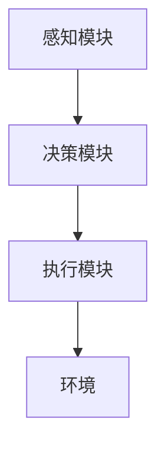

                 


# 强化学习在AI Agent任务规划中的应用

> 关键词：强化学习，AI Agent，任务规划，深度强化学习，Q-learning，Actor-Critic架构

> 摘要：本文深入探讨了强化学习在AI Agent任务规划中的应用，从强化学习的基本概念到AI Agent的任务规划，详细分析了强化学习算法的数学模型、系统架构设计以及实际项目案例。通过本文的学习，读者将能够理解强化学习在AI Agent任务规划中的核心原理和实际应用。

---

## 第1章: 强化学习概述

### 1.1 强化学习的基本概念

#### 1.1.1 强化学习的定义
强化学习（Reinforcement Learning，RL）是一种机器学习范式，通过智能体与环境的交互，学习如何采取一系列行动以最大化累计奖励。与监督学习不同，强化学习不需要明确的标签数据，而是通过奖励信号来指导学习过程。

#### 1.1.2 强化学习的核心要素
- **状态（State）**：智能体所处环境的表示。
- **动作（Action）**：智能体在某一状态下采取的行为。
- **奖励（Reward）**：智能体采取动作后所获得的反馈。
- **策略（Policy）**：智能体在给定状态下选择动作的规则。
- **值函数（Value Function）**：评估某个状态或动作的价值。

#### 1.1.3 强化学习与监督学习的区别
- **监督学习**：基于标记数据进行学习，输入已知，输出已知。
- **强化学习**：通过与环境交互，逐步探索和学习，最终找到最优策略。

### 1.2 AI Agent的基本概念

#### 1.2.1 AI Agent的定义
AI Agent是一种智能体，能够感知环境、自主决策并执行任务。AI Agent可以是软件程序、机器人或其他智能系统。

#### 1.2.2 AI Agent的分类
- **简单反射型Agent**：基于当前感知直接做出反应。
- **基于模型的规划Agent**：通过内部模型规划行动。
- **目标驱动型Agent**：基于目标选择行动。

#### 1.2.3 AI Agent的任务规划与决策
任务规划是AI Agent的核心功能，旨在通过合理的行动顺序实现目标。强化学习在任务规划中起到了关键作用，帮助AI Agent学习最优策略。

### 1.3 强化学习在AI Agent中的作用

#### 1.3.1 强化学习与任务规划的关系
强化学习通过与环境交互，帮助AI Agent学习如何在不同状态下做出最优决策，从而实现任务规划。

#### 1.3.2 强化学习在AI Agent中的应用场景
- **游戏AI**：在游戏环境中进行决策和规划。
- **机器人控制**：通过强化学习实现机器人路径规划和动作控制。
- **智能助手**：通过强化学习优化任务执行顺序。

#### 1.3.3 强化学习与多智能体系统的关系
多智能体系统中，强化学习帮助多个AI Agent协作完成复杂任务，每个Agent通过强化学习学习自己的策略。

---

## 第2章: 强化学习的核心算法

### 2.1 马尔可夫决策过程（MDP）

#### 2.1.1 状态、动作、奖励的定义
- **状态（S）**：环境的当前情况。
- **动作（A）**：智能体可以采取的行为。
- **奖励（R）**：智能体采取动作后的反馈。

#### 2.1.2 策略与价值函数
- **策略（Policy）**：$\pi(a|s)$，表示在状态$s$下采取动作$a$的概率。
- **值函数（Value Function）**：$V(s)$，表示在状态$s$下采取最优策略的期望奖励。

#### 2.1.3 动态规划与策略评估
动态规划是一种通过迭代方法计算值函数的方法。策略评估是通过动态规划计算给定策略下的值函数。

### 2.2 Q-learning算法

#### 2.2.1 Q-learning的基本原理
Q-learning是一种基于值函数的强化学习算法，通过更新Q值表来学习最优策略。Q值表示在状态$s$下采取动作$a$后的期望奖励。

$$ Q(s, a) = r + \gamma \max_{a'} Q(s', a') $$

#### 2.2.2 Q-learning的收敛性分析
Q-learning在离散状态和动作空间中具有良好的收敛性，能够逐步逼近最优策略。

#### 2.2.3 Q-learning的实现步骤
1. 初始化Q值表为零。
2. 与环境交互，获取状态$s$和动作$a$。
3. 计算新的Q值：$Q(s, a) = Q(s, a) + \alpha [r + \gamma \max Q(s', a') - Q(s, a)]$。

### 2.3 深度强化学习（Deep RL）

#### 2.3.1 Deep Q-Networks（DQN）
DQN通过神经网络近似Q值函数，能够处理高维状态空间。

$$ Q(s, a) = \theta \cdot \phi(s, a) $$

其中，$\theta$是神经网络参数，$\phi(s, a)$是状态动作的特征表示。

#### 2.3.2 策略梯度方法（Policy Gradient）
策略梯度方法直接优化策略，通过梯度上升方法最大化奖励。

$$ \nabla J(\theta) = \mathbb{E}[ \nabla \log \pi(a|s) \cdot Q(s, a) ] $$

#### 2.3.3 Actor-Critic架构
Actor-Critic结合了策略梯度和值函数，通过Actor网络选择动作，Critic网络评估策略。

---

## 第3章: AI Agent任务规划的核心概念

### 3.1 任务规划的定义与分类

#### 3.1.1 任务规划的定义
任务规划是指智能体根据环境信息，制定一系列行动以实现目标的过程。

#### 3.1.2 任务规划的类型
- **静态任务规划**：任务在执行前已确定。
- **动态任务规划**：任务在执行过程中动态调整。

#### 3.1.3 任务规划的挑战
- 环境不确定性
- 多目标冲突
- 时间约束

### 3.2 强化学习与任务规划的关系

#### 3.2.1 强化学习在任务规划中的应用
- 状态表示：将任务分解为多个子任务。
- 动作选择：根据当前状态选择最优行动。
- 奖励函数：定义任务完成的奖励。

#### 3.2.2 任务规划中的状态表示
状态表示需要包含任务目标、当前进度和环境信息。

#### 3.2.3 任务规划中的动作选择
动作选择需要考虑任务分解和优先级管理。

### 3.3 任务分解与优先级管理

#### 3.3.1 任务分解的基本原理
将复杂任务分解为多个子任务，每个子任务由一个动作序列完成。

#### 3.3.2 任务优先级的定义与计算
任务优先级根据任务的重要性和紧迫性进行排序。

#### 3.3.3 任务分解与优先级管理的结合
通过优先级管理优化任务分解顺序，提高任务执行效率。

---

## 第4章: 强化学习算法的数学模型与实现

### 4.1 Q-learning的数学模型

#### 4.1.1 Q值更新公式
$$ Q(s, a) = Q(s, a) + \alpha [r + \gamma \max Q(s', a') - Q(s, a)] $$

其中，$\alpha$是学习率，$\gamma$是折扣因子。

#### 4.1.2 动作选择策略
- **贪心策略**：以一定概率选择最优动作，避免陷入局部最优。
- **$\epsilon$-贪心策略**：以$\epsilon$的概率选择随机动作，以$1-\epsilon$的概率选择最优动作。

#### 4.1.3 奖励函数的设计
奖励函数需要根据任务目标设计，确保智能体能够通过奖励信号学习最优策略。

### 4.2 Deep Q-Networks（DQN）

#### 4.2.1 DQN的基本原理
DQN通过神经网络近似Q值函数，能够处理高维状态空间。

#### 4.2.2 DQN的实现步骤
1. 环境交互，获取状态$s$和动作$a$。
2. 计算目标Q值：$Q_{\text{target}}(s', a') = r + \gamma \max Q_{\text{main}}(s', a')$。
3. 更新主网络参数：$\theta = \theta + \alpha (Q_{\text{target}} - Q_{\text{main}})$。

#### 4.2.3 DQN的优缺点
- 优点：能够处理高维状态空间。
- 缺点：需要经验回放和目标网络，增加实现复杂度。

---

## 第5章: AI Agent的系统架构设计

### 5.1 系统功能设计

#### 5.1.1 系统功能模块
- **感知模块**：获取环境信息。
- **决策模块**：基于强化学习算法进行决策。
- **执行模块**：执行决策动作。

#### 5.1.2 系统功能流程
1. 感知模块获取环境信息。
2. 决策模块根据当前状态选择动作。
3. 执行模块执行动作并反馈奖励。

### 5.2 系统架构设计

#### 5.2.1 系统架构图


#### 5.2.2 系统模块交互
- 感知模块与环境交互，获取状态信息。
- 决策模块根据状态信息选择动作。
- 执行模块执行动作并反馈奖励。

### 5.3 系统接口设计

#### 5.3.1 系统接口描述
- **输入接口**：环境状态信息。
- **输出接口**：动作选择结果。

#### 5.3.2 接口交互流程
1. 系统接收环境状态信息。
2. 决策模块选择动作。
3. 系统输出动作结果。

---

## 第6章: 项目实战

### 6.1 环境配置

#### 6.1.1 环境选择
选择适合强化学习任务的环境，例如OpenAI Gym中的CartPole环境。

#### 6.1.2 环境安装
安装必要的库，例如：
```bash
pip install gym numpy tensorflow
```

### 6.2 核心实现

#### 6.2.1 Q-learning实现
```python
class QLearning:
    def __init__(self, state_space, action_space):
        self.state_space = state_space
        self.action_space = action_space
        self.Q = np.zeros((state_space, action_space))

    def choose_action(self, state, epsilon):
        if np.random.random() < epsilon:
            return np.random.randint(self.action_space)
        else:
            return np.argmax(self.Q[state])

    def update(self, state, action, reward, next_state, gamma, alpha):
        self.Q[state, action] += alpha * (reward + gamma * np.max(self.Q[next_state]) - self.Q[state, action])
```

#### 6.2.2 DQN实现
```python
import tensorflow as tf

class DQN:
    def __init__(self, state_dim, action_dim):
        self.state_dim = state_dim
        self.action_dim = action_dim
        self.model = self.build_model()

    def build_model(self):
        model = tf.keras.Sequential([
            tf.keras.layers.Dense(64, activation='relu'),
            tf.keras.layers.Dense(64, activation='relu'),
            tf.keras.layers.Dense(self.action_dim)
        ])
        return model

    def get_action(self, state, epsilon):
        if np.random.random() < epsilon:
            return np.random.randint(self.action_dim)
        else:
            predictions = self.model.predict(state)
            return np.argmax(predictions[0])
```

### 6.3 案例分析

#### 6.3.1 案例选择
选择一个具体的任务规划问题，例如机器人路径规划。

#### 6.3.2 案例实现
在机器人路径规划中，使用DQN算法实现路径选择和导航。

#### 6.3.3 案例分析
分析算法在任务规划中的表现，优化算法参数，提高任务完成效率。

---

## 第7章: 扩展与展望

### 7.1 强化学习的前沿应用
- **多智能体协作**：研究多个AI Agent协作完成复杂任务。
- **元强化学习**：研究强化学习算法的自适应优化。

### 7.2 任务规划的未来研究方向
- **动态环境下的任务规划**：研究如何在动态环境中快速调整任务规划。
- **多目标优化**：研究如何在多目标条件下进行任务规划。

### 7.3 个人见解与总结
强化学习在AI Agent任务规划中的应用前景广阔，未来的研究需要结合实际应用场景，优化算法性能，提高任务规划的效率和质量。

---

## 作者信息

作者：AI天才研究院/AI Genius Institute & 禅与计算机程序设计艺术 /Zen And The Art of Computer Programming

---

以上是关于“强化学习在AI Agent任务规划中的应用”的完整文章结构和内容。希望本文能够为读者提供清晰的思路和深入的分析，帮助您更好地理解和应用强化学习技术。

